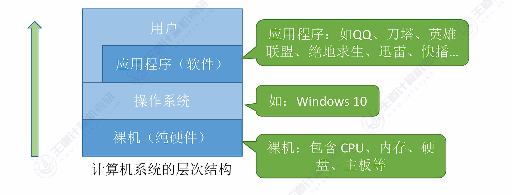
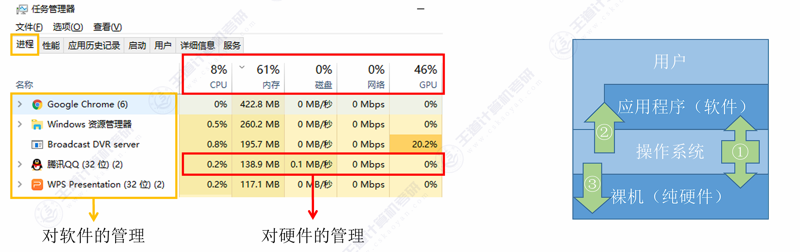
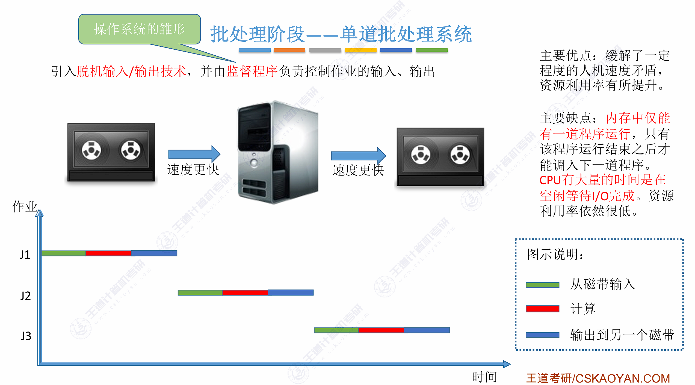
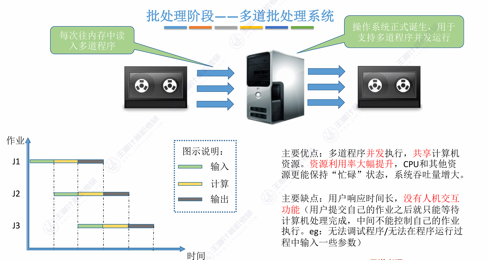
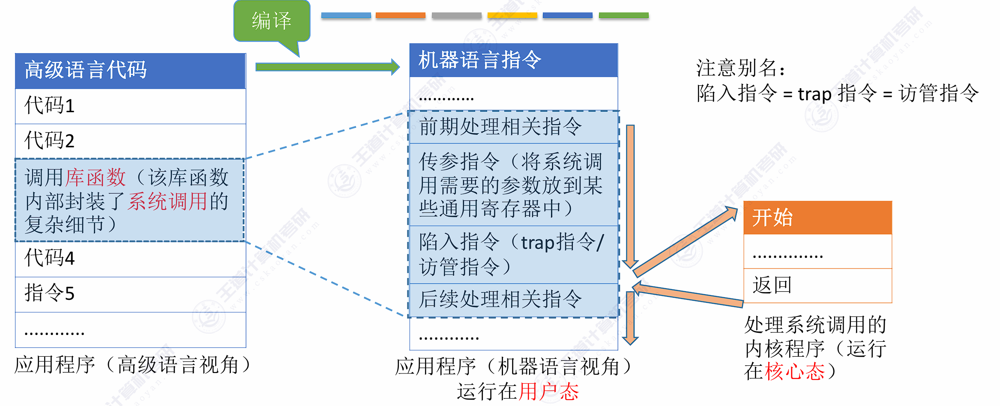
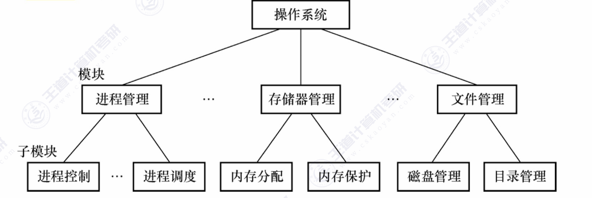
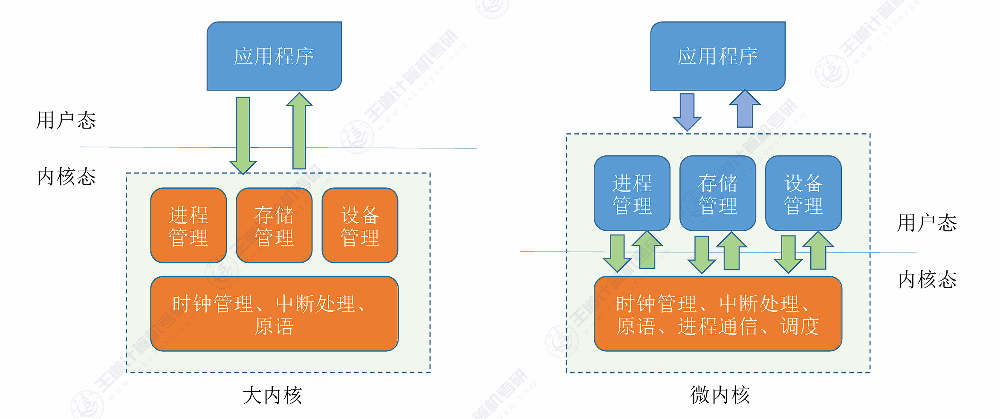
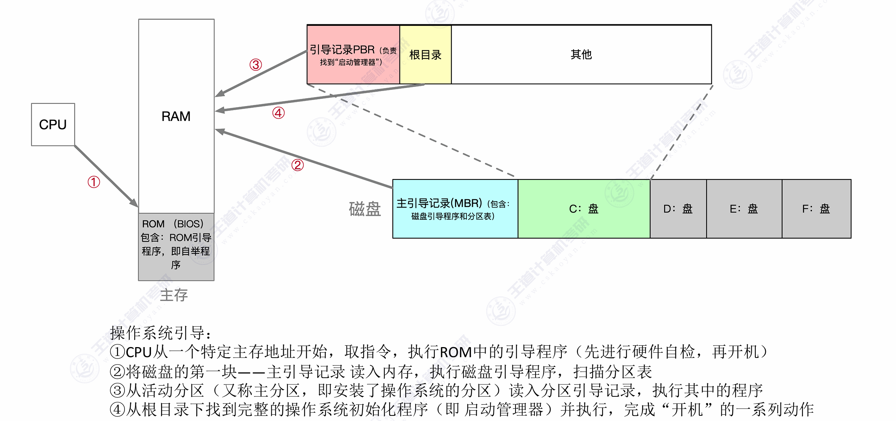
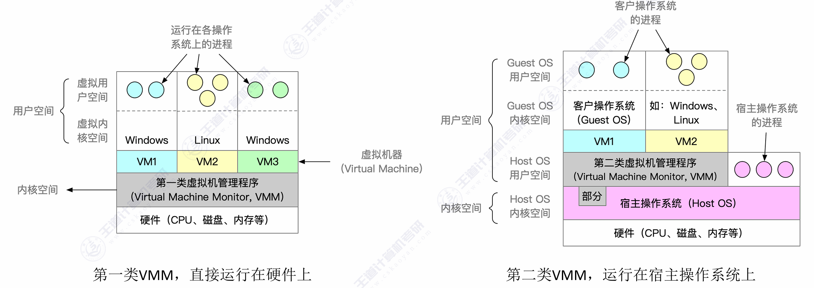

<h2 align="center">第一章 操作系统概论</h2>

> **408 高频考点提醒**：
> - 操作系统的定义与 **四个基本特性**（"并发与共享互为存在条件"是选择题常客）
> - 发展历程：单道批处理（监督程序）、多道批处理（**OS 正式诞生**）、分时（**解决人机交互**）、实时（**解决及时性**）
> - 内核态/用户态、特权指令/非特权指令，**状态切换的唯一途径与本质**
> - 中断与异常的分类：陷阱（陷入）/故障/终止、内中断/外中断
> - 系统调用的执行过程，**访管指令在用户态执行**
> - 大内核 vs 微内核、第一类/第二类虚拟机

---

### （一）操作系统的基本概念

#### 一、操作系统的定义

##### 1. 什么是操作系统

操作系统（Operating System, OS）是指**控制和管理**整个计算机系统的**硬件和软件资源**，合理地组织调度计算机的工作和资源的分配，以**给用户和其他软件提供方便接口与环境**的程序集合。它是计算机系统中**最基本、最重要的系统软件**。

**计算机系统的层次结构**：



- 操作系统**位于硬件之上、应用程序之下**，是两者之间的"中间人"
- 它**直接管理硬件**，又为上层应用提供**服务**

##### 2. 从三个角度理解操作系统



**① 作为系统资源的管理者**

操作系统管理四类资源，对应四大管理功能：

| 管理功能 | 管理对象 | 主要工作 |
|:---|:---|:---|
| **处理机管理** | CPU（进程） | 进程控制、进程同步、进程通信、处理机调度 |
| **存储器管理** | 内存 | 内存分配与回收、地址映射、内存保护与共享、内存扩充 |
| **文件管理** | 外存中的文件 | 文件存储空间管理、目录管理、文件读/写管理、文件保护 |
| **设备管理** | 各类 I/O 设备 | 设备分配与回收、缓冲管理、设备驱动、设备保护 |

> 处理机管理的本质是**进程管理**——多个程序轮流使用 CPU。

**② 作为用户与计算机硬件之间的接口**

操作系统向上层提供三种服务（接口）：

| 接口 | 使用者 | 形式 |
|:---|:---|:---|
| **命令接口** | 普通用户 | **联机命令接口**（交互式，"说一句做一句"，如 cmd）；**脱机命令接口**（批处理，"说一堆做一堆"，如 .bat 脚本） |
| **程序接口（系统调用）** | 程序员/应用程序 | 由一组**系统调用**组成，程序通过它请求内核服务 |
| **GUI（图形用户界面）** | 普通用户 | 图形化操作界面（严格来说 GUI 不算操作系统的一部分，而是借助命令接口与图形库实现的程序） |

**③ 作为最接近硬件的一层——扩充机器**

操作系统对硬件机器进行了扩展，把"裸机"包装成功能更强、更方便使用的机器。把覆盖了软件的机器称为**扩充机器（虚拟机）**。

> **易错点**：命令接口（联机/脱机）是操作系统**提供**的；GUI 通常**不属于**操作系统本身。

#### 二、操作系统的基本特性

操作系统有四大特征：**并发、共享、虚拟、异步**。其中**并发**和**共享**是**两个最基本的特征**，二者**互为存在条件**。

##### 1. 并发（最基本特征）

两个或多个事件在**同一时间间隔**内发生。

- **宏观上同时发生，微观上交替发生**（单核 CPU 上，进程轮流使用 CPU）
- 例子：一边听歌一边打字，CPU 在两条程序之间快速切换

**并发 vs 并行**：

| | 并发 | 并行 |
|:---|:---|:---|
| 时间 | 同一**时间间隔**内 | 同一**时刻** |
| 微观 | 交替发生（轮流） | 同时发生 |
| 硬件要求 | 单核即可 | 需要多核/多处理器 |

> 单核 CPU 上，多个进程只能**并发**、不可能**并行**；只有多核才能并行。

##### 2. 共享

系统中的资源可供内存中多个并发执行的进程共同使用，分为两种方式：

| 共享方式 | 含义 | 例子 |
|:---|:---|:---|
| **互斥共享** | 一个时间段内**只允许一个进程**访问该资源（临界资源） | 打印机、磁带机、某些内存单元 |
| **同时共享** | 一个时间段内允许**多个进程"同时"**访问（宏观同时，微观交替） | 磁盘、可重入代码、全局变量 |

> 注意："同时"是**宏观**意义上的，微观上仍是交替访问。

**并发与共享互为存在条件**：
- **并发是共享的前提**：若没有并发，资源就不存在被多个进程同时使用的问题
- **共享是并发的必然结果**：若资源不能共享，进程就无法并发执行

##### 3. 虚拟

**虚拟**是指把一个物理上的实体变为**若干个逻辑上的对应物**。通过虚拟技术，物理资源被"变多"了：

| 虚拟技术 | 原理 | 例子 |
|:---|:---|:---|
| **时分复用** | 把物理时间分成片，轮流服务多个对象 | **虚拟处理器**：一个 CPU 虚拟成多个"逻辑 CPU"，供多个进程轮流使用 |
| **空分复用** | 把物理空间划分给多个对象 | **虚拟存储器**：用外存扩充内存，使程序感觉内存很大 |

> - 虚拟**以并发为前提**：没有并发性就谈不上虚拟性（没有多个程序同时运行，一个 CPU 何须虚拟成多个？）
> - 区分：虚拟处理器 = 时分复用；虚拟内存 = 空分复用（选择题常考）

##### 4. 异步

在多道程序环境下，由于资源有限，进程的执行**走走停停**，以**不可预知的速度**向前推进。

- 进程什么时候被调度、运行多久，事先无法确定
- **只有系统拥有并发性，才可能导致异步性**（并发进程相互竞争资源 → 推进速度不确定）

**四大特性关系图**：

```
  并发 ──互为存在条件──► 共享          （两个最基本的特征）
   │
   ├─► 虚拟：没有并发就没有虚拟（时分复用/空分复用）
   └─► 异步：只有并发才可能导致异步（走走停停、不可预知）
```

#### 三、操作系统的目标和功能

##### 1. 操作系统的目标

| 目标 | 含义 |
|:---|:---|
| **方便性** | 使计算机更易于使用（用户不用了解硬件细节） |
| **有效性** | 提高系统资源利用率、提高系统吞吐量 |
| **可扩充性** | 方便地增加新功能、适应新的硬件 |
| **开放性** | 遵循标准，能与其他系统互联互通 |

##### 2. 操作系统作为资源管理者的功能

操作系统管理资源的**通用工作环节**：① 监视资源状态 → ② 确定分配策略 → ③ 实施资源分配 → ④ 回收资源 → ⑤ 保护资源。

| 功能 | 具体内容 |
|:---|:---|
| **处理机管理** | 进程控制（创建/撤销）、进程同步与互斥、进程通信、处理机调度（作业调度/进程调度） |
| **存储器管理** | 内存分配与回收、地址映射（逻辑地址→物理地址）、内存保护与共享、内存扩充（虚拟内存） |
| **文件管理** | 文件存储空间管理、目录管理、文件读/写管理与保护 |
| **设备管理** | 设备分配与回收、缓冲管理、设备驱动，**屏蔽（隐藏）I/O 设备的差异性** |

> 操作系统管理资源的目标：**安全、高效**。

---

### （二）操作系统的发展历程

> 发展历程是选择题高频考点，重点掌握：**每个阶段解决了什么问题、带来了什么缺点**。

```
人工操作 ──► 单道批处理 ──► 多道批处理 ──► 分时系统 ──► 实时系统
  无 OS      监督程序      OS 正式诞生      人机交互      及时性
```

#### 一、人工操作方式（无操作系统）

**阶段特点**：计算机全部资源由用户独占，程序的装入、运行、结果输出全过程依赖**人工操作**。

**主要缺点**：
- **用户独占全机**：一个人使用，其他人排队等待
- **人机速度矛盾**：人的操作速度（秒级）与 CPU 的运算速度（毫秒/微秒级）严重不匹配，CPU 大量时间空闲
- **资源利用率极低**

**改进——脱机输入/输出技术**：
- 引入一台功能简单的**外围机（卫星机）**，不与主机直接相连
- **输入**：外围机先把纸带/卡片上的作业读入**高速磁带**（预先完成）；主机从磁带读作业，速度远快于直接读纸带
- **输出**：主机把结果写到磁带，再由外围机从磁带输出到打印机
- **效果**：**主机与慢速 I/O 设备脱离**，主机不再直接等待慢速设备，缓解了人机速度矛盾

```
┌──────────┐ low-speed  ┌───────────┐ high-speed  ┌──────────┐
│  Input   │───────────►│ Satellite │───────────►│   Tape   │───────────► Main
│  device  │ paper tape │ (off-line)│ mag. tape  │ (storage)│  load to memory
└──────────┘            └───────────┘            └──────────┘
```

#### 二、批处理阶段

##### 1. 单道批处理系统

**引入**：脱机输入/输出技术 + **监督程序**（常驻内存，是操作系统的雏形）。

**工作流程**：作业成批装入磁带 → 监督程序自动把磁带上的作业**逐个**调入内存 → 作业完成后自动调入下一个作业（先调入者先完成）。



**三大特点**：

| 特点 | 含义 |
|:---|:---|
| **自动性** | 作业自动地一个接一个地被处理，无需人工干预 |
| **顺序性** | 作业按磁带上的顺序依次装入内存 |
| **单道性** | 内存中**只允许一道用户程序**运行 |

**优点**：缓解了人机速度矛盾，资源利用率有所提高。

**缺点**：
- 内存中仅有一道程序，**CPU 大量时间在等待 I/O**（程序计算时 I/O 空闲，I/O 工作时 CPU 空闲）
- 资源利用率仍然很低

##### 2. 多道批处理系统

**多道程序设计技术**：内存中同时存放**多道相互独立的程序**，它们**共享** CPU 和外部设备等资源，由操作系统统一调度，**并发执行**。



**两个技术前提**：需要**中断技术**（设备完成/出错时打断 CPU）和**通道技术**（独立于 CPU 的 I/O 控制部件）的支持。

**三大特征（教材 P8）**：

| 特征 | 含义 |
|:---|:---|
| **多道性** | 内存中同时存放**多道相互独立**的程序，宏观上并发执行 |
| **无序性** | 作业进入/完成的先后顺序与作业提交顺序**无序**（先提交未必先完成） |
| **调度性** | 需要两级调度——**作业调度**（从外存后备队列挑选作业入内存）与**进程调度**（为作业分配 CPU） |

```
单道：[计算───I/O等待───计算───I/O等待]      CPU 大量空闲
多道：程序A [计算─][I/O→设备忙] [计算─]
     程序B       [计算────][I/O]──[计算]
     → CPU 在 A 等待 I/O 时切换给 B，CPU 与 I/O 设备并行工作
```

**优点**：
- **资源利用率大幅提升**（CPU 与 I/O 设备并行工作）
- **系统吞吐量大**

**缺点**：
- **没有人机交互**：作业提交后用户无法干预，必须等整个作业处理完才能得知结果
- 作业**平均周转时间长**

> **标志性考点**：**多道批处理系统标志着操作系统的正式诞生**。

**单道 vs 多道**：

| 对比项 | 单道批处理 | 多道批处理 |
|:---|:---|:---|
| 内存中的程序数 | 一道 | 多道 |
| 是否并发 | 否（顺序执行） | 是（并发执行） |
| 操作系统 | 只有监督程序（雏形） | 正式操作系统 |
| 人机交互 | 无 | 无 |
| 资源利用率 | 低（CPU 等待 I/O） | 高（CPU 与 I/O 并行） |

##### 3. 多道并发需要解决的问题（操作系统功能的来源）

多道程序并发带来的一系列问题，正是操作系统要解决的：

| 问题 | 对应管理功能 |
|:---|:---|
| 如何分配 CPU 给多个程序 | **处理机管理** |
| 如何分配内存、防止程序互相干扰 | **存储器管理** |
| 如何管理海量文件 | **文件管理** |
| 如何管理共享的 I/O 设备 | **设备管理** |

#### 三、分时系统

**产生背景**：多道批处理没有**人机交互**，用户提交作业后无法控制，等待时间长。

**核心思想——时间片轮转**：把 CPU 的时间划分为**时间片**，按时间片**轮流**为各个用户/作业服务。每个作业在一个时间片内运行，时间片用完立即切换到下一个作业。

```
┌──────┬──────┬──────┬──────┬──────┬──────┬────
│ User1│ User2│ User3│ User4│ User1│ User2│ ...
└──────┴──────┴──────┴──────┴──────┴──────┴────
  ←── time slice ──→
```

**四个特征**：

| 特征 | 含义 |
|:---|:---|
| **同时性（多路性）** | 多个用户通过终端**同时使用**一台主机 |
| **独立性** | 每个用户各占一个终端，互不干扰，感觉**独占**计算机 |
| **及时性** | 用户请求能在**很短时间内**获得响应 |
| **交互性** | 用户能与系统**人机对话**，边操作边修改 |

**优点**：**解决了人机交互问题**，用户可及时获得响应、随时干预程序的运行。

**缺点**：**不能优先处理紧急任务**（时间片轮流，紧急任务也得排队）。

#### 四、实时系统

**产生背景**：分时系统不能及时响应**紧急事件**（如导弹控制、工业过程控制）。

**定义**：系统能在**规定的时间限制（截止时间）内**完成对**外部事件**的处理，并控制所有实时任务协调一致地运行。

**两类实时系统**：

| 类型 | 要求 | 例子 |
|:---|:---|:---|
| **硬实时系统** | 必须**绝对严格**地在规定时间内完成 | 导弹制导、自动驾驶、工业过程控制 |
| **软实时系统** | **偶尔**超过规定时间可以接受 | 多媒体播放、虚拟现实、信息查询 |

**特征**：**及时性**（响应时间可预测）、**高可靠性**、强时效性。

**分时 vs 实时**：

| 对比项 | 分时系统 | 实时系统 |
|:---|:---|:---|
| 服务对象 | 人（多个用户终端） | 外部事件/任务 |
| 核心目标 | 交互性、公平性 | **及时性、可靠性** |
| 响应要求 | 尽快（时间片轮流） | **必须在截止时间内** |
| 优先级处理 | 轮流（无紧急优先） | 紧急任务优先处理 |

#### 五、其它几种操作系统

> 大纲以了解为主，掌握各类型的一句话特点即可。

| 类型 | 核心特点 |
|:---|:---|
| **网络操作系统** | 在计算机网络（各自独立的计算机互连）上提供网络通信、资源共享、远程访问；各结点**有自己的操作系统**，地位平等 |
| **分布式操作系统** | 多台计算机通过网络连接**协同完成一个任务**，用户看起来像**一台计算机**；特征：**分布性、并行性、透明性、共享性、健壮性** |
| **个人计算机操作系统** | 简单易用、单用户多任务（Windows、macOS、Linux 桌面版） |
| **嵌入式操作系统** | 运行在嵌入式设备中：**微型化、实时性、可裁剪、专用性**（VxWorks、FreeRTOS、μC/OS） |
| **智能手机操作系统** | 结合嵌入式与通用 OS 特点：Android（基于 Linux）、iOS；触摸交互、能耗管理 |

**网络 OS vs 分布式 OS**：网络 OS 中各计算机**自治**、各管各的；分布式 OS 由**统一的操作系统**管理全部计算机，对用户**透明**（感觉像一台机器）。

**发展历程总结表**：

| 阶段 | 关键技术/形态 | 主要缺点 | 意义 |
|:---|:---|:---|:---|
| 人工操作 | 无 OS | 用户独占全机、人机速度矛盾 | —— |
| 单道批处理 | 脱机 I/O、监督程序 | CPU 等待 I/O，利用率仍低 | OS 雏形 |
| 多道批处理 | 多道程序设计、中断、通道 | **无人机交互** | **OS 正式诞生** |
| 分时系统 | 时间片轮转 | **不能优先处理紧急任务** | 解决人机交互 |
| 实时系统 | 截止时间（deadline） | —— | 解决及时性 |

---

### （三）操作系统的设计和运行环境

#### 一、处理器的运行模式

##### 1. 两种指令

| 指令 | 定义 | 例子 | 可执行者 |
|:---|:---|:---|:---|
| **特权指令** | 具有特殊权限、影响系统安全的指令 | I/O 指令（启动外设）、置中断屏蔽/关中断指令、清内存指令、设置时钟指令、切换 CPU 状态指令、进程切换指令 | **仅内核态** |
| <nobr>**非特权指令**<nobr> | 普通指令 | 算术运算、逻辑运算、移位、取数/存数、数据传送 | 用户态、内核态均可 |

> 用户态程序若试图执行特权指令，会触发**异常（非法指令/保护违例）**，由内核代为处理。

##### 2. 两种处理器状态

| 状态 | 别名 | 运行内容 | 指令权限 |
|:---|:---|:---|:---|
| **内核态** | 核心态、管态、特权态 | 操作系统内核程序 | 可执行**特权指令** |
| **用户态** | 目态、普通态 | 应用程序 | 只能执行**非特权指令** |

- 处理器状态存放在**程序状态字寄存器（PSW）** 的状态位中
- **内核态与用户态的本质区别**：能否执行特权指令

**状态转换（选择题必考）**：

```
  用户态 ──── 中断 / 异常 / 系统调用 ────► 内核态   （唯一途径，由硬件自动完成）
  内核态 ──── 执行特权指令修改 PSW ─────► 用户态   （操作系统主动让出 CPU）
```

| 转换方向 | 触发方式 | 谁完成 |
|:---|:---|:---|
| 用户态 → 内核态 | **中断**（内中断/外中断，含系统调用引发的陷入） | **硬件自动完成**（中断响应机制） |
| 内核态 → 用户态 | 内核执行**特权指令**修改 PSW 状态位 | 操作系统主动 |

> - 用户态→内核态是**唯一的**，只能通过中断
> - 内核态→用户态是操作系统**主动让权**

##### 3. 操作系统内核的组成

| 内核组成部分 | 内容 | 说明 |
|:---|:---|:---|
| **时钟管理** | 计时、时间片轮转的依据 | 分时系统的基础 |
| **中断机制** | 中断处理程序 | 用户态→内核态的入口 |
| **原语** | 设备驱动、CPU 切换、进程通信 | **原子操作**：不可被中断，运行时间短且调用频繁，位于最底层 |
| **系统控制的数据结构及处理** | 进程管理（PCB）、存储器管理（内存分配回收）、设备管理（缓冲管理） | 内核直接管理的数据结构 |

##### 4. 内核态与用户态的应用场景

- **系统调用**：用户程序通过陷入指令从用户态进入内核态执行（见下文系统调用）
- **设备驱动**：传统大内核中运行在内核态
- 应用程序只能看到用户态：普通指令 + 调用系统调用接口

#### 二、中断和异常的概念

##### 1. 中断的定义与作用

**中断的定义**：程序执行过程中，当发生某个事件时，**中止 CPU 上现行程序的运行**，引出**处理该事件的程序执行**的过程。

**中断的作用**：中断是让**操作系统内核强行夺回 CPU 控制权**的机制，也是**实现多道程序并发的前提**——没有中断，用户程序一旦运行，CPU 就永远不会交还给操作系统。

##### 2. 中断的分类

$$
\text{中断}\begin{cases}
\text{内中断（异常）——CPU 内部、与指令有关}\begin{cases}
\text{陷阱（trap）：系统调用、断点调试}\\
\text{故障（fault）：缺页、除零、非法指令}\\
\text{终止（abort）：硬件致命错误}
\end{cases}\\
\text{外中断（狭义中断）——CPU 外部、与指令无关}\begin{cases}
\text{可屏蔽中断（INTR）：时钟中断、I/O 中断}\\
\text{不可屏蔽中断（NMI）：电源掉电、内存校验错}
\end{cases}
\end{cases}
$$

**① 内中断（异常、例外，exception）**：信号来源于 **CPU 内部**，与当前执行的指令有关，通常**不可屏蔽**。

| 类型 | 成因 | 可否恢复 | 例子 |
|:---|:---|:---|:---|
| **陷阱/陷入（trap）** | 程序**有意**引发（通过指令请求服务） | —— | **系统调用**（访管指令）、条件陷阱指令、断点调试 |
| **故障（fault）** | 错误条件引起，**可能被修复** | 可恢复 | **缺页故障**、除数为 0、**运算溢出**、非法指令（操作码错误）、非法地址（越界） |
| **终止（abort）** | 不可恢复的**致命硬件错误** | 不可恢复 | 控制器故障、内存校验错、总线错 |

> **易错点**：系统调用 ≠ 陷入指令。系统调用是**目的**（请求内核服务），陷入指令（访管指令）是**实现手段**——产生内中断的指令。

**② 外中断（狭义的中断，interrupt）**：信号来源于 **CPU 外部**，与当前执行的指令无关，通常**可屏蔽**。

| 类型 | 例子 |
|:---|:---|
| **时钟中断** | 时钟芯片定时产生，用于计时与**时间片轮转** |
| **I/O 中断** | 外部设备完成数据传输或出错时发出 |
| 其他 | 键盘输入、电源故障（不可屏蔽）等 |

> 外中断进一步分为**可屏蔽中断（INTR）**与**不可屏蔽中断（NMI）**；NMI 如电源掉电、内存奇偶校验错。

**③ 另一种分类角度：强迫性中断事件与自愿性中断事件（教材）**

从中断事件的**性质和激活的手段**来看，中断可分为两类：

| 分类 | 是否现行程序所期待 | 引发原因 | 细分 |
|:---|:---|:---|:---|
| **强迫性中断事件** | 否（意外事故或外部请求） | 不是正在运行的程序所期待的 | ① 机器故障中断事件 ② 程序性中断事件 ③ 外部中断事件 ④ 输入输出中断事件 |
| **自愿性中断事件** | 是（程序主动期待） | 正在运行的程序对 OS 有某种需求 | 访管中断：执行**访管指令**时自愿停止现行程序，转入访管中断处理程序 |

- **机器故障中断事件**：硬件故障，如电源故障、内存校验错（对应**终止 abort**）
- **程序性中断事件**：程序运行出错，如除零、溢出、越界、非法指令（对应**故障 fault**）
- **外部中断事件**：时钟、键盘等外部信号（对应**外中断**）
- **输入输出中断事件**：I/O 操作完成或出错（对应**外中断**）
- **自愿性中断事件** = **陷入（trap）**：程序主动通过访管指令请求 OS 服务（对应**系统调用**）

##### 3. 中断与异常的区别

**中断（外中断）与异常（内中断）的本质区别：异步 vs 同步**。

| 对比项 | 中断（外中断） | 异常（内中断） |
|:---|:---|:---|
| 触发方式 | 由**与现行指令无关**的中断信号触发 | 由处理器**正在执行的现行指令**引起 |
| 同步/异步 | **异步** | **同步** |
| 响应时机 | 在**两条机器指令之间**才可响应 | **一条指令执行期间**允许响应 |
| 与 CPU 状态的关系 | 与 CPU 处于**用户态还是内核态无关** | 与现行指令有关 |
| 可否屏蔽 | 通常可屏蔽（NMI 除外） | 通常不可屏蔽 |
| 服务对象 | 一般**不是为当前进程**所需（时钟中断、硬盘读写服务请求中断） | 一般**是为当前进程**所用（缺页、除零、系统调用） |
| 典型例子 | 时钟中断、I/O 中断 | 缺页、除零、非法指令、系统调用 |

> **响应时机**是判断题高频考点：中断（异步）在两条指令之间响应；异常（同步）在指令执行期间响应。

##### 4. 中断处理程序与中断处理的基本过程

**中断处理程序**：处理中断事件的程序，主要任务是**处理中断事件**和**恢复正常操作**。

- 不同中断源对应**不同的中断处理程序**，因此**快速找到中断处理程序的入口地址**是一个关键问题（由**中断向量表**解决）
- 中断处理程序主要做**四项工作**：
  1. **保护**未被硬件保护的一些必需的处理状态
  2. **识别**各个中断源，分析产生中断的原因
  3. **处理**发生的中断事件
  4. **恢复**正常操作

CPU 检测到中断信号后，根据**中断类型号**查询**中断向量表**，找到对应中断服务程序的**入口地址（中断向量）**，转入处理。

**中断处理流程（王道标准版）**：

```
① 关中断（防止保存现场时被新中断打扰）
② 保存断点（将 PC 内容压栈）
③ 引出中断服务程序（查中断向量表，取入口地址）
④ 保存现场（通用寄存器、PSW 压栈）
⑤ 开中断（允许更高优先级的中断进入）
⑥ 执行中断服务程序（真正的处理工作）
⑦ 关中断（准备恢复现场）
⑧ 恢复现场（寄存器、PSW 出栈）
⑨ 开中断
⑩ 中断返回（IRET：恢复 PC，回到断点继续执行）
```

> - **中断向量** = 中断服务程序的入口地址；**中断向量表**存放所有中断向量
> - 中断处理过程中"开/关中断"交替出现：既保证现场安全，又不阻塞更紧急的中断

#### 三、系统调用

##### 1. 概念与必要性

**系统调用**是操作系统**提供给应用程序（程序员）使用的接口**，应用程序通过系统调用请求内核的服务。

**为什么共享资源操作必须用系统调用？** 为了保证系统的**稳定和安全**——用户程序不能直接操作共享资源（如磁盘、文件、打印机），否则可能互相破坏、危及系统。与共享资源有关的操作都必须在**内核态**由内核代做。

##### 2. 系统调用的分类

| 类别 | 典型系统调用 |
|:---|:---|
| **设备管理** | 请求设备、释放设备、设备读、设备写 |
| **文件管理** | 文件的创建、删除、打开、关闭、读、写 |
| **进程控制** | 进程创建、进程撤销、进程阻塞、进程唤醒 |
| **进程通信** | 信号量操作（P/V）、消息传递、共享内存 |
| **内存管理** | 内存申请、内存释放（如 malloc → brk/mmap） |

##### 3. 系统调用的执行过程



```
用户程序（用户态）：
  ① 传递系统调用号和参数（寄存器 / 内存块 / 堆栈）
  ② 执行陷入指令（访管指令，在用户态执行！）──► 引发内中断（trap）
CPU 硬件自动切换到内核态
内核（内核态）：
  ③ 根据系统调用号查系统调用表，转入对应内核处理程序
  ④ 内核处理程序执行完毕
  ⑤ 内核态返回用户态，继续执行用户程序的下一条指令
```

```
   User mode         │       Kernel mode
┌──────────────┐     ┌──────────────────┐
│ (1) User prog│     │  │   syscall table  │
│      │       │     │  │  ┌────────────┐  │
│      ▼       │     │  │  │ #1 handler │  │
│ (2) trap ins.│────►│  │  │ #2 handler │  │
│      │       │     │  │  │ #3 handler │  │
│ (3) next ins.│◄────│  │  └────────────┘  │
└──────────────┘     └──────────────────┘
```

**关键点**：
- **陷入指令（访管指令）在用户态执行**，是用户态→内核态切换的触发器（它本身**不是**特权指令——否则用户程序根本无法执行它）
- 参数传递方式：① 寄存器直接传递；② 参数存内存块（如 PCB），寄存器传块地址；③ 堆栈传递
- 系统调用与陷入的关系：**系统调用是目的，陷入（trap）是实现系统调用的手段**

##### 4. 系统调用 vs 库函数 vs 普通函数调用

| 对比项 | 系统调用 | 库函数 | 普通函数调用 |
|:---|:---|:---|:---|
| 执行者 | 内核（内核态） | 库函数自身（用户态） | 被调函数（用户态） |
| 是否切换状态 | **是**（用户态↔内核态） | 否（一般） | 否 |
| 触发指令 | 陷入指令（trap） | 普通 CALL | 普通 CALL |
| 开销 | 大（状态切换） | 小 | 小 |
| 例子 | write()、read()、fork() | printf()、strcpy()、malloc() | 自定义函数 |

> **典型例子**：`printf()` 是库函数，在用户态完成格式转换后，内部调用 `write()` 系统调用把结果写到屏幕；`malloc()` 是库函数，内部调用 `brk()/mmap()` 系统调用向内核申请内存。

---

### （四）操作系统的结构

> 大纲以选择题为主，重点：大内核 vs 微内核的优缺点。

#### 一、传统操作系统结构（教材 1.4.1）

##### 1. 无结构操作系统

早期 OS，各功能模块之间**无清晰划分**，互相直接调用、任意修改，调试和维护都很困难（了解即可）。

##### 2. 模块化 OS 结构

**模块化**：将 OS 按功能划分为若干**具有一定独立性的模块**，每个模块具有某方面的管理功能；规定好各模块间的**接口**，使模块之间能够**通过接口通信**；还可进一步将模块细分为若干**子模块**，同样规定好子模块间的接口。



- **优点**：灵活、可加载（如 Linux 内核模块 LKM）
- **缺点**：接口定义复杂，模块间依赖多时调试困难

##### 3. 分层式 OS 结构

**分层法**：将 OS 分为若干层，**底层（层 0）为硬件，顶层（层 N）为用户接口**；**每层只能调用紧邻它的低层**的功能和服务（**单向依赖**），不能跨层调用。

```
层 N      用户接口
层 N-1      …
  ⋮          每层只调用紧邻的低层（单向依赖）
层 1        …
层 0       硬件
```

- **优点**：结构清晰、**易于调试**（自底向上逐层测试）、易于维护扩充
- **缺点**：层间通信需穿越多层，**开销大**

#### 二、微内核 OS 结构（微内核技术）

##### 1. 微内核技术

**微内核技术**：精心设计的、能实现现代 OS **核心功能**的**小型内核**——比一般 OS 更小更精炼；运行在**核心态**，开机后**常驻内存**，不会因内存紧张而被**换出**。微内核**并非一个完整的 OS**，而只是为构建通用 OS 提供的**重要基础**。

- 微内核提供的基本功能（通常只有这些）：**进程管理、存储器管理、进程间通信、低级 I/O**
- **微内核的用途（三大）**：
  1. 实现**与硬件紧密相关**的处理
  2. 实现一些**较基本**的功能
  3. 负责**客户和服务器之间的通信**

##### 2. 微内核的结构

内核只保留**最基本**的功能（与硬件紧密相关的部分、**中断处理**、**进程间通信 IPC**、基本进程调度），其余功能（文件系统、设备驱动、虚拟内存管理、网络协议栈）作为**用户态服务进程**运行。

```
┌────────────────────────────────────────────────┐
│  User: File svc | Dev drv | Mem svc | Net svc  │   ← independent svc processes
├────────────────────────────────────────────────┤
│      Kernel: Interrupt | IPC | Basic sched     │   ← only core functions
├────────────────────────────────────────────────┤
│                     Hardware                   │
└────────────────────────────────────────────────┘
```

##### 3. 客户/服务器模式

OS 由此划分为两部分：

1. **服务器（进程）**：一组运行在**用户态**的服务进程——**进程服务器**、**存储器服务器**、**文件服务器**等，各自提供某种服务
2. **内核（核心）**：负责**客户与服务器之间的通信**——接收客户的请求，送至相应的服务器；接收服务器的应答，回送给请求的客户；此外还包含实现**与硬件紧密相关**及较基本功能的机构

```
      User mode
┌───────────────┐  ┌───────────────┐  ┌───────────────┐  ┌───────────────┐  ┌───────────────┐
│ Client process│  │ Proc. server  │  │ Term. server  │  │ File server   │  │ Mem. server   │
└───────────────┘  └───────────────┘  └───────────────┘  └───────────────┘  └───────────────┘
     │     ▲          │     ▲          │     ▲                 │     ▲          │     ▲
     ▼     │          ▼     │          ▼     │                 ▼     │          ▼     │
┌──────────────────────────────────────────────────────────────────────────────────────────┐
│                                    Kernel (core)                                         │
└──────────────────────────────────────────────────────────────────────────────────────────┘
      Kernel mode
```

▼ = 请求（客户 → 核心 → 服务器）；▲ = 回答（服务器 → 核心 → 客户），所有通信必须**经过核心**。

- 代表：QNX、Minix、L4、Mach
- **优点**：内核小、**结构清晰**、易维护、**可靠性高**（某个服务进程崩溃不会拖垮整个系统，可重启）、可扩展性好、易于移植
- **缺点**：服务请求需要**频繁在内核态/用户态之间切换**、经过 IPC 传递消息，**性能较低**

#### 三、大内核（宏内核）vs 微内核

##### 1. 大内核（宏内核）

**结构**：将操作系统的主要功能模块（进程管理、内存管理、文件系统、设备驱动、系统调用处理）**全部**作为内核运行在**内核态**。

```
┌────────────────────────────────────────┐
│         User mode: Applications        │
├────────────────────────────────────────┤
│ Kernel: Process | Memory | File system │   ← all in kernel mode
│    Device drivers | Syscall handling   │
├────────────────────────────────────────┤
│                Hardware                │
└────────────────────────────────────────┘
```

- 代表：传统 **Linux**（主体）、**Windows**
- **优点**：模块间直接调用，**性能高**（无需频繁在内核态/用户态之间切换）
- **缺点**：内核**代码庞大、结构混乱**，难以维护；一个模块出问题（如设备驱动崩溃）可能导致**整个系统崩溃**，可靠性差

##### 2. 对比表



| 对比项 | 大内核（宏内核） | 微内核 |
|:---|:---|:---|
| 内核规模 | 大（功能全在内核） | 小（只留核心） |
| 状态切换次数 | 少 | 多（服务请求需切换） |
| 性能 | **高** | 低 |
| 可靠性 | 低（一个模块崩溃全系统崩溃） | **高**（服务崩溃可重启） |
| 可扩展性 | 差（改内核代价大） | **好**（可动态添加服务） |
| 维护性 | 难（结构混乱） | 易（结构清晰） |
| 典型系统 | Linux、Windows | QNX、Minix、L4 |

#### 四、外核（exokernel）

**外核（exokernel）**：在**内核态**运行的底层程序，任务是**为虚拟机分配资源**，并**检查这些资源使用的安全性**，确保没有虚拟机使用他人的资源（内存访问由**内存控制器**协调）。

- 每台虚拟机可运行自己的 OS，但**只能使用已申请并获得分配**的那部分资源
- 外核所做的只是保持多个虚拟机**彼此不冲突**
- 王道角度：内核只负责**资源分配与保护**，把硬件资源直接暴露给应用程序，由"库操作系统"管理
- **优点**：效率高、灵活；**缺点**：实现复杂、安全难保证

---

### （五）操作系统的引导

**引导（Boot）**：计算机开机时，将**操作系统内核**从磁盘加载到内存并初始化的过程。



**引导流程（5 步）**：

```
① CPU 加电，从 ROM（BIOS）中的固定地址取第一条指令，执行引导程序
② 硬件自检（POST）：检测 CPU、内存、显卡等硬件是否正常
③ 读取磁盘第 0 号扇区——主引导记录（MBR），扫描其中的磁盘分区表（DPT），
   找到活动分区（active partition）
④ 从活动分区读入分区引导记录（PBR），PBR 中的引导程序加载启动管理器（如 GRUB）
⑤ 启动管理器加载操作系统内核（如 Windows 的 ntoskrnl / Linux 的 vmlinuz），
   内核初始化硬件、建立数据结构，创建第一个进程（init / systemd），引导完成
```

```
开机 ─► BIOS 引导程序 ─► POST 自检 ─► 读 MBR（0号扇区）─► 扫分区表
     ─► 活动分区 PBR ─► 启动管理器(GRUB) ─► 加载内核 ─► 内核初始化
     ─► 创建第一个进程（init/systemd）─► 引导完成
```

**引导的两种方式：BIOS 引导与 UEFI 引导（教材 P12–13）**

| 对比项 | BIOS 引导（传统） | UEFI 引导（现代） |
|:---|:---|:---|
| 启动入口 | 主板固件 BIOS → 读硬盘主引导记录 **MBR** | 主板固件 → 读 **ESP 分区**上的 EFI 文件 |
| 分区/文件系统 | MBR + 磁盘分区表（DPT） | **ESP 分区**，格式只能是 **FAT16/FAT32** |
| 引导文件 | 活动分区 **PBR** → 启动管理器 **BOOTMGR**（找不到则 NTLDR） | `\EFI\BOOT\BOOTx64.efi`（计算机默认）或 `\efi\Microsoft\boot\bootmgrfw.efi`（Windows 默认） |
| 配置信息 | 读当前分区根目录 `\boot\BCD` | 读 `\efi\Microsoft\boot\BCD` |
| 共同点 | 两种方式最终都读取 **BCD**，启动其中对应菜单的系统 | 两种方式最终都读取 **BCD**，启动其中对应菜单的系统 |

- **BIOS 引导流程**：开机 → BIOS 找到第一个硬盘 → 启动 MBR（主引导记录）→ MBR 启动当前磁盘**活动分区**的 PBR（分区引导记录）→ VISTA 以上启动当前分区上的 **BOOTMGR**（找不到则启动 NTLDR）→ 读取当前分区根目录 `\boot\BCD` → 启动 BCD 中对应菜单的系统。
- **UEFI 引导流程**：开机 → 固件找到第一个硬盘 → 搜索 **FAT16/FAT32** 的 ESP 分区（EFI System Partition）上的 `\EFI\BOOT\BOOTx64.efi`（计算机默认引导）或 `\efi\Microsoft\boot\bootmgrfw.efi`（Windows 默认引导）→ 读取 `\efi\Microsoft\boot\BCD` → 启动 BCD 中对应菜单的系统。

> **注意**：UEFI 引导的 EFI 文件存放在 **ESP 分区**，该分区格式只能是 **FAT16 或 FAT32**；若存在多个 EFI 文件，主板会按其记录的**启动顺序**引导（可在 BIOS 中修改）。

**关键概念**：

| 概念 | 全称 | 位置 | 作用 |
|:---|:---|:---|:---|
| **BIOS** | 基本输入输出系统 | ROM（固件） | 加电后最先执行的引导程序，负责自检 |
| **MBR** | 主引导记录 | 磁盘 0 号扇区 | 存放引导程序和磁盘分区表 |
| **DPT** | 磁盘分区表 | MBR 中 | 记录磁盘各分区信息，用于找活动分区 |
| **PBR** | 分区引导记录 | 活动分区首扇区 | 引导程序，负责加载启动管理器/内核 |
| **Bootloader** | 启动管理器 | 磁盘（如 /boot 分区） | 选择并加载操作系统内核（如 GRUB） |

---

### （六）虚拟机

#### 一、基本概念

**虚拟机（Virtual Machine, VM）**：利用**虚拟化技术**，将一台物理机器虚拟化为**多台逻辑上独立的机器**。每台虚拟机拥有自己"虚拟的"CPU、内存、磁盘等硬件，可以安装、运行**独立的操作系统**。

> 与"扩充机器"的区分：扩充机器指"硬件 + 操作系统"对上层应用的整体抽象；虚拟机强调把**一台物理机分成多台**，每台可运行不同的操作系统。

#### 二、两类虚拟机管理程序（VMM/Hypervisor）



| 对比项 | 第一类 VMM | 第二类 VMM |
|:---|:---|:---|
| 运行位置 | 直接运行在**硬件**上 | 运行在**宿主操作系统**之上 |
| 是否有宿主 OS | 无 | 有 |
| 性能 | **高**（直接管理硬件） | 低（经宿主 OS 间接访问硬件） |
| 安全性/隔离 | 好 | 受宿主 OS 影响 |
| 典型例子 | VMware ESXi、Xen、KVM | VMware Workstation、VirtualBox |

#### 三、虚拟机 vs 容器

| 对比项 | 虚拟机 | 容器（如 Docker） |
|:---|:---|:---|
| 虚拟化层次 | 硬件级（完整虚拟硬件 + 独立 OS） | 操作系统级（**共享宿主 OS 内核**） |
| 隔离性 | 强（完全隔离） | 弱（共享内核，仅隔离用户空间） |
| 启动速度 | 慢（要启动完整 OS） | 快（秒级） |
| 资源占用 | 大 | 小 |

---

### （七）本章总结

**知识结构图**：

```
第一章 操作系统概论
├─（一）基本概念
│   ├─ 定义：资源管理者 + 接口 + 扩充机器（三大角度）
│   ├─ 接口：命令接口(联机/脱机)、程序接口(系统调用)、GUI(不属于 OS)
│   ├─ 四大特性：并发（基本）、共享（基本）、虚拟、异步
│   │     └─ 并发与共享互为存在条件；并发是虚拟、异步的前提
│   └─ 目标：方便性、有效性、可扩充性、开放性
│       功能：处理机(本质=进程管理)/存储器/文件/设备 四大管理（安全、高效）
├─（二）发展历程
│   人工操作(脱机I/O卫星机) → 单道批处理(监督程序) → 多道批处理(OS 诞生、特征:多道性/无序性/调度性)
│   → 分时(时间片、交互) → 实时(deadline、硬/软实时)
│   → 网络/分布式/个人/嵌入式/智能手机 OS
│   └─ 多道并发的问题 → 四大管理功能（OS 功能来源）
├─（三）运行环境
│   ├─ 内核态/用户态 + 特权/非特权指令
│   │     ├─ 用户态→内核态：唯一途径 = 中断（硬件完成）
│   │     └─ 内核组成：时钟管理/中断机制/原语(原子操作)/数据结构(PCB)
│   ├─ 中断和异常：内(陷阱/故障/终止) vs 外(时钟/I/O、INTR/NMI)
│   │        ├─ 异步/同步：两条指令之间 vs 指令执行期间
│   │        ├─ 教材角度：强迫性中断 vs 自愿性中断（访管）
│   │        └─ 处理：保护状态→识别中断源→处理事件→恢复（入口=中断向量表）
│   └─ 系统调用：陷入指令(用户态执行)→内核处理→返回
│        └─ vs 库函数(printf→write)/普通函数；五类：设备/文件/进程控制/通信/内存
├─（四）结构
│   ├─ 传统：无结构 → 模块化(接口通信) → 分层法(层0硬件→层N用户接口、单向依赖)
│   ├─ 微内核(常驻内存/非完整OS/客户-服务器模式) vs 大内核(性能高)
│   └─ 外核：为虚拟机分配资源 + 安全检查
├─（五）引导：BIOS → POST → MBR(0号扇区) → PBR → 启动管理器 → 内核(init/systemd)
│   └─ 引导方式：BIOS引导(MBR→PBR→BOOTMGR→BCD) / UEFI引导(ESP分区FAT16/32→EFI→BCD)
└─（六）虚拟机：第一类 VMM(裸机式) / 第二类 VMM(宿主式) / 容器(共享内核)
    └─ 与扩充机器区分：整体抽象 vs 一机分多台
```

**高频考点速记**：

| 考点 | 一句话记忆 |
|:---|:---|
| OS 正式诞生 | **多道批处理系统**（前提：中断技术 + 通道技术） |
| 解决人机交互 | **分时系统**（四特征：同时性/独立性/及时性/交互性） |
| 解决紧急任务 | **实时系统**（必须在**截止时间内**完成；硬/软实时） |
| 并发与共享 | **互为存在条件**；共享的"同时"是**宏观**同时、微观交替 |
| 并发 vs 并行 | 同一**时间间隔** vs 同一**时刻**；单核只能**并发**、多核才能并行 |
| 虚拟的两类 | **时分复用**=虚拟处理器；**空分复用**=虚拟内存；虚拟以并发为前提 |
| 接口三服务 | 命令接口（联机/脱机，**OS 提供**）；GUI（**不属于 OS**）；程序接口=系统调用 |
| 特权指令 | 仅**内核态**可执行；用户态执行触发**异常**（保护违例） |
| 用户态→内核态 | 只能通过**中断**，**硬件**自动完成 |
| 内核态→用户态 | 执行**特权指令**修改 PSW，OS 主动 |
| 陷入指令 | 在**用户态**执行（非特权指令），引发内中断 |
| 系统调用 vs 陷入 | 系统调用是**目的**，陷入指令是**实现手段**，二者≠ |
| 内中断分类 | 陷阱=系统调用；**故障**=缺页/除零/非法指令；**终止**=致命错误 |
| 外中断分类 | 时钟、I/O；**可屏蔽 INTR** vs **不可屏蔽 NMI**（掉电） |
| 中断/异常响应时机 | 中断**异步**（两条指令之间）；异常**同步**（指令执行期间） |
| 中断的作用与处理 | 内核**夺回 CPU**、多道并发前提；入口查**中断向量表**；四步：保护→识别→处理→恢复 |
| 系统调用分类与参数 | 五类：设备/文件/进程控制/进程通信/内存；参数：寄存器/内存块/堆栈 |
| printf vs write | printf 是**库函数**（用户态），内部调 write() **系统调用**；malloc→brk/mmap |
| 脱机 I/O 关键 | 外围机（**卫星机**）使主机与慢速设备**脱离** |
| 单道批处理 | 三特点：**自动性、顺序性、单道性**（监督程序=OS 雏形） |
| 多道批处理特征 | 三特征：**多道性、无序性、调度性**（调度=作业调度+进程调度） |
| 处理机管理 | 本质=**进程管理**；管理目标：**安全、高效** |
| 大内核 | 性能**高**、难维护、可靠性低（Linux/Windows） |
| 微内核 | 性能低、可靠**高**、易扩展（QNX/Minix）；**常驻内存**、**非完整 OS** |
| 外核（exokernel） | 内核态为**虚拟机分配资源 + 安全检查**，虚拟机只能用已分配资源 |
| 分层法 | 层 0 = 硬件、层 N = 用户接口，每层只调**紧邻低层**（单向依赖） |
| 引导流程 | **ROM(BIOS)→POST→MBR(0号扇区)→PBR→Bootloader(GRUB)→内核** |
| 引导方式 | **BIOS 引导**：MBR→PBR→BOOTMGR→`\boot\BCD` vs **UEFI 引导**：ESP 分区(FAT16/32)→`\EFI\...\BOOTx64.efi`→BCD |
| 第一类/第二类 VMM | ESXi、Xen、KVM（性能高）/ VMware Workstation、VirtualBox |
| 虚拟化 vs 容器 | 硬件级+**独立 OS** vs OS 级**共享宿主内核**（启动快、占用小） |
| 网络 vs 分布式 OS | 各结点**自治** vs 统一管理**透明** |
| 扩充机器 vs 虚拟机 | 硬件+OS **整体抽象** vs 一台物理机**分成多台** |
