<h2 align="center">第二章 进程管理</h2>

> **408 高频考点提醒**：
> - 进程的状态转换（**就绪→运行、运行→就绪、运行→阻塞、阻塞→就绪**，不允许"阻塞→运行"）
> - PCB 是进程存在的**唯一标志**；进程 = PCB + 程序段 + 数据段
> - 进程通信：共享存储 / 消息传递 / 管道（管道是**半双工**、**循环队列**）
> - 线程 vs 进程：线程是**调度的基本单位**，进程是**资源分配的基本单位**
> - 调度算法：SJF 的平均等待时间最短（非抢占）；**多级反馈队列**综合各种算法优点
> - 进程切换 ≠ 模式切换（切换保存 PCB；模式切换不保存）
> - 临界区互斥四准则：空闲让进、忙则等待、有限等待、让权等待
> - **信号量** P/V 操作 + 经典同步问题（生产者-消费者、读者-写者、哲学家进餐）
> - 死锁四个必要条件 + 银行家算法 + 资源分配图

---

### （一）进程与线程

#### 一、进程的基本概念

##### 1. 进程的定义

**进程（Process）**：一个**具有独立功能的程序关于某个数据集合的一次运行活动**。它是操作系统**进行资源分配的基本单位**。

```
程序（静态）：存放在磁盘上的一组指令序列
    │  装入内存并启动
    ▼
进程（动态）：程序的一次执行过程
```

> **为什么引入进程？** 多道程序并发执行时，各程序共享 CPU、内存等资源，产生"程序之间相互制约、交替执行"的关系。用"程序"无法描述这种动态的并发执行状态，于是引入**进程**。

**进程与程序的区别与联系**：

| 对比项 | 进程 | 程序 |
|:--:|:---|:---|
| 动态/静态 | **动态**（有生有死，执行态不断变化） | **静态**（指令序列，永存） |
| 存在时间 | 暂存（创建→终止） | 永久（可长期保存） |
| 组成 | PCB + 程序段 + 数据段 | 指令 + 数据 |
| 对应关系 | 一个程序可对应**多个进程**（多个用户同时运行同一程序） | 一个进程只能执行一个程序 |
| 并发性 | 可并发执行 | 不能并发 |

##### 2. 进程的特征

| 特征 | 含义 |
|:--:|:---|
| **动态性** | 进程是程序的一次执行，有创建、运行、终止（最基本特征） |
| **并发性** | 多个进程同存于内存，能在一段时间内同时运行 |
| **独立性** | 进程是能独立运行、独立获得资源、独立接受调度的基本单位 |
| **异步性** | 进程按各自**不可预知的速度**向前推进 |
| **结构性** | 进程由 PCB、程序段、数据段三部分组成 |

##### 3. 进程的层次结构（了解）

- **父子进程**：进程 A 创建进程 B，A 是父进程、B 是子进程
- 进程具有**继承关系**（子进程继承父进程的资源）；撤销时先撤销子进程

#### 二、进程的组成

进程实体（进程映像）由三部分组成：**PCB + 程序段 + 数据段**。

```
┌──────────────────────────────────┐
│      Process (process image)     │
├──────────────────────────────────┤
│  ┌────────────────────────────┐  │
│  │     PCB (Process Control   │  │   ← unique mark of a process
│  │          Block)            │  │
│  └────────────────────────────┘  │
│  Program segment                 │   ← code to be executed (program segment)
│  Data segment                    │   ← runtime data, stack (data segment)
└──────────────────────────────────┘
```

> 图：进程映像（process image）由 PCB、程序段、数据段三部分组成。

##### 1. PCB（进程控制块）

**PCB（Process Control Block）**：系统为每个进程建立的数据结构，**记录进程的全部信息**，是**进程存在的唯一标志**（进程被创建时建立 PCB，终止时撤销 PCB）。

PCB 的主要内容：

| 类别 | 具体内容 |
|:---|:---|
| **进程描述信息** | 进程标识符 PID、用户标识符 UID |
| **处理机状态信息** | 通用寄存器、PSW（程序状态字）、程序计数器 PC、栈指针（保存断点用） |
| **进程调度信息** | 进程状态（就绪/运行/阻塞）、优先级、等待事件 |
| **进程控制信息** | 程序和数据的地址、同步通信机制、资源清单、链接指针 |

> **考点**：进程切换时，**现场信息（寄存器、PC、PSW）保存到 PCB 中**——这就是"保存断点/现场"。
> PCB 放在**内核空间**，**常驻内存**（不能被换出）。

##### 2. 进程的组织方式

| 组织方式 | 说明 |
|:---|:---|
| **链接方式** | 按状态把 PCB 链成队列：**就绪队列**、**阻塞队列**（可多个，按阻塞原因）、运行指针指向正在运行的进程 |
| **索引方式** | 系统按状态建立**索引表**（就绪索引表、阻塞索引表），表中记录 PCB 的地址 |

```
链接方式示意：
就绪队列：  head → [PCB3] → [PCB1] → NULL
阻塞队列：  head → [PCB2] → [PCB4] → NULL
运行指针：        → [PCB5]（正在运行）
```

#### 三、进程的状态与转换

##### 1. 三种基本状态

| 状态 | 含义 | 说明 |
|:---|:---|:---|
| **运行态（Running）** | 进程正在处理机上运行 | 单核 CPU 任一时刻**只有一个**进程处于运行态 |
| **就绪态（Ready）** | 万事俱备，只欠 CPU | 进程已获得除 CPU 外的一切资源，等待被调度；就绪队列中**可有多个** |
| **阻塞态（Blocked/Waiting）** | 等待某事件发生 | 如等待 I/O 完成、等待信号；阻塞队列中**可有多个** |

##### 2. 状态转换（五状态模型）

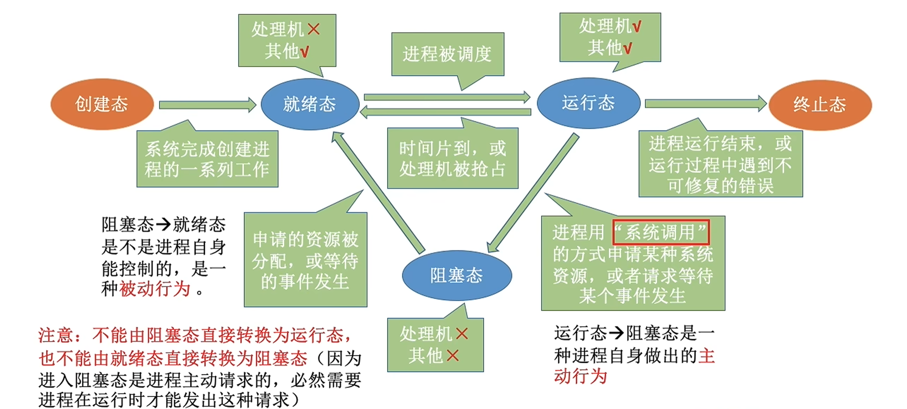

**四类合法转换**：

| 转换 | 触发原因 |
|:---|:---|
| **就绪 → 运行** | 进程被调度器选中，分配 CPU |
| **运行 → 就绪** | **时间片用完**，或被更高优先级进程**抢占** |
| **运行 → 阻塞** | 进程**主动**请求等待事件（如发起 I/O、申请资源未获） |
| **阻塞 → 就绪** | 等待的事件**发生**（如 I/O 完成），进程被唤醒 |

> **易错点（选择题常考）**：
> - **阻塞 → 运行：不允许**（必须先变为就绪，再被调度）
> - 运行 → 阻塞是进程**主动**行为；运行 → 就绪可能是**被动**（被抢占）
> - 就绪 → 阻塞：**不可能**（就绪进程尚未运行，无法主动等待）

##### 3. 挂起状态（七状态模型）

**挂起（Suspend）**：进程被调到**外存**，暂时不参与调度。引入挂起后共七种状态：

```
创建 → 就绪（内存） ⇄ 就绪挂起（外存）
创建 → 就绪挂起（直接创建到外存）
运行 → 阻塞（内存） ⇄ 阻塞挂起（外存）
阻塞挂起 → 就绪挂起（等待的事件发生）
就绪挂起 → 就绪（调入内存）
```

| 状态 | 位置 | 是否参与调度 |
|:---|:---|:---|
| 就绪态 | 内存 | 是 |
| **就绪挂起** | 外存 | **否**（调入内存后才参与） |
| 阻塞态 | 内存 | 否 |
| **阻塞挂起** | 外存 | 否 |

#### 四、进程控制

**进程控制**：系统使用**原语**实现进程的创建、终止、阻塞、唤醒、切换。

**原语（Primitive）**：由若干条指令组成、用于完成某个特定功能的程序段，**执行期间不可被中断**（要么全部执行，要么全部不执行）。原语运行在**内核态**。

##### 1. 进程的创建

| 事件 | 说明 |
|:---|:---|
| 用户登录 | 分时系统中用户登录时建立进程 |
| 作业调度 | 批处理系统中，作业调入内存时建立进程 |
| 提供服务 | 用户程序请求系统服务（如打印），系统建立服务进程 |
| 应用请求 | 进程自身调用创建原语创建**子进程** |

**创建原语步骤**：① 申请空白 PCB → ② 为新进程分配资源 → ③ 初始化 PCB（PID、PSW、PC、优先级等）→ ④ 插入**就绪队列**。

##### 2. 进程的终止

**正常结束**（任务完成）、**异常结束**（越界、非法指令、除零等）、**外界干预**（Ctrl+C、被父进程终止、被系统终止）。

**终止原语步骤**：① 从队列中摘除 PCB → ② 若正在运行则立即停止 → ③ 回收资源、撤销子孙进程 → ④ 撤销 PCB。

##### 3. 进程的阻塞与唤醒

| 原语 | 触发 | 动作 |
|:---|:---|:---|
| **block 阻塞原语** | 进程**主动**请求等待某事件 | 运行态 → 阻塞态（插入阻塞队列），**主动放弃 CPU** |
| **wakeup 唤醒原语** | 等待的事件发生（由**其他进程**调用） | 阻塞态 → 就绪态（插入就绪队列） |

> block 和 wakeup 必须**成对使用**；阻塞是主动的，唤醒是被动的（只能由别的进程/中断唤醒）。

##### 4. 进程的切换

进程切换：CPU 从一个进程切换到另一个进程。过程：保存旧进程现场到 PCB → 更新 PCB → 装入新进程 PCB 现场 → 开始执行。

> 进程切换的详细过程见（二）四、进程切换。

#### 五、进程的通信

进程间通信（IPC, Inter-Process Communication）：进程之间交换信息。三种基本方式：**共享存储、消息传递、管道通信**。

##### 1. 共享存储（Shared Memory）

两个进程各自划分出一块**共享存储区**，直接读写该区域进行通信。分为：

```
┌──────────────┐      ┌──────────────┐
│  Process A   │      │  Process B   │
└──────┬───────┘      └──────┬───────┘
       │                     │
       ▼                     ▼
   ┌─────────────────────────────┐
   │         Shared Memory       │
   │  (A and B map the same area)│
   └─────────────────────────────┘
   A、B 直接读写同一块共享区（不经过内核）
```

| 方式 | 说明 |
|:---|:---|
| **低级通信（共享数据结构）** | 共享**数据结构**（如缓冲区），只能传递少量数据；需要程序员自己实现同步互斥（如生产者-消费者） |
| **高级通信（共享存储区）** | 在内存中划出一块**存储区**，进程直接对存储区读写（如共享内存 mmap） |

> **注意**：共享存储**不通过内核**，是最快的进程通信方式；但进程间要**自己保证同步互斥**。

##### 2. 消息传递（Message Passing）

进程间通过**发送/接收消息**（格式化数据）通信，由**内核**帮助传递，不用共享任何存储。

```
┌──────────────┐   send   ┌───────────────────┐   recv   ┌──────────────┐
│  Process A   │─────────►│      Kernel       │─────────►│  Process B   │
│   (sender)   │   msg    │   message queue   │   msg    │  (receiver)  │
└──────────────┘          └───────────────────┘          └──────────────┘
```

| 方式 | 说明 |
|:---|:---|
| **直接通信** | 发送进程直接把消息发送给接收进程（指明接收方 ID），消息挂在接收进程的消息队列中 |
| **间接通信** | 消息发送到**信箱（mailbox）**，接收方从信箱取消息；信箱属于系统或某进程 |

##### 3. 管道通信（Pipe）

**管道**：连接读写进程的一个**共享文件（pipe 文件）**，数据以**先进先出（FIFO）**方式传送。

```
┌──────────────┐   write    ┌──────────────────────────────┐   read     ┌──────────────┐
│  Process A   │───────────►│      pipe (circular queue)   │───────────►│  Process B   │
│   (writer)   │            │ half-duplex, FIFO byte flow  │            │   (reader)   │
└──────────────┘            └──────────────────────────────┘            └──────────────┘
Half-duplex：半双工
```

- **半双工**：数据只能**单向**流动（需要双向通信时建立两个管道）
- **循环队列**：管道是内存中的循环队列（大小固定），读端读出、写端写入
- **同步互斥**：写进程和读进程需要**互斥**访问管道，且**写满时写进程阻塞、读空时读进程阻塞**
- 管道以**字节流**方式传输，**先进先出**；数据一旦读出就被丢弃

> **考点**：管道 vs 普通文件——管道**容量有限**、读写**互斥同步**、**只读一次**（读出即删除）。
> `ls | grep` 中 `|` 就是管道：`ls` 的输出作为 `grep` 的输入（单向）。

##### 4. 信号（Signal，教材补充）

- **信号**：由内核或进程发送的**异步通知**（如 SIGINT、SIGKILL），接收进程执行对应的信号处理程序
- **信号 ≠ 信号量**：信号是异步事件通知机制；信号量（semaphore）是**同步互斥工具**（P/V 操作）

#### 六、线程和多线程模型

##### 1. 线程的基本概念

**线程（Thread）**：进程中的一条执行流，是**处理机调度（分配 CPU）的基本单位**。

- 一个进程可以有**多个线程**，它们共享进程的资源（地址空间、打开的文件等）
- **引入线程后**：进程 = 资源分配的基本单位；线程 = 调度的基本单位
- **线程的组成**：线程 ID、程序计数器 PC、寄存器集合、栈

**TCB（线程控制块，Thread Control Block）**：与 PCB 类似，系统为**每个线程**建立的数据结构，是**线程存在的标志**。TCB 记录线程的描述信息（线程 ID、所属进程的 PID、线程状态、优先级）和现场信息（PC、通用寄存器、栈指针）等，线程被**创建时建立、终止时撤销**。

> **TCB 与 PCB 的关系**：一个进程的**多个线程共用一个 PCB**（共享地址空间和资源），但**各自拥有独立的 TCB**——切换线程时保存/恢复的是 TCB 中的现场，而不动 PCB 中的地址空间，这也是线程切换开销小的原因。

```
Before threads:                 After threads:
┌───────────────────────────┐   ┌─────────────────────────────────────┐
│  Process (code + data)    │   │  address space | files | signals    │
│                           │   │  Thread1 Thread2 Thread3            │
└───────────────────────────┘   └─────────────────────────────────────┘
```

> 图：引入线程后，进程的地址空间/文件/信号被多个线程**共享**；每个线程各自拥有自己的 PC、寄存器、栈。

##### 2. 线程 vs 进程（对比表）

| 对比项 | 进程 | 线程 |
|:---|:---|:---|
| 基本单位 | **资源分配**的基本单位 | **CPU 调度**的基本单位 |
| 地址空间 | 独立地址空间 | 共享所属进程的地址空间 |
| 资源 | 拥有资源 | 几乎不拥有资源（只拥有栈、寄存器等） |
| 切换开销 | 大（需切换地址空间） | **小**（同一进程内切换不需切地址空间） |
| 通信 | 需要进程间通信机制（共享存储/消息/管道） | 直接读写共享变量即可 |
| 健壮性 | 一个进程崩溃不影响其他进程 | 一个线程崩溃（如段错误）可能拖垮整个进程 |

> **考点**：线程切换开销小的根本原因——**不需要切换地址空间**（共享进程地址空间），只需切换 PC、寄存器、栈。

##### 3. 线程的实现方式（考纲：内核支持的线程，线程库支持的线程）

| 实现方式 | 说明 | 特点 |
|:---|:---|:---|
| **用户级线程（ULT）** | 由**线程库**在用户空间实现（如 POSIX Pthreads 库），**内核看不到线程**，内核只按进程调度 | 切换**不需进入内核**（快）；但一个线程阻塞会**阻塞整个进程**；不能利用多核并行 |
| **内核级线程（KLT）** | 由**操作系统内核**直接支持，内核管理线程的创建、调度 | 切换**需进入内核**（慢）；一个线程阻塞不影响其他线程；可利用多核并行 |

```
ULT (kernel sees only processes):      KLT (kernel manages threads):
┌────────────────────────┐    ┌────────────────────────┐
│ User space             │    │ Thread 1               │
│ [ thread library ]     │    │ Thread 2               │
│ thr1      thr2         │    │ Thread 3               │
└────────────────────────┘    └────────────────────────┘
            │                             │
            ▼                             ▼
┌────────────────────────┐    ┌────────────────────────┐
│ Kernel                 │    │ Kernel manages threads │
│ sees only process      │    │ thr1  thr2  thr3       │
│ ( 1 process )          │    │                        │
└────────────────────────┘    └────────────────────────┘
```

##### 4. 多线程模型

| 模型 | 说明 | 优缺点 |
|:---|:---|:---|
| **多对一（Many-to-One）** | 多个用户级线程映射到**一个内核级线程** | 切换快，但一个阻塞全阻塞、不能并行 |
| **一对一（One-to-One）** | 每个用户级线程对应**一个内核级线程** | 并行性好，但开销大（线程多时内核负担重） |
| **多对多（Many-to-Many）** | 多个用户级线程映射到**多个内核级线程**（n ≥ m） | 结合两者优点 |

##### 5. 线程池（补充）

**线程池**：预先创建一批线程，任务到达时从池中取一个线程执行，执行完归还。优点：**减少创建/撤销线程的开销**、控制并发数量。

---

### （二）CPU 调度与上下文切换

#### 一、调度的基本概念

**处理机调度**：从就绪队列中**按某种算法**选择一个进程，把 CPU 分配给它。

**调度的三个层次**：

| 层次 | 别名 | 功能 | 频率 | 涉及的状态转换 |
|:---|:---|:---|:---|:---|
| **高级调度（长程）** | **作业调度** | 从外存后备队列中选择作业调入内存，创建进程 | 最低（秒/分钟级） | **创建（作业）→ 就绪态**：作业从外存调入内存 |
| **中级调度（中程）** | **内存调度** | 决定哪些进程可以进入内存（**挂起/激活**） | 中等 | **就绪 ⇄ 就绪挂起、阻塞 ⇄ 阻塞挂起**（内存⇄外存） |
| **低级调度（短程）** | **进程调度** | 从就绪队列中选择进程分配 CPU | **最高**（毫秒级） | **就绪态 → 运行态**（分配 CPU） |

**三层调度对应的状态转换**：

```
High-level sched          Mid-level sched (suspend)
┌────────────┐              ┌──────────────────┐
│  Ready     │◄────────────►│  Ready (suspend) │
└─────┬──────┘              └──────────────────┘
      │ Low-level sched
      ▼
┌────────────┐
│  Running   │
└─────┬──────┘
      │ wait event
      ▼
┌────────────┐              ┌──────────────────┐
│  Blocked   │◄────────────►│ Blocked (suspend)│
└────────────┘              └──────────────────┘
```

> **考点**：进程调度（低级调度）是**最基本、最频繁**的调度；只有低级调度是"把 CPU 分配给进程"。

#### 二、调度的实现

##### 1. 调度器（Scheduler）

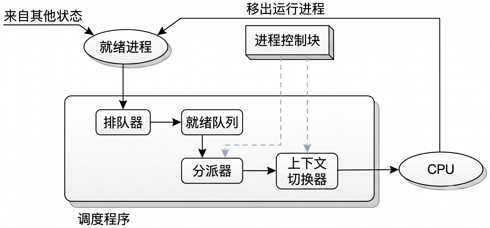

**调度器/调度程序**：实现低级调度的程序，运行在内核态。主要工作：

1. **排队器**：把就绪进程按策略排入队列
2. **分派器**：把 CPU 分配给被选中的进程（执行上下文切换）
3. **上下文切换器**：保存旧进程现场、装入新进程现场

##### 2. 调度的时机

**需要进行进程调度与切换的情况（教材 6 种）**：

| 情况 | 说明 |
|:---|:---|
| ① **创建新进程后** | 新进程进入就绪队列，可参与调度 |
| ② **进程正常结束或异常终止后** | 当前进程让出 CPU |
| ③ **进程被阻塞时**（I/O 请求、信号量操作等） | 运行 → 阻塞 |
| ④ **I/O 完成、等待 I/O 的进程从阻塞变为就绪时** | 阻塞 → 就绪（可被调度） |
| ⑤ **有更紧急的任务需要处理时** | 抢占式调度（高优先级进程就绪） |
| ⑥ **当前进程的时间片用完时** | 运行 → 就绪 |

**不能进行进程调度与切换的情况（教材 2 种）**：

| 情况 | 说明 |
|:---|:---|
| ① **在处理中断的过程中** | 中断处理要求快速完成，不允许再切换 |
| ② **需要完全屏蔽中断的原子操作过程中** | 如内核程序临界区、信号量 P/V 原语等原子操作期间 |

> **易错点**：情况 ④ 只是把进程状态改为**就绪**（阻塞 → 就绪），是否真正切换 CPU 还要看调度算法——被唤醒的进程只进入就绪队列，**不一定立即被调度**。

##### 3. 调度方式

| 方式 | 说明 | 特点 |
|:---|:---|:---|
| **非抢占式（合作式）** | 进程**主动**放弃 CPU 才调度（运行结束/阻塞） | 实现简单、开销小；不利于紧急任务 |
| **抢占式（剥夺式）** | 只要有更高优先级进程就绪，**立即抢占**当前进程 | 响应快；实现复杂、开销大 |

##### 4. 闲逛进程（Idle Process）

- **PID为0**
- 就绪队列为空时，CPU 运行**闲逛进程（idle）**
- 闲逛进程**优先级最低**，且**不需要调度**（就绪队列为空时自动运行）
- 作用：使 CPU **永远不空转**（不执行任何用户任务，但保持 CPU 忙碌）

> **考点**：闲逛进程不需要 CPU 以外的资源，不会被阻塞。

#### 三、调度的目标（评价指标）

| 指标 | 定义/公式 | 说明 |
|:---|:---|:---|
| **CPU 利用率** | CPU 忙碌时间 / 总时间 | 越高越好 |
| **系统吞吐量** | 单位时间内完成的进程数 | 越高越好 |
| **周转时间** | 完成时间 − 到达时间 | 越短越好 |
| **带权周转时间** | 周转时间 / 运行时间 | 越接近 1 越好 |
| **等待时间** | 进程在**就绪队列**等待的总时间 | 越短越好 |
| **响应时间** | 首次响应时间 − 提交时间 | 越短越好（交互系统） |

> **易错点**：周转时间、等待时间**不包含进程运行时间之外的等待**；响应时间强调**首次**响应（不是完成）。
> 进程调度算法的评价主要看**等待时间**（对用户：周转时间）。

#### 四、进程切换与上下文切换

**上下文（Context）**：进程在处理器上运行所需的所有状态信息（寄存器、PC、PSW、栈指针、内存映像等）。

**上下文切换（Context Switch）**：从一个进程切换到另一个进程时，**保存旧进程的上下文到 PCB，装入新进程的上下文**。

**切换过程**：

```
进程 A 运行 ──► ① 保存 A 的上下文到 A.PCB（寄存器、PC、PSW...）
              ──► ② 更新 A 的 PCB 状态为就绪，加入就绪队列
              ──► ③ 从就绪队列选出 B，更新 B 状态为运行
              ──► ④ 从 B.PCB 恢复 B 的上下文 ──► 进程 B 运行
```

**进程切换 vs 模式切换（重点辨析）**：

| 对比项 | 进程切换（上下文切换） | 模式切换（用户态↔内核态） |
|:---|:---|:---|
| 对象 | 不同**进程**之间 | 同一进程的**用户态/内核态**之间 |
| 是否保存 PCB | **保存/恢复 PCB 现场** | **不保存 PCB**（不改变进程状态） |
| 是否经过调度 | 是（先调度再切换） | 否（中断/系统调用触发） |
| 开销 | 大（保存全部现场） | 小 |

> **考点**：陷入内核（系统调用/中断）**不是进程切换**——它只是模式切换，进程状态不变；只有**调度**才引起进程切换。

#### 五、调度算法（重点）

##### 1. 先来先服务（FCFS, First Come First Served）

- 按**到达顺序**调度，**非抢占**
- 优点：公平、实现简单
- 缺点：**对短作业不利**（长作业排在前面时短作业等待久，**平均等待时间长**）；有利于CPU繁忙型作业；不利于 I/O 繁忙型作业

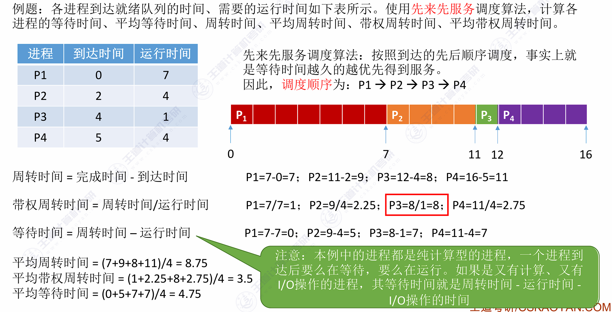

##### 2. 短作业优先（SJF）/ 最短剩余时间优先（SRTN）

- **SJF（非抢占）**：就绪队列中**运行时间最短**的先运行，不可抢占

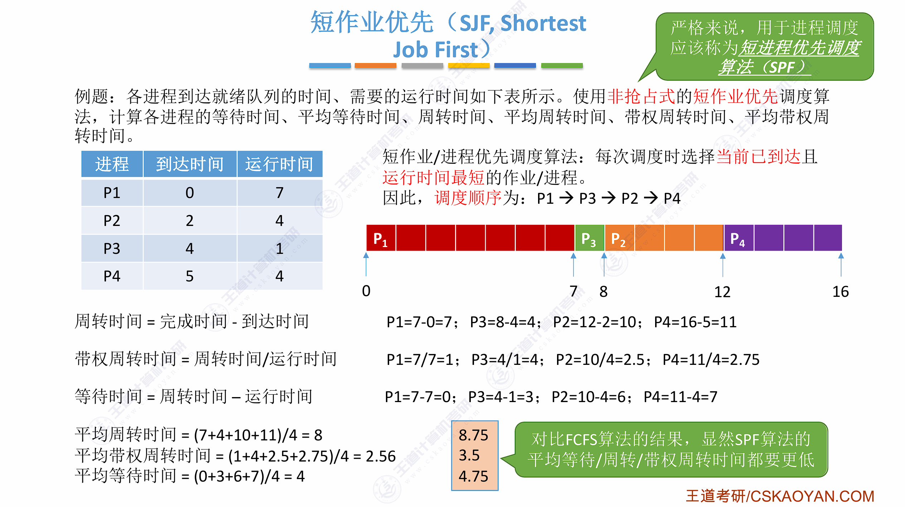

- **SRTN（抢占式 SJF）**：新进程的剩余时间更短时**抢占**当前进程

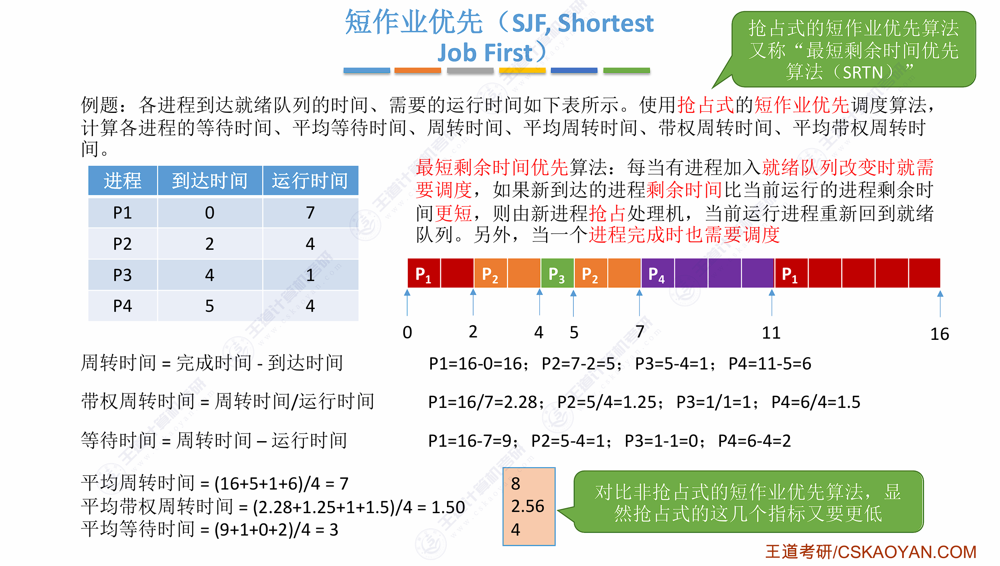

- 优点：**平均等待时间最短、平均周转时间最短**（最优）
- 缺点：**对长作业不利**——长作业可能**饥饿**（不断被短作业抢占）

> **考点**：SJF 调度算法的平均等待时间**在所有算法中最短**（理论上最优，但需要预知运行时间，难以实现）。
> 抢占式 SJF（SRTN）的平均等待时间 ≤ 非抢占式 SJF。

##### 3. 高响应比优先（HRRN, Highest Response Ratio Next）

- 每次调度时，计算就绪队列中**每个进程的响应比**，**响应比最高**的进程先运行（**非抢占**）
- **响应比公式**：

| 指标 | 公式 | 含义 |
|:---|:---|:---|
| **响应比** | 1 + 等待时间 ÷ 要求服务时间 | 等待越久、运行时间越短 → 响应比越高 |

- **优点**：综合 FCFS 与 SJF——短作业**响应比高、先服务**（SJF 的优点）；长作业**等待久了响应比上升，不会饥饿**（FCFS 的优点）
- **缺点**：每次调度都要**计算所有就绪进程的响应比**，**开销大**；平均等待时间不如 SJF 短

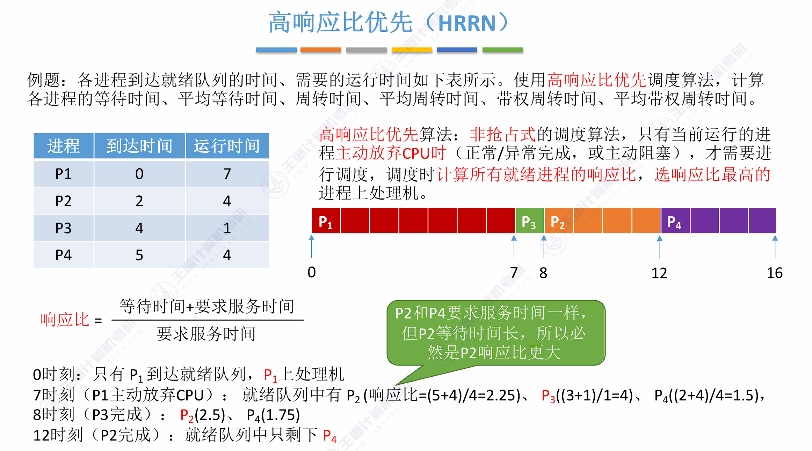

##### 4. 优先级调度（PSA）

- 就绪队列按**优先级**排序，优先级高的先运行；可分**抢占式/非抢占式**
  - **抢占式**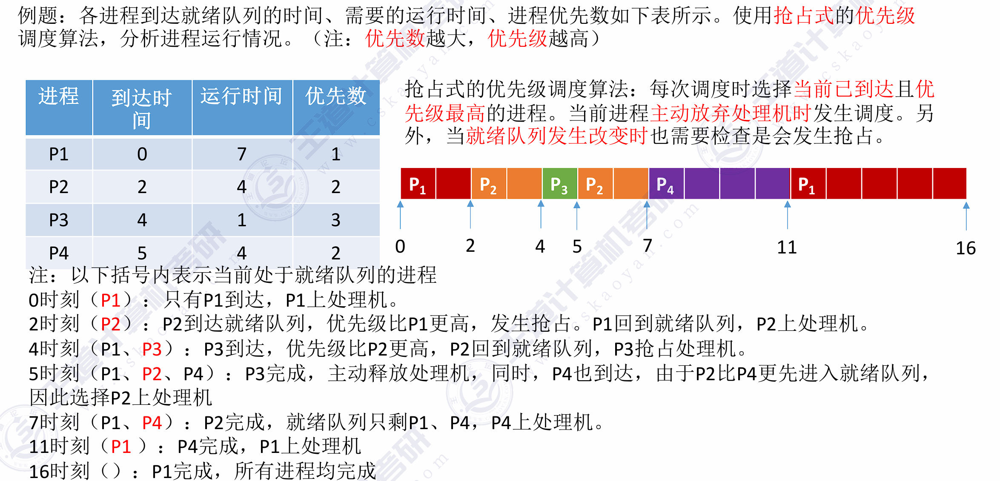
  - **非抢占式**

- **优先级设置方式**：
  - ① **静态优先级**：创建进程时确定，整个运行期间**不再改变**——简单、开销小，但不够灵活（低优先级进程可能长期低优先）
  - ② **动态优先级**：运行过程中**动态调整**，如"等待时间越长优先级越高"——更公平、可缓解饥饿，但实现开销大
- **优先级设置的参考原则**：
  - ① **系统进程 > 用户进程**（系统进程承担系统功能，应优先服务）
  - ② **交互型进程 > 非交互型进程**（交互型进程要求响应快）
  - ③ **I/O 型进程 > 计算型进程**（I/O 型进程占用 CPU 时间短，让它先运行可提高设备利用率）
- 缺点：低优先级进程可能**饥饿**（永远得不到 CPU）
- 解决饥饿：**老化（Aging）**——等待时间越长优先级逐渐提高

##### 5. 时间片轮转（RR, Round Robin）

- 就绪队列按 FCFS 排队，每个进程运行**一个时间片**后强制下 CPU（即使未完成），排到队尾
- 适用于**分时系统**（交互性）
- **时间片大小的影响**：
  - 时间片**太大**：退化为 FCFS（响应时间变长）
  - 时间片**太小**：切换开销太大（频繁上下文切换），吞吐量下降
  - 通常取**略大于一次上下文切换的时间**，如 20~50ms

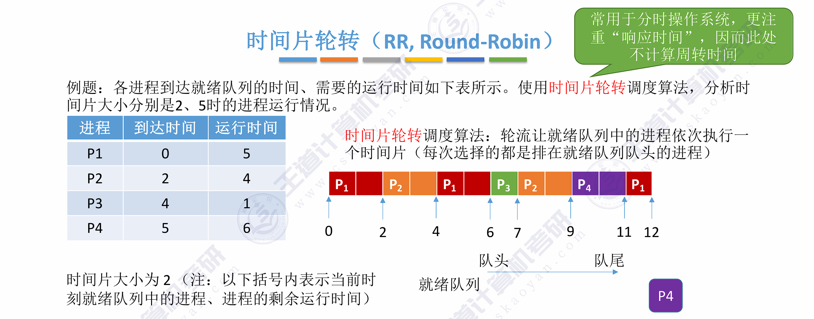

##### 6. 多级队列调度

- 就绪队列分为**多个独立队列**，每个队列有自己的调度算法（如系统进程队列用高优先级、交互队列用 RR、批处理队列用 FCFS）
- 队列之间固定优先级（或时间片比例分配）；进程**固定**属于某个队列（不能移动）

##### 7. 多级反馈队列调度（MFQ）（综合最优）

- 就绪队列分为**多个队列，优先级从高到低**：队列 1 时间片最小 → 队列 2 稍大 → … → 队列 n 最大（或 FCFS）
- 新进程进入**最高优先级队列**；时间片用完未完成则**降入下一级队列**
- 高优先级队列**可抢占**低优先级（低优先级只有高优先级队列全空时才运行）
- **优点**：结合 FCFS（公平）、SJF（短作业优先）、RR（交互）的优点——**短作业/交互作业快速响应，长作业也不饥饿**（最终会在低优先级队列运行）

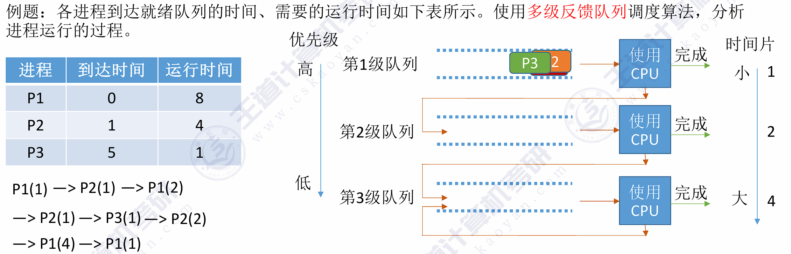

##### 8. 调度算法对比总结

| 算法 | 抢占性 | 核心思想 | 优点 | 缺点 | 适用场景 |
|:---|:---|:---|:---|:---|:---|
| FCFS | 非抢占 | 按**到达先后**服务 | 公平、实现简单 | 短作业等待久（平均等待时间长） | 批处理系统 |
| SJF/SRTN | <nobr>非抢占/抢占<nobr> | 短作业（剩余时间最短）先运行 | **平均等待时间最短**（最优） | 长作业**饥饿**；需预知运行时间 | 批处理系统 |
| 高响应比 | 非抢占 | 响应比 = 1 + 等待÷运行，最高者先 | **折中**：短作业优先且长作业不饥饿 | 每次调度都要计算响应比，开销大 | 批处理系统 |
| 优先级 | 均可 | 按**优先级**高低服务 | 灵活、可反映进程重要性 | 低优先级**饥饿**（可用老化解决） | 通用 |
| 时间片轮转 | 抢占 | **时间片**轮转，用完排到队尾 | 响应快、公平、支持交互 | 时间片大小难选择 | **分时系统**（交互式） |
| 多级队列 | 均可 | 队列**分层**，各队列用不同算法，进程固定归属 | 灵活、可满足不同类别需求 | 队列间优先级固定，低层可能饥饿 | 通用 |
| 多级反馈队列（MFQ） | 抢占 | 多级队列 + 时间片递增 + **进程可在队列间流动** | **综合各种算法优点**（短作业快速响应、长作业不饥饿） | 实现复杂 | 通用（现代操作系统广泛采用） |

> **选择口诀**：
> - 平均等待时间最短 → **SJF/SRTN**
> - 要求交互响应（分时） → **时间片轮转**
> - 折中、不饥饿 → **HRRN**
> - 综合全面、现代 OS 主流 → **多级反馈队列**

> **408 常考例题模式**：给定进程的到达时间和运行时间，计算 FCFS / SJF / RR 下的**周转时间、带权周转时间、等待时间**。方法：画出**甘特图**，逐个计算。

---

### （三）同步与互斥

#### 一、同步与互斥的基本概念

##### 1. 临界资源与临界区

| 概念 | 定义 |
|:---|:---|
| **临界资源** | 一次**只允许一个进程**使用的资源（打印机、共享变量、缓冲区等） |
| **临界区（Critical Section）** | 进程中**访问临界资源**的那段**代码** |

```
进程 A:   entry section（进入区）→ critical section（临界区）→ exit section（退出区）→ remainder（剩余区）
```

**访问临界资源的代码框架**：进入区（检查可否进入、上锁）→ 临界区（访问资源）→ 退出区（解锁）→ 剩余区。

##### 2. 同步与互斥

| 关系 | 类型 | 说明 |
|:---|:---|:---|
| **互斥** | **间接制约** | 进程竞争**临界资源**：一个进程使用，其他进程必须等待（如打印机） |
| **同步** | **直接制约** | 进程协作完成同一任务：**前一个进程的输出是后一个进程的输入**，需要协调推进顺序（如生产者-消费者） |

> 同步 = 协作关系（"必须先做什么再做什么"）；互斥 = 竞争关系（"同一时刻只能一个用"）。

##### 3. 临界区互斥的四个准则（选择题常考）

| 准则 | 含义 |
|:---|:---|
| **空闲让进** | 临界区空闲时，允许一个进程立即进入 |
| **忙则等待** | 已有进程在临界区时，其他进程必须等待 |
| **有限等待** | 等待的进程**有限时间内**能进入临界区（不会饿死） |
| **让权等待** | 进不了临界区的进程应**释放 CPU**（放弃处理机，阻塞自己），不能忙等 |

> **易错点**："让权等待"要求进程**主动阻塞**——忙等（自旋）违反让权等待，但自旋锁在小临界区场景仍有优势（避免切换开销）。

#### 二、实现临界区互斥的基本方法

##### 1. 软件方法

| 方法 | 思想 | 问题 |
|:--:|:---|:---|
| **单标志法** | 一个 turn 变量，谁用完让给谁（类似"谦让"） | 若 P0 用完不再进入，P1 永远无法进入——**违背"空闲让进"** |
| **双标志先检查** | 先检查对方标志，再置自己的标志 | 两个进程**同时检查后同时置标志**，都进临界区——**违背"忙则等待"** |
| **双标志后检查** | 先置自己标志，再检查对方 | 两个进程都先置标志，**互相检查后都等待**——**违背"空闲让进"**，可能死锁 |
| <nobr>**Peterson 算法**<nobr> | 先置自己标志（愿进入），再 turn 让给对方，最后检查 | 正确解决两进程互斥（满足四个准则） |

① **单标志法代码（教材）**：

```c
  P0 进程：                        P1 进程：
while (turn != 0);              while (turn != 1);       // 进入区
critical section;               critical section;        // 临界区
turn = 1;                       turn = 0;                // 退出区
remainder section;              remainder section;       // 剩余区
```

> 特点：**turn 初始为 0**，两个进程**轮流**进入临界区（谁用完就把 turn 让给对方）。问题：若 P0 使用完临界区后**不再进入**，P1 将永远无法进入——**违背"空闲让进"**；同时也**违背"有限等待"**（两个进程必须轮流，想连续进入的进程必须等待对方）。

② **双标志先检查法代码（教材）**：

```
bool flag[2];                  // 表示进入临界区意愿的数组
flag[0] = false;               // 刚开始两个进程都不想进入临界区
flag[1] = false;

P0 进程：                        P1 进程：
while (flag[1]);                while (flag[0]);        // 进入区：先检查对方意愿
flag[0] = true;                 flag[1] = true;         // 再表达自己的意愿
critical section;               critical section;       // 临界区
flag[0] = false;                flag[1] = false;        // 退出区：撤销自己的意愿
remainder section;              remainder section;      // 剩余区
```

> **理解"表达意愿"**：flag[i] = true 表示"进程 i 想进入临界区"，进入前先检查对方是否已表达意愿。
>
> **问题（违背"忙则等待"）**：若两个进程**同时**通过检查（都看到对方 flag = false），然后**同时**置自己的 flag 为 true——**两个进程都会进入临界区**。改进：先置自己的标志再检查对方 → 见"双标志后检查"。

③ **Peterson 算法（两进程）——简要讲解**：

```
P0 进程：                            P1 进程：
flag[0] = true;   turn = 1;          flag[1] = true;   turn = 0;     // ① 表达意愿 + 把优先权让给对方
while (flag[1] && turn == 1);        while (flag[0] && turn == 0);   // ② 进入区：对方愿进且轮到他，才等待
critical section;                    critical section;               // ③ 临界区
flag[0] = false;                     flag[1] = false;                // ④ 退出区：撤销自己的意愿
remainder section;                   remainder section;              // ⑤ 剩余区
```

- **思路（"表达意愿 + 谦让"）**：

  - **flag[i] = true** 表示"进程 i 想进入临界区"（解决单标志法的轮流限制）；**turn = j** 表示"把优先权让给 j"（解决双标志后检查的互等死锁）

  - **进入条件**：对方**不愿进**（flag[j] == false）**或**轮到自己（turn == j 不成立）——两者之一满足即可进


- **为什么正确（对照四准则）**：

| 准则 | Peterson 的保证 |
|:---|:---|
| **空闲让进** | 对方不愿进（flag[j] = false）→ 直接进入 |
| **忙则等待** | 双方同时想进时 turn 只有**一个值**：turn 指向的一方**等待**、另一方进入——**不可能同时进入** |
| **有限等待** | 等待方最多等对方**用完一次**（对方退出时 flag[j] = false，循环条件失效） |
| **让权等待** | **不满足**——while 忙等（自旋空转） |

> **关键点**：两个进程同时申请时，**后写 turn 的一方谦让**（turn 被后写者覆盖，优先权给先写者）——这就是 Peterson **不会死锁**的原因，也正是它与"双标志后检查"（互等死锁）的本质区别。但**只适用于两个进程**，且忙等；实际系统中用硬件方法（关中断/TSL/Swap）。

##### 2. 硬件方法

| 方法 | 思想 | 特点 |
|:---|:---|:---|
| **关中断（中断屏蔽）** | 进入临界区前关中断，出临界区后开中断——保证这段代码**原子执行** | 简单；但关中断期间系统无法响应中断，**只适用于单处理机**，且滥用危险 |
| <nobr>**TestAndSet（TSL/TS 指令）**<nobr> | 原子指令：读出并置 1；若原来为 0 则获得锁 | **适用多处理机**；仍**忙等**（自旋） |
| **Swap（XCHG）** | 原子交换指令，交换 lock 与 key；若 key 仍为 1 则循环等待 | 同 TSL，忙等 |

**① 中断屏蔽方法（开/关中断指令）**：进入临界区前执行"关中断"、出临界区后"开中断"——临界区代码执行期间**不允许被中断**，也就不会发生进程切换，不可能出现两个进程同时访问临界区（实现思想与**原语**相同）。
- **优点**：简单、高效
- **缺点**：**不适用于多处理机**（关中断只对本 CPU 有效，其他 CPU 上的进程仍可访问临界区）；**只适用于操作系统内核进程，不适用于用户进程**（开/关中断是**特权指令**，用户进程无法执行）

**② TestAndSet 指令（TS/TSL）**：借助一条硬件指令实现的互斥，该指令是**原子操作**——功能是"读出指定标志后将该标志设置为真"：

**TSL 伪代码**：

```c
bool TestAndSet(bool *lock) {
    bool old = *lock;      // 读出原值
    *lock = true;          // 置 1（原子操作）
    return old;
}
// 使用：while (TestAndSet(&lock));   // 忙等自旋
//       临界区
//       lock = false;               // 退出区解锁
```

> **考点**：TSL/Swap 用**原子指令**实现互斥，可适用于**多处理机**，但进程是**忙等（违反让权等待）**。
> TSL 的优点：实现简单，无需像软件方法那样**严格检查逻辑漏洞**。

**③ Swap 指令（Exchange/XCHG）**：硬件实现的**原子交换指令**，执行过程不允许被中断；逻辑上与 TSL 无本质区别——先把临界区的锁状态记录到 old，再把 lock 置为 true，最后检查 old：若为 false 说明之前未上锁，可跳出循环进入临界区。

**Swap 伪代码（教材）**：

```c
// Swap 指令的作用是交换两个变量的值
void Swap(bool *a, bool *b) {
    bool temp;
    temp = *a;
    *a = *b;
    *b = temp;
}

// 以下是用 Swap 指令实现互斥的算法逻辑
// lock 表示当前临界区是否被加锁（true = 已加锁）
bool old = true;
while (old == true)
    Swap(&lock, &old);        // 把 lock 的旧值换到 old，同时把 true 写入 lock
...临界区代码段...
lock = false;                 // 解锁
...剩余区代码段...
```

> **执行流程**：old 初始为 true 进入循环 → 执行 Swap 后：若 lock 原为 **false**（未加锁），则 old = false、lock = true → **跳出循环进入临界区**；若 lock 原为 **true**（他人已加锁），则 old 仍为 true → **继续循环（忙等）**。

- **优点**（TSL 与 Swap 相同）：实现简单，无需像软件方法那样严格检查逻辑漏洞；**适用于多处理机环境**
- **缺点**（相同）：**不满足"让权等待"**——进不了临界区的进程会占用 CPU 循环执行指令（**忙等**）

#### 三、互斥锁

**互斥锁（Mutex Lock）**：最简单的同步机制——一个锁变量 + 两个原子操作 acquire（上锁）/ release（解锁）。

```c
// available 表示锁是否可用：true = 可用（未上锁），false = 已被占用
acquire() {
    while (!available);    // 忙等待，直到锁被释放
    available = false;     // 获得锁
}
release() {
    available = true;      // 释放锁
}
```

**自旋锁（Spin Lock）**：acquire 失败时**原地循环等待**（忙等）。

| 场景 | 自旋锁（忙等） | 非自旋（让权等待） |
|:---|:---|:---|
| 临界区小、持有时间短 | **合适**（避免切换开销） | 切换开销反而更大 |
| 临界区大、持有时间长 | 浪费 CPU（空转） | **合适**（阻塞切换更省 CPU） |

> **考点**：自旋锁**不满足"让权等待"**（忙等），但**实现简单、无切换开销**；适合**多处理机**上的短临界区。

#### 四、信号量（重点）

**信号量（Semaphore）**：一个**整数变量 S** + 两个原子操作 **P（wait）** 和 **V（signal）**。

```
P(S):  S = S - 1;  若 S < 0，则进程阻塞（进入 S 的等待队列）
V(S):  S = S + 1;  若 S ≤ 0，则唤醒一个等待进程
```

##### 1. 整形信号量（忙等实现）

整形信号量：信号量初值 S 表示可用资源数，**wait 忙等循环 + 减 1**、**signal 加 1**（教材代码）：

```c
int S = 1;                    // 初始化整型信号量 S，表示当前系统中可用的打印机资源数

void wait(int S) {            // wait 原语，相当于"进入区"
    while (S <= 0);           // 如果资源数不够，就一直循环等待（忙等）
    S = S - 1;                // 如果资源数够，则占用一个资源
}

void signal(int S) {          // signal 原语，相当于"退出区"
    S = S + 1;                // 使用完资源后，在退出区释放资源
}
```

- 缺点：**忙等**，不满足"让权等待"——资源数不够时进程在 `while (S <= 0);` 处**空转占 CPU**，且临界区内的进程无法被阻塞，**不适用于多进程互斥**（用记录型信号量解决）

##### 2. 记录型信号量（让权等待实现）

记录型信号量：结构体 = **剩余资源数 value + 等待队列 L**，wait 不够则 **block 阻塞**（教材代码）：

```c
typedef struct {               // 记录型信号量的定义
    int value;                 // 剩余资源数
    struct process *L;         // 等待队列（指向等待该资源的进程队列）
} semaphore;

void wait(semaphore S) {       // 某进程需要使用资源时，通过 wait 原语申请
    S.value--;
    if (S.value < 0) {
        block(S.L);            // 资源不够，进程阻塞，加入等待队列
    }
}

void signal(semaphore S) {     // 进程使用完资源后，通过 signal 原语释放
    S.value++;
    if (S.value <= 0) {
        wakeup(S.L);           // 唤醒等待队列中的一个进程
    }
}
```

> **理解 value 的负值**：value = -k 表示有 k 个进程在等待该资源。
> **P 操作 = 申请资源（可能阻塞）；V 操作 = 释放资源（可能唤醒）**。P/V 都是原语（不可中断）。

##### 3. 用信号量实现互斥

```
mutex = 1;    // 初始为 1（资源只有一个）
P(mutex);     // 进入区：申请锁
...临界区...   // 访问临界资源
V(mutex);     // 退出区：释放锁
```

> 实现互斥时：**信号量初始值 = 1**；每个进程进入临界区前 P，之后 V。**任何进程都可执行 P/V**（不区分谁申请谁释放）。
>
> **P\V操作必须成对出现**：缺少P(mutex) 就不 能保证临界资源的互斥访问。缺少 V(mutex) 会导致资源永不被释放，等待进程永不被唤醒。 

##### 4. 用信号量实现同步

**同步关系**："先执行的进程 V，后执行的进程 P"，信号量初始值 = 0。

```
进程 P1（先执行）：  ...
                  V(S);     // 完成后发信号
进程 P2（后执行）：  P(S);     // 等待 P1 完成
                    ...
```

> **易错点**：互斥用**同一个**信号量（所有进程共用）；同步用**不同**信号量（每个同步关系一个），P/V 的位置相反——**同步：先 V 后 P；互斥：进入 P、退出 V**。

##### 5. 前驱关系（同步图）

多个进程之间存在先后制约，可用信号量表达"前驱关系"：

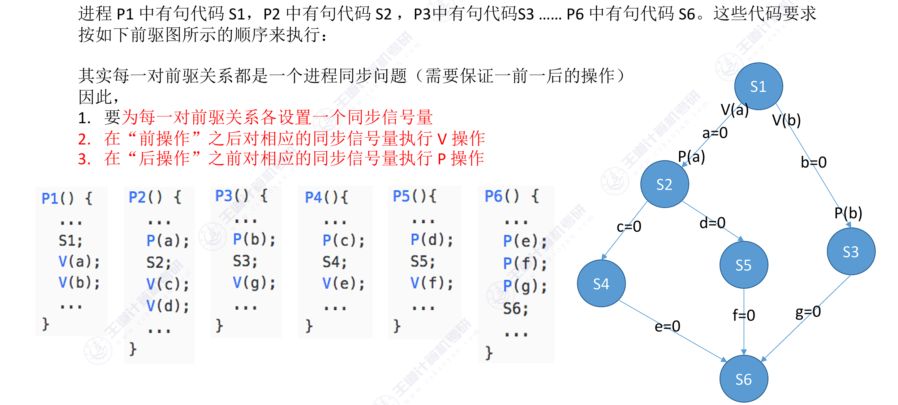

```
    P1 ──► P2 ──► P3
     │           │
     └───► P4 ───┘       每个箭头（制约关系）设一个信号量 Sij，
                          前面的进程执行完 V(Sij)，后面的进程先 P(Sij)
```

#### 五、经典同步问题（大题重点）

**PV 操作题通用解题思路（教材三步骤）**：

| 步骤 | 内容 |
|:---|:---|
| ① **关系分析** | 找出题目中描述的各个进程，分析它们之间的**同步、互斥关系** |
| ② **整理思路** | 根据各进程的操作流程，确定 P、V 操作的**大致顺序** |
| <nobr>③ **设置信号量**<nobr> | 设置需要的信号量，并根据题目条件确定**信号量初值**——**互斥信号量初值一般为 1**；**同步信号量初值看对应资源的初始值**（如缓冲区空位 empty=n、产品数 full=0） |

> **易错点**：先分析关系、后写代码——同步关系用"先 V 后 P"（前驱进程 V、后继进程 P），互斥关系用"进 P 退 V"；写完代码要**自检死锁**（P 的顺序不能错）。

##### 1. 生产者-消费者问题

**问题**：生产者生产产品放入**有界缓冲区**，消费者从缓冲区取产品消费。缓冲区大小为 n。

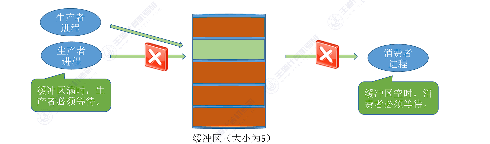

**同步关系**：① 缓冲区**满**时生产者必须等待（同步）；② 缓冲区**空**时消费者必须等待（同步）；③ 缓冲区**互斥**访问（互斥）。

**记录型信号量解法**：

```
Semaphore mutex = 1;    // 互斥访问缓冲区
Semaphore empty = n;    // 空缓冲区个数（剩余空间）
Semaphore full = 0;     // 满缓冲区个数（产品数）

Producer:                Consumer:
while (1) {              while (1) {
  produce();               P(full);        // 有产品才取
  P(empty);                P(mutex);
  P(mutex);                take();         // 取产品
  put();                   V(mutex);
  V(mutex);                V(empty);
  V(full);                 consume();
}                        }
```

> **考点（必考）**：
> - P 的顺序**不能交换**：若先 P(mutex) 再 P(empty)，缓冲区满时生产者持有 mutex 阻塞——消费者无法取走产品，**死锁**！
> - V 的顺序可以交换。
> - 互斥信号量 **mutex 在中间**（P(mutex) 和 V(mutex) 包围临界区）；同步信号量（empty/full）在**两侧**。
> - 初始值：**mutex=1, empty=n, full=0**。

##### 2. 多生产者-多消费者问题（水果盘问题，教材扩展）

**问题**：桌上有一只**盘子，每次只能放一个水果**。爸爸专放**苹果**，妈妈专放**橘子**；儿子专等吃**橘子**，女儿专等吃**苹果**。只有盘子空时爸爸或妈妈才能放；仅当盘中有自己需要的水果时儿子或女儿才能取。

**关系分析**：

| 进程 | 行为 | 同步/互斥关系 |
|:---|:---|:---|
| 爸爸 | 放苹果 | 与女儿**同步**（放完通知女儿）；与盘子**互斥/容量**（空才能放） |
| 妈妈 | 放橘子 | 与儿子**同步**（放完通知儿子）；与盘子**互斥/容量** |
| 儿子 | 取橘子 | 与妈妈**同步**（等橘子）；取走释放盘子 |
| 女儿 | 取苹果 | 与爸爸**同步**（等苹果）；取走释放盘子 |

**信号量设置**：

```
semaphore plate = 1;    // 盘子还能放几个水果（容量 = 1）
semaphore apple  = 0;   // 盘中苹果数（初始为 0）
semaphore orange = 0;   // 盘中橘子数（初始为 0）
```

**PV 操作实现**：

```
Father（爸爸）:               Mother（妈妈）:
while (1) {                   while (1) {
  P(plate);                     P(plate);
  放苹果;                       放橘子;
  V(apple);                     V(orange);
}                             }

Son（儿子·吃橘子）:            Daughter（女儿·吃苹果）:
while (1) {                   while (1) {
  P(orange);                    P(apple);
  取橘子;                       取苹果;
  V(plate);                     V(plate);
  吃橘子;                       吃苹果;
}                             }
```

> **考点（必考）**：
> - **3 个信号量**：`plate=1`（盘子容量，兼互斥）、`apple=0`、`orange=0`（按水果种类区分，谁需要谁 P）
> - 生产者放完 **V(对应的水果信号量)**（通知对应消费者）；消费者**取走才 V(plate)**（释放盘子空间）
> - 儿子只 **P(orange)**、女儿只 **P(apple)**——按需等待，不会互相抢
> - **盘子容量为 1 时 plate 兼当互斥信号量**；若盘子能放多个水果，则需**再加一个 mutex=1** 保护"放/取"临界区（此时 P(mutex) 与 P(plate) 的顺序也不能错）
> - 本题是 2014 年统考真题原型（多生产者-多消费者：一个容器 + 多个资源类）

##### 3. 读者-写者问题

**问题**：多个读者可**同时**读；写者必须**独占**（无读者、无写者时才能写）。

**读优先解法**：

```
Semaphore rw = 1;    // 读写互斥（写者占用）
int count = 0;       // 读者数量
Semaphore mutex = 1; // 保护 count

Reader:                    Writer:
while (1) {                while (1) {
  P(mutex);                  P(rw);
  count++;                   write();
  if (count == 1) P(rw);     V(rw);
  V(mutex);                }
  read();
  P(mutex);
  count--;
  if (count == 0) V(rw);
  V(mutex);
}
```

> **考点**：第一个读者负责上锁（P(rw)），最后一个读者负责解锁（V(rw)）——读者之间**共享锁**。
> 读优先：读者不断到来时写者可能**饥饿**；"写优先"实现：增加一个写者等待队列，读者到达时若已有写者等待则排队（考研较少考，理解即可）。

##### 4. 哲学家进餐问题

**问题**：5 个哲学家围坐，5 根筷子；每人需要**同时拿到左右两根筷子**才能吃饭。

**错误解法（死锁）**：每人先拿左筷子再拿右筷子——5 人同时拿左筷，**循环等待**，死锁（教材代码）：

```c
Var chopstick: array [0, ..., 4] of semaphore;
// 所有信号量均被初始化为 1，第 i 位哲学家的活动可描述为：
repeat
    P(chopstick[i]);              // 先拿左筷子
    P(chopstick[(i+1) mod 5]);    // 再拿右筷子
    eat;                          // 进餐
    V(chopstick[i]);              // 放下左筷子
    V(chopstick[(i+1) mod 5]);    // 放下右筷子
    think;                        // 思考
until false;
```

> **为什么死锁**：若 5 位哲学家**同时**都执行了 `P(chopstick[i])`（各拿左筷），再执行 `P(chopstick[(i+1) mod 5])` 时**互相等待对方的右筷**——形成**循环等待**，谁都无法进餐、也无法释放筷子。

**防止死锁的三种方法**：

| 方法 | 思想 |
|:---|:---|
| ① 最多允许 4 人同时拿筷子 | 加一个信号量 room = 4，保证至少一人能拿到两根 |
| ② 必须**同时**拿起两根筷子（原子） | 用互斥锁保护"拿筷子"过程，拿不到就全放下 |
| ③ **奇数号先拿左筷、偶数号先拿右筷** | 破坏循环等待（必考：1 号拿左 2 号拿右……相邻者不会互相等待） |

```
方法③示意：哲学家 1、3、5 先拿左筷；2、4 先拿右筷
   1(左)  2(右)  3(左)  4(右)  5(左)
   —— 相邻的哲学家不会同时互相等待同一根筷子
```

**方法② 代码实现（mutex 原子拿筷，教材代码）**：

```c
semaphore chopstick[5] = {1, 1, 1, 1, 1};   // 5 根筷子，初始均可用
semaphore mutex = 1;                         // 互斥地取筷子

// i 号哲学家的进程
while (1) {
    P(mutex);                  // 进入"拿筷子"临界区（原子操作，不允许被打断）
    P(chopstick[i]);           // 拿左筷
    P(chopstick[(i+1) % 5]);   // 拿右筷
    V(mutex);                  // 退出"拿筷子"临界区

    吃饭;

    V(chopstick[i]);           // 放左筷
    V(chopstick[(i+1) % 5]);   // 放右筷

    思考;
}
```

> **关键**：用 **mutex** 把"拿左筷 + 拿右筷"包成**原子操作**——要么同时拿到两筷、要么等待，**不会出现"各拿一筷互相等"的半途状态**，从而破坏死锁的**不可剥夺（部分分配）**环节；注意 **P(mutex) 先于 P(chopstick)**（拿筷过程互斥），拿完后立刻 V(mutex) 再吃饭。

##### 5. 吸烟者问题（教材/2021 真题原型）

**问题（教材描述）**：假设系统中有**三个抽烟者进程**，每个抽烟者不断地卷烟并抽烟。抽完一颗烟需要三种材料：**烟草、纸和胶水**。一个抽烟者有**烟草**，一个有**纸**，另一个有**胶水**。系统中还有**两个供应者进程**，它们无限地供应所有三种材料，但**每次仅轮流提供三种材料中的两种**。得到缺失的两种材料的抽烟者在卷起并抽掉一颗烟后会**发信号通知供应者**，让它继续提供另外的两种材料。这一过程重复进行。

**关系分析**：

| 进程 | 拥有材料 | 等待的组合 | 对应信号量 |
|:---|:---|:---|:---|
| 供应者 P1（两个供应者轮流） | — | 每次随机提供一种组合，等抽完再提供 | V(offer_i) / P(finish) |
| 抽烟者 P2 | 烟草 | **胶水+纸**（缺这两种） | P(offer3) |
| 抽烟者 P3 | 纸 | **烟草+胶水**（缺这两种） | P(offer2) |
| 抽烟者 P4 | 胶水 | **烟草+纸**（缺这两种） | P(offer1) |

**信号量设置**：

```c
Semaphore offer1 = 0;   // 烟草和纸的组合信号量
Semaphore offer2 = 0;   // 烟草和胶水的组合信号量
Semaphore offer3 = 0;   // 胶水和纸的组合信号量
Semaphore finish = 0;   // 抽烟是否完成的信号量
```

**PV 操作实现（教材代码）**：

```c
Process P1() {              // 供应者进程（两个供应者轮流提供）
    while (1) {
        random = random();  // 产生随机数
        random = random % 3; // 0、1、2 三种组合
        if (random == 0)
            V(offer1);      // 提供：烟草+纸（给有胶水者 P4）
        else if (random == 1)
            V(offer2);      // 提供：烟草+胶水（给有纸者 P3）
        else
            V(offer3);      // 提供：胶水+纸（给有烟草者 P2）
        P(finish);          // 等抽烟者抽完，才提供下一轮
    }
}

Process P2() {              // 有烟草者（缺纸和胶水）
    while (1) {
        P(offer3);          // 等"胶水+纸"组合
        拿纸和胶水，卷成烟;
        V(finish);          // 抽完，通知供应者继续
    }
}

Process P3() {              // 有纸者（缺烟草和胶水）
    while (1) {
        P(offer2);          // 等"烟草+胶水"组合
        拿烟草和胶水，卷成烟;
        V(finish);
    }
}

Process P4() {              // 有胶水者（缺烟草和纸）
    while (1) {
        P(offer1);          // 等"烟草+纸"组合
        拿纸和烟草，卷成烟;
        V(finish);
    }
}
```

> **考点（必考）**：
> - **双向同步**：供应者提供组合用 **V(offer_i)**、对应抽烟者用 **P(offer_i)**（一方向）；抽烟者抽完 **V(finish)**、供应者 **P(finish)**（反方向）——两个方向都不能缺
> - **不需要 mutex**：桌上每次只放一套材料（容量 1），finish 已保证"抽完才放下一轮"，不会出现同时放/取
> - 每轮**恰好一个**抽烟者能取走：提供的两种材料正好是某个抽烟者缺的（如提供烟草+纸 → 只有有胶水者能凑齐三样）
> - 供应者是**两个进程轮流**提供（每次由 random 决定放哪种组合，配合 P(finish) 保证"一次只放一套"）
> - 本题是 **2021 年 408 统考真题**（大题原型）

#### 六、管程

**管程（Monitor）**：把**共享数据结构和能对该数据结构操作的一组过程**封装在一起的模块。进程只能通过管程提供的**过程**访问共享数据。

```
┌────────────────────────────┐
│          Monitor           │
│  ┌──────────────────────┐  │
│  │ Shared data structure│  │   ← only internal procedures
│  └──────────────────────┘  │      can access
│  Proc1  Proc2  Proc3       │   ← only one process at a time
│  Condition vars cv1 cv2    │      inside (mutual exclusion)
└────────────────────────────┘
```

**管程的特性**：

- **互斥**：任一时刻**只有一个进程**能在管程内执行（管程自动保证互斥，**进入管程由编译器处理**，程序员不用写 P/V）
- **同步**：通过**条件变量（Condition Variable）**实现（见 2. 条件变量）

**管程 vs 信号量**：

| 对比项 | 管程 | 信号量 |
|:---|:---|:---|
| 实现 | **语言/编译器**层面（编程语言提供） | 操作系统**原语** |
| 互斥 | 自动（进入管程即互斥） | 需程序员手动 P/V |
| 同步 | 条件变量 wait/signal | P/V 操作 |
| 易错程度 | 不易出错（封装） | 容易出错（P/V 顺序错会死锁） |

> **考点**：条件变量**不是信号量**——条件变量**没有值**（只用于等待/唤醒），wait 必须释放管程；信号量有值，wait 不一定释放。
> 王道补充：Java 的 synchronized 关键字就是管程思想的实现。

##### 1. 用管程解决生产者-消费者问题（教材代码）

**思路**：管程中设置**条件变量 full、empty** 和**等待/唤醒操作**（wait/signal）解决同步问题；**互斥由编译器自动保证**（每次仅允许一个进程在管程内执行某个内部过程），程序员无需写 P/V。

```c
monitor ProducerConsumer {          // 生产者消费者管程
    condition full, empty;          // 条件变量
    int count = 0;                  // 缓冲区中的产品数

    void insert(Item item) {        // 把产品 item 放入缓冲区
        if (count == N)
            wait(full);             // 缓冲区满，生产者等待
        insert_item(item);
        count++;
        if (count == 1)
            signal(empty);          // 由空变非空，唤醒消费者
    }

    Item remove() {                 // 从缓冲区中取出一个产品
        if (count == 0)
            wait(empty);            // 缓冲区空，消费者等待
        item = remove_item();
        count--;
        if (count == N - 1)
            signal(full);           // 由满变不满，唤醒生产者
        return item;
    }
}

// 生产者进程
producer() {
    while (1) {
        item = 生产一个产品;
        ProducerConsumer.insert(item);   // 调用管程中的过程
    }
}

// 消费者进程
consumer() {
    while (1) {
        item = ProducerConsumer.remove(); // 调用管程中的过程
        消费产品 item;
    }
}
```

> **运行举例（教材）**：
> - **例 1（两个生产者并发）**：两个生产者进程并发执行，**依次**调用 `insert` 过程——由于管程的互斥性，第一个进程执行完 `insert` 后第二个才被允许进入管程，不会同时往缓冲区放产品
> - **例 2（两个消费者先执行）**：两个消费者进程先执行，缓冲区为空 → 依次执行 `wait(empty)` **阻塞在条件变量 empty 上**（并释放管程）；生产者进程后执行 `insert`，`count` 由 0 变 1 时执行 `signal(empty)`，**唤醒一个**等待的消费者

> **考点**：管程解法中**互斥不用写**（编译器负责"每次仅一个进程在管程内"）；同步靠条件变量 `wait(full/empty)` 与 `signal(full/empty)`；与信号量解法的对应关系——`wait(full)` 对应 `P(empty)` 位置、`signal(empty)` 对应 `V(full)`，且**条件变量无值**，靠 count 判断唤醒谁。

##### 2. 条件变量

**条件变量（Condition Variable, CV）**：管程内部用于**实现同步**的机制——进程在条件不满足时调用 wait 阻塞自己，条件满足时由其他进程 signal 唤醒。**每个条件变量对应一个等待队列**。

**两个操作（原语）**：

```c
cv.wait():    进程阻塞，加入 cv 的等待队列，并**释放管程**（让其他进程进入）
cv.signal():  唤醒 cv 等待队列中的一个进程（若队列为空，则无操作）
```

**关键要点**：
- 条件变量**没有值**（不是计数器），只表示"等待/唤醒"的队列——与信号量本质不同
- **wait 必须释放管程**：否则其他进程无法进入管程修改共享数据，条件永远不会满足 → **死锁**
- **signal 在等待队列为空时无操作**（不累积"唤醒信号"）；被唤醒的进程**重新竞争管程**的使用权
- 使用模式：**先检查条件 → 不满足则 wait → 条件满足时 signal**（如上例：`if (count == N) wait(full);`）

**条件变量 vs 信号量**：

| 对比项 | 条件变量 | 信号量 |
|:---|:---|:---|
| 是否有值 | **无值**（仅等待队列） | **有值**（计数器，可为负） |
| wait 是否释放锁 | **释放**（让出管程） | 不一定（P 只是申请资源） |
| 实现层面 | 管程内部（语言/编译器） | 操作系统**原语** |
| 典型用途 | 管程内的同步 | 独立实现互斥与同步 |

> **考点**：条件变量**不是信号量**——条件变量**没有值**、wait 必须释放管程；信号量有值、wait 不一定释放。这是选择题高频辨析点。

#### 七、锁

> 说明：本小节讲**广义的锁机制分类**（教材 2.4）；「锁」作为"加锁/解锁"最小原语（acquire/release）的实现已在**（三）三、互斥锁**讲过——互斥锁是**实现手段**（自旋锁），本小节从**对冲突的不同处理策略**（悲观 vs 乐观、忙等 vs 阻塞）对锁机制做整体分类，两处互为补充。

**锁的本质**（教材 2.4）：锁本质上只是**内存中的一个整型数**，用不同的数值表示不同状态——如 `0 = 解锁（空闲/可用）`、`1 = 加锁（占用）`。加锁时判断锁是否空闲：空闲则置为加锁态并**返回成功**；已加锁则**返回失败**。解锁时把锁状态改回空闲态。锁是实现临界区**互斥访问**的最基本工具。

**1. 悲观锁 vs 乐观锁（对冲突的处理策略 + 锁粒度）**

| 对比项 | 悲观锁 | 乐观锁 |
|:---|:---|:---|
| 处理冲突 | **前置处理**：进入临界区前**必须先加锁**（假设一定会有冲突） | **事后检测**：不加锁直接操作，冲突后再处理（如 **CAS** 重试） |
| 适用场景 | 冲突概率**高** / 写操作多 | 冲突概率**低** / 读操作多 |
| 锁粒度 | 偏**粗**（先对整个临界区加锁） | 偏**细**（只标记/检测冲突的更新对象） |
| 开销 | 需频繁加锁/解锁，可能阻塞或忙等 | 无锁开销小，冲突时重试 |
| 代表（教材） | 重量级锁、自旋锁、自适应自旋锁 | 轻量级锁（CAS）、偏向锁 |

> **考点**：悲观锁"**先加锁再干活**"（进前必加锁）；乐观锁"**先干活、冲突再解决**"（不先加锁，靠 CAS 比较并交换 + 重试）。

**2. 自旋锁 vs 重量级锁（等待策略）**

| 对比项 | 自旋锁 | 重量级锁（互斥锁/阻塞等待） |
|:---|:---|:---|
| 拿不到锁时 | **忙等（自旋）**：原地空循环 | **立即阻塞**：进入阻塞态等待被唤醒 |
| 是否有上下文切换 | **无**（不切换进程、不进内核） | **有**（阻塞/唤醒需保存现场、用户态↔内核态转换、进程切换） |
| CPU 消耗 | 空转**占用 CPU** | 空转少（让出 CPU），但切换**开销大** |
| 适用范围 | **多核**、临界区小、持有时间短 | 临界区大、持有时间长、单核 |
| 是否满足"让权等待" | **不满足**（自旋忙等） | **满足**（阻塞让出 CPU） |

> **考点**：自旋锁**不满足"让权等待"**（忙等），但**无切换开销**，适合**多核**上的短临界区；重量级锁进入阻塞态**满足"让权等待"**，但阻塞/唤醒涉及**上下文切换**与休眠唤醒，代价大。

**教材锁分类补充**：
- **自适应自旋锁**：自旋锁根据线程**最近是否获得过锁**动态调整自旋次数——最近拿过锁的线程再次拿到的概率大，**保持自旋**；从没拿过/很少拿过的线程自旋次数少，避免空转浪费 CPU。
- **轻量级锁**：进入方法**不加锁**，只用**一个标记变量**记录"该方法是否有人在执行"；进入时用 **CAS** 把状态置为"有人在执行"，退出时改回"无人执行"——属于**乐观锁**。
- **偏向锁**：认为一个方法**基本只有一个线程**执行（相当于单线程），比轻量级锁更省事——连 CAS 标记都可省，无需加锁。

---

### （四）死锁

#### 一、死锁的概念

**死锁（Deadlock）**：多个进程**相互等待对方占有的资源**，且都不释放自己已占有的资源，导致所有进程**都无法向前推进**的现象。

```
进程 P1 占资源 A，等资源 B；进程 P2 占资源 B，等资源 A —— 谁也等不到，陷入僵局
```

**死锁产生的四个必要条件（缺一不可）**：

| 条件 | 含义 | 能否被破坏 |
|:---|:---|:---|
| **互斥** | 资源一次只能被一个进程使用 | **不能破坏**（临界资源的固有属性） |
| **不可剥夺** | 进程占有的资源在未用完前不能被强行夺走 | 可破坏（剥夺式分配） |
| **请求并保持** | 进程已占有资源，又提出新的资源请求 | 可破坏（一次性分配所有资源） |
| **循环等待** | 存在进程资源的**循环等待链**（P1 等 P2、P2 等 P3、…、Pn 等 P1） | 可破坏（资源有序分配） |

**死锁 vs 饥饿**：

| 对比项 | 死锁 | 饥饿 |
|:---|:---|:---|
| 原因 | 资源**循环等待**（互相等） | 长期**得不到资源/调度**（如低优先级被抢占） |
| 进程状态 | 阻塞（等待永远得不到满足） | 可能就绪（在等待，但**可能被唤醒**） |
| 解除 | 必须外部干预 | 等待时间足够长**可能自然解决** |
| 关系 | 死锁一定伴随饥饿，饥饿不一定死锁 | — |

#### 二、死锁预防

**预防**：在进程**运行前**就破坏四个必要条件之一（**静态策略**）。

<table>
<tr><th><nobr>破坏的条件</nobr></th><th>方法</th><th>缺点</th></tr>
<tr><td><b>互斥</b></td><td>无法破坏（有些资源必须互斥）</td><td>—</td></tr>
<tr><td><b>不可剥夺</b></td><td>进程申请不到新资源时，<b>释放已占有的资源</b>（可剥夺）</td><td>实现复杂、可能造成前功尽弃</td></tr>
<tr><td rowspan="2"><b>请求并保持</b></td><td>① 一次性申请运行所需的<b>全部资源</b>（静态分配）</td><td><b>资源利用率低</b>（长期占着不用）</td></tr>
<tr><td>② 只申请<b>运行初期所需资源</b>即可开始运行；运行中<b>逐步释放已使用完毕的资源</b>，全部释放后才能<b>请求新资源</b></td><td>资源仍可能长期闲置</td></tr>
<tr><td><b>循环等待</b></td><td><b>资源有序分配</b>：给资源编号，进程只能<b>按编号递增</b>顺序申请</td><td>编号不合理时仍可能浪费</td></tr>
</table>


> **考点**：预防是**事先**破坏条件，代价是**资源利用率低**；互斥条件**不可破坏**（只能破坏另外三个）。

#### 三、死锁避免

**避免**：在**每次资源分配前**判断分配后系统是否仍处于**安全状态**，不安全则不分配（**动态策略**）。

##### 1. 安全状态与安全序列

- **安全序列**：按某顺序执行所有进程，每个进程都能在**有限时间内**获得所需资源并完成
- **安全状态**：系统存在至少一个安全序列；**只要处于安全状态就不会死锁**（不死锁的必要条件）

```
不安全状态 ──► 可能死锁（不必然死锁）
安全状态 ──► 一定不死锁
```

##### 2. 银行家算法

**思想**：像银行家放贷一样——分配

资源前**试探性分配**，检查是否仍存在安全序列；**找不到安全序列就不分配**。

**数据结构**：

| 结构 | 含义 |
|:---|:---|
| `Available[j]` | 系统**可用**的第 `j` 类资源数 |
| `Max[i][j]` | 进程 `i` 对第 `j` 类资源的**最大需求** |
| `Allocation[i][j]` | 进程 `i` **已分配**的第 `j` 类资源数 |
| `Need[i][j] = Max − Allocation` | 进程 `i` **还需要**的第 `j` 类资源数 |

**算法步骤（找安全序列）**：

① 寻找 Need ≤ Available 的未完成进程

② 假设分配并让其完成，**回收资源**（Available += Allocation）

③ 重复直到所有进程完成（**安全**）或找不到了（**不安全**）。

**例题**：系统有 5 个进程、3 类资源 A/B/C（总数 10/5/7）：

| 进程 | Max (A,B,C) | Allocation (A,B,C) | Need (A,B,C) |
|:---|:---|:---|:---|
| P0 | 7,5,3 | 0,1,0 | 7,4,3 |
| P1 | 3,2,2 | 2,0,0 | 1,2,2 |
| P2 | 9,0,2 | 3,0,2 | 6,0,0 |
| P3 | 2,2,2 | 2,1,1 | 0,1,1 |
| P4 | 4,3,3 | 0,0,2 | 4,3,1 |

Available = (3,3,2)。**找安全序列**：

```
① P1: Need(1,2,2) ≤ (3,3,2) → 执行，回收后 Available = (5,3,2)
② P3: Need(0,1,1) ≤ (5,3,2) → 执行，回收后 Available = (7,4,3)
③ P4: Need(4,3,1) ≤ (7,4,3) → 执行，回收后 Available = (7,4,5)
④ P0: Need(7,4,3) ≤ (7,4,5) → 执行，回收后 Available = (7,5,5)
⑤ P2: Need(6,0,0) ≤ (7,5,5) → 执行，全部完成
安全序列：P1 → P3 → P4 → P0 → P2（答案不唯一）
```

> **考点**：题目可能问"系统是否安全"——只要**存在一个安全序列**即安全；也可能问"某进程请求资源 (1,0,2) 是否批准"——先试探分配（更新 Available/Allocation/Need），再判断是否存在安全序列。

#### 四、死锁检测和解除

**检测解除**：**允许死锁发生**，系统定期检测，发现死锁后**解除**。

##### 1. 资源分配图（RAG）

**教材补充（汤小丹：资源分配图）**——可用资源分配图检测系统是否处于死锁状态：

**两种结点**：
- **进程结点**：对应一个进程（图中用**圆圈**表示）
- **资源结点**：对应一类资源，**一类资源可能有多个实例**（图中用**方框**表示，框内一个圆点 = 一个资源实例）

| 边 | 含义 |
|:---|:---|
| 进程 → 资源（申请边） | 进程**申请**该类资源（箭头指向资源框） |
| 资源 → 进程（分配边） | 该资源的一个实例已**分配**给进程（箭头指向进程） |

**死锁定理**：资源分配图中**没有环 → 一定不死锁**；**有环**：

| 情况 | 是否死锁 |
|:---|:---|
| 每类资源**只有一个实例** | 有环**一定死锁** |
| 每类资源有**多个实例** | 有环**可能死锁**（需**化简**判断：不断删除"申请能立即满足"的进程的边；**不可完全化简 → 死锁**） |

##### 2. 死锁检测的时机

- 进程**阻塞且等待时间超过阈值**时检测
- 周期性检测（定时）——检测本身有开销

##### 3. 死锁的解除

| 方法 | 说明 |
|:---|:---|
| **资源剥夺法** | 从死锁进程手中**强行剥夺资源**给其他进程（可能使被剥夺进程工作失效） |
| **撤销进程法** | 撤销部分或全部死锁进程，回收资源（按**优先级、代价最小**优先撤销） |
| **进程回退法** | 让进程**回退到死锁前**的状态（需要系统保存历史状态，开销大） |

> **预防 vs 避免 vs 检测解除（三者关系）**：
> - **预防**：破坏必要条件（事先、静态）——简单但资源利用率低
> - **避免**：分配前安全检查（银行家算法、动态）——需预知最大需求
> - **检测解除**：放任发生、事后处理——适合死锁不常发生的系统

---

### （五）本章总结

**知识结构图**：

```
第二章 进程管理
├─（一）进程与线程
│   ├─ 进程 = PCB + 程序段 + 数据段；PCB=唯一标志（常驻内核空间）
│   │   ├─ 特征：动态性(最基本)/并发性/独立性/异步性/结构性
│   │   └─ 组织：链接方式(就绪/阻塞队列)、索引方式
│   ├─ 状态：五状态（就绪→运行→阻塞→就绪；阻塞→运行不允许）
│   │   └─ 挂起(七状态)：调外存、不参与调度
│   ├─ 控制：原语（创建/终止/阻塞/唤醒/切换；block-wakeup 成对）
│   ├─ 通信：共享存储(最快) / 消息传递(信箱) / 管道(半双工) / 信号
│   └─ 线程：调度基本单位；TCB 独立、多线程共用 PCB
│       ├─ 用户级ULT(内核不可见) vs 内核级KLT(可并行)
│       └─ 模型：多对一 / 一对一 / 多对多(n≥m)；线程池
├─（二）CPU 调度
│   ├─ 三层：作业调度(高) / 内存调度(中、挂起) / 进程调度(低、最频繁)
│   ├─ 实现：调度器(排队器/分派器/上下文切换器)；时机 6 可 2 不可
│   ├─ 方式：抢占/非抢占；闲逛进程(PID 0、不被阻塞)
│   ├─ 指标：周转=完成-到达；带权周转=周转÷运行；响应=首次响应
│   ├─ 进程切换(保存PCB) vs 模式切换(不保存)
│   └─ 算法：FCFS → SJF/SRTN(平均等待最短) → HRRN(1+等待÷运行)
│       ├─ 优先级(老化) → RR(时间片 20~50ms)
│       └─ 多级队列(固定归属) → 多级反馈队列(降级流动、综合最优)
├─（三）同步与互斥
│   ├─ 临界资源/临界区；同步(直接制约) vs 互斥(间接制约)
│   ├─ 四准则：空闲让进/忙则等待/有限等待/让权等待
│   ├─ 软件：单标志(违空闲让进)/双标志先检查(违忙则等待)
│   │   └─ 双标志后检查(互等死锁)/Peterson(后写turn谦让)
│   ├─ 硬件：关中断(仅单机)/TSL、Swap(原子指令、忙等)
│   ├─ 互斥锁：自旋锁(多机短临界区、违反让权等待)
│   ├─ 信号量：P申请/V释放；互斥=1(进P退V)、同步=0(先V后P)
│   │   └─ 经典：生产者-消费者/多生产者多消费者(水果盘)/读者-写者(首读者上锁)/哲学家进餐(奇左偶右)/吸烟者(offer+finish)
│   ├─ 管程：自动互斥 + 条件变量(无值)；管程解生产者消费者(full/empty)
│   └─ 锁：本质=内存整型数(0空闲/1加锁)；悲观锁(进前必加锁) vs 乐观锁(CAS、不先加锁)；自旋(忙等、多核短临界区、违让权等待) vs 重量级(阻塞、上下文切换)
└─（四）死锁
    ├─ 四条件：互斥(不可破)/不可剥夺/请求并保持/循环等待
    ├─ 死锁 vs 饥饿（循环等待 vs 长期得不到）
    ├─ 预防(静态)：可剥夺 / 一次性分配(利用率低) / 资源有序分配
    ├─ 避免(动态)：安全状态/安全序列；银行家算法(试探分配)
    └─ 检测解除：资源分配图(无环必不死锁；单实例有环必死锁)
        └─ 解除：资源剥夺 / 撤销进程(代价最小) / 进程回退
```

**高频考点速记**：

| 考点 | 一句话记忆 |
|:---|:---|
| 进程 vs 程序 | 动态 vs 静态；程序**不能并发**；进程=PCB+程序段+数据段，**PCB 是唯一标志**（常驻内核、不可换出） |
| 切换保存现场 | 进程切换时**现场（寄存器、PC、PSW）存入 PCB** |
| 不允许的转换 | **阻塞→运行**（必须先→就绪）；就绪→阻塞不可能 |
| 挂起 | 进程调到**外存**，不参与调度（中级调度） |
| 原语 | 执行**不可中断**、内核态；block-wakeup **成对使用** |
| 进程通信 | 共享存储(最快、**不经内核**、自保互斥) / 消息传递(信箱) / 管道(**半双工**循环队列、容量有限、读出即删) |
| 线程 vs 进程 | 线程=**调度**基本单位、切换**不切地址空间**(开销小)；进程=**资源分配**基本单位 |
| 线程实现 | ULT(内核不可见、一阻塞**全进程阻塞**、切换快) vs KLT(可并行、切换进内核慢)；模型 多对一/一对一/多对多(**n≥m** 最优) |
| 调度层次与时机 | 作业(高)/内存(中、挂起激活)/进程(低、**最频繁**)；被唤醒只进**就绪队列**、**不一定立即调度** |
| 闲逛进程 | **PID 0**、优先级最低、**不会被阻塞** |
| 评价指标 | 周转=完成−到达；带权周转=周转÷运行(→1)；响应=**首次**响应 |
| 上下文切换 vs 模式切换 | 进程切换**保存/恢复 PCB**、先调度后切换；模式切换不保存 PCB、状态不变 |
| FCFS | 按**到达先后**调度；长作业先到时短作业等待久 |
| SJF/SRTN | **平均等待时间最短**；长作业可能**饥饿**；SRTN ≤ 非抢占 SJF |
| 高响应比 HRRN | 响应比 = 1 + 等待÷运行；短作业优先**且长作业不饥饿** |
| 优先级/老化 | 低优先级可能**饥饿**；老化 = 等待越久**优先级越高** |
| 时间片 | 太大→退化 FCFS；太小→切换开销大；约 **20~50ms** |
| 多级队列/反馈 | 多级队列=分层+进程**固定归属**；反馈队列=时间片递增+**降级流动**（综合 FCFS+SJF+RR 最优） |
| 让权等待 | 进不了临界区就**释放 CPU**；自旋锁**违反**它但适合多机短临界区 |
| 软件方法 | 单标志违**空闲让进**；双标志先检查违**忙则等待**；后检查互等死锁 |
| Peterson | **后写 turn 者谦让**→不死锁；仅适用**两进程**、仍忙等 |
| 硬件方法 | 关中断(仅**单机**)；TSL/Swap(**原子指令**、多机、忙等) |
| 信号量 value | 负值 = 等待进程数；P 后 value<0 才阻塞（记录型让权等待） |
| 互斥 vs 同步 | 互斥：mutex=1 进 P 退 V；同步：**先 V 后 P** 初值 0（前驱每箭头一信号量） |
| 生产者-消费者 | **P(mutex) 不能在 P(empty) 前**（满时死锁）；mutex=1, empty=n, full=0 |
| PV 解题三步骤 | 关系分析 → 整理思路 → 设置信号量；**互斥初值 1、同步初值看资源初始值** |
| 读者-写者 | **首读者上锁、末读者解锁**；读优先时写者可能**饥饿** |
| 多生产者多消费者 | 水果盘：**plate=1, apple=0, orange=0**；放完 V(水果)、**取走才 V(plate)**；容量>1 需加 mutex |
| 哲学家进餐 | 防死锁：最多 4 人 / 同时拿两筷(mutex 原子) / **奇左偶右**（破坏循环等待） |
| 吸烟者问题 | 两个供应者随机 **V(offer_i) 放组合 + P(finish) 等**；抽烟者 **P(offer_i)、抽完 V(finish)**；容量 1 无需 mutex |
| 管程 | 自动互斥；条件变量**没有值**、wait 释放管程；管程解生产者消费者用 full/empty |
| 锁的本质 | 锁=**内存整型数**（0 空闲/1 加锁）；加锁成功/失败、解锁还原——互斥访问的最基本实现 |
| 悲观锁 vs 乐观锁 | 悲观锁=**进前必加锁**（重量级/自旋/自适应）；乐观锁=**不先加锁、冲突用 CAS 重试**（轻量级/偏向） |
| 自旋锁 vs 重量级锁 | 自旋=**忙等**(无切换、多核短临界区、违让权等待)；重量级=**阻塞等待**(上下文切换/休眠唤醒、让出 CPU) |
| 死锁四条件 | 互斥(**不可破坏**) + 不可剥夺 + 请求并保持 + 循环等待 |
| 死锁 vs 饥饿 | 死锁=循环等待(必外部干预)；饥饿=长期得不到资源(可自行缓解) |
| 银行家算法 | 分配前**试探分配→找安全序列**，找不到不分配；存在一个即安全 |
| 资源分配图 | 无环→必不死锁；单实例有环→**必死锁**；多实例→化简判断 |
| 预防/避免/检测 | 预防(静态)：可剥夺/一次性分配/有序分配；避免：银行家(动态)；检测解除：**剥夺/撤销/回退** |
