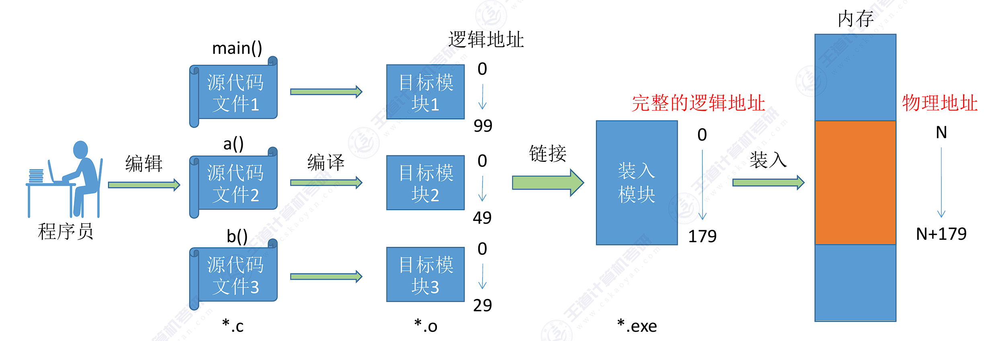
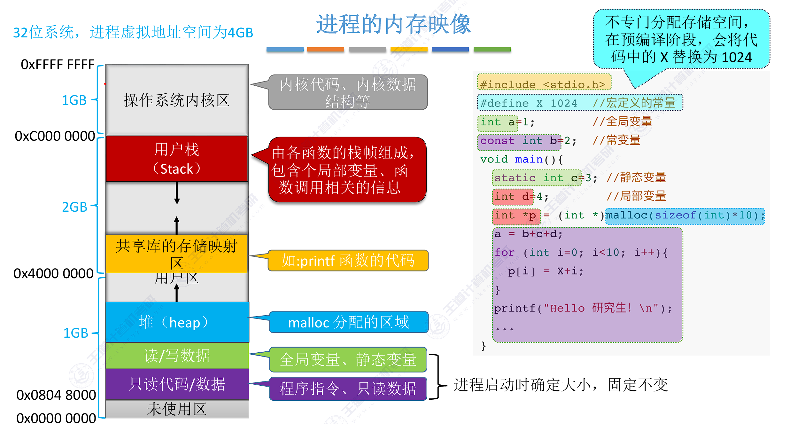
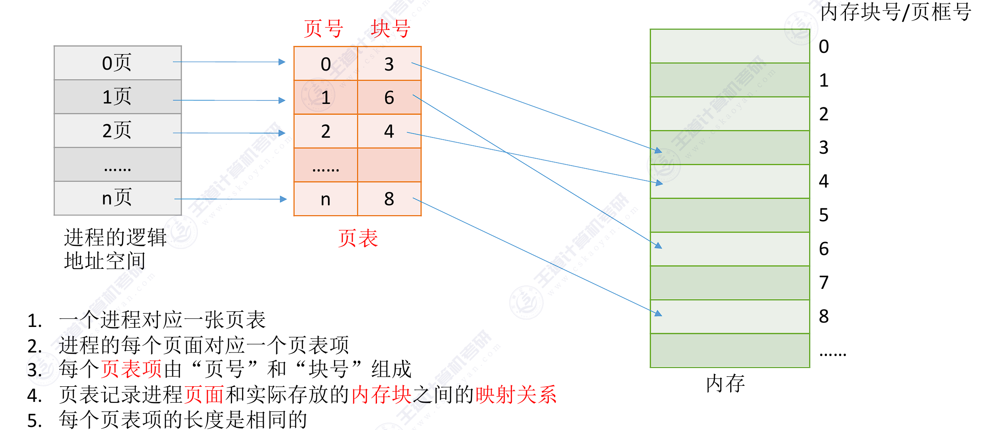
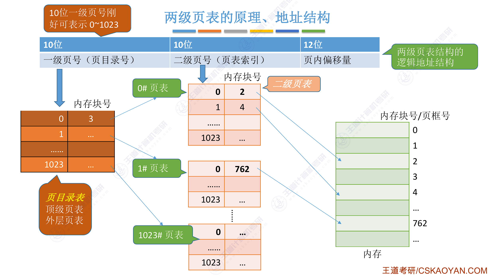

<h2 align="center">第三章 内存管理</h2>

> **408 高频考点提醒**：
> - 内存管理五大功能：**分配与回收、地址转换、内存扩充、内存共享、存储保护**
> - 程序运行三步：**编译 → 链接 → 装入**（链接三种、装入三种，动态重定位用**重定位寄存器**）
> - 连续分配：固定分区（**内部碎片**）、动态分区（**外部碎片**）；四大算法 **FF / BF / WF / NF**（首次适应综合最佳）
> - **分页**：逻辑地址 = 页号 + 页内偏移；页表 + **快表（TLB）**；两级页表；**无快表两次访存、快表命中一次**
> - **分段**：段号 + 段内偏移（二维地址）；段表含**基址 + 段长**（越界检查）；**按段共享**方便
> - 虚拟内存三特征：**多次性、对换性、虚拟性**；基础是**局部性原理**（时间 + 空间）
> - 请求分页页表项：**状态位、访问字段、修改位、外存地址**；缺页中断是**内中断（故障）**
> - 页面置换算法：**OPT 最优（理论）、LRU 最接近 OPT、FIFO 有 Belady 异常、CLOCK（改进型）**
> - **抖动**：驻留集过小导致频繁缺页；驻留集 ≥ 工作集 才不抖

---

### （一）内存管理概念

#### 一、内存管理的基本原理和要求

##### 1. 内存管理的功能

**内存（主存）**：CPU 可直接访问的存储器，是程序与数据运行的场所。操作系统进行**存储器管理**，主要完成五项功能：

| 功能 | 内容 |
|:---:|:---:|
| **内存空间的分配与回收** | 采用某种分配方式为进程分配内存，进程结束后回收内存。分配方式分为：**连续分配**（单一连续、固定分区、动态分区）与**离散分配**（分页、分段、段页式） |
| **地址转换（重定位）** | 把程序中的**逻辑地址**转换为内存中的**物理地址** |
| **内存空间的扩充** | 利用**覆盖、交换（对换）、虚拟存储**技术，在逻辑上扩充内存 |
| **内存共享** | 多个进程可**共享内存**区域（如共享**可重入代码/纯代码**）；只有**只读**的区域才可共享 |
| **存储保护** | 各进程的内存空间**互不干扰**，禁止越界访问（内存保护） |

##### 2. 程序的装入与链接

程序要运行，必须经过 **编译 → 链接 → 装入** 三步：



```
源代码 ──编译(compile)──► 目标模块(.obj) ──链接(link)──► 装入模块(.exe) ──装入(load)──► 内存执行
```

**链接（Link）的三种方式**：

| 方式 | 说明 | 特点 |
|:---:|:---:|:---:|
| **静态链接** | 程序装入**之前**一次性把目标模块与库函数链接成装入模块 | 运行快；但库更新需重新编译，且所有程序都包含库代码，**空间浪费** |
| **装入时动态链接** | 装入内存时，**边装入边链接** | 不完整模块不能运行 |
| **运行时动态链接** | 程序**执行过程中**需要用到某模块时才链接 | 便于**共享**（动态链接库 DLL / .so）；未用到的模块不装入 |

**装入（Load）的三种方式**：

| 方式 | 转换时机 | 起始地址（目标物理地址） | 特点 |
|:---:|:---:|:---:|:---:|
| **绝对装入** | 编译时就生成物理地址（**逻辑地址 = 物理地址**） | **编译/链接时确定**——编译时已知程序将装入的固定物理位置 | 只适用于**单道程序**环境，早期使用 |
| **静态重定位（可重定位装入）** | **装入时一次性**把逻辑地址全部转换为物理地址 | **装入时确定**——装入程序根据内存当前可用位置，把所有逻辑地址整体加上起始偏移 | 装入后**不能移动、不能换出**（地址已固定） |
| **动态重定位（动态运行时装入）** | 装入时不转换，**运行时**由**重定位寄存器（基址寄存器）** 转换 | **运行时确定且可变**——起始地址存放在重定位寄存器中，每次访存动态相加；进程换入换出后起始地址可改变 | 程序可**换入换出、可移动、便于共享**；现代操作系统采用 |

> **考点**：三种方式对"起始地址"的处理——绝对装入**编址时固定**（逻辑地址=物理地址，不用加偏移）；静态重定位**装入时一次性加偏移**（物理地址 = 逻辑地址 + 起始地址）；动态重定位**每次访存时由重定位寄存器加起始地址**（物理地址 = 逻辑地址 + 基址寄存器值）。

##### 3. 进程的内存映像

**进程的内存映像**：当一个程序调入内存运行时，就构成了进程的内存映像（即进程在内存中的地址空间布局）：

```
进程的内存映像（用户空间地址由低到高）:
代码段 → 数据段 → 堆(向高地址增长) → [空闲区] → 栈(向低地址增长)
只读·可共享   全局/静态变量  malloc 动态分配    函数调用
```


| 组成 | 内容 | 特点 |
|:---:|:---:|:---:|
| **代码段** | 程序的二进制代码 | **只读**，可以被多个进程**共享** |
| **数据段** | 程序运行时加工处理的对象，包括**全局变量和静态变量** | 编译时确定大小 |
| **进程控制块（PCB）** | 操作系统通过 PCB 控制和管理进程 | 属于**内核区**，由 OS 维护 |
| **堆** | 存放**动态分配**的变量 | 通过 **malloc** 动态地向**高地址方向**增长 |
| **栈** | 用来实现**函数调用** | 从用户空间**最大地址**往**低地址方向**增长 |

> **注意**：在**预编译阶段**，会把代码中的宏（如 `#define X 1024`）直接替换为常量 1024，**不专门分配存储空间**。
> **考点**：堆和栈的**增长方向相反**（堆向高地址、栈向低地址）；代码段**只读**（防篡改）且**可共享**（多个进程运行同一程序只存一份代码）；"已初始化的全局变量"在数据段，"未初始化的"在 BSS 段（仅记占位，不占文件空间）。

##### 4. 逻辑地址与物理地址、重定位

| 概念 | 说明 |
|:---:|:---:|
| **逻辑地址（相对地址、虚地址）** | 程序员/CPU 视角的地址，从 0 开始编号；逻辑地址空间大小由**地址位数**决定（如 32 位 → 4GB） |
| **物理地址（绝对地址、实地址）** | 内存单元的真实地址，从 0 开始编号；物理地址空间大小由**内存容量**决定 |
| **重定位（地址变换、地址映射）** | 把逻辑地址转换为物理地址的过程；由 **MMU（内存管理单元）** 硬件 + 操作系统配合完成 |

> **易错点**：逻辑地址空间大小 ≠ 物理内存大小——逻辑地址由 CPU 位数决定（32 位 CPU 逻辑地址空间恒为 4GB），物理地址由内存条容量决定（可能远小于 4GB）。这也是虚拟内存能"扩充"内存的基础。

##### 5. 内存保护

内存保护的目标：**各进程只能访问自己的内存区域**，禁止越界访问其他进程的内存。

| 实现方式 | 原理 |
|:---:|:---:|
| **上下限寄存器** | 设置上、下限地址，每次访存先检查物理地址是否在范围内，越界则产生**越界中断** |
| **重定位寄存器 + 界地址寄存器** | 检查：逻辑地址 < **界地址寄存器**（越界则中断）→ 加上**重定位寄存器（基址）** 得物理地址 |

> **注意**：重定位寄存器（基址）+ 界地址寄存器（限长）由 **CPU 内核态**程序修改，用户程序不能修改；检查与加基址须**连续完成**，防止"先加后查"产生漏洞。

#### 二、连续分配管理方式

**连续分配**：为用户程序分配**一段连续的内存空间**。按划分方式分为三种：

| 方式 | 内存划分 | 碎片 | <nobr>道数</nobr> | 管理 |
|:--:|:---|:---|:---|:---|
| <nobr>**单一连续分配**</nobr> | 内存分为**系统区** + **用户区**，一次只装入一个程序 | **内部碎片**（用户区未用完部分） | **单道** | 最简单 |
| **固定分区分配** | 用户区预先划分为**若干固定大小**的分区（可相等/不等），每分区装一个作业 | **内部碎片**（分区内未用部分）、**无外部碎片** | 多道 | **分区说明表** |
| **动态分区分配** | 不预先划分，作业装入时**按大小动态**划分分区 | **外部碎片**（分区间的小空闲区）、**无内部碎片** | 多道 | **空闲分区表 / 空闲分区链** |

##### 1. 固定分区分配

- 内存用户区被划分为若干分区，分区大小可以**相等或不等**（不等更灵活）
- 用**分区说明表**记录：分区号、起始地址、大小、状态（已分配/空闲）
- 装入作业时查表，找一个**大小足够**的分区分配
- 缺点：分区大小与作业大小**难以匹配**——分区太大浪费（内部碎片），太小作业装不下

##### 2. 动态分区分配

- 分区**大小和个数不固定**：作业装入时按需划分，作业结束回收
- 用**空闲分区表 / 空闲分区链**记录空闲分区（按地址递增或大小递增排序）
- 产生的**外部碎片**通过**紧凑（拼接，Compaction）** 解决：把已分配分区移到一端，空闲区合并到另一端

> **考点**：固定分区 → **内部碎片**；动态分区 → **外部碎片**。紧凑（拼接）只适用于**动态重定位**（移动分区后基址寄存器随之改变）。

##### 3. 覆盖与交换（内存扩充，教材补充）

内存扩充的早期手段：**覆盖** 与 **交换（对换）**。它们与虚拟存储一样都是为了"以小内存运行大程序"，但不需要硬件支持。

| 方式 | 思想 | 特点 |
|:---:|:---:|:---:|
| **覆盖（Overlay）** | 程序分模块，**同一内存区**按运行需要**互相覆盖**（程序段 A 用完被程序段 B 覆盖） | 需程序员**手工划分**覆盖结构，编程复杂；早期使用 |
| <nobr>**交换（Swapping / 对换）**</nobr> | 内存中暂时不能运行的进程**整进程换出**到外存对换区，需要时再换入 | 由**中级调度（内存调度）** 完成；以**进程**为单位；换入换出以**对换区（磁盘）** 为媒介 |

> **考点**：覆盖与交换的区别——覆盖是**程序内部段之间**的覆盖（粒度小、程序员负责），它**只装入当前运行所需模块即可运行**（模块按需换入换出）；交换是**进程之间**的换入换出（粒度大、系统负责，就是挂起），它**需把整个进程装入内存**（进程整体换出到外存）。两者与虚拟存储的区别在于：只做**物理上**的调入调出、不能像虚拟存储那样**逻辑上**扩充内存，且需程序员/系统**显式管理**（虚拟存储自动）。
> **注意**：虚拟存储技术**不需要程序员干预**，是自动的，这是它取代覆盖/交换的原因。
> **易错点**：交换与动态分区分配的关系——交换以**整个进程**为单位换入换出，因此进程的内存区域仍是**连续**的（配合动态分区分配使用）；换出时该分区被回收、换入时重新分配（起始地址可能改变，故需**动态重定位**）。

##### 4. 动态分区分配算法（重点）

| 算法 | 策略 | 优缺点 |
|:--:|:---|:---|
| **首次适应（FF, First Fit）** | 空闲分区按**地址递增**排列，从头扫描，选**第一个**满足要求的分区 | **综合性能最佳**（低地址优先利用，查找快）；低地址可能产生大量小碎片 |
| **最佳适应（BF, Best Fit）** | 空闲分区按**容量递增**排列，选**最小的**满足要求的分区 | 空间利用"最省"；但产生**大量难以利用的小碎片**（外部碎片多） |
| <nobr>**最坏适应（WF, Worst Fit）**</nobr> | 空闲分区按**容量递减**排列，选**最大的**分区 | 减少小碎片；但**把大分区切碎**，大作业可能无法装入，**利用率低** |
| **邻近适应（NF, Next Fit）** | 首次适应的改进：**从上次查找位置继续**向后找 | 查找开销小；但**高地址大分区易被切碎** |
| <nobr>**快速适应（Quick Fit，基于索引搜索）**</nobr> | 空闲分区按**容量分类**，每类一个**空闲链表**，用**索引表**记录各类链表（按容量递增） | **查找最快**（直接按大小定位，不需扫描）；但维护复杂、**合并相邻空闲区困难** |

> **王道结论**：**首次适应（FF）算法性能最佳**，是最常用的动态分区算法。

**例题**：系统有 5 个空闲分区（按地址递增），作业序列 J1(15K)、J2(16K)、J3(10K) 依次到达：

| 分区号 | 起始地址 | 大小 |
|:---:|:---:|:---:|
| 1 | 10K | 20K |
| 2 | 30K | 7K |
| 3 | 50K | 18K |
| 4 | 70K | 100K |
| 5 | 180K | 9K |

> **注意**：空闲分区**不能重叠**——每个分区的起始地址必须 ≥ 上一个分区的起始地址 + 大小（如分区 2 起始 30K ≥ 分区 1 的 10K+20K）。分区 1/3/4/5 的大小仍为 20K/18K/100K/9K，分配结果不变。

**分配结果**：

| 算法 | J1(15K) | J2(16K) | J3(10K) |
|:---:|:---:|:---:|:---:|
| FF | 分区 1（剩 5K） | 分区 3（剩 2K） | 分区 4（剩 90K） |
| BF | 分区 3（剩 3K） | 分区 1（剩 4K） | 分区 4（剩 90K） |
| WF | 分区 4（剩 85K） | 分区 4（剩 69K） | 分区 4（剩 59K） |
| NF | 分区 1（剩 5K） | 分区 3（剩 2K） | 分区 4（剩 90K） |

**分析**：

- FF：每次从头扫描选**第一个**满足的（J1 → 分区 1；J2 查遍 5K、7K 后命中分区 3；J3 命中分区 4）
- BF：选**最小满足**（J1 → 18K；J2 → 20K；J3 → 100K），留下 3K、4K、2K 等**零碎小分区**，难以再利用
- WF：三个作业都装进**最大的分区 4**，把 100K 的大分区切成 85K/69K/59K，之后大作业无法装入
- NF：从上次位置继续，结果与 FF 相同但**扫描次数更少**

> **易错点**：BF 是"选最小的满足分区"而非"选最小的分区"；WF 是"选最大的满足分区"。三种算法都要求空闲分区表**有序**（FF 按地址、BF/WF 按容量）。

##### 5. 基于索引搜索的分配算法（索引分配算法，教材补充）

**思想（索引分配算法）**：根据空闲分区的**大小分类**，对于每类（大小相同）空闲分区，单独设立一个**空闲分区链**，并设置一张**索引表**来管理这些空闲分区链。为进程分配空间时，在索引表中查找所需空间大小对应的表项，并从中得到对应的空闲分区链的**头指针**，从而获得一个空闲分区。

```
索引分配算法示意:
按大小分类:     4KB 类 → 空闲分区链 (分区A → 分区B → …)
              8KB 类 → 空闲分区链 (分区C → 分区D → …)
              16KB 类 → 空闲分区链 (分区E → …)
索引表:       [4KB 类] ──► 链头  [8KB 类] ──► 链头  [16KB 类] ──► 链头
分配 n KB 作业: 查索引表 → 定位最小满足的类 → 从链中取一个空闲分区
```

索引分配算法有以下**三种**：

**① 快速适应算法（Quick Fit）**

- 空闲分区的分类根据**进程常用的空间大小**进行划分
- 分配过程分**两步**：先根据进程的长度，在索引表中找到**能容纳它的最小空闲分区链表**；从链表中**取出第一块**进行分配
- **优点**：**查找效率高**、**不产生内部碎片**
- **缺点**：回收分区时，需要**有效地合并分区**，算法比较复杂，**系统开销较大**

**② 伙伴系统（Buddy System）**

- 空闲分区加入大小为 $2^i$ 的空闲分区链表中
- **分配**长度为 n 的存储空间时：首先计算一个 i 值，使 $2^{i−1} < n ≤ 2^i$，然后在空闲分区大小为 $2^i$ 的空闲分区链表中查找：
  - 若找到，即把该空闲分区分配给进程
  - 否则，表明长度为 $2^i$ 的空闲分区已耗尽，则在分区大小为 **$2^{i+1}$** 的链表中寻找；若存在 $2^{i+1}$ 的一个空闲分区，则把该空闲分区**平分为两个相等的分区（称为一对伙伴）**，其中的一个分区用于分配，而把**另一个加入大小为 $2^i$ 的空闲分区链表**
- 以此类推，**最坏情况**下，可能需要对 $2^k$ 的空闲分区进行 **k 次分割**才能得到所需分区
- **回收**：把分区与它的**伙伴**合并（伙伴也空闲时），逐级合并成更大的分区

**③ 哈希算法（Hash）**

- 根据空闲分区链表的**分布规律**，建立**哈希函数**，构建一张**以空闲分区大小为关键字**的哈希表，每个表项记录一个对应**空闲分区链的头指针**
- 查找时按大小计算哈希值直接定位链表——查找效率高（平均 O(1)）

**三种索引分配算法对比**：

| 算法 | 分类依据 | 查找方式 | 特点 |
|:---:|:---:|:---:|:---:|
| **快速适应** | 进程常用空间大小 | 索引表（容量递增）找最小满足类 | 查找快、无内部碎片；回收合并复杂、开销大 |
| **伙伴系统** | **2<sup>i</sup> 幂次大小** | 查 2<sup>i</sup> 链表（2<sup>i−1</sup> < n ≤ 2<sup>i</sup>），无则**分裂 2<sup>i+1</sup>** | 分裂/合并成对（伙伴）进行；最坏需 k 次分割 |
| **哈希算法** | 哈希函数（大小作关键字） | 哈希表直接定位链表 | 查找最快（平均 O(1)） |

> **考点**：
> - 索引分配算法（快速适应）与 FF/BF/WF/NF 的本质区别——后者都是**扫描式搜索**（按地址/容量排列后逐个比较），索引式是**分类 + 索引表直接定位**：**查找快、但回收合并难**
> - **伙伴系统必记**：分配条件 **$2^{i-1} < n \le 2^i$**；$2^i$ 类耗尽时**对半分裂** $2^{i+1}$ 分区，两个半区互为**伙伴**；回收时**伙伴合并**逐级归并

##### 6. 分区的回收

作业结束时回收分区，与相邻空闲分区**合并**的四种情况：

| 情况 | 处理 |
|:---:|:---:|
| 回收区**上、下邻都空闲** | 与上下邻**合并**为一个空闲分区 |
| 回收区**上邻空闲**、下邻不空闲 | 与**上邻**合并 |
| 回收区**下邻空闲**、上邻不空闲 | 与**下邻**合并 |
| 上下邻**都不空闲** | 回收区作为**新的空闲分区**插入表 |

##### 7. 内部碎片 vs 外部碎片（重点辨析）

| 对比项 | 内部碎片（内零头） | 外部碎片（外零头） |
|:---:|:---:|:---:|
| 产生场景 | **固定分区**、**分页**（页面内） | **动态分区**、**分段**（段间） |
| 位置 | 已分配分区**内部**未利用的空间 | 分区**之间**无法利用的小空闲区 |
| 能否解决 | 无法利用（浪费） | 可通过**紧凑（拼接）** 解决 |

#### 三、基本分页存储管理方式（重点）

**引入背景**：连续分配会产生外部碎片（虽然可紧凑，但开销大）。**分页**把进程和内存都划分成大小相同的块，使进程可以**离散存放**，从根本上去除外部碎片。

##### 1. 基本概念

| 概念 | 定义 |
|:---:|:---:|
| **页面（页，Page）** | 把进程的逻辑地址空间等分为大小相同的块，每块称为一个**页面**；页面大小是 2 的幂次（通常 **4KB**） |
| **页框（页帧、物理块，Frame）** | 把内存空间等分为大小相同的块，每块称为一个**页框**（与页面大小相同） |
| **页表（Page Table）** | 记录**页号 → 页框号**映射的表，每个进程一张，存放在内存中 |

```
┌──────────────┐          ┌──────────────────────┐
│  Process     │          │  Main memory         │
│  pages:      │          │  frames:             │
│  page 0      │─────────►│  frame 2  (page 0)   │
│  page 1      │          │  frame 5  (page 2)   │
│  page 2      │          │  frame 7  (page 1)   │
│  page 3      │          │  ...                 │
└──────────────┘          └──────────────────────┘
```

> 图：进程的页面离散装入内存页框，页表记录页号到页框号的映射。

**逻辑地址结构**（一维地址，由硬件自动拆分）：

```
┌────────────────────────┬────────────┐
│    Page number (P)     │ Offset (W) │
│   (high-order bits)    │ (low bits) │
└────────────────────────┴────────────┘
```

> 图：分页逻辑地址 = 页号 + 页内偏移（页号位数 + 偏移位数 = 地址位数）。

**公式**：

- 页号位数 = 地址位数 − 页内偏移位数
- 页面大小 = $2^{页内偏移位数}$
- 页号 P = 逻辑地址 ÷ 页面大小（取整）；页内偏移 W = 逻辑地址 mod 页面大小

> **考点**：分页的地址是**一维的**——页号和偏移对**程序员透明**（由硬件自动拆分），程序仍从 0 开始连续编址。

**页表结构**：



```
┌──────────────────────────┬───────────────────────────┐
│  Page number (index)     │  Frame number (mapped)    │
└──────────────────────────┴───────────────────────────┘
```

> 图：页表项 = 页号（隐含，表项序号即页号）+ 页框号（物理块号）。

##### 2. 地址变换过程

页表在内存中，系统用**页表寄存器（PTR）** 存放：页表在内存中的**始址** + **页表长度**。

```
逻辑地址 A
   │
   ▼
① 页号 P = A ÷ 页面大小；页内偏移 W = A mod 页面大小
   │
   ▼
② 越界检查：P ≥ 页表长度？→ 越界中断
   │
   ▼
③ 查页表：页表始址 + P×页表项大小 → 得到页框号 F
   │
   ▼
④ 物理地址 = F × 页面大小 + W
```

> **考点**：基本分页每次访问数据需要 **2 次访存**——① 查页表 ② 访问数据。这是分页的缺点，用**快表**解决。

**例题**：系统页面大小为 4KB，进程页表如下，求逻辑地址 **2C20H** 的物理地址。

| 页号 | 页框号 |
|:---:|:---:|
| 0 | 2 |
| 1 | 3 |
| 2 | 5 |
| 3 | 7 |

**计算**：页面 4KB → 页内偏移 12 位（0x0~0xFFF）。

- 逻辑地址 2C20H：页号 = **2**（高 4 位），页内偏移 = C20H（低 12 位）
- 查页表：页 2 → 页框 **5**
- 物理地址 = 5 × 4096 + 0xC20 = 20480 + 3104 = **23584 = 5C20H**

> **方法**：16 进制地址若**页面大小 = 2^n**，则低 n 位直接是偏移、其余高位是页号，物理地址 = （页框号拼接偏移）。

##### 3. 页表项大小与页表大小计算

**例题**：32 位逻辑地址、页面大小 4KB，求页表项位数、页表大小。

| 项目 | 计算 |
|:---:|:---:|
| 页号位数 | 32 − 12 = **20 位**（最多 2<sup>20</sup> 个页） |
| 页框号位数 | ≥ 20 位（页框数 ≤ 页数时取 20 位即可） |
| 页表项大小 | ≥ 20 位 → 取 **4B**（按字节对齐，还可放标志位） |
| 页表大小 | 2<sup>20</sup> × 4B = **4MB**（每个进程都要一张） |

> **注意**：页表项个数 = 页数（$2^{20}$）；页表项大小不是固定 4B，要**按页框号位数向上取整**。页表需要**连续内存**存放——4MB 的连续空间难以满足，引出**两级页表**。

##### 4. 快表（TLB, Translation Lookaside Buffer）

**问题**：页表在内存中，每次访存都要先查页表（2 次访存），速度减半。

**快表（TLB）**：一组**相联存储器（高速缓存）**，存放**最近访问的页表项**（页号 → 页框号）。地址变换时**快表与慢表（内存中的页表）同时查找**，快表命中即得到页框号。

| 情况 | 访存次数 |
|:---:|:---:|
| 快表**命中**（页表项在快表） | **1 次**（直接得到页框号 → 访存数据） |
| 快表**未命中**（页表项不在快表） | **2 次**（查内存页表 + 访存数据），并**更新快表** |

**有效访问时间（EAT）**：设快表命中率为 a：

$$EAT = a \times 1 + (1-a) \times 2 \quad (\text{单位：访存次数})$$

**例题**：内存存取周期 100ns，快表命中率 90%（快表查询时间忽略）：

- 无快表：每次访问 = 2 × 100 = **200ns**
- 有快表：EAT = 0.9 × 100 + 0.1 × 200 = 90 + 20 = **110ns**

> **考点**：命中率越高越快；引入快表后**首次访问某页仍需 2 次访存**（该页表项不在快表中）。
> **易错点**：快表是**硬件**（相联存储器，并行查找），慢表是**软件（内存中）**；快表未命中时还要访问内存中的页表（慢表）。

##### 5. 多级（两级）页表

**问题**：页表太大（如 4MB）且需**连续存储**，难以满足。

**两级页表**：把 20 位页号再分成**页目录号（高 10 位）+ 页表号（低 10 位）**：



| 项目 | 大小 |
|:---:|:---:|
| 页目录表 | 2<sup>10</sup> 项 × 4B = **4KB**（常驻内存） |
| 每个页表 | 2<sup>10</sup> 项 × 4B = **4KB**（可离散存放，只调入需要的） |
| 访问次数 | **3 次访存**（页目录 → 页表 → 数据），可用快表缓解 |

> **考点**：多级页表**不会减少页表项的总个数**，只是把页表本身**离散存放**（解决"4MB 连续内存"问题），并允许**只将部分页表调入内存**（虚拟内存思想），因为进程在一段时间内可能只需要访问某几个特定的页面。
> **易错点**：两级页表访存次数 = 3 次（不是 2 次），多级每多一级多一次访存。

> **补充**：若分为两级页表后，页表依然很长，则可以采用**更多级页表**。一般来说，**各级页表的大小不能超过一个页面**——即每级页表最多容纳 页面大小 ÷ 页表项大小 个页表项，页号按该位数逐级切分。

**例题**：某系统按字节编址，采用 40 位逻辑地址，页面大小为 4KB，页表项大小为 4B，假设采用纯页式存储，则要采用（　）级页表，页内偏移量为（　）位？

| 项目 | 计算 |
|:---:|:---:|
| 页内偏移位数 | 4KB = 2<sup>12</sup> → 低 **12 位** |
| 页号位数 | 40 − 12 = **28 位**（最多 2<sup>28</sup> 个页） |
| 每级最多页表项数 | 4KB ÷ 4B = **2<sup>10</sup> = 1024 项**（每级页表大小 ≤ 1 页） |
| 页表级数 | 28 = 10 + 10 + 8 → **3 级**（从高到低 8 / 10 / 10 位） |

> **答案**：采用 **3** 级页表，页内偏移量为 **12** 位。
> **注意**：页框号 28 位 < 页表项 32 位（4B），放得下；各级页表大小 1KB / 4KB / 4KB 均不超过一个页面。

##### 6. 页面大小的选择

| 页面大小 | 页表大小 | 页内碎片 | 缺页次数 |
|:---:|:---:|:---:|:---:|
| **小** | 大（页数多） | 少 | 多（同一程序页数多） |
| **大** | 小 | 多 | 少（顺序访问时一页覆盖更多） |

> **考点**：页面越大页内碎片越多、页表越小；页面越小页表越大、缺页率越高。实际取折中（如 4KB）。

#### 四、基本分段存储管理方式

**引入背景**：分页按**物理**大小等分，与程序的**逻辑结构**无关；而程序天然按模块组织（代码段、数据段、堆、栈）。**分段**按**逻辑结构**划分，段长不固定。

##### 1. 基本概念

- **段（Segment）**：按程序的逻辑结构划分（主程序段、子程序段、数据段、堆栈段等），**段长由程序决定**、各不相同
- **段表（Segment Table）**：记录**段号 → 段基址 + 段长**，每个进程一张
- **逻辑地址结构**（二维地址）：

```
┌──────────┬────────────────┐
│ Segment  │  Offset (W)    │
│ number S │  (in segment)  │
└──────────┴────────────────┘
```

> 图：分段逻辑地址 = 段号 + 段内偏移（段长不固定，必须由段表给出）。

**段表结构**：

```
┌──────────┬──────────┬────────────┐
│ Segment  │ Base     │ Length     │
│ number S │ address  │ (limit)    │
└──────────┴──────────┴────────────┘
```

> 图：段表项 = 段基址（段在内存的起始地址）+ 段长（段的长度，用于越界检查）。

##### 2. 地址变换过程

段表寄存器存放**段表始址 + 段表长度**。

```
逻辑地址 (S, W)
   │
   ▼
① 越界检查：S ≥ 段表长度 → 越界中断
   │
   ▼
② 查段表：段表始址 + S×段表项大小 → 段基址 B、段长 L
   │
   ▼
③ 越界检查：W ≥ L → 越界中断（段内越界）
   │
   ▼
④ 物理地址 = B + W
```

> **考点**：分段有**两次越界检查**（段号越界、段内偏移越界）；与分页相同，无快表时每次访问 **2 次访存**。

**例题（王道真题）**：段表如下：

| 段号 | 段基址 | 段长 |
|:---:|:---:|:---:|
| 0 | 210 | 500 |
| 1 | 2350 | 20 |
| 2 | 100 | 90 |
| 3 | 1350 | 590 |
| 4 | 1938 | 95 |

| 逻辑地址 | 计算 | 结果 |
|:---:|:---:|:---:|
| (0, 430) | 430 < 500，物理 = 210 + 430 | **640** |
| (1, 10) | 10 < 20，物理 = 2350 + 10 | **2360** |
| (2, 88) | 88 < 90，物理 = 100 + 88 | **188** |
| (3, 500) | 500 < 590，物理 = 1350 + 500 | **1850** |
| (2, 100) | 100 ≥ 90（段长） | **越界中断** |
| (5, 0) | 5 ≥ 段表长度 5 | **越界中断** |

##### 3. 分段的优点

- **方便编程**：程序按模块组织，地址按段命名，符合逻辑结构
- **信息共享**：以**段**为单位共享（多个进程共享同一代码段，只需指向同一段）
- **信息保护**：段的**基址 + 段长**天然提供越界保护，还可对段设置只读/只执行
- **动态增长**：数据段、堆栈段可按需增长（段长可改变）
- **动态链接**：以段为单位在运行时链接（运行时动态链接的基础）

##### 4. 段的共享与保护

**段的共享**：

- **共享单位**：以**段**为单位（段是逻辑上有完整意义的单元，如代码段、数据段），共享容易；分页以**页**为单位共享困难（页与程序逻辑无关）
- **实现方式**：多个进程的**段表中相应表项指向同一物理段**即可共享，各进程可使用**不同的段号**访问共享段
- **共享计数**：每个共享段设**共享进程计数 count**；进程不再需要该段时 count 减 1，**只有 count = 0 时才能回收**该段空间
- **可重入代码**：共享的代码段必须是**可重入（Reentrant / 纯代码）**——运行中**不修改自身**；各进程的**数据段独立**，不共享

> **考点**：共享段必须是**可重入代码**（不修改自身）；共享段用**引用计数 count** 管理，减到 0 才回收空间。

**段的保护**：

| 保护手段 | 说明 |
|:---:|:---:|
| 越界检查 | ①段号越界：S ≥ 段表长度；②段内偏移越界：W ≥ 段长（两次检查） |
| 存取控制 | 段表项设**存取权限**字段：只读（Read-only）/ 只执行（Execute-only）/ 读-写（Read-Write） |

> **考点**：分段保护 = **两次越界检查 + 存取控制**；分页只有页号越界检查、无存取控制，保护能力弱。
> **易错点**：共享段能否回收看 **count（引用计数）**，与某个进程是否结束无关。

##### 5. 分页 vs 分段（重点对比）

| 对比项 | 分页 | 分段 |
|:---:|:---:|:---:|
| 划分依据 | **物理划分**（固定大小，与程序无关） | **逻辑划分**（按程序结构，段长不固定） |
| 地址空间 | **一维**（单一连续地址） | **二维**（段号 + 段内偏移） |
| 大小 | 页面大小**固定**（2 的幂） | 段长**不固定**（由程序决定） |
| 碎片 | **页内碎片**（内部碎片，很小） | **段间碎片**（外部碎片，可用紧凑解决） |
| 共享 | 以页为单位共享**困难** | 以段为单位共享**容易** |
| 保护 | 分页无保护机制（页号越界检查） | 段长检查 + 段的访问控制，保护强 |
| 程序员可见性 | **对程序员透明**（硬件自动拆分） | **程序员可见**（编程时显式分段） |

> **考点**：分页是**物理单位**（解决内存利用率）、分段是**逻辑单位**（方便编程与共享）；分页对程序员透明、分段不透明；分页地址一维、分段地址二维。
> **易错点**：分页的页号越界检查只有一次（页号 ≥ 页表长度）；分段有两次越界检查（段号、段内偏移）。

#### 五、段页式存储管理方式

**思想**：分段 + 分页结合——先按**逻辑结构分段**，每段再按**固定大小分页**。用户按段编程（分段优点），系统按页分配内存（分页优点）。

**逻辑地址结构**（段号 + 页号 + 页内偏移）：

```
┌──────────┬──────────┬────────────┐
│ Segment  │ Page     │ Offset (W) │
│ number S │ number P │ (in page)  │
└──────────┴──────────┴────────────┘
```

> 图：段页式逻辑地址 = 段号 + 页号 + 页内偏移。

**两级表结构**：段表（段号 → 页表始址 + 页表长度）+ 页表（页号 → 页框号）。

```
┌──────────┬──────────┬────────────┐
│ Segment  │ Base     │ Length     │
│ number S │ address  │ (limit)    │
└──────────┴──────────┴────────────┘
┌──────────┬────────────┐
│  Page    │  Frame     │
│  number  │  number    │
│  (index) │  (mapped)  │
└──────────┴────────────┘
```

> 图：段页式：段表（段号 → 页表始址、页表长度）+ 页表（页号 → 页框号）。

**地址变换过程**：

```
逻辑地址 (S, P, W)
   │
   ▼
① S ≥ 段表长度 → 越界中断；查段表得页表始址、页表长度
   │
   ▼
② P ≥ 页表长度 → 越界中断；查页表得页框号 F
   │
   ▼
③ 物理地址 = F × 页面大小 + W
```

> **考点**：段页式**无快表时 3 次访存**（段表、页表、数据）；快表命中则 1 次。可共享的**段**共享其**页表**。
> **优点**：既有分段的共享/保护方便，又有分页的碎片少（仅页内碎片）。
> **缺点**：访问次数多、需段表 + 页表两级表，开销大（用快表弥补）。

---

### （二）虚拟存储器

#### 一、虚拟内存的基本概念

##### 1. 局部性原理（Locality）

程序运行时，访问具有**局部性**：

| 局部性 | 含义 | 典型例子 |
|:---:|:---:|:---:|
| **时间局部性** | 刚访问过的数据**很快再次被访问** | 循环语句、函数调用 |
| **空间局部性** | 刚访问过的数据**附近的数据即将被访问** | 顺序执行指令、数组的连续存储 |

> **考点**：局部性原理是虚拟存储器**能否实现的理论基础**——程序只需部分装入内存即可运行，且缺页率不会太高。

##### 2. 虚拟存储器的定义与特征

**虚拟存储器（Virtual Memory）**：基于局部性原理，**只装入程序的一部分**即可运行，其余部分**需要时再从外存调入**，程序按**逻辑地址空间**编址，仿佛拥有比实际内存大得多的"内存"。

**与传统存储管理对比（三个特征）**：

| 特征 | 传统存储管理 | 虚拟存储管理 |
|:---:|:---:|:---:|
| **多次性** | **一次性**全部装入 | **分多次**调入内存（**最重要**特征，区别于传统存储的关键） |
| **对换性** | **驻留内存**直到运行结束 | 允许**换入换出**（内存与外存之间） |
| **虚拟性** | 逻辑空间 **≤ 物理内存** | 逻辑上**扩充内存**（**最终目标**，容量可大于物理容量） |

##### 3. 虚拟内存的实现方式与容量

| 实现方式 | 说明 |
|:---:|:---:|
| **请求分页存储管理** | 基本分页 + **请求调页** + **页面置换**（重点） |
| **请求分段存储管理** | 基本分段 + 请求调段 + 段置换 |
| **请求段页式存储管理** | 基本段页式 + **请求调页/调段** + 页面置换 |

**虚拟内存容量**：

$$容量 \leq \min(内存容量 + 外存容量,\ 2^{地址位数})$$

> **易错点**：
> - 虚拟内存容量**不是**内存容量，也不是外存容量，受**地址位数**和**外存大小**共同限制（如 32 位系统最大 4GB 虚拟空间，与物理内存大小无关）
> - 虚拟存储**不能凭空运行**——被访问的内容必须存在于**外存**中，只是不必在内存
> - "扩大内存"只是**逻辑上的**，物理内存大小不变

##### 4. 虚拟存储器实现所需的支持

| 支持条件 | 说明 |
|:---:|:---:|
| **内存 + 外存** | 需要**一定容量的内存**（存放当前运行所需部分）和**外存**（存放整个程序与数据） |
| **页表机制 / 段表机制** | 作为**主要的数据结构**，记录页面/段在内存中的状态与外存地址 |
| **中断机构** | 访问的部分**尚未调入内存**时产生**缺页/缺段中断**，请求调入 |
| **地址变换机构** | 完成**逻辑地址 → 物理地址**的变换 |

> **考点**：实现虚拟内存的四个支持条件 = **内存外存 + 页表/段表机制 + 中断机构 + 地址变换机构**。

#### 二、请求分页存储管理方式

**请求分页** = 基本分页 + **请求调页**（只调所需页面）+ **页面置换**（内存不足时换出页面）。

##### 1. 请求分页的页表机制

在基本分页页表项（页框号）基础上，新增四个字段：

```
┌──────────┬──────┬──────┬──────┬────────────┐
│ Frame    │ Valid│Access│Modify│ Disk       │
│ number   │  bit │  bit │  bit │ address    │
└──────────┴──────┴──────┴──────┴────────────┘
```

> 图：请求分页页表项 = 页框号 + 状态位 + 访问字段 + 修改位 + 外存地址。

| 字段 | 作用 |
|:---:|:---:|
| **状态位 P（存在位）** | 页面是否已在内存（1 = 在内存；0 = 不在，产生缺页中断） |
| **访问字段 A** | 记录页面最近被访问的次数/时间（**页面置换算法**用，如 LRU） |
| **修改位 M** | 页面是否被修改过（换出时：1 → 写回外存；0 → 直接丢弃） |
| **外存地址** | 页面在外存中的存放位置（缺页调入时用） |

##### 2. 缺页中断机构

- 访问的页面不在内存（状态位 = 0）时，产生**缺页中断**
- **缺页中断属于内中断（异常/故障）**，在**指令执行期间**（地址变换时）检测到
- 处理流程：① 保留现场 → ② 查外存地址，把缺页调入内存 → ③ 若内存无空闲页框则先执行**页面置换** → ④ 更新页表（状态位置 1）→ ⑤ 恢复现场，**重新执行被中断的指令**

> **考点**：缺页中断与普通中断的区别：
> - 普通中断在**指令执行后**检测；缺页中断在**指令执行期间**（取指/访存时）检测
> - 一条指令可能触发**多次**缺页中断（如跨页指令、间接寻址）
> - 缺页中断是**内中断**，处理完要**重新执行原指令**（不是从下一条开始）

##### 3. 请求分页的地址变换过程

```
CPU 发出逻辑地址 (P, W)
   │
   ▼
① 查快表 TLB
   ├─ 命中（页在内存）→ 物理地址 = F×页面大小 + W（1 次访存）
   └─ 未命中 → ② 查内存中的页表
         ├─ 状态位 = 1（在内存）→ 更新快表 → 物理地址（2 次访存）
         └─ 状态位 = 0（不在内存）→ ③ 缺页中断
               ├─ 内存有空闲页框 → 直接调入缺页
               └─ 无空闲页框 → 执行页面置换算法选淘汰页
                     └─ 淘汰页修改位 = 1 → 先写回外存再调入
               → 更新页表与快表 → ④ 重新执行该指令
```

> **考点**：快表命中 1 次访存；页表命中 2 次；**缺页时 3 次**（先中断处理，再访存）。
> **易错点**：缺页中断处理完成后**重新执行**触发缺页的那条指令（不是跳过）。

##### 4. 页面分配与置换策略

**驻留集**：进程在内存中的页面集合。**驻留集大小**影响缺页率。

| 驻留集大小 | 影响 |
|:---:|:---:|
| **过小** | 缺页率**较高**，CPU 需耗费大量时间处理缺页（频繁换页） |
| **过大** | 页框数超过某数目后，再增加页框对缺页率**改善不明显**，反而**浪费内存空间**，并导致**多道程序并发度下降** |

> **考点**：驻留集大小需**折中**——过小则 CPU 忙于处理缺页，过大则浪费内存且降低并发度；**驻留集 ≥ 工作集**（3.2.5）即可平稳运行。

| 分配策略 | 说明 |
|:---:|:---:|
| **固定分配 + 局部置换** | 每个进程分配**固定数量**页框；缺页时**只能置换自己的页面**；实现简单，但分配过多浪费、过少抖动 |
| **可变分配 + 全局置换** | 缺页时从**全局空闲页框**中分配；不够时**置换任何进程**的页面；灵活但可能"偷走"其他进程页面 |
| **可变分配 + 局部置换** | 缺页时置换**自己的页面**；若频繁缺页则**增加**该进程页框；若缺页很少则**减少**页框（现代 OS 常用） |

**调入策略**：

| 策略 | 说明 |
|:---:|:---:|
| **请求调页** | 仅当访问到某页才调入（缺页时调入）——每次只调一页 |
| **预调页（预先调页）** | 基于**空间局部性**，缺页时**一次性调入若干相邻页**，减少缺页次数 |

**页框分配算法**：平均分配、按比例分配（按进程大小）、按优先级分配。

##### 5. 从何处调入页面（教材）

| 情况 | 调入来源 |
|:---:|:---:|
| **① 系统有足够的对换区空间** | 全部从**对换区**调入所需页面（调页速度快）；进程运行前先把相关文件从文件区**复制到对换区** |
| **② 系统缺少足够的对换区空间** | **不会被修改**的文件（如可执行代码）从**文件区**调入，换出时无需写回，以后再调入仍从文件区；**可能被修改**的页面换出时**写回对换区**，以后从对换区调入 |
| **③ UNIX 方式** | 未运行过的页面从**文件区**调入；曾经运行过但被换出的页面从**对换区**调入（根据进程运行情况，考虑页面共享） |

> **考点**：调入页面的两个来源 = **对换区（快）**与**文件区（慢）**；选择依据是**对换区空间是否足够** + **页面是否可能被修改**。

#### 三、页面置换算法（重点）

内存无空闲页框时，需要**淘汰**一个页面。理想是淘汰"以后最久不再使用"的页面，但无法预知未来，只能近似。

##### 1. 最佳置换算法（OPT, Optimal）

- 淘汰**未来最长时间不被访问**的页面
- **缺页率最低（理论最优）**，但**无法实现**（需预知未来访问序列）——只作为衡量其他算法的**标准**

##### 2. 先进先出置换算法（FIFO）

- 淘汰**最早进入内存**的页面（按调入先后排队）
- 实现简单，但**可能产生 Belady 异常**（见下）

**Belady 异常**：分配给进程的**页框数增加，缺页次数反而增加**。

**例题**：页面访问序列 1,2,3,4,1,2,5,1,2,3,4,5，用 FIFO 置换算法，分别求 3 个页框和 4 个页框时的缺页次数。

**① 3 个页框（红色 = 当前访问的页在页框中；加粗 = 本次调入的页面；Y = 缺页，N = 不缺页）**：

| 访问序列 | 1 | 2 | 3 | 4 | 1 | 2 | 5 | 1 | 2 | 3 | 4 | 5 |
|:---:|:---:|:---:|:---:|:---:|:---:|:---:|:---:|:---:|:---:|:---:|:---:|:---:|
| 页框 1 | <font color="red">**1**</font> | 1 | 1 | <font color="red">**4**</font> | 4 | 4 | <font color="red">**5**</font> | 5 | 5 | 5 | 5 | <font color="red">5</font> |
| 页框 2 | — | <font color="red">**2**</font> | 2 | 2 | <font color="red">**1**</font> | 1 | 1 | <font color="red">1</font> | 1 | <font color="red">**3**</font> | 3 | 3 |
| 页框 3 | — | — | <font color="red">**3**</font> | 3 | 3 | <font color="red">**2**</font> | 2 | 2 | <font color="red">2</font> | 2 | <font color="red">**4**</font> | 4 |
| 是否缺页 | **Y** | **Y** | **Y** | **Y** | **Y** | **Y** | **Y** | N | N | **Y** | **Y** | N |

**② 4 个页框**：

| 访问序列 | 1 | 2 | 3 | 4 | 1 | 2 | 5 | 1 | 2 | 3 | 4 | 5 |
|:---:|:---:|:---:|:---:|:---:|:---:|:---:|:---:|:---:|:---:|:---:|:---:|:---:|
| 页框 1 | <font color="red">**1**</font> | 1 | 1 | 1 | <font color="red">1</font> | 1 | <font color="red">**5**</font> | 5 | 5 | 5 | <font color="red">**4**</font> | 4 |
| 页框 2 | — | <font color="red">**2**</font> | 2 | 2 | 2 | <font color="red">2</font> | 2 | <font color="red">**1**</font> | 1 | 1 | 1 | <font color="red">**5**</font> |
| 页框 3 | — | — | <font color="red">**3**</font> | 3 | 3 | 3 | 3 | 3 | <font color="red">**2**</font> | 2 | 2 | 2 |
| 页框 4 | — | — | — | <font color="red">**4**</font> | 4 | 4 | 4 | 4 | 4 | <font color="red">**3**</font> | 3 | 3 |
| 是否缺页 | **Y** | **Y** | **Y** | **Y** | N | N | **Y** | **Y** | **Y** | **Y** | **Y** | **Y** |

**结果对比**：

| 页框数 | 缺页次数 | 命中次数 | 缺页率 |
|:---:|:---:|:---:|:---:|
| 3 个 | **9** 次 | 3 次 | 75% |
| 4 个 | **10** 次 | 2 次 | ≈83.3%（比 3 个还多 → **Belady 异常**） |

> **考点**：**只有 FIFO** 会产生 Belady 异常；OPT、LRU 均不会（页框越多缺页越少）。
> **注意**：FIFO 按**调入内存的先后**淘汰（先进先出），与**访问频率无关**——4 帧时 1,2 刚命中过仍会因 5,1,2,3,4 连续调入被依次挤出，而 3 帧时 1,2 命中拖后了淘汰，反而不缺页。

##### 3. 最近最久未使用置换算法（LRU, Least Recently Used）

- 淘汰**最长时间没有被访问**的页面
- **性能最接近 OPT**，但需硬件支持（计数器/栈记录访问时间），**开销大**
- 访问时更新记录：如用**栈**维护——每次访问把页号移到栈顶，栈底就是最久未用页

> **考点**：LRU 是"看**过去**最久未用"（可实现），OPT 是"看**未来**最久不用"（不可实现）——一字之差，前者是后者的近似。
> **易错点**：LRU 需要**每条访存指令**都更新访问记录，硬件代价高，实际系统常用 CLOCK 近似。

##### 4. 时钟置换算法（CLOCK / NRU）

**CLOCK（时钟/最近未用，NRU）**：对每个页框增加一个**访问位**，再将内存中的所有页面都通过链接指 针链接成一个循环队列。

```
CLOCK 指针扫描过程（访问位）:
  页框:    0     1     2     3     4
  访问位:  1     0     1     0     0
  扫描:    ↑ 指针从当前位置开始循环扫描
  规则:    访问位 = 0 → 淘汰该页；访问位 = 1 → 清 0，指针后移继续扫描
```

- 页面被访问时访问位置 1
- 缺页时，指针**循环扫描**：遇到访问位 1 则**清 0 继续**，遇到访问位 0 则**淘汰**
- 相当于"给第二次机会"，是 **LRU 的近似实现**，开销小

**改进型 CLOCK 算法**：再考虑**修改位 M**，优先淘汰未被修改的页面（避免写回外存的开销）：

| 页面类型 | 含义 | 淘汰优先级 |
|:---:|:---:|:---:|
| (0, 0) | 未访问、未修改 | **最高**（第一轮扫描淘汰） |
| (0, 1) | 未访问、已修改 | 次之（第二轮淘汰，需写回） |
| (1, 0) | 已访问、未修改 | 第三（第三轮淘汰） |
| (1, 1) | 已访问、已修改 | **最低**（第四轮淘汰） |

> **考点**：改进型 CLOCK 优先淘汰 **(0,0)**，因为它既不常被访问、又不需要写回外存（代价最小）。

##### 5. 置换算法例题（同组数据对比）

**题目**：页面走向 7,0,1,2,0,3,0,4,2,3,0,3,2,1,2,0,1,7,0,1，分配 **3 个页框**，分别用 OPT、FIFO、LRU，求缺页次数。

**① FIFO（淘汰最早进入的）**：

| 页面走向 | 7 | 0 | 1 | 2 | 0 | 3 | 0 | 4 | 2 | 3 | 0 | 3 | 2 | 1 | 2 | 0 | 1 | 7 | 0 | 1 |
|:---:|:---:|:---:|:---:|:---:|:---:|:---:|:---:|:---:|:---:|:---:|:---:|:---:|:---:|:---:|:---:|:---:|:---:|:---:|:---:|:---:|
| 页框 1 | 7 | 7 | 7 | 2 | 2 | 2 | 2 | 4 | 4 | 4 | 0 | 0 | 0 | 0 | 0 | 0 | 0 | 7 | 7 | 7 |
| 页框 2 |   | 0 | 0 | 0 | 0 | 3 | 3 | 3 | 2 | 2 | 2 | 2 | 2 | 1 | 1 | 1 | 1 | 1 | 0 | 0 |
| 页框 3 |   |   | 1 | 1 | 1 | 1 | 0 | 0 | 0 | 3 | 3 | 3 | 3 | 3 | 2 | 2 | 2 | 2 | 2 | 1 |
| 是否缺页 | × | × | × | × |   | × | × | × | × | × | × |   |   | × | × |   |   | × | × | × |

**缺页次数 = 15 次**

**② LRU（淘汰最久未使用的）**：

| 页面走向 | 7 | 0 | 1 | 2 | 0 | 3 | 0 | 4 | 2 | 3 | 0 | 3 | 2 | 1 | 2 | 0 | 1 | 7 | 0 | 1 |
|:---:|:---:|:---:|:---:|:---:|:---:|:---:|:---:|:---:|:---:|:---:|:---:|:---:|:---:|:---:|:---:|:---:|:---:|:---:|:---:|:---:|
| 页框 1 | 7 | 7 | 7 | 2 | 2 | 2 | 2 | 4 | 4 | 4 | 0 | 0 | 0 | 1 | 1 | 1 | 1 | 1 | 1 | 1 |
| 页框 2 |   | 0 | 0 | 0 | 0 | 0 | 0 | 0 | 0 | 3 | 3 | 3 | 3 | 3 | 3 | 0 | 0 | 0 | 0 | 0 |
| 页框 3 |   |   | 1 | 1 | 1 | 3 | 3 | 3 | 2 | 2 | 2 | 2 | 2 | 2 | 2 | 2 | 2 | 7 | 7 | 7 |
| 是否缺页 | × | × | × | × |   | × |   | × | × | × | × |   |   | × |   | × |   | × |   |   |

**缺页次数 = 12 次**

**③ OPT（淘汰未来最久不用的）**：

| 页面走向 | 7 | 0 | 1 | 2 | 0 | 3 | 0 | 4 | 2 | 3 | 0 | 3 | 2 | 1 | 2 | 0 | 1 | 7 | 0 | 1 |
|:---:|:---:|:---:|:---:|:---:|:---:|:---:|:---:|:---:|:---:|:---:|:---:|:---:|:---:|:---:|:---:|:---:|:---:|:---:|:---:|:---:|
| 页框 1 | 7 | 7 | 7 | 2 | 2 | 3 | 3 | 3 | 3 | 3 | 3 | 3 | 3 | 1 | 1 | 1 | 1 | 1 | 1 | 1 |
| 页框 2 |   | 0 | 0 | 0 | 0 | 0 | 0 | 0 | 0 | 0 | 0 | 0 | 0 | 0 | 0 | 0 | 0 | 0 | 0 | 0 |
| 页框 3 |   |   | 1 | 1 | 1 | 1 | 1 | 4 | 2 | 2 | 2 | 2 | 2 | 2 | 2 | 2 | 2 | 7 | 7 | 7 |
| 是否缺页 | × | × | × | × |   | × |   | × | × |   |   |   |   | × |   |   |   | × |   |   |

**缺页次数 = 9 次**

**结论**：缺页次数 **OPT(9) < LRU(12) < FIFO(15)**——LRU 性能最接近 OPT；FIFO 实现最简单但最差。

##### 6. 置换算法对比总结

| 算法 | 思想 | 是否可实现 | 缺页性能 | 硬件需求 | 备注 |
|:---:|:---:|:---:|:---:|:---:|:---:|
| **OPT** | 淘汰未来最久不用的页面 | **否**（需预知未来） | **最优** | — | 作为比较标准 |
| **FIFO** | 淘汰最早进入的页面 | 是 | 一般 | 无 | **可能 Belady 异常** |
| **LRU** | 淘汰最久未访问的页面 | 是（开销大） | **接近最优** | 计数器/栈 | 每访存都要更新 |
| **CLOCK** | 访问位循环扫描，清 0 给"第二次机会" | 是 | 近似 LRU | 访问位 | 实现简单 |
| **改进 CLOCK** | 访问位 + 修改位，优先淘汰 (0,0) | 是 | 更优 | 两位 | 减少写回外存开销 |

#### 四、抖动和工作集

##### 1. 抖动（颠簸，Thrashing）

**抖动**：进程频繁缺页，CPU 大部分时间用于**换页**，**CPU 利用率急剧下降**的现象。

- **现象**：缺页率极高，页框分配来分配去，进程无法正常推进
- **原因**：内存中**进程太多**或某进程**驻留集太小**——分配给进程的页框数小于其活跃工作集，导致频繁缺页
- **后果**：CPU 利用率骤降（CPU 空闲 → 系统以为资源不足 → 调入更多进程 → 抖动加剧的**恶性循环**）

> **注意**：增加页框（换入进程）不一定提高 CPU 利用率——当到达**抖动的拐点**后，继续增加内存中进程数只会加剧抖动。

##### 2. 工作集（Working Set）

**工作集 W(t, Δ)**：进程在时刻 t 之前的 **Δ 次页面访问**中实际访问的**页面集合**。

```
访问序列: ... 4 3 2 4 3 2 4 3 2 1 2 1 2 1 3 ...
Δ = 5:   时刻 t 处最近 5 次访问为 [3 2 4 3 2] → 工作集 = {2, 3, 4}
```

- 工作集**随时间变化**（滑动窗口），其大小反映进程的**局部性程度**
- **驻留集 ≥ 工作集**时，进程缺页率低、运行平稳；**驻留集 < 工作集**时，频繁缺页 → 抖动

##### 3. 预防/消除抖动的措施

| 措施 | 说明 |
|:---:|:---:|
| **局部置换策略** | 进程只能置换自己的页面（防止"偷走"其他进程页面导致全局抖动） |
| **引入工作集模型** | 根据工作集大小动态调整驻留集，保证驻留集 ≥ 工作集 |
| **L=S 准则** | 调整缺页间隔（L）与缺页处理时间（S）平衡 |
| **挂起（换出）部分进程** | 减少内存中进程数，把页框让给活跃进程（中级调度） |
| **选用更好的置换算法** | 如 LRU/CLOCK 优于 FIFO |

> **考点**：抖动是**全局性**现象（整个系统缺页率高、CPU 利用率低），区别于单个进程缺页较多；预防抖动的关键是**保证驻留集 ≥ 工作集**。

#### 五、内存映射文件

**内存映射文件（Memory-Mapped File）**：把磁盘上的**文件**与进程**虚拟地址空间中的一段区域**建立映射，访问文件就像访问内存一样。

```
┌──────────────────┐          ┌──────────────────┐
│ Process address  │  mmap    │  File on disk    │
│  space (virtual) │────────► │  (mapped by OS)  │
└──────────────────┘          └──────────────────┘
```

> 图：mmap 系统调用把文件映射到进程虚拟地址空间，文件内容按需调入。

- **原理**：利用**请求分页**机制——首次访问映射区中某页时产生缺页，从文件按页调入；修改后写回文件
- **统一了文件与内存的访问**：操作系统无需区分"文件读写"与"内存访问"

**主要优点**：

| 优点 | 说明 |
|:---:|:---:|
| **减少系统调用开销** | 避免每次读写都执行 read/write 系统调用 |
| **减少数据复制** | 无需在内核缓冲区与用户缓冲区之间复制数据（直接内存访问） |
| **实现共享内存** | 多个进程映射**同一文件** → 共享同一段虚拟内存（进程间通信的共享存储实现方式之一） |

```
// Linux 示例（伪代码）
fd = open("data.dat", O_RDWR);
p = mmap(NULL, size, PROT_READ|PROT_WRITE, MAP_SHARED, fd, 0);
// 之后直接读写 p[i] 即可访问文件内容，共享该文件的进程能看到彼此的修改
```

> **考点**：内存映射文件与**共享内存**的关系——共享内存（共享存储通信）可以通过**映射同一文件**实现；内存映射文件是"按需调页"思想在文件访问上的应用。

#### 六、虚拟存储器性能影响因素

##### 1. 缺页率与有效访问时间（EAT）

设缺页率为 f，内存访问时间为 $t_m$，缺页处理时间为 $t_{\text{page fault}}$：

$$EAT = (1 - f) \times t_m + f \times t_{page\ fault}$$

缺页处理时间 = 缺页中断处理 + 磁盘寻道 + 数据传输 ≈ **毫秒级**，而内存访问是**纳秒级**——相差约 **$10^4\sim10^5$ 倍**，缺页率哪怕很小也严重影响性能。

**例题**：内存访问时间 100ns，缺页处理时间 8ms，缺页率 f = 0.0001：

$$EAT = 0.9999 \times 100 + 0.0001 \times 8\times10^6 \approx 99.99 + 800 = 900ns$$

> **结论**：缺页率仅万分之一，有效访问时间就约为原来的 **9 倍**——**降低缺页率是提高虚拟存储器性能的核心**。

##### 2. 影响缺页率的主要因素

| 因素 | 影响 |
|:---:|:---:|
| **页面大小** | 页面大 → 页表小、顺序访问时缺页少，但**页内碎片大**；页面小 → 页表大、页内碎片小，但缺页次数增多 |
| **程序结构（局部性）** | 局部性越好，缺页越少（数组**按行访问** vs 按列访问，见例题） |
| **分配页框数（驻留集大小）** | 页框越多缺页越少，但过多浪费内存；过少导致**抖动** |
| **页面置换算法** | LRU/OPT 优于 FIFO（OPT 不可实现） |
| **外存速度** | 外存越快，缺页处理时间越短 |
| **调入策略** | **预调页**利用空间局部性一次调入多页，可减少缺页次数 |

##### 3. 程序结构对缺页率的影响（经典例题）

**题目**：某程序访问 128×128 的数组 a[128][128]，数组**按行**连续存放，每页可存 **128 个字**（恰好存一行），内存只分配 1 个页框。

| 访问方式 | 访问模式 | 缺页次数 |
|:---:|:---:|:---:|
| **行优先**（外循环 i，内循环 j） | 每页恰是一行，顺序访问一整行再换页 | 每行缺页一次 = **128 次** |
| **列优先**（外循环 j，内循环 i） | 每次访问都跨页（换一页只用一个元素） | **128 × 128 = 16384 次** |

> **结论**：同样的程序、同样的页框数，仅**访问顺序**不同，缺页次数相差 **128 倍**——改善程序的**空间局部性**（顺序访问、数组按行遍历）可显著降低缺页率。

---

### （三）本章总结

**知识结构图**：

```
第三章 内存管理
├─（一）内存管理概念（3.1）
│   ├─ 五大功能：分配与回收 / 地址转换 / 内存扩充 / 内存共享 / 存储保护
│   ├─ 装入与链接：编译→链接(静态/装入时/运行时)→装入(绝对/静态重定位/动态重定位)
│   │   └─ 内存映像：代码段(只读共享)/数据段/堆(向高长)/栈(向低长)；宏替换不占空间
│   ├─ 连续分配：单一连续 / 固定分区(内部碎片) / 动态分区(外部碎片→紧凑)
│   │   └─ 覆盖与交换：内存扩充（覆盖=段互覆·程序员管；交换=整进程换出·中级调度）
│   │   └─ 算法：FF(最佳) / BF(小碎片多) / WF(切碎大分区) / NF / 索引分配(快速适应/伙伴系统2^i分裂/哈希)
│   ├─ 分页(3.1.3)：页号+偏移(一维)；页表+快表(命中1次访存)；多级页表(3次·各级≤1页)
│   ├─ 分段(3.1.4)：段号+偏移(二维)；段表(基址+段长)；共享(可重入+count)/保护(越界+存取控制)
│   └─ 段页式(3.1.5)：段表+页表；3次访存；共享方便+碎片少
└─（二）虚拟存储器（3.2）
    ├─ 局部性原理：时间局部性 + 空间局部性（虚拟内存的理论基础）
    ├─ 虚拟内存三特征：多次性(最重要) / 对换性 / 虚拟性
    ├─ 实现方式：请求分页 / 请求分段 / 请求段页式（= 基本管理 + 调页/调段 + 置换）
    ├─ 实现支持（教材）：内存+外存 / 页表(段表)机制 / 中断机构 / 地址变换机构
    ├─ 请求分页(3.2.2)：页表项(状态位/访问位/修改位/外存地址)；缺页中断(内中断)；调入源(对换区/文件区)
    │   └─ 页框分配(3.2.3)：固定局部 / 可变全局 / 可变局部；预调页；驻留集(过小缺页多·过大浪费降并发)
    ├─ 置换算法(3.2.4)：OPT(最优·不可实现) / FIFO(Belady) / LRU(近似OPT)
    │   └─ CLOCK(访问位) → 改进CLOCK(访问位+修改位)
    ├─ 抖动与工作集(3.2.5)：驻留集≥工作集；L=S；挂起进程
    ├─ 内存映射文件(3.2.6)：mmap；文件↔虚拟地址空间；实现共享内存
    └─ 性能因素(3.2.7)：页面大小 / 程序结构 / 页框数 / 算法 / 外存速度；EAT公式
```

**高频考点速记**：

| 考点 | 一句话记忆 |
|:---:|:---:|
| 内存管理五大功能 | **分配回收、地址转换、内存扩充、内存共享、存储保护** |
| 进程内存映像 | 代码段(只读·共享)/数据段(全局静态)/堆(**向高长**)/栈(**向低长**)；宏替换不占空间 |
| 链接三种 | 静态（装前）/ 装入时（边装边链）/ 运行时（需要才链，可共享） |
| 装入三种 | 绝对（单道）/ 静态重定位（装后**不能移动**）/ 动态重定位（**重定位寄存器**，可换出） |
| 内存保护 | 上下限寄存器 / 重定位寄存器 + 界地址寄存器（越界中断） |
| 覆盖 vs 交换 | 覆盖=**程序段互覆**（程序员控制）；交换=**整进程换出**（中级调度） |
| 固定分区 | **内部碎片**、无外部碎片 |
| 动态分区 | **外部碎片**、无内部碎片；**紧凑**解决 |
| 分区算法 | **FF 综合最佳**；BF 小碎片多；WF 切碎大分区；NF 从上位置继续；索引分配：快速适应(无内碎片)/伙伴系统(**2^i−1<n≤2^i**·对半分裂)/哈希(平均O(1)) |
| 分页 vs 分段 | 分页**物理划分**、一维、透明、页内碎片；分段**逻辑划分**、二维、可见、外部碎片 |
| 段的共享与保护 | 共享段**可重入** + count 计数归零才回收；保护 = **两次越界检查 + 存取控制** |
| 物理地址计算 | 页框号 × 页面大小 + 页内偏移 |
| 访存次数 | 无快表 **2 次**；快表命中 **1 次**；两级页表 **3 次**；段页式 3 次 |
| 快表 TLB | 相联存储器（硬件）存最近页表项，与慢表**同时查找** |
| 两级/多级页表 | **不减少表项总数**，解决页表连续存放问题；**各级页表 ≤ 1 页**（每级项数 ≤ 页大小÷表项大小） |
| 页面大小 | 大→页表小、页内碎片多；小→页表大、缺页多 |
| 局部性 | **时间**（循环）+ **空间**（顺序/数组） |
| 虚拟内存三特征 | **多次性**（最重要）、对换性、虚拟性 |
| 虚拟内存实现方式 | 请求分页（**重点**）/ 请求分段 / 请求段页式 = 基本管理 + **请求调页/调段 + 置换** |
| 虚拟容量 | min(内存+外存, 2<sup>地址位数</sup>) |
| 请求分页页表项 | 状态位 / 访问字段 / 修改位 / 外存地址 |
| 调入页面来源 | 对换区(快)：空间够则全用它；文件区(慢)：未修改文件；UNIX：未运行过→文件区，换出过→对换区 |
| 缺页中断 | **内中断（故障）**、指令**执行期间**发生、处理后**重执行指令** |
| OPT | 淘汰未来最久不用；**最优但不可实现**（作标准） |
| FIFO | 淘汰最早进入；**唯一可能 Belady 异常** |
| LRU | 淘汰最久未用；**最接近 OPT**；需硬件支持 |
| CLOCK | 访问位循环扫描（1 清 0，0 淘汰）；改进型优先淘汰 **(0,0)** |
| Belady 异常 | 页框**变多缺页反而变多**（例：3 帧 9 次、4 帧 10 次） |
| 驻留集 | 进程在内存中的页面集合；**过小→缺页多**（CPU 忙于换页），**过大→浪费内存+并发度下降** |
| 抖动 | 驻留集过小/进程过多 → 频繁缺页 → **CPU 利用率骤降** |
| 工作集 | W(t,Δ) = 最近 Δ 次访问的页面集合；**驻留集 ≥ 工作集** 才不抖 |
| 内存映射文件 | mmap 把文件映射到**虚拟地址空间**；可实现**共享内存** |
| 有效访问时间 | EAT = (1−f)·t<sub>m</sub> + f·t<sub>缺页</sub>；缺页处理是**毫秒级** |
| 程序结构与缺页 | 数组**按行访问 128 次缺页 vs 按列 16384 次**（相差 128 倍） |
