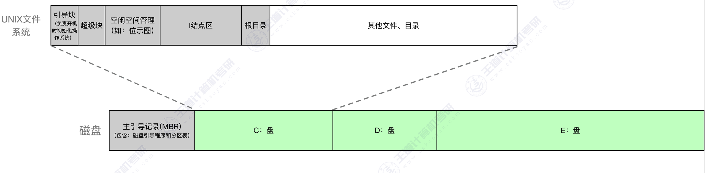
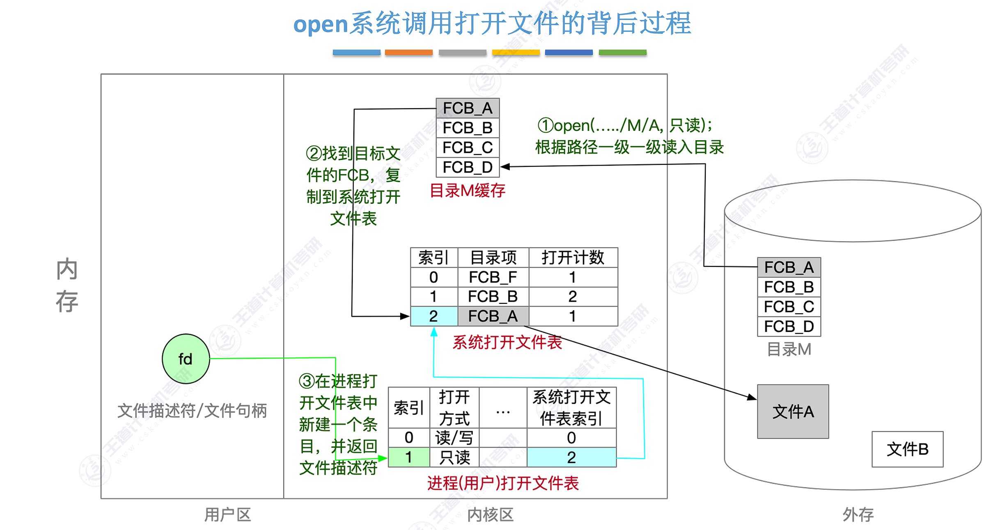
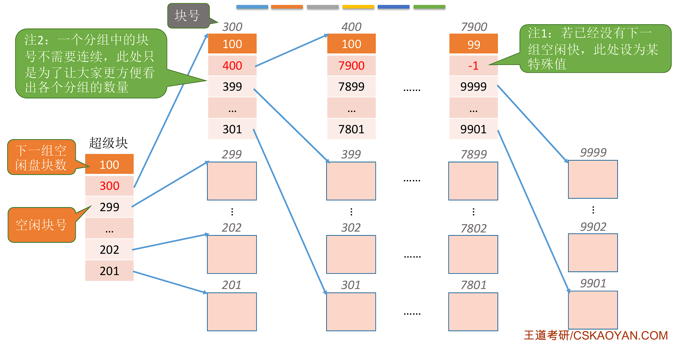

<h2 align="center">第四章 文件管理</h2>

> **408 高频考点提醒**：
> - 文件逻辑结构：无结构（流式文件）vs 有结构（记录式）；顺序文件**定长可随机存取、变长只能顺序**
> - 目录项 = **FCB**；引入 **i-node** 后目录项只含"文件名 + i-node 指针"，目录变小、**检索加快**
> - 打开文件 = 检索目录 + **FCB 复制到内存打开文件表** + 返回文件描述符（后续读写**不再检索目录**）
> - 文件分配三方式：连续（**外部碎片**、扩展难）/ 链接（隐式只能顺序；**FAT 常驻内存**支持随机）/ 索引（单级 **2 次访存**、多级每级 +1）
> - **2009 真题**：8 地址项混合索引最大文件长度 = 5KB + 512KB + 65536KB = **66053KB**
> - 目录结构四种：单级（不能重名）/ 两级（**MFD + UFD**）/ 树形（绝对/相对路径）/ **无环图**（共享计数、防环）
> - 文件共享：**硬链接**（同一 i-node，引用计数为 0 才删除）vs **软链接**（存路径，原文件删除则失效）
> - 文件保护：口令（易泄露）/ 加密（开销大）/ **ACL 访问控制**（UNIX 9 位权限 rwx × 属主/组/其他）
> - 空闲空间管理四方法：空闲表 / 空闲链表 / **位示图**（盘块 ↔ 字号位号换算公式）/ **成组链接法**（UNIX，分组 + 栈）
> - **VFS** 统一接口（超级块/索引节点/dentry/文件四对象）；挂载点**必须是目录**

---

### （一）文件系统基础

#### 一、文件的基本概念

##### 1. 文件与文件系统

**文件（File）**：存储在外存上的一组相关信息的集合，是操作系统管理的**基本信息单位**，以**文件名**为标识。

**文件概念的三个层次**：

| 层次 | 定义 |
|:--:|:---|
| **数据项** | 文件系统中**最低级的数据组织形式**，分为**基本数据项**（不可再分，如一个字段）与**组合数据项**（若干基本数据项组成） |
| **记录** | 一组**相关的数据项**的集合，用于描述**一个对象在某方面的属性**（如一条学生记录 = 学号 + 姓名 + 成绩） |
| **文件** | 由创建者所定义的、**具有文件名**的一组**相关元素**的集合，分为**有结构文件**（记录式）和**无结构文件**（流式）两种 |

> **考点**：层次关系 = **数据项 ⊂ 记录 ⊂ 文件**；"有结构 / 无结构文件"即 **4.1.5 文件的逻辑结构**分类（有结构 = 记录式）。

**文件的分类（教材）**：

| 分类依据 | 类型 |
|:---|:---|
| **按性质和用途** | **系统文件**（操作系统等系统软件，用户不可直接读写）、**用户文件**（用户建立）、**库文件**（标准子例程/常用例程，如库函数） |
| **按数据形式** | **源文件**（源程序，ASCII 码）、**目标文件**（编译后的目标代码）、**可执行文件**（链接后可运行） |
| **按存取控制属性** | **可执行文件**（不经授权不可读）、**只读文件**（只读不可写）、**读/写文件**（可读可写） |
| <nobr>**按组织形式和处理方式**</nobr> | **普通文件**、**目录文件**（目录本身也是文件）、**特殊文件**（设备文件，如字符/块设备） |

> **考点**：**特殊文件 = 设备文件**（UNIX"一切皆文件"思想）；**目录文件**说明目录在文件系统中也是以文件形式管理；同一文件按不同依据可归入不同类别。

**文件系统（File System）**：操作系统负责管理文件的软件（文件管理程序）以及被管理对象（文件、目录）的**集合**，为用户提供文件的逻辑视图与访问接口。

**文件的属性**：

| 属性 | 说明 |
|:---|:---|
| **名称** | 文件名（唯一标识文件的符号名，由用户命名） |
| **标识符** | 系统内部的**唯一标识**（如 i-node 号），对用户透明 |
| **类型** | 普通文件、目录文件、设备文件等 |
| **位置** | 文件在**外存中的物理位置**（FCB 中记录） |
| **大小** | 文件的长度（字节数） |
| **保护** | 访问控制信息（谁能读、写、执行） |
| **时间 / 日期 / 用户标识** | 创建、修改、访问时间以及创建者 |

> **考点**：文件名是**用户**使用的符号名（可重复、可修改），标识符是**系统**使用的唯一编号——文件检索最终靠标识符（如 i-node 号）定位。

#### 二、文件控制块和索引节点

##### 1. 文件控制块 FCB

**文件控制块（FCB, File Control Block）**：为管理文件而设置的**数据结构**，存放文件全部管理信息，是文件存在的**标志**。**目录项 = FCB**（目录中每个目录项就是一个文件的 FCB）。

```
┌────────────────────────────────────┐
│   File Control Block (FCB)         │
├────────────────────────────────────┤
│  Basic info : name / type / size   │
│  Access info : owner / permission  │
│  Usage info : open count / time    │
│  Location info : data block ptrs   │
└────────────────────────────────────┘
```

> 图：FCB 内容包括基本信息（文件名、类型、大小、逻辑结构、物理结构）、存取控制信息（属主、权限）、使用信息（打开计数、时间）、位置信息（数据块指针）。

| 内容类别 | 具体信息 |
|:---|:---|
| **基本信息** | 文件名、物理位置（数据块指针）、**逻辑结构、物理结构**、文件类型、大小 |
| **存取控制信息** | 文件属主、访问权限 |
| **使用信息** | 打开文件计数、创建/修改时间 |

> **考点**：检索目录的本质是**逐个比较目录项的文件名**，目录项（FCB）越大，检索速度越慢——这是引入索引节点（i-node）的直接原因。

##### 2. 索引节点 i-node

**索引节点（i-node, index node）**：把 FCB 中除文件名外的**所有信息**都放入 i-node，目录项只保留**文件名 + i-node 指针**。

```
┌─────────────┬───────────────┐
│  File name  │  i-node no.   │
└─────────────┴───────────────┘
```

> 图：引入 i-node 后目录项瘦身为"文件名 + i-node 编号（指针）"。

**两种索引节点**：

| 类型 | 存放位置 | 内容 |
|:---|:---|:---|
| **磁盘索引节点** | 磁盘（i-node 区） | 文件主/次号、类型、访问权限、物理地址、长度、链接计数等 |
| **内存索引节点** | 内存（文件被打开时） | 磁盘 i-node 的副本 + **i-node 号、访问计数、是否被修改**等 |

```
┌────────────────────────────────┐
│      Disk inode (i-node)       │
├────────────────────────────────┤
│  Mode / Owner / Link count     │
│  File size / Timestamps        │
│  Direct blocks : d[0]..d[4]    │
│  Single indirect : d[5] , d[6] │
│  Double indirect : d[7]        │
└────────────────────────────────┘
```

> 图：磁盘 i-node 保存文件除文件名外的全部信息，包括属性、链接计数与数据块地址（直接/间接）。

> **考点**：引入 i-node 的好处——**目录项变小**（去掉大量属性信息），一个磁盘块可容纳**更多目录项**，检索目录时读入的盘块数减少，**按名检索速度提高**。

**为什么要用索引节点（教材数值推导）**：

**题目**：设 FCB 为 64B，盘块大小 1KB（FCB 必须连续存放），一个文件目录共有 640 个 FCB。直接以 FCB 作目录项时，查找文件平均需启动磁盘几次？引入 i-node 后（目录项 = 14B 文件名 + 2B i-node 号 = 16B）又是几次？

| 项目 | 目录项 = FCB（64B） | 目录项 = 文件名 + i-node 号（16B） |
|:---|:---|:---|
| 每盘块可存目录项数 | 1KB ÷ 64B = **16 个** | 1KB ÷ 16B = **64 个** |
| 640 项目录占用盘块数 | 640 ÷ 16 = **40 块** | 640 ÷ 64 = **10 块** |
| 平均启动磁盘次数 | 40 ÷ 2 = **20 次** | 10 ÷ 2 = **5 次** |

> **解释**：按名检索 = 从目录第一项开始**顺序比较文件名**，目标等概率出现在任意位置 → 平均读**一半**的目录盘块（40 ÷ 2、10 ÷ 2）。
> **结论**：目录项瘦身为原来的 1/4（64B → 16B），目录盘块数也降为 1/4（40 → 10），平均启动磁盘次数从 **20 次降到 5 次（减少到原来的 1/4）**，大大节省系统开销。
> **考点**：i-node 的收益本质 = **目录变小 → 检索目录的磁盘 I/O 次数成比例下降**（磁盘 I/O 是文件系统主要开销）；目录变小后也更易**常驻内存/缓存**，检索更快。

#### 三、文件的操作

##### 1. 文件的基本操作

| 操作 | 内容 |
|:---|:---|
| **创建（create）** | ① 分配 FCB 并在目录中登记（新建目录项）② 分配外存空间 |
| **删除（delete）** | ① 从目录中删除目录项 ② **回收外存空间**（相应盘块变为空闲） |
| **读（read）** | 根据文件的物理结构，把数据从外存读到内存（配合读写指针） |
| **写（write）** | 根据文件的物理结构，把内存数据写入外存 |
| **截断（truncate）** | 把**文件长度置 0**，保留文件属性（如访问权限），空间重新分配 |
| **设置读写位置（seek）** | 调整读写指针位置，为后续**读/写**定位（读写前先定位） |

> **注意**：截断 ≠ 删除——删除把目录项一起删掉，截断只清空文件内容、保留"外壳"（FCB 与属性）。

##### 2. 文件的打开与关闭

```
open("file"):  检索目录 → 找到 FCB → 把 FCB 复制到内存打开文件表 → 返回文件描述符 fd
read(fd):      按 fd 定位打开文件表项 → 直接读写（不再检索目录）
close(fd):     删进程级表项 → count 减 1 → count = 0 才删系统级表项（修改过写回磁盘）
```

**open 系统调用的处理步骤**：

- **① 检索目录**：根据文件存放**路径**找到相应的**目录文件**，从中找到文件名对应的**目录项**，并检查该用户是否有指定的**操作权限**
- **② 登记打开**：将目录项**复制**到内存中的**打开文件表**，并把对应表目的**编号（fd, file descriptor）**返回给用户；之后用户以该编号指明要操作的文件

> **注意**：open 的意义 = 把 FCB 复制到内存 + 返回 fd，此后 read/write **只凭 fd 定位、不再按名检索目录**（避免每次 I/O 都检索目录）；步骤①还进行**权限检查**（读/写/执行权限）。

**两级打开文件表**：

```
┌───────────────────────┐        ┌───────────────────────┐
│   System open-file    │        │   Per-process open-   │
│   table (shared)      │        │   file table (per     │
│   : FCB + open count  │        │   process)            │
│   : current position  │        │   : fd -> index into  │
│   : ...               │        │   system table        │
└───────────────────────┘        └───────────────────────┘
```

> 图：系统级打开文件表（整个系统一张，含 FCB 副本与打开计数，供多进程共享）+ 进程级打开文件表（每个进程一张，fd → 系统表项索引 + 各自读写指针）。

| 表 | 范围 | 内容 | 作用 |
|:---|:---|:---|:---|
| <nobr>**系统级打开文件表**</nobr> | <nobr>整个系统一张</nobr> | FCB 副本、打开计数、读写位置 | 同一文件被多进程打开时共享，计数控制何时写回/删除 |
| **进程级打开文件表** | 每个进程一张 | 指向系统表项的索引、访问权限、读写指针 | 每个进程独立的访问位置与权限 |

**关闭文件（close）系统调用的处理步骤（教材）**：

- **① 删除进程级表项**：将进程的打开文件表中相应表项删除
- **② 回收资源**：回收分配给该文件的内存空间等资源
- **③ 计数器减 1**：系统打开文件表的打开计数器 **count 减 1**；若 **count = 0**，则删除系统级对应表项（文件被修改过则先**写回磁盘**）

> **易错点**：close 只删**进程级表项**；**系统级表项是否删除看 count**——其他进程仍打开该文件（count > 0）时，系统级表项与磁盘 FCB 均不动。

> **考点**：多个进程共享同一文件时用**系统级表的打开计数**管理。
> **易错点**：文件描述符 fd 是**进程级表项的索引**，不是磁盘地址；不同进程打开同一文件的 fd 可以不同，但最终指向**同一系统级表项**。

#### 四、文件保护

**为什么要保护文件**：文件是信息的载体，保护的目标是**防止未经授权的访问**（读/写/执行）与**破坏**（修改、删除、窃取）——限制"**谁能对文件做什么操作**"。

在文件系统中必须建立相应的**文件保护机制**，可通过**口令保护、加密保护、访问控制**等方式实现（见 1. 保护方法）。

##### 1. 保护方法

| 方法 | 原理 | 优点 | 缺点 |
|:---|:---|:---|:---|
| **口令保护** | 访问文件前必须输入**口令**（口令可存 FCB 或单独文件） | 实现**简单**、开销小 | **口令易泄露**；口令存于系统内易被窃取 |
| **加密保护** | 文件**内容加密**存放，访问时需密钥解密 | **安全**（即使文件被窃取也无法读出） | **加密/解密开销大**；密钥管理复杂 |
| **访问控制** | **访问控制表（ACL, Access Control List）**：每个文件列出**各用户及其允许的操作** | 灵活、精确（可按用户授权） | 表项多时**开销大** |
| <nobr>**UNIX 9 位权限**</nobr> | 三类用户（**属主/组/其他**）× 三种操作（**rwx**）= 9 位权限位 | 实现简单、空间省 | 粒度粗（同组用户权限相同） |

**精简 ACL 的三类用户（教材）**：

| 用户类型 | 含义 |
|:---|:---|
| **拥有者（Owner）** | **创建文件**的用户 |
| **组（Group）** | 一组需要**共享文件**且访问方式**类似**的用户 |
| **其他（Others）** | 系统内的**所有其他用户** |

> **注意**：精简 ACL 把用户压缩为"拥有者/组/其他"三类——UNIX 9 位权限正是每类用户用 **rwx** 三位表示；完整 ACL 可精确到每个用户（见 2）。

> **考点**：ACL 粒度**最细、最灵活**（可精确到每个用户）；UNIX 9 位权限表示"属主/组/其他"三类用户各自的"读 r/写 w/执行 x"权限；口令保护最简单但**安全性最差**。
> **易错点**：加密保护保护的是**内容**（密文），口令保护保护的是**访问权**（验证身份）；两者可以结合使用。

##### 2. 访问控制的两种实现方式

| 对比项 | 访问控制表 ACL | 能力表（Capability List） |
|:---|:---|:---|
| 视角 | **文件视角**：每个文件一张表，列出各用户/组对该文件的权限 | **用户视角**：每个用户（进程）一张表，列出其可访问的文件及权限 |
| 检索方式 | 访问文件时查**该文件的 ACL** | 访问文件时查**自己的能力表** |
| 收回权限 | **容易**（从 ACL 中删掉该用户表项即可） | **困难**（须找到并回收分散的能力表项） |
| 空间开销 | 文件多时 ACL 总量大 | 用户多时能力表总量大 |
| 典型系统 | Windows NTFS、UNIX ACL | 早期系统（如剑桥 CAP） |

> **考点**：ACL 以**文件**为中心（"这个文件谁能访问"），**便于收回权限**；能力表以**用户**为中心（"这个用户能访问哪些文件"），检索快但收回权限难。

##### 3. 访问类型

| 访问类型 | 说明 |
|:---|:---|
| **读（Read）** | 从文件中读 |
| **写（Write）** | 向文件中写 |
| **执行（Execute）** | 将文件装入内存并执行 |
| **添加（Append）** | 将新信息添加到文件**结尾**部分（不覆盖原有内容） |
| **删除（Delete）** | 删除文件，**释放空间** |
| **列表清单（List）** | 列出**文件名和文件属性** |

> **考点**：完整的访问类型**不止 rwx**，还有**添加、删除、列表清单**（如对目录的遍历/列表权限）；访问控制通常**按访问类型分别授权**。

#### 五、文件的逻辑结构

**逻辑结构**：从用户视角看文件的组织形式（与物理存储无关）。

<table>
    <thead>
        <tr>
            <th>类别</th>
            <th>结构</th>
            <th>说明</th>
        </tr>
    </thead>
    <tbody>
        <tr>
            <td><b>无结构文件（流式文件）</b></td>
            <td>—</td>
            <td>文件由<b>字节流</b>组成，无记录概念（如 .txt、可执行文件）；长度以字节计，以字节为单位访问</td>
        </tr>
        <tr>
            <td rowspan="4"><b>有结构文件（记录式文件）</b></td>
            <td><b>顺序文件</b></td>
            <td>由<b>记录</b>按顺序排列；记录<b>定长</b>时可<b>随机存取</b>（第 i 条记录 = 始址 + i × 记录长度），<b>变长</b>时只能<b>顺序存取</b></td>
        </tr>
        <tr>
            <td><b>索引文件</b></td>
            <td>为每条记录建立<b>索引项</b>（索引表），按索引表随机存取；插入删除方便，但索引表<b>占用额外空间</b></td>
        </tr>
        <tr>
            <td><b><nobr>索引顺序文件</nobr></b></td>
            <td>记录<b>分组</b>，只为<b>每组第一条记录</b>建立索引；查找 = 先查索引确定组，再<b>组内顺序查找</b></td>
        </tr>
        <tr>
            <td><b><nobr>直接文件 / 哈希文件</nobr></b></td>
            <td>按记录<b>键值</b>直接定位：直接文件 = 键值 → 物理地址；哈希文件 = <b>Hash 函数</b> + 目录表；不建索引，<b>查找最快</b></td>
        </tr>
    </tbody>
</table>

<table>
    <tbody>
        <tr>
            <td align="center"></td>
            <td align="center"></td>
            <td align="center"></td>
        </tr>
        <tr>
            <td align="center"><b>顺序文件</b></td>
            <td align="center"><b>索引文件</b></td>
            <td align="center"><b>索引顺序文件</b></td>
        </tr>
    </tbody>
</table>
> **考点**：顺序文件**定长记录才能随机存取**（地址 = 起始地址 + 记录号 × 记录长度）；变长记录必须顺序查找。索引文件与索引顺序文件的区别：索引文件**每条记录一个索引项**，索引顺序文件**每组一个索引项**（索引更小，但组内需顺序查）。
> **注意**：逻辑结构解决"**用户怎么看文件**"（字节流 / 记录），物理结构解决"**文件怎么存**"（4.1.6 的盘块分配方式）——两者相互独立。

#### 六、文件的物理结构（文件分配方式）（重点）

**物理结构**：文件在外存上的存放（分配）方式，决定文件块与盘块（物理块）的映射关系。

##### 1. 连续分配

- 每个文件占据一组**连续的盘块**；FCB（目录项）记录**起始块号 + 文件长度**
- 逻辑块号 → 物理块号：**物理块号 = 起始块号 + 逻辑块号**（一步算出，**顺序、随机存取都很快**）
- **缺点**：① 产生**外部碎片**（不连续的小空闲区，需紧凑处理，代价大）② **文件扩展困难**（其后可能已被其他文件占用，只能预留空间或移动文件）

> **考点**：连续分配**支持随机存取**、实现简单、访问最快，但**外部碎片** + **文件长度固定、难以扩展**。

##### 2. 链接分配

**① 隐式链接（implicit linkage）**：

- 每个盘块的**末尾**存放**下一块的指针**；FCB 记录**首块号 + 末块号**
- 只能**顺序存取**（访问第 i 块须沿链走 i−1 步）；**坏块导致断链**；指针本身占盘块空间

**② 显式链接（explicit linkage）**：

- 把所有指针集中存放在**文件分配表（FAT, File Allocation Table）**中，FCB 只记录**首块号**
- FAT 在**系统启动时读入内存并常驻**，查 FAT 即得下一块地址 → **支持随机访问**
- **缺点**：FAT 与盘块一一对应，**FAT 占用内存大**（每盘块一个表项）

| 对比项 | 隐式链接 | 显式链接（FAT） |
|:---|:---|:---|
| 指针存放 | 分散在每个盘块末尾 | **集中存放在 FAT** |
| 随机存取 | 不支持（只能顺序） | **支持**（FAT 常驻内存） |
| 目录项内容 | 首块号 + 末块号 | 首块号 |
| 坏块影响 | **断链**，其后文件丢失 | 无影响 |
| 代价 | 指针占盘块空间 | **FAT 占内存大** |

> **考点**：显式链接 vs 隐式链接的**本质区别是指针存放位置**；FAT 常驻内存（Windows FAT32 文件系统的基础）使**随机访问成为可能**。

##### 3. 索引分配

- **单级索引**：为文件建立**索引块**（存放所有数据块的块号），FCB 记录**索引块地址**；访问一个数据块 = 读索引块 + 读数据块 = **2 次磁盘 I/O（访存）**
- **多级索引**：两级索引 = 一级索引块 + 二级索引块 + 数据块 = **3 次访存**；**每多一级增加 1 次**
- **混合索引（UNIX）**：直接地址（少量数据块指针）+ 一级间接 + 二级间接 + 三级间接——小文件用直接地址（快）、大文件用多级间接（省索引块）

> **考点**：单级索引访问一个数据块需要 **2 次**磁盘 I/O，两级需要 **3 次**；混合索引兼顾**小文件速度**与**大文件容量**（直接地址省去索引块读取）。
> **易错点**：索引分配**无外部碎片**（文件离散存放），但索引块本身占用空间——小文件用直接地址正是为了省掉索引块。

##### 4. 三种分配方式对比表

| 对比项 | 连续分配 | 链接分配 | 索引分配 |
|:---|:---|:---|:---|
| 顺序存取 | 快（直接寻址） | 慢（需沿链逐块走） | 较快（查索引表） |
| 随机存取 | **支持**（起始块 + 偏移） | 不支持（隐式） | **支持**（查索引块） |
| 目录项（FCB）内容 | 起始块号 + 文件长度 | 首块号 + 末块号（隐式）；仅首块号（FAT） | 索引块地址 |
| 外部碎片 | **有** | 无 | 无 |
| 文件扩展 | **困难** | 容易 | 容易 |
| 优点 | 顺序/随机都快、实现简单 | 无外部碎片、扩展容易 | 无外部碎片、支持随机、扩展容易 |
| 缺点 | 外部碎片、扩展困难 | 只宜顺序存取、断链问题 | 索引块占用空间、多级访存次数多 |

##### 5. 例题（2009 统考真题）

**题目**：某文件系统索引节点中有 **8 个地址项**，其中 **5 个为直接地址索引，2 个为一级间接索引，1 个为二级间接索引**。磁盘索引块和数据块大小均为 **1KB**，每个盘块号占 **4B**。求该文件系统可表示的最大文件长度。

| 已知条件 | 数值 |
|:---|:---|
| 直接地址索引 | 5 个 |
| 一级间接索引 | 2 个 |
| 二级间接索引 | 1 个 |
| 索引块 / 数据块大小 | 1KB |
| 每个盘块号 | 4B |
| 每个索引块可存块号数 | 1KB ÷ 4B = **256 个** |

**计算**：

- 直接地址：5 个数据块 → 5 × 1KB = **5KB**
- 一级间接：2 个索引块 × 256 个块号 → 2 × 256 × 1KB = **512KB**
- 二级间接：1 个二级索引块 → 256 个一级索引块 → 256 × 256 = 65536 个数据块 → **65536KB**

| 地址项 | 可指向的数据块数 | 表示的容量 |
|:---|:---|:---|
| 5 个直接地址 | 5 | 5 × 1KB = 5KB |
| 2 个一级间接 | 2 × 256 = 512 | 512 × 1KB = 512KB |
| 1 个二级间接 | 256 × 256 = 65536 | 65536 × 1KB = 65536KB |
| **合计** | | **66053KB ≈ 64.5MB** |

$$最大文件长度 = 5 \times 1KB + 2 \times 256 \times 1KB + 256 \times 256 \times 1KB = 5KB + 512KB + 65536KB = 66053KB \approx 64.5MB$$

> **易错点**：二级间接是 **256 × 256 = 65536** 个数据块（先经一级索引块映射两次），不是 256 × 2；间接地址的容量要**先乘索引块数**再乘每块大小。

---

### （二）目录管理

#### 一、目录管理的概念

**目录（Directory）**：由**目录项（FCB）组成的有序集合**，即**目录文件**——目录本身也是文件，存放在外存上（数据区），其内容是各文件的 FCB。

**目录的作用**：

| 作用 | 说明 |
|:---|:---|
| **按名存取** | 用户按文件名访问，系统检索目录实现"文件名 → 物理地址"的映射 |
| **提高检索速度** | 目录按名组织（配合哈希表等），加快查找 |
| **文件共享** | 目录结构支持多用户共享同一文件（链接） |
| **文件保护** | 目录项记录访问控制信息，实现权限控制 |

#### 二、目录结构

##### 1. 单级目录

- 整个系统**一张目录表**，所有文件登记其中（按名排序、线性查找）
- **缺点**：① 文件**不能重名**（唯一文件名）② 文件多时**查找慢** ③ 无访问控制（所有用户可访问所有文件）

```
单级目录（一张表，全体用户共享）:
  ├─ 文件 A（FCB: 起始块、长度、属性...）
  ├─ 文件 B（FCB: ...）
  └─ ...（用户不能创建同名文件）
```

##### 2. 两级目录

- **主文件目录（MFD, Master File Directory）**：**每个用户一项**，指向该用户的用户文件目录
- **用户文件目录（UFD, User File Directory）**：每个用户的文件目录（各用户一张）
- **优点**：解决**重名**（不同用户可以有同名文件）、**用户隔离**（互不可见、可设访问权限）
- **缺点**：用户内部的文件仍无层次结构

```
主文件目录 MFD（每用户一项）:
  ├─ 用户甲 → UFD(甲): 文件 a.txt, b.c, ...
  └─ 用户乙 → UFD(乙): 文件 a.txt, d.doc, ...
```

##### 3. 多级（树形）目录

- 目录像树一样逐级嵌套：根目录 → 各级子目录 → 文件；**检索快、层次清晰、便于分类**
- **绝对路径**：从**根目录**出发的完整路径（如 /home/usr/a.txt）
- **相对路径**：从**当前目录（工作目录）** 出发的路径（如 ../../a.txt）
- **当前目录（工作目录）**：进程当前所处的目录，由系统为每个进程维护
- **缺点**：树形结构**不便于文件共享**（一个文件只有一个父目录位置）

```
根目录 /
  ├─ 用户甲
  │   ├─ 文档 d.txt
  │   └─ 程序 p.c
  └─ 用户乙
      └─ 图片 img.png
```

> **考点**：绝对路径以**根**开始、相对路径以**当前目录**开始；切换工作目录可**缩短相对路径**、减少检索目录的次数。

##### 4. 无环图目录

- 在**树形目录基础上增加共享链接**：一个文件可被多个目录指向（不形成环）
- 每个共享文件维护**共享计数（link count）**：每增加一个链接计数 +1；**删除文件 = 计数减 1，计数为 0 才真正删除** i-node 和数据块
- **防止环路**：不允许目录项指向自身或自己的祖先（形成环则无法确定"删除时机"）

```
根目录
  ├─ 用户甲 ──► 文件 F（link count = 2）
  ├─ 用户乙 ──► 文件 F
  └─ 用户丙 ──► 目录 G
```

**四种目录结构对比**：

| 目录结构 | 能否重名 | 能否共享 | 检索速度 | 主要缺点 |
|:---|:---|:---|:---|:---|
| **单级目录** | 不能 | 不方便 | 慢（线性查找） | 不能重名、无访问控制 |
| **两级目录** | 不同用户可同名 | 用户间不方便 | 较快（两级查表） | 用户内部无结构 |
| **树形目录** | 可以 | 不方便 | 快 | 不便于共享 |
| **无环图目录** | 可以 | **方便（共享计数）** | 快 | 需防环路、维护计数 |

#### 三、目录的操作

| 操作 | 说明 |
|:---|:---|
| **搜索（search）** | 按文件名查找目录项（按名存取的基础） |
| **创建文件** | 新建目录项（分配 FCB） |
| **删除文件** | 删除目录项（共享文件时减少链接计数） |
| **列出目录（list）** | 显示目录内容（ls / dir），通常支持通配符（*.c） |
| **重命名文件** | 修改目录项中的文件名（只改目录项，不改文件内容） |
| **遍历文件系统** | 沿目录树访问所有文件（如 find、备份工具） |
| **创建目录** | 在**树形目录结构**中，用户可创建自己的**用户文件目录**，并可再创建**子目录** |
| **删除目录** | 两种方式：**① 不删除非空目录**——目录（文件）非空时不能删除，须先删除其中所有文件使其成为**空目录**后再删；含子目录时必须**递归删除**（MS-DOS 方式）**② 可删除非空目录**——删除目录时，其中**所有文件和子目录同时被删除** |
| **移动目录** | 将文件或子目录在**不同父目录之间**移动，文件的**路径名随之改变** |
| **显示目录** | 请求显示目录内容，如显示**该用户目录中的所有文件及属性** |
| **修改目录** | 某些**文件属性保存在目录中**，这些属性变化需**改变相应目录项** |

> **注意**：**重命名只修改目录项**（文件名），文件数据与 i-node 不变；删除非空目录有**两种策略**（先清空再删 vs 连同内容一起删）；**移动目录会改变文件路径名**，可能导致指向它的链接失效；遍历文件系统是文件系统备份与一致性检查的基础。

#### 四、目录的实现

| <nobr>实现方式</nobr> | 原理 | 优点 | 缺点 |
|:---|:---|:---|:---|
| **线性表** | 目录项按文件名顺序存放在一张线性表（数组/链表）中 | **实现简单**、无需额外结构 | 文件多时**线性查找慢** |
| **哈希表** | 对文件名做哈希直接定位目录项 | **查找快**（O(1) 平均） | 需**处理冲突**（链地址法、开放定址法） |

> **考点**：哈希表按文件名求哈希定位目录项，查找时间复杂度低，但要处理**哈希冲突**；线性表实现简单但查找代价随文件数线性增长。

#### 五、文件共享

**① 基于索引节点的共享（硬链接）**：

```
目录项 A: ["file1.txt" | Inode #1024] ──┐
                                       ├──> [ Inode #1024 (count=2) ] ──> [ 实际数据块 ]
目录项 B: ["file2.txt" | Inode #1024] ──┘
```

- **多个目录项指向同一个 i-node**（目录项内容 = 文件名 + i-node 指针）
- i-node 中记录**链接计数（link count）**；**删除**某个目录项 = **计数减 1**，只有**计数为 0** 时才真正删除 i-node 和数据块
- 原文件删除后，**链接仍有效**（数据仍存在）

**② 符号链接（软链接 / 快捷方式）**：

```
[ User1 目录项: "aaa" ] ──┐
                         ├──> [ Inode #1 (Count=2) ] ──> [ 文件1 真实数据块 ]
[ User2 目录项: "bbb" ] ──┘             ▲
                                       │ (redirect by path)
[ User3 目录项: "ccc" ] ──> [ Inode #2 (Count=1) ] ──> [ 数据块: "C:/User1/aaa" ]
```

> 图：软链接按路径重定向——User3 的目录项存的是目标文件路径（C:/User1/aaa），访问时先读该路径，再按路径定位到 Inode #1 的真实数据块。

>**硬链接（User1 & User2）**：指针汇聚在 **Inode 层**（直接共享元数据与底层数据）。
>
>**软链接（User3）**：依赖建立在 **路径层**（多绕一圈，通过目标文件名间接共享）。

- 目录项存**目标文件的路径**（不是 i-node 指针）
- 访问软链接 = **先读链接文件，再按路径访问目标文件（2 次访盘）**
- 原文件**被删除 → 链接失效**（悬空链接，访问报错）

| 对比项 | 硬链接 | 软链接（符号链接） |
|:---|:---|:---|
| 目录项内容 | i-node 指针 | **目标文件路径** |
| 原文件删除后 | 链接仍有效（计数 −1） | **失效**（目标不存在） |
| 访问开销 | 1 次访盘（直接按 i-node） | **2 次**（读链接 + 读目标） |
| 能否跨文件系统 | 不能（i-node 归属同一卷） | **可以**（路径可指向任何地方） |
| 典型例子 | UNIX link 命令 | Windows 快捷方式、UNIX ln -s |

> **考点**：硬链接共享的是**同一个 i-node**，link count 为 0 才真正删除；软链接存**路径**，原文件删除后链接失效，访问需**两次访盘**。
> **注意**：文件的保护方法（口令 / 加密 / ACL / UNIX 9 位权限）见 **4.1.4 文件保护**。

---

### （三）文件系统

#### 一、文件系统结构

**文件系统设计的两个问题：

1. **定义用户接口**——定义文件及其属性、所允许的文件操作、如何组织文件的**目录结构**
2. **创建算法和数据结构**——以便把**逻辑文件系统映射到物理外存设备**

**层次结构详解**：

| 层 | 主要职责 |
|:---|:---|
| **① I/O 控制层** | 含**设备驱动程序 + 中断处理程序**，在内存与磁盘之间传输信息；设备驱动程序把**输入的命令翻译成底层硬件的特定指令**，告诉 I/O 控制器对设备的什么位置采取什么动作 |
| **② 基本文件系统** | 向设备驱动程序发送**通用命令**，以读/写磁盘的**物理块**（每个物理块由磁盘地址标识）；管理**内存缓冲区**，保存文件系统、目录和数据块的**缓存**（传输前分配合适的缓冲区） |
| <nobr>**③ 文件组织模块**</nobr> | 组织文件及其**逻辑块和物理块**；把文件的**逻辑块地址转换为物理块地址**（逻辑块 0~N 与物理块不匹配，需转换定位）；还包含**空闲空间管理器**（跟踪未分配块，按需提供给文件组织模块） |
| **④ 逻辑文件系统** | 管理文件系统的**元数据**（所有结构信息，**不含实际数据/文件内容**）；管理**目录结构**，按给定文件名提供信息；通过 **FCB 维护文件结构**；负责**文件保护** |

> **考点**：四层职责一句话——**I/O 控制层**（驱动+中断，管硬件）、**基本文件系统**（读写物理块+缓存管理）、**文件组织模块**（逻辑块↔物理块转换+空闲管理）、**逻辑文件系统**（元数据+目录+FCB+保护）。
> **对照**：教材四层（I/O 控制/基本文件系统/文件组织模块/逻辑文件系统）与王道五层（用户接口/文件目录系统/存取控制验证/逻辑文件系统+缓冲区/物理文件系统）的对应——逻辑文件系统 ≈ 文件目录系统+存取控制验证；文件组织模块 ≈ 逻辑文件系统与缓冲区（块号转换）；基本文件系统+I/O 控制层 ≈ 物理文件系统。

#### 二、文件系统布局

**1. 文件系统在磁盘中的结构**

文件系统存放在磁盘上，多数磁盘划分为**一个或多个分区**，每个分区中有一个**独立的文件系统**。文件系统可能包括：**启动存储在那里的操作系统的方式、总的块数、空闲块的数量和位置、目录结构以及各个具体文件**等。

磁盘的三个层次：**原始磁盘 → 物理格式化（划分扇区）→ 磁盘分区**（分区表给出每个分区的起始和结束地址）。

```
原始磁盘:   [ 连续存储介质 ]（未格式化）
物理格式化: [ 扇区 | 扇区 | ... | 坏扇区 | 扇区 | ... ]（划分扇区并标记坏扇区）
磁盘分区:   [ MBR+分区表 | 分区 1 | 分区 2 | ... | 备用扇区 ]
```



| 磁盘区域 | 说明 |
|:---|:---|
| **主引导记录 MBR** | 位于磁盘的 **0 号扇区**，用来**引导计算机**；MBR 的后面是**分区表**，给出每个分区的**起始和结束地址** |
| **引导块（boot block）** | MBR 执行引导块中的程序后，该程序负责**启动该分区中的操作系统** |
| <nobr>**超级块（superblock）**</nobr> | 包含文件系统的**所有关键信息**：分区的**块的数量、块的大小、空闲块的数量和指针、空闲 FCB 的数量和 FCB 指针**等；在**计算机启动 / 文件系统首次使用时读入内存** |
| **空闲块信息** | 可以用**位示图**或**指针链接**的形式给出 |

**2. 文件系统在内存中的结构**

| 内存结构 | 说明 |
|:---|:---|
| **安装表（mount table）** | 包含每个**已安装文件系统分区**的有关信息 |
| **目录结构缓存** | 包含**最近访问目录**的信息（加快目录检索） |
| **系统级打开文件表** | 包含每个打开文件的 **FCB 副本、打开计数**及其他信息（整个系统一张） |
| **进程级打开文件表** | 包含进程打开文件的**文件描述符（Windows 称文件句柄）**和指向**系统打开文件表中对应表项的指针** |

> **考点**：磁盘结构链 = **MBR（0 号扇区，含分区表）→ 引导块 → 超级块 → 空闲块信息**；超级块含文件系统全部关键信息，**启动时读入内存**。内存结构四张表 = **安装表 + 目录缓存 + 系统打开文件表 + 进程打开文件表**。
> **易错点**：MBR 在**磁盘 0 号扇区**（引导计算机）；引导块在**各分区内**（启动该分区的 OS）；超级块是**分区级**关键信息（每分区一个）。
> **注意**：超级块是"卷的控制块"，一个分区一个；**0 号扇区固定存放 MBR**，分区内部其余区域布局随文件系统类型而异（如 FAT 文件系统用 FAT 表代替 i-node 区）。



#### 三、外存空闲空间管理（重点）

##### 1. 空闲表法

- 建立**空闲分区表**：每个表项记录**首盘块号 + 连续盘块数**，按地址递增排列
- 与内存的**动态分区分配**相同：可为文件分配连续盘块，采用**首次适应 / 最佳适应 / 最坏适应**等算法；文件删除后相邻空闲区**合并**

| 表项 | 内容 |
|:---|:---|
| 空闲分区 1 | 首盘块号 3，连续 5 块 |
| 空闲分区 2 | 首盘块号 12，连续 8 块 |
| ... | ... |

> **考点**：空闲表法**与动态分区分配完全类似**（都是"首址 + 长度"的连续区管理），适用于**连续分配**方式下的文件系统。

##### 2. 空闲链表法

| 方式 | 原理 | 特点 |
|:---|:---|:---|
| **空闲盘块链** | 把所有空闲盘块**逐个串成链表**（每块存下一块指针）操作系统保存头指针和尾指针 | 分配/回收以**盘块**为单位，简单；但**大文件需多次分配**，可能产生碎片 |
| <nobr>**空闲盘区链**</nobr> | 把**连续的空闲盘区**（多个盘块）串成链表，表项记录盘区长度 | 可一次分配**多个连续盘块**（支持大文件）；链表按地址/长度排序 |

> **注意**：空闲盘块链的每个**空闲块**都要存指针（消耗块内空间）；空闲盘区链以**盘区**为节点，适合为连续分配的大文件预留空间。

##### 3. 位示图法

**位示图（Bitmap）**：用一串二进制位管理空闲盘块，**一个二进制位对应一个盘块**（1 = 已分配，0 = 空闲）。位示图按**字**组织，每个字若干位（字长）。

**盘块号 ↔ 字号、位号的换算公式**（字号、位号、盘块号均从 **1** 开始编号）：

| 换算方向 | 公式 |
|:---|:---|
| 盘块号 → 字号 | 字号 = ⌊(盘块号 − 1) / 字长⌋ + 1 |
| 盘块号 → 位号 | 位号 = (盘块号 − 1) mod 字长 + 1 |
| 字号、位号 → 盘块号 | **盘块号 = (字号 − 1) × 字长 + 位号** |

**例题**：某系统用位示图管理磁盘空闲空间，**字长 16 位**（字从 1 编号，位从 1 编号）。

| 题目 | 计算 | 结论 |
|:---|:---|:---|
| 盘块 20 的字号 | (20 − 1) / 16 + 1 = 1 + 1 | **2**（第 2 个字） |
| 盘块 20 的位号 | (20 − 1) mod 16 + 1 = 3 + 1 | **4**（第 4 位） |
| 字号 3、位号 5 的盘块号 | (3 − 1) × 16 + 5 = 32 + 5 | **37** |

> **易错点**：编号都从 1 开始，公式必须"**减 1、加 1**"——直接 ⌈20/16⌉ = 2 碰巧正确，但 ⌈21/16⌉ = 2 却错（21 应在第 2 字第 6 位：(21−1) mod 16 + 1 = 5+1 = 6 ✓）。
> **考点**：位示图法**占用空间小**（1 位/盘块）、简单直观，是 UNIX/Windows 等主流文件系统的常用方法。

##### 4. 成组链接法（UNIX，重点）

**问题**：位示图对超大磁盘占用可观；空闲链表法链长查找慢。UNIX 用**成组链接法**解决：

**结构**：

- 空闲盘块**分组管理**（如每 **100 块一组**）；**每组第一个盘块**存放**下一组的空闲块号表**（组内块号按栈式管理）
- **超级块**中保存**第一组的块号表（空闲栈）**——内存中只需保存这一组



**分配（取盘块）**：从**栈顶**取一个盘块号；若**栈空**，则把"刚取出的盘块（下一组首块）"中的**块号表读入超级块**（该盘块同时也被分配出去）。

**回收（还盘块）**：把回收盘块**压入栈顶**；若**栈满**，则把当前栈内容（块号表）**写入该回收盘块**，该盘块成为**新一组的第一个盘块**。

> **考点**：成组链接法的核心——空闲块号**分组存放**、**组内用栈管理**，内存只装**一组**块号表，**适合超大磁盘**；分配/回收都在**栈顶**进行（O(1)）。

##### 5. 四种方法对比表

| 方法 | 原理 | 优点 | 缺点 |
|:---|:---|:---|:---|
| **空闲表法** | 空闲分区表（首盘块号 + 连续块数） | 类似动态分区，可分配连续大块 | 表随分配/回收不断变化，需维护 |
| **空闲链表法** | 空闲盘块链 / 空闲盘区链 | 实现简单 | 链长时**查找慢**；逐块分配可能产生碎片 |
| **位示图法** | 1 个二进制位对应 1 个盘块 | **占用空间小**、查找块快 | 位示图需常驻内存或频繁调入 |
| **成组链接法** | 分组 + 每组首块存下组块号表 + 超级块栈 | **适合超大磁盘**、分配回收 O(1) | 实现复杂 |

#### 四、虚拟文件系统

**虚拟文件系统（VFS, Virtual File System）**：对**所有文件系统类型的公共接口**进行抽象，向上层提供**统一的系统调用接口**（open / read / write / close 与具体文件系统无关），向下通过**函数指针表**调用各具体文件系统的实现（如 ext4、FAT32、NTFS 可共存于同一系统）。

**VFS 的四种对象**：

| 对象 | 作用 |
|:---|:---|
| **超级块对象（superblock）** | 表示一个**已挂载的文件系统**（整个卷的元数据） |
| **索引节点对象（inode）** | 表示**一个具体的文件**（文件属性与数据块地址） |
| **目录项对象（dentry, directory entry）** | 表示**路径中的一个目录项**（缓存目录检索结果，加速路径查找） |
| **文件对象（file）** | 表示**已打开的文件**（与文件描述符对应，记录读写位置） |

> **考点**：VFS 的意义 = **统一接口 + 解耦**——系统调用 open/read/write 与具体文件系统实现分离，操作系统才能同时支持多种文件系统；dentry 缓存可**加速路径解析**。

#### 五、文件系统挂载

**挂载（mount）**：把某个文件系统（卷）安装到**挂载点**上，使其可被访问。**挂载点必须是一个目录**；挂载完成后，**访问挂载点目录就等于访问该文件系统**。

| 对比项 | Windows | UNIX / Linux |
|:---|:---|:---|
| 卷标识 | **盘符**（C:\、D:\） | **挂载点**（目录，如 /、/home、/mnt） |
| 挂载操作 | 系统启动时**自动**分配盘符 | mount 命令（挂载）、umount（卸载） |
| 挂载点要求 | 盘符（无目录要求） | **必须是目录**（常为空目录） |

> **考点**：挂载点**必须是目录**；挂载到非空目录时，原目录内容被"遮住"（访问的是新文件系统的内容）。
> **易错点**：Windows 的盘符概念（每个卷一个盘符）与 UNIX 的挂载点概念（卷挂到目录树上）不同——UNIX 下所有卷在**一个目录树**上，无盘符。

---

### （四）本章总结

**知识结构图**：

```
第四章 文件管理
├─（一）文件系统基础（4.1）
│   ├─ 文件基本概念（4.1.1）：层次=数据项⊂记录⊂文件；分类(性质/数据形式/存取控制/组织形式)；属性七项
│   ├─ FCB 与 i-node（4.1.2）：目录项=FCB；FCB 基本信息=文件名/位置/逻辑·物理结构；i-node 瘦身目录项→目录变小→检索加快(640项:40→10块·20→5次)
│   ├─ 文件操作（4.1.3）：创建/删除/读/写/截断/设置读·写位置；打开=检索目录(含权限检查)+FCB 入打开文件表+fd；关闭=删进程项+count归零删系统项
│   ├─ 文件保护（4.1.4）：口令(易泄露)/加密(开销大)/ACL 最灵活；ACL(文件视角·好收回) vs 能力表(用户视角)；UNIX 9 位 rwx；访问类型(读/写/执行/添加/删除/列表)
│   ├─ 逻辑结构（4.1.5）：无结构(流式) / 有结构(记录式)：顺序(定长可随机)/索引(每记录一项)/索引顺序(每组一项)/直接·哈希(键值直接定位·查找最快)
│   └─ 物理结构（4.1.6）：连续(外部碎片·难扩展)/隐式链接(顺序·断链)/显式链接 FAT(常驻内存·随机)
│       └─ 索引：单级 2 次访存·多级 3 次·混合索引(UNIX)；2009 真题最大文件 66053KB
├─（二）目录管理（4.2）
│   ├─ 目录概念（4.2.1）：目录=FCB 集合；按名存取/检索/共享/保护
│   ├─ 目录结构（4.2.2）：单级/两级(MFD+UFD)/树形(绝对·相对路径)/无环图(link count·防环)
│   ├─ 目录操作与实现（4.2.3~4.2.4）：搜索/创建/删除/列表/重命名/遍历；线性表 vs 哈希表
│   └─ 共享（4.2.5）：硬链接(同 i-node·计数归零才删) vs 软链接(存路径·失效·2 次访盘)；保护见 4.1.4
└─（三）文件系统（4.3）
    ├─ 结构（4.3.1）：五层(用户接口/目录/存取控制/逻辑文件系统+缓冲区/物理文件系统)；教材四层(I/O控制/基本文件系统/文件组织/逻辑文件系统)
    ├─ 布局（4.3.2）：磁盘(MBR 0扇区/引导块/超级块/空闲块)；内存(安装表/目录缓存/系统+进程打开文件表)
    ├─ 空闲管理（4.3.3）：空闲表(类似动态分区)/空闲链表/位示图(盘块↔字号位号；字长16：盘块20→字2位4)/成组链接(UNIX·栈)
    ├─ VFS（4.3.4）：统一接口解耦；四对象=超级块/inode/dentry/文件
    └─ 挂载（4.3.5）：挂载点必须是目录；UNIX 目录树 vs Windows 盘符
```

**高频考点速记**：

| 考点 | 一句话记忆 |
|:---|:---|
| 文件的定义 | 存储在外存上的一组相关信息的集合，以**文件名**标识 |
| 文件三层次 | 数据项（基本/组合）⊂ 记录（描述**对象属性**）⊂ 文件（**有结构/无结构**） |
| 文件分类 | 性质用途：系统/用户/库；数据形式：源/目标/可执行；存取控制：可执行/只读/读写；组织处理：普通/目录/**特殊(设备)** |
| 文件名 vs 标识符 | 文件名是**用户**的符号名（可重名、可修改），标识符是**系统**唯一编号（如 i-node 号） |
| 逻辑结构三兄弟 | 顺序（定长可随机）/ 索引（**每条记录一个索引项**）/ 索引顺序（**每组一个索引项** + 组内顺序查） |
| 顺序文件随机存取条件 | 记录**定长**才能随机（地址 = 起始地址 + 记录号 × 长度）；变长只能顺序 |
| 直接/哈希文件 | 直接文件=键值→物理地址；哈希文件=**Hash 函数+目录表**，随机定位最快（教材页89） |
| FCB 内容 | 基本信息（文件名/位置/**逻辑结构·物理结构**/类型/大小）+ 存取控制信息 + 使用信息；**目录项 = FCB** |
| i-node 的作用 | 目录项瘦身为"文件名 + i-node 指针"→**目录变小 → 检索加快**（640 项：64B/项 = 40 块 20 次 vs 16B/项 = 10 块 **5 次**） |
| 内存 vs 磁盘 i-node | 内存 i-node 增加 **i-node 号、访问计数、修改标志** |
| 打开/关闭文件 | open = 检索目录（含**权限检查**）+ **FCB 复制进打开文件表** + 返回 fd，之后不再检索目录；close = 删**进程级**表项+回收资源，count 减 1，**count=0 才删系统级表项**（修改过写回） |
| fd 易错点 | fd 是**进程级表项索引**（非磁盘地址）；多进程 fd 可不同，最终指向**同一系统级表项** |
| 截断 vs 删除 | 截断 = **长度置 0、保留属性"外壳"**（FCB 不动）；删除 = 删目录项 + 回收空间 |
| 设置读写位置 | seek/lseek 调整读写指针，配合读/写操作（教材第 6 项基本操作） |
| 连续分配 | FCB 存起始块 + 长度；顺序/随机都快；**外部碎片 + 扩展困难** |
| 隐式链接 | 每块末尾存下一块指针；只能顺序访问；**坏块断链** |
| 显式链接 FAT | 指针集中存 FAT 且**常驻内存**；支持随机访问；FAT 占内存大 |
| 索引访存次数 | 单级 **2 次**、两级 **3 次**、每多一级 +1；**无外部碎片**但索引块占空间 |
| 混合索引 | UNIX：直接地址 + 一级间接 + 二级间接，兼顾小文件速度与大文件容量 |
| 2009 真题 | 5×1KB + 2×256×1KB + 256×256×1KB = **66053KB ≈ 64.5MB**（每索引块 256 块号 = 1KB÷4B） |
| 目录四大作用 | 按名存取 / 提高检索 / 文件共享 / 文件保护 |
| 目录结构四种 | 单级（不能重名）/ 两级（**MFD+UFD** 隔离）/ 树形（绝对·相对路径）/ 无环图（link count **归零才删**、防环） |
| 绝对 vs 相对路径 | 绝对路径从**根**开始；相对路径从**当前目录**开始（切换工作目录可缩短路径） |
| 目录的实现 | 线性表（简单、查找慢）/ 哈希表（查找快、需处理冲突） |
| 重命名与遍历 | 重命名**只改目录项文件名**（数据/i-node 不变）；遍历目录树是备份与一致性检查基础 |
| 硬链接 vs 软链接 | 硬：多目录项指向**同一 i-node**，计数归零才删、原文件删仍有效；软：存**路径**，原文件删**失效**、访问 2 次访盘 |
| 文件保护 | 口令（**易泄露**、护访问权）/ 加密（**开销大**、护内容）/ **ACL 最灵活**；ACL=文件视角(好收回) vs 能力表=用户视角；精简 ACL=拥有者/组/其他；UNIX 9 位 rwx；访问类型=读/写/执行/添加/删除/列表 |
| 空闲表法 | 首盘块号 + 连续块数；类似**动态分区分配**（首次适应等），适用连续分配 |
| 空闲链表法 | 空闲盘块链（**每块存指针**、逐块分配）/ 空闲盘区链（按连续区一次分配） |
| 位示图法 | 盘块号 = (字号−1) × 字长 + 位号；字号 = (盘块−1)/字长 + 1；编号从 1 起 |
| 成组链接法 | 分组 + 每组首块存下组块号表；**超级块存栈**（栈顶分配/回收 O(1)）；适合超大磁盘 |
| 文件系统布局 | 磁盘：MBR(**0扇区**+分区表)→**引导块**→**超级块**(关键信息·启动读入)→空闲块(位示图/指针链)；内存：**安装表+目录缓存+系统/进程打开文件表** |
| VFS 四对象 | 超级块 / 索引节点 / 目录项 dentry / 文件对象；统一接口 + 解耦 |
| 引导块与超级块 | **0 号扇区 = MBR（引导记录+分区表）**；引导块在分区内（引导该分区 OS）；超级块 = 卷控制块（块总数、空闲块数、i-node 数） |
| 文件系统挂载 | **挂载点必须是目录**；挂载到非空目录会"遮住"原内容；UNIX 目录树 vs Windows 盘符 |
