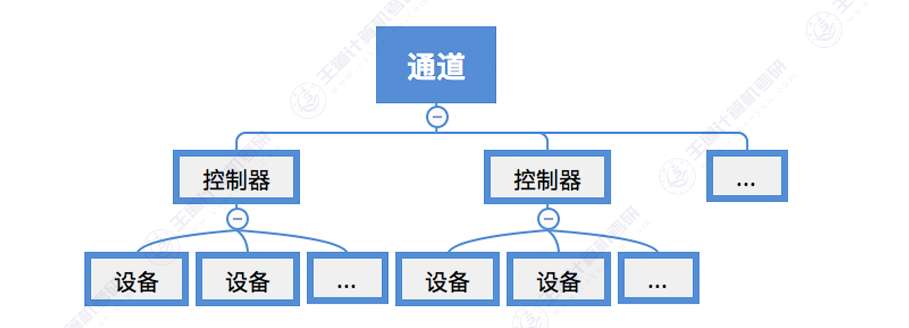
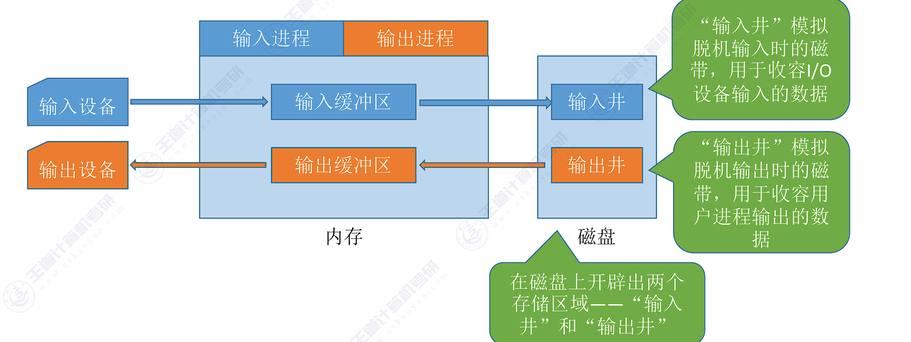
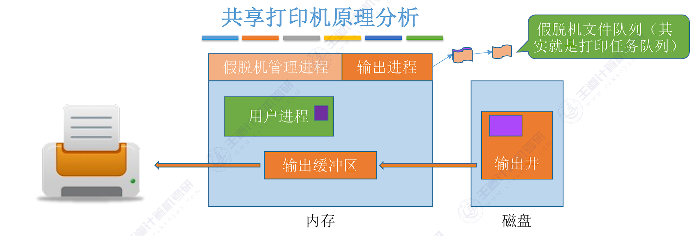
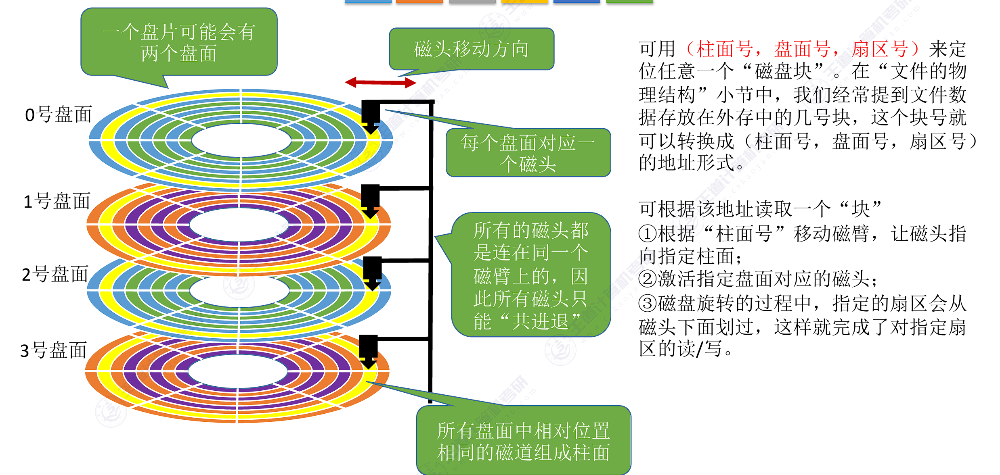

<h2 align="center">第五章 输入输出管理</h2>

> **408 高频考点提醒**：
> - I/O 软件层次结构：**用户层软件 → 设备独立性软件 → 设备驱动程序 → 中断处理程序 → 硬件**
> - 四种 I/O 控制方式：**程序查询（忙等）、中断驱动、DMA（数据块、不经过 CPU）、通道（通道程序）**
> - 缓冲区：单缓冲每块 **max(C,T)+M**；双缓冲每块 **max(C+M, T)**（王道真题计算）
> - 设备分配：DCT / COCT / CHCT / SDT 四张表；**逻辑设备表 LUT** 实现设备独立性
> - **SPOOLing**：输入井/输出井 + 缓冲区 + 输入/输出进程；把**独占设备变成虚拟设备**（打印机）
> - 磁盘访问时间 = **寻道 + 旋转延迟 + 传输时间**（寻道占主导；7200rpm → 平均旋转延迟 4.17ms）
> - 磁盘调度：FCFS / SSTF / SCAN（电梯）/ C-SCAN / LOOK；**SSTF 可能饥饿、SCAN 最常用**；减少旋转延迟：**扇区交替编号、盘面错位命名**
> - **SSD**：无机械部件、无寻道/旋转延迟；不能原地写、**磨损均衡（动态/静态，写入放大）**、FTL 转换层；存储单元 SLC/MLC/TLC（1/2/3 bit）

---

### （一）I/O 管理概述

#### 一、I/O 设备的基本概念与分类

##### 1. 设备的分类

<table>
    <thead>
        <tr>
            <th>分类角度</th>
            <th>类别</th>
            <th>说明</th>
        </tr>
    </thead>
    <tbody>
        <tr>
            <td rowspan="2"><b><nobr>使用特性</nobr></b></td>
            <td><b>存储设备</b></td>
            <td>用于<b>存储信息</b>的外部设备（磁盘、磁带、光盘）</td>
        </tr>
        <tr>
            <td><b>输入/输出设备</b></td>
            <td>又分<b>输入设备</b>（键盘、鼠标、扫描仪）、<b>输出设备</b>（打印机）、<b>交互式设备</b>（集成输入输出功能，如触控显示器）</td>
        </tr>
        <tr>
            <td rowspan="2"><b><nobr>信息传输单位</nobr></b></td>
            <td><b>块设备</b></td>
            <td>以<b>数据块</b>为单位、<b>可寻址</b>、可随机访问（磁盘、SSD）</td>
        </tr>
        <tr>
            <td><b>字符设备</b></td>
            <td>以<b>字符</b>为单位、<b>不可寻址</b>、只能顺序访问（键盘、打印机）</td>
        </tr>
        <tr>
            <td rowspan="3"><b>共享属性</b></td>
            <td><b>独占设备</b></td>
            <td>一个进程独占使用（打印机、磁带机）</td>
        </tr>
        <tr>
            <td><b>共享设备</b></td>
            <td>可同时供多个进程使用（磁盘）</td>
        </tr>
        <tr>
            <td><b>虚拟设备</b></td>
            <td>通过 SPOOLing 把独占设备改造成"共享"的设备</td>
        </tr>
        <tr>
            <td><b>速度</b></td>
            <td>低速（键盘）/ 中速（打印机）/ 高速（磁盘、网络）</td>
            <td>速度差异大，需要缓冲</td>
        </tr>
    </tbody>
</table>


> **考点**：**磁盘是块设备、共享设备、存储设备**；打印机是**字符设备、独占设备**（可经 SPOOLing 虚拟化）；触控显示器是**交互式设备**。

##### 2. 设备控制器（I/O 接口）

**设备控制器（I/O 接口）**：CPU 与设备之间的**中间硬件接口**，用于实现**设备和计算机之间的数据交换**。

**控制器的三个组成部分（教材）**：

| 组成部分 | 说明 |
|:---|:---|
| <nobr>**与 CPU 的接口**</nobr> | 有三类信号线：**数据线**（传送读/写数据、控制信息和状态信息）、**地址线**（传送要访问的 I/O 接口中的**寄存器编号**）、**控制线**（传送读/写等控制信号） |
| **与设备的接口** | 一个控制器可连接**一个或多个设备**（控制器中有多个设备接口）；每个接口都可传输**数据、控制、状态**三种类型的信号 |
| **I/O 逻辑** | 实现对设备的控制：通过一组控制线与 CPU 交互，对从 CPU 收到的 **I/O 命令进行译码**；CPU 启动设备时发送**启动命令 + 地址**，由 I/O 逻辑译码并对所选设备进行控制 |

**控制器的主要功能（教材）**：**接受和识别命令、数据交换、标识和报告设备的状态、地址识别、数据缓冲、差错控制**。

**I/O 接口的类型（教材）**：

| 分类角度 | 类型 |
|:---|:---|
| **按数据传送方式**（外设与接口一侧） | **并行接口** / **串行接口**（接口要完成**数据格式的转换**） |
| **按主机访问 I/O 设备的控制方式** | **程序查询接口** / **中断接口** / **DMA 接口** |
| **按功能选择的灵活性** | **可编程接口**（通过编程改变接口功能）/ **不可编程接口** |

**I/O 端口**：设备控制器中**可被 CPU 直接访问**的寄存器：

| 寄存器 | 作用 |
|:---|:---|
| **数据寄存器** | 缓存从设备送来的**输入数据**，或从 CPU 送来的**输出数据** |
| **状态寄存器** | 保存设备的**执行结果或状态信息**，供 CPU 读取 |
| **控制寄存器** | **CPU 写入**，以启动命令或更改设备模式 |

CPU 通过 **I/O 端口（独立编址）**或 **内存映射 I/O**（寄存器映射到内存地址空间）访问这些寄存器。

> **考点**：控制器结构 = **CPU 接口（数据/地址/控制线）+ 设备接口（数据/控制/状态信号）+ I/O 逻辑（命令译码）**；主要功能 = **接受识别命令、数据交换、状态报告、地址识别、缓冲、差错控制**；I/O 端口 = 可被 CPU 直接访问的**三类寄存器**（数据/状态/控制）。
> **易错点**：地址线传的是**寄存器编号**（不是设备地址）；数据线既传数据也传控制/状态信息；程序查询/中断/DMA 接口分别对应三种 I/O 控制方式（见三）。

#### 二、I/O 控制方式（重点）

##### 1. 程序直接控制方式（程序查询方式）

```
CPU 发出 I/O 请求
   │
   ▼
CPU 不断读取设备状态寄存器（轮询/忙等）
   │ 忙 → 继续轮询；闲 → 传输一个数据字
   ▼
反复直到数据传完
```

- 特点：CPU **全程参与**每字传输；传输期间 CPU **忙等**（无法做别的事）
- 优点：实现简单，不需要额外硬件
- 缺点：**CPU 利用率极低**（绝大部分时间在等设备）

##### 2. 中断驱动方式

- 设备**就绪后主动发中断**，CPU 不再轮询，在设备准备期间可以执行其他程序
- 流程：CPU 发 I/O 请求 → 设备准备数据（CPU 并行做别的事）→ 设备就绪发**中断** → CPU 响应中断，传输**一个字** → 继续下一次传输
- 特点：每传输**一个数据字**产生**一次中断**；数据仍由 CPU 参与搬运（从控制器数据寄存器取出/放入）
- 优点：CPU 利用率大幅提高（等待时做别的事）
- 缺点：**中断次数太多**（每字一次），CPU 被频繁打断

> **注意**：中断驱动方式中，中断处理程序承担了数据搬运，仍然"逐字"进行——传送一块数据需要 n 次中断。

##### 3. DMA 方式（直接存储器存取）

**DMA（Direct Memory Access）**：在**外设与内存之间直接传输数据块**，**不经过 CPU**。

```
┌────────────────────────────┐
│  CPU                       │
│  (init: addr/cnt/dir)      │
└──────────────┬─────────────┘
              │  init
              ▼
┌────────────────────────────┐
│  DMA controller            │
│  (addr reg/cnt reg/        │
│   ctl reg)                 │
└──────────────┬─────────────┘
              │  data block, no CPU
              ▼
┌────────────────────────────┐
│  Memory <-> device         │
└────────────────────────────┘
```

> 图：DMA 方式——CPU 初始化后由 DMA 控制器直接控制内存与外设间的数据块传输。

**DMA 控制器的组成**：

| 寄存器 | 作用 |
|:---|:---|
| 内存地址寄存器 | 存放数据在内存中的起始地址 |
| 字节计数器 | 记录待传输的字节数 |
| 控制寄存器 | 传输方向、启动等控制信息 |

**工作流程**：

```
① CPU 初始化 DMA 控制器（源/目的地址、字节数、方向）
② DMA 控制器直接控制外设 ↔ 内存的数据块传输（每传完一个字节自动更新地址与计数）
③ 数据块传完后，DMA 向 CPU 发一次中断
```

- 特点：**以数据块为单位**；数据不经过 CPU（CPU 只在开头初始化、结尾收中断，**干预 2 次**）
- 注意：DMA 传输时若占用内存总线，CPU 暂停访问内存（**周期挪用**）

> **考点**：DMA 与中断驱动的本质区别——**中断驱动每字中断一次且数据经 CPU**；DMA 一次中断传送一块且数据不经 CPU。

##### 4. 通道控制方式

**通道（Channel）**：专门负责 I/O 控制的**处理机（I/O 处理器）**，执行**通道程序**。

- CPU 只需发出**一条 I/O 指令**（指明通道、设备、操作），通道自己执行通道程序控制设备完成**多块数据的传输**
- 数据传送完毕后，通道向 CPU 发中断
- 一个通道可控制**多台设备**并行工作

> **考点**：通道控制方式中，**CPU 干预程度最低**（发一条指令 + 收一次中断）；通道有自己的指令系统（通道程序），相当于"小 CPU"。

##### 5. 四种控制方式对比

| 对比项 | 程序查询 | 中断驱动 | DMA | 通道 |
|:---|:---|:---|:---|:---|
| 控制单位 | 一个字 | 一个字 | **一个数据块** | **一组数据块**（多台设备） |
| 数据流向 | CPU 参与 | CPU 参与 | **不经过 CPU** | 不经过 CPU |
| CPU 干预 | **最多**（全程忙等） | 较多（每字中断） | 少（初始化+收尾 2 次） | **最少**（一条指令+一次中断） |
| 并行性 | 无 | 设备与 CPU 部分并行 | 较好 | 最好（多设备并行） |
| 适用 | 简单低速设备 | 中低速设备 | 高速设备（磁盘） | 大规模高速 I/O |

#### 三、I/O 软件的层次结构

**I/O 软件**：操作系统中的设备管理软件，采用**分层结构**组织：

```
┌───────────────────────────┐
│  User-level I/O software  │
├───────────────────────────┤
│  Device-independent       │
│  OS software              │
├───────────────────────────┤
│  Device drivers           │
├───────────────────────────┤
│  Interrupt handlers       │
├───────────────────────────┤
│  Hardware                 │
└───────────────────────────┘
```

> 图：I/O 软件层次结构（用户层 → 设备独立性软件 → 设备驱动程序 → 中断处理程序 → 硬件）。

| 层次 | 主要功能 |
|:---|:---|
| **用户层 I/O 软件** | 库函数（printf、scanf）、SPOOLing 系统、用户态 I/O 请求 |
| **设备独立性软件（设备无关软件）** | 统一设备接口、设备命名、保护、分配与回收、缓冲管理、错误报告 |
| **设备驱动程序** | 把抽象请求翻译为具体设备的命令，控制设备控制器，**唯一直接与硬件打交道的软件** |
| **中断处理程序** | 处理设备发出的中断，保存/恢复现场 |
| **硬件** | 设备控制器、设备本身 |

> **考点**：设备独立性软件与设备驱动程序的分界——**驱动程序与具体设备相关**（换设备就换驱动程序），独立性软件与设备无关（所有设备共用一个接口）。
> **易错点**：I/O 软件层次从上到下，只有**设备驱动程序**直接控制硬件；中断处理程序由硬件中断触发。

#### 四、应用程序 I/O 接口

操作系统向应用程序提供**统一、抽象的设备访问接口**：

| 接口类型 | 服务对象 | 系统调用 |
|:---|:---|:---|
| **字符设备接口** | 键盘、打印机等 | get / put（按字符） |
| **块设备接口** | 磁盘、SSD | read / write（按块，可随机访问） |
| **网络设备接口** | 网卡 | socket（套接字） |

- **阻塞 I/O**：系统调用未完成前进程挂起等待（如 read 数据没到就阻塞）
- **非阻塞 I/O**：系统调用立即返回，进程轮询或由中断通知结果

---

### （二）设备独立软件

#### 一、设备独立性软件

**设备独立性软件**：也称**与设备无关的软件**，是 **I/O 系统的最高层软件**，其下层是**设备驱动程序**；设备独立性软件包括**执行所有设备公有操作**的软件。

| 设备公有功能 | 说明 |
|:---|:---|
| **设备命名与映射** | 将**逻辑设备名**映射到物理设备（经**逻辑设备表 LUT**） |
| **设备保护** | 检查用户对设备的访问权限 |
| **提供与设备无关的块大小** | 屏蔽不同设备的块大小差异，向上提供统一视图 |
| **缓冲管理** | 管理 I/O 数据缓冲区 |
| **设备分配与回收** | 对独占/共享设备的分配与回收 |
| **错误报告与处理** | 报告设备错误并尽量处理 |
| **统一驱动程序接口** | 为所有设备驱动程序提供统一的标准接口 |

> **考点**：设备独立性软件是 **I/O 最高层软件**、与设备无关，只负责**所有设备的公有操作**；下层**设备驱动程序**才与具体设备相关（换设备就换驱动）。
> **易错点**：设备独立性软件 ≠ 设备驱动程序——前者"与设备无关"（设备命名、缓冲、分配等公有操作），后者"与具体设备相关"（发出具体设备的命令）。

#### 二、高速缓存与缓冲区（重点）

##### 1. 磁盘高速缓存

**磁盘高速缓存**：在**内存**中划出一块区域，存放最近访问的磁盘数据副本——读磁盘时先查缓存（命中则省去磁盘访问），写磁盘时先写缓存（延迟写回）。

磁盘高速缓存在内存中分为两种形式： 

- 一种是在内存中开辟一个单独的空间作为缓存区，大小固定

- 另一种是将未利用的内存空间作为一个缓冲池，供请求分页系统和磁盘I/O时共享

> **考点**：磁盘高速缓存是**内存中的**（不是磁盘上的），思想与快表（TLB）一致——利用时间局部性。

##### 2. 缓冲的作用

| 作用 | 说明 |
|:---|:---|
| 缓和**速度不匹配** | 内存与外设速度相差悬殊，缓冲区暂存数据 |
| 减少对 CPU 的**中断频率** | 数据攒够一批再中断一次（数据单元化） |
| 提高 CPU 与外设的**并行性** | CPU 处理数据的同时设备可以输入下一批 |
| 解决**数据粒度不匹配** | 如按字节输入、按块处理 |

##### 3. 缓冲技术

引入缓冲区的目的主要如下：

- 缓和CPU与I/O设备间速度不匹配的矛盾

- 减少对CPU的中断频率，放宽对CPU中断响应时间的限制

- 解决基本数据单元大小（数据粒度）不匹配的问题

- 提高CPU和I/O设备之间的并行性。

| 方式 | 说明 | 特点 |
|:---|:---|:---|
| **单缓冲** | 内存中一个缓冲区，**设备与 CPU 互斥**使用它 | 实现简单；每块处理时间 = max(C, T) + M |
| **双缓冲** | 两个缓冲区轮流：设备填 1 号时 CPU 处理 2 号 | 可设备与 CPU 同时工作；每块 = max(C+M, T) |
| **循环缓冲** | 多个缓冲区组成循环队列 | 适合生产者-消费者模式 |
| **缓冲池** | 系统公共缓冲区集合（空闲/输入/输出队列） | 共享、利用率高 |

设：设备输入一块数据时间 T、缓冲区数据送入用户区时间 M、CPU 处理时间 C（M、C 串行），则：

| 方式 | 每块总时间 | 说明 |
|:---|:---|:---|
| 无缓冲 | T + M + C | 完全串行 |
| 单缓冲 | **max(C, T) + M** | 输入与 CPU 处理可重叠（T 与 C 取大者），M 必须串行 |
| 双缓冲 | **max(C+M, T)** | 两个缓冲区交替，设备输入与"移送+处理"流水线并行 |

**例题**：从设备输入一块数据 T = 100μs，缓冲区数据送入用户区 M = 10μs，CPU 处理 C = 50μs：

| 方式 | 计算 | 每块时间 |
|:---|:---|:---|
| 无缓冲 | 100 + 10 + 50 | **160μs** |
| 单缓冲 | max(50, 100) + 10 | **110μs** |
| 双缓冲 | max(10 + 50, 100) | **100μs** |

> **考点**：单缓冲中 T 与 C 重叠、M 串行（先移给用户区才能处理，处理完缓冲区才空）；双缓冲中 T 与（M+C）重叠。
> **易错点**：求 n 块总时间 = 第一块（T+M+C）+ (n−1) × 每块时间。

##### 4. 缓冲区与高速缓存的区别

| 对比项 | 缓冲区（Buffer） | 高速缓存（Cache） |
|:---|:---|:---|
| 目的 | 缓和速度不匹配、提高并行性 | 存放最近访问的数据副本（局部性） |
| 数据 | 暂存待传输的数据 | 已使用数据的副本 |
| 位置 | 内存、外设等 | 内存（磁盘高速缓存）、CPU 内部等 |

#### 三、设备分配与回收

##### 1. 设备分配的数据结构



| 数据结构 | 说明 |
|:---|:---|
| **设备控制表 DCT** | 每个设备一张：设备类型、设备标识符、状态（忙/闲）、等待队列指针、重复执行次数 |
| **控制器控制表 COCT** | 每个设备控制器一张：控制器状态、标识符、与通道连接的指针、控制器队列的首尾指针 |
| **通道控制表 CHCT** | 每个通道一张：通道状态、等待队列 |
| **系统设备表 SDT** | 整个系统一张：记录系统中全部设备，每个表项指向对应 DCT |

```
SDT ──► DCT(设备1) ──► COCT(控制器1) ──► CHCT(通道1)
   │     DCT(设备2) ──► COCT(控制器2)
   └─ ...
```

> 图：设备分配表层次——系统设备表 SDT → 设备控制表 DCT → 控制器控制表 COCT → 通道控制表 CHCT。

##### 2. 设备分配的原则与算法

- **设备固有属性**：
  - 独占设备：一次只能一个进程用
  - 共享设备：多个进程可同时用
  - 虚拟设备：SPOOLing 改造后

- **分配算法**：
  - 先来先服务：按请求先后排队
  - 优先级高者优先

- **安全性**：
  - **安全分配方式**：进程请求设备时**立即阻塞**，获得后运行完再释放——简单、**分配安全（不会死锁）**；缺点是 CPU 与 I/O 设备**串行工作**，进程推进慢
  - **不安全分配方式**：进程发出 I/O 请求后**仍继续运行**，需要时再发第二、三个请求；仅当请求的设备**已被另一进程占用**时才进入阻塞态——优点：一个进程可**同时操作多个设备**，推进迅速；缺点：**可能造成死锁**（可配合**银行家算法**做安全性检查避免）

> **易错点**：会死锁的是**不安全分配方式**；安全分配方式"不持有设备再等设备"，**不会死锁**。


##### 3. 设备分配的步骤

**分配顺序固定为"设备 → 控制器 → 通道"三步**，每步模式相同——**查表：忙则 PCB 挂入等待队列，闲则分配**：

| 步骤 | 查找路径 | 忙则 | 闲则 |
|:---|:---|:---|:---|
| **(1) 分配设备** | 物理设备名 → 查 **SDT** → 查 **DCT** | PCB 挂入**设备等待队列** | 设备分配给进程 |
| **(2) 分配控制器** | DCT → 查 **COCT** | PCB 挂入**控制器等待队列** | 控制器分配给进程 |
| **(3) 分配通道** | COCT → 查 **CHCT** | PCB 挂入**通道等待队列** | 通道分配给进程 |

> **注意**：设备、控制器、通道**三者全部到手**，进程才能使用设备；任一层忙碌，进程就挂在该层等待队列中排队。

```
(1) 分配设备：   物理设备名 → 查 SDT → 查 DCT
(2) 分配控制器： DCT → 查 COCT
(3) 分配通道：   COCT → 查 CHCT
```

##### 4. 设备的回收

设备使用完毕后，系统回收设备、控制器、通道，从对应 DCT/COCT/CHCT 中删除分配记录，并**唤醒等待队列中的下一个进程**。

##### 5. 逻辑设备名到物理设备名的映射（教材）

**设备独立性**：用户程序使用**逻辑设备名**（如 "printer"），由系统映射到具体**物理设备**。

- **进程请求方式与设备无关性**：若进程以**物理设备名**提出 I/O 请求，设备分配程序**不具有设备无关性**（换设备就要改程序）；要获得设备独立性，进程应使用**逻辑设备名**
- **同类多台设备的分配**：系统按逻辑设备名对应的**设备类型**，从 **SDT** 中找**第一个该类设备的 DCT**；若该设备忙，再找第二个、第三个……**仅当全部该类设备都忙**时，才把进程 PCB 挂到**该类设备的等待队列**上；**只要有一台同类设备空闲**，就进入进一步的分配操作（控制器、通道）
- **逻辑设备表（LUT, Logical Unit Table）**：把逻辑设备名映射为物理设备名；**每个表项含 3 项内容：逻辑设备名、物理设备名、设备驱动程序入口地址**
- LUT 的两种设置方式：
  1. **整个系统只设置一张 LUT**（表项：逻辑设备名 / 物理设备名 / 驱动程序入口地址）——所有用户共用一套映射，同一逻辑名只能对应同一物理设备
  2. **为每个用户（进程）设置一张 LUT**（表项：逻辑设备名 / 系统设备指针，指向 SDT 中对应表项）——各用户可用各自的逻辑设备名，互不干扰

```
用户程序:  open("printer")  ← 逻辑设备名
   │
   ▼
查 LUT（逻辑设备名 → 物理设备名 / 设备类型）
   │
   ▼
按物理设备名进入设备分配（第 3 点：查 SDT → DCT → COCT → CHCT）
```

- 优点：**设备独立性**——换设备（如换打印机型号）只需修改映射，用户程序不用改；方便共享与分配

> **考点**：用户程序使用**逻辑设备名**；系统通过 **LUT** 把它转换为物理设备名——这就是"设备独立性（设备无关性）"。
> **考点**：同类设备多台时，系统从 SDT 起**逐台寻找空闲设备**，全部忙才把进程挂到该类设备的等待队列——设备无关性的直接体现。

#### 四、假脱机技术（SPOOLing，5.2.4）（重点）

**脱机技术**：脱离主机的控制进行的输入/输出操作（如先用外围控制机把数据预读入磁带，主机不直接操作设备）。

**SPOOLing（假脱机技术，Simultaneous Peripheral Operations On-Line）**：用软件模拟脱机技术，把**独占设备改造为共享的虚拟设备**。

**组成**：

| 组成 | 位置 | 作用 |
|:---|:---|:---|
| 输入井 / 输出井 | **外存（磁盘）** | 保存预输入的数据（缓冲数据的"水池"） |
| 输入缓冲区 / 输出缓冲区 | 内存 | 设备与井之间的中转 |
| 输入进程 / 输出进程 | 内存 | SPOOLing 管理进程，负责设备与井之间的搬运 |
| **井管理程序** | 内存 | 控制作业与磁盘井之间信息的交换（SPOOLing 系统的管理程序） |

**工作原理（预输入 + 缓输出）**：



- **预输入**：输入设备空闲时，输入进程提前把数据读入输入井，用户进程需要时直接从井取——**设备利用率提高**
- **缓输出**：用户进程把输出写到输出井即可返回，输出进程随后把井中的数据送输出设备——**进程不被慢速设备拖住**
- **井管理程序**：用于控制作业与磁盘井之间信息的交换

**典型应用——共享打印机**：多个进程"同时"提交打印任务，SPOOLing 系统把任务排队存入输出井（**打印队列**），打印进程逐个打印——逻辑上每个进程都有一台"虚拟打印机"。



**优点**：

| 优点 | 说明 |
|:---|:---|
| 提高 I/O 速度 | 进程与井交互（内存/磁盘速度），不与慢速设备直接交互 |
| 设备虚拟化 | 独占设备 → 多个进程可"同时使用"的**虚拟设备** |
| 提高设备利用率 | 输入输出与用户进程并行进行 |

> **考点**：SPOOLing 依赖**外存（磁盘）** 存放井；它是"独占设备共享化（虚拟设备）"的典型实现——打印机问题必考。
> **易错点**：SPOOLing 只是**逻辑上**让多个进程同时使用设备，物理上设备仍一次服务一个任务（排队）。

#### 五、设备驱动程序接口

**设备驱动程序**：直接与设备控制器打交道的软件，是**唯一知道具体设备命令格式**的层次。

- 作用：把设备独立性软件的**抽象请求**（read、write、控制）翻译为**具体的设备命令**（写某寄存器、发某控制字）
- **统一接口**：所有设备驱动程序向上层提供相同的接口（open/close/read/write），上层无需知道设备差异——**换设备只需换驱动程序**，应用程序和 OS 其余部分不变
- **中断处理程序**：设备发中断后，由中断处理程序响应：保存现场、判断中断原因（传输完成/出错）、调用对应驱动程序的处理例程、恢复现场

> **考点**：设备驱动程序属于**内核**，与设备一一对应；"设备无关性"正是靠驱动程序之上的**统一接口**实现的。

---

### （三）磁盘和固态硬盘

#### 一、磁盘结构

| 概念 | 说明 |
|:---|:---|
| **盘面（Platter）** | 磁盘的磁记录表面，每个盘片有上下两个盘面 |
| **磁道（Track）** | 盘面上同心圆记录轨道，由外向里编号 |
| **扇区（Sector）** | 磁道等分为若干扇区，是**磁盘读写的基本单位**（通常 512B），由**头部、数据区域和尾部**组成 |
| **柱面（Cylinder）** | 所有盘面上相同半径磁道的集合 |
| **磁头（Head）** | 每个盘面一个读写磁头，可移动到不同磁道 |



> 图：磁盘结构——盘面/磁道/扇区/柱面。

**磁盘容量** = 磁头数 × 磁道数 × 扇区数 × 每扇区字节数

**磁盘访问时间（重点）**：

| 组成 | 说明 | 量级 |
|:---|:---|:---|
| **寻道时间** | 磁头移动到目标磁道的时间 | **最大**（毫秒级，主要开销） |
| **旋转延迟** | 目标扇区转到磁头下的时间（平均 = 转半圈） | 毫秒级 |
| **传输时间** | 数据从磁盘读出的时间 | 最小（微秒级） |

**例题**：磁盘转速 7200 rpm：

- 旋转一周时间 = 60 / 7200 = **8.33ms**
- **平均旋转延迟** = 8.33 / 2 = **4.17ms**
- 若每磁道 100 个扇区，传输 1 个扇区 ≈ 8.33 / 100 = 0.083ms

> **考点**：磁盘访问时间中**寻道时间占主导**——磁盘调度算法就是优化寻道顺序。
> **易错点**：平均旋转延迟 = 转半圈的时间（不是一整圈）。

#### 二、磁盘的管理

| 步骤 | 说明 |
|:---|:---|
| **低级格式化（物理格式化）** | 把磁盘划分为磁道、扇区，在扇区写入管理信息（头/尾、校验信息） |
| **磁盘分区** | 把磁盘划分为若干分区（卷），每个分区可安装不同文件系统 |
| **逻辑格式化（建立文件系统）** | 在分区上建立文件系统（引导块、超级块、索引节点区、数据区） |
| **引导块** | 磁盘 0 号扇区/块存放引导程序（自举），开机时 BIOS 读取执行 |
| **坏块处理** | 磁盘坏块由格式化时标记或系统动态替换（备用块） |

#### 三、磁盘调度算法（重点）

**目标**：减少**平均寻道时间**。

##### 1. 先来先服务（FCFS）

- 按请求到达顺序服务——公平、实现简单，但**寻道距离大、效率低**

##### 2. 最短寻道时间优先（SSTF）

- 每次选择**离当前磁头最近**的磁道——平均寻道最短，但**可能饥饿**（远处请求长期得不到服务）

##### 3. 扫描算法（SCAN，电梯算法）

- 磁头**单向移动**，沿途服务所有请求，到**端点**（最内/最外磁道）后反向，再来回扫描
- 避免饥饿，但端点附近等待时间不均匀

##### 4. 循环扫描算法（C-SCAN）

- 只**单向**服务，到达端点后**立即回卷**到另一端重新扫描
- 各磁道等待时间更**均匀**；代价是回卷不服务

##### 5. LOOK / C-LOOK

- 不走到端点——到**最远请求**处即转向（LOOK）/ 回卷（C-LOOK）；比 SCAN/C-SCAN 寻道距离更短

**例题**：磁道号范围 0~199，磁头初始在 **100**，请求队列 55, 58, 39, 18, 90, 160, 150, 38, 184：

```
磁道:  0 ── 18 ── 38 ── 39 ── 55 ── 58 ── 90 ── [100] ── 150 ── 160 ── 184 ── 199
                                            (磁头初始位置)
```

| 算法 | 服务顺序 | 总寻道长度 |
|:---|:---|:---|
| FCFS | 55, 58, 39, 18, 90, 160, 150, 38, 184 | 45+3+19+21+72+70+10+112+146 = **498** |
| SSTF | 90, 58, 55, 39, 38, 18, 150, 160, 184 | 10+32+3+16+1+20+132+10+24 = **248** |
| SCAN（向增大方向，到端点 200 转向） | 150, 160, 184, 200, 90, 58, 55, 39, 38, 18 | 50+10+24+16+110+32+3+16+1+20 = **282** |
| C-SCAN（增大方向，到端点 200 后回卷到 0） | 150, 160, 184, 0, 18, 38, 39, 55, 58, 90 | 100+200+90 = **390** |
| LOOK（增大方向，到最远请求 184 转向） | 150, 160, 184, 90, 58, 55, 39, 38, 18 | 50+10+24+94+32+3+16+1+20 = **250** |
| C-LOOK（增大方向，到最远请求 184 后回卷到最小请求 18） | 150, 160, 184, 18, 38, 39, 55, 58, 90 | 50+10+24+166+20+1+16+3+32 = **322** |

**结论**：

| 算法 | 优点 | 缺点 |
|:---|:---|:---|
| FCFS | 公平、实现简单 | 寻道距离大、效率低 |
| SSTF | **平均寻道最短** | 可能**饥饿** |
| SCAN / C-SCAN | 无饥饿、效率高 | 端点等待不均匀（C-SCAN 改善均匀性） |
| LOOK / C-LOOK | 比 SCAN/C-SCAN 少走"空道" | 实现稍复杂 |

> **考点**：SSTF 是"贪心"策略（本次最优），SCAN 系列是实际系统最常用的（兼顾效率与公平）。
> **易错点**：SCAN 沿当前移动方向**先服务途中遇到的请求**，到端点（或 LOOK 的最远请求）才转向——不能中途转向。

##### 6. 减少延迟时间的方法

磁盘访问时间 = 寻道 + **旋转延迟** + 传输：调度算法优化**寻道时间**；交替编号与错位命名优化**旋转延迟**——磁头读完一个扇区后需要短暂**处理时间**，期间磁盘仍在旋转。

**(1) 盘面扇区的交替编号**：若逻辑相邻的块在物理上也相邻（按 0、1、2…连续编号），读完一块后磁头已转过下一块的位置，要等几乎一整圈才能读下一块——读连续逻辑块时旋转延迟很长。改进：把逻辑相邻扇区**隔一个编号**（物理排列如 0、2、4、6、1、3、5、7），读连续逻辑块时，处理完一块后磁头**刚好对准下一块**，旋转等待最少。

**(2) 磁盘盘面的错位命名**：所有盘面**同步转动**，同一柱面上逻辑块按盘面号连续存放（0 号盘 0~7 扇区 → 1 号盘 0~7 扇区 → 2 号盘……）。读完 0 号盘 7 号扇区后需要处理时间，此时磁头已**划过** 1 号盘 0 号扇区，必须再等一整圈。改进：把**相邻盘面的扇区错位命名**（1 号盘 0 号扇区在物理位置上与 0 号盘 0 号扇区错开），处理完 0 号盘 7 号扇区时，磁头**正好对准** 1 号盘 0 号扇区。

> **考点**：交替编号（同一盘面扇区间隔编号）与错位命名（相邻盘面错位）都是为抵消"**读后处理时间**"造成的**旋转延迟**，避免磁头空转等圈。

#### 四、固态硬盘（SSD，5.3.4）

**SSD（Solid State Drive，固态硬盘）**：由**闪存（Flash）芯片**阵列构成，没有机械部件。

| 特性 | 机械磁盘（HDD） | 固态硬盘（SSD） |
|:---|:---|:---|
| 机械部件 | 有（盘片旋转、磁头移动） | **无** |
| 寻道时间/旋转延迟 | 有（毫秒级） | **没有**（直接定位） |
| 随机访问 | 慢（要寻道） | **快**（与顺序访问接近） |
| 写入方式 | 可原地覆盖写 | **不能原地写**：先擦除（以块为单位）再写入（以页为单位） |
| 寿命 | 长 | 擦写次数有限（**磨损均衡** wear leveling 均摊损耗） |
| 其他 | 怕震动 | 抗震、功耗低、静音 |

**FTL（闪存转换层，Flash Translation Layer）**：SSD 固件中的一层，完成**逻辑块地址 → 物理页**的映射、垃圾回收（回收无效页所在块）、磨损均衡。

**存储单元（SLC / MLC / TLC）**：闪存存储单元按**每个单元能存放的 bit 数**分类：

| 类型 | 每单元 bit 数 | 特点 |
|:---|:---|:---|
| **SLC**（Single-Level Cell） | **1 bit** | 速度**最快**、寿命**最长**、成本**最高** |
| **MLC**（Multi-Level Cell） | **2 bit** | 速度、寿命、成本居中 |
| **TLC**（Triple-Level Cell） | **3 bit** | 容量**最大**、成本**最低**、速度**最慢**、寿命**最短**（每单元 bit 越多，容量越大但寿命越短） |

**磨损均衡（wear leveling）**：SSD 闪存单元**擦写次数有限**、不能无限擦写，为避免个别块被频繁擦写而**提前损坏**，把擦写次数**均摊**到所有块：

- **动态磨损均衡**：写入时优先选择**擦写次数最少**的块——实现简单、主控开销小，但**效果不全面**（不搬动已有静态数据）
- **静态磨损均衡**：把长期**不变化**的静态数据搬迁到擦写次数多的块，腾出擦写次数少的块供写入——**更均衡、延长寿命**，但搬动数据使**写入放大明显**、影响写入速度

**写入放大（Write Amplification）**：因 SSD **不能原地覆盖写**（先擦除块、再写入页），实际对闪存的写入量**大于**主机请求的写入量，超出的部分即**写入放大**（静态磨损均衡需搬动大量数据，写入放大更明显）。

> **考点**：SSD 相比磁盘最大的优势——**无寻道时间和旋转延迟**，随机访问性能接近顺序访问；缺点——**不能原地覆盖写**（先擦后写）、寿命受擦写次数限制（用磨损均衡解决）。

#### 五、提高磁盘 I/O 速度的方法

| 方法 | 说明 |
|:---|:---|
| **磁盘高速缓存** | 内存中暂存磁盘数据副本（见 5.2.2），减少实际访问磁盘的次数 |
| **调整磁盘请求顺序** | 磁盘调度算法（FCFS / SSTF / SCAN…）优化寻道顺序 |
| **提前读** | 读某块时把顺序上可能用到的后续块一并读入（顺序局部性） |
| **延迟写** | 写操作先在缓存中暂存，推迟真正写盘，可合并多次写 |
| **优化物理块的分布** | 扇区交替编号、盘面错位命名等，减少旋转延迟 |
| **虚拟盘（RAM 盘）** | 用内存模拟磁盘，速度快、无机械延迟，但**断电数据丢失** |
| **磁盘阵列 RAID** | 多块磁盘并行读写 + 冗余（RAID 0 条带提速、RAID 1 镜像、RAID 5 校验） |

> **考点**：前六种都是**软件**手段；RAID 通过**多盘并行**提高吞吐、以冗余提高可靠性。"提前读 / 延迟写"都依赖**磁盘高速缓存**。

---

### （四）本章总结

**知识结构图**：

```
第五章 输入输出管理
├─（一）I/O 管理概述（5.1）
│   ├─ 软件层次：用户层 → 设备独立性软件 → 设备驱动程序 → 中断处理程序 → 硬件（驱动唯一直接控制硬件）
│   ├─ 设备分类：块/字符；独占/共享/虚拟（磁盘=块+共享；打印机=字符+独占，可 SPOOLing 虚拟化）
│   ├─ 设备控制器：数据/状态/控制三组寄存器；端口独立编址 / 内存映射 I/O
│   ├─ 控制方式：程序查询(忙等) → 中断驱动(每字中断) → DMA(每块,不经CPU,干预2次) → 通道(通道程序,干预最少)
│   └─ 应用接口：字符(get/put) / 块(read/write) / 网络(socket)；阻塞与非阻塞
├─（二）设备独立软件（5.2）
│   ├─ 缓冲：单缓冲 max(C,T)+M；双缓冲 max(C+M,T)；循环缓冲、缓冲池；磁盘高速缓存(内存中)
│   ├─ 设备分配：SDT→DCT→COCT→CHCT（设备→控制器→通道三步，忙则 PCB 挂等待队列）；安全/不安全分配；LUT(3项表项,整系统或每用户一张)→设备独立性(同类设备逐台找空闲)
│   ├─ SPOOLing：输入/输出井(外存) + 缓冲区 + 输入/输出进程 + 井管理程序；预输入/缓输出；独占→虚拟设备(打印机)
│   └─ 设备驱动：统一接口，换设备只换驱动程序
└─（三）磁盘和固态硬盘（5.3）
    ├─ 磁盘结构：盘面/磁道/扇区(512B)/柱面；容量 = 磁头数×磁道数×扇区数×每扇区字节数
    ├─ 访问时间 = 寻道(占主导) + 旋转延迟(平均半圈, 7200rpm→4.17ms) + 传输
    ├─ 磁盘管理：低级格式化→分区→逻辑格式化；引导块(0号扇区)、坏块处理
    ├─ 调度：FCFS / SSTF(可能饥饿) / SCAN(到端点转向) / C-SCAN(到端点回卷) / LOOK / C-LOOK（例题 498/248/282/390/250/322）
    ├─ 减少延迟：扇区交替编号、盘面错位命名；提高I/O速度：缓存、调序、提前读、延迟写、优化分布、虚拟盘、RAID
    └─ SSD：无寻道/旋转延迟、随机访问快、不能原地写(先擦后写)；存储单元 SLC/MLC/TLC(1/2/3bit)；磨损均衡(动态/静态，静态更均衡但写入放大明显)、FTL
```

**高频考点速记**：

| 考点 | 一句话记忆 |
|:---|:---|
| I/O 层次 | 用户层 → 设备独立性 → 驱动程序 → 中断处理 → 硬件 |
| 设备驱动程序 | 唯一直接控制硬件的软件层；换设备只换驱动；属**内核** |
| 设备分类 | **磁盘=块设备+共享设备**；打印机=字符设备+独占设备（可 SPOOLing 虚拟化） |
| 设备控制器 | **数据/状态/控制**三组寄存器；端口独立编址或内存映射 I/O |
| 程序查询 | CPU 忙等轮询，全程参与，利用率最低 |
| 中断驱动 | 每字中断一次（一块 n 次）；数据仍经 CPU 搬运 |
| DMA | 数据块不经 CPU；初始化+收尾共 2 次干预 |
| 通道 | 执行通道程序；CPU 只发一条指令；可控制多设备，**干预最少** |
| 缓冲作用 | 速度匹配、减少中断、提高并行、粒度匹配 |
| 单缓冲 | 每块 = max(C, T) + M（例题 **110μs**） |
| 双缓冲 | 每块 = max(C+M, T)（例题 **100μs**） |
| 缓冲易错点 | **n 块总时间 = 第一块(T+M+C) + (n−1)×每块时间** |
| 磁盘高速缓存 | 内存中存放磁盘数据副本（时间局部性） |
| 设备分配表 | SDT→DCT→COCT→CHCT 三步分配（设备→控制器→通道），忙则 PCB 挂等待队列 |
| 分配安全性 | 安全分配：请求即阻塞、串行、不死锁；不安全分配：边运行边等、可能死锁（配银行家算法避免） |
| 设备独立性 | 逻辑设备名 + LUT（表项含驱动入口）；同类设备从 SDT 逐台找空闲，全忙才挂等待队列 |
| SPOOLing | 井(外存)+缓冲区+输入输出进程+井管理程序；预输入、缓输出 |
| SPOOLing 本质 | 独占设备 → 虚拟设备（共享打印机）；**逻辑并行、物理排队** |
| 磁盘访问时间 | 寻道 + 旋转延迟(平均半圈) + 传输；寻道占主导 |
| 平均旋转延迟 | 7200rpm → 转一圈 8.33ms → 平均 4.17ms |
| 磁盘管理 | 低级格式化→分区→逻辑格式化；引导块(0号扇区)、坏块处理 |
| 减少延迟时间 | 扇区交替编号、盘面错位命名——抵消"读后处理时间"的旋转等待 |
| 提高磁盘 I/O 速度 | 缓存、调序、提前读、延迟写、优化分布、虚拟盘、RAID |
| FCFS | 按到达顺序，简单公平但效率低 |
| SSTF | **贪心(本次最优)**，总寻道最短；可能饥饿 |
| SCAN | 电梯算法：单向到端点再反向，无饥饿；实际系统**最常用** |
| C-SCAN | 单向服务 + 回卷，等待时间均匀 |
| LOOK/C-LOOK | 不到端点，到最远请求即转向/回卷 |
| 调度易错点 | SCAN 沿当前方向先服务途中请求，**到端点才转向**，不能中途转向；例题 498/248/282/390/250/322 |
| SSD 优势 | 无寻道/旋转延迟，随机访问快 |
| SSD 劣势 | 不能原地写（先擦后写）、寿命有限 |
| SSD 存储单元 | SLC/MLC/TLC（每单元 1/2/3 bit）；bit 越多容量越大、但速度越慢、寿命越短 |
| 磨损均衡 | 均摊擦写次数，延长寿命；分**动态/静态磨损**：静态更均衡但**写入放大**明显 |
| 写入放大 | 实际闪存写入量 > 主机请求量；静态磨损均衡搬动大量数据时更明显 |
| 阻塞 vs 非阻塞 | 阻塞挂起等待；非阻塞立即返回 |
