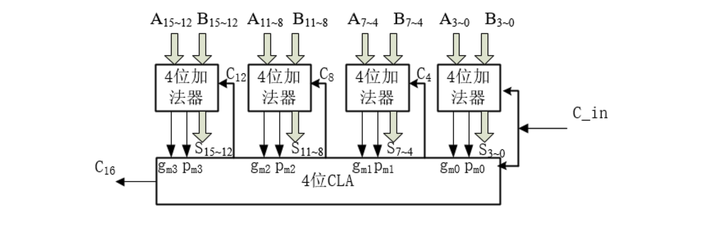

<h2 align="center">第二章 数据的表示和运算</h2>

> **408 高频考点提醒**：
>
> **（一）数制与编码 —— 数据在机器里怎么编码**
> - 四种机器码的 +0/−0 对比、取值范围、互换关系（移码 = 补码符号位取反）
> - 补码表示范围和特殊值（全 0 = 0，全 1 = −1，100…0 = −2ⁿ）
> - 无符号数范围 $0 \sim 2^n-1$；整数类型转换三规则（等长位不变 / 长→短截断 / 短→长零扩展或符号扩展）
> - 有符号与无符号混用的隐式转换陷阱（−1 > 1 的经典反直觉错误）
> - ASCII 关键码与大小写转换（差 20H）；UTF-8 变长编码；汉字编码：国标码 = 区位码 + 2020H、汉字内码 = 区位码 + A0A0H
> - 大小端字节序判断 + 结构体边界对齐 sizeof 计算
> - 海明码 $2^k \ge n+k+1$ 与指错字定位；CRC 模 2 除法求余
>
> **（二）定点数的表示和运算 —— 整数怎么算**
> - 移位：算术右移补符号位、补码左移补 0；逻辑移位左右均补 0
> - 补码加减法 $[A-B]_补 = [A]_补 + [-B]_补$，符号位一起参与；求 $[-B]_补$：全部位取反、末位 +1
> - 溢出三种判别法：单符号位 / $C_n \oplus C_{n-1}$ / 双符号位（`01` 正溢出、`10` 负溢出）
> - 原码一位乘（符号异或 + 绝对值乘 + 累加右移）；Booth：看 $Y_iY_{i-1}$，01 加、10 减、00/11 只移位
> - 阵列乘法器（纯组合逻辑、一个时钟周期）；恢复余数 vs 不恢复余数法
> - 原码除 vs 补码除：符号位是否参与、够减判据（余数正负 vs 余数与除数同号）、末位恒置 1
>
> **（三）浮点数的表示和运算 —— 小数怎么算**
> - IEEE 754 与真值的互转（阶码 = 真值指数 + Bias，尾数隐含最高位的 1）
> - 规格化数 / 非规格化数 / ±0 / ∞ / NaN 的阶码 + 尾数特征
> - 为什么阶码用移码（全非负 → 无符号比较器 → 数值单调）
> - 浮点加减五步法：对阶 → 尾数加减 → 规格化 → 舍入 → 判溢出
> - 对阶「小阶向大阶看齐」；左规阶码减小（可多次）、右规阶码增大（最多 1 次）
> - 舍入四模式 + G/R/S 保护位；溢出只看阶码，尾数溢出是"假溢出"
>
> **（四）算术逻辑单元 ALU 与运算器 —— 电路怎么搭**
> - 半加器 + 全加器（$S_i$ / $C_i$ 公式 + 级联关系）
> - 串行进位加法器：延迟 $O(n)$，溢出检测 $OF = C_n \oplus C_{n-1}$、$CF = C_n$
> - CLA：$G_i/P_i$ 定义 → 公式展开 → 多级分组（$G^*/P^*$ 与位级公式同构）
> - 四大标志位：SF / ZF / OF / CF（$CF = C_{out} \oplus Sub$ 最易错）
> - 单总线 vs 三总线：一次加法是 3 步微操作还是 1 步

---

### （一）数制与编码

> **主线**：本大节回答"数据在机器中如何编码"——先给出**数的编码**（进位计数制、四种机器码、无符号数与 C 语言整数类型），再给出**非数值数据的编码**（字符与字符串）与**可靠性编码**（校验码），最后落到数据在内存中的**存储与排列**（字节序、边界对齐）。

#### 一、进位计数制及其相互转换

##### 1. 基本概念

- **基数 ($r$)**：$r$ 进制数的基数为 $r$，每个数码位可能出现 $r$ 种字符。
- **进位原则**：逢 $r$ 进 1。
- **位权**：每个数码位对应的权重（如十进制的 $10^n$、二进制的 $2^n$）。
- **r 进制数值**：各数码位与其位权乘积之和。

$$
K_nK_{n-1}\cdots K_0.K_{-1}\cdots K_{-m} = K_n \times r^n + \cdots + K_0 \times r^0 + K_{-1} \times r^{-1} + \cdots + K_{-m} \times r^{-m}
$$

##### 2. 为什么计算机采用二进制？

- 二进制只有 0/1 两个状态，容易找到**两个稳定状态的物理器件**来表示。
- 0 和 1 正好对应逻辑值"假"和"真"，方便实现**逻辑运算**。
- 可以很方便地用**逻辑门电路**实现算术运算。

##### 3. 不同进制间的相互转换

**（1）任意进制 → 十进制**：按权展开相加。

**（2）二进制 ↔ 八进制 / 十六进制**：

- 二进制转八进制：每 **3 位**二进制对应 1 位八进制。
- 二进制转十六进制：每 **4 位**二进制对应 1 位十六进制。
- 注意：以**小数点为中心**向两边分组，位数不足时补 0。

**（3）十进制 → 任意 r 进制**：

| 部分 | 方法 | 记忆要点 |
|:---|:---|:---|
| <nobr>**整数部分**</nobr> | 除基取余法（基数除法） | 先取得的"余"是**低位** |
| <nobr>**小数部分**</nobr> | 乘基取整法（基数乘法） | 先取得的"整"是**高位** |

> **补充**：十进制转二进制还常用**减权定位法（拼凑法）**——预先记住各二进制位的权值，直接在目标位上"凑"，适合心算快速转换。

> **易错点**：有的十进制小数（如 0.3）**无法用二进制精确表示**，会形成无限循环小数——这也是浮点数存在精度误差的根源。

---

#### 二、真值与机器数：原码、反码、补码、移码

##### 1. 真值与机器数

- **真值**：实际的带正负号的数值，符合人类习惯的表示（如 +15、−8）。
- **机器数**：数字实际存到机器里的形式，正负号被数字化（通常 0 表示正、1 表示负）。

> 把符号位与数值位**一起编码**得到的位串就是机器数；同一个真值可以用不同编码规则（原码 / 反码 / 补码 / 移码）表示，下面逐一说明。

##### 2. 原码

- **定义**：用数值部分表示真值的绝对值，**符号位** "0/1" 对应"正/负"。
- **特点**：真值 0 有**两种**表现形式（+0 与 −0 的编码不同）。
- **表示范围**（字长 $n+1$ 位，含 1 位符号位）：
  - 整数：$-(2^n-1) \sim 2^n-1$（关于原点对称）。
  - 小数：$-(1-2^{-n}) \sim 1-2^{-n}$。

**示例**（8 位字长）：

```
[+0]原 = 0000 0000     [−0]原 = 1000 0000
[+5]原 = 0000 0101     [−5]原 = 1000 0101
[+127]原 = 0111 1111   [−127]原 = 1111 1111
```

> 原码直观，但**加减法必须分别处理符号位和数值位**，硬件实现复杂——加法器还得配减法器。原码主要用于乘除法（符号位单独异或处理）。

##### 3. 反码

- **定义**：正数反码与原码相同；负数反码**符号位不变、数值位全部取反**。
- **特点**：真值 0 同样有 +0 和 −0 两种表示。它主要作为**原码转补码的中间状态**，实际用处不大。

**示例**（8 位字长）：

```
[+0]反 = 0000 0000     [−0]反 = 1111 1111
[+5]反 = 0000 0101     [−5]反 = 1111 1010
[+127]反 = 0111 1111   [−127]反 = 1000 0000
```

> 负数反码 = 原码符号位不变、数值位"见 1 变 0、见 0 变 1"。反码加减法仍需处理**循环进位**（最高位进位加到最低位），不如补码方便。

##### 4. 补码

- **定义**：正数补码 = 原码；负数补码 = 反码末位 + 1（数值位取反加 1，溢出位舍弃）。
- **特点**：
  - **真值 0 只有一种表示**（$[-0]_补$ 与 $[+0]_补$ 均为全 0）。
  - **比原码、反码多表示一个负数**（8 位字长可表示 −128）。
  - $[[x]_补]_补 = [x]_原$
  - $[x]_补 - [y]_补 = [x]_补 + [-y]_补$（减法化为加法）
- **表示范围**（字长 $n+1$ 位）：
  - 整数：$-2^n \sim 2^n-1$。
  - 小数：$-1 \sim 1-2^{-n}$。
- **由 $[x]_补$ 求 $[-x]_补$ 的技巧**：连同符号位在内**全部取反，末位 + 1**。

**补码的四个关键值**（8 位字长）：

| <nobr>**补码形式**</nobr> | <nobr>**二进制表示**</nobr> | **对应的十进制真值** | **记忆口诀** |
|:---|:---|:---|:---|
| 全 0 | `0000 0000` | 0 | 真值 0 唯一 |
| 全 1 | `1111 1111` | −1 | 全 1 即负 1 |
| 1 领头全 0 | `1000 0000` | −128（即 $-2^7$） | 最小负数，无原反码 |
| 0 领头全 1 | `0111 1111` | +127（即 $2^7-1$） | 最大正数 |

**示例**（8 位字长，原码 → 反码 → 补码的转换过程）：

```
        原码         → 反码       → 补码
+0    0000 0000     0000 0000    0000 0000  (0唯一)
−0    1000 0000     1111 1111    0000 0000  (溢出丢弃，归为0)
+5    0000 0101     0000 0101    0000 0101
−5    1000 0101     1111 1010    1111 1011  (反码+1)
+127  0111 1111     0111 1111    0111 1111
−127  1111 1111     1000 0000    1000 0001
−128  无法表示       无法表示     1000 0000  (补码专属)
```

> **原码 → 补码口诀**：正数不变；负数"符号位不动，数值位取反加 1"。

##### 5. 移码

- **定义**：只能用于表示整数。在补码的基础上，将**符号位取反**。
- **特点**：
  - 真值 0 只有一种表示（8 位字长时 0 的移码为 `1000 0000`）。
  - 表示范围与补码整数相同：$-2^n \sim 2^n-1$。
  - **方便比较大小**：移码全 0 时真值最小、全 1 时真值最大，数值随移码递增而递增。

**示例**（8 位字长，与补码对比）：

```
       真值        补码       移码     (补码符号位取反)
      −128      1000 0000    0000 0000  ← 全0 = 最小
      −127      1000 0001    0000 0001
        ...         ...         ...
        −1      1111 1111    0111 1111
         0      0000 0000    1000 0000  (0唯一)
        +1      0000 0001    1000 0001
        ...         ...         ...
      +127      0111 1111    1111 1111  ← 全1 = 最大
```

> 移码与补码**仅符号位相反**，其余位完全相同。沿数轴方向移码递增，因此硬件只需一套**无符号比较器**即可比较浮点数阶码的大小——这正是 IEEE 754 阶码采用移码的原因。

##### 6. 四种机器码横向对比

| <nobr>**码制**</nobr> | <nobr>**正数**</nobr> | <nobr>**负数**</nobr> | <nobr>**0 的表示**</nobr> | <nobr>**整数范围**</nobr> | <nobr>**典型用途**</nobr> |
|:---|:---|:---|:---|:---|:---|
| **原码** | 符号位 0 + 绝对值 | 符号位 1 + 绝对值 | +0 / −0 两种 | $-(2^n-1) \sim 2^n-1$ | 乘除法（符号单独处理） |
| **反码** | 同原码 | 符号位不变、数值位取反 | +0 / −0 两种 | $-(2^n-1) \sim 2^n-1$ | 原码→补码的中间码 |
| **补码** | 同原码 | 取反加一 | 唯一（全 0） | $-2^n \sim 2^n-1$ | 加减法运算、现代计算机 |
| **移码** | 补码符号位取反 | 补码符号位取反 | 唯一（100…0） | $-2^n \sim 2^n-1$ | 只表整数，用作浮点阶码 |

> **一句话记忆**：原码"看得懂"、反码"过渡用"、补码"算得动"、移码"比得快"。

---

#### 三、无符号数与 C 语言整数类型转换

> C 语言的整数类型及其相互转换，是"编码规则"在真实程序中的直接体现：转换不仅改变数值，更涉及底层比特位的**重新解释、截断或扩展**。

##### 1. 无符号数的表示

$n$ 位无符号整数的每一位都作**数值位**（没有符号位），表示范围为 **$0 \sim 2^n-1$**，常用于地址、计数器、哈希值等非负场合。

| <nobr>**类型**</nobr> | <nobr>**位宽 n**</nobr> | <nobr>**表示范围**</nobr> | 说明 |
|:---|:---|:---|:---|
| 无符号整数 | $n$ | $0 \sim 2^n-1$ | 全部位作数值位 |
| 有符号整数（原码） | $n+1$（含 1 位符号） | $-(2^n-1) \sim 2^n-1$ | 关于原点对称 |
| 有符号整数（补码） | $n+1$（含 1 位符号） | $-2^n \sim 2^n-1$ | 负数端多一个值 |

##### 2. C 语言的整数类型

**（1）基本整数类型**（字节数取决于编译器和数据模型，如 ILP32 / LP64）：

- **`char`**：通常 1 字节（8 位），存字符或小整数。
- **`short`（`short int`）**：通常 2 字节（16 位）。
- **`int`**：最常用，通常 4 字节（32 位），对应处理器的高效字长。
- **`long`（`long int`）**：32 位系统通常 4 字节，64 位 Linux/macOS 通常 8 字节。
- **`long long`（`long long int`）**：C99 引入，至少 8 字节（64 位）。

**（2）定宽整数类型（`<stdint.h>`）**：为解决平台数据宽度不一致的问题，C99 提供明确位宽的类型，底层开发与跨平台开发建议使用：

- **有符号**：`int8_t`、`int16_t`、`int32_t`、`int64_t`
- **无符号**：`uint8_t`、`uint16_t`、`uint32_t`、`uint64_t`

##### 3. 整数类型转换的三条规则

现代计算机中，**有符号数一律采用补码表示**，**无符号数采用纯二进制形式**。C 语言的类型转换分**隐式转换**（编译器自动完成）与**显式转换**（强制类型转换，如 `(int)x`），但底层的位级处理规则一致。

**（1）等长类型转换（有符号 ↔ 无符号）**

> **规则：底层二进制机器码保持不变，仅仅改变对这些位的"解释方式"。**

```c
int8_t x = -1;           // 补码：1111 1111
uint8_t y = (uint8_t)x;  // 机器码不变：1111 1111，但解释为 255

uint8_t a = 128;         // 二进制：1000 0000
int8_t b = (int8_t)a;    // 机器码不变：1000 0000，解释为 −128
```

| <nobr>**8 位机器码**</nobr> | <nobr>**解释为 `int8_t`**</nobr> | <nobr>**解释为 `uint8_t`**</nobr> |
|:---|:---|:---|
| `0000 0000` | 0 | 0 |
| `0000 0001` | +1 | 1 |
| `0111 1111` | +127 | 127 |
| `1000 0000` | **−128** | **128** |
| `1111 1111` | **−1** | **255** |

> 从中间 `1000 0000` 开始，有符号与无符号的解释"分道扬镳"：同一个位模式，最高位为 1 时有符号为负、无符号为大正数。

**（2）长字长 → 短字长（截断 / 降级）**

> **规则：高位直接丢弃（截断），只保留低位。**

```c
int32_t x = 0x12345678;  // 32位
int16_t y = (int16_t)x;  // 截断为16位：保留低16位 → 0x5678

uint32_t a = 300;        // 0000 0000 0000 0000 0000 0001 0010 1100
uint8_t b = (uint8_t)a;  // 截断为8位：保留低8位 → 0010 1100 = 44
```

| <nobr>**截断情况**</nobr> | <nobr>**原值**</nobr> | <nobr>**截断后**</nobr> | <nobr>**结果**</nobr> |
|:---|:---|:---|:---|
| `int` → `short` | 65536 (`0x00010000`) | 保留低 16 位 `0x0000` | **0** |
| `int` → `short` | 32767 (`0x00007FFF`) | 保留低 16 位 `0x7FFF` | **32767** |
| `int` → `short` | 32768 (`0x00008000`) | 保留低 16 位 `0x8000` | **−32768**（符号变了！） |

> **注意**：截断可能改变数值（65536 → 0），甚至**改变符号**（32768 → −32768）。

**（3）短字长 → 长字长（扩展 / 升级）**

为保证"数值相等"，需对高位填充：

- **无符号数 → 零扩展**：高位全部填 `0`。
- **有符号数 → 符号扩展**：高位全部填原数据的**符号位**。

```c
无符号扩展（零扩展）：
  uint8_t  a = 255;          // 1111 1111
  uint16_t b = (uint16_t)a;  // 0000 0000 1111 1111 = 255 ✓

有符号扩展（符号扩展）：
  int8_t  x = -1;            // 1111 1111（补码）
  int16_t y = (int16_t)x;    // 1111 1111 1111 1111 = −1 ✓

  int8_t  p = 127;           // 0111 1111（符号位=0）
  int16_t q = (int16_t)p;    // 0000 0000 0111 1111 = 127 ✓

  int8_t  m = -128;          // 1000 0000（符号位=1）
  int16_t n = (int16_t)m;    // 1111 1111 1000 0000 = −128 ✓
```

| <nobr>**8 位原值**</nobr> | <nobr>**符号位**</nobr> | <nobr>**扩展方式**</nobr> | <nobr>**16 位结果**</nobr> | <nobr>**数值**</nobr> |
|:---|:---|:---|:---|:---|
| `0111 1111` (127) | 0 | 高位补 0 | `0000 0000 0111 1111` | 127 |
| `0000 0001` (1) | 0 | 高位补 0 | `0000 0000 0000 0001` | 1 |
| `1111 1111` (−1) | 1 | 高位补 1 | `1111 1111 1111 1111` | −1 |
| `1000 0000` (−128) | 1 | 高位补 1 | `1111 1111 1000 0000` | −128 |

> **核心原则**：扩展后数值不变——正数永远高位补 0，负数永远高位补 1，把符号位"复制"到所有高位。

##### 4. 表达式中的隐式转换陷阱

进行算术运算或比较时，C 语言有一套"常规算术转换（Usual Arithmetic Conversions）"规则：

1. **整型提升（Integer Promotion）**：所有长度小于 `int` 的类型（如 `char`、`short`）在参与运算前**自动提升为 `int`**；若 `int` 无法表示其范围，则提升为 `unsigned int`。
2. **向宽类型看齐**：两个操作数类型不同时，较窄的类型自动转换为较宽的类型（如 `int` 遇 `double` 转 `double`）。
3. **⚠️ 致命陷阱：有符号与无符号混用**——当 `int`（有符号）与 `unsigned int`（无符号）做加减乘除或比较时，**有符号数会被隐式转换为无符号数**。

```c
int a = -1;
unsigned int b = 1;
if (a > b) {
    printf("-1 居然大于 1！\n");   // 该分支会被执行
}
```

> **解释**：由于 `b` 是 `unsigned int`，`a` 被隐式转换为 `unsigned int`。`-1` 的补码全为 1（`0xFFFFFFFF`），按无符号解释等于 4294967295，因此 `a > b` 为真。

**规避建议**：

- **明确位宽**：涉及位运算、网络协议、文件读写等对长度敏感的场景，坚持使用 `<stdint.h>` 的 `int32_t`、`uint8_t` 等定宽类型。
- **避免混用**：不在同一表达式（尤其循环条件、比较操作）中混用 `signed` 与 `unsigned`；必须混用时用显式强制转换 `( )` 表明意图。

---

#### 四、字符与字符串的表示

计算机中除数值数据外，还需要表示**字符、字符串、汉字**等非数值数据。

##### 1. ASCII 码

**ASCII（American Standard Code for Information Interchange）** 是最基础的字符编码标准：

- 用 **7 位二进制**表示一个字符，共 128 个字符。
- 计算机中通常用 1 字节（8 位）存储，**最高位为 0**（也可作**奇偶校验位**）。

| <nobr>**范围（十六进制）**</nobr> | <nobr>**内容**</nobr> | <nobr>**示例**</nobr> |
|:---|:---|:---|
| `00H ~ 1FH` | 控制字符（不可打印） | 换行 LF (`0AH`)、回车 CR (`0DH`) |
| `20H ~ 7EH` | 可打印字符 | 空格 (`20H`)、`'0'` (`30H`)、`'A'` (`41H`)、`'a'` (`61H`) |
| `7FH` | 删除 DEL | |

**关键记忆码**：

```
'0' = 30H = 48    'A' = 41H = 65    'a' = 61H = 97
'9' = 39H = 57    'Z' = 5AH = 90    'z' = 7AH = 122

大小写转换：'a' - 'A' = 20H = 32（bit5 置1/清0即可切换）
```

> **特点**：数字 0~9、大写字母、小写字母分别**连续编码**，因此字符的 ASCII 码相减可直接得到序号差。

##### 2. 扩展 ASCII 与 Latin-1

- **扩展 ASCII**：利用字节的最高位（bit7 = 1），可再表示 128~255 共 128 个额外字符。
- **ISO 8859-1（Latin-1）**：最常用的扩展 ASCII 标准，覆盖西欧语言字符。

##### 3. Unicode 与 UTF-8

**Unicode**：为全世界所有文字分配唯一编码（码点），解决 ASCII 无法表示中文等问题。

**UTF-8**：Unicode 的变长编码实现，**与 ASCII 完全兼容**：

| <nobr>**Unicode 码点范围**</nobr> | <nobr>**UTF-8 编码（二进制）**</nobr> | <nobr>**字节数**</nobr> |
|:---|:---|:---|
| `U+0000 ~ U+007F` | `0xxxxxxx` | 1 字节 |
| `U+0080 ~ U+07FF` | `110xxxxx 10xxxxxx` | 2 字节 |
| `U+0800 ~ U+FFFF` | `1110xxxx 10xxxxxx 10xxxxxx` | 3 字节 |
| `U+10000 ~ U+10FFFF` | `11110xxx 10xxxxxx 10xxxxxx 10xxxxxx` | 4 字节 |

**示例**：

```
'A' (U+0041) → UTF-8: 01000001 (1字节, 与ASCII完全相同)
'中' (U+4E2D) → UTF-8: 11100100 10111000 10101101 (3字节)
```

> **408 考点**：ASCII 编码范围、UTF-8 的变长特性（1~4 字节）、与 ASCII 的兼容性。

##### 4. 中文编码

| <nobr>**编码**</nobr> | <nobr>**全称**</nobr> | <nobr>**特点**</nobr> |
|:---|:---|:---|
| **GB 2312** | 国标简体汉字编码 | 收录 6763 个汉字，双字节编码 |
| **GBK** | 汉字内码扩展规范 | GB 2312 的扩展，收录 21003 个汉字 |
| **GB 18030** | 国家标准 | 变长编码，与 Unicode 建立映射，强制标准 |
| **Big5** | 大五码 | 繁体中文（中国台湾、中国香港地区使用） |

**中文编码换算公式**（区位码为十进制，转十六进制后相加）：

- **国标码** = 区位码(₁₆) + **2020H**
- **汉字内码** = 国标码(₁₆) + **8080H** = 区位码(₁₆) + **A0A0H**

**字库分布**（GB 2312）：

| <nobr>**字符类别**</nobr> | <nobr>**区号范围**</nobr> | <nobr>**数量**</nobr> |
|:---|:---|:---|
| 图形符号 | 01~09 区 | 682 个 |
| 一级汉字（常用，按拼音排序） | 16~55 区 | 3755 个 |
| 二级汉字（次常用，按部首排序） | 56~87 区 | 3008 个 |

> 内码最高位恒为 1（加 8080H），因此汉字内码与 ASCII 码**不会冲突**，可混合存储与识别。

##### 5. 字符串的存储

| <nobr>**方式**</nobr> | <nobr>**描述**</nobr> | <nobr>**C 语言示例**</nobr> |
|:---|:---|:---|
| 以空字符结尾 | 字符串末尾存放 `\0` 标记结束 | `"hello"` → `'h','e','l','l','o','\0'` |
| 带长度字段 | 用额外字节/字记录字符串长度 | Pascal 风格：首字节存长度 |
| 定长存储 | 所有字符串固定长度，不够的补空格 | 数据库 CHAR(n) 类型 |

> C 语言采用**空字符结尾**方式，`strlen()` 统计的字符数**不包括**结尾的 `\0`。

---

#### 五、数据的存储和排列

##### 1. 大小端存储（字节序）

多字节数据在内存中有两种存放顺序：

| <nobr>**方式**</nobr> | <nobr>**描述**</nobr> | <nobr>**特点**</nobr> | <nobr>**使用场景**</nobr> |
|:---|:---|:---|:---|
| **大端（Big-Endian）** | 最高有效字节（MSB）存最低地址 | 符合人类阅读习惯（高位在前） | TCP/IP 网络字节序、Java 虚拟机 |
| **小端（Little-Endian）** | 最低有效字节（LSB）存最低地址 | 便于低位运算与类型转换 | x86/x64、ARM（可配置） |

```
Data 0x12345678 (32-bit) stored in memory:

          low addr ────────────────▶ high addr
big-endian:    ┌──────┬──────┬──────┬──────┐
               │  12  │  34  │  56  │  78  │
               └──────┴──────┴──────┴──────┘

little-endian: ┌──────┬──────┬──────┬──────┐
               │  78  │  56  │  34  │  12  │
               └──────┴──────┴──────┴──────┘
```

> 图：32 位数据 0x12345678 的内存字节序：大端（高字节存低地址）为 12 34 56 78，小端（低字节存低地址）为 78 56 34 12。

> **408 常考**：给定内存字节序列判断是大端还是小端；或给定大小端模式，写出某地址处存放的字节内容。

##### 2. 边界对齐（内存对齐）

**（1）为什么需要对齐？**

现代计算机通常按字节编址（每个字节对应 1 个地址），也支持按字、按半字、按字节寻址。假设存储字长为 32 位，则 1 个字 = 32 bit、半字 = 16 bit，而**每次访存只能读/写 1 个字**。


```
unaligned (32-bit word):
    ┌────────┬────────┬────────┬────────┐
    │ Word 0 │ Word 1 │ Word 2 │ Word 3 │
    └────────┴────────┴────────┴────────┘
           ↑
      4-byte int spans Word 0 and Word 1 → needs 2 accesses!

aligned:
    ┌────────┬────────┬────────┬────────┐
    │ Word 0 │ Word 1 │ Word 2 │ Word 3 │
    └────────┴────────┴────────┴────────┘
        ↑      ↑
  4-byte int    4-byte int → only 1 access each
```

> 图：32 位字长下的边界对齐：4 字节 `int` 跨 Word 0/Word 1 边界存放需 2 次访存；按字对齐存放只需 1 次访存。

**（2）对齐规则**

| <nobr>**数据类型**</nobr> | <nobr>**对齐要求（x86-64）**</nobr> | <nobr>**说明**</nobr> |
|:---|:---|:---|
| `char` | 1 字节边界 | 任意地址均可 |
| `short` | 2 字节边界 | 地址为 2 的倍数 |
| `int` / `float` | 4 字节边界 | 地址为 4 的倍数 |
| `double` / `long long` | 8 字节边界 | 地址为 8 的倍数 |
| 结构体 | 按**最大成员**的对齐要求 | 总大小为最大对齐的倍数 |

**结构体内存对齐示例**：

```c
struct S {
    char  a;   // 1B, offset 0
    // padding 3B (offset 1~3)
    int   b;   // 4B, offset 4~7
    char  c;   // 1B, offset 8
    // padding 3B (offset 9~11, 对齐到 4 的倍数)
};  // sizeof(S) = 12
```

> **计算套路**：① 每个成员按自身对齐要求放到最近的合法偏移；② 结构体总大小补齐到"最大成员对齐值"的整数倍。

**（3）对齐 vs 不填充的权衡**

| <nobr>**方式**</nobr> | <nobr>**优点**</nobr> | <nobr>**缺点**</nobr> |
|:---|:---|:---|
| **边界对齐** | 访存速度快（1 次取数据） | 浪费部分存储空间（padding） |
| **边界不对齐** | 存储空间利用率高 | 跨边界数据需 2 次访存，速度慢 |

> 现代计算机普遍选择**用空间换时间**——边界对齐。

---

#### 六、校验码

数据在存储和传输过程中可能因干扰而发生**位错误**（0 变 1 或 1 变 0）。校验码通过增加冗余位来**检测甚至纠正**这些错误。

##### 1. 基本概念与码距

| <nobr>**术语**</nobr> | <nobr>**含义**</nobr> |
|:---|:---|
| **码字** | 编码后的完整位串（数据位 + 校验位） |
| **码距（汉明距离）** | 两个合法码字之间**不同位的个数** |
| **最小码距 $d_{min}$** | 所有合法码字两两之间码距的最小值 |

**码距与检错/纠错能力的关系**：

| <nobr>**最小码距**</nobr> | <nobr>**能力**</nobr> | <nobr>**公式**</nobr> |
|:---|:---|:---|
| $d_{min} \geq e + 1$ | 可检 $e$ 个错 | 检错 |
| $d_{min} \geq 2t + 1$ | 可纠 $t$ 个错 | 纠错 |
| $d_{min} \geq e + t + 1$（$e > t$） | 可检 $e$ 个错 + 纠 $t$ 个错 | 检纠结合 |

> **通俗理解**：码距越大，合法码字越"稀疏"，一个码字跳变若干位后仍落不到另一个合法码字上，于是能被检测或纠正。

##### 2. 奇偶校验码

在数据位后添加 **1 位校验位**，使整个码字中"1"的个数为奇数或偶数。

| <nobr>**类型**</nobr> | <nobr>**规则**</nobr> | <nobr>**最小码距**</nobr> |
|:---|:---|:---|
| **奇校验** | 含校验位在内，"1"的总数为**奇数** | 2 |
| **偶校验** | 含校验位在内，"1"的总数为**偶数** | 2 |

**示例**（数据位 `1011 0110`，共 5 个 1）：

```
奇校验：数据 1011 0110 → 已有 5 个 1（奇数）→ 校验位 = 0 → 码字 1011 0110 0
偶校验：数据 1011 0110 → 已有 5 个 1（奇数）→ 校验位 = 1 → 码字 1011 0110 1
```

> **能力**：$d_{min}=2$，可检测**奇数个**位错误，无法检测偶数个位错误，也不能纠错。

**交叉奇偶校验**：将数据排成矩阵，每行每列各设一个校验位，能定位单个错误位置并纠正。

##### 3. 海明码（Hamming Code）

海明码通过多组奇偶校验的**交叉定位**，能够**纠正单个位错误**（$d_{min}=3$）。

**核心思想**：将 $k$ 个校验位编排在码字的特定位置（$2^0, 2^1, 2^2, \dots$），每个校验位负责一组数据位的奇偶校验；出错时，所有出错组的交集指向错误位的位置。

**确定校验位个数**（设数据位 $n$ 位，校验位 $k$ 位）：

$$
2^k \geq n + k + 1
$$

| <nobr>**数据位数 $n$**</nobr> | <nobr>**最少校验位 $k$**</nobr> | <nobr>**总码长 $n+k$**</nobr> |
|:---|:---|:---|
| 1 | 2 | 3 |
| 2~4 | 3 | 5~7 |
| 5~11 | 4 | 9~15 |
| 12~26 | 5 | 17~31 |

**编码步骤**（以 4 位数据 $D_4D_3D_2D_1 = 1010$ 为例，$k=3$）：

```
① 确定位置：校验位 P₁P₂P₃ 放在 2⁰=1, 2¹=2, 2²=4 位
   码字位号：1    2    3    4    5    6    7
   内容：   P₁   P₂   D₄   P₃   D₃   D₂   D₁
           ?    ?    1    ?    0    1    0

② 分组（每个校验位负责"位号对应二进制位为 1"的那些位）：
   P₁(位1=001)：负责位 1,3,5,7 → 即 P₁,D₄,D₃,D₁
   P₂(位2=010)：负责位 2,3,6,7 → 即 P₂,D₄,D₂,D₁
   P₃(位4=100)：负责位 4,5,6,7 → 即 P₃,D₃,D₂,D₁

③ 偶校验求 P 值（各组的"1"应为偶数）：
   P₁ 组：P₁ ⊕ 1 ⊕ 0 ⊕ 0 = 0  → P₁ = 1
   P₂ 组：P₂ ⊕ 1 ⊕ 1 ⊕ 0 = 0  → P₂ = 0
   P₃ 组：P₃ ⊕ 0 ⊕ 1 ⊕ 0 = 0  → P₃ = 1

④ 最终海明码：1 0 1 1 0 1 0
   位号：     1 2 3 4 5 6 7
```

**纠错过程**（假设接收码字第 6 位出错，`1 0 1 1 0 0 0`）：

```
重新计算各组校验（偶校验）：
  S₁ = P₁ ⊕ D₄ ⊕ D₃ ⊕ D₁ = 1 ⊕ 1 ⊕ 0 ⊕ 0 = 0 (无错)
  S₂ = P₂ ⊕ D₄ ⊕ D₂ ⊕ D₁ = 0 ⊕ 1 ⊕ 0 ⊕ 0 = 1 (有错!)
  S₃ = P₃ ⊕ D₃ ⊕ D₂ ⊕ D₁ = 1 ⊕ 0 ⊕ 0 ⊕ 0 = 1 (有错!)

指错字 S₃S₂S₁ = 110 = 6 → 第 6 位出错！取反纠正即可。
```

> **能力**：$d_{min}=3$，可纠 1 位错、检 2 位错。若再增加一位**全局奇偶校验位**，$d_{min}=4$，可纠 1 位错并同时检 2 位错。

##### 4. 循环冗余校验码（CRC）

CRC 广泛用于**网络传输和外部存储**（如以太网、磁盘），能检测**突发性连续多位错误**。

**核心思想**：将数据视为一个二进制多项式 $M(x)$，除以一个生成多项式 $G(x)$，得到的余数 $R(x)$ 作为校验码。

**编码步骤**：

```
① 将 n 位数据左移 k 位（k = 生成多项式次数），即 M(x) · x^k
② 用生成多项式 G(x) 做模 2 除法：M(x) · x^k ÷ G(x)
③ 得到 k 位余数 R(x) 即为校验码
④ 发送码字 = M(x) · x^k + R(x)（即原数据拼接校验码）
```

**示例**（数据 `101001`，$G(x)=x^3+x^2+1$ 即 `1101`，$k=3$）：

```
① 数据左移 3 位：101001000
② 模 2 除（异或，不借位）：

        110101     (商)
    ┌──────────
1101│101001000
     1101
     ────
      1110
      1101
      ────
       0111
       0000  (不够除，商0，不减)
       ────
        1110
        1101
        ────
         0110
         0000
         ────
          1100
          1101
          ────
           0001 → 余数 R = 001 (3位)

③ 发送码字 = 101001 001
```

**校验过程**：接收方用同一 $G(x)$ 除接收到的码字，余数为 0 则无错，否则有错。

| <nobr>**生成多项式 $G(x)$**</nobr> | <nobr>**常用场景**</nobr> |
|:---|:---|
| $x^3+x^2+1$（`1101`） | 简单示例 |
| $x^{16}+x^{15}+x^2+1$（CRC-16） | 磁盘、UART |
| CRC-32（32 次多项式，以太网/ZIP/PNG 采用） | 以太网、ZIP、PNG |

> **能力**：选择合适的 $G(x)$，CRC 可检测所有单错、双错、奇数个错以及长度 $\leq k$ 的突发错。

##### 5. 三种校验码对比

| <nobr>**校验码**</nobr> | <nobr>**最小码距**</nobr> | <nobr>**检错能力**</nobr> | <nobr>**纠错能力**</nobr> | <nobr>**典型应用**</nobr> |
|:---|:---|:---|:---|:---|
| **奇偶校验** | 2 | 奇数个错 | 无 | 内存（每个字节 1 位） |
| **海明码** | 3 | 2 个错 | **1 个错** | ECC 内存 |
| **CRC** | 取决于 $G(x)$ | 突发错、随机错 | 无（通常只检不纠） | 网络、磁盘、压缩文件 |

---

### （二）定点数的表示和运算

> **主线**：本大节是"数怎么算"的第一站。先明确**定点数的表示格式**（小数点位置与取值范围），再讲一切乘除运算的基础——**移位运算**；随后是核心的**补码加减法**与**溢出判别**；最后落到考纲要求的**定点乘、除运算**（原码一位乘/Booth、恢复余数/不恢复余数）。**加减看符号位是否一起参与、乘除看符号位如何处理**，是贯穿本大节的两条主线。
>
> **配套专题**：乘除法的逐步演算表（ACC/MQ 视角）、"加减—移位次数"官方口径表与真题演练见 `乘除法运算.md`。

#### 一、定点数的表示

##### 1. 定点整数与定点小数

小数点位置**固定不变**的数称为**定点数**，根据小数点位置不同分为两类：

| <nobr>**类型**</nobr> | <nobr>**小数点位置**</nobr> | <nobr>**表示范围（n 位数值位）**</nobr> | <nobr>**典型应用**</nobr> |
|:---|:---|:---|:---|
| **定点整数** | 隐含在数值位最后（最低位之后） | 原码 $-(2^n-1) \sim 2^n-1$；补码 $-2^n \sim 2^n-1$ | 普通整数运算、地址计算 |
| **定点小数** | 隐含在符号位之后、数值位之前 | 原码 $-(1-2^{-n}) \sim 1-2^{-n}$；补码 $-1 \sim 1-2^{-n}$ | 浮点数尾数部分、DSP |


> 定点数的优点是运算简单、硬件成本低；缺点是**表示范围有限**（这也是浮点数存在的理由）。

> **注意**：定点数的**小数点位置是隐含约定的**，并不真正占位——定点小数的小数点约定在符号位之后，定点整数的小数点约定在最低位之后。

##### 2. 定点数的编码与取值范围

定点数可用前面讲的四种机器码表示，**同一编码规则对定点整数与定点小数含义相同**（只是小数点位置不同）：

| <nobr>**码制**</nobr> | <nobr>**定点整数范围（n 位数值位）**</nobr> | <nobr>**定点小数范围（n 位数值位）**</nobr> | <nobr>**0 的个数**</nobr> |
|:---|:---|:---|:---|
| **原码** | $-(2^n-1) \sim 2^n-1$ | $-(1-2^{-n}) \sim 1-2^{-n}$ | 2 个 |
| **反码** | $-(2^n-1) \sim 2^n-1$ | $-(1-2^{-n}) \sim 1-2^{-n}$ | 2 个 |
| **补码** | $-2^n \sim 2^n-1$ | $-1 \sim 1-2^{-n}$ | 1 个 |
| **移码** | $-2^n \sim 2^n-1$ | 一般不用于小数 | 1 个 |

> **考点**：补码比原码多表示一个 $2^{-n}$ 量级的负值（整数 −2ⁿ，小数 −1）——这是补码"多表示一个负数"的具体落点。

---

#### 二、定点数的移位运算

**左移使绝对值扩大，右移使绝对值缩小**；在计算机中，**移位与加减配合**即可实现乘除运算（这也是后面一位乘、一位除的基础）。移位运算分三类：算术移位、逻辑移位、循环移位。

##### 1. 算术移位

针对**带符号数**，算术移位后**符号位保持不变**。

- 算术左移：高位丢弃，低位补 0。
- 算术右移：低位抛弃，**高位补符号位**。

<table>
  <thead>
    <tr>
      <th align="center">真值</th>
      <th align="center">码 制</th>
      <th align="center">添补代码</th>
    </tr>
  </thead>
  <tbody>
    <tr>
      <td align="center">正数</td>
      <td align="center">原码、补码、反码</td>
      <td align="center">0</td>
    </tr>
    <tr>
      <td align="center" rowspan="4">负数</td>
      <td align="center">原 码</td>
      <td align="center">0</td>
    </tr>
    <tr>
      <td align="center" rowspan="2">补 码</td>
      <td align="center">左移 添 0</td>
    </tr>
    <tr>
      <td align="center">右移 添 1</td>
    </tr>
    <tr>
      <td align="center">反 码</td>
      <td align="center">1</td>
    </tr>
  </tbody>
</table>

> **规律总结**：正数（原/补/反）移位均补 0，符号不变；负数：原码补 0、反码补 1、补码**左移补 0、右移补 1**。

**示例**（8 位补码）：

```
算术左移（×2 效果）：
  [+6]补 = 0000 0110  → 左移1位 → 0000 1100 = [+12]补 = 12 ✓
  [−6]补 = 1111 1010  → 左移1位 → 1111 0100 = [−12]补 = −12 ✓
  [+64]补 = 0100 0000 → 左移1位 → 1000 0000 = [−128]补 ≠ 128 ✗（溢出！符号位被破坏）

算术右移（÷2 效果，向下取整）：
  [+12]补 = 0000 1100 → 右移1位 → 0000 0110 = [+6]补 = 6 ✓
  [−12]补 = 1111 0100 → 右移1位 → 1111 1010 = [−6]补 = −6 ✓
  [+1]补 = 0000 0001  → 右移1位 → 0000 0000 = [0]补 = 0（1÷2 向下取整 = 0）
```

> **注意**：算术左移可能**改变符号**（如 +64 左移写成 −128），这种移位前后符号位不一致的情形即为**移位溢出**。

##### 2. 逻辑移位

**对象是"无符号整数"或纯粹的二进制位串**（如 IP 地址、RGB 颜色值），核心原则是**不区分符号位和数值位，把整个字长看作一个整体一起移动**。

- **逻辑左移（SHL）**：整体左移，高位丢弃，**低位补 0**。
- **逻辑右移（SHR）**：整体右移，低位丢弃，**高位补 0**。

**示例**（8 位无符号数）：

```
逻辑左移：
  0110 1100 (108)  → 左移1位 → 1101 1000 (216)  高位0被丢弃，低位补0 ✓
  1101 1000 (216)  → 左移1位 → 1011 0000 (176)  高位1被丢弃！216×2=432≠176 ✗（溢出）

逻辑右移：
  1011 0000 (176)  → 右移1位 → 0101 1000 (88)   = 176÷2 ✓
  0000 1011 (11)   → 右移1位 → 0000 0101 (5)    = 11÷2 向下取整 ✓
```

##### 3. 循环移位

把移出的位**补回到另一端**，移出的位不会被丢弃，因此**不丢失信息**：

| <nobr>**类型**</nobr> | <nobr>**规则**</nobr> | <nobr>**说明**</nobr> |
|:---|:---|:---|
| **不带进位的循环左移** | 最高位移入最低位 | 各位循环滚动，不经过进位标志 |
| **不带进位的循环右移** | 最低位移入最高位 | 同上 |
| **带进位的循环移位** | 移出的位进入**进位标志 CF**，CF 同时补入另一端 | 相当于把 CF 当作循环链上的一位 |

> **用途**：循环移位常用于**字节内的位操作**（如高低半字节交换）与**乘除 2 的幂的变体**；与算术移位不同，它不改变数据的位值信息，只改变位置。

##### 4. 算术移位与逻辑移位的区别

| <nobr>**移位方式**</nobr> | <nobr>**操作对象**</nobr> | <nobr>**高位填充**</nobr> | <nobr>**低位处理**</nobr> | <nobr>**示例（原数 → 结果）**</nobr> |
|:---|:---|:---|:---|:---|
| 逻辑左移 | 无符号数 | 不变 | 补 0 | `01010011` → `10100110` |
| 逻辑右移 | 无符号数 | 补 0 | 移出 | `10110010` → `01011001` |
| 算术左移 | 有符号数 | 不变 | 补 0 | `01010011` → `00100110` |
| 算术右移 | 有符号数 | 补**符号位** | 移出 | `10110010`（补码）→ `11011001` |

> **关键区别**：只有**算术右移**补符号位（保持正负），其余移位一律补 0；**左移时两者规则完全一致**。这一点是选择题高频陷阱。

---

#### 三、定点数的加减运算

##### 1. 补码加减法

不论定点整数还是定点小数，补码加减法的运算规则完全一致。

**（1）补码加法**

$$
[A + B]_补 = [A]_补 + [B]_补 \pmod{2^{n+1}}
$$

> **符号位**：含符号位——符号位与数值位**一起参与运算**；符号位产生的进位**直接丢弃**（即模 $2^{n+1}$ 运算的自然结果）。

**（2）补码减法**

$$
[A - B]_补 = [A]_补 + [-B]_补
$$

> **符号位**：含符号位——求 $[-B]_补$ 时**连同符号位在内的所有位**按位取反、末位 + 1。减去一个数，等于加上这个数的相反数的补码。

**示例 1**（8 位字长）：

```
求 5 − 3 = ？

[5]补  = 0000 0101
[3]补  = 0000 0011

求 [−3]补：
  [3]补 = 0000 0011
  ↓ 连同符号位全部取反
       = 1111 1100
  ↓ 末位 +1
  [−3]补 = 1111 1101

[5 − 3]补 = [5]补 + [−3]补
          = 0000 0101 + 1111 1101
          = 1 0000 0010  (进位丢弃，模 2⁸)
          = 0000 0010 = [2]补 → 真值 = 2 ✓
```

**示例 2**（8 位字长）：

```
求 (−5) − (−3) = ？

[−5]补 = 1111 1011
[−3]补 = 1111 1101

求 [−(−3)]补 = [3]补：
  [−3]补 = 1111 1101
  ↓ 全部取反
        = 0000 0010
  ↓ 末位 +1
  [3]补 = 0000 0011

[−5 − (−3)]补 = [−5]补 + [3]补
              = 1111 1011 + 0000 0011
              = 1111 1110 = [−2]补 → 真值 = −2 ✓
```

**（3）减法电路的硬件实现**

```
Sub=1 时 → 送入一排非门对 B 取反 → 向最低位输入进位 C_in=1
从而完成 [A]补 + [¬B]补 + 1 = [A]补 + [−B]补
```

> **考点**：一套加法器 + 一排非门即可同时实现加法与减法，这是补码成为现代计算机标准的根本原因。

##### 2. 无符号数的加减法

无符号数加减法与补码加减法**共用同一套加法器硬件**，区别仅在于对结果的**解释方式**：

| <nobr>**维度**</nobr> | <nobr>**补码运算**</nobr> | <nobr>**无符号运算**</nobr> |
|:---|:---|:---|
| 结果解读 | 带符号数（最高位为符号位） | 纯数值 |
| 越界判断 | 看 **OF**（溢出标志） | 看 **CF**（进位/借位标志） |
| CF 的含义 | 加法：最高位进位；减法：借位取反 | 加法：进位；减法：借位 |

> **注意**：同一组操作数、同一条加法指令，结果为 1 还是"溢出"，**取决于程序把数据当作有符号还是无符号解释**。

---

#### 四、溢出概念和判别方法

使用有限字长做加减运算时，若结果超出该字长能表示的范围，就发生**溢出（Overflow）**。

##### 1. 溢出发生的条件

**前置条件**：只有在"**两个同号数相加**"或"**两个异号数相减**"时才可能溢出。一正一负相加、同号相减**绝对不可能**溢出。

- **正溢出（上溢）**：正数 + 正数 = 负数（符号位 $0+0 \rightarrow 1$），结果超过最大正数。
- **负溢出（下溢）**：负数 + 负数 = 正数（符号位 $1+1 \rightarrow 0$），结果超过最小负数。

##### 2. 三种判别方法

**（1）单符号位逻辑判断法**

根据操作数与结果的符号位直接观察。设 $A_S$、$B_S$ 为两操作数符号位，$S_S$ 为结果符号位，则：

$$
V = A_S B_S \overline{S_S} + \overline{A_S} \overline{B_S} S_S
$$

（$V=1$ 表示溢出。）

**（2）最高有效位进位判断法（硬件 ALU 最常用）**

规则：观察**符号位的进位 $C_S$** 与**最高数值位的进位 $C_1$**：

$$
V = C_S \oplus C_1
$$

- 两个进位只有一个为 1 → 溢出（$V=1$）；同为 0 或同为 1 → 无溢出（$V=0$）。

> **原理**：以正溢出为例，两个正数相加时符号位本没有进位（$C_S=0$），但数值位向符号位进了 1（$C_1=1$），把符号位冲成了 1（结果变负），此时 $0 \oplus 1 = 1$，成功检测出溢出。

**（3）双符号位法（变形补码 / 模 4 补码）**

把单个符号位扩展为**两个符号位**：`00` 表示正、`11` 表示负，两者一起参与运算。

| <nobr>**结果双符号位**</nobr> | <nobr>**含义**</nobr> | <nobr>**判别**</nobr> |
|:---|:---|:---|
| `00` | 结果为正，无溢出 | 正常 |
| `11` | 结果为负，无溢出 | 正常 |
| `01` | **正溢出**（上溢） | 数值位进位破坏了符号位 |
| `10` | **负溢出**（下溢） | 同上反向 |

- 真实符号永远以**第一位（最高位）**为准。
- 硬件判断同样只需一个异或门：

$$
V = S_{S1} \oplus S_{S2}
$$

**示例**（5 位双符号位，即 3 位数值位 + 2 位符号位）：

```
① 正 + 正 = 正（无溢出）：
   00 011  (+3)
  +00 010  (+2)
  ────────
   00 101  (+5)  → S_S1=S_S2=00，无溢出 ✓

② 正 + 正 = 负（正溢出）：
   00 101  (+5)
  +00 100  (+4)
  ────────
   01 001  → S_S1=0, S_S2=1 → 01 = 正溢出！(5+4=9 > +7)

③ 负 + 负 = 正（负溢出）：
   11 011  (−5)
  +11 100  (−4)
  ────────
   10 111  → S_S1=1, S_S2=0 → 10 = 负溢出！(−5−4=−9 < −8)

④ 正 + 负 = 正（无溢出）：
   00 101  (+5)
  +11 110  (−2)
  ────────
   00 011  (+3)  → S_S1=S_S2=00，无溢出 ✓
   (进位 1 丢弃，模 4 运算)
```

> **记忆口诀**：双符号位看两位——`01` 正太大（上溢）、`10` 负太小（下溢）、`00`/`11` 一切正常。

---

#### 五、定点数的乘法运算

##### 1. 乘法运算的三种实现方式

| <nobr>**方式**</nobr> | <nobr>**硬件**</nobr> | <nobr>**速度**</nobr> | <nobr>**说明**</nobr> |
|:---|:---|:---|:---|
| **① 一位乘（迭代）** | 1 个加法器 + 移位寄存器 | 慢（n 个时钟周期） | 经典实现，硬件最简单——本节重点 |
| **② 阵列乘法器** | $n \times n$ 个全加器组成的阵列 | 快（1 个时钟周期） | 纯组合逻辑，面积大 |
| **③ 流水线乘法器** | 多级锁存器 + 部分阵列 | 吞吐率高 | 每拍可启动一条新乘法 |

> **408 重点**：**一位乘的运算过程**（原码一位乘、Booth 算法）是必考内容；阵列乘法器只需了解"全加器阵列 + 一次完成"。

##### 2. 定点原码一位乘法

**核心思想**：符号位与数值位**分开处理**——符号位由异或单独求得，数值位取绝对值后按无符号乘法累加。

- **符号位**：$P_S = X_S \oplus Y_S$（同号得正，异号得负）
- **数值位**：$|X| \times |Y|$，按无符号乘法得出 $2n$ 位结果

```
① 符号位单独处理：P_s = X_s ⊕ Y_s
② |X| × |Y| → 按无符号乘法累加右移，得 2n 位数值结果
③ 结果加上符号位
```


**示例推演**（$X = 0.1101$，$Y = -0.1011$，4 位数值位）：

**准备阶段**：

- **分离符号位**：$X_S = 0$，$Y_S = 1$。
- **寄存器分配**：
  - 被乘数绝对值 $|X| = 00.1101$ → 存入 **B 寄存器**（写双符号位 `00.`，用于暂存累加过程中的进位，防止冲毁最高位）。
  - 乘数绝对值 $|Y| = .1011$ → 存入 **C 寄存器（MQ）**，字长 4 位。
  - 累加器 **A（ACC）** 初始化为全 0 → `00.0000`。

**四轮循环**（乘数数值位有 4 位 → 4 次累加 + 4 次右移，每轮观察 C 寄存器最低位）：

```
第一轮
- 看末位：C = 101[1]，最低位为 1
- 加法  ：A + |X| = 00.0000 + 00.1101 = 00.1101
- 右移  ：A、C 联合逻辑右移 1 位 → A = 00.0110，C = 1101（A 挤出的 1 进入 C 最高位）

第二轮
- 看末位：C = 110[1]，最低位为 1
- 加法  ：A + |X| = 00.0110 + 00.1101 = 01.0011  （双符号位变 01.，说明向高位进位了）
- 右移  ：A = 00.1001（进位被拉回小数部分），C = 1110

第三轮
- 看末位：C = 111[0]，最低位为 0
- 加法  ：加 0，A 保持 00.1001
- 右移  ：A = 00.0100，C = 1111

第四轮
- 看末位：C = 111[1]，最低位为 1
- 加法  ：A + |X| = 00.0100 + 00.1101 = 01.0001
- 右移  ：A = 00.1000，C = 1111   （4 次移位全部结束）
```

**结果拼接**：

$$
A \text{ 的小数部分 } .1000 \;+\; C \text{ 的 } 1111 = .10001111
$$

$$
P_S = X_S \oplus Y_S = 0 \oplus 1 = 1 \quad (\text{负数})
$$

$$
X \times Y = -0.10001111
$$

> **注意**：原码一位乘每步右移时，部分积最高位补 0（按无符号数右移）。共需 **$n$ 次加法 + $n$ 次右移**（$n$ 为数值位位数）。

##### 3. 定点补码一位乘法（Booth 算法）

**为什么需要 Booth 算法？** 补码乘法中**符号位直接参与运算**（符号位与数值位一起移位和加减），但乘数中连续的 1 需要特殊处理——Booth 算法用"加/减 + 移位"替代逐位累加，把连续 1 变成一次加减。

**核心规则**（由 $Y_i$ 与 $Y_{i-1}$ 两位共同决定）：

| <nobr>$Y_i$</nobr> | <nobr>$Y_{i-1}$</nobr> | <nobr>**操作**</nobr> | <nobr>**含义**</nobr> |
|:---|:---|:---|:---|
| 0 | 0 | 部分积右移 1 位 | 连续的 0，无操作 |
| 0 | 1 | 部分积 + [X]补，再右移 1 位 | 遇 0→1 上升沿，**加** |
| 1 | 0 | 部分积 − [X]补，再右移 1 位 | 遇 1→0 下降沿，**减** |
| 1 | 1 | 部分积右移 1 位 | 连续的 1，无操作 |

> **记忆口诀**：**降加升减**——$Y_{i-1}\rightarrow Y_i$ 为 0→1（上升沿）则加 X；1→0（下降沿）则减 X。
>
> **注意**：Booth 算法的被乘数、部分积一般采用**双符号位补码**，移位为**算术右移**（符号位不动，正数补 0、负数补 1）。

**硬件结构**：

```
      multiplicand X ────  ┌─────────────┐
                           │  ±X select  │ ←── Booth decode (Y_i, Y_{i-1})
                           └──────┬──────┘
                                  ▼
                     ┌─────────────────────┐
 partial product P ←─│   n-bit ALU adder   │
                     └──────────┬──────────┘
                                ▼
                     ┌─────────────────────┐
                     │  P+Y shift-right reg│──▶ check low 2 bits (Y_i, Y_{i-1})
                     └─────────────────────┘
```

> 图：Booth 一位乘法器硬件结构：被乘数 X 经 ±X 选择器（由 $Y_i$、$Y_{i-1}$ 两位译码决定加/减/不变）送入 n 位 ALU，部分积 P 与乘数 Y 联合右移，逐位检查最低两位。

**示例**（$X = -0.1101$，$Y = +0.1011$，Booth 算法求 $X \times Y$）：


| <nobr>**步**</nobr> | <nobr>**部分积（双符号位）**</nobr> | <nobr>**乘数寄存器**</nobr> | <nobr>$y_5$</nobr> | <nobr>**判据 $(y_4,y_5)$**</nobr> | <nobr>**操作 / 结果**</nobr> |
|:---|:---|:---|:---|:---|:---|
| — | `00.0000` | `01011` | 0 | 初值 | 附加位清零 |
| 1 | `00.1101` | `01011` | 0 | `10` → 减 X | `00.0000 + 00.1101` |
| 1 | `00.0110` | `10101` | 1 | — | 算术右移一位 |
| 2 | `00.0110` | `10101` | 1 | `11` → 只移位 | 连续 1，不加 |
| 2 | `00.0011` | `01010` | 1 | — | 算术右移一位 |
| 3 | `11.0110` | `01010` | 1 | `01` → 加 X | `00.0011 + 11.0011` |
| 3 | `11.1011` | `00101` | 0 | — | 算术右移（高位补符号位 1） |
| 4 | `00.1000` | `00101` | 0 | `10` → 减 X | `11.1011 + 00.1101`（进位丢弃） |
| 4 | `00.0100` | `00010` | 1 | — | 算术右移一位 |
| 5 | `11.0111` | `00010` | 1 | `01` → 加 X | **只加不移位**，运算结束 |

**结果拼接**：部分积的小数部分 `0111` 拼接乘数寄存器高 4 位 `0001`：

$$
[X \times Y]_补 = 11.01110001
$$

**验算**：$(-0.8125) \times 0.6875 = -0.55859375 = -143/256 = -0.10001111_2$ ✓

> **注**：Booth 共做 $n+1$ 次"判断 + 加/减"，其中**前 $n$ 次带右移、最后一次只加不移位**（所以加法 $n+1$ 次、移位 $n$ 次）；部分积取双符号位，移位为**算术右移**。更多逐步演算、次数口径与真题见配套专题 `乘除法运算.md`。

##### 4. 原码并行乘法（阵列乘法器）

> **符号位**：原码乘法中符号位**不参与阵列运算**，由异或门单独计算，阵列只处理数值部分的绝对值。

并行乘法器用**纯组合逻辑**在一个时钟周期内完成乘法，不需要移位与累加的迭代过程。

**（1）基本思想**：把手工乘法的每一位部分积用**与门**并行产生，再用**全加器阵列**完成所有累加。

```
以 4 位 × 4 位原码乘法为例：

                    a3   a2   a1   a0     (被乘数 A)
                 ×  b3   b2   b1   b0     (乘数 B)
───────────────────────────────────────
                   a3b0 a2b0 a1b0 a0b0   ← 部分积第0行 (与门产生)
              a3b1 a2b1 a1b1 a0b1        ← 部分积第1行
         a3b2 a2b2 a1b2 a0b2             ← 部分积第2行
    a3b3 a2b3 a1b3 a0b3                  ← 部分积第3行
──────────────────────────────────────
p7   p6   p5   p4   p3   p2   p1   p0    ← 用全加器阵列求和
```

需要解决两个问题：

- 机器通常只有 $n$ 位长，两个 $n$ 位数的乘积可能为 $2n$ 位，**通常保留后 $n$ 位**。
- 只有两个操作数输入的加法器难以胜任将 $n$ 个位积**一次相加**，故用阵列逐级压缩。

**（2）阵列乘法器结构**（5 位 × 5 位）：


- **输入端（$X_iY_j$）**：每一层的 $X_iY_j$ 代表**部分积**，硬件上由**与门**并行瞬间生成。
- **计算核心（圆圈 ➕）**：**全加器 / 半加器**——最右侧只接收两个输入的通常是半加器，其余接收三个输入（两个加数 + 进位）的是全加器。
- **信号流向**：
  - **垂直向下**：传递本位算出的**和（Sum）**，交给下一层同权重位继续累加。
  - **水平向左**：传递**进位（Carry）**，向高位（左侧）传递，与加法器进位逻辑一致。
- **输出端（$p_9 \sim p_0$）**：两个 5 位数相乘最多产生 10 位结果，底部输出即最终乘积。

> 阵列乘法器的延迟由**最长进位链**决定，$n$ 位乘法大约需要 $2n-1$ 级全加器延迟。

**（3）带符号阵列乘法器**

> **符号位**：输入为补码时，需先用**求补电路**转换为原码，符号位单独处理后再由阵列计算数值乘积。


```
补码阵列乘法器工作流程：
① 输入操作数均为补码 → 先转换为原码（求补电路）
② 用原码阵列乘法器计算数值部分的乘积
③ 符号位异或处理 → 结果再转换为补码（若结果为负）
```

> 现代 CPU 中的乘法器通常是**流水线化**的阵列乘法器，每拍可完成一条乘法。

---

#### 六、定点数的除法运算

##### 1. 除法运算的基本流程

> **符号位（原码除法）**：符号位**不参与运算**——被除数与除数的符号位**异或**得商的符号，数值部分取绝对值后做无符号除法。

除法本质是**试商 + 减法 + 移位**。给定被除数 $D$ 与除数 $d$，求商 $Q$ 和余数 $R$：

$$
D = Q \times d + R \qquad (0 \leq R < d)
$$


```
division flow:

  dividend D (2n or n bits)
  ┌─────────────────────┐
  │  remainder register │ ←── shift left ←── dividend shifted in from high end
  │  R (n+1 bits)       │
  └──────────┬──────────┘
             │ subtract divisor d
             ▼
  ┌─────────────────────┐
  │  ALU: R − d         │
  └──────────┬──────────┘
             │
        ┌────┴────┐
   R−d≥0│         │R−d<0
        ▼         ▼
   quotient←1  quotient←0
  keep R−d   restore R+d
```

> 图：原码一位除法流程：被除数逐位移入余数寄存器 R（n+1 位含符号），R 减除数 d 试商；够减（R−d ≥ 0）商上 1 并保留减法结果，不够减（R−d < 0）商上 0 并恢复余数（R+d）。

##### 2. 恢复余数法

每次先用余数减去除数：

- **够减（余数 ≥ 0）**：商 1，保留新余数。
- **不够减（余数 < 0）**：商 0，把除数加回去（**恢复**原余数）。

> 每次迭代可能需要 1~2 次加法（够减 1 次，不够减 2 次），平均速度慢。

**示例**（$D = 01101\ (13)$，$d = 0011\ (3)$，4 位数值位，减法用补码实现）：

```
已知：[d]补 = 0 0011, [−d]补 = 1 1101（连同符号位全部取反，末位+1）

            0 1 0 0       ← 商 Q（逐位上商）
  0011  │ 0 0 0 0 1 1 0 1
       ①│  0 0 0 0 1         左移，R = 00001
        │+ 1 1 1 0 1         R + [−d]补 = 11110 < 0 → 商 0
        │  0 0 0 0 1         恢复余数（R + [d]补）
        │  ─────────
       ②│    0 0 0 1 1       左移，R = 00011
        │  + 1 1 1 0 1       R + [−d]补 = 00000 ≥ 0 → 商 1
        │    0 0 0 0 0       进位丢弃，保留 R = 00000
        │    ─────────
       ③│      0 0 0 0 0     左移，R = 00000
        │    + 1 1 1 0 1     R + [−d]补 = 11101 < 0 → 商 0
        │      0 0 0 0 0     恢复余数
        │      ─────────
       ④│        0 0 0 0 1   左移，R = 00001
        │      + 1 1 1 0 1   R + [−d]补 = 11110 < 0 → 商 0
        │        0 0 0 0 1   恢复余数 = 最终余数

结果：商 Q = 0100 (4)，余数 R = 0001 (1) → 13 ÷ 3 = 4 ... 1 ✓
```

**寄存器视角**（$[R|Q]$ 联合左移）：

```
    [d]2c = 0 0011    [−d]2c = 1 1101

    ┌──┬──┬──┬──┬──┐ ┌──┬──┬──┬──┬──┐
    │R₄│R₃│R₂│R₁│R₀│  │Q₄│Q₃│Q₂│Q₁│Q₀│  ← joint shift left
    └──┴──┴──┴──┴──┘ └──┴──┴──┴──┴──┘  Q₄→R₀, quotient→Q₀
    remainder R       dividend Q

initial
     ┌──┬──┬──┬──┬──┐ ┌──┬──┬──┬──┬──┐
     │ 0│ 0│ 0│ 0│ 0│ │ 0│ 1│ 1│ 0│ 1│
     └──┴──┴──┴──┴──┘ └──┴──┴──┴──┴──┘
     ┌──┬──┬──┬──┬──┐ ┌──┬──┬──┬──┬──┐
   ← │ 0│ 0│ 0│ 0│ 1│←│ 1│ 0│ 1│ 0│ ?│  Q₄=0 → R₀
     └──┴──┴──┴──┴──┘ └──┴──┴──┴──┴──┘
     R=00001, +11101=11110<0 → Q₀←0, restore R
     ┌──┬──┬──┬──┬──┐ ┌──┬──┬──┬──┬──┐
     │ 0│ 0│ 0│ 0│ 1│ │ 1│ 0│ 1│ 0│ 0│
     └──┴──┴──┴──┴──┘ └──┴──┴──┴──┴──┘
     ┌──┬──┬──┬──┬──┐ ┌──┬──┬──┬──┬──┐
   ← │ 0│ 0│ 0│ 1│ 1│←│ 0│ 1│ 0│ 0│ ?│  Q₄=1 → R₀
     └──┴──┴──┴──┴──┘ └──┴──┴──┴──┴──┘
     R=00011, +11101=00000≥0 → Q₀←1, keep R
     ┌──┬──┬──┬──┬──┐ ┌──┬──┬──┬──┬──┐
     │ 0│ 0│ 0│ 0│ 0│ │ 0│ 1│ 0│ 0│ 1│
     └──┴──┴──┴──┴──┘ └──┴──┴──┴──┴──┘
     ┌──┬──┬──┬──┬──┐ ┌──┬──┬──┬──┬──┐
   ← │ 0│ 0│ 0│ 0│ 0│←│ 1│ 0│ 0│ 1│ ?│  Q₄=0 → R₀
     └──┴──┴──┴──┴──┘ └──┴──┴──┴──┴──┘
     R=00000, +11101=11101<0 → Q₀←0, restore R
     ┌──┬──┬──┬──┬──┐ ┌──┬──┬──┬──┬──┐
     │ 0│ 0│ 0│ 0│ 0│ │ 1│ 0│ 0│ 1│ 0│
     └──┴──┴──┴──┴──┘ └──┴──┴──┴──┴──┘
     ┌──┬──┬──┬──┬──┐ ┌──┬──┬──┬──┬──┐
   ← │ 0│ 0│ 0│ 0│ 1│←│ 0│ 0│ 1│ 0│ ?│  Q₄=0 → R₀
     └──┴──┴──┴──┴──┘ └──┴──┴──┴──┴──┘
     R=00001, +11101=11110<0 → Q₀←0, restore R
     ┌──┬──┬──┬──┬──┐ ┌──┬──┬──┬──┬──┐
     │ 0│ 0│ 0│ 0│ 1│ │ 0│ 0│ 1│ 0│ 0│
     └──┴──┴──┴──┴──┘ └──┴──┴──┴──┴──┘

final: remainder R=00001(1), quotient Q=0100(4) → 13÷3=4...1 ✓
```

> 图：恢复余数法（13 ÷ 3 = 4 … 1）中 $[R|Q]$ 联合寄存器的逐轮左移过程：每轮左移后 $R - [d]_补$ 试商，不够减（R<0）则商 0 并恢复余数（加回 $[d]_补$），商从 $Q_0$ 逐位移入。

##### 3. 不恢复余数法（加减交替法）

对恢复余数法的改进——不够减时**不恢复**，下一步直接加除数：

| <nobr>**当前状态**</nobr> | <nobr>**上商**</nobr> | <nobr>**下一步操作**</nobr> |
|:---|:---|:---|
| 余数 $R_i \geq 0$（够减） | 商 1 | 左移，$R_{i+1} = R_i - d$（减除数） |
| 余数 $R_i < 0$（不够减） | 商 0 | 左移，$R_{i+1} = R_i + d$（加除数） |

> **核心改进**：每一步只需 **1 次加法**，速度比恢复余数法快一倍。

**公式推导**：恢复余数法在 $R_i<0$ 时先恢复 $(R_i+d)$、再左移、再减 $d$，得 $2(R_i+d)-d = 2R_i+d$；不恢复余数法直接算 $2R_i+d$，**结果相同但少一次加法**。


**示例**（同样 $D = 01101\ (13)$，$d = 0011\ (3)$）：

```
已知：[d]补 = 0 0011, [−d]补 = 1 1101

           0 1 0 0        ← 商 Q
  0011  │  0 0 0 0 1 1 0 1
       ①│  0 0 0 0 1         左移，R = 00001
        │+ 1 1 1 0 1         R + [−d]补 = 11110 < 0 → 商 0
        │  ─────────         （不恢复！下一步加 [d]补）
       ②│    1 1 1 0 1       左移，R = 11101
        │  + 0 0 0 1 1       R + [d]补 = 00000 ≥ 0 → 商 1
        │    0 0 0 0 0       进位丢弃，保留 R = 00000
        │    ─────────
       ③│      0 0 0 0 0     左移，R = 00000
        │    + 1 1 1 0 1     R + [−d]补 = 11101 < 0 → 商 0
        │      ─────────     （不恢复！下一步加 [d]补）
       ④│        1 1 0 0 1   左移，R = 11001
        │      + 0 0 0 1 1   R + [d]补 = 11100 → 末位恒置 0
        │        0 0 0 0 1   最后恢复得最终 R = 00001

结果：商 Q = 0100 (4)，余数 R = 0001 (1) → 13 ÷ 3 = 4 ... 1 ✓
```

**寄存器视角**（$[R|Q]$ 联合左移）：

```
    Unlike restoring division: when R<0, do not restore; directly add [d]2c in the next step.
    Equivalent to merging "restore" with "next subtract" — one less addition.

    [d]2c = 0 0011    [−d]2c = 1 1101

    ┌──┬──┬──┬──┬──┐ ┌──┬──┬──┬──┬──┐
    │R₄│R₃│R₂│R₁│R₀│  │Q₄│Q₃│Q₂│Q₁│Q₀│  ← joint shift left
    └──┴──┴──┴──┴──┘ └──┴──┴──┴──┴──┘  Q₄→R₀, quotient→Q₀
    remainder R       dividend Q

initial
     ┌──┬──┬──┬──┬──┐ ┌──┬──┬──┬──┬──┐
     │ 0│ 0│ 0│ 0│ 0│ │ 0│ 1│ 1│ 0│ 1│
     └──┴──┴──┴──┴──┘ └──┴──┴──┴──┴──┘
     ┌──┬──┬──┬──┬──┐ ┌──┬──┬──┬──┬──┐
   ← │ 0│ 0│ 0│ 0│ 1│←│ 1│ 0│ 1│ 0│ ?│  Q₄=0 → R₀
     └──┴──┴──┴──┴──┘ └──┴──┴──┴──┴──┘
     R=00001, +11101=11110<0 → Q₀←0 (no restore, keep negative R)
     ┌──┬──┬──┬──┬──┐ ┌──┬──┬──┬──┬──┐
     │ 1│ 1│ 1│ 1│ 0│ │ 1│ 0│ 1│ 0│ 0│  ← Q₀←0
     └──┴──┴──┴──┴──┘ └──┴──┴──┴──┴──┘
     ┌──┬──┬──┬──┬──┐ ┌──┬──┬──┬──┬──┐
   ← │ 1│ 1│ 1│ 0│ 1│←│ 0│ 1│ 0│ 0│ ?│  Q₄=1 → R₀
     └──┴──┴──┴──┴──┘ └──┴──┴──┴──┴──┘
     R=11101, +00011=00000≥0 → Q₀←1, keep R
     ┌──┬──┬──┬──┬──┐ ┌──┬──┬──┬──┬──┐
     │ 0│ 0│ 0│ 0│ 0│ │ 0│ 1│ 0│ 0│ 1│  ← Q₀←1
     └──┴──┴──┴──┴──┘ └──┴──┴──┴──┴──┘
     ┌──┬──┬──┬──┬──┐ ┌──┬──┬──┬──┬──┐
   ← │ 0│ 0│ 0│ 0│ 0│←│ 1│ 0│ 0│ 1│ ?│  Q₄=0 → R₀
     └──┴──┴──┴──┴──┘ └──┴──┴──┴──┴──┘
     R=00000, +11101=11101<0 → Q₀←0 (no restore)
     ┌──┬──┬──┬──┬──┐ ┌──┬──┬──┬──┬──┐
     │ 1│ 1│ 1│ 0│ 1│ │ 1│ 0│ 0│ 1│ 0│  ← Q₀←0
     └──┴──┴──┴──┴──┘ └──┴──┴──┴──┴──┘
     ┌──┬──┬──┬──┬──┐ ┌──┬──┬──┬──┬──┐
   ← │ 1│ 1│ 0│ 0│ 1│←│ 0│ 0│ 1│ 0│ ?│  Q₄=1 → R₀
     └──┴──┴──┴──┴──┘ └──┴──┴──┴──┴──┘
     R=11001, +00011=11100 → last bit = 0
     ┌──┬──┬──┬──┬──┐ ┌──┬──┬──┬──┬──┐
     │ 0│ 0│ 0│ 0│ 1│ │ 0│ 0│ 1│ 0│ 0│  ← restored to positive R
     └──┴──┴──┴──┴──┘ └──┴──┴──┴──┴──┘

final: remainder R=00001(1), quotient Q=0100(4) → 13÷3=4...1 ✓
```

> 图：不恢复余数法（加减交替法，13 ÷ 3 = 4 … 1）的 $[R|Q]$ 联合寄存器过程：R<0 时商 0 且不恢复余数，下一步直接加 $[d]_补$，最后一步恢复为正余数。

##### 4. 定点补码一位除（加减交替法）

**算法思想**：被除数与除数**都用补码表示，符号位直接参与运算**（符号位与数值位一起参加加减交替），商符由运算**自然形成**。

**（1）商符的确定**

| <nobr>**情况**</nobr> | <nobr>**第一次操作**</nobr> | <nobr>**说明**</nobr> |
|:---|:---|:---|
| 被除数与除数**同号** | 做**减法**（被除数 − 除数） | 若余数与除数同号 → 够减，商 1 |
| 被除数与除数**异号** | 做**加法**（被除数 + 除数） | 若余数与除数同号 → 够减，商 1 |

**（2）上商规则（加减交替）**

| <nobr>**当前余数 $R_i$ 与除数 $B$ 的关系**</nobr> | <nobr>**商**</nobr> | <nobr>**下一步操作**</nobr> |
|:---|:---|:---|
| $R_i$ 与 $B$ **同号**（够减） | 商 1 | $R_{i+1} = 2R_i - B$（左移后减除数） |
| $R_i$ 与 $B$ **异号**（不够减） | 商 0 | $R_{i+1} = 2R_i + B$（左移后加除数） |

> **与原码除法的关键区别**：原码除法中"够不够减"看**余数正负**（余数 ≥ 0 为够减）；补码除法中看**余数是否与除数同号**。

**（3）末位恒置 1**：补码除法的最后一位商**恒置为 1**（无论实际应为 0 还是 1），以减小最大误差（误差不超过 $2^{-n}$）。

**（4）示例**（$x = +0.1000$，$y = -0.1011$，5 位字长含 1 位符号位，采用双符号位）：


| <nobr>**步骤**</nobr> | <nobr>**余数（ACC）**</nobr> | <nobr>**商（MQ）**</nobr> | <nobr>**说明**</nobr> |
|:---|:---|:---|:---|
| 初值 | `001000` (00.1000) | `00000` | 被除数正、除数负 → **异号做加法** |
| $+[y]_补$ | `111101` (11.1101) | `00001` | 余数 11.1101 与除数 11.0101 **同号** → 商 **1**（**此位即商符**） |
| 左移 | `111010` (11.1010) | `00010` | 同号 → 下一步**减**除数 |
| $+[-y]_补$ | `000101` (00.0101) | `00010` | 余数与除数**异号** → 商 **0** |
| 左移 | `001010` (00.1010) | `00100` | 异号 → 下一步**加**除数 |
| $+[y]_补$ | `111111` (11.1111) | `00101` | 与除数**同号** → 商 **1** |
| 左移 | `111110` (11.1110) | `01010` | 同号 → 下一步**减**除数 |
| $+[-y]_补$ | `001001` (00.1001) | `01010` | 与除数**异号** → 商 **0** |
| 左移 | `010010` (01.0010) | `10100` | 异号 → 下一步**加**除数 |
| $+[y]_补$ | `000111` (00.0111) | `10101` | 末位商**恒置 1** |

**结果**：$[x / y]_补 = 1.0101$，即 $x / y = -0.1011$（真值 $-0.6875$；真值 $0.5 \div (-0.6875) = -0.7273$，误差 $0.0398 < 2^{-4}$ ✓）

> **补码除法特点总结**：
> - 符号位**参与运算**，商符自然形成；
> - 够不够减看**余数与除数是否同号**（不是看余数正负！）；
> - 末位**恒置 1**；被除数/余数、除数采用**双符号位**。

##### 5. 原码除与补码除对比

| <nobr>**维度**</nobr> | <nobr>**原码除法**</nobr> | <nobr>**补码除法**</nobr> |
|:---|:---|:---|
| **符号处理** | 不参与运算，符号位异或得商符 | **参与运算**，商符自然形成 |
| **够不够减判断** | 看余数正负（≥ 0 为够减） | 看**余数与除数是否同号** |
| **被除数/除数** | 取绝对值（正数） | 直接用补码（可正可负） |
| **商符形成** | 第一步前由异或确定 | 第一次运算后自然确定 |
| **末位处理** | 正常上商 | **恒置 1**（减小误差） |
| **最后余数** | 为正 | 若为负需加除数恢复为正 |
| **适用场景** | 原码运算器 | 补码运算器（现代计算机主流） |

> **恢复余数 vs 不恢复余数**：不够减时"加回除数"（恢复余数，每步 1~2 次加法）与"不恢复、下一步直接加除数"（加减交替，每步固定 1 次加法，约快一倍）——两者结果相同，后者是现代实现。

---

### （三）浮点数的表示和运算

> **主线**：定点数范围有限，于是有了浮点数。本大节先讲**浮点数的一般格式**（尾数 + 阶码 + 基），再落到工业标准 **IEEE 754**（格式、真值公式、特殊值、表示范围），最后由表示转到运算——**浮点加减五步法**（对阶 → 尾数加减 → 规格化 → 舍入 → 判溢出）。抓住一句话：**浮点数的加减本质是"先对齐台阶，再做定点尾数运算"**。

#### 一、浮点数的一般格式

小数点位置可以**浮动**的数称为浮点数。其一般形式为：

$$
N = M \times r^E
$$

| <nobr>**符号**</nobr> | <nobr>**名称**</nobr> | <nobr>**含义**</nobr> |
|:---|:---|:---|
| $M$ | 尾数（Mantissa） | 定点小数，用原码表示，决定**有效位数（精度）** |
| $E$ | 阶码（Exponent） | 定点整数，**用移码表示**（便于比较大小），决定**表示范围** |
| $r$ | 基数（Radix） | 通常 $r=2$ |

**浮点数的一般存储格式**：

```
┌─────┬──────────┬──────────────────────┐
│  S  │    E     │          M           │
│(1b) │  (exp)   │      (mantissa)      │
└─────┴──────────┴──────────────────────┘
sign bit  in bias code  in sign-magnitude (implied leading 1)
```

> 图：浮点数的一般存储格式：符号位 S（1 位）+ 阶码 E（移码表示）+ 尾数 M（原码表示，规格化时隐含最高位的 1）。


> **考点**：阶码位数决定**范围**、尾数位数决定**精度**——这是浮点格式设计中最基本的权衡。

---

#### 二、IEEE 754 标准

##### 1. 两种基本格式

| <nobr>**格式**</nobr> | <nobr>**总位数**</nobr> | <nobr>**符号位 S**</nobr> | <nobr>**阶码 E**</nobr> | <nobr>**尾数 M**</nobr> | <nobr>**偏置常数 Bias**</nobr> |
|:---|:---|:---|:---|:---|:---|
| **单精度（float）** | 32 位 | 1 位 | 8 位 | 23 位 | **127**（$2^7-1$） |
| **双精度（double）** | 64 位 | 1 位 | 11 位 | 52 位 | **1023**（$2^{10}-1$） |

##### 2. 关键约定与真值公式

- **阶码用移码**：$E = e + Bias$（单精度 Bias = 127，双精度 Bias = 1023），其中 $e$ 为真值的指数。
- **尾数用原码且规格化**：隐含最高位的 1（即 $1.xxx$ 中整数部分的 1 **不存储**）。
- **真值公式**：

$$
N = (-1)^S \times (1.M) \times 2^{E - Bias}
$$

##### 3. 为什么阶码用移码？

移码把阶码真值 $e$ 统一加一个偏置常数，使所有阶码都变成**非负数**。这样比较两个浮点数大小时，可以从**符号位 → 阶码 → 尾数**按**无符号整数**逐位比较，硬件只需一套无符号比较器即可完成——因为阶码全 0 时真值最小、全 1 时真值最大，**移码保持了数值的单调性**。

##### 4. 转换示例

**示例**：将 $-12.625$ 表示为 IEEE 754 单精度浮点数：

```
① 12.625 = 1100.101（二进制）
② 规格化：1100.101 = 1.100101 × 2³
③ S = 1（负号）
④ E = 3 + 127 = 130 = 1000 0010
⑤ M = 100101 00000 00000 00000 00（小数部分，隐含最高位 1）

IEEE 754: 1 10000010 10010100000000000000000
         = C1 4A 00 00（十六进制）
```

> **反向转换**：给出 32 位机器数后，先拆 S/E/M，再算真值指数 $e = E - 127$、真尾数 $= 1.M$，最后代入真值公式。

---

#### 三、规格化数与特殊值

| <nobr>**类型**</nobr> | <nobr>**阶码 E**</nobr> | <nobr>**尾数 M**</nobr> | <nobr>**含义**</nobr> | <nobr>**真值公式**</nobr> |
|:---|:---|:---|:---|:---|
| **规格化数** | 1~254 | 任意 | 正常浮点数 | $(-1)^S \times 1.M \times 2^{E-127}$ |
| **非规格化数** | 0 | ≠0 | 接近 0 的极小数 | $(-1)^S \times 0.M \times 2^{-126}$ |
| **零** | 0 | 0 | 真值 0 | $(-1)^S \times 0$（有 $+0$ 和 $-0$） |
| **无穷大 ∞** | 全 1（255） | 0 | 溢出 | $(-1)^S \times \infty$ |
| **NaN** | 全 1（255） | ≠0 | 非数 | 如 $0/0$、$\sqrt{-1}$ 的结果 |

> **非规格化数的作用**：填补 0 与最小规格化数之间的"间隙"，实现**逐渐下溢（Gradual Underflow）**——阶码已经到最小（全 0）时，不再强制隐含最高位 1，而是用尾数继续表示更小的数。

> **易混点**：阶码**全 0** 或**全 1** 是特殊值的"开关"——全 0 → 零 / 非规格化数；全 1 → ∞ / NaN（尾数是否为 0 决定是 ∞ 还是 NaN）。

---

#### 四、浮点数的表示范围


```
neg overflow  neg normalized  neg denorm  zero  pos denorm  pos normalized  pos overflow
  ←──────┬───────────────┬──────────┬───┬───────────┬─────────────┬──────→
      −∞ −(2−2⁻²³)×2¹²⁷    −2⁻¹²⁶        0   0          2⁻¹²⁶     (2−2⁻²³)×2¹²⁷   +∞
         │←    norm     →│← denorm →│   │← denorm → │←   norm    →│
```

> 图：单精度浮点数表示范围数轴：负溢出（−∞）→ 负规格化数 → 负下溢 → 零 → 正下溢 → 正规格化数 → 正溢出（+∞）；norm 为规格化数区，neg/pos 下溢（underflow）区即非规格化数（denormal）区。

| <nobr>**极值**</nobr> | <nobr>**单精度（32 位）**</nobr> | <nobr>**双精度（64 位）**</nobr> |
|:---|:---|:---|
| 最大正数 | $(2-2^{-23}) \times 2^{127} \approx 3.40 \times 10^{38}$ | $(2-2^{-52}) \times 2^{1023} \approx 1.80 \times 10^{308}$ |
| 最小正规格化数 | $1.0 \times 2^{-126} \approx 1.18 \times 10^{-38}$ | $1.0 \times 2^{-1022} \approx 2.23 \times 10^{-308}$ |
| 最小正非规格化数 | $2^{-23} \times 2^{-126} \approx 1.40 \times 10^{-45}$ | $2^{-52} \times 2^{-1022} \approx 4.94 \times 10^{-324}$ |

> **记忆法**：最小规格化数真值 $= 2^{-126}$（阶码 $E=1$ → 真值指数 $1-127=-126$，尾数取 1.0）。

---

#### 五、浮点数的加减运算

两个浮点数的阶码（指数）可能不同，尾数无法直接对齐运算，因此整个流程分为**五步**，核心目标是把两个浮点数**拉到同一尺度**再做定点尾数加减。

**五步法总览**：

- 输入：$X = M_X \times 2^{E_X}$，$Y = M_Y \times 2^{E_Y}$
- 输出：$x \pm y = (M_X 2^{E_X - E_Y} \pm M_Y) \times 2^{E_Y}$

```
  ┌─────────────┐    ┌─────────────┐    ┌─────────────┐    ┌─────────────┐    ┌─────────────┐
  │  align exp  │───▶│  mantissa   │───▶│  normalize  │───▶│    round    │───▶│  check ovf  │
  │             │    │   add/sub   │    │             │    │             │    │             │
  └─────────────┘    └─────────────┘    └─────────────┘    └─────────────┘    └─────────────┘
       ↑                                                                                 │
       └─────────────────────────────overflow/error handling─────────────────────────────┘
```

> 图：浮点数加减运算五步流程：① 对阶（小阶向大阶看齐）→ ② 尾数加减 → ③ 规格化 → ④ 舍入 → ⑤ 判溢出；溢出/错误处理返回重新处理。

##### 1. 对阶

**为什么需要对阶？** 浮点数尾数隐含的小数点位置是对齐的，但两个数的阶码可能不同（如 $1.0 \times 2^3$ 与 $1.1 \times 2^1$，相当于"千"级与"十"级），直接加尾数毫无意义，必须先统一指数。

> **原则：小阶向大阶看齐**——保留较大的阶码，将较小阶码的尾数**右移**、阶码增大至与大阶相同。

**为什么不是大阶向小阶看齐？** 若把大阶变小，其尾数需**左移**——左移会使高位丢失（溢出），损失远大于右移时低位丢失。

**操作**：

- 求阶差 $\Delta E = |E_A - E_B|$；
- 阶小的尾数**右移** $\Delta E$ 位（尾数变小，移出的低位进入保护位暂存）；
- 阶码加 $\Delta E$（向大阶看齐）。

> 右移时补什么？尾数为原码（正数）时高位补 **0**；采用双符号位的尾数右移时高位补**符号位**。

##### 2. 尾数加减

对阶完成后，两个尾数的阶码已相同，直接做定点小数加减法：

- 尾数通常采用**双符号位**（如 `00.xxx` 或 `11.xxx`）以检测溢出；
- 运算即定点补码加减：$M_{result} = M_X \pm M_Y'$；
- 结果可能是 `00.1xxx`（正常）、`01.xxx`（上溢，需右规）、`10.xxx`（下溢，需右规）、`00.0xxx`（需左规）。

##### 3. 规格化

**为什么需要规格化？** 尾数加减的结果可能不符合规格化要求（隐含位应为 1，即 $1.M$ 形式），需要调整使最高有效位为 1。

| <nobr>**情况**</nobr> | <nobr>**结果形式**</nobr> | <nobr>**操作**</nobr> | <nobr>**阶码变化**</nobr> |
|:---|:---|:---|:---|
| **左规** | $0.00\ldots01x\ldots$（高位有连续 0） | 尾数左移 $k$ 位至最高位 = 1 | 阶码 $-k$ |
| **右规** | `01.xxx` 或 `10.xxx`（双符号位不等） | 尾数右移 1 位 | 阶码 $+1$ |
| **已规格化** | `00.1xxx` 或 `11.0xxx` | 无需操作 | 不变 |

> 右规最多只需 **1 次**（两个规格化尾数加减最多进位 1 位）；左规可能需要**多次**。

**规格化的本质**：让尾数回到 $1.M$ 的标准形式——原码正数时尾数最高位为 1；补码负数时尾数最高位为 1（即 `11.0xxx` 形态）。

##### 4. 舍入

对阶右移和规格化左移时低位可能被移出。为在有限字长内尽可能**逼近真实值**，需要对移出的位做舍入处理。

**IEEE 754 规定的四种舍入模式**：

| <nobr>**模式**</nobr> | <nobr>**规则**</nobr> | <nobr>**偏差**</nobr> | <nobr>**说明**</nobr> |
|:---|:---|:---|:---|
| **就近舍入（默认）** | 多余位 < 一半则舍，> 一半则入，**= 一半向偶数入** | 无偏 | 最常用，类似四舍五入 |
| **朝 +∞ 舍入** | 正数多余位非 0 则入，负数截断 | 正向偏 | 向上取整 |
| **朝 −∞ 舍入** | 正数截断，负数多余位非 0 则入 | 负向偏 | 向下取整 |
| **朝 0 舍入（截断）** | 直接丢弃多余位 | 负向偏（对正数） | 最简单，误差最大 |

**保护位机制**：运算过程中，ALU 内部用比最终尾数**多 3 位**的精度计算——Guard bit（保护位）、Round bit（舍入位）、Sticky bit（粘着位，记录移出位中是否出现过 1）。舍入时依据这三位判断：

```
最终保留位 | G | R | S（粘着位 = 移出位中是否有过"1"）
-------------------------------------------
  ...x    | 0 | 0 | 0  → 截断（多余部分正好=0）
  ...x    | 0 | 0 | 1  → 截断（< 一半）
  ...x    | 0 | 1 | 0  → 恰好一半 → 向偶数入
  ...x    | 0 | 1 | 1  → 入（> 一半）
  ...x    | 1 | 0 | 0  → 恰好一半 → 向偶数入
  ...x    | 1 | x | x  → 入（≥ 一半）
```

##### 5. 判溢出

浮点数的溢出**只看阶码**——尾数加减出现的 `01.xx` / `10.xx` 只是**假溢出**，可通过右规修复。

| <nobr>**情况**</nobr> | <nobr>**判断（单精度）**</nobr> | <nobr>**处理**</nobr> |
|:---|:---|:---|
| **阶码上溢** | $E > 254$ | 置溢出标志 → 结果 $= \pm\infty$ |
| **阶码下溢** | $E < 1$ | 转为非规格化数或机器零 |
| **阶码正常** | $1 \leq E \leq 254$ | 正常结果 |

> 阶码上溢 = 指数太大，超出表示范围（如 $10^{40} + 10^{40}$）；阶码下溢 = 指数太小，接近 0（如 $10^{-40} - 10^{-40}$）。

##### 6. 完整示例

**示例 1（左规场景）**：$X = 0.5 = 1.0 \times 2^{-1}$，$Y = +0.4375 = 1.11 \times 2^{-2}$

```
IEEE 754 单精度：
  [X]浮 = 0 01111110 000...0   (E_X=126, M_X=0 → 真尾数=1.0, 真阶=−1)
  [Y]浮 = 0 01111101 110...0   (E_Y=125, M_Y=110...0 → 真尾数=1.11, 真阶=−2)

① 对阶：ΔE = |126−125| = 1，Y 阶小，Y 尾数右移 1 位，E_Y ← 126
   M_Y' = 0.111...0（真尾数 1.11 右移 1 位 → 0.111，隐含位的 1 右移进数值位）

② 尾数加减（X − Y）：
   M_X = 1.000...0（隐含位展开）
   M_X − M_Y' = 1.000...0 − 0.111...0 = 0.001...0

③ 规格化：最高位=0 → 左规 3 位
   尾数 ← 1.000...0，阶码 E ← 126 − 3 = 123

④ 舍入：无多余位 → 不操作

⑤ 判溢出：E=123 ∈ [1,254] → 正常
   结果：0 01111011 000...0 → 真值 = 1.0 × 2⁻⁴ = 0.0625
   验算：0.5 − 0.4375 = 0.0625 ✓
```

**示例 2（右规场景）**：$X = 1.5 = 1.1 \times 2^0$，$Y = 1.0 = 1.0 \times 2^0$

```
IEEE 754 单精度：
  [X]浮 = 0 01111111 100...0   (真阶=0, 尾数=1.1)
  [Y]浮 = 0 01111111 000...0   (真阶=0, 尾数=1.0)

① 对阶：ΔE = 0 → 无需对阶

② 尾数加减：
   1.100...0 + 1.000...0 = 10.100...0 → 双符号位: 01.00...（假溢出！）

③ 规格化：右规 1 位
   尾数 ← 1.0100...0，阶码 E ← 127 + 1 = 128

④ 舍入：无多余位

⑤ 判溢出：E=128 ∈ [1,254] → 正常
   结果：0 10000000 0100...0 → 真值 = 1.01 × 2¹ = 2.5
   验算：1.5 + 1.0 = 2.5 ✓
```

> **对照记**：示例 1 是"尾数不够大 → 左规（阶码减小）"；示例 2 是"尾数太大 → 右规（阶码增大）"。两者都**只动尾数与阶码，判溢出一律看阶码**。

---

### （四）算术逻辑单元 ALU 与运算器

> **主线**：前面三节讲的是"数怎么编码、怎么算"（运算**方法**），本大节回答"电路怎么搭"（运算**部件**）——从最基本的逻辑门出发，组合出半加器 / 全加器 → 串行进位加法器 → 并行进位加法器（CLA）→ 带标志加法器，再加上逻辑运算与多路选择、总线，最终组装成**定点运算器**。注意：**加法器是整章硬件部分的地基**，减法、乘法、除法、地址计算都由它派生。

#### 一、基本逻辑门与组合逻辑部件

##### 1. 基本逻辑门电路

加法器等运算电路都是由**逻辑门电路**组合而成的：


> **与非门**和**或非门**被称为"**通用门**"——单独使用其中任一种，即可组合出所有其他逻辑功能。实际硬件中与非门速度最快、面积最小，因此应用最广。

##### 2. 多路选择器与三态门

运算器的数据通路离不开两个"开关"部件：

| <nobr>**部件**</nobr> | <nobr>**功能**</nobr> | <nobr>**在运算器中的作用**</nobr> |
|:---|:---|:---|
| **多路选择器（MUX）** | 由选择控制信号从多路输入中**选一路**输出 | 为 ALU 的两个输入端选择操作数来源（寄存器 / 暂存器 / 立即数） |
| **三态门** | 输出有**高电平、低电平、高阻**三种状态；高阻态相当于与总线断开 | 挂在**总线**上实现"分时共享"——同一时刻只允许一个部件驱动总线 |

> **考点**：三态门是"单总线结构"能工作的前提——所有部件都挂在一条总线上，靠三态门轮流输出，避免多个输出"打架"（总线冲突）。

---

#### 二、加法器

##### 1. 半加器（Half Adder）

只考虑本位两个数相加，**不考虑低位进位**，用于加法器的**最低位**（最低位没有来自更低位的进位）。

| <nobr>$A_i$</nobr> | <nobr>$B_i$</nobr> | <nobr>$S_i$（和）</nobr> | <nobr>$C_i$（进位）</nobr> |
|:---|:---|:---|:---|
| 0 | 0 | 0 | 0 |
| 0 | 1 | 1 | 0 |
| 1 | 0 | 1 | 0 |
| 1 | 1 | 0 | 1 |

$$
S_i = A_i \oplus B_i \qquad C_i = A_i \cdot B_i
$$

> 半加器 = 1 个异或门（求和）+ 1 个与门（求进位）。

##### 2. 全加器（Full Adder）

在半加器基础上增加低位进位输入 $C_{i-1}$，三个输入求和。


- **3 个输入端**：$A_i$（本位加数）、$B_i$（本位被加数）、$C_{i-1}$（来自低位的进位输入，Carry-in）。
- **2 个输出端**：$S_i$（本位和，Sum）、$C_i$（向高位的进位输出，Carry-out）。

**本位和 $S_i$ 的表达式**：三个输入中有**奇数个 1** 时 $S_i=1$，正好契合异或逻辑：

$$
S_i = A_i \oplus B_i \oplus C_{i-1}
$$

**进位输出 $C_i$ 的表达式**：产生进位有两种情况——① $A_i$、$B_i$ 都是 1（本位自己产生进位）；② $A_i$、$B_i$ 中有一个是 1，且低位传来进位。

$$
C_i = A_iB_i + A_iC_{i-1} + B_iC_{i-1} = A_iB_i + (A_i \oplus B_i)C_{i-1}
$$

> 全加器 = **两个半加器级联** + 一个或门：第一个半加器算 $A_i + B_i$，第二个半加器算前一步结果 $+ C_{i-1}$，两次进位通过或门合并。

##### 3. 串行进位加法器

把 $n$ 个一位全加器**串联**起来，即可实现两个 $n$ 位数的相加。


> 图：串行进位（行波进位）加法器：$n$ 个全加器（FA）串联，$C_i$ 接到高一位的进位输入，进位信号像水波一样逐级传递；右下角为一位全加器的门级实现（两个异或门 + 与门 + 或门）。


- **连接方式**：第 $i$ 位的进位输出 $C_i$ 直接连接到第 $i+1$ 位的进位输入。
- **数据流向**：最低位的进位输入记为 $C_{-1}$（纯加法时取 0，做减法变补码时取 1）；进位信号像水波的涟漪（Ripple）一样，从最低位逐级向最高位传递。
- **优点**：结构简单（全加器"复制 + 粘贴"）、硬件成本极低、占用芯片面积小。
- **缺点**：**运算速度极慢**——高位必须等待低位进位，整体延迟与字长 $n$ 成正比（$O(n)$ 级门延迟），字长越长越慢。

**溢出检测**：串行进位加法器天然提供最高位进位 $C_n$ 与次高位进位 $C_{n-1}$：

- **带符号数溢出（OF）**：$OF = C_n \oplus C_{n-1}$，即最高位的进位输出（符号位的进位）与次高位进位（最高数值位向符号位的进位）异或。

$$
OF = C_n \oplus C_{n-1}
$$

- **无符号数溢出（CF）**：$CF = C_n$（做加法时），最高位有进位说明无符号结果超出表示范围。

**示例**（4 位补码加法）：

```
① 正+正 无溢出   ② 正+正 有溢出   ③ 负+负 有溢出
   0 0 1 1 (+3)     0 1 0 1 (+5)     1 1 0 1 (−3)
 + 0 0 1 0 (+2)   + 0 1 0 0 (+4)   + 1 0 1 0 (−6)
   ────────          ────────          ────────
   C3 C2 C1         C3 C2 C1         C3 C2 C1
   0  0  1          0  1  0          1  0  0

① C3=0, C2=0 → 0⊕0=0  无溢出 ✓
② C3=0, C2=1 → 0⊕1=1  正溢出！(5+4=9>+7)
③ C3=1, C2=0 → 1⊕0=1  负溢出！(−3−6=−9<−8)
```

> 串行进位加法器天然提供了 $C_n$ 与 $C_{n-1}$ 信号，因此**一个异或门**即可完成带符号数溢出检测。

---

#### 三、并行进位加法器（CLA）

串行进位加法器的瓶颈在于**进位逐级传递**——高位必须等低位算完。并行进位加法器（Carry Look-ahead Adder, CLA）通过**提前并行计算所有进位**来消除这一等待。

##### 1. 进位产生函数与进位传递函数

对全加器的进位公式进行抽象，提取两个中间变量：

| <nobr>**函数**</nobr> | <nobr>**定义**</nobr> | <nobr>**含义**</nobr> |
|:---|:---|:---|
| **进位产生函数 $G_i$** | $G_i = A_iB_i$ | $A_i$、$B_i$ 都是 1 时本位**必定**产生进位 |
| **进位传递函数 $P_i$** | $P_i = A_i \oplus B_i$（也有教材用 $A_i + B_i$） | $A_i$、$B_i$ 有一个是 1 时，低位进位会顺着本位**传递**到高位 |

##### 2. 单级 CLA 的进位展开

在串行加法器中进位逐级代入，而在 CLA 中**在数学上暴力展开**（以 4 位为例，初始进位 $C_{-1}$）：

$$
C_0 = G_0 + P_0 C_{-1}
$$

$$
C_1 = G_1 + P_1 C_0 = G_1 + P_1 G_0 + P_1 P_0 C_{-1}
$$

$$
C_2 = G_2 + P_2 C_1 = G_2 + P_2 G_1 + P_2 P_1 G_0 + P_2 P_1 P_0 C_{-1}
$$

$$
C_3 = G_3 + P_3 C_2 = G_3 + P_3 G_2 + P_3 P_2 G_1 + P_3 P_2 P_1 G_0 + P_3 P_2 P_1 P_0 C_{-1}
$$

> **关键结论**：展开式最右侧**没有任何高位进位依赖前一个低位进位**。所有 $C_i$ 只依赖：① 本位 $A_i,B_i$（隐藏在 $G_i,P_i$ 中）；② 最低位初始进位 $C_{-1}$。因此所有进位可在**一级门延迟**内并行算出。

| <nobr>**对比项**</nobr> | <nobr>**串行进位（Ripple）**</nobr> | <nobr>**并行进位（CLA）**</nobr> |
|:---|:---|:---|
| 进位计算 | 逐级等待，$C_i$ 依赖 $C_{i-1}$ | 并行展开，全部同时算 |
| 延迟 | $O(n)$ 级门延迟 | $O(1)$ 级门延迟 |
| 硬件成本 | 极低（$n$ 个全加器串联） | 高（需额外进位生成逻辑） |
| 适用 | 小字长（4~8 位） | 大字长（常分组实现） |

##### 3. 多级并行进位（分组 CLA）

单级 CLA 面临**扇入（Fan-in）限制**：位宽越大，$C_i$ 的展开式越长，所需的与/或门输入引脚数有限（通常 ≤ 4~8），例如 64 位 CLA 无法用一级门直接实现——必须**分级**。

**基本思路**：把加法器按 $m$ 位一组分成若干**小组**，组内用 CLA 快速算进位（**组内并行**），组间进位再用第二级 CLA 传递（**组间并行**）。

**组进位产生 / 传递函数**：

| <nobr>**组信号**</nobr> | <nobr>**公式**</nobr> | <nobr>**含义**</nobr> |
|:---|:---|:---|
| **组进位产生 $G^*$** | $G^* = G_3 + P_3G_2 + P_3P_2G_1 + P_3P_2P_1G_0$ | 本组**自身**产生向上一组的进位 |
| **组进位传递 $P^*$** | $P^* = P_3P_2P_1P_0$ | 本组**全部传递**——所有位 $P_i=1$ 时，$C_{in}$ 可直接穿过本组 |

**两级展开示例**（16 位加法器分 4 组，每组的进位输出）：

$$
\begin{aligned}
C_4  &= G_0^* + P_0^* C_0 \\[4pt]
C_8  &= G_1^* + P_1^* G_0^* + P_1^* P_0^* C_0 \\[4pt]
C_{12} &= G_2^* + P_2^* G_1^* + P_2^* P_1^* G_0^* + P_2^* P_1^* P_0^* C_0 \\[4pt]
C_{16} &= G_3^* + P_3^* G_2^* + P_3^* P_2^* G_1^* + P_3^* P_2^* P_1^* G_0^* + P_3^* P_2^* P_1^* P_0^* C_0
\end{aligned}
$$

> 这与单级 CLA 的 $C_0 \sim C_3$ 公式结构**完全同构**——只是把"位级"的 $G_i, P_i$ 换成"组级"的 $G_i^*, P_i^*$，位进位 $C_i$ 换成组间进位 $C_{4(i+1)}$。




> 图：16 位加法器的两级进位结构：4 个 4 位加法器（组内 CLA）各输出组进位产生 $g_m$、组传递 $p_m$，送入一片 4 位 CLA 并行算出组间进位 $C_4, C_8, C_{12}, C_{16}$。

**多级层次结构**：

```
单级CLA（1级）       → 组内并行（小组）
组间CLA（2级）       → 组间并行（大组）
片间CLA（3级及以上） → 多片并行（超大位宽，如 ALU 芯片级联）

每一级都使用相同的 CLA 公式，只是操作对象从"位"变成了"组"。
```

> **408 考点**：理解单级 CLA 的**扇入限制** → 引出分组 → 组内 $G_i,P_i$ **平行于**组间 $G^*,P^*$ 的两级结构；组间进位公式与单级 CLA 公式**同构**。

---

#### 四、带标志加法器与四大标志位

程序需要做判断（如 `if (a > b)`），因此硬件在算完加减法后，不仅要给出数值结果，还要给出这次运算的**"状态报告"**——这就是**带标志加法器（Adder with Flags）** ：在 $n$ 位加法器基础上外挂一套**标志位生成逻辑**。它是"数据运算"向"指令系统（条件转移指令）"过渡的最核心部件。

- **输入端**：$A$（$n$ 位被加数/被减数）、$B$（$n$ 位加数/减数）、$Sub$（加减控制信号：`Sub=0` 做加法，`Sub=1` 做减法）。
- **输出端**：$F$（$n$ 位运算结果）与四个状态标志 **OF、CF、SF、ZF**。

**四大标志位的生成逻辑**：

| <nobr>**标志位**</nobr> | <nobr>**生成逻辑**</nobr> | <nobr>**含义与用途**</nobr> |
|:---|:---|:---|
| **SF（符号标志）** | $SF = F_{n-1}$ | 直接取结果最高位；`SF=1` 为负。**仅在带符号（补码）运算时有意义** |
| **ZF（零标志）** | $ZF = \overline{F_{n-1} + \cdots + F_0}$ | 结果所有位做**或非**；全 0 时 `ZF=1`，用于判断结果为 0 或两数相等（$A-B=0$） |
| **OF（溢出标志）** | $OF = C_n \oplus C_{n-1}$ | 专用于**带符号数**溢出判断（详见本章（二）四） |
| **CF（进位/借位标志）** | $CF = C_{out} \oplus Sub$ | 专用于**无符号数**越界判断 |

**OF 的两种溢出原因**：

- 正溢出（正 + 正 = 负）：符号位无进位（$C_n=0$），数值最高位向符号位进位（$C_{n-1}=1$）→ 异或为 1。
- 负溢出（负 + 负 = 正）：符号位有进位（$C_n=1$），数值最高位未向符号位进位（$C_{n-1}=0$）→ 异或为 1。

**CF 的两个分支（最易绕晕）**：

- **做加法时（$Sub=0$）**：$CF = C_{out} \oplus 0 = C_{out}$——最高位有进位，说明无符号加法越界。
- **做减法时（$Sub=1$）**：$CF = C_{out} \oplus 1 = \overline{C_{out}}$——补码减法中**没有产生进位（$C_{out}=0$）反而说明不够减、发生了借位**，此时 $CF=1$；产生了进位则说明够减、无借位，$CF=0$。

> **一句话记忆**：带符号数看 **OF**，无符号数看 **CF**；减法时 CF 由"借位"定义，与加法时的进位含义**相反**。

---

#### 五、逻辑运算

ALU 除算术运算外，还支持**按位逻辑运算**，各位之间**相互独立、不产生进位**（含符号位——所有位等同对待，无符号位与数值位之分）。

| <nobr>**运算**</nobr> | <nobr>**符号**</nobr> | <nobr>**规则**</nobr> | <nobr>**示例（A=1010, B=1100）**</nobr> |
|:---|:---|:---|:---|
| **逻辑与（AND）** | ∧ / `&` | 全 1 才为 1 | 1010 ∧ 1100 = 1000 |
| **逻辑或（OR）** | ∨ / `\|` | 有 1 即为 1 | 1010 ∨ 1100 = 1110 |
| **逻辑非（NOT）** | ¬ / `~` | 按位取反 | ¬1010 = 0101 |
| **逻辑异或（XOR）** | ⊕ / `^` | 不同为 1 | 1010 ⊕ 1100 = 0110 |

**典型应用**：

| <nobr>**操作**</nobr> | <nobr>**实现方式**</nobr> | <nobr>**示例**</nobr> |
|:---|:---|:---|
| 某位清零 | AND 0 | `x & 0xFE` → 最低位清零 |
| 某位置 1 | OR 1 | `x \| 0x01` → 最低位置 1 |
| 某位取反 | XOR 1 | `x ^ 0x0F` → 低 4 位取反 |
| 提取某位 | AND 1 | `x & 0x80` → 提取最高位 |
| 测试是否为 0 | OR 所有位 | 结果为 0 则 `ZF=1` |

---

#### 六、多功能 ALU

ALU 是运算器的核心，能完成**算术运算**与**逻辑运算**。

**（1）输入与输出**

- **数据输入**：$A$、$B$ 两个 $n$ 位操作数（来自通用寄存器、暂存器等）。
- **控制输入**：**ALUop**（操作控制信号）——一组由**控制器（CU）**发出的若干位二进制信号，决定本次做加、减、与、或还是其他运算；上一节的 `Sub` 信号就是 ALUop 的其中一位。
- **数据输出**：$n$ 位运算结果 $F$（或 $Y$）。
- **状态输出**：标志位 **OF、CF、SF、ZF**，送入标志寄存器（PSW / CC），供后续条件转移指令使用。

```
                    ALUop (from controller)
                         │
                   ┌─────▼─────┐
         A ───────▶│           │
                   │    ALU    │────▶ F (result)
         B ──── ──▶│           │
                   └─────┬─────┘
                         │
                   ┌─────▼─────┐
                   │ flags reg │────▶ OF, CF, SF, ZF
                   └───────────┘
```

> 图：ALU 基本结构：ALUop 由控制器（CU）发出，A、B 两个 n 位操作数输入，运算结果 F 输出，并产生标志位 OF/CF/SF/ZF 送入标志寄存器（PSW）。

**（2）四位 ALU（74181）的功能组织**

74181 是经典的 4 位 ALU 芯片，通过控制信号 $S_3S_2S_1S_0$ 与模式控制 $M$ 选择不同运算：

| <nobr>**模式控制 M**</nobr> | <nobr>**功能**</nobr> |
|:---|:---|
| $M = 0$ | 算术运算（16 种：加、减、加 1、减 1 等） |
| $M = 1$ | 逻辑运算（16 种：与、或、非、异或等） |

> 多片 74181 + 一片 74182（超前进位发生器）可构成任意位宽的 ALU——这正是(三)中"多级并行进位"的工程落地。

---

#### 七、内部总线与定点运算器的基本结构

##### 1. 内部总线

**内部总线**是 CPU 内部连接各功能部件（寄存器、ALU、控制单元）的数据通路。

| <nobr>**结构**</nobr> | <nobr>**描述**</nobr> | <nobr>**特点**</nobr> |
|:---|:---|:---|
| **单总线结构** | 所有部件挂在一组总线上，分时使用 | 结构简单、成本低，但速度慢（总线瓶颈） |
| **双总线结构** | 两条独立总线（如操作数总线 + 结果总线） | 可同时传输两个操作数，速度提升 |
| **三总线结构** | 三条独立总线（两输入 + 一输出） | 速度最快，但硬件复杂、成本高 |

```
single bus:
  ┌──────┬──────┬──────┬──────┬──────┐
  │  PC  │  IR  │  ACC │ ALU  │ MAR  │ ...
  └──┬───┴──┬───┴──┬───┴──┬───┴──┬───┘
     │      │      │      │      │
     └──────┴──────┴──────┴──────┘
                    │
        internal bus (single)

three-bus:
  ┌────────────────────────────────────┐
  │  bus A (operand 1)  ───────────────│
  ├────────────────────────────────────┤
  │  bus B (operand 2)  ───────────────│
  ├────────────────────────────────────┤
  │  bus C (result)     ───────────────│
  └────────────────────────────────────┘
```

> 图：CPU 内部总线结构：单总线（各部件挂同一组总线，分时使用）与三总线（总线 A 送操作数 1、总线 B 送操作数 2、总线 C 传结果）。

> **408 考点**：单总线结构下，一次加法需要**三步**微操作（A→ACC，B→暂存，ALU 加法结果→ACC）；三总线可**一步**完成。

##### 2. 定点运算器的基本结构

定点运算器由 **ALU**、**寄存器组**、**多路选择器（MUX）**、**内部总线**等组成。

```
                ┌─────────────────────────────┐
                │           ALU unit          │
                │                             │
  data bus  ──▶ │  ┌──────────────────────┐   │
                │  │     register file    │   │
                │  │   R0 R1 R2 ... Rn    │   │
                │  └──────┬────────┬──────┘   │
                │         │        │          │
                │         │ port A │ port B   │
                │         ▼        ▼          │
                │  ┌──────────────────────┐   │
                │  │   multiplexer (MUX)  │   │
                │  └──────────┬───────────┘   │
                │             ▼               │
                │  ┌──────────────────────┐   │
                │  │          ALU         │   │
                │  └──────────┬───────────┘   │
                │             ▼               │
                │  ┌──────────────────────┐   │
                │  │ result bus writeback │   │
                │  └──────────────────────┘   │
                └─────────────────────────────┘
```

> 图：定点运算器结构：寄存器组经双端口（port A / port B）通过多路选择器 MUX 送入 ALU 运算，结果经结果总线写回寄存器。

**基本操作流程（以加法为例）**：

```
① 从寄存器组读取操作数 A → ALU 输入端口 A
② 从寄存器组读取操作数 B → ALU 输入端口 B（通过 MUX）
③ ALU 执行加法运算
④ 结果写回目标寄存器
⑤ 更新标志寄存器（OF, CF, SF, ZF）
```

> **运算器的设计要素**：寄存器数量、总线宽度、ALU 功能集合、是否支持流水线。

---

### （五）本章总结

**知识结构图**：

```
第二章 数据的表示和运算
│
├── （一）数制与编码 ─────────────── 数据怎么编码
│   ├── 一、进位计数制及其相互转换
│   │   ├── 基数/位权/逢 r 进 1；为什么用二进制（器件双稳态 + 逻辑对应 + 门电路易实现）
│   │   ├── 任意进制→十进制：按权展开；十进制→r 进制：整数除基取余（余为低位）、小数乘基取整（整为高位）
│   │   └── 2↔8 三位一组、2↔16 四位一组；0.3 无法用二进制精确表示
│   ├── 二、真值与机器数（原码 / 反码 / 补码 / 移码）
│   │   ├── 原码：符号位 + 绝对值，+0/−0 两种，范围 −(2^n−1)~2^n−1
│   │   ├── 反码：负数数值位取反（过渡码），+0/−0 两种
│   │   ├── 补码：取反加一，0 唯一，范围 −2^n~2^n−1，[[x]补]补=[x]原、几类特殊值（全1=−1、100…0=−2^n）
│   │   └── 移码：补码符号位取反（只表整数），全 0 最小、全 1 最大 → 用于浮点阶码
│   ├── 三、无符号数与 C 语言整数类型转换
│   │   ├── 无符号范围 0~2^n−1；C 类型（char/short/int/long/long long、stdint.h 定宽类型）
│   │   ├── 等长转换（位不变仅改解释：1000 0000 = −128 或 128）
│   │   ├── 长→短：截断（65536→0、32768→−32768 改符号）；短→长：零扩展 / 符号扩展（数值不变）
│   │   └── 隐式转换陷阱：有符号与无符号混用（−1 > 1 为真，全 1 = 4294967295）
│   ├── 四、字符与字符串的表示
│   │   ├── ASCII：7 位 128 字符，'0'=30H、'A'=41H、'a'=61H，大小写差 20H
│   │   ├── 扩展 ASCII / Latin-1；Unicode 码点 → UTF-8 变长 1~4 字节（兼容 ASCII）
│   │   └── 中文编码：GB2312→GBK→GB18030；国标码=区位码+2020H、内码=国标码+8080H=区位码+A0A0H；一级 3755 / 二级 3008 / 图形符号 682；字符串三种存法（\0 结尾 / 长度字段 / 定长）
│   ├── 五、数据的存储和排列
│   │   ├── 大端：高字节存低地址（12 34 56 78）→ 网络字节序；小端：低字节存低地址（78 56 34 12）→ x86
│   │   └── 边界对齐：char 1B/short 2B/int 4B/double 8B，struct 按最大成员对齐（char+int+char=12B）；空间换时间
│   └── 六、校验码
│       ├── 码距 d_min ≥ e+1 检 e 错、≥ 2t+1 纠 t 错
│       ├── 奇偶校验（d_min=2，只检奇数个错，交叉奇偶可定位）
│       ├── 海明码（2^k ≥ n+k+1，校验位放 2^i 位，指错字 = 出错位号，d_min=3 纠1检2）
│       └── CRC（左移 k 位后模 2 除法求余，接收端余 0 无错；CRC-32 用于以太网）
│
├── （二）定点数的表示和运算 ─────── 整数怎么算
│   ├── 一、定点数的表示（定点整数 / 定点小数 / 无符号数；四种码制下的取值范围）
│   ├── 二、定点数的移位运算
│   │   ├── 算术移位（符号不变；补码左移补 0、右移补符号位）
│   │   ├── 逻辑移位（无符号/位串，左右均补 0）
│   │   └── 循环移位（带进位 / 不带进位，不丢信息）
│   ├── 三、定点数的加减运算
│   │   ├── [A+B]补 = [A]补+[B]补 (mod 2^{n+1})，符号位一起参与
│   │   ├── [A−B]补 = [A]补+[−B]补（全部取反末位 +1）+ 两个完整示例
│   │   └── 无符号加减共用同一加法器，区别只在 CF vs OF
│   ├── 四、溢出概念和判别方法（仅同号相加/异号相减可能溢出）
│   │   ├── 单符号位法 V = A_S B_S ¬S_S + ¬A_S ¬B_S S_S
│   │   ├── 进位异或法 V = C_S ⊕ C_1
│   │   └── 双符号位法 01 正溢出 / 10 负溢出（V = S_S1 ⊕ S_S2）
│   ├── 五、定点数的乘法运算
│   │   ├── 三种实现：一位乘（n 周期）/ 阵列乘法器（1 周期，纯组合）/ 流水线
│   │   ├── 原码一位乘：符号异或 + 绝对值乘 + n 次加 + n 次右移（完整示例）
│   │   ├── Booth：Y_iY_{i-1} → 00/11 只移位、01 加 X、10 减 X（降加升减）+ 完整示例
│   │   └── 阵列乘法器：与门产生部分积 + 全加器阵列压缩（带符号需求补电路）
│   └── 六、定点数的除法运算
│       ├── 恢复余数法（不够减→加回除数，每步 1~2 次加法）
│       ├── 不恢复余数法（加减交替，每步 1 次加法，快一倍）+ [R|Q] 联合左移
│       └── 补码除：符号位参与、够减看余数与除数同号、末位恒置 1；原码除 vs 补码除对比
│
├── （三）浮点数的表示和运算 ─────── 小数怎么算
│   ├── 一、浮点数的一般格式（N = M × r^E；尾数定精度、阶码定范围）
│   ├── 二、IEEE 754（单精度 1+8+23/Bias 127，双精度 1+11+52/Bias 1023；真值 (−1)^S × 1.M × 2^(E−Bias)；−12.625 换算示例 C1 4A 00 00；阶码用移码的理由）
│   ├── 三、规格化数与特殊值（规格化 / 非规格化（逐渐下溢）/ ±0 / ∞ / NaN）
│   ├── 四、浮点数的表示范围（最大正数、最小正规格化数 2^−126、最小正非规格化数）
│   └── 五、浮点数的加减运算（五步法）
│       ├── ① 对阶：小阶向大阶看齐（小阶尾数右移；大阶变小需左移会丢高位）
│       ├── ② 尾数加减：双符号位定点加减，出现 01./10. 即假溢出
│       ├── ③ 规格化：左规阶码 −k（可多次）、右规阶码 +1（最多 1 次）
│       ├── ④ 舍入：就近/朝+∞/朝−∞/朝0 + G/R/S 保护位六种情况
│       ├── ⑤ 判溢出：只看阶码（上溢→∞、下溢→0/非规格化）
│       └── 两个完整示例（左规场景 0.5−0.4375；右规场景 1.5+1.0=2.5）
│
└── （四）算术逻辑单元 ALU 与运算器 ─── 电路怎么搭
    ├── 一、基本逻辑门与组合逻辑部件（与非/或非为通用门；MUX 选通、三态门共享总线）
    ├── 二、加法器
    │   ├── 半加器 S=A⊕B、C=AB（只算最低位）
    │   ├── 全加器 S=A⊕B⊕C_in、C=AB+(A⊕B)C_in（两个半加器 + 或门）
    │   └── 串行进位加法器：O(n) 延迟；OF=C_n⊕C_{n-1}、CF=C_n
    ├── 三、并行进位加法器 CLA
    │   ├── G_i=A_iB_i、P_i=A_i⊕B_i → 进位暴力展开，O(1) 并行
    │   └── 多级分组：组内 CLA + 组间 CLA，G*/P* 与位级公式同构（16 位 = 4×4 位）
    ├── 四、带标志加法器（Sub 控制加减；SF=F_{n-1}、ZF=结果全 0、OF=C_n⊕C_{n-1}、CF=C_out⊕Sub）
    ├── 五、逻辑运算（AND/OR/NOT/XOR；按位独立、不产生进位；清零/置1/取反/提取）
    ├── 六、多功能 ALU（ALUop 控制运算类型；74181 的 M 位区分算术/逻辑；74182 超前进位）
    └── 七、内部总线与定点运算器（单/双/三总线；寄存器组 + MUX + ALU + 结果总线 + 标志寄存器）
```

**高频考点速记**：

| 考点 | 一句话记忆 |
|:---|:---|
| 进制转换 | 任意进制→十进制**按权展开**；十进制→r 进制：整数**除基取余**（余为低位）、小数**乘基取整**（整为高位） |
| 2↔8/16 进制 | 二进制转八进制**3 位一组**、转十六进制**4 位一组**，以小数点为界向两边补位；0.3 无法用二进制精确表示 |
| 定点数格式 | 定点整数小数点固定末尾、定点小数固定符号位后；运算简单、硬件成本低，**表示范围有限**；n 位无符号整数（全作数值）范围 **0 ~ 2^n−1** |
| 原码 | 符号位 0/1 + 绝对值；**+0/−0 两种表示**；范围 −(2^n−1) ~ 2^n−1 对称；加减法需分别处理符号与数值位 |
| 反码 | 负数 = 原码符号位不变、数值位**取反**；+0/−0 仍两种；加减需**循环进位**，实际用处不大 |
| 补码 | 负数 = **取反加一**；**0 唯一**；比原码多表示一个 −2^n（8 位 −128）；[[x]补]补 = [x]补；特殊值：全 1 = −1、100…0 = −2^n |
| 移码 | = 补码**符号位取反**（只表整数）；全 0 最小、全 1 最大，沿数轴递增便于比较大小 |
| 无符号数与 C 类型 | n 位无符号范围 **0 ~ 2^n−1**；转换三规则：等长**位不变仅改解释**、长→短**截断**、短→长**零扩展/符号扩展** |
| 隐式转换陷阱 | 有符号与无符号混用时**有符号强制转无符号**：−1 > 1 为真（补码全 1 = 4294967295） |
| ASCII 关键码 | '0'=30H(48)、'A'=41H(65)、'a'=61H(97)；大小写相差 **20H = 32**（bit5 切换）；7 位 128 字符 |
| UTF-8 与中文 | UTF-8 **变长 1~4 字节**、与 ASCII 完全兼容（汉字 3 字节）；GB2312（6763 字双字节）→ GBK → **GB18030 强制变长标准**；**国标码=区位码+2020H、汉字内码=国标码+8080H=区位码+A0A0H**，一级汉字 3755 / 二级 3008 / 图形符号 682 |
| 大小端 | 大端**高字节存低地址**（12 34 56 78）；小端低字节存低地址（78 56 34 12）；x86/ARM 小端、TCP/IP 网络字节序大端 |
| 边界对齐 | char 1B、short 2B、int 4B、double 8B；**struct 按最大成员对齐**（char+int+char = 12B），总大小补到最大对齐的整数倍；用空间换时间 |
| 码距与检纠错 | 最小码距 d_min ≥ e+1 可检 e 个错；d_min ≥ **2t+1** 可纠 t 个错 |
| 奇偶校验 | d_min=2，只能检**奇数个错**、不能纠错；交叉奇偶校验可定位并纠 1 位错 |
| 海明码 | 2^k ≥ **n+k+1**；校验位放 2^i 号位；d_min=3 纠 1 检 2；指错字 S₃S₂S₁ 即出错位号 |
| CRC | 数据左移 k 位后做**模 2 除法（异或）**求余作校验码，拼接发送；接收端余 0 无错；例 G=x³+x²+1=1101；CRC-32 用于以太网 |
| 算术 vs 逻辑移位 | 算术右移补**符号位**（保持正负），补码左移补 0；逻辑移位左右均补 0；左移两者一致均补 0 |
| 循环移位 | 移出的位补回另一端（带进位时经过 CF），**不丢信息**，常用于字节内位操作 |
| 补码加减法 | [A−B]补 = [A]补 + **[−B]补**；符号位一起参与运算，进位丢弃（模 2^(n+1)）；求 [−B]补 = 全部取反末位 +1 |
| 溢出检测 | 仅**同号相加/异号相减**可能溢出；单符号位看结果符号、V = C_S ⊕ C_1、双符号位 **01 正溢出 / 10 负溢出** |
| 一位乘 vs Booth | 原码一位乘：符号位**异或**单独算，数值位 n 次加 + n 次右移；Booth：看 Y_iY_(i−1)，**01 加 X、10 减 X**、00/11 仅移位（算术右移） |
| 阵列乘法器 | 与门并行产生部分积 + 全加器阵列压缩，**纯组合逻辑一个时钟周期**出结果；n 位约 2n−1 级延迟 |
| 原码除 vs 补码除 | 原码除：符号位异或、够减看**余数正负**（≥0 够减）；补码除：符号位参与、够减看**余数与除数同号**、末位恒置 1 |
| 半加器/全加器 | 半加器 S=A⊕B、C=AB；全加器 S=A⊕B⊕C_in、C=AB+(A⊕B)C_in，即**两个半加器+或门** |
| 串行 vs CLA | 串行进位延迟 **O(n)**（进位逐级传递）；CLA 由 G_i=A_iB_i、P_i=A_i⊕B_i 暴力展开，**O(1) 并行**；多级分组 G*/P* 公式同构 |
| 四大标志位 | SF=结果最高位；ZF=结果全 0；**OF=C_n⊕C_(n−1)**（带符号）；**CF=C_out⊕Sub**（无符号，减法借位时 CF=1） |
| ALU 与总线 | ALUop 由**控制器**发出、结果输出 F 并产生标志位；74181 的 M 位选算术/逻辑；单总线一次加法需 **3 步微操作**，三总线 1 步 |
| IEEE 754 | 单精度 1+8+23、**Bias=127**；双精度 1+11+52、Bias=1023；真值 = (−1)^S × **1.M** × 2^(E−Bias) |
| 阶码用移码 | 阶码 = 真值 + Bias，全变**非负**，可用**无符号比较器**逐位比较大小（全 0 最小、全 1 最大） |
| 浮点特殊值 | 阶码全 0：零或非规格化数（**逐渐下溢**，填补 0 附近间隙）；阶码全 1：∞ 或 NaN（尾数≠0） |
| 浮点加减五步 | **对阶→尾数加减→规格化→舍入→判溢出**；对阶**小阶向大阶**（小阶尾数右移）；左规阶码−k（可多次）、右规阶码+1（最多 1 次） |
| 浮点范围与溢出 | 单精度最大 (2−2^−23)×2^127 ≈ 3.4×10^38、最小规格化 2^−126 ≈ 1.18×10^−38；舍入默认**就近舍入**（恰一半向偶）；溢出**只看阶码**（尾数溢出是假溢出，右规可修复） |

