<h2 align="center">第三章 多层次的存储器</h2>

> **408 高频考点提醒**：
>
> **主存**
> - SRAM vs DRAM 对比（6T vs 1T1C / 刷新 / 破坏性读出 / 地址分时复用 / 用途）
> - DRAM 四种工作状态：写1 / 写0 / 读1 / 刷新读后再生（控制信号 R/W# 和刷新）
> - 三种 DRAM 刷新方式特点（集中有死区 / 分散无死区但周期长 / 异步折中）
> - 内存容量扩充：位扩展（并）、字扩展（串）、字位同时扩展的计算
> - 低位交叉编址：连续地址跨模块 → 流水访问 → 带宽倍增
> - 内存条：DDR 双沿传输原理
>
> **Cache**
> - CPU↔Cache 按字传送，Cache↔主存 按块传送——利用空间局部性
> - 命中率公式：$H = N_c/(N_c+N_m)$，平均访问时间：$T_{avg} = H·T_c + (1-H)·T_m$
> - 地址结构字段的位数计算：Tag / Index / Offset（组相联为 408 最爱考）
> - 直接映射（1 个比较器）/ 全相联（CAM）/ 组相联（N 个比较器）的硬件对比
> - 三种映射方式 7 维度总结表（冲突缺失 / 命中率 / 成本 / 实际应用）
> - 替换算法：LRU（计数器法）/ LFU（累计频率 vs 最近时间）/ RAND / FIFO
> - 写回 vs 写直达：脏位作用、写缺失处理
>
> **虚拟存储器**
> - 页式虚拟地址结构：VPN + Offset，多级页表索引
> - TLB（快表）= MMU 内 SRAM，缓存页表项，全相联/高命中率
> - 缺页处理流程（缺页中断 → OS 调页 → 更新页表和 TLB）
> - Cache 与虚存异同：速度层次 vs 容量层次 / 硬件 vs 软件缺失处理 / 块 vs 页

---

### （一）存储器概述

#### 一、存储器的分类

##### 1. 按存储介质分类

| 类型 | 介质 | 特点 | 示例 |
|:---|:---|:---|:---|
| **半导体存储器** | 半导体器件 | 体积小、速度快、功耗低 | 内存（DRAM）、Cache（SRAM） |
| **磁表面存储器** | 磁性材料涂层 | 非易失、容量大、速度慢 | 硬盘（HDD） |
| **光存储器** | 光学介质 | 非易失、可移动、只读/可写 | CD、DVD、蓝光 |

##### 2. 按存取方式分类

| 类型 | 存取方式 | 特点 | 示例 |
|:---|:---|:---|:---|
| **随机存取存储器（RAM）** | 按地址访问，存取时间与物理位置无关 | 可读可写，易失 | DRAM、SRAM |
| **只读存储器（ROM）** | 正常工作时只能读不能写 | 非易失，断电保持 | BIOS、固件 |
| **顺序存取存储器（SAM）** | 按顺序读写，存取时间与位置相关 | 速度慢 | 磁带 |
| **直接存取存储器（DAM）** | 先定位区域再顺序搜索 | 介于 RAM 和 SAM 之间 | 磁盘（硬盘） |
| **相联存储器（CAM）** | 按**内容**检索而非按地址 | 并行比较，速度快 | Cache 的 Tag 存储器（TLB） |

##### 3. 按在计算机中的作用分类

```
存储器层次
├── 主存储器（内存）
│   ├── RAM（DRAM 为主）
│   └── ROM（BIOS、固件）
├── 辅助存储器（外存）
│   ├── 硬盘（HDD）
│   ├── 固态硬盘（SSD）
│   └── 光盘、U 盘
├── 高速缓冲存储器（Cache）
│   └── SRAM（集成在 CPU 内或 CPU 附近）
└── 寄存器
    └── CPU 内部，速度最快、容量最小
```


#### 二、存储器的分级

##### 1. 存储器层次结构

**矛盾**：程序员希望存储器容量大、速度快、价格低——但三者不可兼得。

| 层次 | 存储器 | 速度 | 容量 | 价格 | 用途 |
|:---|:---|:---|:---|:---|:---|
| L0 | 寄存器 | ns 级 | 几十~几百 B | 最高 | CPU 内部暂存 |
| L1 | Cache (SRAM) | 1~10 ns | 几十 KB~几 MB | 很高 | 指令/数据缓存 |
| L2 | 主存 (DRAM) | 50~100 ns | 几 GB~几百 GB | 中等 | 运行中的程序和数据 |
| L3 | 磁盘/SSD | ms 级 | 几百 GB~几 TB | 低 | 永久存储 |
| L4 | 光盘/磁带 | 更慢 | TB 级 | 最低 | 备份/归档 |

```
     ┌────────────────────────────────┐
     │ register (fastest)             │
     ├────────────────────────────────┤
     │ L1 Cache (SRAM)                │
     ├────────────────────────────────┤
     │ L2/L3 Cache (SRAM)             │  ← faster, smaller, pricier upward
     ├────────────────────────────────┤
     │ main memory (DRAM)             │
     ├────────────────────────────────┤
     │ disk / SSD                     │  ← slower, larger, cheaper downward
     └────────────────────────────────┘
```

> 图：存储器层次结构——越往上速度越快、容量越小、价格越高。

##### 2. 局部性原理

| 类型 | 含义 | 示例 |
|:---|:---|:---|
| **时间局部性** | 刚被访问过的数据不久后可能再次被访问 | 循环中的指令和变量 |
| **空间局部性** | 刚被访问数据附近的数据可能紧接着被访问 | 顺序执行、数组遍历 |

##### 3. 命中与平均访问时间

- **命中（Hit）**：CPU 访问的数据在高层存储器中找到
- **缺失（Miss）**：未找到，需从下一层调入
- **命中率 $H$** = 命中次数 / 总访问次数
- **平均访问时间**：$$T_{avg} = H \times T_{hit} + (1-H) \times T_{miss}$$

---

#### 三、主存储器的技术指标

| 指标 | 含义 | 单位 |
|:---|:---|:---|
| **存储容量** | = 存储单元个数 × 存储字长 | 字×位 或 字节（B） |
| **存取时间 $T_a$** | 从启动一次存储器操作到完成该操作的时间 | ns |
| **存取周期 $T_m$** | 连续两次独立存取操作的最小间隔 | ns |
| **存储器带宽 $B_m$** | 单位时间内存储器传输的数据量 | B/s、MB/s、GB/s |

> **$T_m > T_a$**：一次存取后需要恢复时间（尤其 DRAM 需预充电），所以存取周期 > 存取时间。
>
> **存储器带宽公式**：$B_m = W / T_m$（$W$ 为存储器字长），即每秒可并行读出的数据量。

---

#### 四、存储器与 CPU 的连接


主存通过**地址总线、数据总线、控制总线**与 CPU 连接。

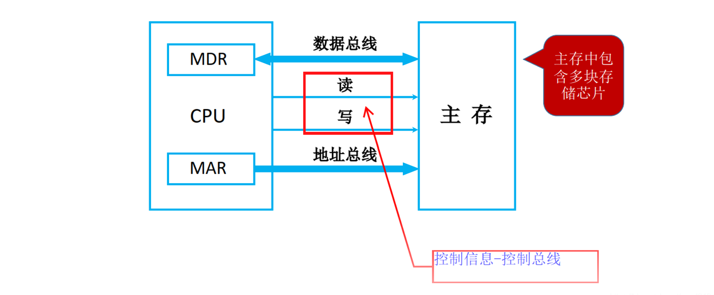

| 总线 | 功能 | 方向 | 位数决定因素 |
|:---|:---|:---|:---|
| **地址总线** | CPU → 主存，传输要访问的地址 | 单向 | MAR 位数 → 决定最大寻址范围 |
| **数据总线** | CPU ↔ 主存，传输数据 | 双向 | MDR 位数 → 决定存储字长 |
| **控制总线** | CPU → 主存，传输读/写等控制信号 | 每根线方向固定 | — |

**芯片容量扩展**：

| 扩展方式 | 用途 | 连接方式 |
|:---|:---|:---|
| **位扩展** | 数据位宽不够 | 多片并联：共用地址线和控制线，数据线各自独立 |
| **字扩展** | 地址空间不够 | 多片串联：高位地址经译码产生片选信号 |
| **字位同时扩展** | 容量和位宽均不够 | 先位扩展拼成所需位宽，再字扩展拼成所需容量 |

---

#### 五、内存条

内存条（DIMM, Dual In-line Memory Module）是将多个 DRAM 芯片焊接在一块小电路板上的**标准化模块**，通过内存插槽与主板连接。

##### 1. 内存条的基本组成

- 一块内存条上有**多颗 DRAM 芯片**并联，构成 64 bit 数据位宽（现代 PC 标准）
- 内存条上有 **SPD（Serial Presence Detect）** 芯片——一片小 EEPROM，存储该内存条的时序参数和容量信息，供 BIOS 初始化时读取

##### 2. 内存条的信号线

| 信号线 | 功能 |
|:---|:---|
| **地址线** | 传送行/列地址（分时复用） |
| **数据线** | 64 bit（标准 DIMM） |
| **控制线** | RAS#（行选通）、CAS#（列选通）、WE#（写使能）、CS#（片选） |
| **时钟线** | 同步时钟信号（SDRAM 及之后的标准） |
| **SPD 线** | I²C 总线，读取 SPD 信息 |

##### 3. 内存条的发展

| 类型 | 全称 | 特点 | 工作电压 |
|:---|:---|:---|:---|
| **SIMM** | 单列直插内存模块 | 32 bit 位宽，已淘汰 | 5V |
| **DIMM** | 双列直插内存模块 | 64 bit 位宽，现代 PC 主流 | — |
| **SDRAM** | 同步 DRAM | 与系统时钟同步（第一个同步标准） | 3.3V |
| **DDR SDRAM** | 双倍数据速率 SDRAM | 时钟上升沿/下降沿各传一次数据 | 2.5V |
| **DDR2/DDR3** | — | 提高预取位宽、降低电压 | 1.8V / 1.5V |
| **DDR4/DDR5** | — | 更高频率、更低电压、更大容量 | 1.2V / 1.1V |

> **DDR 的命名含义**："Double Data Rate"——每个时钟周期在上升沿和下降沿各传输一次数据，因此数据传输率 = 内存时钟频率 × 2。

---

### （二）SRAM 存储器

**SRAM（静态随机存取存储器）** 是计算机中一种极为关键的**易失性**存储器。它的名字“静态”源于其核心特性：**只要保持通电，存储的数据就能稳定保存，无需像DRAM那样频繁刷新**

#### 一、基本的静态存储元阵列

- **存储位元**:一个锁存器（触发器）。只要直流供电电源一直加到这个记忆电路上，它就无限期地保持记忆的1状态或0状态。如果电源**断电，那么存储的数据（1或0）就会丢失**。
- **三组信号线（重点）** ：**地址线**、**数据线**（行线、列线）、**控制线**
- **地址线**：若为6条，则指定了存储器的容量为26 = 64个**存储单元**
- **数据线**：若为4条，则制定了存储器的**字长**为4位，因此**存储位元总数为64×4 = 256**。
- **控制线**：R/~W控制线，指定了对存储器进行读还是写

地址译码器输出有64条选择线，我们称之为行线，它的作用是打开每个存储位元的输入与非门。

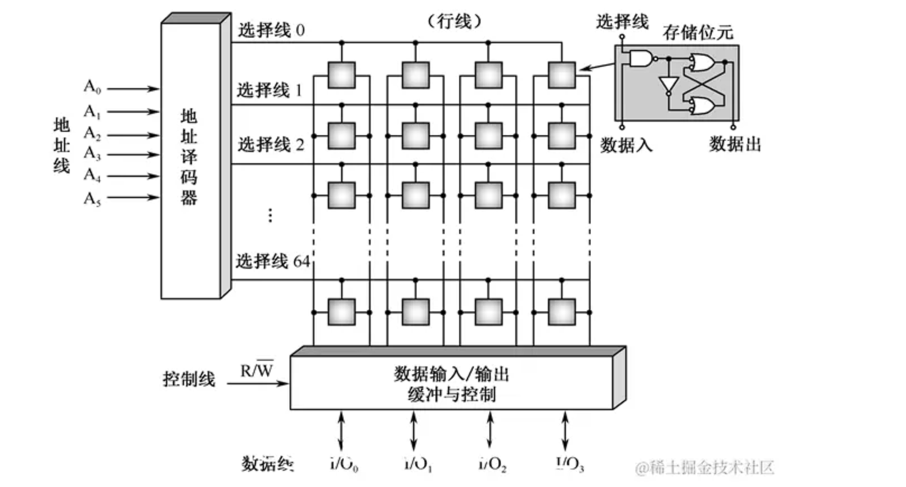

大量 6T 单元按行/列排列构成**静态存储元阵列**，配合行译码器、列译码器、灵敏放大器、读写控制电路构成完整的 SRAM 芯片。

#### 二、SRAM 逻辑结构


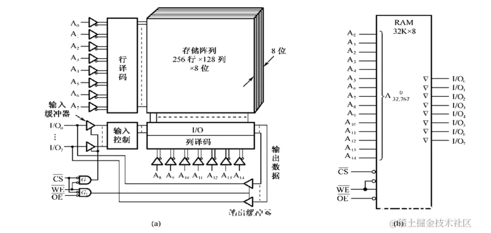

- 存储阵列与容量计算

  - **芯片容量**：图右侧标明该 RAM 规格为 $32\text{K} \times 8$ 位。这意味着它有 $32\text{K}$（即 $32 \times 1024 = 32768$）个存储单元，每个单元可以存储 **8 位（1 字节）** 的数据。

  - **双译码结构（矩阵排列）**：为了避免译码器输出线过多，存储阵列采用了二维交叉矩阵排列。
    - **行数**：256 行
    - **列数**：128 列
    - **位深**：8 位（即每次选中某行某列，实际上是同时选中了 8 片叠在一起的阵列，对应 8 位数据）
    - 验证总体积：$256 \times 128 \times 8 \text{ 位} = 32768 \times 8 \text{ 位} = 32\text{K} \times 8 \text{ 位}$。

- 地址总线与译码机制:该存储器共有 **15 根地址线**（$A_0 \sim A_{14}$），正好对应 $2^{15} = 32768$ 个寻址地址（0 ~ 32,767）。这 15 根地址线被分成了两部分：

  - **行译码器（Row Decoder）**：
    - 输入为 $A_0 \sim A_7$ 共 **8 根**地址线。
    - $2^8 = 256$，正好对应驱动存储阵列的 **256 行**。

  - **列译码器（Column Decoder）**：
    - 输入为 $A_8 \sim A_{14}$ 共 **7 根**地址线。
    - $2^7 = 128$，通过多路复用开关选择阵列中的 **128 列**。

- 控制信号与读写逻辑：左下角的逻辑门（$G_1$ 和 $G_2$）展示了控制信号是如何协同工作的。所有控制信号均为**低电平有效**（带有上划线 $\overline{\quad}$ 或引脚上的小圆圈）

  - **CS#（Chip Select，片选信号）**：
    - 当 $\overline{CS} = 1$ 时，芯片未被选中，处于高阻抗/休眠状态。
    - 当 $\overline{CS} = 0$ 时，芯片启动，允许进行读写操作。

  - **WE#（Write Enable，写允许信号）**：
    - 当 $\overline{WE} = 0$ 时，控制门 $G_1$ 打开，输入缓冲器工作，数据从 $I/O_0 \sim I/O_7$ 被**写入**选中的存储单元。

  - **OE#（Output Enable，输出允许信号）**：
    - 当 $\overline{WE} = 1$ 且 $\overline{OE} = 0$ 时，控制门 $G_2$ 打开，输出缓冲器（三态门）开启，选中的存储单元数据被**读出**到 $I/O_0 \sim I/O_7$ 总线上。

- 数据输入/输出（$I/O_0 \sim I/O_7$）：由于采用了**三态双向缓冲器**，数据的输入和输出共用了相同的 8 根引脚。

  - **写数据**时，双向引脚充当输入端，数据流入输入控制电路。

  - **读数据**时，双向引脚充当输出端，数据通过输出缓冲器传出。

#### 三、读/写周期波形图

<table style="width: 100%; border: none;">
  <tr style="border: none;">
    <td style="width: 40%; vertical-align: top; border: none; text-align: center;">
      <strong>读周期波形图</strong><br>
      
    </td>
    <td style="width: 60%; vertical-align: top; border: none; padding-left: 20px;">
      <strong>一次完整的读操作流程（对照时序图）</strong>
      <ol style="margin-top: 6px; padding-left: 20px;">
        <li><strong>地址建立</strong>：CPU 将目标地址放到地址总线上，<strong>地址信号有效</strong>。内部译码器开始工作（<strong>t<sub>AQ</sub></strong> 计时开始）。</li>
        <li><strong>片选选中</strong>：<strong>CS拉低</strong>，芯片被激活（<strong>t<sub>EQ</sub></strong> 计时开始）。</li>
        <li><strong>输出使能</strong>：<strong>OE拉低</strong>，芯片内部驱动电路接通（<strong>t<sub>GQ</sub></strong> 计时开始）。</li>
        <li><strong>数据稳定</strong>：经过一段延迟（取上述三个时间的最大值），数据总线上的 <strong>I/O 数据(出)</strong> 变为<strong>有效数据</strong>。</li>
        <li><strong>结束操作</strong>：CPU 读取数据总线上的值。之后 OE#、CS# 恢复高电平，地址可改变，准备下一次操作。</li>
      </ol>
    </td>
  </tr>
</table>

---
<table style="width: 100%; border: none;">
  <tr style="border: none;">
    <td style="width: 40%; vertical-align: top; border: none; text-align: center;">
      <strong>写周期波形图</strong><br>
      
    </td>
    <td style="width: 60%; vertical-align: top; border: none; padding-left: 20px;">
      <strong>一次完整的写入操作流程（对照时序图）</strong>
      <ol style="margin-top: 6px; padding-left: 20px;">
        <li><strong>地址建立</strong>：CPU 将目标地址放到地址总线上（<strong>地址有效</strong>），并保持稳定，以确保 t<sub>SA</sub> 的时间要求。</li>
        <li><strong>激活芯片与写模式</strong>：<strong>CS# 拉低</strong>（选中芯片），<strong>WE# 拉低</strong>（告知芯片要写入）。</li>
        <li><strong>数据上线</strong>：CPU 将要写入的数据放到 I/O 引脚上（<strong>I/O 数据(入) 有效</strong>），并确保在 WE# 变高之前满足 t<sub>WD</sub> 的建立时间。</li>
        <li><strong>锁存写入</strong>：当 WE# 信号由低变高（上升沿）时，芯片内部电路将数据总线上的<strong>有效数据</strong>锁存到地址线指定的存储单元中。</li>
        <li><strong>数据保持</strong>：WE# 变高后，数据线需继续维持一段时间，满足 t<sub>hD</sub> 的要求，然后才能撤走（变为无效）。</li>
        <li><strong>结束操作</strong>：CS# 拉高，地址信号撤走，一次完整的写入操作完成。</li>
      </ol>
    </td>
  </tr>
</table>


---

### （三）DRAM 存储器

#### 一、存储元的记忆原理


DRAM 靠**电容存储电荷**来记忆信息：电容充有电荷 → "1"，无电荷 → "0"。结构为 1 个 MOS 管 + 1 个电容（1T1C）。

##### 1. 核心元件与控制信号：

在分析具体过程前，我们先明确电路中的几个关键部分：

- **存储位元（灰色区域）**：由一个 **MOS管（开关）** 和一个 **电容（存储介质）** 组成。电容充满电荷代表“1”，放完电代表“0”。

- **行线（Row Line / 字线）**：控制MOS管的导通。行线为**高电平**时，MOS管导通（ON），允许电容与位线进行电荷交换。

- **列线/位线（Bit Line）**：数据传输的通道。

- **三态缓冲器（三个三角形元件）**：
  1. **输入缓冲器（最下方）**：写操作时启用。受 R/W# 信号控制（低电平有效，带控制端圆圈），当 R/W# 为**低电平**时导通，将输入数据 D<sub>IN</sub> 送到位线上。
  2. **输出缓冲器/读放（中间）**：读操作时启用。受 R/W# 控制（高电平有效），当 R/W# 为**高电平**时导通，将位线上的信号放大并输出到 D<sub>OUT</sub>。
  3. **刷新缓冲器（最上方）**：刷新操作时启用。受“**刷新**”信号控制（高电平有效），导通时将输出端的数据重新送回位线。

##### 2. 四种工作状态详解

<table style="width: 100%; border: none;">
  <tr style="border: none;">
    <td style="width: 45%; vertical-align: top; border: none; text-align: center;">
      <strong>DRAM 写入操作（1T1C 电路示意）</strong><br>
      
    </td>
    <td style="width: 55%; vertical-align: top; border: none; padding-left: 20px;">
      <strong>控制信号</strong>
      <ul style="margin-top: 6px; padding-left: 20px;">
        <li><strong>行线</strong>：<strong>高电平</strong>（MOS 管导通，通道打开）。</li>
        <li><strong>R/W#</strong>：<strong>低电平</strong>（写使能，输入缓冲器打开，输出和刷新缓冲器关闭）。</li>
        <li><strong>刷新</strong>：<strong>低电平</strong>（关闭）。</li>
      </ul>
      <strong>数据流向</strong>
      <ul style="margin-top: 4px; padding-left: 20px;">
        <li>输入数据 D<sub>IN</sub> 为<strong>高电平</strong>（1），通过输入缓冲器使<strong>位线</strong>呈现高电平。</li>
        <li>电荷通过导通的 MOS 管流入电容，电容充电，存储状态变为 <strong>"+1"</strong>。</li>
      </ul>
    </td>
  </tr>
</table>
---
<table style="width: 100%; border: none;">
  <tr style="border: none;">
    <td style="width: 45%; vertical-align: top; border: none; text-align: center;">
      <strong>写 0 到存储位元</strong><br>
      
    </td>
    <td style="width: 55%; vertical-align: top; border: none; padding-left: 20px;">
      <strong>控制信号</strong>
      <ul style="margin-top: 6px; padding-left: 20px;">
        <li><strong>行线</strong>：<strong>高电平</strong>（MOS 管导通）。</li>
        <li><strong>R/W#</strong>：<strong>低电平</strong>（写使能，输入缓冲器打开）。</li>
        <li><strong>刷新</strong>：<strong>低电平</strong>（关闭）。</li>
      </ul>
      <strong>数据流向</strong>
      <ul style="margin-top: 4px; padding-left: 20px;">
        <li>输入数据 D<sub>IN</sub> 为<strong>低电平</strong>（0），使<strong>位线</strong>呈现低电平。</li>
        <li>电容中的电荷通过导通的 MOS 管流向位线并泄放至地，电容放电，存储状态变为 <strong>"0"</strong>。</li>
      </ul>
    </td>
  </tr>
</table>
---
<table style="width: 100%; border: none;">
  <tr style="border: none;">
    <td style="width: 45%; vertical-align: top; border: none; text-align: center;">
      <strong>从存储位元读出 1</strong><br>
      
    </td>
    <td style="width: 55%; vertical-align: top; border: none; padding-left: 20px;">
      <strong>控制信号</strong>
      <ul style="margin-top: 6px; padding-left: 20px;">
        <li><strong>行线</strong>：<strong>高电平</strong>（MOS 管导通）。</li>
        <li><strong>R/W#</strong>：<strong>高电平</strong>（读使能，输出缓冲器打开，输入缓冲器关闭）。</li>
        <li><strong>刷新</strong>：<strong>低电平</strong>（关闭）。</li>
      </ul>
      <strong>数据流向</strong>
      <ul style="margin-top: 4px; padding-left: 20px;">
        <li>电容中存储的电荷（+1）通过导通的 MOS 管释放到位线上，位线电压微幅上升（高电平）。</li>
        <li>微弱信号经<strong>输出缓冲器（读出放大器）</strong>放大后，D<sub>OUT</sub> 输出<strong>高电平（1）</strong>。</li>
      </ul>
      <strong>重要考点（破坏性读出）</strong>
      <p style="margin-top: 4px;">读出过程中，电容的电荷因流向位线而流失，称为<strong>破坏性读出</strong>。因此 DRAM 读出后必须紧跟<strong>再生（重写）</strong>操作，将电荷重新补满。</p>
    </td>
  </tr>
</table>

---
<table style="width: 100%; border: none;">
  <tr style="border: none;">
    <td style="width: 45%; vertical-align: top; border: none; text-align: center;">
      <strong>刷新存储位元（读后再生）</strong><br>
      
    </td>
    <td style="width: 55%; vertical-align: top; border: none; padding-left: 20px;">
      <strong>控制信号</strong>
      <ul style="margin-top: 6px; padding-left: 20px;">
        <li><strong>行线</strong>：<strong>高电平</strong>（MOS 管导通）。</li>
        <li><strong>R/W#</strong>：<strong>高电平</strong>（输出缓冲器打开，维持读出）。</li>
        <li><strong>刷新</strong>：<strong>高电平</strong>（刷新缓冲器打开，建立反馈通路）。</li>
      </ul>
      <strong>数据流向（闭环反馈回路）</strong>
      <p style="margin-top: 4px; text-align: center;">电容/位线 → 输出缓冲器 → 刷新缓冲器 → 位线 → 电容</p>
      <ul style="padding-left: 20px;">
        <li>读出的高电平信号（1）经输出缓冲器后，通过<strong>刷新缓冲器</strong>重新送回位线。</li>
        <li>强信号重新驱动位线，经导通 MOS 管对电容<strong>重新充电</strong>，恢复到饱满的 <strong>"+1"</strong> 状态。</li>
      </ul>
    </td>
  </tr>
</table>

**特点**：

- **破坏性读出**：读出时电容上的电荷被位线共享，需要**读后重写**恢复
- **必须刷新**：电容会漏电，电荷约在 **2ms** 内消失 → 必须在 2ms 内刷新所有行
- 每次刷新 = 读出一行 → 放大 → 写回（无需输出到数据端口）

#### 二、芯片的逻辑结构


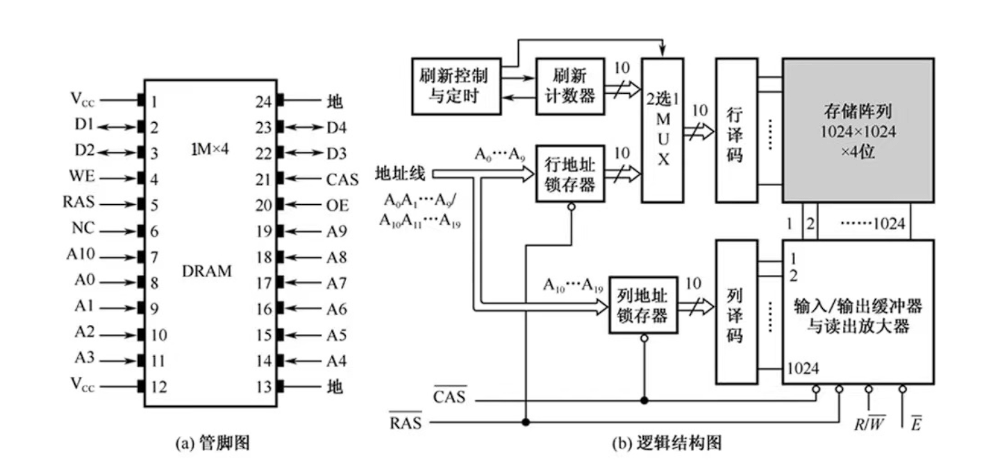

**DRAM 地址的分时复用**：
- **RAS#**（Row Address Strobe，行地址选通）：低有效时锁存行地址
- **CAS#**（Column Address Strobe，列地址选通）：低有效时锁存列地址
- 同一组地址引脚分两次送入行地址和列地址，**节省引脚数**

#### 三、读/写周期、刷新周期

##### 1. 读/写周期

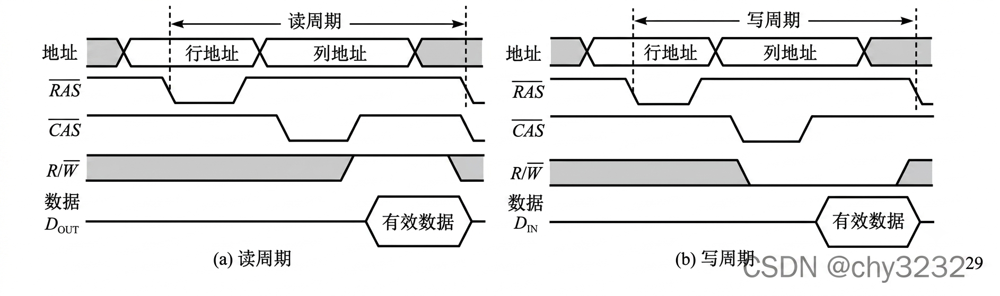

**核心前提：RAS和CAS的“锁存”作用**

- **RAS（行选通）的下降沿**：芯片把当前地址线上的值“咔嚓”锁存为**行地址**。
- **CAS（列选通）的下降沿**：芯片把当前地址线上的值“咔嚓”锁存为**列地址**。
- **地址线复用**：可以看到，地址信号在时间轴上先后出现了 **“行地址”** 和 **“列地址”** 两段，它们共用相同的物理引脚。

**（1）读周期（读出数据）**

这是一个“CPU问芯片要数据”的过程，芯片内部需要时间来感应电荷。

1. **地址建立（行）**：CPU先将行地址放到地址总线上。
2. **RAS变低（↓）**：RAS信号的下降沿触发，芯片将当前地址线上的值锁存为**行地址**。内部开始选通对应的字线（一整行）。
3. **地址切换（列）**：总线上的地址切换为**列地址**。
4. **CAS变低（↓）**：经过一段必要的时间间隔（tRCD，即RAS到CAS延迟）后，**CAS**信号的下降沿触发，锁存**列地址**。此时，具体的存储单元（交叉点）被选中。
5. **数据输出（Dout）**：存储单元的电容将微弱的电荷放到位线上，经读出放大器放大后，从 **Dout** 引脚输出。图中标注的**“有效数据”**，就是在CAS变低后等待了一段存取时间（tCAC或tRAC）才稳定出现的。
6. **结束**：数据读取完毕，CAS和RAS先后恢复高电平。

**（2）写周期（写入数据）**

这是一个“CPU给芯片塞数据”的过程，关键在于数据必须先于CAS结束前稳定。

1. **地址建立**：同样，先送**行地址**，再送**列地址**（波形与读周期完全一致）。
2. **RAS与CAS锁存**：RAS和CAS依次变低，锁存行列地址（与读周期前半段相同）。
3. **R/W变为低电平**：这是写操作的关键标志。在CAS变低之前或与之同时，**R/W（读写控制线）必须被拉低（写使能）**。这告诉芯片：“这次是往里存，不是往外读”。
4. **数据输入（DIN）**：CPU在**DIN**引脚上放好要写的**有效数据**。注意，这个数据必须在CAS变低之前就稳定下来（满足数据建立时间tDS），并保持到CAS变高之后（满足数据保持时间tDH）。
5. **锁存写入**：在CAS低电平期间，芯片内部将DIN上的电平强行写入被选中的存储电容中。
6. **结束**：R/W先恢复高电平，然后CAS和RAS依次结束。

##### 2. 刷新周期

**（1）刷新的基本规则与特点**

- **刷新的单位是“行”**：DRAM 刷新时，**仅需要行地址**。译码器每次选中一整行，该行上所有芯片的感荷放大器（读出放大器）同时工作，读出该行数据并立刻重新写入，从而完成整行的电荷补充。整个过程**不需要列地址**参与。  

- **刷新周期（最大刷新间隔）**：电容电荷一般只能维持 **$2\text{ms}$**（较新的技术可达 $64\text{ms}$）。也就是说，**必须在 $2\text{ms}$ 内对所有行全部刷新一遍**。这 $2\text{ms}$ 就称为**刷新间隔**（或最大刷新周期）。  

- **刷新周期 vs 存取周期**：刷新一行的实质是只读不输出的“假读”。因此，**刷新一行所需要的时间通常等于一个正常的存取周期（读/写周期）**。  

- **刷新 vs 重写（再生）**：  

  - **重写**：是**随机的**，仅在**破坏性读出**后发生，针对被读出的那个单元。  

  - **刷新**：是**定时的**、全员性的，不管有没有被读写，时间到了就必须对**整行**进行电荷补充。  

**（2）三种经典刷新方式**

| <nobr>刷新方式</nobr> | 操作 | 特点 |
|:---|:---|:---|
| <nobr>**集中刷新**</nobr> | 在固定时间段内集中刷新所有行 | 有"死区"（CPU 等待），控制简单 |
| <nobr>**分散刷新**</nobr> | 将刷新分散到每个存取周期后（如每次读写后刷新一行） | 无死区，但存取周期 = 存取时间 + 刷新时间 |
| <nobr>**异步刷新**</nobr> | 在 2ms 内均匀分散刷新各行 | 折中，死区小——仅在刷新某行时短暂阻塞，现代 DRAM 主流 |

> **死区（Dead Zone）**：集中刷新期间 CPU 无法访问存储器的时间段。异步刷新将死区分摊到各个刷新时刻，使每次阻塞最短。

**具体数值（教材 3.3.3，以 $128\times128$ 矩阵、存取周期 $0.5\mu s$ 为例）**：

- **集中刷新**：死区 $=0.5\mu s\times128=64\mu s$；死时间率 $=128/4000\times100\%=3.2\%$（刷新期间 CPU 完全无法访存）。
- **异步刷新**：每隔 $2\text{ms}/128=15.625\mu s$ 刷新一行（工程上常取 $15.5\mu s$，使每行在 $2\text{ms}$ 内都被刷到）。

#### 四、主存储器容量的扩充

**芯片数通用公式（重点）**：所需芯片数 $d = \dfrac{\text{内存容量}}{\text{芯片容量}}$。字位同时扩展时，设内存为 $M\times N$ 位、芯片为 $L\times K$ 位，则共需 $\left(\dfrac{M}{L}\right)\times\left(\dfrac{N}{K}\right)$ 片。当 $K=M$ 时只做**位扩展**、$L=N$ 时只做**字扩展**、$K<M$ 且 $L<N$ 时则**字位同时扩展**（先位后字）。

> **例（教材 3.3.4）**：用 $16\text{K}\times 4$ 位芯片设计 $16\text{K}\times 8$ 位存储器 → $d=(16\text{K}\times 8)/(16\text{K}\times 4)=2$ 片（位扩展）；用 $16\text{K}\times 8$ 位芯片设计 $64\text{K}\times 8$ 位存储器 → $d=(64\text{K}\times 8)/(16\text{K}\times 8)=4$ 片（字扩展）。

**（1）位扩展**：位宽不够 → 多片并联；**并联地址，共享控制，拆分数据**

|                  **连接对象**                   | <nobr>**连接方式**</nobr> | **物理意义**                                                 |
| :---------------------------------------------: | :-----------------------: | ------------------------------------------------------------ |
|               **地址线 ($A_i$)**                |       **全部并联**        | 所有的芯片接收完全相同的地址。当 CPU 给出某个地址时，所有芯片同时选中该地址对应的存储单元。 |
|         **片选信号 ($\overline{CS}$)**          |       **全部并联**        | 所有的芯片同时被选中、同时工作，它们共同组成一个完整的“大字”。 |
| <nobr>**读写控制信号 ($\overline{WE}$)**</nobr> |       **全部并联**        | 所有的芯片同时进行读操作，或同时进行写操作。                 |
|               **数据线 ($D_i$)**                |       **分别连接**        | **唯一需要分开连接的部分。** 比如两片 $4$ 位芯片扩展为 $8$ 位，芯片 A 的 $4$ 位数据线接系统总线的 $D_0 \sim D_3$，芯片 B 的 $4$ 位数据线接系统总线的 $D_4 \sim D_7$。 |

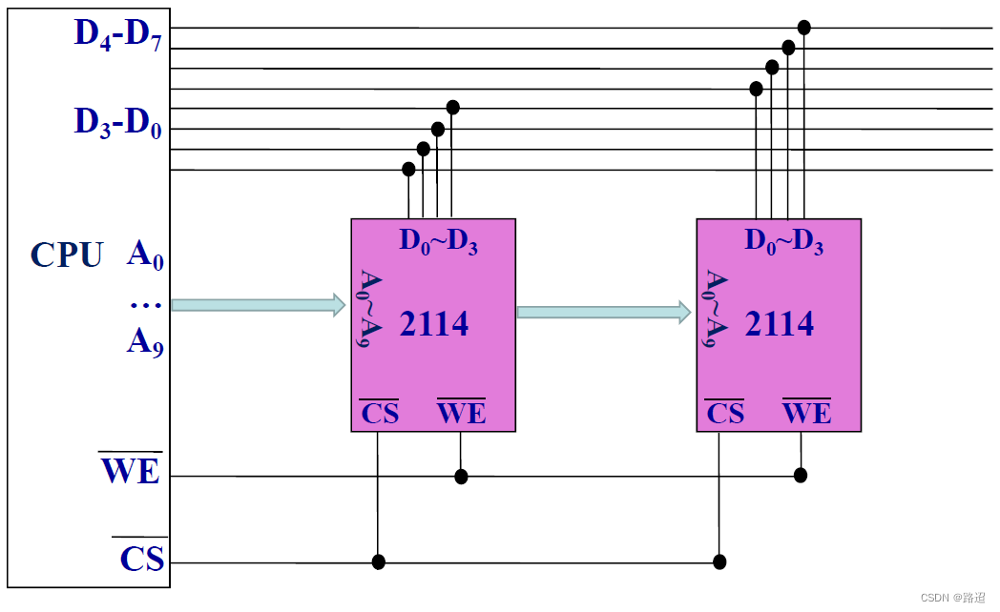

**（2）字扩展**：地址空间不够 → 高位地址译码选片

|                **连接对象**                 |                 **连接方式**                  | <center>**物理意义**</center>                                |
| :-----------------------------------------: | :-------------------------------------------: | :----------------------------------------------------------- |
|               **低位地址线**                |                 **全部并联**                  | 用于选中芯片内部具体的存储单元。                             |
|             **数据线 ($D_i$)**              |                 **全部并联**                  | 因为任何时刻只有一片芯片被片选导通，其他芯片处于高阻态，所以它们可以安全地共享同一组数据总线。 |
| <nobr>**读写控制 ($\overline{WE}$)**</nobr> |                 **全部并联**                  | 所有芯片接收相同的读写控制信号。                             |
|       **片选信号 ($\overline{CS}$)**        | <nobr>**分别连接（由译码器输出控制）**</nobr> | **最核心的区别。** 每一片（或每一组）芯片的 $\overline{CS}$ 引脚，分别连接到译码器的不同输出端（如 $Y_0, Y_1 \dots$）。 |

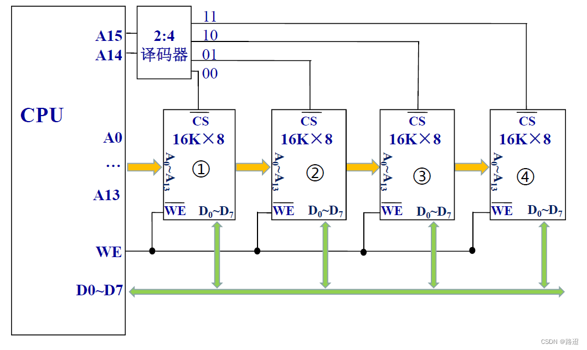

**（3）字位同时扩展**：先位扩展组成所需位宽，再字扩展组成所需容量

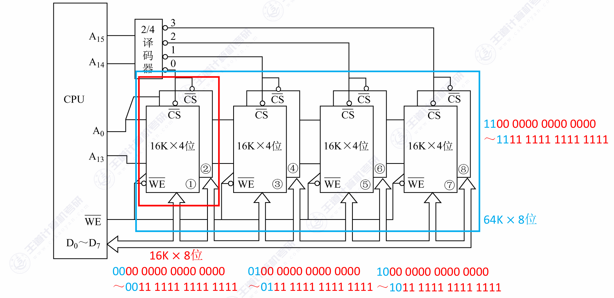

#### 五、SRAM 和 DRAM 的区别


| 维度 | SRAM | DRAM |
|:---:|:---:|:---:|
| 存储元结构 | 6T 双稳态触发器 | 1T1C（1管1电容） |
| 破坏性读出 | 否 | **是**（读后需重写） |
| 刷新 | **不需要** | **必须**（2ms 内） |
| 速度 | 快 | 较慢 |
| 集成度 | 低 | **高** |
| 功耗 | **大** | **小** |
| 成本 | 高 | 低 |
| 地址送入方式 | 一次送入 | **分时复用**（行地址 + 列地址） |
| 用途 | **Cache** | **主存** |

---

### （四）只读存储器和闪速存储器

#### 一、ROM


ROM 正常工作时只能读出，结构简单，断电后不丢失数据（**非易失性**）。

| 类型 | 全称 | 编程方式 | 擦除方式 |
|:---|:---|:---|:---|
| **MROM** | 掩膜 ROM | 出厂时掩膜固定 | 不可改写 |
| **PROM** | 可编程 ROM | 用户一次性编程（熔丝） | 不可擦除 |
| **EPROM** | 可擦除可编程 ROM | 用户编程 | 紫外线擦除（需从设备取出，开窗照射） |
| **EEPROM** | 电可擦除可编程 ROM | 用户编程 | 电擦除（无需取出，在线擦写） |

#### 二、存储器


FLASH 是 EEPROM 的改进型——可以**按块擦除**而非逐字节擦除，速度快、成本低。

| 类型 | 特点 | 典型应用 |
|:---|:---|:---|
| **NOR Flash** | 支持随机读取，可按字节读取代码 | BIOS/UEFI 固件、嵌入式代码存储 |
| **NAND Flash** | 按页读写、按块擦除，密度高、成本低 | U 盘、SSD、存储卡 |

> NOR Flash 可"就地执行（XIP, Execute In Place）"——CPU 可直接从 NOR Flash 执行代码，无需先复制到 RAM。NAND Flash 不能 XIP。

#### 三、SSD（固态硬盘）

SSD 本质上是一个集成了**NAND Flash 阵列 + 主控制器 + DRAM 缓存**的大容量存储设备。

| 特性 | SSD | HDD |
|:---|:---|:---|
| 速度 | 几百 MB/s ~ 几 GB/s | 100~200 MB/s |
| 随机访问 | 极快（无物理寻道） | 慢 |
| 功耗 | 低 | 较高 |
| 抗震 | 好（无机械部件） | 差 |
| 写入寿命 | 有限（P/E 周期数） | 几乎无限 |

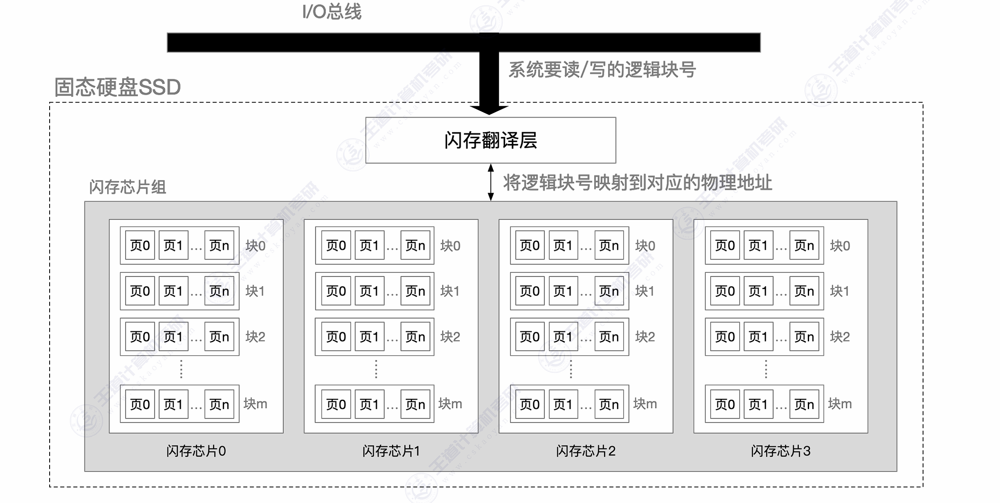

**SSD 的核心技术**：

- **按页读写、按块擦除**：页 = 最小读写单位（4KB/8KB/16KB），块 = 最小擦除单位（数百页）
- **写入前必须先擦除**：已写过的页不能直接重写，需整个块擦除后再写
- **垃圾回收（GC）**：将块中的有效页搬移到新块，擦除旧块以回收空间
- **磨损均衡（Wear Leveling）**：均衡各块的擦写次数，避免热点块过早失效
- **写放大（Write Amplification）**：实际写入的 NAND 数据量 > 用户写入量（因 GC 需额外搬移）

---

### （五）并行存储器

#### 一、双端口存储器

同一个存储体具有**两套独立的读写端口**（各自的地址线、数据线和控制线）。

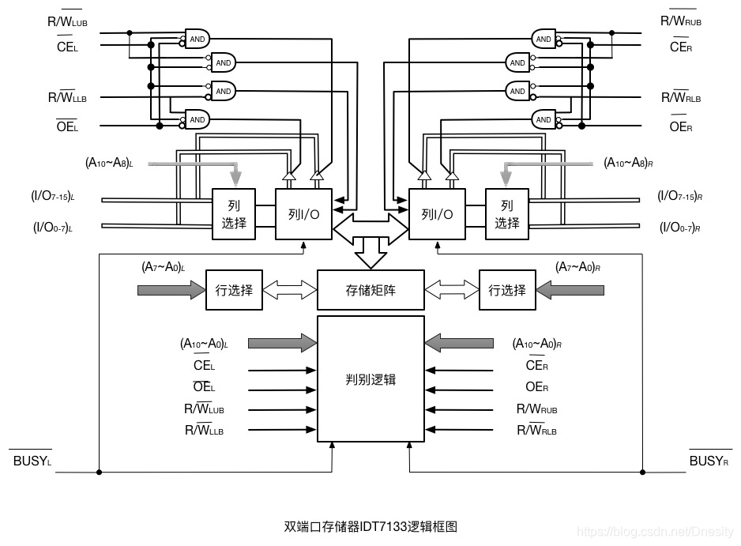

- **无冲突**：两端口访问不同地址 → 可并行工作
- **写冲突**：两端口同时写同一地址 → 数据不确定，通过$\overline{\text{BUSY}}$ 标志决定哪个端口优先读写
- **读写冲突**：一读一写同一地址 → 读出值不确定（可能是旧值或新值）

#### 二、多模块存储器

##### 1. 多模块存储器的结构

将主存划分为多个独立的**存储模块**（存储体），每个模块有独立的地址寄存器、译码电路和读写电路。各模块可以**并行工作**，提高整体访存带宽。

```
+-------------------------------------------------------------+
|                             CPU                             |
+-------------------------------------------------------------+
                              ▲ |
                              | | (双向总线)
                              ▼ ▼
+-------------------------------------------------------------+
|                        存储器控制部件                         |
+-------------------------------------------------------------+
      ▲                ▲                ▲                ▲
      |                |                |                |  (双向总线)
      ▼                ▼                ▼                ▼ 
   +-----+          +-----+          +-----+          +-----+
 0 |     |        1 |     |        2 |     |        3 |     |
   |-----|          |-----|          |-----|          |-----|
 4 |     |        5 |     |        6 |     |        7 |     |
   |-----|          |-----|          |-----|          |-----|
   | M0  |          | M1  |          | M2  |          | M3  |
   +-----+          +-----+          +-----+          +-----+
```

##### 2. 单体多字存储器

**单体多字**：一个存取周期内，从**同一模块**中一次读出**多个连续存储字**。

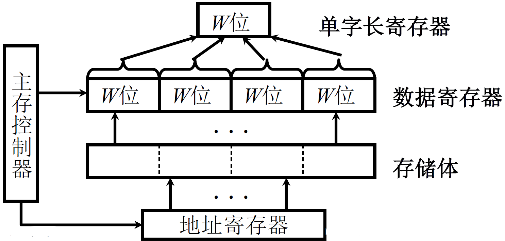

> 单体多字**不增加模块数**，只是加宽了数据通路。缺点是灵活性差——只能读连续的几个字，若只要一个字也会浪费带宽。

##### 3. 多体并行存储器

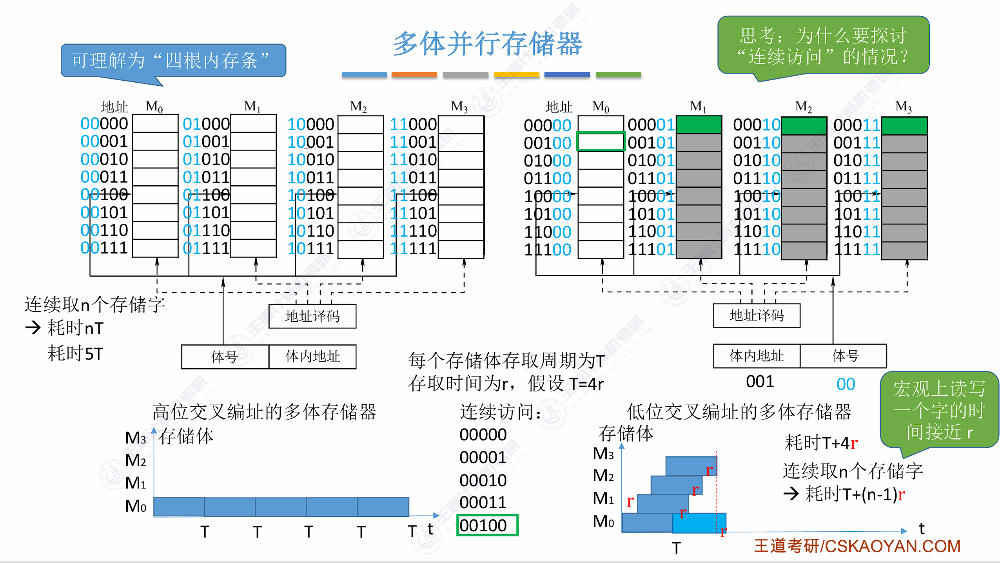

**模块的编址方式**决定其工作模式和适用场景：

|   编址方式   | 规则                                 | 地址分布           | 适用场景     |
| :----------: | :----------------------------------- | :----------------- | :----------- |
| **高位交叉** | 高位地址选模块，低位选模块内单元     | 同一模块内地址连续 | 独立并发任务 |
| **低位交叉** | **低位地址选模块**，高位选模块内单元 | 连续地址跨不同模块 | 顺序流水访问 |

---

### （六）Cache 存储器

程序访问的局部性（Locality of Reference）是计算机科学的核心原理：程序在执行时，倾向于访问内存中临近的区域，或重复访问相同的数据。它分为**时间局部性**（重复访问相同数据）和**空间局部性**（访问相邻数据）两类。了解该原理可助你写出更高效、缓存命中率更高的代码。

- **时间局部性**：如果一个内存位置今天被引用，那么它不久后极可能再次被引用。
  - *场景*：循环中的计数器 `i`、累加器 `sum` 或频繁读取的热门变量。
- **空间局部性**：如果一个内存位置被引用，那么程序很可能在不久后引用它附近的内存位置。
  - *场景*：顺序读取数组元素、遍历连续内存块。

#### 一、的基本原理


##### 1. Cache 的功能

CPU 与主存之间加入一个容量小但速度快的 **SRAM Cache**，其核心功能：

- **弥补 CPU 与主存的速度差距**：CPU 速度远超 DRAM，Cache 以接近 CPU 的速度提供数据
- **利用局部性原理减少平均访存时间**：将频繁访问的指令和数据缓存在 SRAM 中
- **对上层透明**：CPU 只发出访存地址，由硬件自动判断数据是否在 Cache 中

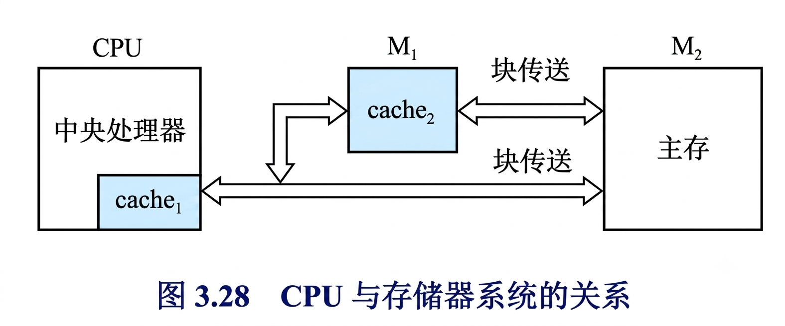

Cache 与主存之间**以块（Block / Cache Line）为单位**交换数据。

##### 2. Cache 的基本原理

**两个关键的数据传送单位**：

| 传送路径 | 传送单位 | 原因 |
|:---|:---|:---|
| **CPU ↔ Cache** | **字（Word）** | CPU 每次只请求一个字的指令或数据 |
| **Cache ↔ 主存** | **块（Block / Cache Line）** | 利用空间局部性——一次调入连续多个字，提高命中率 |

- **命中（Hit）**：CPU 访问的数据在 Cache 中找到 → 直接返回，无需访问主存。

- **缺失（Miss）**：CPU 访问的数据不在 Cache 中 → 从主存调入包含该数据的整个块到 Cache，可能需要替换某一行。

- **CPU 读主存的完整流程**：
  1. CPU 将访存地址**同时**发送给 Cache 和主存。
  1. Cache 控制逻辑依据地址判断此字是否在 Cache 中。
  1. 若**命中**：此字立即从 Cache 传送给 CPU，无需访问主存。
  1. 若**缺失**：用主存读周期把此字从主存读出送到 CPU；与此同时，把含有这个字的**整个数据块**从主存读出送到 Cache 中保存。


- Cache 能有效工作的**理论基础**是程序访问的**局部性原理**：

  - **时间局部性**：刚访问过的数据不久后可能再次被访问 → Cache 保留它

  - **空间局部性**：刚访问过的数据附近的数据可能紧接着被访问 → Cache 一次调入一整块


##### 3. 命中率与平均访问时间

设 $N_c$ 为 Cache 命中次数，$N_m$ 为 Cache 缺失次数（需访问主存的次数）：

$$H = \frac{N_c}{N_c + N_m}$$

$H$ 越接近 1，Cache 效率越高。现代 CPU 的 Cache 命中率通常 > 95%。

设 $T_c$ 为 Cache 访问时间，$T_m$ 为主存访问时间，则平均访问时间：

$$T_{avg} = H \times T_c + (1-H) \times T_m$$

**示例**：$H=0.95$，$T_c=10$ ns，$T_m=100$ ns

$$T_{avg} = 0.95 \times 10 + 0.05 \times 100 = 14.5 \text{ ns}$$

> 命中率 95% 时，平均访问时间 14.5 ns，远快于直接访问主存的 100 ns。

---

#### 二、Cache 的地址映射


映射方式决定了**主存块可以放入 Cache 的哪些位置**——这是 Cache 设计中最关键的决策之一，直接影响命中率和硬件复杂度。

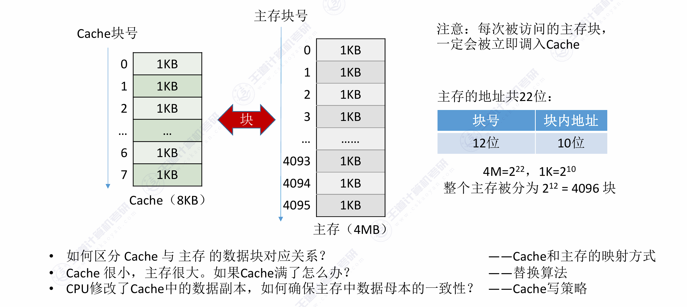

##### 1. 直接映射（Direct Mapped）

**规则**：每个主存块只能放到 Cache 中**唯一固定的一个位置**：

$$\text{Cache 行号} = \text{主存块号} \bmod \text{Cache 总行数}$$

**地址结构**：

```
main memory addr = 
┌────────────┬────────────┬────────────┐
│Tag         │Index       │Offset      │
└────────────┴────────────┴────────────┘
```

> 图：直接映射的主存地址划分——高位标记 Tag、中位行号 Index、低位块内偏移 Offset。

**原理**：多个主存块映射到同一个 Cache 行，用 Tag 区分当前 Cache 行中存放的是哪一块。

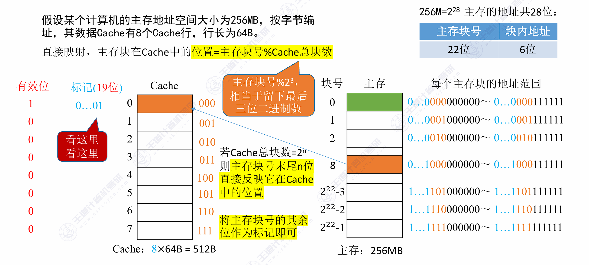

**硬件实现**：用 Index 选中一行 → 比较 Tag 和有效位 → 匹配则命中。

| 优点 | 缺点 |
|:---|:---|
| 硬件最简单：只需 1 个比较器 | 冲突缺失多：不同块映射到同行互相淘汰（抖动） |
| 查找最快 | Cache 利用率低 |

**示例**：主存 64KB，Cache 4KB，块大小 16B。

```
主存 64KB = 2^16 B, 共 2^16/2^4 = 2^12 = 4096 块
Cache 4KB = 2^12 B, 共 2^12/2^4 = 2^8 = 256 行
块内偏移: 4 位 (2^4=16)
行号: 8 位  (2^8=256)
标记: 12−8=4 位 (多对一映射，需区分是哪块)

主存地址 (16位): Tag(4位) │ Index(8位) │ Offset(4位)
```

> 主存块 0、256、512…都映射到 Cache 行 0——靠 Tag 区分。

##### 2. 全相联映射（Fully Associative）

**规则**：每个主存块可以放到 Cache 的**任意位置**，没有任何限制。

**地址结构**：

```
main memory addr = 
┌────────────┬────────────┐
│Tag         │Offset      │
└────────────┴────────────┘
```

> 图：全相联映射的主存地址划分——无行号字段，高位全为标记 Tag，低位为块内偏移 Offset。

**原理**：没有 Index 字段，整个地址高位都是 Tag。查找时需与 Cache 中**所有行的 Tag 同时比较**。

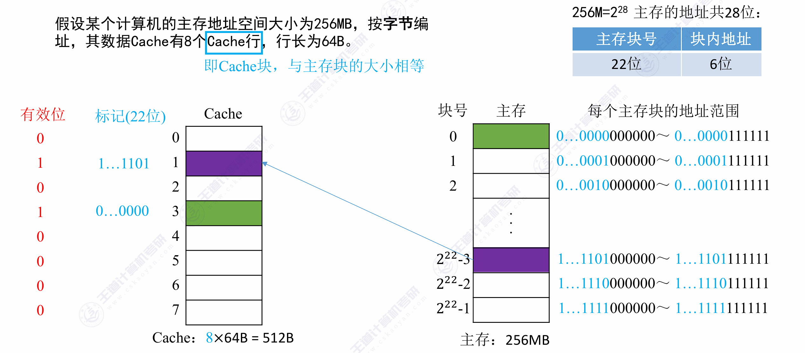

**CPU 访问流程示例**（主存地址 1...1101001110）：

1. 主存地址的前 22 位作为 Tag，与 Cache 中**所有行**的标记同时比较
2. 若某行标记匹配且有效位 = 1 → **Cache 命中**，访问块内偏移 001110 对应单元
3. 若所有行都不匹配或有效位 = 0 → **缺失**，从主存调入

**硬件实现**：需要**相联存储器（CAM）**——所有行的 Tag 同时并行比较。成本极高，只适用于小容量 Cache（如 TLB）。

| 优点 | 缺点 |
|:---|:---|
| 最灵活，冲突缺失最少 | 硬件最复杂（需 CAM，并行比较所有行） |
| Cache 空间利用率最高 | 每行需一个比较器，成本随容量剧增 |

##### 3. 组相联映射（Set Associative）

**规则**：Cache 分成多个**组（Set）**，每组含若干行（路）。主存块先映射到固定组，在组内可任意放。

$$\text{Cache 组号} = \text{主存块号} \bmod \text{Cache 组数}$$

**地址结构**：

```
main memory addr = 
┌────────────┬────────────┬────────────┐
│Tag         │Set index   │Offset      │
└────────────┴────────────┴────────────┘
```

> 图：组相联映射的主存地址划分——标记 Tag / 组号 Set index / 块内偏移 Offset。

**原理**：Index 定位到固定组 → 组内多路（如 2/4/8 路）任意放 → 只需比较组内若干路的 Tag。

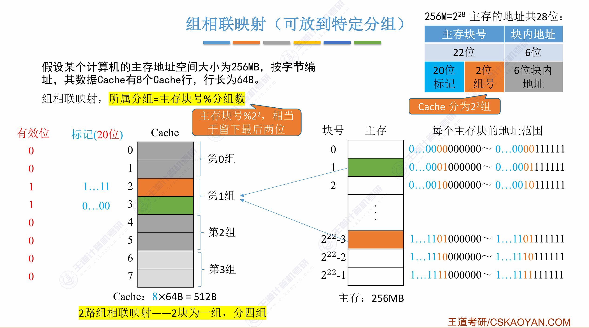

**示例**：主存 1MB，Cache 64KB，块大小 32B，4 路组相联。

```
主存 1MB = 2^20 B, 共 2^20/2^5 = 2^15 = 32768 块
Cache 64KB, 共 2^16/2^5 = 2^11 = 2048 行
4 路组相联: 2048/4 = 512 组
块内偏移: 5 位  (2^5=32)
组号: 9 位       (2^9=512)
标记: 15−9=6 位

主存地址 (20位): Tag(6位) │ Index(9位) │ Offset(5位)
```

| 路数 | 等价于 | Tag 比较数 | 冲突缺失 | 硬件复杂度 |
|:---:|:---|:---:|:---:|:---:|
| 1 路 | 直接映射 | 1 | 最多 | 最低 |
| 2~4 路 | 组相联 | 2~4 | 少 | 中 |
| 8 路 | 组相联 | 8 | 很少 | 较高 |
| N 路（全组）| 全相联 | N | 最少 | 最高 |

> **408 常考**：给定 Cache 容量、块大小、路数，反推地址结构各字段的位数。组相联 = 直接映射（Index 定组）+ 全相联（组内任意），兼具二者优势，**现代 CPU 主流**。

##### 4. 三种映射方式总结

| 维度 | 直接映射 | 全相联映射 | 组相联映射 |
|:---|:---|:---|:---|
| **映射规则** | 块号 mod 行数 | 任意行 | 块号 mod 组数，组内任意 |
| **Tag 比较** | 1 次 | 全部行并行比较 | 组内全部路比较 |
| **硬件** | 1 个比较器 | **CAM（相联存储器）** | 组内 N 个比较器 |
| **冲突缺失** | 多（抖动） | 无 | 少 |
| **命中率** | 低 | **最高** | 高 |
| **成本** | 低 | **极高** | 中等 |
| **实际应用** | 早期小 Cache | TLB、小容量专用 Cache | **现代 CPU 主流** |

---

#### 三、替换策略

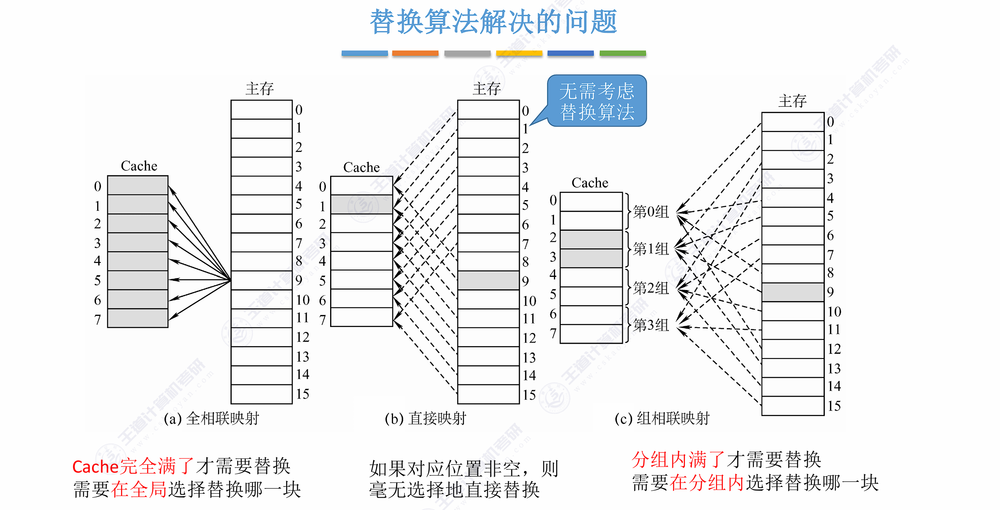

| 算法 | 规则 | 硬件成本 | 命中率 |
|:---|:---|:---|:---|
| **随机 (RAND)** | 随机选一行 | 低 | 较低 |
| **FIFO** | 替换最早进入的行 | 低 | 较低 |
| **LRU** | 替换最久未使用的行 | 高 | **最高** |
| **LFU** | 替换访问次数最少的行 | 较高（需计数器） | 较高 |
| **伪 LRU** | LRU 近似（二叉树） | 中等 | 接近 LRU |

**LFU（最不经常使用）**：为每行维护一个访问计数器，每次命中该行计数器 +1。替换时选择计数值最小的行（即历史上被访问次数最少的）。

- **优点**：能保留经常被访问的"热门"数据——计数器大的行不会被轻易替换。
- **缺点**：刚调入的新行计数值低，即使可能即将被频繁访问也会被淘汰（**"旧数据霸占"问题**）。硬件需维护每行的计数器，成本高于 LRU。

> LFU 关注的是**累计访问频率**（历史上被访问了多少次），而 LRU 关注的是**最近访问时间**（最近一次是什么时候）。LFU 适合访问频率稳定、无明显时间突变的场景。

**LRU 示例**：

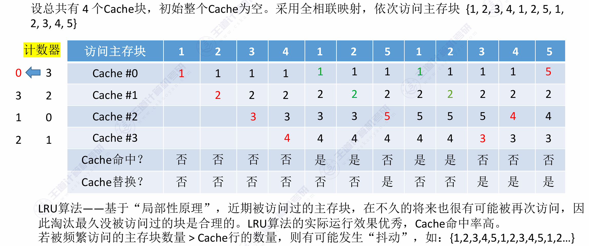

**LFU 示例**：

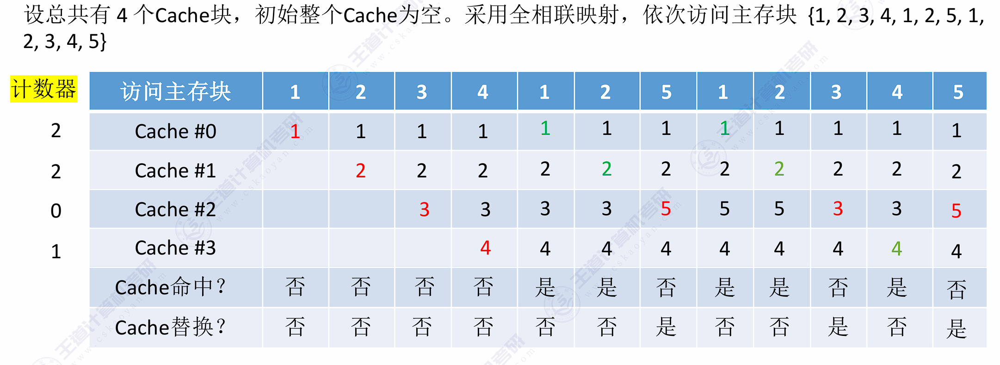

---

#### 四、写操作策略

##### 1. 写命中（Write Hit）—— 数据已在Cache中

当CPU要写一个地址，且这个地址已经在Cache里（命中），有两种处理方式：

| 策略                    | 操作方式                                                     | 优点                                                         | 缺点                                                         |
| :---------------------- | :----------------------------------------------------------- | :----------------------------------------------------------- | :----------------------------------------------------------- |
| <nobr>**写直达**</nobr> | **同时写入Cache和主存**。数据一修改，立刻同步到慢速的DRAM里。 | **数据一致性极好**（主存永远是最新的），硬件实现简单，非常适合多核共享数据场景。 | **速度极慢**（每次写都要访问慢速DRAM），消耗大量总线带宽，成为性能瓶颈。 |
| **写回**                | **只写入Cache**，并在Cache行上打一个 **“脏位（Dirty Bit）”** 标记。只有当该Cache行**被替换出去**时，才将修改后的数据**一次性写回**主存。 | **速度极快**（写入像读取一样快），大幅减少对主存的访问次数。 | **实现复杂**（需维护脏位），且**一致性风险高**（主存数据可能过时，多核间需额外嗅探协议）。 |

> **现代CPU的主流选择**：L1/L2/L3缓存几乎**全部采用“写回（Write-Back）”**，因为写入速度太关键了。只有少数对一致性要求极高的场景（如显存中的特定区域）才用写直达。

##### 2. 写失效（Write Miss）—— 数据不在Cache中

当CPU要写一个地址，但这个地址没在Cache里（失效），有两种处理方式：

| 策略                      | 操作方式                                                     | 适用场景                                                     |
| :------------------------ | :----------------------------------------------------------- | :----------------------------------------------------------- |
| **写分配**                | **先把主存中的这一整块数据加载进Cache**，然后**在Cache里修改**它（就像处理写命中一样，通常配合写回策略）。 | **绝大多数情况**。因为赌你马上还要读写这个数据（利用了时间局部性和空间局部性）。 |
| <nobr>**非写分配**</nobr> | **不加载进Cache，直接绕过Cache，把数据写入主存**。           | 适用于**写特大块数据**（如视频流）或**只写一次的数据**。如果强行加载进Cache，会污染缓存空间且毫无意义。 |

##### 3. 实际硬件中的“黄金组合”

现代CPU通常不会单独选一个，而是搭配使用：

1.  **写回（Write-Back） + 写分配（Write-Allocate）** —— **最主流组合**。
    -   **写命中**：只改Cache，标记脏位。
    -   **写失效**：先把整块从主存搬到Cache（分配），再在Cache里改。
    -   **结果**：写入速度极快，且写操作几乎都发生在Cache内部，极大减轻DRAM压力。

2.  **写直达（Write-Through） + 非写分配（No-Write-Allocate）** —— **老式或特殊场景组合**。
    -   **写命中**：同时写Cache和主存。
    -   **写失效**：直接写主存，不进Cache。
    -   **结果**：实现简单，但性能差，现在很少用。

> **补充 · 写一次法（Write Once，教材 3.6.4）**：策略与**写回法一致**（被替换出时才写回主存），但**第一次对某个 Cache 块写命中时采用全写法（写直达）**——同时更新 Cache 与主存；之后对该块的写则改为写回。兼具一致性与写回效率，用于多核一致性/读多写少场景。

##### 4. 硬件配套：必不可少的“写缓冲器（Write Buffer）”

为了弥补“写回”策略中，**脏块被替换时才写回主存带来的突发阻塞**，硬件引入了一个**写缓冲器（Write Buffer）**。

-   **作用**：当脏块被替换时，数据不直接写入DRAM（太慢），而是**先丢进这个FIFO（先进先出）缓冲器**。CPU立刻继续执行，由缓冲器在后台慢慢把数据“吐”给DRAM。
-   **关键**：这大大降低了写回操作的等待惩罚。只有当缓冲器满了，CPU才会被强制暂停（等待）。

##### 5. 总结对比表

| 场景               | 策略选项                                   | 现代CPU的选择                  |
| :----------------- | :----------------------------------------- | :----------------------------- |
| **写命中（Hit）**  | 写直达（慢、简单） vs **写回（快、复杂）** | ✅ **写回（Write-Back）**       |
| **写失效（Miss）** | **写分配（预取）** vs 非写分配（旁路）     | ✅ **写分配（Write-Allocate）** |
| **脏块替换**       | 直接写主存（阻塞） vs **写缓冲器（异步）** | ✅ **写缓冲器（Write Buffer）** |

---

### （七）虚拟存储器

> 虚拟存储器（Virtual Memory）将**主存和磁盘**统一编址，使程序员看到的是一个比实际物理内存大得多的地址空间。由**操作系统和硬件（MMU）**共同管理。

#### 一、虚拟存储器的基本概念

##### 1. 为什么需要虚拟存储器？

- **内存不够用**：程序中有些部分（如错误处理、初始化代码）很少执行，没必要一直占用内存
- **多道程序并发**：多个程序同时运行时，物理内存可能不够分配
- **程序员方便**：程序员只需关心虚拟地址，不必考虑物理内存的实际大小和布局

##### 2. 三个地址空间

| 地址空间 | 含义 | 示例 |
|:---|:---|:---|
| **虚拟地址（逻辑地址）** | CPU 发出的地址，程序员眼中的地址 | 32 位虚拟地址：0 ~ 4GB |
| **物理地址（实地址）** | 实际访问主存的地址 | 物理内存大小：如 1GB |
| **磁盘地址** | 数据在磁盘上的位置 | 交换空间 |

> 程序的再定位：程序进行虚地址向实地址的转换。

##### 3. 基本工作流程

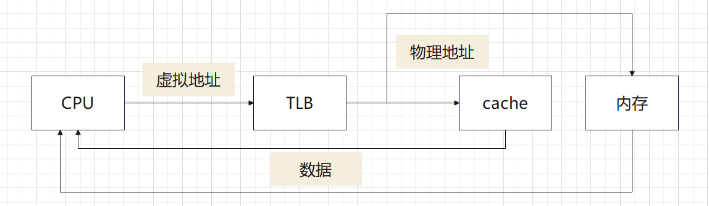

**第一步：CPU发出虚拟地址（VA）**

CPU执行指令（比如 `LOAD R1, [0x7FFF1234]`）时，送出的地址是**虚拟地址（Virtual Address）**。

- 这个地址由两部分组成：**高位数（虚拟页号，VPN）** 和 **低位数（页内偏移，Offset）**。
- **关键**：这个地址不能直接拿去插在内存条上，必须立刻转换。

**第二步：硬件快车道——查询 TLB（快表）**

CPU将虚拟地址发给MMU（内存管理单元）。MMU不会马上去翻内存，而是先查自己内部的**TLB（旁路转换缓冲，即快表）**。

- **情况 A（TLB 命中）**：TLB里正好存着这个“虚拟页号”对应的“物理页框号”。MMU **瞬间（1个时钟周期）** 拿到物理地址，直接跳转到**第四步**。
- **情况 B（TLB 未命中）**：TLB里没找到。MMU只好启动慢速路径，进入**第三步**。

> **注意**：现代CPU中，MMU查询TLB的同时，也会把虚拟地址的“页内偏移”发送给L1 Cache，因为虚实地址的页内偏移是相同的，可以提前准备数据（这称为VIPT并行）。

**第三步：软件/硬件慢车道——查询页表（Page Table）**

当TLB未命中时，MMU需要去**主存（DRAM）** 里查页表。但是，**页表本身也是数据**，它也会经过CPU的L1/L2/L3缓存。

- **MMU动作**：MMU发出读取“页表项（PTE）”的请求。
- **硬件检查**：
  - **如果页表项在L1/L2/L3缓存中**：MMU直接从高速SRAM缓存中拿到PTE，速度较快。
  - **如果页表项不在缓存中**：MMU穿透缓存，去慢速的DRAM（主存）里把页表项取出来。
- **解析PTE**：MMU拿到页表项后，查看其中的**“有效位（Present/Valid Bit）”**。

**第四步：分支判断——页命中 vs 缺页（Page Fault）**

- **路径 1：页命中（有效位 = 1）**
  - 页表项里的物理页框号是有效的。MMU将其取出，**拼上**虚拟地址里的“页内偏移”，组装成完整的**物理地址（PA）**。
  - **同时**，MMU会把这个刚查到的映射关系**加载进TLB**，以备下次快速使用。
  - 拿着物理地址，进入**第五步**。
- **路径 2：缺页中断（有效位 = 0）**
  - 物理页框号无效，说明这个虚拟页被**换出到磁盘（Swap空间）** 了。
  - MMU触发**缺页中断（Page Fault）**，CPU陷入操作系统内核。
  - **操作系统接管**：OS调度磁盘I/O，将数据从硬盘读入内存；如果内存满了，OS会使用我们之前聊的**页面置换算法（如LRU）**踢出一页；最后更新页表，修改有效位为1。
  - **返回**：中断返回，CPU重新执行这条指令。此时，TLB里依然没有映射（或者无效），MMU会重新走一遍第三步，这次页表有效位为1，顺利拿到物理地址。

**第五步：最终数据访问——通过物理地址访问 Cache / DRAM**

MMU最终拿到了合法的**物理地址（PA）**。现在，它要去拿真正的数据（指令或操作数）了：

1. **查 L1 Cache**：CPU将物理地址发给L1缓存（或之前已经并行开始查了）。
2. **命中（Hit）**：数据就在SRAM中，极速返回给CPU，指令执行完毕。
3. **未命中（Miss）**：依次查L2、L3缓存。如果L3也没有，CPU控制器才发起总线请求，去**主存（DRAM）** 里把数据读出来，同时填充各级缓存。

**MMU（Memory Management Unit）**：硬件单元，负责将虚拟地址翻译为物理地址。核心组件是 **TLB（快表）** + **页表基址寄存器**。

##### 4. Cache 与虚存的异同

Cache 和虚拟存储器都是基于**局部性原理**构建的层次存储体系，但位于不同的层次、解决不同的问题：

|     维度     |               Cache               |            虚拟存储器             |
| :----------: | :-------------------------------: | :-------------------------------: |
|   **目标**   |   弥补 CPU 与主存的**速度差距**   |   弥补主存与磁盘的**容量差距**    |
| **层次位置** |          CPU ↔ 主存之间           |          主存 ↔ 磁盘之间          |
| **存储介质** |          SRAM（快、小）           |         主存 DRAM + 磁盘          |
| **传输单位** | **块（Cache Line）**，通常 32~64B |     **页（Page）**，通常 4KB      |
| **速度差距** |     约 10 倍（1ns vs 100ns）      |    约 10⁵ 倍（100ns vs 10ms）     |
| **对程序员** |     **透明**（硬件自动管理）      |     透明（OS + MMU 硬件管理）     |
| **缺失处理** |         硬件完成（调块）          | **OS 软件完成**（缺页中断，调页） |
| **替换算法** |   LRU / FIFO / RAND（硬件实现）   | LRU / CLOCK / OPT（OS 软件实现）  |
|  **命中率**  |               > 95%               |      > 99%（但缺失惩罚极大）      |
| **映射方式** |  直接 / 组相联 / 全相联（硬件）   |  页表映射、TLB 加速（硬件 + OS）  |

**核心相同点**：

- 都依赖**局部性原理**工作——没有局部性，Cache 和虚存都毫无用处
- 都用**层次化映射**结构——Cache 行 ↔ 主存块；虚拟页 ↔ 物理页框
- 都有**替换策略**处理缺失——Cache 用 LRU/FIFO，虚存用 LRU/CLOCK
- 都用**高速缓存加速翻译**——Cache 本身是 SRAM，虚存用 TLB 加速页表查询

**核心不同点**：

- Cache 缺失由**硬件**自动处理；缺页由**操作系统软件**处理（中断机制）
- Cache 传输单位（块，64B）远小于虚存（页，4KB）——因为缺失代价差距大：访问主存 ~100ns，访问磁盘 ~10ms（10 万倍差距！）
- Cache 命中率 95%+，虚存命中率 99%+——因为缺页代价实在太大了，必须有更高命中率

> **总结**：Cache = 速度层次（快慢之间），虚存 = 容量层次（大小之间）。两者解决不同矛盾，但设计思想同出一源——**局部性原理 + 层次化映射 + 按需调入 + 替换策略**。

##### 5. 页表

**页表**是虚拟存储器中最核心的数据结构——记录每个虚拟页是否在主存中，以及对应的物理页框号（或磁盘地址）。

```
PTE (Page Table Entry):
  ┌─────────┬─────────┬─────────┬─────────┬──────────┐
  │valid    │dirty    │access   │perm     │frame no. │
  └─────────┴─────────┴─────────┴─────────┴──────────┘
   │
   └── valid=1 → page in main memory, 0 → Page Fault
   └── dirty → modified? (write back to disk when evicted)
   └── access → accessed? (used by replacement algorithm)
   └── perm → read/write/execute permission
   └── frame no. → if valid=1, physical page frame number
```

> 图：页表项（PTE）格式——有效位 / 脏位 / 访问位 / 权限 / 物理页框号；有效位为 0 表示缺页。


---

#### 二、页式虚拟存储器

##### 1. 基本概念

将**虚拟地址空间**和**物理地址空间**都分成固定大小的**页**（Page）和**页框**（Page Frame，也称页帧）。

- **页**：虚拟地址空间被等分为固定大小的页（如 4KB/页）
- **逻辑页**：虚地址空间被分成**等长大小**的页，被称为逻辑页
- **物理页**：主存也被分成**同样大小**的页，称之为物理页
- **页框**：物理主存被等分为与页相同大小的页框
- **页大小 = 页框大小**，通常 4KB（$2^{12}$ 字节）
- 页的划分对程序员**透明**——程序员看到的是连续的虚拟地址空间

##### 2. 地址映射过程

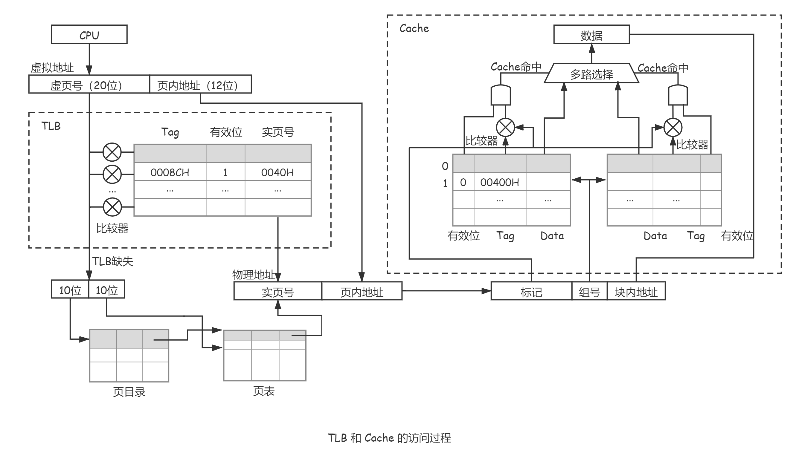

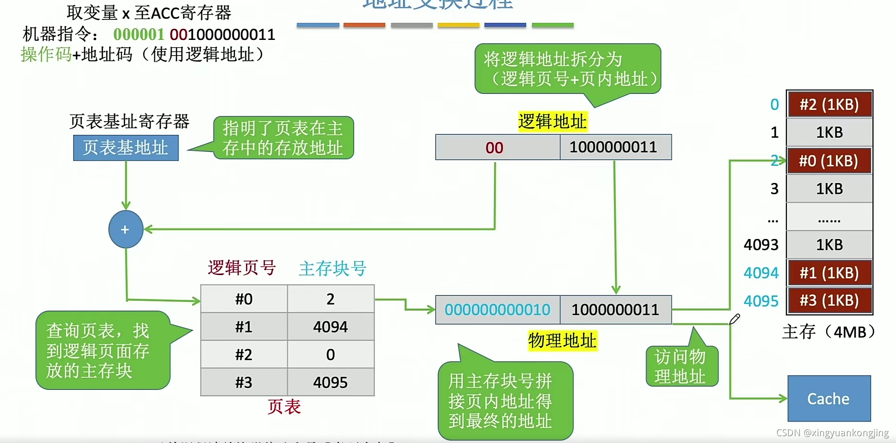

##### 3. 快表（TLB, Translation Lookaside Buffer）

**为什么需要 TLB？** 页表存放在主存中，每次地址翻译都需要访问主存查页表——即使多级页表只查两级，也需 2 次访存。加上最终的数据访存，一次操作可能需要 **3 次访存**，性能极差。

**TLB 的原理**：TLB 是 MMU 内部的**专用高速缓存（SRAM）**，专门缓存最近使用过的页表项。

```
  CPU sends virtual addr
       │
       ▼
  ┌──────────────┐
  │    TLB       │  hit? ── yes ──▶ get frame no. directly (fast, 1 cycle)
  │ (SRAM, small)│
  └──────┬───────┘
         │ no (TLB miss)
         ▼
  ┌──────────────┐
  │ page table   │  look up page table → get PPN, update TLB
  └──────────────┘
```

> 图：TLB（快表）查找流程——命中直接得到物理页框号，未命中则查主存页表并更新 TLB。

**TLB 的条目结构**：

```
TLB entry =
┌──────────┬──────────────────┬────────────────────┐
│valid     │virtual page no.  │physical frame no.  │  (+ protection bits, dirty bit, etc.)
└──────────┴──────────────────┴────────────────────┘
```

> 图：TLB 条目格式——有效位 + 虚拟页号 + 物理页框号。

- **TLB 命中**：虚拟页号匹配 → 直接输出物理页框号，拼接页内偏移 → 物理地址
- **TLB 缺失**：需查主存页表，找到后将对应页表项加载到 TLB

**TLB 的特点**：

| 特性 | 说明 |
|:---|:---|
| **容量** | 很小（通常 32~512 个条目） |
| **相联度** | 通常为**全相联**（或高路组相联）——因容量小，全相联硬件可行 |
| **命中率** | 极高（> 99%），因为页访问具有极强的时间局部性 |
| **缺失处理** | 由硬件（或软件）查页表并填入 TLB |
| **替换算法** | 通常 LRU 或随机（小容量硬件实现简单） |
| **与 Cache 的关系** | TLB 翻译地址在先，Cache 访问在后 → 可**并行**以加速 |

**TLB 与 Cache 的访问流水线**（典型顺序）：

```
虚拟地址 → TLB 翻译 → 物理地址 → Cache 访问 → 命中/缺失处理
```

> 现代 CPU 采用**虚拟索引物理标记（VIPT）**等技术，使 Cache Index 的提取与 TLB 翻译**并行进行**，大幅减少延迟。

**TLB / 页表 / Cache 三级缺失组合判断（教材 3.7.2，常考）**：一次访存中，三者可分别命中/缺失，共 5 种组合：

| 情形 | TLB | 页表（Page） | Cache | 结论 |
|:---:|:---:|:---:|:---:|:---|
| 1 | 命中 | 命中 | 命中 | TLB 免查页表，Cache 命中直接取数（最快） |
| 2 | 命中 | 命中 | 缺失 | 已得物理页框号，仅 Cache 缺失 → 访主存取块 |
| 3 | 缺失 | 命中 | 命中 | 缺 TLB → 查页表得物理页框号；Cache 命中取数 |
| 4 | 缺失 | 命中 | 缺失 | 缺 TLB 查页表 + Cache 缺失 → 访主存 |
| 5 | 缺失 | 缺失 | 缺失 | 缺页中断：OS 调页 → 更新页表/TLB → 重新访存 |

---

##### 4. 多级页表

单级页表太大——32 位系统有 1M 个页表项，每个 4 字节，共占 4MB。且大多数页表项是空的。**多级页表**将页表也分页存储，只将用到的部分调入内存。

```
Two-level page table (32-bit virtual addr):
  31            22 21           12 11        0
 ┌──────────────┬──────────────┬──────────────┐
 │page dir no.  │page table    │page offset   │
 │(10 bits)     │no. (10 bits) │(12 bits)     │
 └──────────────┴──────────────┴──────────────┘
        │              │
        ▼              ▼
  ┌──────────┐  ┌─────────────┐
  │ page dir │─▶│ page table  │  two-level indexing → physical frame no.
  └──────────┘  └─────────────┘
```

> 图：两级页表——32 位虚拟地址划分为页目录号（10 位）、页表号（10 位）、页内偏移（12 位），先查页目录再查页表。

#### 三、段式虚拟存储器和段页式虚拟存储器

##### 1. 段式虚拟存储器

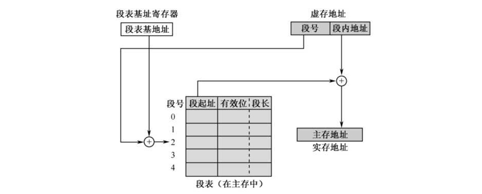

按**程序的逻辑结构**分段（如代码段、数据段、堆栈段），各段长度可变。

**分段地址结构**：

```
virtual addr = segment no. │ offset
```

> 图：段式虚拟地址划分——段号 + 段内偏移。

**段表项**：

```
┌──────────────┬──────────────┬──────────────┐
│valid         │seg length    │segment base  │
└──────────────┴──────────────┴──────────────┘
```

> 图：段表项格式——有效位、段长、段基址。

- **优点**：符合程序逻辑、便于共享和保护（按段设置权限）
- **缺点**：段长不一，易产生**外部碎片**；地址翻译略复杂

##### 2. 段页式虚拟存储器

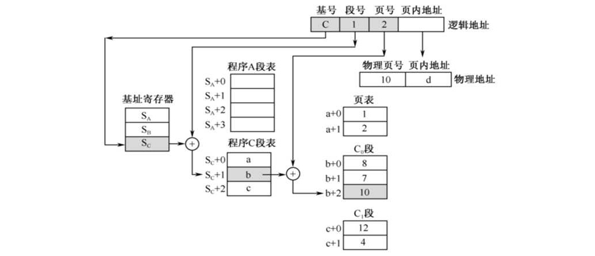

结合段式和页式的优点：先按**逻辑分段**，段内再按**固定大小分页**。

**段页式地址结构**：

```
virtual addr = segment no. │ page in seg │ page offset
```

> 图：段页式虚拟地址划分——段号 + 段内页号 + 页内偏移。

```
  段号
   │
   ▼
 段表 → 该段的页表基址
             │
     段内页号 │
             ▼
           页表 → 物理页框号 + 页内偏移 → 物理地址
```

| 特性 | 页式 | 段式 | 段页式 |
|:---|:---|:---|:---|
| 划分依据 | 固定大小（硬件） | 逻辑结构（软件） | 逻辑分段 + 段内分页 |
| 碎片 | 内部碎片 | 外部碎片 | 内部碎片 |
| 共享/保护 | 不方便 | 方便 | 方便 |
| 地址翻译 | 1 次查表 | 1 次查表 | **2 次查表**（段表+页表） |
| 实际使用 | 现代 OS 主流 | 很少单独使用 | Intel x86 曾经使用 |

---

#### 四、虚存的替换算法

当物理内存已满且需要调入新页面时，由 OS 选择一个页面替换出去。

| 算法 | 规则 | 特点 |
|:---|:---|:---|
| **OPT（最佳置换）** | 替换未来最久不再使用的页 | 理论最优，但无法实现（无法预知未来） |
| **FIFO** | 替换最早调入的页 | 简单，但可能替换常用页（Belady 异常） |
| **LRU** | 替换最久未使用的页 | 接近最优，但硬件成本高（需记录时序） |
| **LFU** | 替换历史上访问次数最少的页 | 适合访问频率稳定场景，但新页易被淘汰 |
| **CLOCK（NRU）** | 环形扫描，找"未访问"页 | **实际主流**——LRU 的硬件近似 |

- Cache 的替换通过**硬件**实现，而虚存的替换依靠**操作系统（软件）**支持
- 虚存缺页的影响远大于cache未命中，因为虚存需要访问辅存，并且进行任务切换
- 虚存页面替换的选择余地很大，属于一个进程的页面都可以替换
- LFU 需每页维护计数器记录访问次数，替换时选计数值最小的页——缺点是刚调入的新页可能立即被淘汰（"旧数据霸占"）

**CLOCK 算法示例**：

```
页表项中有一"访问位 A"：CPU 访问该页时置 1，OS 替换时清 0

  指针顺时针扫描：
  [A=1]→[A=1]→ ...  遇到 A=1 → 清 0，继续扫描
                       遇到 A=0 → 替换该页

  类似"钟表指针"旋转，被访问过的页得到"第二次机会"。
```

> **Belady 异常**：FIFO 算法中，增加物理页框数反而可能导致缺页次数增加（违反了直觉）。LRU 和 OPT 不会出现 Belady 异常。


---

### （八）本章总结

**知识结构图**：

```
第三章 多层次的存储器
│
├── （一）存储器概述
│   ├── 一、存储器的分类（按介质 / 存取方式 / 作用）
│   ├── 二、存储器的分级（层次结构 + 局部性 + EAT = H·T_hit+(1−H)·T_miss）
│   ├── 三、主存储器的技术指标（容量 / T_a / T_m / 带宽）
│   ├── 四、存储器与 CPU 的连接（3 总线 + 位/字/字位扩展）
│   └── 五、内存条（DIMM / DDR / SPD）
│
├── （二）SRAM 存储器
│   ├── 一、静态存储元阵列（三组信号线 / 6T 结构）
│   ├── 二、SRAM 逻辑结构（双译码 + 32K×8 = 256×128×8 位 / CS#/WE#/OE#）
│   └── 三、读/写周期波形图（t_AQ / t_EQ / t_GQ / t_SA / t_WD / t_hD）
│
├── （三）DRAM 存储器
│   ├── 一、存储元记忆原理（1T1C / 破坏性读出 / 刷新机制）
│   ├── 二、四种工作状态（写1 / 写0 / 读1 / 刷新读后再生）
│   ├── 三、芯片逻辑结构（RAS#/CAS# 分时复用 / 灵敏放大器）
│   ├── 四、读/写/刷新周期（集中死区 64μs、死时间率 3.2% / 异步隔 15.625μs 刷一行）
│   ├── 五、容量扩充（芯片数 = 内存容量/芯片容量；字位扩 = (M/L)×(N/K)）
│   └── 六、SRAM vs DRAM 9维度对比（6T vs 1T1C / 刷新 / 地址送入）
│
├── （四）只读存储器和闪速存储器
│   ├── 一、ROM（MROM→PROM→EPROM→EEPROM→Flash 演进）
│   ├── 二、FLASH（NOR 可 XIP vs NAND 高密度）
│   └── 三、SSD（按页读写/按块擦除 / 垃圾回收 / 磨损均衡 / 写放大）
│
├── （五）并行存储器
│   ├── 一、双端口存储器（两套独立端口 / 访问冲突处理）
│   └── 二、多模块存储器
│       ├── 1. 多模块存储器的结构（高位/低位交叉编址对比）
│       ├── 2. 单体多字存储器（一次读多字 + 带宽公式）
│       └── 3. 多体并行存储器（低位交叉 + 流水线访问时序图）
│
├── （六）Cache 存储器
│   ├── 一、基本原理
│   │   ├── 1. 功能（弥补速度差距 / 利用局部性）
│   │   ├── 2. 基本原理（CPU↔Cache 按字 / Cache↔主存 按块 / 读流程）
│   │   └── 3. 命中率与平均访问时间（H = N_c/(N_c+N_m) + T_avg 公式）
│   ├── 二、地址映射
│   │   ├── 1. 直接映射（公式 + 位宽计算示例 + 优缺点表）
│   │   ├── 2. 全相联映射（CAM 并行比较 + 流程示例）
│   │   ├── 3. 组相联映射（组间直接+组内全相联 / 地址字段 Tag·s+组号·d+偏移·w 反推）
│   │   └── 4. 三种方式总结表（7 维度对比）
│   ├── 三、替换策略（LRU / FIFO / RAND / LFU / 伪LRU）
│   └── 四、写策略（写回/写直达/写一次法 + 写分配/非写分配 + 写缓冲器）
│
└── （七）虚拟存储器
    ├── 一、基本概念（虚拟/物理地址 / MMU / 页表 / 缺页 / 工作流程）
    │   └── 4. Cache 与虚存的异同（11 维度对比表 + 核心异同总结）
    ├── 二、页式虚拟存储器
    │   ├── 1. 基本概念（页/页框 / 地址翻译流程）
    │   ├── 2. 地址翻译过程（VPN + Offset → PPN + Offset）
    │   ├── 3. 快表 TLB（SRAM 缓存页表项 / TLB-页-Cache 三级缺失组合 / 与 Cache 关系）
    │   └── 4. 多级页表（两级页表索引 + 地址结构）
    ├── 三、段式和段页式（分段逻辑 / 段内分页 / 页/段/段页式对比表）
    └── 四、虚存的替换算法（OPT / FIFO / LRU / LFU / CLOCK / Belady异常）
```

**高频考点速记**：

| 考点 | 一句话记忆 |
|:---|:---|
| 存储器层次结构 | 越往上**速度越快、容量越小、价格越高**，相邻层次靠**局部性原理**工作 |
| 局部性原理 | **时间局部性**=刚访问的很快再访问（循环）；**空间局部性**=相邻数据将被访问（数组遍历） |
| 命中率与平均访问时间 | 命中率 **H = Nc/(Nc+Nm)**；平均访问时间 **Tavg = H×Tc + (1−H)×Tm**（H=95% 时远快于直接访存） |
| 主存技术指标 | 容量=单元数×**字长**；**存取周期 Tm > 存取时间 Ta**（需恢复/预充电）；带宽 **Bm = W/Tm** |
| 存储器与 CPU 连接 | 地址总线**单向**定寻址范围、数据总线**双向**定字长、控制总线传读写信号 |
| 芯片容量扩展 | 位数=并联 **芯片数=内存容量/芯片容量**；字位扩先位后字=(M/L)×(N/K)（16K×4→16K×8 用 2 片） |
| 内存条 | SIMM 32 位→DIMM **64 位**；**DDR 双沿传输**，数据传输率=内存时钟频率×2 |
| SRAM | **6T 触发器**，不需刷新、地址一次送入、速度快成本高 → 做 **Cache** |
| DRAM | **1T1C 电容**存电荷，**破坏性读出**需读后重写，**2ms 内必须刷新** → 做**主存** |
| DRAM 地址 | **RAS#/CAS# 分时复用**，先锁行地址再锁列地址，省引脚 |
| 三种刷新方式 | **集中**死区=行数×存取周期（64μs）、死时间率 3.2%；**分散**无死区但周期长；**异步**隔 2ms/行数=15.625μs 刷一行 |
| ROM 演进 | MROM→PROM（熔丝）→EPROM（**紫外线**擦除）→EEPROM（**电擦除**）→Flash（**按块擦除**） |
| NOR vs NAND | **NOR 可 XIP** 就地执行；**NAND 按页读写按块擦除**、密度高 → SSD/U 盘 |
| SSD 核心技术 | 按页读写、按块擦除；**垃圾回收**搬有效页、**磨损均衡**均分擦写、**写放大**=实际写>用户写 |
| 双端口存储器 | 两套独立端口可并行；同地址**写冲突**靠 BUSY# 仲裁，一读一写值不确定 |
| 多模块编址 | **高位交叉**模块内地址连续（独立任务）；**低位交叉**连续地址跨模块（流水访问） |
| 单体多字 vs 多体 | 单体多字只加宽数据通路不增模块；多体并行靠多个模块并行提高带宽 |
| Cache 传送单位 | **CPU↔Cache 按字**，**Cache↔主存按块**——利用空间局部性一次调入多字 |
| 直接映射 | 行号=块号 **mod 行数**；仅 1 个比较器；多块争一行互相淘汰（**抖动**） |
| 全相联映射 | 可放任意行；**CAM 并行比较全部 Tag**，冲突缺失最少但成本极高（仅用于 TLB） |
| 组相联映射 | 组号=块号 **mod 组数**、组内任意；由容量/块大小/路数**反推 Tag/组号/偏移位数**是 408 常考 |
| 地址字段位数 | 块内偏移=log2(块大小)；组号=log2(组数)；**Tag=地址总位数−偏移−组号** |
| 替换算法 | RAND/FIFO/伪LRU 成本低；**LRU 命中率最高**；**LFU 按累计频率**、新页易被淘汰（旧数据霸占） |
| 写策略 | 黄金组合=**写回+写分配**；写回靠**脏位**标记、块被替换才写主存，配**写缓冲器**减阻塞；另有**写一次法**（首次写命中写直达，之后写回） |
| Cache 与虚存 | 同为速度/容量层次，局部性+映射+替换同源；Cache 缺失**硬件**调块 vs 缺页**OS 中断**调页 |
| 页式虚存 | 页=页框（4KB）；地址=**VPN+页内偏移 → PPN+页内偏移**；页表项含有效位/脏位/页框号 |
| TLB 快表 | MMU 内 **SRAM** 缓存页表项，全相联、命中率>99%；命中免查页表；**TLB/页表/Cache 三级缺失组合判断**（5 种）是常考 |
| 多级页表 | 页表分页、按需调入；两级结构=**页目录号+页表号+页内偏移**（32 位取 10+10+12） |
| 段式与段页式 | 段式按逻辑分段、**外部碎片**、便于共享；段页式**2 次查表**（段表+页表）、内部碎片 |
| 虚存替换算法 | **OPT 理论最优不可实现**；**FIFO 有 Belady 异常**（加页框反增缺页）；**CLOCK 实际主流**近似 LRU |
