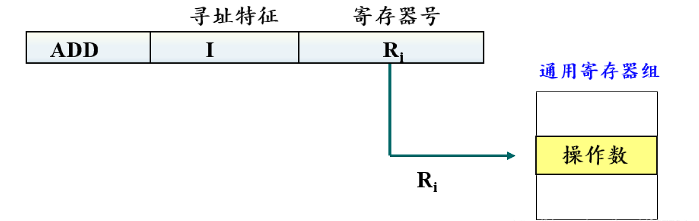
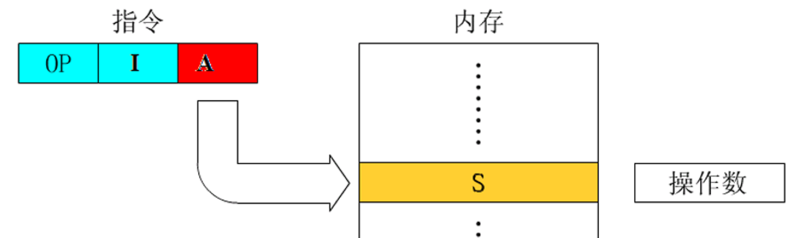
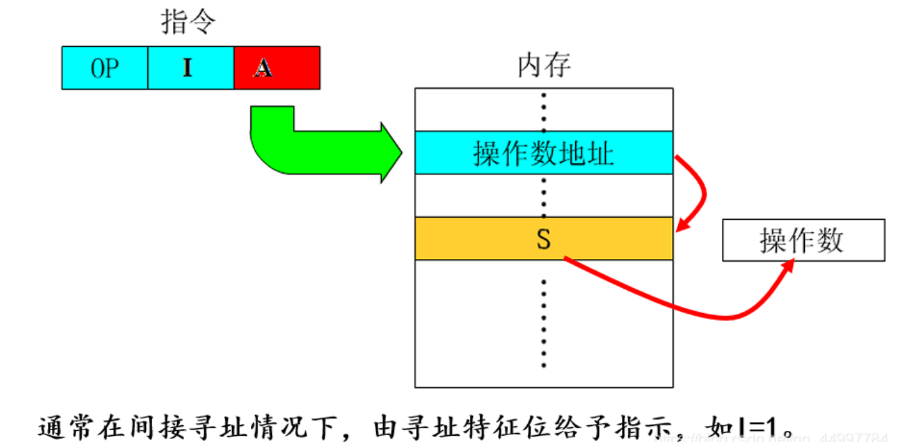
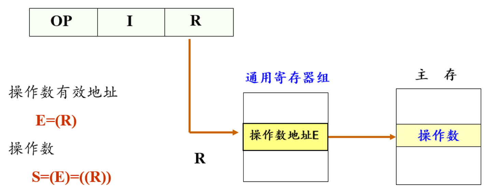

<h2 align="center">第四章 指令系统</h2>

> **408 高频考点提醒**：
>
> **指令基础**
> - 微指令（硬件/微程序级）→ 机器指令（ISA 分界面）→ 宏指令（软件/多条机器指令组成）
> - ISA = 软件与硬件接口/契约——同一 ISA 可有多样硬件实现（Intel vs AMD）
> - 定长操作码（译码简单/指令数受限）vs 扩展操作码（用短码表示高频指令）
> - 二地址（x86，结果覆盖源）vs 三地址（RISC，结果独立寄存器）代码对比
>
> **寻址方式（10 种，408 重点）**
> - 访存次数：立即/寄存器=0 → 寄存器间接/直接/变址/基址/相对=1 → 间接=2
> - EA 公式：变址 EA=(IX)+A（数组）/ 基址 EA=(B)+A（重定位）/ 相对 EA=(PC)+A（PIC）
> - 立即/寄存器（无访存）→ 直接（一次访存）→ 间接（两次访存）
> - 变址与基址的区别：变址用于数组遍历（IX 可变），基址用于程序重定位（B 固定）
>
> **CISC vs RISC**
> - 10 维度：指令数/长度/寻址/控制器/寄存器数/Load-Store/编译/流水线
> - CISC: 变长/微程序/任意指令可访存；RISC: 定长/硬布线/仅 Load-Store 访存
> - 现代 CPU 融合趋势：x86 内部译码为 μOPs（类 RISC），ARM 增加复杂指令
>
> **高级语言 ↔ 机器代码**
> - 栈帧（低地址→高地址）：saved ESI/EDI → 局部变量 → **saved EBP（EBP 帧指针）** → 返回地址 → 入口参数；**ESP 栈顶**；CALL 压返回地址，RET 弹回
> - x86-64 调用约定：前 6 参数（RDI/RSI/RDX/RCX/R8/R9），返回值 RAX
> - if-else → CMP + 条件跳转（JE/JLE/…）+ JMP 跳过 else 分支
> - switch → 跳转表（JMP table[x]），O(1) 而非 O(n) 分支
> - while/for → 条件判断（CMP + Jxx）→ 循环体 → JMP 回到条件
> - 算术逻辑指令：结果写回**第一个操作数**；乘除隐含 **DX:AX**（乘：结果；除：被除数，**商→AX、余→DX**）
> - **IMUL/IDIV 带符号**（教材只讲这两条）、MUL/DIV 无符号；**NOT 翻位 / NEG 取负**别混
> - 数据传送：MOV **不能内存→内存**（源可为立即数、目的不能是立即数）；PUSH 先减栈指针再存、POP 先取再加
> - 控制转移：Jcc 看状态字条件码（**有符号 JG/JGE/JL/JLE、无符号 JA/JB**），须与 CMP/TEST 配对；**CALL 压下一条指令地址、RET 弹出**

---

### （一）指令系统的发展与性能要求

#### 一、指令系统的发展

##### 1. 指令系统的基本概念

**指令**：就是要计算机执行某种操作的命令。从计算机组成的层次结构来说，计算机的指令分为三类：

| 类型 | 所属层次 | 含义 | 特点 |
|:--:|:--:|:---|:---|
| **微指令** | **硬件**（微程序级） | 微程序级的命令，控制最基本的硬件操作（如打开某寄存器、ALU 做加法） | 由硬件执行，一条机器指令 = 多条微指令 |
| <nobr>**机器指令**<nobr> | <nobr>**软硬件分界面**（ISA）<nobr> | 通常简称为**指令**，每一条可完成一个独立的算术运算或逻辑操作 | CPU 直接识别和执行的基本单元 |
| **宏指令** | **软件** | 由若干条机器指令组成的软件指令 | 一条宏指令展开为多条机器指令（如宏定义） |

> **指令系统**：一台计算机中**所有机器指令的集合**，是这台计算机的指令系统（ISA）。微指令和宏指令都不是 ISA 的一部分。

**三者关系**：

```
宏指令（软件）
  │ 展开（汇编器）
  ▼
机器指令（ISA，软硬件分界）
  │ 译码（控制器）
  ▼
微指令（硬件，CPU 内部）
  │ 控制
  ▼
硬件电路执行
```

##### 2. 指令系统的含义

**指令系统（Instruction Set Architecture, ISA）** 是一台计算机所能执行的全部指令的集合，是软件与硬件之间的**接口/契约**。

- 软件通过指令"告诉"硬件该做什么
- 硬件（CPU）按照指令系统的规定来设计和实现执行逻辑
- 同一指令系统可以有不同的硬件实现（微架构）——例如 Intel 和 AMD 都实现了 x86 指令系统

##### 3. 指令系统的发展阶段

| 阶段 | 特征 | 代表 |
|:--:|:---|:---|
| **早期简单指令** | 指令少、格式简单、寻址方式单一 | 早期计算机（EDVAC、IBM 701） |
| **CISC 时代** | 指令越来越多、越来越复杂，接近高级语言 | IBM System/360、VAX-11 |
| **RISC 兴起** | 精简指令，固定长度，Load/Store 架构 | MIPS、SPARC、ARM |
| **现代融合** | RISC 为核、CISC 向前兼容（微码翻译） | x86-64（CISC 外壳 + RISC 内核） |

##### 4. 指令系统的核心组成

```
指令系统
├── 指令格式（操作码 + 地址码）
├── 寻址方式（如何找到操作数）
├── 操作类型（算术/逻辑/转移/数据传输等）
├── 寄存器组织（通用寄存器 / 专用寄存器）
└── 数据类型（整数 / 浮点 / 向量等）
```

##### 5. 从计算机层次结构看指令系统

指令系统处于计算机层次结构中**软件与硬件的分界面**。从不同层次往下看，指令系统扮演的角色不同：

```
  ┌──────────────────────────┐
  │ high-level lang (C/Java) │  written by programmers
  ├──────────────────────────┤
  │ assembly lang (mnemonic) │  symbolic machine instructions
  ├──────────────────────────┤  ← software
  │   instruction set (ISA)  │  ← ★ software-hardware interface ★
  ├──────────────────────────┤  ← hardware
  │ microprogram / hardwired │  implementation of instructions
  ├──────────────────────────┤
  │  digital logic circuit   │  gates, registers
  └──────────────────────────┘
```

图：计算机层次结构——自上而下依次为高级语言、汇编语言、指令系统（ISA，软硬件分界面）、微程序/硬布线控制器、数字逻辑电路。

**从层次结构看指令系统的分类**：

| 分类维度 | 类型 | 含义 | 示例 |
|:--:|:--:|:---|:---|
| <nobr>**按抽象层次**</nobr> | 机器指令 | CPU 直接执行的二进制指令（ISA 定义） | x86、ARM、RISC-V 指令 |
| | 汇编指令 | 机器指令的助记符表示（一对一映射） | MOV、ADD、JMP |
| | 伪指令 | 汇编器提供的"假指令"，翻译时展开为多条机器指令 | LI（Load Immediate，展开为 LUI+ADDI） |
| | 宏指令 | 用户自定义的一组指令的缩略表示 | 宏定义宏调用 |
| **按实现方式** | <nobr>微程序实现</nobr> | CISC 常见——用微指令序列"模拟"复杂指令 | x86 的复杂指令 |
| | 硬布线实现 | RISC 常见——每条指令直接对应一组硬件控制信号 | MIPS、ARM |

> **关键理解**：ISA 是"契约"——上层软件只看到 ISA 定义的指令，下层硬件可以自由选择实现方式。这就是为什么同一套 x86 指令系统，Intel 和 AMD 内部硬件结构可以完全不同。

---

#### 二、对指令系统性能的要求

| 要求 | 说明 |
|:--:|:---|
| **完备性** | 指令种类足够支撑各种编程需求（算术、逻辑、控制转移、数据传输） |
| **有效性** | 常用功能用硬件直接实现，执行速度快 |
| **规整性** | 指令格式统一、操作码和地址码位置固定（利于译码和流水线） |
| **兼容性** | 向后兼容——老版本程序能在新处理器上运行（x86 的核心要求） |
| **可扩充性** | 保留操作码空间，支持后续增加新指令 |

---

### （二）指令格式

```
┌─────────────┬───────────────┐
│    opcode   │ address code  │
└─────────────┴───────────────┘
```

图：指令的基本格式——由操作码字段和地址码字段组成。

指令格式规定了指令的二进制编码方式——操作码、地址码各自占多少位、如何排列。

#### 一、操作码

**操作码（Opcode）** 指明指令要做什么操作（加/减/与/跳转等）。

##### 1. 定长操作码

所有指令的操作码**位数相同**，放在固定位置。

- **优点**：硬件译码简单、速度快（适合 RISC、流水线）
- **缺点**：操作码长度固定，指令种类受限于操作码位数（$n$ 位操作码 → 最多 $2^n$ 条指令）

**示例**：MIPS 指令均为 32 位，操作码固定 6 位（最多 64 条指令）。

##### 2. 扩展操作码（变长操作码）

操作码长度可变，**短的给常用指令、长的给不常用指令**。

- **优点**：用短操作码表示有限的高频指令，其余低频指令用长操作码——在有限指令字长内装下更多指令种类
- **缺点**：硬件译码复杂

**示例**：16 位指令字长，先分 4 位操作码，若不够用则"借"后续位扩展：

```
4位操作码: 0000~1110 → 15 条指令 (4位操作码)
          1111 xxxx → 16 条扩展指令 (8位操作码)
```

**完整算例**（教材页 100–101）：16 位指令字长，操作码 4 位 + A1/A2/A3 各 4 位；若三地址指令需 15 条、二地址 15 条、一地址 15 条、零地址 16 条（共 61 条），操作码需逐级向地址码字段扩展：

```
三地址(15条)  OP(4位)  A1  A2  A3    0000~1110 → 剩 1111 扩展 A1 (4→8位)
二地址(15条)  OP(8位)      A2  A3    11110000~11111110 → 剩 11111111 扩展 A2 (8→12位)
一地址(15条)  OP(12位)         A3    111111110000~111111111110 → 剩全1扩展 A3 (12→16位)
零地址(16条)  OP(16位)               1111111111110000~1111111111111111
```

> 推广：**扩展操作码**——先用全部码点装下高频指令，再留"全 1"码点逐级借下一地址字段继续扩展；每一级用"去掉全 1 码点"后的编码作指令，末级可用满全部码点。本例借 3 次、每次 4 位，共 15+15+15+16 = **61 条**。

---

#### 二、地址码

**地址码**指明操作数的来源（和结果的去处）。根据一条指令中地址码的个数，分类如下：

| <nobr>指令格式</nobr> | <nobr>地址码数量</nobr> | 格式 | 特点 |
|:---:|:---|:---|:---|
| **零地址** | 0 | OP | 无操作数（NOP、HALT）或隐含操作数（栈操作 PUSH/POP） |
| **一地址** | 1 | OP A | 单操作数（INC A、NOT A）或隐含累加器（ADD A → ACC←ACC+A） |
| **二地址** | 2 | OP DST, SRC | DST ← DST OP SRC（最常用，如 x86: ADD AX, BX） |
| **三地址** | 3 | OP DST, SRC1, SRC2 | DST ← SRC1 OP SRC2（RISC 主流，如 MIPS: ADD R1, R2, R3） |
| **四地址** | 4 | OP DST, SRC1, SRC2, NEXT | 增加下一条指令地址（早期大型机，现代已不用） |

> **二地址按操作数物理位置分类**（教材 4.2.2）：**SS**（存储器-存储器）、**RS**（寄存器-存储器）、**RR**（寄存器-寄存器）。

**二地址 vs 三地址对比**：

```
计算 C = A + B：

  二地址指令（x86风格）：     三地址指令（MIPS风格）：
  MOV  AX, A                  ADD  R1, R2, R3
  ADD  AX, B                  (一条指令完成，但需3个寄存器)
  MOV  C, AX
  (需3条指令)
```

---

#### 三、指令字长度

| 类型 | 特征 | 优点 | 缺点 | 代表 |
|:--:|:---|:---|:---|:---|
| <nobr>**定长指令**</nobr> | 所有指令长度相同 | 译码简单、流水线友好 | 代码密度低、浪费空间 | MIPS（32位）、ARM（32位，Thumb除外） |
| **变长指令** | 不同指令长度可不同 | 代码密度高（常用指令短） | 译码复杂、流水线难控制 | x86（1~15 字节） |
| **半定长** | 有几种固定长度 | 折中 | — | RISC-V（16/32位压缩指令） |

> **单字长 / 半字长 / 双字长**（教材 4.2.3，按指令字长与机器字长的相对关系划分）：
> - **单字长指令**：一个指令字 = 一个机器字。
> - **半字长指令**：指令字长 = 半个机器字，**存储空间省但寻址范围小**。
> - **双字长指令**：指令字长 = 两个机器字。
> - **多字长指令的优点**：提供足够的地址位，能**寻址内存任意单元**（寻址范围大）。
> - **多字长指令的缺点**：必须**两次或多次访问内存以取出一整条指令**，降低 CPU 运算速度，且**占用更多存储空间**。

---

### （三）操作数类型

> 本节大纲标注"略"，仅简述 408 可能需要的基础概念。

操作数的类型决定了硬件如何解释和运算二进制位串：

| 类型 | 长度 | 说明 |
|:---|:---|:---|
| **整数** | 8/16/32/64 位 | 有符号（补码）/ 无符号 |
| **浮点数** | 32/64 位 | IEEE 754 单精度/双精度 |
| **字符** | 8/16 位 | ASCII / Unicode |
| **位串** | 任意 | 逻辑运算中的纯位操作 |
| **向量** | 多字 | SIMD 指令集（如 SSE、AVX、NEON） |

---

### （四）指令和数据的寻址方式

#### 一、指令的寻址方式

指令寻址解决"**下一条指令在哪**"的问题。

##### 1. 顺序寻址

PC（程序计数器）自动递增，指向下一条指令地址。这是最基本的指令寻址方式。

```
当前指令地址 = PC
PC ← PC + 指令长度
取下一条指令
```

##### 2. 跳跃寻址（转移寻址）

当遇到跳转/调用/返回指令时，PC 不是简单递增，而是被设置为**目标地址**。

| 跳转类型 | 原理 | 指令示例 |
|:---|:---|:---|
| **无条件跳转** | PC ← 目标地址 | JMP / B |
| **条件跳转** | 若满足条件则 PC ← 目标地址 | JE / BEQ |
| **子程序调用** | 保存返回地址，PC ← 子程序入口 | CALL / JAL |
| **返回** | PC ← 保存的返回地址 | RET / JR RA |

---

#### 二、操作数基本寻址方式

操作数寻址解决"**操作数在哪里**"的问题。

##### 1. 隐含寻址（Implied）

操作数位置由指令**隐含约定**，不需要显式给出地址。

```
例：PUSH AX  → 操作数 AX 隐含，"目的地"栈顶也隐含
    CLC      → 隐含操作 CF 标志位（清进位标志）
```

##### 2. 立即寻址（Immediate）

操作数**直接放在指令中**。

```
例：ADD AX, 5  →  操作数 5 就在指令字段里
    特征：不需访存，速度快，但操作数大小受指令字段长度限制
```


##### 3. 寄存器直接寻址（Register Direct）

操作数在**寄存器**中，指令给出寄存器编号。

```
例：ADD AX, BX  →  AX 和 BX 都是寄存器
    特征：不需访存，速度快，寄存器数量有限
```



##### 4. 直接寻址（Direct）

指令中的地址字段 = 操作数的**有效地址（EA）**。

```
例：ADD AX, [1000H]  →  EA = 1000H，访存地址 1000H
    特征：一次访存，地址空间受限于地址字段位数
```



##### 5. 间接寻址（Indirect）

指令中的地址字段 = 存放操作数地址的**存储单元的地址**，需**两次访存**。

```
例：ADD AX, (BX)  →  EA = [BX]，然后再从 EA 处取操作数
    特征：可扩大寻址范围，但两次访存速度慢
```



##### 6. 寄存器间接寻址（Register Indirect）

操作数的地址在**寄存器**中，指令给出寄存器编号。

```
例：ADD AX, [BX]  →  EA = BX，访存地址 = BX 的值
    特征：一次访存，寻址范围 = 寄存器位宽（可访问全部地址空间）
```



##### 7. 变址寻址（Indexed）

**EA = 变址寄存器 IX 的内容 + 指令中的形式地址 A**，适合数组访问。

```
例：ADD AX, [SI + 1000H]  →  EA = SI + 1000H
    典型用法：SI 指向数组基址，A 是偏移 → 遍历数组元素
```

##### 8. 基址寻址（Based）

**EA = 基址寄存器 B 的内容 + 指令中的形式地址 A**，适合多道程序/重定位。

```
例：ADD AX, [BX + 10H]  →  EA = BX + 10H
    典型用法：BX 存放段的基地址，A 是段内偏移 → 实现程序重定位
```

##### 9. 相对寻址（PC-Relative）

**EA = PC 的内容 + 指令中的偏移量**，适合转移指令。

```
例：JE  +8  →  若条件满足，EA = 当前PC + 8，跳转到下8字节处
    特征：位置无关代码（PIC），程序加载到任意位置都能正确跳转
```

##### 10. 堆栈寻址（Stack）

操作数在**栈顶**，隐含使用栈指针 SP。

```
例：PUSH AX → SP←SP-2, [SP]←AX;  POP BX → BX←[SP], SP←SP+2
    特征：后进先出（LIFO），适合嵌套调用和表达式求值
```

##### 11. 各寻址方式速度对比

| 寻址方式 | 有效地址 EA | 访存次数 | 速度 | 典型应用 |
|:---|:---|:---:|:---:|:---|
| 立即寻址 | 操作数在指令中（无 EA） | 0 | 最快 | 常量操作 |
| 寄存器直接 | 寄存器编号（无 EA） | 0 | 最快 | 寄存器间运算 |
| 寄存器间接 | EA = (R) | **1** | 快 | 指针访问 |
| 直接寻址 | EA = A | **1** | 快 | 全局变量 |
| 变址寻址 | EA = (IX) + A | **1** | 快 | 数组遍历 |
| 基址寻址 | EA = (B) + A | **1** | 快 | 程序重定位 |
| 相对寻址 | EA = (PC) + A | **1** | 快 | 转移指令 |
| 间接寻址 | EA = (A) | **2** | 慢 | 指针的指针 |
| 堆栈寻址 | EA = (SP) | 1（+SP修改） | 较快 | 函数调用 |

#### 三、综合例题（16 位字长：指令格式 + 寻址方式 + 机器码）

> 本例题把指令格式、寻址方式与机器码编码串成一条线，属 408 高频大题。（教材 4.4 例，页 105–106）

**题目**：某计算机字长 16 位，主存地址空间大小为 128 KB，按字编址；采用单字长指令格式，指令各字段定义如下：

```
15   12 11    6 5     0
OP   Ms  Rs   Md  Rd    ← OP=操作码(4位); Ms/Md=寻址方式(各3位); Rs/Rd=寄存器号(各3位)
```

寻址方式定义：

| Ms/Md | 寻址方式 | 助记符 | 含义 |
|:---:|:---|:---|:---|
| 000B | 寄存器直接 | Rn | 操作数=(Rn) |
| 001B | 寄存器间接 | (Rn) | 操作数=((Rn)) |
| 010B | 寄存器间接、自增 | (Rn)+ | 操作数=((Rn))，(Rn)+1→Rn |
| 011B | 相对 | D(Rn) | 转移目标地址=(PC)+(Rn) |

请回答：
（1）该指令系统最多有多少条指令？最多有多少个通用寄存器？MAR、MDR 至少各多少位？
（2）转移指令的目标地址范围是多少？
（3）若操作码 0010B 表示加法（助记符 add），R4/R5 编号分别为 100B/101B；R4=1234H、R5=5678H；内存 1234H 单元内容=5678H、5678H 单元内容=1234H。则汇编语句 `add (R4), (R5)+` 的机器码是什么（用十六进制表示）？该指令执行后哪些寄存器和存储单元会改变？改变后的内容是什么？

**解**：

（1）OP 4 位 → 最多指令数 = $2^4$ = **16 条**；Rs/Rd 各 3 位 → 最多通用寄存器数 = $2^3$ = **8 个**。主存按字编址、字长 16 位=2 字节，主存字数 = 128KB/2B = 64K = $2^{16}$ 单元，故 **MAR 至少 16 位**；数据字长 16 位，故 **MDR 至少 16 位**。

（2）相对寻址目标地址 = (PC) + (Rn)，Rn 为 16 位寄存器，故目标地址范围 **0000H～FFFFH**。

（3）`add (R4), (R5)+`：源 (R4) 为寄存器间接 → Ms=001B、Rs=100B；目的 (R5)+ 为寄存器间接自增 → Md=010B、Rd=101B；OP=0010B。
　　机器码 = `0010 001 100 010 101B` = **2315H**。
　　执行：源操作数 = M[R4] = M[1234H] = 5678H；M[R5] = M[5678H] = 1234H；5678H+1234H = **68ACH** 存入 M[R5] = M[5678H]，同时 **R5 自增 → 5679H**。
　　结论：执行后 **R5 = 5679H**、内存 **5678H 单元 = 68ACH**；R4 与该指令本身不变。

---

### （五）典型指令

#### 一、指令的分类

| 类别 | 功能 | 典型指令 |
|:---|:---|:---|
| **数据传送类** | CPU↔内存、寄存器之间搬运数据 | MOV, LOAD, STORE, PUSH, POP |
| **算术运算类** | 定点算术运算 | ADD, SUB, MUL, DIV, INC, DEC |
| **逻辑运算类** | 按位逻辑操作 | AND, OR, NOT, XOR, SHL, SHR |
| **程序控制类** | 改变执行流 | JMP, JE/JZ, CALL, RET, INT |
| **输入输出类** | 与外设交换数据 | IN, OUT |
| **处理器控制类** | 控制 CPU 状态 | CLC, STC, CLI, NOP, HALT |

---

#### 二、CISC 和 RISC 的基本概念


##### 1. CISC（Complex Instruction Set Computer）

**复杂指令集计算机**：指令数量多、功能复杂、长度可变、一条指令可完成多步操作。

| 特性 | 说明 |
|:---|:---|
| 指令数量 | 多（一般大于 200 条） |
| 指令长度 | **可变**（1~15 字节，x86） |
| 寻址方式 | 多种（10+ 种） |
| 指令执行时间 | 差异大（简单指令 1 拍，复杂指令几十拍） |
| 硬件实现 | 微程序控制器为主（便于复杂指令实现） |
| 编译器设计 | **容易**——复杂指令贴近高级语言 |
| 代表 | x86/x86-64、Motorola 68000 |

##### 2. RISC（Reduced Instruction Set Computer）

**精简指令集计算机**：指令数量少、格式统一（定长）、每条指令功能简单，强调 Load/Store 架构。

| 特性 | 说明 |
|:---|:---|
| 指令数量 | 少（通常不足 100 条，MIPS/ARM 约几十条） |
| 指令长度 | **固定**（32 位，MIPS/ARM） |
| 寻址方式 | 少（通常只有立即、寄存器、Load/Store 间接） |
| 指令执行时间 | 统一（绝大多数 1 个时钟周期） |
| 硬件实现 | **硬布线控制器**为主（简单指令适合硬布线） |
| 编译器设计 | 较难——编译器需要做更多优化 |
| 代表 | MIPS、ARM、RISC-V、PowerPC |

**Load/Store 架构**：RISC 的核心特征——只有 Load/Store 指令可以访问内存，所有算术逻辑运算都在寄存器之间进行。

```
CISC:  ADD [1000H], AX   → 直接把内存值加上寄存器值（访存+运算一条指令）
RISC:  LOAD R1, [1000H]  → 先从内存装入寄存器
       ADD  R2, R2, R1   → 再在寄存器间做运算
```

##### 3. CISC vs RISC 对比总结

| 维度 | CISC | RISC |
|:---|:---|:---|
| 指令数量 | 多 | 少 |
| 指令长度 | 可变 | 固定 |
| 寻址方式 | 多 | 少 |
| 执行周期 | 差异大 | 1 个周期（绝大多数） |
| 控制器 | 微程序 | **硬布线** |
| 寄存器数量 | 少 | **多**（32 个通用寄存器） |
| 访存方式 | 任意指令可访存 | **仅 Load/Store 可访存** |
| 编译难度 | 低 | 高（编译器需优化更多） |
| 流水线 | 难以实现 | 易于实现（指令规整） |
| 代表 | x86 | ARM, MIPS, RISC-V |

> **现代趋势**：CISC 和 RISC 界限日益模糊。x86（CISC）内部将复杂指令翻译成类 RISC 微操作执行；ARM（RISC）近年也加入了一些复杂指令。核心矛盾从"指令多少"转向**能效比**和**设计复杂度**。

---

### （六）高级语言程序与机器级代码之间的对应

#### 一、高级语言程序与机器级代码之间的对应关系

高级语言（C/Java/Python）经编译器翻译后变成汇编/机器代码。理解这一过程是掌握指令系统实际应用的关键。

**从源程序到执行的完整流程**：

```
C 源程序 (.c)
    │ 编译器 (gcc/clang)
    ▼
汇编代码 (.s)
    │ 汇编器 (as)
    ▼
目标代码 (.o) + 库文件 (.a/.so)
    │ 链接器 (ld)
    ▼
可执行文件 (ELF/PE)
    │ 加载器 (OS)
    ▼
内存中的机器指令 → CPU 逐条执行
```

---

#### 二、常用汇编指令介绍（x86/x86-64）

##### 1. AT&T vs Intel 汇编格式（教材 4.6.2）

用不同编程工具开发时用到的汇编格式不同，最常见的有 **AT&T** 与 **Intel** 两种，区别如下：

| 对比项 | AT&T 格式 | Intel 格式 |
|:---|:---|:---|
| 大小写 | 只能用小写字母 | 大小写不敏感 |
| 操作数顺序 | **源在前、目的在后**（从左到右） | **目的在前、源在后**（从右到左） |
| 寄存器前缀 | 加 `%`（如 `%eax`） | 不加（如 `eax`） |
| 立即数前缀 | 加 `$`（如 `$100`） | 不加（如 `100`） |
| 内存寻址 | 用 `()`（如 `(%ebx)`） | 用 `[]`（如 `[ebx]`） |
| 复杂寻址 | `disp(base, index, scale)`，如 `8(%edx,%eax,2)` | `[base+index*scale+disp]`，如 `[edx+eax*2+8]` |
| 数据长度 | 操作码后接 `b`/`w`/`l`（byte/word/long） | 操作码后注 `byte ptr`/`word ptr`/`dword ptr` |

> 示例（R[r]=寄存器 r 内容，M[addr]=主存 addr 内容，→=传送方向）：

| AT&T 格式 | Intel 格式 | 含义 |
|:---|:---|:---|
| `mov $100, %eax` | `mov eax, 100` | 100→R[ax] |
| `mov %eax, %ebx` | `mov ebx, eax` | R[eax]→R[ebx] |
| `mov %eax, (%ebx)` | `mov [ebx], eax` | R[eax]→M[R[ebx]] |
| `mov %eax, -8(%ebp)` | `mov [ebp-8], eax` | R[eax]→M[R[ebp]-8] |
| `lea 8(%edx,%eax,2), %eax` | `lea eax, [edx+eax*2+8]` | R[edx]+R[eax]*2+8→R[eax] |
| `movl %eax, %ebx` | `mov dword ptr ebx, eax` | 4 字节的 R[eax]→R[ebx] |

> **注意**：mov 在内存/寄存器之间（或寄存器间）传送数据，**不能直接从内存到内存**；lea 把**内存地址**（而非其所指内容）加载到目的寄存器。word 表示 16 位（32/64 位体系由 16 位扩展而来）。

##### 2. 数据传送指令

```asm
MOV  AX, BX        ; AX ← BX（寄存器 → 寄存器）
MOV  AX, [1000H]   ; AX ← [1000H]（内存 → 寄存器）
MOV  [2000H], AX   ; [2000H] ← AX（寄存器 → 内存）
MOV  AX, 100       ; AX ← 100（立即数 → 寄存器）
MOV  BYTE PTR [2000H], 5   ; [2000H] ← 5（立即数 → 内存，长度由 BYTE PTR 指明）
PUSH AX            ; SP←SP−2, [SP]←AX（寄存器压栈）
PUSH 100           ; 立即数压栈
PUSH [1000H]       ; 内存单元内容压栈
POP  BX            ; BX←[SP], SP←SP+2（出栈到寄存器）
POP  [1000H]       ; [SP]→[1000H], SP←SP+2（出栈到内存）
LEA  AX, [BX+10]   ; AX ← BX+10（加载有效地址，不访存）
; 教材以 32 位为例：push/pop 的操作数可为 reg32/mem/con32，栈中元素固定 32 位，
; 压栈前 ESP 先减 4（栈增长方向与地址增长方向相反），出栈后再加 4
```

> **注意**：mov 的五种语法为 `mov <reg>,<reg>`／`<reg>,<mem>`／`<mem>,<reg>`／`<reg>,<con>`／`<mem>,<con>`——**源操作数可为立即数，但目的操作数不能是立即数，且不能直接从内存复制到内存**。

##### 3. 算术逻辑指令

（教材 4.6.2）算术逻辑指令的操作数可取寄存器、内存或立即数，**结果一律写回第一个操作数**；目的操作数不能是立即数，两个操作数也不能同时为内存。教材用 `<reg>`（任意寄存器，可带位数如 `<reg32>`）、`<mem>`（内存地址）、`<con>`（8/16/32 位常数）标记操作数。

```asm
; —— 加减与自增自减 ——
ADD  AX, BX        ; AX ← AX + BX
SUB  AX, 5         ; AX ← AX − 5
INC  AX            ; AX ← AX + 1
DEC  AX            ; AX ← AX − 1

; —— 乘法：无符号 MUL / 带符号 IMUL ——
MUL  BX            ; (DX:AX) ← AX × BX（无符号乘法，被乘数隐含为 AX）
IMUL BX            ; (DX:AX) ← AX × BX（带符号乘法）
IMUL AX, BX, 4     ; AX ← BX × 4（三操作数格式：目的必须是寄存器）

; —— 除法：无符号 DIV / 带符号 IDIV ——
DIV  BX            ; AX ← 商, DX ← 余数（被除数隐含为 DX:AX，无符号除法）
IDIV BX            ; AX ← 商, DX ← 余数（带符号除法，唯一的操作数即除数）

; —— 按位逻辑运算 ——
AND  AX, 0FH       ; AX ← AX AND 0FH（清高 4 位）
OR   AX, 80H       ; AX ← AX OR 80H（最高位置 1）
XOR  AX, AX        ; AX ← 0（快速清零）
NOT  AX            ; AX ← AX 按位取反（0→1、1→0）

; —— 取负与移位 ——
NEG  AX            ; AX ← 0 − AX（取负，等价于求补）
SHL  AX, 1         ; AX ← AX << 1（逻辑左移 1 位）
SHR  AX, 1         ; AX ← AX >> 1（逻辑右移 1 位）
SHL  AX, CL        ; 移位位数由第二操作数给出（8 位常数或 CL）

; —— 只设标志位、不存结果 ——
CMP  AX, BX        ; 计算 AX − BX，只设标志位不存结果
TEST AX, 01H       ; 计算 AX AND 01H，只设标志位（测试某位）
```

| 指令 | 符号性 | 隐含操作数 | 结果去向 | 说明 |
|:---|:---:|:---|:---|:---|
| <nobr>ADD/SUB</nobr> | 通用 | 无 | 第一操作数 | 语法为 `add/sub <reg>,<reg>`、`<reg>,<mem>`、`<mem>,<reg>`、`<reg>,<con>`、`<mem>,<con>` |
| <nobr>INC/DEC</nobr> | 通用 | 无 | 操作数自身 | 自加 1 / 自减 1，操作数可为寄存器或内存 |
| <nobr>MUL</nobr> | **无符号** | 被乘数 **AX** | **(DX:AX)** | 单操作数格式，操作数即乘数 |
| <nobr>IMUL</nobr> | **带符号** | 被乘数 AX（两操作数格式） | (DX:AX) 或第一操作数 | 有**两操作数**与**三操作数**两种格式，第一个操作数须为寄存器；结果可能溢出，此时置 **OF=1** |
| <nobr>DIV</nobr> | **无符号** | 被除数 **DX:AX** | **商→AX、余数→DX** | 单操作数格式，操作数即除数 |
| <nobr>IDIV</nobr> | **带符号** | 被除数 DX:AX | 商→AX、余数→DX | 教材以 32 位为例：被除数为 **edx:eax**，**商→eax、余数→edx** |
| <nobr>AND/OR/XOR</nobr> | 按位逻辑 | 无 | 第一操作数 | 按位与/或/异或，结果放在第一个操作数中 |
| <nobr>NOT</nobr> | 按位逻辑 | 无 | 操作数自身 | **位翻转**：每一位 0→1、1→0（单操作数） |
| <nobr>NEG</nobr> | 带符号 | 无 | 操作数自身 | **取负**：AX ← −AX（单操作数） |
| <nobr>SHL/SHR</nobr> | 逻辑移位 | 无 | 第一操作数 | 第一操作数为被操作数，第二操作数给出**移位位数**（`<con8>` 或 `CL`） |
| <nobr>CMP/TEST</nobr> | 只设条件码 | — | 不写回 | 行为分别与 **SUB/AND** 相同，但**只设置标志位** |

> **易错点**：**无符号**乘除用 MUL/DIV，**带符号**乘除用 IMUL/IDIV——教材只介绍带符号的 `imul/idiv`，并给出其两操作数与三操作数格式。
> **注意**：`NOT` 是**按位翻转**（逻辑运算），`NEG` 是**算术取负**（求补），二者含义完全不同，勿混。
> **考点**：乘除法的**隐含寄存器约定**是高频命题点——乘法的被乘数隐含在 AX（32 位为 eax），结果放 DX:AX；除法的被除数隐含在 DX:AX，**商送 AX、余数送 DX**。

##### 4. 控制转移指令

```asm
; —— 无条件转移 ——
JMP  label         ; 无条件跳转（label 是标签，指示程序中某条指令的地址）

; —— 条件转移 Jcc（依据 CPU 状态字中的条件码决定是否转移） ——
JE   label         ; ZF=1 则跳转（相等，jump when equal）
JNE  label         ; ZF=0 则跳转（不等，jump when not equal）
JZ   label         ; 最近运算结果为 0 则跳转（ZF=1，jump when zero）
JG   label         ; 带符号大于则跳转（greater）
JGE  label         ; 带符号大于等于则跳转（greater or equal）
JL   label         ; 带符号小于则跳转（less）
JLE  label         ; 带符号小于等于则跳转（less or equal）
JA   label         ; 无符号大于则跳转（above）
JB   label         ; 无符号小于则跳转（below）

; —— 与 CMP/TEST 配对使用（CMP/TEST 只设条件码，Jcc 才做转移） ——
CMP  AX, BX
JLE  done          ; 若 AX ≤ BX，转移到 done 指示的指令执行；否则顺序执行下一条
TEST AX, AX
JZ   zero          ; AX 为 0（ZF=1）则转移到 zero 处执行

; —— 子程序（过程/函数）调用与返回 ——
CALL func          ; 先将当前指令的下一条指令地址（返回地址）入栈，再无条件转移到 func
RET                ; 弹出栈中保存的返回地址，无条件转移到该地址继续执行

; —— 循环 ——
LOOP label         ; CX←CX−1, 若CX≠0跳转（循环专用）
```

> **考点**：**CALL/RET 是程序调用最关键的两条指令**——CALL 保存调用之前的地址信息（入栈的是**下一条指令的地址**），RET 把它弹出并转移回去；条件转移指令自身不运算，**必须与 CMP/TEST（只设条件码）配对**才能生效。

##### 5. 常用寄存器（x86-64）

```
64位: RAX, RBX, RCX, RDX, RSI, RDI, RBP, RSP, R8~R15
32位: EAX, EBX, ECX, EDX, ...
16位: AX,  BX,  CX,  DX,  ...
8位:  AL,  BL,  CL,  DL,  ...

RSP → 栈指针（Stack Pointer）
RBP → 基址指针（Base Pointer，栈帧基址）
RIP → 指令指针（Instruction Pointer = PC）
```

---

#### 三、过程调用的机器级表示

##### 1. 栈帧（Stack Frame）

每次函数调用时，在栈上分配一块空间（栈帧），用于保存返回地址、局部变量和保存的寄存器。

```
低地址（栈顶）
      ↑ 栈增长方向（栈由高地址向低地址增长）
┌────────────────────┐
│     saved ESI      │  ← ESP（栈指针，指向栈顶）
├────────────────────┤
│     saved EDI      │
├────────────────────┤
│  local variable 3  │
├────────────────────┤
│  local variable 2  │
├────────────────────┤
│  local variable 1  │  ← [ebp]−4
├────────────────────┤
│     saved EBP      │  ← EBP（帧指针，指向栈帧底部/起始位置）
├────────────────────┤
│   return address   │
├────────────────────┤
│    parameter 1     │  ← [ebp]+8
├────────────────────┤
│    parameter 2     │  ← [ebp]+12
├────────────────────┤
│    parameter 3     │  ← [ebp]+16
└────────────────────┘
      ↓ 更高地址方向
高地址
```

> 图：教材 4.6.3 的 32 位栈帧结构（**低地址在顶部**）——栈从高地址向低地址增长，一个栈由若干栈帧组成；**EBP 为帧指针**，指示栈帧的起始位置（栈底），**ESP 为栈指针**，指示栈顶，当前栈帧范围就在 EBP 与 ESP 指向的区域之间。

> **注意**：图中 `saved ESI`、`saved EDI` 是**被调用者保存寄存器**（EBX、ESI、EDI）——被调用者必须先把自己的这些寄存器值压栈保存，返回前再恢复；而 EAX、ECX、EDX 是**调用者保存寄存器**，由调用者负责保存和恢复。

> **注意（x86-64 对照）**：本图为教材 4.6.3 的 **32 位（IA-32）**口径；x86-64 下帧指针/栈指针改用 **RBP/RSP**，且**前 6 个整数参数由 RDI、RSI、RDX、RCX、R8、R9 传递**（第 7 个起才压栈），被调用者保存寄存器为 RBX、RBP、R12~R15。

##### 2. 函数调用的汇编过程（x86-64）

```asm
; 调用者：
PUSH  arg2          ; 压入参数（从右向左）
PUSH  arg1
CALL  func          ; 等价于 PUSH RIP+4; JMP func
ADD   RSP, 16       ; 清理参数栈

; 被调用者（func）：
PUSH  RBP           ; 保存旧的栈帧基址
MOV   RBP, RSP      ; 建立新栈帧
SUB   RSP, N        ; 分配局部变量空间
...                 ; 函数体
MOV   RSP, RBP      ; 恢复栈指针
POP   RBP           ; 恢复旧的栈帧基址
RET                 ; 等价于 POP RIP
```

##### 3. 调用约定（Calling Convention）

| 约定 | 参数传递 | 返回值 | 调用者清理栈 | 被调用者保存寄存器 |
|:---|:---|:---|:---|:---|
| **cdecl** (C 默认) | 栈（从右向左压） | EAX | 是 | — |
| **stdcall** (Win32 API) | 栈（从右向左压） | EAX | 否（被调用者清理） | — |
| **fastcall** | ECX, EDX 传前两参数，其余栈 | EAX | 否 | — |
| **x86-64 System V** | RDI, RSI, RDX, RCX, R8, R9 传前六参数 | RAX | 否 | RBX, RBP, R12~R15 |

---

#### 四、选择语句的机器级表示

##### 1. 条件码（标志位）（教材 4.6.4）

除整数寄存器外，CPU 还维护一组**条件码（标志位）**寄存器，用于描述最近一次算术/逻辑运算的属性，供条件转移指令检测使用。最常用的 4 个条件码：

| 条件码 | 名称 | 置位条件 |
|:---:|:---|:---|
| **CF** | 进（借）位标志 | 最近**无符号**整数加（减）运算有进（借）位时 CF=1，否则 CF=0 |
| **ZF** | 零标志 | 最近运算结果为 0 时 ZF=1，否则 ZF=0 |
| **SF** | 符号标志 | 最近**带符号**运算结果为负时 SF=1，否则 SF=0 |
| **OF** | 溢出标志 | 最近**带符号**运算结果溢出时 OF=1，否则 OF=0 |

> **注意**：**OF、SF 对无符号数无意义，CF 对带符号数无意义**——判断时按操作数的"符号性"选择对应标志位。
> **只设码不改结果**：add/sub/imul/or/and/shl/inc/dec/not/sal 等指令会设置条件码；而 **cmp（行为同 sub）、test（行为同 and）只设置条件码，不更新任何目的寄存器**。

##### 2. if-else 语句

```c
if (a > b)
    x = 1;
else
    x = 0;
```

对应的汇编代码：

```asm
; a → AX, b → BX, x → CX
    CMP  AX, BX        ; 计算 AX − BX，只设标志位
    JLE  else_branch   ; 若 AX ≤ BX（不大于），跳转到 else
    MOV  CX, 1         ; then 分支：x = 1
    JMP  end_if
else_branch:
    MOV  CX, 0         ; else 分支：x = 0
end_if:
    ; 继续执行后续代码
```

##### 3. switch-case 语句

```c
switch (x) {
    case 1: y = 10; break;
    case 2: y = 20; break;
    case 3: y = 30; break;
    default: y = 0;
}
```

对应汇编：用**跳转表（Jump Table）**实现，x 作为索引直接查找跳转目标地址。

```asm
; x → AX
    CMP  AX, 3         ; 超出范围 → default
    JA   default_case
    MOV  AX, jmp_table[AX*4]  ; 跳转表：每个入口 4 字节（地址）
    JMP  AX
jmp_table:
    .word case_1, case_2, case_3, ...
```

---

#### 五、循环语句的机器级表示

##### 1. while 循环

```c
while (i > 0) {
    sum += i;
    i--;
}
```

```asm
; i → AX, sum → BX
while_cond:
    CMP  AX, 0         ; 条件判断
    JLE  while_end     ; 若 i ≤ 0，退出循环
    ADD  BX, AX        ; sum += i
    DEC  AX            ; i--
    JMP  while_cond    ; 回到条件判断
while_end:
```

##### 2. for 循环

```c
for (i = 0; i < 10; i++) {
    sum += i;
}
```

```asm
; i → AX, sum → BX
    XOR  AX, AX        ; i = 0
for_cond:
    CMP  AX, 10        ; 条件：i < 10 ?
    JGE  for_end
    ADD  BX, AX        ; sum += i
    INC  AX            ; i++
    JMP  for_cond
for_end:
```

> **关键观察**：高级语言的循环结构在机器级都变成了**比较 + 条件跳转 + 无条件跳转**的组合。

---

### （七）本章总结

**知识结构图**：

```
第四章 指令系统
│
├── （一）指令系统的发展与性能要求
│   ├── 一、指令系统的发展
│   │   ├── 1. 基本概念（指令定义 + 微指令/机器指令/宏指令 三类对比 + 三者关系图）
│   │   ├── 2. ISA 含义（软件与硬件的接口/契约）
│   │   ├── 3. 发展阶段（早期→CISC→RISC→现代融合 四阶段表）
│   │   ├── 4. 核心组成（指令格式/寻址/操作类型/寄存器/数据类型）
│   │   └── 5. 从层次结构看 ISA（高级语言→汇编→ISA→微程序→数字逻辑 + 按抽象层次/实现方式分类）
│   └── 二、性能要求（完备/高效/规整/兼容/可扩充 五要求表）
│
├── （二）指令格式
│   ├── 一、操作码（定长 vs 扩展操作码；算例：4 位 OP+3×4 位地址可编 15 三+15 二+15 一+16 零＝61 条）
│   ├── 二、地址码（零~四地址对比表 + 二地址 vs 三地址；二地址按物理位置分 SS/RS/RR）
│   └── 三、指令字长度（定长/变长/半定长；单/半/双字长；多字长寻址大但多次访存占空间）
│
├── （三）操作数类型（略）
│
├── （四）指令和数据的寻址方式
│   ├── 一、指令的寻址方式（顺序寻址 PC+1 / 跳跃寻址 无条件/条件/调用/返回）
│   └── 二、操作数基本寻址方式（10 种详解 + 有效地址 EA 列 + 访存次数 + 速度+应用 五维表）
│       ├── 1. 隐含 2. 立即 3. 寄存器直接 4. 直接 5. 间接
│       ├── 6. 寄存器间接 7. 变址（EA=IX+A） 8. 基址（EA=B+A）
│       ├── 9. 相对（EA=PC+A） 10. 堆栈（EA=SP）
│       ├── 各寻址方式速度对比表（访存次数：立即/寄存器=0、1 类=1、间接=2）
│       └── 综合例题（16 位字长：OP/Ms/Rs/Md/Rd 字段 → 机器码 2315H，R5 自增、内存 5678H=68ACH）
│
├── （五）典型指令
│   ├── 一、指令的分类（六大类 + 典型指令举例）
│   └── 二、CISC vs RISC
│       ├── CISC 详解（指令数>200/变长/微程序/不易流水线）+ RISC 详解（指令数<100/定长/硬布线/Load-Store）
│       └── 10 维度对比总结表 + 现代融合趋势
│
└── （六）高级语言程序与机器级代码之间的对应
    ├── 一、源程序→执行的完整流程（编译→汇编→链接→加载）
    ├── 二、常用 x86 汇编指令（AT&T vs Intel 格式对比 + 数据传送 MOV（reg/mem/con 五种语法）/PUSH/POP（reg32/mem/con32）/LEA + 算术逻辑 ADD/SUB/INC/DEC/MUL/IMUL/DIV/IDIV/AND/OR/XOR/NOT/NEG/SHL/SHR/CMP/TEST + 控制转移 JMP/Jcc（JE/JNE/JZ/JG/JGE/JL/JLE/JA/JB）/CALL/RET/LOOP + 寄存器表）
    ├── 三、过程调用的机器级表示（栈帧 ASCII 图：低地址在顶，saved ESI/EDI→局部变量→saved EBP(EBP)→返回地址→参数([ebp]+8/+12/+16) + CALL/RET 汇编 + 四种调用约定表）
    ├── 四、选择语句（条件码 CF/ZF/SF/OF 只设码不改结果 + if-else / switch 跳转表）
    └── 五、循环语句（while/for → CMP + 条件跳转 + JMP 回跳 + 完整汇编示例）
```

**高频考点速记**：

| 考点 | 一句话记忆 |
|:---|:---|
| 指令三层分类 | **微指令**（硬件/微程序级）→**机器指令**（ISA 软硬件分界面）→**宏指令**（软件，展开为多条机器指令） |
| 指令系统 ISA | **软件与硬件的接口/契约**；同一 ISA 可有不同硬件实现（Intel vs AMD） |
| 指令系统发展 | 早期简单→**CISC**→**RISC**→现代融合（x86 外壳 CISC + 内核微码翻译类 RISC） |
| 性能五要求 | **完备/有效/规整/兼容/可扩充**——兼容性=老程序可在新处理器上运行（x86 核心要求） |
| 定长操作码 | n 位操作码 → 最多 **2^n 条指令**；译码简单、适合 RISC 与流水线 |
| 扩展操作码 | **短码给高频指令、长码给低频指令**，有限指令字长内装下更多指令种类；算例：4 位 OP+3×4 位地址，前级占满码点、全 1 逐级借地址字段，可编 **15 三+15 二+15 一+16 零=61 条** |
| 地址码格式 | 零（栈/无操作数）→一（隐含累加器）→**二地址 x86 结果覆盖源**→**三地址 RISC 独立目标**→四（含下条地址）；二地址按物理位置分 **SS（存-存）/RS（寄-存）/RR（寄-寄）** |
| 指令字长 | **定长**（MIPS 32 位，流水线友好）/ **变长**（x86 1~15 字节，代码密度高）/ 半定长（RISC-V 16/32 位）；单/半/双字长：**多字长寻址范围大，但需多次访存取指令、占更多存储空间** |
| 指令寻址 | 顺序寻址 **PC 自动递增**；跳跃寻址改 PC：无条件/条件跳转、**CALL 压返回地址、RET 弹回** |
| 隐含寻址 | 操作数位置**隐含约定**（PUSH/POP 栈顶、CLC 标志位），指令中不显式给地址 |
| 立即寻址 | 操作数**直接放在指令字段中**，0 次访存最快，但位数受指令字段限制 |
| 寄存器直接寻址 | 操作数在寄存器、指令给寄存器号，**0 次访存** |
| 直接寻址 | 地址字段=**EA=A**，1 次访存，寻址空间受字段位数限制 |
| 间接寻址 | EA=[A]（地址的地址），**2 次访存**，可扩大寻址范围 |
| 寄存器间接寻址 | **EA=(R)** 寄存器存地址，1 次访存，寻址范围=寄存器位宽（全地址空间） |
| 变址 vs 基址 | **变址 EA=(IX)+A** 数组遍历（IX 可变）；**基址 EA=(B)+A** 程序重定位（B 固定） |
| 相对寻址 | **EA=(PC)+A** 适合转移指令，**PIC 位置无关代码**加载到任意地址都能正确跳转 |
| 堆栈寻址 | 操作数在**栈顶、隐含 SP**；PUSH 先减 SP 后存，POP 先取后加 SP（LIFO） |
| 访存次数速记 | 立即/寄存器=**0 次**；寄存器间接/直接/变址/基址/相对=**1 次**；间接=**2 次** |
| 16 位字长综合题 | **OP 位数→指令数（2^n）、字段位数→寄存器数（2^n）、字长/容量→MAR/MDR 位数**；相对寻址范围=(PC)+偏移 |
| 指令六大类 | 数据传送（MOV）/算术（ADD）/逻辑（XOR）/程序控制（JMP、CALL）/输入输出（IN、OUT）/处理器控制（NOP、HALT） |
| CISC | **指令数>200**+变长指令+微程序控制器+任意指令可访存+编译器容易——x86 代表 |
| RISC | **指令数<100**+定长 32 位+硬布线控制器+**仅 Load/Store 访存**+寄存器多（32 个）——MIPS/ARM 代表 |
| CISC vs RISC | 指令数 **CISC>200、RISC<100**；长度、寻址、执行周期、控制器、流水线等 10 维度对比；现代趋向**能效比融合** |
| 编译执行流程 | 源程序→**编译器**→汇编→**汇编器**→目标文件+库→**链接器**→可执行文件→**加载器**→内存执行 |
| x86 关键指令 | **CMP 只设标志不存结果**；TEST 测位；XOR AX,AX 快速清零；LEA 取有效地址不访存；**IMUL/IDIV 带符号、MUL/DIV 无符号** |
| 算术逻辑指令全集 | 加减 **ADD/SUB**、自增自减 **INC/DEC**、乘除 **MUL/IMUL、DIV/IDIV**、逻辑 **AND/OR/XOR/NOT**、取负 **NEG**、移位 **SHL/SHR**；结果一律写回**第一操作数**（不能是立即数） |
| 乘除的隐含寄存器 | 乘法：被乘数隐含 **AX**、结果 **(DX:AX)**；除法：被除数 **(DX:AX)**、**商→AX、余数→DX**（32 位为 edx:eax → 商 eax、余 edx）；idiv 溢出/除零可触发异常 |
| NOT vs NEG | **NOT** 按位翻转（逻辑运算，0→1、1→0）；**NEG** 算术取负（等价求补）——一"翻位"一"变值"，勿混 |
| 数据传送指令 | MOV 五种语法 `<reg>,<reg>`／`<reg>,<mem>`／`<mem>,<reg>`／`<reg>,<con>`／`<mem>,<con>`——**不能内存→内存**；PUSH 先减栈指针再存、POP 先取再加（32 位栈：**ESP−4、元素固定 32 位**）；LEA 取**有效地址**不访存 |
| 控制转移指令 | 无条件 **JMP**；条件 **Jcc**：**JE/JNE/JZ**（零标志）、**JG/JGE/JL/JLE**（带符号）、**JA/JB**（无符号）；`jcondition` 依据**状态字条件码**、须与 **CMP/TEST** 配对；**CALL 入栈的是下一条指令地址、RET 弹出返回**；LOOP 用 CX 自减判零 |
| 栈帧结构 | 教材 4.6.3（32 位，**低地址在顶**）：saved ESI/EDI（被调用者保存）→ 局部变量（`[ebp]−4` 起）→ **saved EBP（= EBP 帧指针）** → **返回地址** → 入口参数（`[ebp]+8`／`+12`／`+16`）；**ESP 栈顶、EBP 栈底**，栈由高地址向低地址增长；x86-64 改用 RBP/RSP 且前 6 参数走寄存器 |
| 调用约定 | System V：**前 6 参数 RDI/RSI/RDX/RCX/R8/R9**、返回值 **RAX**；cdecl/stdcall 栈传参（从右向左压） |
| 条件码 | **CF（进借位）/ZF（零）/SF（符号）/OF（溢出）**；**OF、SF 只看带符号、CF 只看无符号**；**CMP/TEST 只置码、不改结果** |
| AT&T vs Intel | AT&T：**源在前、%reg、$imm、() 内存**；Intel：**目的在前、[] 内存、无前缀** |
| if-else / switch | if-else=**CMP+条件跳转+JMP 跳过** else 分支；switch=**跳转表 JMP table[x]**，O(1) 查找 |
| 循环的机器级表示 | while/for 均化为 **CMP+条件跳转（判断）+循环体+JMP 回跳** 三段结构 |
| 寻址方式识别 | 看地址形式：`[1000H]`直接、`(BX)`间接、`[SI+A]`变址、`PC+8`相对、`BX+10H`基址 |
