<h2 align="center">第五章 中央处理器（CPU）</h2>

> **408 高频考点提醒**：
>
> **CPU 基础与指令周期**
> - CPU 五大功能 + 六大寄存器（PC/IR/MAR/MDR/ACC/PSW）+ PC+1 机制
> - 指令周期 = 取指 + 间址 + 执行 + 中断（四种机器周期）
> - 取指周期六步微操作：`PC→MAR` → `1→R` → `M(MAR)→MDR` → `MDR→IR` → `OP(IR)→CU` → `PC+1`
> - 六种典型指令（MOV/LAD/ADD/STO/JMP/AND）各自的数据通路和执行周期节拍
> - 公共取指周期 T0~T2 三步是所有指令共用
>
> **数据通路**
> - 组合逻辑元件（ALU/译码器/MUX/三态门）vs 时序逻辑元件（寄存器/PC/PSW）
> - 单总线结构一次加法需三步 vs 三总线一步完成
> - Y暂存器和Z暂存器的必要性（ALU输出不能直连总线→需Z隔离→避免反馈振荡）
> - 寄存器Rout/Rin控制信号的传送流程
>
> **控制器**
> - 硬布线 vs 微程序 11 维度对比（速度/规整性/可修改性/成本/适用场景）
> - 硬布线设计三步：操作时间表→信号综合（公式）→逻辑图
> - 微命令相容性/相斥性 → 字段划分依据 → 三种编码方法（直接/编码/混合）
> - 水平型微指令（并行强/字长/执行快）vs 垂直型（编码/字短/易掌握）七维度对比
> - BCD 加法微程序：P1 译码跳转 + P2 Cy 条件分支
> - 1 机器指令 = 1 微程序 = n 微指令；1 微指令周期 = 1 时钟周期
>
> **流水线**
> - 顺序 $T=3nt$ → 一次重叠 $T=(1+2n)t$ → 二次重叠 $T=(2+n)t$ → 五段流水
> - 结构相关（哈佛结构解决）、数据相关（RAW最常见，Forwarding解决）、控制相关（分支预测）
> - 吞吐率 $TP=n/T_k$、加速比 $S=nk/(k+n-1) \to k$、效率 $E=S/k$
>
> **多处理器**
> - Flynn：SISD/SIMD/MIMD + SPMD + 向量
> - SMT（同时多线程）vs 细/粗粒度多线程
> - 多核：共享 L3 + 独立 L1L2 + MESI 缓存一致性
>
> **异常与中断**
> - 异常 = 内部同步（故障/陷阱/终止）；中断 = 外部异步（可屏蔽/不可屏蔽）
> - 中断响应八步：关中断→保存断点→保存PSW→识别中断源→取向量→PC跳转→执行ISR→恢复返回
> **控制器**
> - 硬布线（组合逻辑、快、不可编程）vs 微程序（ROM、可变、较慢）
> - 微程序：微指令 = 操作控制字段 + 顺序控制字段；CM + μIR + μAR
>
> **流水线**
> - 五段：IF→ID→EX→MEM→WB；时空图理解
> - 三类相关：结构（加硬件）、数据（前推/暂停）、控制（分支预测）
> - 性能公式：$T_k = k\tau+(n-1)\tau$、$S = nk/(k+n-1)$
>
> **多处理器**
> - Flynn 分类：SISD/SIMD/MIMD（含 SPMD、向量处理器）
> - 多核：共享 L3 + 独立 L1/L2 + 缓存一致性（MESI）
> - SMT（同时多线程）vs 细/粗粒度多线程
>
> **异常与中断**
> - 异常 = 内部 + 同步（故障/陷阱/终止）；中断 = 外部 + 异步（可屏蔽/不可屏蔽）
> - 中断响应八步流程 + 中断向量表机制


---

### （一）CPU 的功能和组成

#### 一、的功能


CPU（Central Processing Unit，中央处理器）是计算机的**核心部件**，负责执行指令和处理数据。其核心功能包括：

| 功能 | 说明 |
|:---|:---|
| **指令控制** | 按照程序规定的顺序取出并执行指令（顺序执行 / 转移执行） |
| **操作控制** | 对每条指令产生相应的控制信号，控制各部件协调工作 |
| **时间控制** | 严格按照时序要求产生控制信号，确保各操作在正确的时刻执行 |
| **数据加工** | 对数据进行算术运算和逻辑运算（ALU 的功能） |
| **异常和中断处理** | 响应和处理异常（如除零、缺页）和中断（如 I/O 请求） |

---

#### 二、的基本组成


CPU 由**运算器（ALU）**和**控制器（CU）**两大核心部件组成，辅以**寄存器组**和**内部总线**。

##### 1. CPU与系统总线

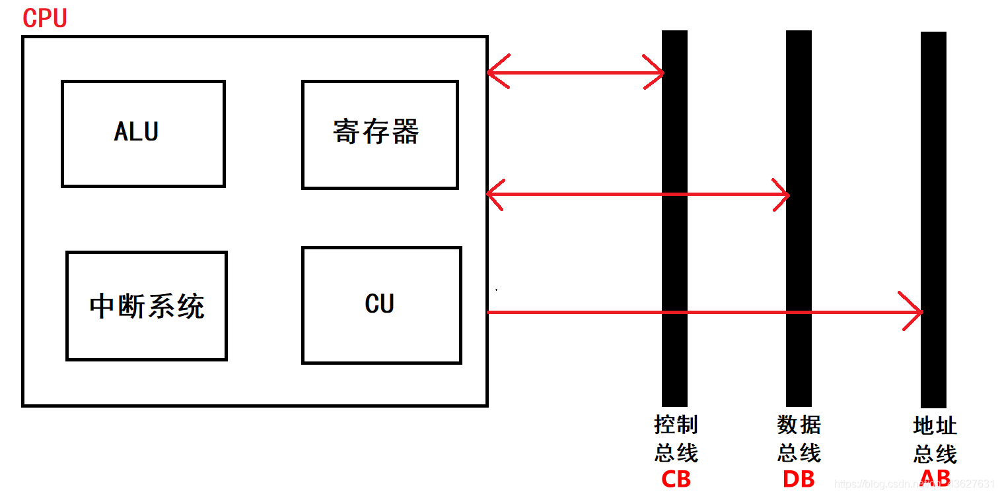

| 部件 | 功能 |
|:---|:---|
| **运算器（ALU）** | 执行算术运算和逻辑运算 |
| **控制器（CU）** | 取指令、译码、产生控制信号、控制指令执行顺序 |
| **寄存器组** | 暂存指令、数据、地址和状态信息 |
| **内部总线** | CPU 内部各部件之间的数据传输通路 |

##### 2. CPU内部结构

CPU 内部的核心功能部件及其连接关系如下：

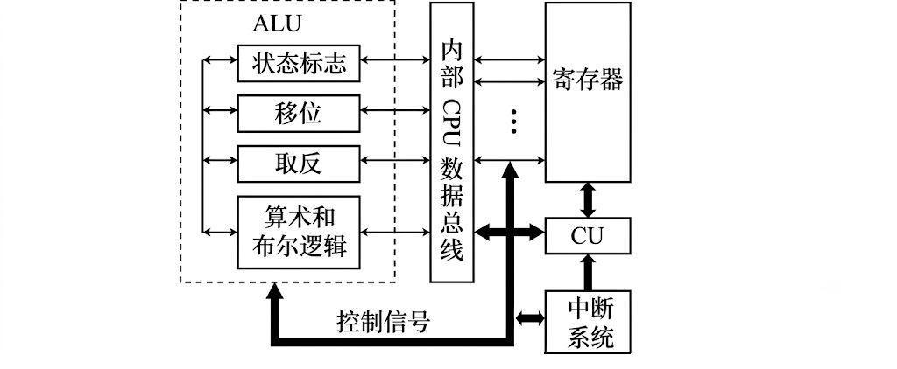

**（1）运算器（ALU）**

- 由 **ALU（算术逻辑单元）**、**暂存寄存器**、**累加器 ACC**、**通用寄存器组** 和 **PSW（标志寄存器）** 组成
- 功能：执行算术/逻辑运算，保存运算结果和状态标志
- ALU 的两个输入端通常来自暂存寄存器和累加器（或通用寄存器），输出送累加器或内部总线

**（2）控制器（CU）**

- 由 **PC（程序计数器）**、**IR（指令寄存器）**、**指令译码器（ID）**、**时序产生器** 和 **控制信号生成逻辑** 组成
- 功能：取指令 → 译码 → 按时序产生控制信号 → 协调各部件工作

**（3）寄存器组**

- 包含**通用寄存器**（程序员可见，如 R0~R31）和**专用寄存器**（PC、IR、MAR、MDR、PSW）
- 通用寄存器数量因架构而异：x86-64 有 16 个（RAX~R15），MIPS/RISC-V 有 32 个

**（4）内部数据通路**

- 连接各寄存器和 ALU 的总线结构（单总线 / 双总线 / 三总线）
- 多路选择器（MUX）负责选择数据的来源和去向

**内部数据流动示意**：

> **单总线结构的典型数据流**：一次加法需三步——① 源操作数1→暂存寄存器（经总线），② 源操作数2→ALU_B（经总线），③ ALU 输出→目标寄存器（经总线）。三总线结构可一步完成。

---

#### 三、中的主要寄存器


| 寄存器 | 全称 | 功能 | 位数 |
|:---|:---|:---|:---|
| **PC** | 程序计数器 (Program Counter) | 存放下一条指令的地址，具备自动递增功能 | 机器字长 |
| **IR** | 指令寄存器 (Instruction Register) | 存放当前正在执行的指令 | 指令字长 |
| **MAR** | 存储器地址寄存器 (Memory Address Register) | 存放要访问的存储单元地址 | 地址线位数 |
| **MDR** | 存储器数据寄存器 (Memory Data Register) | 存放从/向存储器读出/写入的数据 | 数据线位数 |
| **ACC** | 累加器 (Accumulator) | 存放 ALU 的一个操作数或运算结果 | 机器字长 |
| **PSW** | 程序状态字 (Program Status Word) | 存放运算结果的状态标志（OF/CF/SF/ZF 等） | — |

> **PC + 1**：顺序执行时，PC 自动递增"1"（实际增量为指令长度）。遇到转移指令时，PC 被修改为目标地址。

**寄存器的可见性（用户可见 / 用户透明）**：

| 类别 | 寄存器 / 部件 | 说明 |
|:---|:---|:---|
| **用户可见** | 通用寄存器（R0~Rn）、PC、PSW | 程序员可通过指令直接访问或受其控制（PC 随程序流转，PSW 反映运算状态标志） |
| **用户透明** | MAR、MDR、IR、Cache、微程序结构（μCM/μIR/μAR） | 程序员编程时看不到、不直接操作，由 CPU 硬件自动管理 |

> **考点**：MAR / MDR / IR / Cache 对用户**透明**；通用寄存器 / PC / PSW **用户可见**。

---

#### 四、时序产生器和控制方式

##### 1. 时序产生器

**时序产生器**是 CPU 内部产生各种定时信号的部件，为指令执行的每一步提供时间基准。

**（1）时序信号的层次**

```
时钟脉冲（节拍） ── 由主频产生的最基本定时信号
       │             （如 3.0 GHz 主频 → 时钟周期 ≈ 0.333 ns）
       ▼
 时钟周期（T）   ── 微操作的基本时间单位（1 个时钟脉冲）
       │
       ▼
 机器周期        ── 完成一次存储器访问或 ALU 操作的时间（多个 T）
       │             （如取指、间址、执行、中断）
       ▼
 指令周期        ── 执行一条指令的总时间（多个机器周期）
```

**（2）时序产生器的组成**

<div style="display: flex; align-items: flex-start; gap: 20px;">
<div style="flex: 1;"></div>
<div style="flex: 1.5;">
<table border="1" style="border-collapse: collapse; width: 100%;">
<thead><tr><th style="text-align: left; padding: 8px;">组成</th><th style="text-align: left; padding: 8px;">功能</th></tr></thead>
<tbody>
<tr><td style="padding: 8px;"><strong>时钟源（振荡器）</strong></td><td style="padding: 8px;">产生稳定的基准频率信号（石英晶体振荡器）</td></tr>
<tr><td style="padding: 8px;"><strong>环形脉冲发生器</strong></td><td style="padding: 8px;">将时钟信号转换为多相时序脉冲（T<sub>0</sub>, T<sub>1</sub>, T<sub>2</sub>, T<sub>3</sub>…）</td></tr>
<tr><td style="padding: 8px;"><strong>节拍发生器</strong></td><td style="padding: 8px;">控制每个机器周期内的节拍数（定长 / 变长）</td></tr>
<tr><td style="padding: 8px;"><strong>启停控制逻辑</strong></td><td style="padding: 8px;">控制时序信号的启动和停止（如等待存储器就绪）</td></tr>
</tbody>
</table>
</div>
</div>

**（3）典型时序关系**

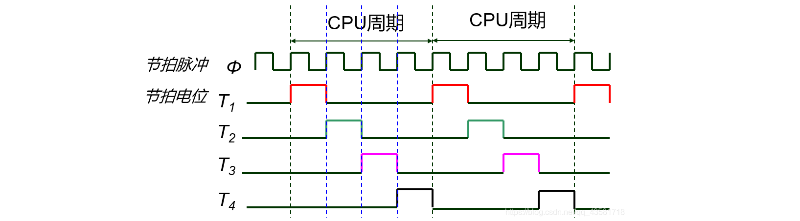

**（4）机器周期的类型**

| 周期类型 | 功能 | 典型操作 |
|:---|:---|:---|
| **取指周期（FE）** | 从存储器取出指令 | PC→MAR, 读, MDR→IR, PC+1 |
| **间址周期（IND）** | 取操作数的有效地址 | IR地址码→MAR, 读, MDR→MAR |
| **执行周期（EX）** | 执行指令规定的操作 | ALU 运算、数据传送 |
| **中断周期（INT）** | 响应中断、保存断点 | 关中断, 保存PC, 取中断向量 |

---

##### 2. 时序信号

CPU 各操作严格按照时序信号的节拍执行。每个微操作都在特定的 $T$ 周期内完成。

##### 3. 控制方式

| 方式 | 原理 | 特点 |
|:---|:---|:---|
| **同步控制** | 所有操作由统一时钟信号驱动，固定的时钟节拍 | 控制简单，但时间分配不灵活（按最慢操作定节拍） |
| **异步控制** | 各操作之间通过"请求-应答"握手信号协调 | 速度快、时间灵活，但控制复杂 |
| **联合控制** | 大部分操作用同步控制，特殊操作（如 I/O）用异步 | 现代 CPU 常用折中方式 |

---

### （二）指令周期

#### 一、指令周期的基本概念

##### 1. 基本概念

**指令周期（Instruction Cycle）**：CPU 从取出一条指令到执行完该指令所需的全部时间。

- CPU 周期又称为**机器周期**，每个机器周期完成一个基本操作
- 通常把一条指令周期划分为若干个机器周期
- **主存的工作周期（存取周期）为基础规定 CPU 周期**，比如用 CPU 读取一个指令字的最短时间来规定机器周期

**定长指令周期的分解**：

```
指令周期
├── 取指周期（FETCH）   ── 从存储器取出指令，送入 IR
│   ├── 取指            ── PC→MAR, 存储器读→MDR, MDR→IR
│   └── PC递增          ── PC + 1 → PC
│
├── 间址周期（INDIRECT）── 取操作数的有效地址（若指令使用间接寻址）
│
├── 执行周期（EXECUTE） ── 完成指令规定的操作（算术/逻辑/传送/转移）
│
└── 中断周期（INTERRUPT）── 响应中断请求，保存断点和程序状态
```

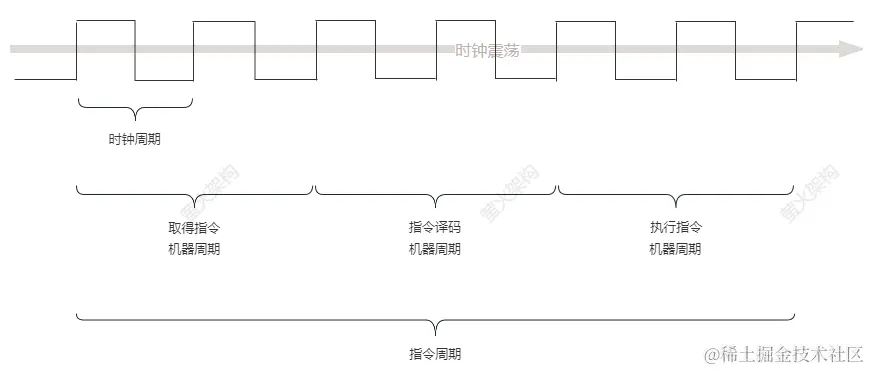

**不同指令的指令周期差异**：

| 指令类型 | 需要间址周期？| 执行周期操作 | 总机器周期数 |
|:---|:---:|:---|:---:|
| MOV（寄存器间）| 否 | 寄存器传送 | 2（取指 + 执行） |
| LAD（直接寻址访存）| 否 | 访存取数 | 2（取指 + 执行） |
| LAD（间接寻址访存）| **是** | 先间址取 EA，再访存取数 | **3**（取指 + 间址 + 执行） |
| ADD（访存加法）| 否（直接）/ 是（间接）| 访存取操作数 + ALU 加法 | 2~3 |
| JMP（直接跳转）| 否 | 修改 PC | 2（取指 + 执行） |
| STO（存入内存）| 否 | 访存写入 | 2（取指 + 执行） |
| CALL（子程序调用）| 否 | 保存返回地址 + PC←入口 | 2~3 |

**中断的指令周期**：

当指令执行完毕、取下一条指令之前，CPU 检查是否有中断请求。若有，插入一个**中断周期**：

```
中断周期的操作（以单重中断为例）：

① 关中断（保护中断现场不被干扰）
② 保存断点（当前 PC 压入堆栈）
③ 保存程序状态字（PSW 压入堆栈）
④ 识别中断源，获取中断向量
⑤ 根据中断向量查表，取中断服务程序入口地址 → PC
⑥ 进入中断服务程序执行
⑦ 中断返回（恢复 PSW 和 PC，开中断）
```

> **中断周期是"额外"的机器周期**：它不是每条指令都有，仅在检测到中断请求时插入。中断周期插在**当前指令执行完毕后、下一条指令取指前**。


---

##### 2. 基本指令周期流程

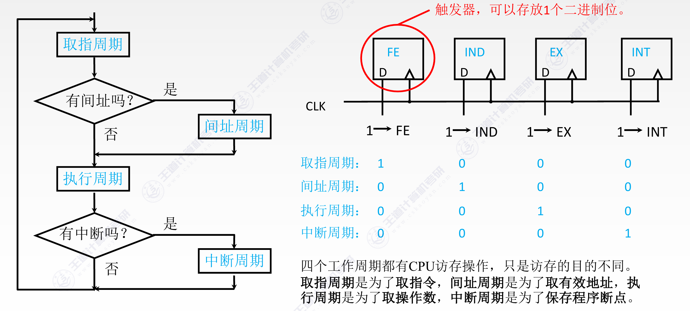

① 取指周期 — 取指周期的六步微操作

<table style="width: 100%; border: none;">
  <tr style="border: none;">
    <td style="width: 48%; vertical-align: top; border: none; text-align: center;">
      <strong>取指周期数据通路示意</strong><br>
      
    </td>
    <td style="width: 52%; vertical-align: top; border: none; padding-left: 20px;">
      <ol style="margin-top: 6px; padding-left: 20px;">
        <li>当前指令地址送至存储器地址寄存器<br><code>(PC) → MAR → 地址线</code></li>
        <li>CU 发出读控制信号到主存<br><code>1 → R</code>（读有效）</li>
        <li>将 MAR 所指主存中的内容经数据总线送入 MDR<br><code>M(MAR) → MDR</code></li>
        <li>将 MDR 中的内容（此时是指令）送入 IR<br><code>(MDR) → IR</code></li>
        <li>IR 中的操作码送至 CU 译码，识别指令类型<br><code>OP(IR) → CU</code></li>
        <li>CU 发出控制信号，形成下一条指令地址<br><code>(PC) + 1 → PC</code></li>
      </ol>
    </td>
  </tr>
</table>


② 间址周期 — 间址周期的五步微操作

<table style="width: 100%; border: none;">
  <tr style="border: none;">
    <td style="width: 48%; vertical-align: top; border: none; text-align: center;">
      <strong>间址周期数据通路示意</strong><br>
      
    </td>
    <td style="width: 52%; vertical-align: top; border: none; padding-left: 20px;">
      <ol style="margin-top: 6px; padding-left: 20px;">
        <li>将指令的地址码送入 MAR<br><code>Ad(IR) → MAR</code> 或 <code>Ad(MDR) → MAR</code></li>
        <li>CU 发出读控制信号到主存<br><code>1 → R</code>（读有效）</li>
        <li>将 MAR 所指主存中的内容经数据总线送入 MDR<br><code>M(MAR) → MDR</code></li>
        <li>将有效地址送至指令的地址码字段<br><code>(MDR) → Ad(IR)</code></li>
      </ol>
    </td>
  </tr>
</table>

③ 中断周期 — 中断周期的微操作

中断周期在**当前指令执行完毕后**插入，负责保存程序断点和程序状态，并转入中断服务程序。

**方式一：程序断点存入固定地址（如地址 0）**

<table style="width: 100%; border: none;">
  <tr style="border: none;">
    <td style="width: 48%; vertical-align: top; border: none; text-align: center;">
      <strong>中断周期数据通路示意</strong><br>
      
    </td>
    <td style="width: 52%; vertical-align: top; border: none; padding-left: 20px;">
      <ol style="margin-top: 6px; padding-left: 20px;">
        <li>将固定地址"0"送至 MAR<br><code>0 → MAR</code></li>
        <li>CU 发出写控制信号到主存<br><code>1 → W</code>（写有效）</li>
        <li>将 PC 的值（断点）送至 MDR<br><code>(PC) → MDR</code></li>
        <li>将 MDR 的内容写入主存地址 0 处<br><code>(MDR) → M(MAR)</code></li>
      </ol>
    </td>
  </tr>
</table>

**方式二：程序断点进栈（压入堆栈）**

```
① (SP) − 1 → SP               ; 栈指针减1
② (SP) → MAR                  ; 栈顶地址送MAR
③ 1 → W                       ; 写信号有效
④ (PC) → MDR                  ; 断点(PC值)送MDR
⑤ (MDR) → M(MAR)              ; 断点写入栈顶
```

**中断周期的后续步骤**：

```
⑥ 中断识别程序入口地址 M → PC     ; 取中断向量，装入PC，转入中断服务程序
⑦ 0 → EINT                     ; 关中断（置"0"），防止中断嵌套（单重中断）
```

> **两种断点保存方式对比**：存入固定地址（如 0 号单元）硬件简单但不支持中断嵌套；压入堆栈支持多级中断嵌套，现代 CPU 主流方式。

---
#### 二、典型指令的指令周期

以下基于简单模型机，假设数据通路中有 PC、MAR、MDR、IR、ACC、ALU。

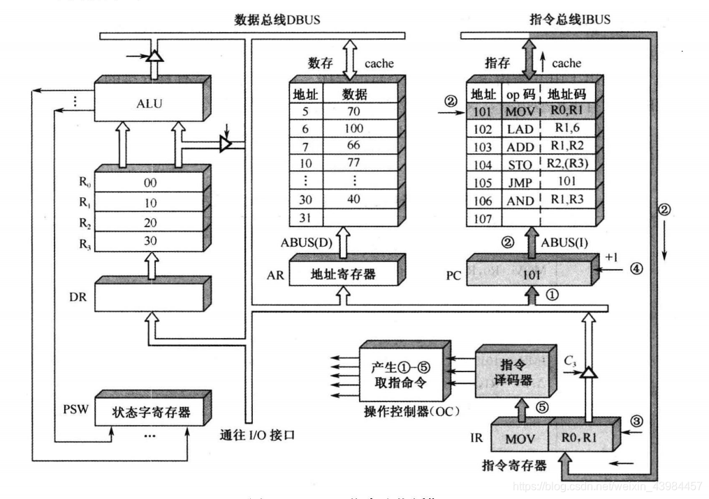

**第 1 个 CPU 周期：取指周期**，取指周期为所有指令的第一个周期，称之为**公操作**

```
指令: MOV R0, R1    含义: (R1) → R0

① 程序的第一条指令地址 → PC            ; PC = 101
② (PC) → ABUS（地址总线）             ; 将地址 101 送到地址总线
③ 存储器读 → IR                      ; (MEM[101]) → IR，取得 MOV R0, R1 指令
④ (PC) + 1 → PC                     ; PC = 102，指向下一条指令
⑤ OP(IR) → CU 译码                   ; CU 识别出这是一条 MOV 指令
⑥ 取指周期结束
```
##### 1. MOV 指令 `MOV R0, R1` 的指令周期（寄存器间传送）

以程序第一条指令 `MOV R0, R1`（地址 101）为例，说明完整的 CPU 周期。

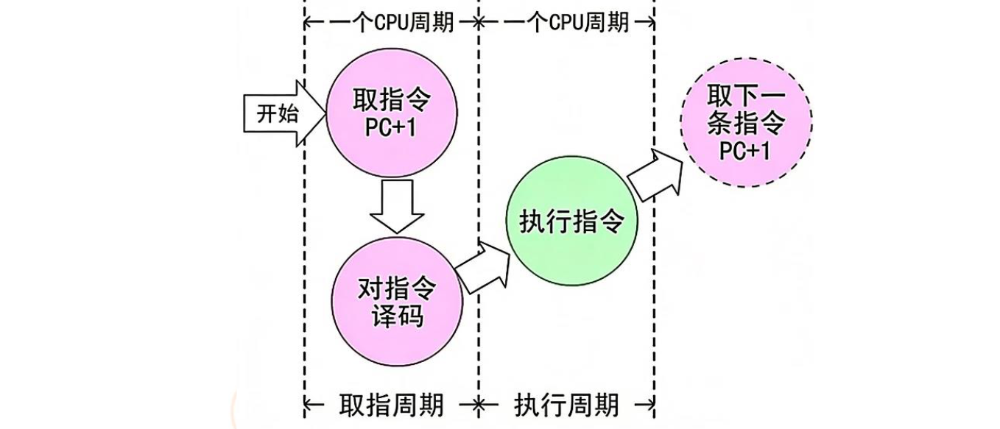

- **数据通路**：`R1` → **内部数据总线** → `R0`。
- **第 2 个 CPU 周期：执行周期**

```
⑦ R1 → ALU_A                        ; 源操作数 (R1) 送 ALU
⑧ ALU 直通（不做运算）→ R0             ; 结果写入目标寄存器 R0
⑨ 执行周期结束
```

> MOV 指令共需 **2 个 CPU 周期**：取指周期（访存 1 次） + 执行周期（寄存器操作，无访存）。取指周期的六步是所有指令的公共操作。

##### 2. LAD 指令 `LAD R1, 6` 的指令周期（从内存加载）

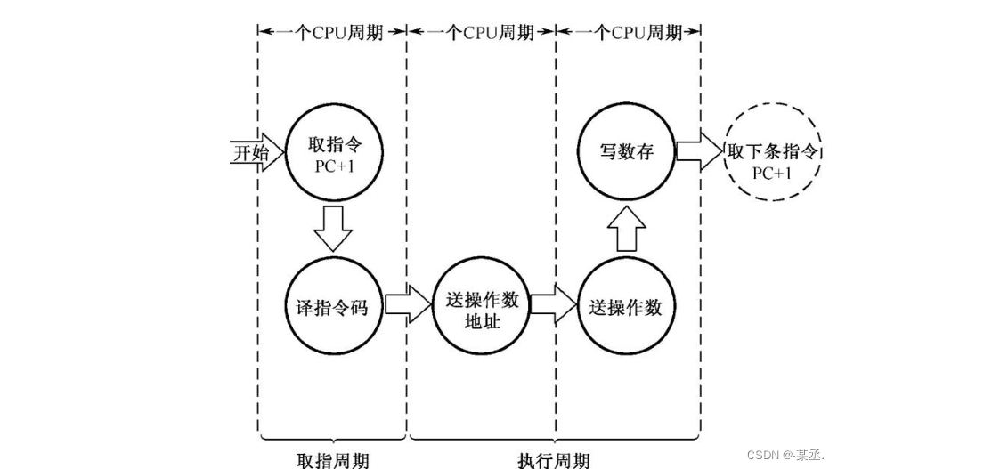

- **数据通路**：`IR（指令寄存器中的立即数字段）` → **内部数据总线** → `R1`


```
LAD  ACC, [ADDR]   ; ACC ← [ADDR]

取指周期（同上述四步）
执行周期：
  ① IR 的地址字段 → MAR     （将指令中的地址送 MAR）
  ② 存储器读 → MDR          （从主存读出数据）
  ③ MDR → ACC             （数据装入累加器）
```

##### 3. ADD 指令 `ADD R1, R2`  的指令周期（加法）

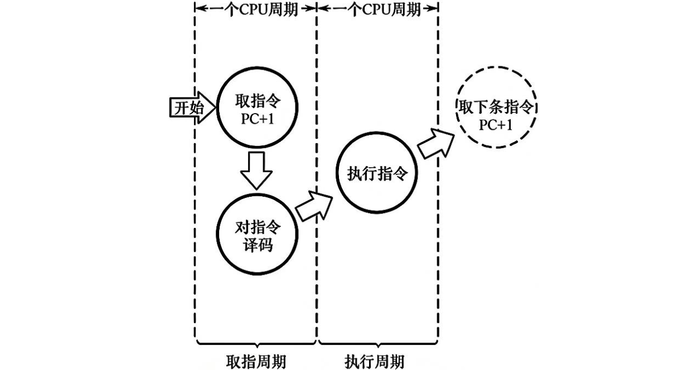

- **数据通路**：`R1` 和 `R2` 送入 **ALU** → ALU执行加法 → 运算结果通过内部总线写回 `R1`。

```
ADD  ACC, [ADDR]   ; ACC ← ACC + [ADDR]

取指周期（同上述四步）
执行周期：
  ① IR 的地址字段 → MAR     （将指令中的地址送 MAR）
  ② 存储器读 → MDR          （从主存取出加数）
  ③ ACC → ALU_A, MDR → ALU_B
  ④ ALU 做加法（A + B）
  ⑤ ALU 输出 → ACC
```

##### 4. STO 指令 `STO R2, (R3)` 的指令周期（存入内存）

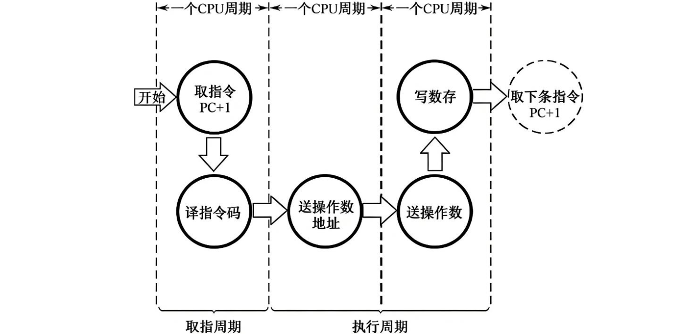

- **数据通路**（分两步）：
  1. 送地址：`R3` → **AR（地址寄存器）** → 通过**数据地址总线（ABUS(D)）** 送数存Cache。
  2. 送数据：`R2` → **数据总线（DBUS）** → 写入数存Cache中AR指向的单元。

```
STO  [ADDR], ACC   ; [ADDR] ← ACC

取指周期（同上述四步）
执行周期：
  ① IR 的地址字段 → MAR     （将指令中的地址送 MAR）
  ② ACC → MDR               （累加器的值送数据寄存器）
  ③ MDR → 存储器写           （数据写入主存）
```

##### 5. JMP 指令 `JMP 101` 的指令周期（无条件跳转）

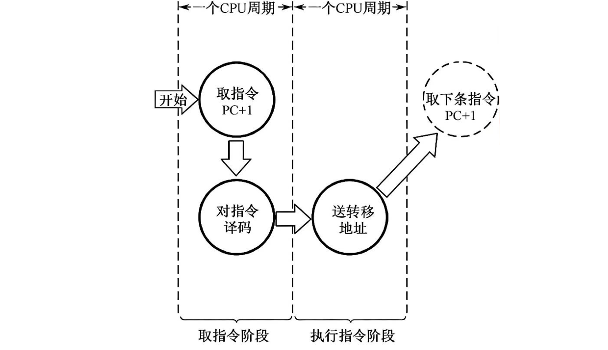

- **数据通路**：`IR（指令中的地址码字段101）` → **内部总线** → `PC（程序计数器）`。

```
JMP  ADDR   ; PC ← ADDR

取指周期（同上述四步）
执行周期：
  ① IR 的地址字段 → PC      （直接用指令中的地址覆盖 PC）
  ② 取下一条指令即从新 PC 开始
```

**各指令的执行周期（T3及以后）**

|             指令             | 执行周期数据通路                                             | 特殊时序说明                                                 |
| :--------------------------: | :----------------------------------------------------------- | :----------------------------------------------------------- |
|        **MOV R0,R1**         | **T3**：R1→内部总线→R0（写使能）。                           | 执行结束，下一取指周期开始（PC=101，已自动+1为102，但跳转会覆盖）。 |
|         **LAD R1,6**         | **T3**：IR中的立即数(6)→内部总线→R1。                        | 无需访问内存数据，一个节拍完成。                             |
|        **ADD R1,R2**         | **T3**：R1、R2→ALU（加法模式）→内部总线。 **T4**：计算结果写回R1，同时PSW接收新的状态标志。 | 需要两个节拍（运算+写回/状态更新）。                         |
| <nobr>**STO R2,(R3)**</nobr> | **T3**：R3→AR（地址就绪）。 **T4**：R2→数据总线（数据就绪），OC发出“写”控制信号至数存Cache。 | 写内存比读内存慢，需要T4完成写入。                           |
|         **JMP 101**          | **T3**：IR中的地址码(101)→内部总线→PC（直接覆盖）。          | 执行完此拍后，**PC不再是102，而是101**，下一条回到LAD。      |
|        **AND R1,R3**         | **T3**：R1、R3→ALU（逻辑与模式）→内部总线。 **T4**：结果写回R1，更新PSW。 | 与ADD类似，需要两拍。                                        |

##### 6. 各指令周期对比

| 指令 | 取指周期 | 执行周期操作 | 访存次数 |
|:---|:---|:---|:---:|
| MOV | 1 次访存 | 寄存器间操作，无需访存 | 1 |
| LAD | 1 次访存 | 取操作数 (1 次访存) | **2** |
| ADD | 1 次访存 | 取操作数 (1 次访存) | **2** |
| STO | 1 次访存 | 存结果 (1 次访存) | **2** |
| JMP | 1 次访存 | 修改 PC，无需额外访存 | 1 |

---

#### 三、用方框图语言表示指令周期

方框图（Flowchart）可以直观表示指令执行流程，是控制器设计的依据。

- 指令系统设计（模型机的五指令系统）
- 方框——按 CPU 周期
- 方框内内容——数据通路操作或控制操作
- 菱形符号——判别或测试
- ~——公操作
- 前边所讲述的 5 种操作的框图描述

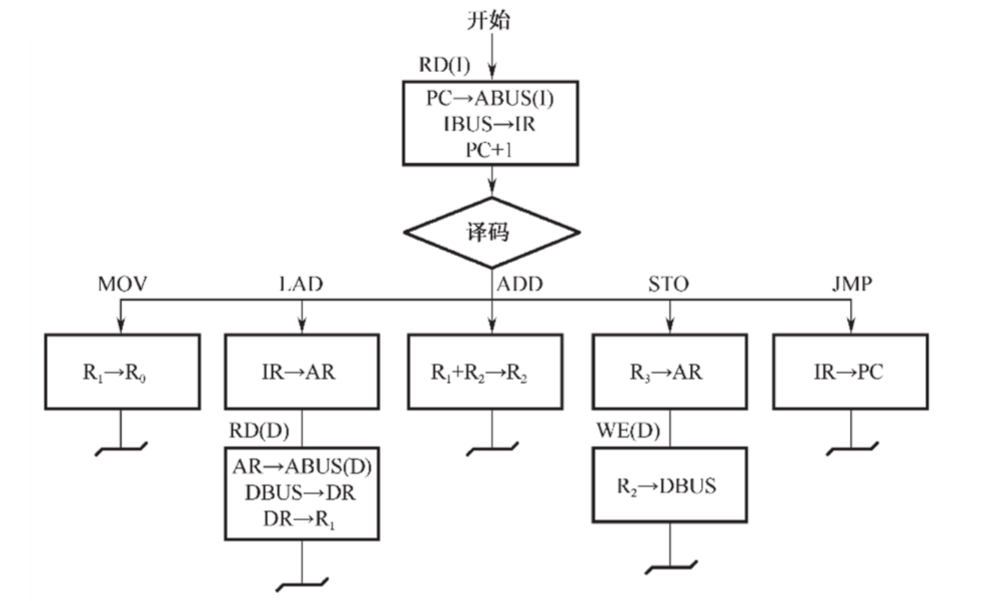

---

### （三）数据通路

#### 一、数据通路的功能与组成

##### 1. 基本定义

CPU 内部结构可看成由**数据通路（Datapath）** 和**控制部件（Control Unit）** 两大部分组成。

**数据通路**：数据在指令执行过程中所经过的路径，包括路径上的**所有部件**。ALU、通用寄存器、状态寄存器、异常和中断处理逻辑等都是指令执行时数据流经的部件，都属于数据通路的一部分。

- **数据通路描述了**：信息从哪里开始 → 中间经过哪些部件 → 最后被传送到哪里
- **谁控制数据通路**：由控制部件（CU）根据每条指令功能的不同，生成对数据通路的控制信号
- **核心作用**：为指令执行提供数据流转的物理通道，其结构决定 CPU 的性能

##### 2. 组成数据通路的元件

组成数据通路的元件主要分为**组合逻辑元件**和**时序逻辑元件**两类。

**（1）组合逻辑元件（操作元件）**

任何时刻产生的输出仅取决于当前的输入。不含存储信号的记忆单元，不受时钟信号控制，输出与输入之间无反馈通路，信号单向传输。

| 元件 | <center>功能</center> | <center>数据通路中的应用</center> |
|:--:|:---|:---|
| <nobr>**ALU（算术逻辑单元）**</nobr> | 执行算术（+、−、×、÷、移位）和逻辑（AND、OR、NOT、XOR）运算 | 运算器的核心，需要两个操作数 A、B，处理后得到一个输出结果 |
| **译码器** | 将二进制码转换为对应的输出信号（n 输入 → 2ⁿ 输出 + 使能端） | 对存储器单元地址译码，选中对应单元；指令译码识别操作类型 |
| **多路选择器（MUX）** | 从多个输入中选择一个输出，由 Select 控制信号决定 | CPU 中从多个寄存器选一个作 ALU 输入；总线传输替代三态门 |
| **三态门** | 具有 0/1/高阻态三种状态，由 EN 控制通断 | 控制寄存器与总线的连接（EN=1 接通，EN=0 高阻断开） |

**ALU 详解**：ALU 是 CPU 的主要组成部分，也称为整数单元（IU）。能够执行加、减、移位及布尔比较（XOR、OR、AND、NOT）。分为 AU（算术单元）和 LU（逻辑单元）。参与运算的数据需提前放到通用寄存器中。

**译码器详解**：2-4 译码器有 1 个使能端、2 个输入端（A₀A₁，4 种状态组合）、4 个输出端（Y₀~Y₃，低电平有效）。使能端 E̅=1 时输出全 1（非工作）；E̅=0 时对应一种输入组合，只有一个输出为 0。

**（2）时序逻辑元件（状态元件）**

任何时刻的输出不仅与该时刻的输入有关，还与该时刻**以前的输入**有关，必然包含存储记忆单元，且必须在时钟节拍下工作。

| 元件 | 说明 |
|:---|:---|
| **通用寄存器组** | 存放操作数和中间结果，程序员可见 |
| **程序计数器（PC）** | 存放下一条指令地址，受时钟控制自动递增 |
| **状态/移位/暂存/锁存寄存器** | 保存运算状态、暂存中间数据 |
| **存储器（Cache/主存）** | 也是时序逻辑，具有存储功能 |

---

#### 二、数据通路的基本结构

##### 1. 单总线结构

所有寄存器共享一条内部总线，分时使用。

```
    ┌───┬───┬───┬───┬───┬───┐
    │PC │IR │MAR│MDR│ACC│...│
    └───┴───┴───┴───┴───┴───┘
      │   │   │   │   │
      └───┴───┴───┴───┘
              │
         single bus
              │
         ┌────┴────┐
         │   ALU   │
         └─────────┘
```

图：单总线结构——PC、IR、MAR、MDR、ACC 等寄存器与 ALU 通过一条内部总线互连，任一时刻只能有一个数据在总线上传输。

| 优点 | 缺点 |
|:---|:---|
| 结构简单、硬件成本低 | 同一时刻只能传输一个数据，数据传输冲突多，性能较低 |

**一次加法需三步**：ACC→ALU_A → 另一个操作数→ALU_B → ALU 输出→ACC（至少 3 个总线周期）

> **考点（单总线限制）**：**CPI=1 的半周期处理器不能用单总线**——单总线同一时刻只允许一个部件占用总线，一个时钟周期内只能完成一次操作；操作数和结果必须分时传送，无法在一个指令周期内完成一条指令所需的全部操作。

##### 2. 多总线结构（双总线 / 三总线）

```
三总线结构：
  总线A ───── 操作数1 ─────▶ ALU
  总线B ───── 操作数2 ─────▶ ALU  (一个时钟完成)
  总线C ◀──── 结果 ──────── ALU
```

| 结构 | 描述 | 性能 |
|:---|:---|:---|
| 单总线 | 1 条共享总线 | 最慢，一次运算需多步 |
| 双总线 | 2 条独立总线 | 操作数可同时到达 ALU |
| 三总线 | 3 条独立总线（2 入 1 出） | 最快，一次时钟完成运算 |

##### 3. 专用数据通路（Dedicated Datapath）

各部件之间有**独立的专用连接线**，不同数据传输可以**同时并行进行**，无需分时共享总线。

```
专用通路结构示意（以取指为例）：

  PC ────────────▶ MAR           （专用通路1: 地址传送）
  MAR ───────────▶ 地址总线       （专用通路2: 地址输出）
  数据总线 ──────▶ MDR           （专用通路3: 指令读入）
  MDR ───────────▶ IR            （专用通路4: 指令锁存）
  IR(OP) ────────▶ 译码器        （专用通路5: 操作码译码）
  IR(Ad) ────────▶ MAR           （专用通路6: 地址码传送，间址用）

  以上六条通路可同时存在，互不干扰
```

**专用通路 vs 单总线的性能对比** — 以 `ADD R1, R2` 为例：

```
单总线结构（需 3 步，至少 3 个时钟）：
  ① R1 → 暂存寄存器（经总线）
  ② R2 → ALU_B（经总线），ALU 做加法
  ③ ALU 输出 → R1（经总线）

专用通路结构（1 个时钟完成）：
  R1 ──▶ ALU_A ──┐
                  ├──▶ ALU ──▶ R1
  R2 ──▶ ALU_B ──┘
  （三条专用线可同时传输）
```

| 对比维度 | 单总线结构 | 专用通路 |
|:---|:---|:---|
| 硬件成本 | 低 | **高**（连线数量多） |
| 并行度 | 低（串行传输） | **高**（多路同时传） |
| 控制复杂度 | 简单 | 复杂（需协调多条通路） |
| 典型应用 | 早期 CPU、简单嵌入式 | 现代高性能 CPU、流水线 |

---

#### 三、数据通路的工作方式

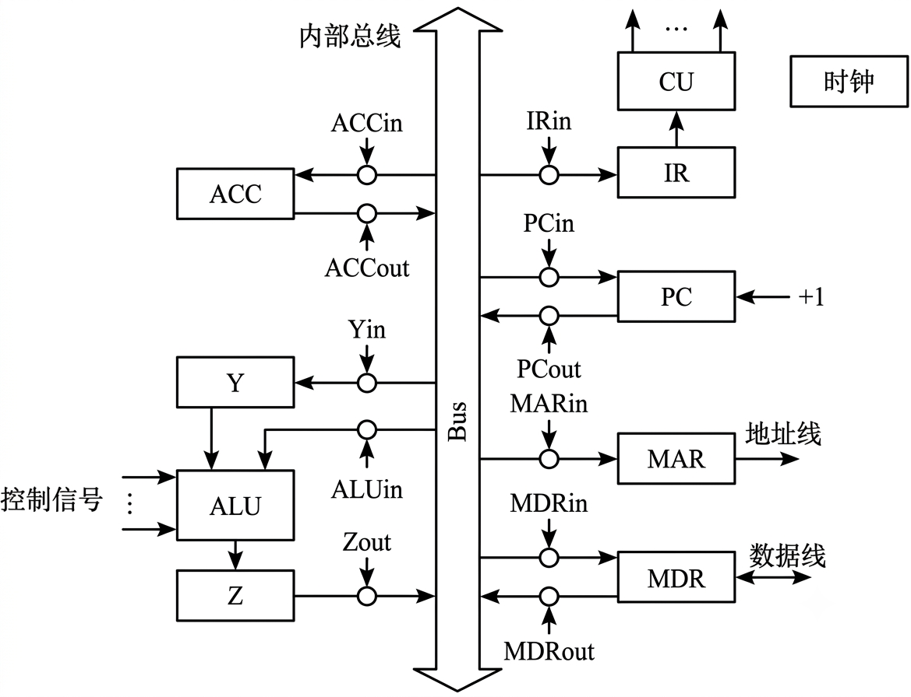

在单总线结构中，所有数据传输都通过同一条内部总线完成。以下以三类典型操作为例，说明数据通路的工作方式及对应的控制信号。

##### 1. 通用寄存器之间传送数据

每个寄存器与总线之间有两个控制信号：**Rin**（输入使能）和 **Rout**（输出使能）。

| 控制信号 | 有效时 | 说明 |
|:---|:---|:---|
| **Rout** | 将寄存器 R 的内容送至总线 | 输出门控打开 |
| **Rin** | 将总线上的信息存入寄存器 R | 输入门控打开，在时钟边沿锁存 |

**示例**：将 PC 的内容送至 MAR

```
PC → Bus → MAR

① PCout 有效    → PC 内容送总线
② MARin 有效    → 总线内容放入 MAR
   需要 1 个时钟周期
```

##### 2. 主存与 CPU 之间的数据传送

**（1）从主存读取数据（以取指令为例）**

CPU 从主存取指令，在单总线数据通路中分三步完成：

| 步骤 | 操作 | 控制信号 | 周期 |
|:---:|:---|:---|:---:|
| ① | PC → Bus → MAR | PCout + MARin 有效，现行指令地址 → MAR | 1 个时钟 |
| ② | CU 发读命令；MEM(MAR) → MDR；PC+1 → PC | `1→R`（读信号）；MDRin 有效；PC 自增 | **1 个主存周期** |
| ③ | MDR → Bus → IR | MDRout + IRin 有效，现行指令 → IR | 1 个时钟 |

```
取指令的三步流程：

  PC → Bus → MAR         ; ① 送指令地址（PCout, MARin）
  1 → R                  ; ② CU 发读命令
  MEM(MAR) → MDR         ;    存储器读出指令到 MDR（MDRin）
  (PC) + 1 → PC          ;    PC 递增，为下条指令做准备
  MDR → Bus → IR         ; ③ 指令送入 IR（MDRout, IRin）
```

**（2）将数据写入主存**

```
  Ad(IR) → Bus → MAR     ; ① 送写入地址（MDRout, MARin）
  数据 → Bus → MDR        ; ② 数据送 MDR（某寄存器 Rout, MDRin）
  1 → W                  ; ③ CU 发写命令
  (MDR) → M(MAR)         ;    MDR 内容写入主存
```

##### 3. 执行算术或逻辑运算

在单总线数据通路中，**每一时刻总线上只有一个数据有效**。由于 ALU 是组合逻辑元件（无存储功能），执行运算时必须**同时保持两个操作数有效**。因此需要引入两个暂存寄存器：

| 暂存器 | 作用 |
|:---|:---|
| **Y（暂存寄存器）** | 保存第一个操作数，其输出持续送到 ALU 的 A 输入端 |
| **Z（结果暂存寄存器）** | 保存 ALU 运算的结果（因为 ALU 输出不能直接连到总线——否则会通过总线反馈到输入端） |

> **为什么需要 Z？** ALU 的输出不能直接与总线相连，否则其输出会通过总线反馈到 ALU 输入端，造成循环振荡。因此运算结果**必须暂存在 Z 中**，再经总线写入目标寄存器。

**示例**：执行 `ADD ACC, [ADDR]`（累加器 + 内存操作数 → ACC）

```
  Ad(IR) → Bus → MAR     ; ① 操作数地址 → MAR（MDRout, MARin）
  1 → R                  ; ② CU 发读命令
  MEM → 数据线 → MDR      ;    操作数从存储器 → MDR
  MDR → Bus → Y          ; ③ 操作数 → Y 暂存（MDRout, Yin）
  (ACC) + (Y) → Z        ; ④ ACCout + ALUin，CU 向 ALU 发加命令，结果 → Z
  Z → ACC                ; ⑤ Zout + ACCin，结果 → ACC
```

**流程总结**：

| 操作类型 | 涉及控制信号 | 时钟/周期数 |
|:---|:---|:---:|
| 寄存器间传送 | Rout, Rin | 1 个时钟 |
| 主存读取 | PCout, MARin, MDRin; `1→R`; MDRout, IRin; PC+1 | 2 个时钟 + 1 个主存周期 |
| 主存写入 | MDRout, MARin; Rout, MDRin; `1→W` | 2 个时钟 + 1 个主存周期 |
| ALU 运算 | MDRout, Yin; ACCout, ALUin; Zout, ACCin | 多个时钟（取决于操作数来源） |

---

### （四）硬布线控制器

#### 一、控制器的分类

```
控制器
├── 硬布线控制器（Hardwired Controller）
│   ├── 由组合逻辑门电路实现
│   ├── 速度快、设计复杂、不易修改
│   └── 适合 RISC（指令规整）
│
└── 微程序控制器（Microprogrammed Controller）
    ├── 由微程序（存储在 ROM 中的微指令序列）实现
    ├── 速度较慢、设计规整、易于修改
    └── 适合 CISC（指令复杂、格式多样）
```

**硬布线 vs 微程序 对比总结**：

| 对比维度 | 硬布线控制器 | 微程序控制器 |
|:--:|:--:|:--:|
| **实现方式** | 组合逻辑门电路 + 触发器 | ROM 存储微程序 + 微指令译码 |
| **控制信号产生** | 操作码 + 时序 → 门电路直接产生 | 微指令的操作控制字段经译码产生 |
| **速度** | **快**（1~2 级门延迟） | 较慢（需逐条取微指令，ROM 访问延迟） |
| **规整性** | 差（门电路不规则，呈现"乱"状） | **好**（微指令格式规整，ROM 阵列整齐） |
| **可修改性** | 难（修改需重新设计门电路） | **易**（只需修改微程序 ROM 内容） |
| **设计复杂度** | 高（需综合化简布尔表达式） | 低（微程序编写相对规整） |
| **成本** | 低（门电路） | 较高（需 ROM + μIR + μAR + 译码器） |
| **功耗** | 低 | 较高（ROM 持续访问） |
| **故障诊断** | 难 | 易（微指令逐条可追踪） |
| **适用场景** | **RISC**（指令规整、格式固定） | **CISC**（指令复杂、格式多变） |
| **典型代表** | MIPS、ARM、RISC-V | x86（CISC 外壳 + 内部微码翻译） |

> **实际融合**：现代 CPU 常采用**混合方式**——常用简单指令用硬布线直接执行（快），复杂指令用微程序实现（灵活）。x86 处理器将 CISC 指令译码为类 RISC 的微操作序列（μOPs）就是这一思想的体现。

---

#### 二、硬布线控制器

##### 1. 基本思想

硬布线控制器又称组合逻辑控制器，其将控制信号生成逻辑用**组合逻辑门电路和触发器**直接实现。其基本思想是：将每条指令的微操作序列转化为一系列布尔表达式，直接用门电路产生控制信号。

- **输入**：指令操作码（来自 IR）、时序信号（来自时序产生器）、状态标志（来自 PSW）
- **输出**：各功能部件的控制信号（到 ALU、寄存器、总线、存储器）
- **本质**：一个**多输入多输出的组合逻辑电路**——对于给定的输入组合，输出确定
- 由**组合逻辑电路**实现，无存储元件（除触发器用于时序）
- 速度快——控制信号在指令译码后直接由门电路产生（1~2 级门延迟）
- 不可编程——一旦制造完成，控制逻辑固定，修改需重新设计门电路

##### 2. 结构方框图

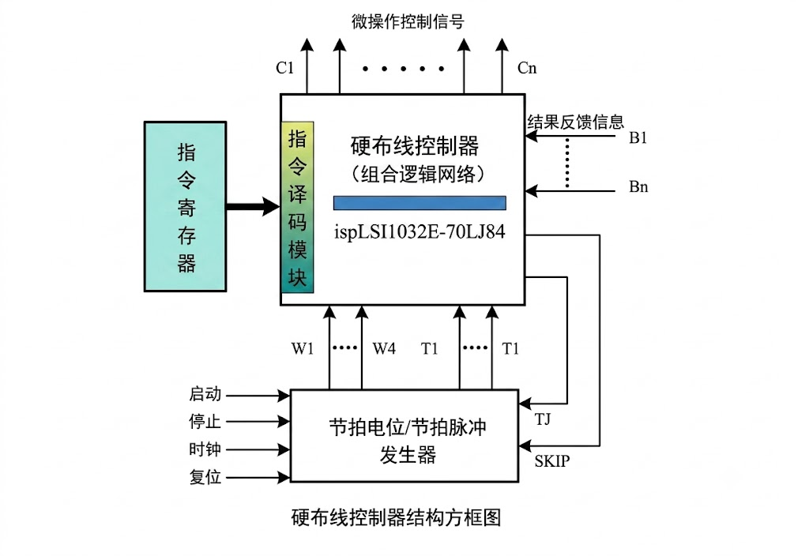

**信号流说明**：
- **指令译码器**接收 IR 中的操作码，译出 n 条指令选择线（如 n 位操作码 → 最多 2ⁿ 种指令类型）
- **时序信号**确定当前处于哪个机器周期的哪个节拍（T₀, T₁, …）
- **状态标志**（OF, CF, SF, ZF）影响条件跳转类指令的控制信号
- **控制信号生成逻辑**根据以上三类输入，通过组合逻辑门电路输出对应控制信号

##### 3. 设计步骤

实际设计中需要几十到几百条指令。设计过程是：确定每条指令所需的机器周期 → 将情况相同的指令归并在一起 → 列出表达式 → 画出逻辑图。

**第一步：列出微操作命令的操作时间表**

先根据微操作节拍安排，列出微操作命令的操作时间表。操作时间表中包括各个**机器周期、节拍**下的每条指令所完成的微操作控制信号。

```
Operation time table example (fragment):

 insn │machine cycle│ T1        │ T2        │ T3        │ T4        │ ...
──────┼─────────────┼───────────┼───────────┼───────────┼───────────┼────
 MOV  │ fetch cycle │ PCout,    │ MARin     │ MDRout,   │ PC+1      │    
      │             │ MARin     │ 1→R       │ IRin      │           │    
──────┼─────────────┼───────────┼───────────┼───────────┼───────────┼────
 ADD  │ fetch cycle │ PCout,    │ MARin     │ MDRout,   │ PC+1      │    
      │             │ MARin     │ 1→R       │ IRin      │           │    
      ├─────────────┼───────────┼───────────┼───────────┼───────────┼────
      │execute cycle│ IR(Ad)out,│ MDRout,   │ ALU(+)    │ Zout,     │    
      │             │ MARin     │ 1→R       │ ACC→ALU   │ ACCin     │    
```
图：操作时间表（硬布线控制器设计第一步）——列出每条指令在各机器周期、节拍（T1~T4）下应发出的微操作控制信号，取指周期的信号为所有指令共用。

> 取指周期的信号对所有指令都是相同的，可以共用。

**第二步：进行微操作信号综合**

在列出微操作时间表后，对它们进行综合分析、归类，写出各微操作控制信号的**逻辑表达式**并适当简化。

**微操作控制信号的通用表达式**：

$$\text{微操作控制信号} = \text{机器周期} \land \text{节拍} \land \text{脉冲} \land \text{操作码} \land \text{机器状态条件}$$

| 因素 | 来源 | 说明 |
|:---|:---|:---|
| **机器周期** | 节拍发生器 | 当前处于取指/间址/执行/中断中的哪个周期 |
| **节拍** | 时序产生器 | 当前处于 T₀, T₁, … 中的哪个节拍 |
| **脉冲** | 时钟信号 | 时钟边沿触发（如前/后沿） |
| **操作码** | IR → 译码器 | 区分是哪条指令（MOV/ADD/LAD…） |
| **机器状态条件** | PSW 标志位 | 条件跳转指令的附加条件（ZF/CF/OF 等） |

> **归并技巧**：取指周期的微操作信号在所有指令中相同，可统一表达；不同指令中相同的微操作（如都要读存储器）可归并为一个表达式，减少门电路数量。

**第三步：画出微操作命令的逻辑图**

根据逻辑表达式，画出对应每个微操作信号的逻辑电路图，用逻辑门电路实现。

```
  机器周期信号 ──┐
  节拍信号 ──────┤
  脉冲信号 ──────┤
                 ├──▶ 与门阵列 ──▶ 控制信号输出
  操作码译码 ────┤                  (到各部件)
  状态标志 ──────┘
```

> 硬布线设计一旦完成，**修改极其困难**（需重新设计门电路）。因此只适合指令格式规整的精简指令集（RISC）。

**【例】写出下列操作控制信号的逻辑表达式（教材 5.4.3）**

设 M1/M2/M3 为节拍电位信号（对应机器周期），T1~T4 为一个 CPU 周期中的节拍脉冲，MOV/LAD/ADD/STO/JMP 为各指令的 OP 译码输出，则可写出如下逻辑表达式（教材示意）：

```text
RD(I) = M1                              ; 指存读（取指），所有指令共用
RD(D) = M3 · LAD                        ; 数存读（LAD 取操作数）
LDPC  = M1·T4 + M2·T4·JMP               ; 打入 PC
LDIR  = M1·T4                           ; 打入 IR
LDAR  = M2·T4·(LAD + STO)               ; 打入数存地址寄存器
PC+1  = M1                              ; PC 加 1
LDR2  = M2·T4·ADD                       ; 打入 R2
```

> **启示（高频）**：每个控制信号 = **机器周期 ∧ 节拍 ∧ 脉冲 ∧ 操作码**（∧ 机器状态条件）；取指周期信号（`RD(I)`、`PC+1` 等）为所有指令共用，可归并为一个表达式。教材原例还给出 `WE(D)`、`LDDR` 等写入/缓冲信号，但其中指令名（LDA/STA）与本笔记 MOV/LAD/ADD/STO/JMP 五指令系统对应较乱，故此处只列关键表达；完整【例】以教材图为准。

---

### （五）微程序控制器

#### 一、微程序控制原理

##### 1. 微命令和微操作

微程序控制器的两个最底层概念：

| 概念 | 定义 | 关系 | 示例 |
|:---|:---|:---|:---|
| **微命令** | 控制部件向执行部件发出的**最小编码控制信号** | 微命令是**因** | 打开某三态门、ALU 做加法、`PCout` |
| **微操作** | 执行部件收到微命令后完成的**最基本的操作** | 微操作是**果** | `PC → MAR`、`存储器读`、`PC + 1` |

**微命令与微操作的关系**：

- 一个微操作通常由**多个微命令**同时驱动完成。例如微操作 `PC → MAR` 需要 `PCout` + `MARin` 两个微命令同时有效。
- 微命令是控制信号的**最小不可分割单位**——它是控制器能发出的最"细粒度"命令。
- 微操作是数据通路中实际发生的**物理动作**。


```
微命令(因)                微操作(果)
  PCout ──┐
          ├──▶ PC → MAR（PC 的内容送到 MAR）
  MARin ──┘

  1→R   ──────▶ 存储器读（启动主存读操作）
  MDRout ──┐
           ├──▶ MDR → IR（指令从 MDR 送入 IR）
  IRin   ──┘
```

**微命令的相容性与相斥性**：

微命令之间存在着两种互斥的逻辑关系，这是微指令编码和格式设计的基础。

| 类型 | 定义 | 能否同时有效 | 典型例子 |
|:---|:---|:---:|:---|
| **相容性微命令** | 控制**不同硬件资源**、互不冲突的微命令 | **能**同时有效 | `PCout` 和 `MARin`（一个输出到总线，一个从总线输入） |
| **相斥性微命令** | 控制**同一硬件资源**的不同状态的微命令 | **不能**同时有效 | `PCout` 和 `MDRout`（两个都输出到同一总线→冲突） |

**为什么需要区分相容与相斥？**

```
相容:  PCout + MARin  ✓  (PC送地址到MAR，两条路不冲突)

相斥:  PCout + MDRout ✗  (两个都往总线输出→总线数据混乱)
       ALU(+) + ALU(-) ✗  (ALU不能同时做加法和减法)
       1→R  + 1→W      ✗  (不能同时读和写存储器)
```

**相斥性微命令的常见分组**：

| 组别 | 相斥的微命令 | 控制资源 |
|:---|:---|:---|
| **总线输出组** | `PCout`, `MDRout`, `IR(Ad)out`, `ACCout`, `Zout`, `R0out~Rnout` | 内部总线（同时只能有一个输出） |
| **ALU 功能组** | `ALU(+)`, `ALU(−)`, `ALU(&)`, `ALU(∨)`, `ALU(直通)` | ALU 运算功能（同时只能做一种） |
| **存储器操作组** | `1→R`, `1→W` | 主存读写控制（不能同时读写） |

> **在微指令编码中的应用**：相斥性微命令编入同一字段（字段编码法），相容性微命令放在不同字段。这是**水平型微指令字段划分**的根本依据——互斥的信号共享同一组编码位以压缩微指令长度。

##### 2. 微指令和微程序

| 概念 | 定义 | 示例 |
|:---|:---|:---|
| **微指令** | 一个节拍内**同时发出的所有微命令**的集合 | `PCout + MARin + 1→R`（取指第一步） |
| **微程序** | 实现一条机器指令的**微指令序列** | MOV 的微程序 ≈ 取指 3 条 + 执行 1 条 |

```
微指令 = 操作控制字段 + 顺序控制字段

操作控制字段 ── 产生本步的所有微命令（每位对应一个控制信号）
顺序控制字段 ── 指明下一条微指令的地址（顺序 / 跳转）
```

**四层概念的层级关系**：

```
微命令（最小编码信号，如 "PCout"）
   │  多个微命令同时发出，构成
   ▼
微指令（一个节拍的并行控制字）
   │  多条微指令顺序执行，构成
   ▼
微程序（一条机器指令的执行序列）
   │  由程序计数器/指令寄存器调用
   ▼
机器指令（程序员可见，如 ADD R1, R2）
```

##### 3. 微程序控制器原理框图

微程序控制器的核心部件及连接关系（Wilkes 模型，1951）：

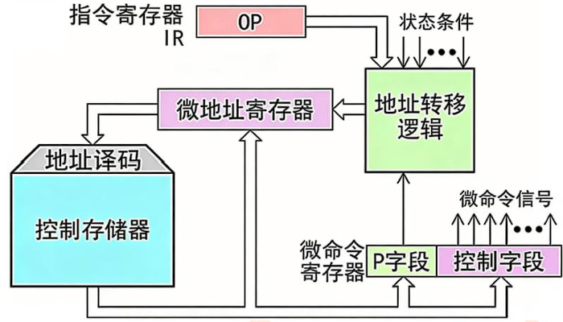

**微程序控制器的整体工作原理与下地址形成机制**

**（1）核心部件解析**

- **指令寄存器 (IR)**：存放当前正在执行的**机器指令**。其中的 `OP`（操作码）字段是微程序控制器的重要输入，用于决定这首条微指令的位置。
- **控制存储器 (CM)**：系统的核心，本质上是一个 ROM，里面固化了所有机器指令对应的**微程序**。
- **微地址寄存器 (CMAR / $\mu$PC)**：存放**下一条**要从控制存储器中读取的微指令的地址。
- **微命令寄存器 (CMDR / $\mu$IR)**：存放刚从控制存储器中读出的**当前微指令**。
  - **控制字段**：直接向系统发出微命令信号（对应前一张图的第 1~17 位），控制 ALU、寄存器等执行具体动作。
  - **P 字段（下地址/顺序控制字段）**：对应前一张图的第 18~23 位，反馈给地址转移逻辑，用于辅助生成下一条微指令的地址。
- **地址转移逻辑**：微程序控制器中最灵活的大脑，负责“指路”。它根据当前指令的操作码、外围电路的状态条件（如 ALU 的进位、零标志等）以及微指令本身的 P 字段，共同计算出下一条微指令的准确地址。

**（2）微程序的完整执行闭环**

当 CPU 开始执行一条机器指令时，整个系统会按照以下步骤在图中的数据通路里流转：

**第一步：操作码映射（寻址启动）**

机器指令被取到 **指令寄存器 (IR)** 后，其 `OP` 操作码被送入 **地址转移逻辑**。硬件会通过特定的映射规则（例如在 OP 码后拼接几个 0），将其转换为该机器指令对应的微程序在 CM 中的**首地址**，并打入 **微地址寄存器**。

**第二步：微指令读取**

根据微地址寄存器中的地址，经过**地址译码**，控制存储器 (CM) 将对应的微指令读出，存入 **微命令寄存器 (CMDR)**。

**第三步：微命令执行与并行判定**

这一步是并行的双线操作：

- **执行数据通路**：CMDR 的**控制字段**向外发出微命令信号（如图中向上的箭头），触发数据通路（如图 1 的寄存器读写、ALU 运算）。
- **计算下地址**：CMDR 的 **P 字段**与系统的**状态条件**一起送入**地址转移逻辑**。如果 P 字段指示需要测试某个条件（例如“运算结果是否为负”），地址转移逻辑会结合状态标志位，决定是顺序执行下一条微指令，还是跳转到微程序的分支地址。计算出的新地址被重新打入微地址寄存器。

**第四步：循环直至指令结束**

系统不断重复“读取微指令 $\to$ 发出微命令 $\to$ 计算下地址”的过程，直到遇到一条带有“微程序结束”或“取指周期启动”标志的微指令，一条机器指令的执行便宣告完成。

##### 4. 十进制加法指令（BCD 码加法）的微程序举例

BCD 码逢十进一（跳过 1010~1111），ALU 按二进制相加会出错。此处采用"**先补偿，后判断，再恢复**"算法，规避复杂的数值比较。

**原理**：先强制 $+6$ → 检查进位 Cy → $Cy = 1$（补偿正确，结束）/ $Cy = 0$（补偿错误，$-6$ 恢复）。

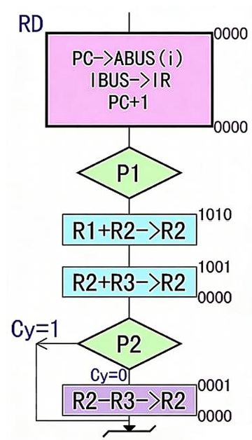

**微程序流程**（R3 预存常量 6）：

| 地址 | 微操作 | 说明 | 顺序控制 |
|:---:|:---|:---|:---|
| 公用 | `PC → ABUS(I), IBUS → IR, PC + 1` | 取指（所有指令共用） | P1 测试 → 操作码译码 |
| 1010 | `R1 + R2 → R2` | 二进制相加 | 顺序 → 1001 |
| 1001 | `R2 + R3 → R2` | 强制加 6（R3 = 6） | P2 测试 → 检测 Cy |
| — | — | **Cy = 1**：补偿正确 → 结束 | — |
| 0001 | `R2 − R3 → R2` | **Cy = 0**：减 6 恢复 → 结束 | 顺序 → 取下条指令 |

> **核心启示**：P1 测试字段根据操作码**跳转到对应微程序入口**（不同指令对应不同 CM 起始地址）；P2 测试字段根据状态标志**动态选择分支路径**。这一机制使得微程序可以灵活应对 BCD 调整这类需要"判断-修正"的场景。

##### 5. CPU 周期与微指令周期的关系

| 周期类型 | 含义 | 时间长度 | 包含内容 |
|:---|:---|:---|:---|
| **CPU 周期（机器周期）** | 完成一次主存访问或 ALU 操作的时间 | 多个时钟周期（T） | 多条微指令 |
| **微指令周期** | 执行一条微指令所需的时间 | 通常 = **1 个时钟周期** | 1 条微指令 |
```
|<--- 执行微指令 ----->|<------- 微指令周期 -------->|读微|<-
|                    |                            |指令|
+------+------+------+------+------+------+------+======+
|  T1  |  T2  |  T3  |  T4  |  T1  |  T2  |  T3  || T4 ||
+------+------+------+------+------+------+------+======+
|<------- CPU周期 ---------->|<------- CPU周期 ---------->|
```
```
指令周期（1 条机器指令）
  │
  ├── 取指周期（CPU 周期 1）
  │     ├── T₁: 微指令 1（PC→MAR）
  │     ├── T₂: 微指令 2（存储器读, PC+1）
  │     └── T₃: 微指令 3（MDR→IR）
  │
  └── 执行周期（CPU 周期 2）
        ├── T₄: 微指令 4（地址码→MAR）
        ├── T₅: 微指令 5（读操作数）
        ├── T₆: 微指令 6（ALU 加法）
        └── T₇: 微指令 7（结果→ACC）
```

> **关键对应**：1 个 CPU 周期 = 多次访存/运算中的某一次；1 个微指令周期 = 1 个时钟周期 = 1 条微指令。因此，**一个 CPU 周期包含多条微指令**。

##### 6. 机器指令与微指令的关系

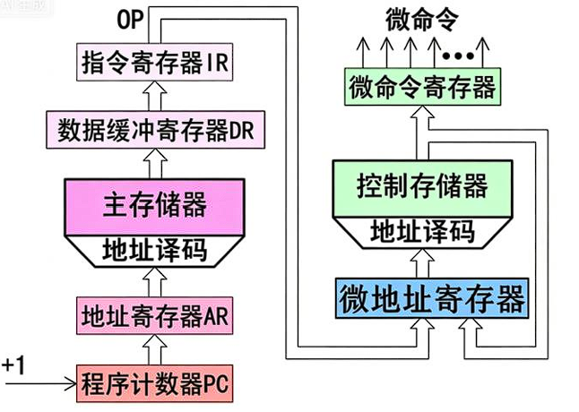

| 维度 | 机器指令 | 微指令 |
|:---|:---|:---|
| **可见性** | 对程序员**可见**（汇编语言中直接使用） | 对程序员**透明**（硬件内部使用） |
| **存储位置** | 主存（RAM） | 控制存储器 CM（ROM，CPU 内部） |
| **功能粒度** | 完成一个完整操作（如加法、跳转） | 完成一个微操作（如寄存器→总线） |
| **执行时间** | 1 个指令周期（含多个 CPU 周期） | 1 个微指令周期（通常 = 1 个时钟） |
| **格式** | 操作码 + 地址码 | 操作控制字段 + 顺序控制字段 |
| **数量级** | 几十~几百条（RISC）/ 数百~上千条（CISC） | 几十~几百条微指令组成微程序库 |
| **设计者** | ISA 架构师（定义指令集） | CPU 微架构师（设计控制器） |

**关系总结**：

```
1 条机器指令 = 1 段微程序 = n 条微指令（n ≥ 1）

机器指令是"宏观任务描述"（做什么），微指令是"微观执行步骤"（怎么做）。
每条机器指令的操作码映射到对应微程序的入口地址，
控制器通过逐条执行该微程序中的微指令，完成机器指令规定的操作。
```

---

#### 二、微程序设计技术

**设计微指令应当追求的目标**

> 有利于缩短微指令的长度
>
> 有利于缩小CM的容量
>
> 有利于提高微程序的执行速度
>
> 有利于对微指令的修改
>
> 有利于提高微程序设计的灵活性

##### 1. 微指令的格式

微指令分为**水平型微指令**和**垂直型微指令**两类。

**（1）水平型微指令**

一次能定义并能**并行执行多个微命令**的微指令。控制字段每位直接对应一个微命令，不需译码。

```
Horizontal micro-instruction format:
┌──────────────────────┬──────────────────────┬──────────────────────────────┐
│  next address field  │  test field (P1/P2)  │  control field (micro cmds)  │
│ (sequence control)   │  (branch control)    │  (bit = 1 micro-cmd, direct) │
└──────────────────────┴──────────────────────┴──────────────────────────────┘
```

图：水平型微指令格式——由下地址字段（顺序控制）、判别测试字段（P1/P2 条件分支）和控制字段（每位对应一个微命令，直接控制）组成。

- **特点**：并行操作能力强、效率高、灵活性强；执行一条指令的时间短
- **缺点**：微指令字较长；微程序短，但微指令条数多时 CM 容量需求大
- **用户掌握难度**：较高（需理解每个 bit 对应的硬件控制信号）

**（2）垂直型微指令**

采用编码方式，设置微操作控制字段时，**一次只能执行一到两个微命令**。

```
Vertical micro-instruction format:
┌──────────────────────────┬─────────────┬─────────────┬─────────┐
│ micro-opcode (like insn) │ src reg no. │ dst reg no. │  other  │
└──────────────────────────┴─────────────┴─────────────┴─────────┘
```

图：垂直型微指令格式——由微操作码（类似机器指令的操作码）和源/目标寄存器编址字段组成，需译码执行，一次只能执行 1~2 个微命令。

- **特点**：微指令字短、CM 利用率高；与机器指令格式相似，容易掌握
- **缺点**：并行操作能力弱；执行时间长（需译码）；灵活性较差

**（3）水平型 vs 垂直型 对比总结**

| 维度 | 水平型微指令 | 垂直型微指令 |
|:---|:---|:---|
| **并行操作能力** | **强**（一次执行多个微命令） | 弱（一次执行 1~2 个） |
| **执行速度** | **快**（执行时间短） | 慢（需译码，执行时间长） |
| **微指令字长** | 长（每位一个控制信号） | **短**（编码表示） |
| **微程序长度** | **短**（微指令数少） | 长（微指令数多） |
| **CM 利用率** | 低（位宽大但条数少） | **高**（位宽小） |
| **灵活性** | **高** | 低 |
| **用户掌握难度** | 难（需了解硬件控制信号） | **易**（与机器指令相似） |

##### 2. 微指令的编码方式（微命令的编码方法）

操作控制字段中微命令的编码有三种方法：

| 方法 | 原理 | 特点 |
|:---|:---|:---|
| **直接表示法** | 操作控制字段中的**每一位**直接对应一个微命令，不需要译码 | 速度最快、并行度最高，但微指令长度最长（= 微命令总数） |
| **编码表示法** | 将操作控制字段分为若干小段，每段内采用最短编码法（经译码后产生微命令），段与段之间采用直接控制法 | 微指令长度大幅缩短，但增加了译码电路，执行速度变慢 |
| <nobr>**混合表示法**</nobr> | 结合前两者——某些位直接控制，某些字段编码表示；一个字段的某些编码需与其他字段联合定义 | 兼顾速度和长度，实际使用最广泛 |

**编码表示法的要点**：

- 互斥的微命令编入同一字段（如 ALU 功能组：加/减/与/或），相容的微命令放在不同字段
- **必须保留一种"不发出命令"的编码**（通常为全 0），表示该字段不产生任何微命令
- 字段位数 = $\lceil \log_2 (n+1) \rceil$（$n$ 为相斥微命令数，+1 为不操作状态）

**三种方法的关系**：

```
直接表示法 ──── 速度优先（每 bit 一个信号，不译码）
     │
     ├──▶ 混合表示法（部分直接 + 部分编码，实际主流）
     │
     └──▶ 编码表示法（全部编码，长度优先，需译码）
```

##### 3. 微地址的形成方法

下一条微指令地址的确定方式：

| 方式 | 原理 | 适用 |
|:---|:---|:---|
| **μPC + 1** | 微程序计数器递增（顺序执行） | 顺序微操作 |
| **操作码映射** | 机器指令操作码 → 映射逻辑 → 对应微程序入口地址 | 取指后跳转到不同微程序 |
| **增量与下址字段结合** | 微指令中顺序控制字段存放转移地址，μPC 负责 +1 | 条件/无条件跳转 |
| **多路转移** | 根据多个条件标志组合（P1/P2 测试字段）生成微地址 | 多分支判断 |

> **微地址形成逻辑**：操作码 + 状态标志 + 下址字段 → 地址形成电路 → μAR。入口地址由操作码映射、后续地址由顺序控制字段或 μPC+1 决定。

##### 4. 微程序的顺序控制

下一条微指令地址的确定方式：

| 方式 | 原理 | 适用 |
|:---|:---|:---|
| **μPC + 1** | 顺序执行（微程序计数器递增） | 顺序微操作 |
| **指令操作码映射** | 将机器指令的操作码映射为对应微程序的入口地址 | 取指后跳转到对应微程序 |
| **条件跳转** | 根据状态标志（如 ZF, CF）决定下一条微指令地址 | 条件分支 |

---

### （六）流水 CPU

#### 一、并行处理技术

| 并行层次 | 技术 | 说明 |
|:---|:---|:---|
| **指令级并行（ILP）** | 流水线（时间） | 多条指令重叠执行（不同指令的不同阶段同时进行） |
| | 超标量（空间） | 一个时钟周期发射多条指令（多个 ALU/执行单元） |
| | VLIW | 编译器静态调度，长指令字含多个操作 |
| **数据级并行** | SIMD / 向量处理 | 一条指令处理多个数据（如 SSE/AVX） |
| **线程级并行** | 多线程 / 多核 | 多个线程或核心同时执行 |

---

#### 二、流水 CPU 的结构

##### 1. 流水计算机的系统组成

流水方式 CPU 的硬件架构由两部分支撑：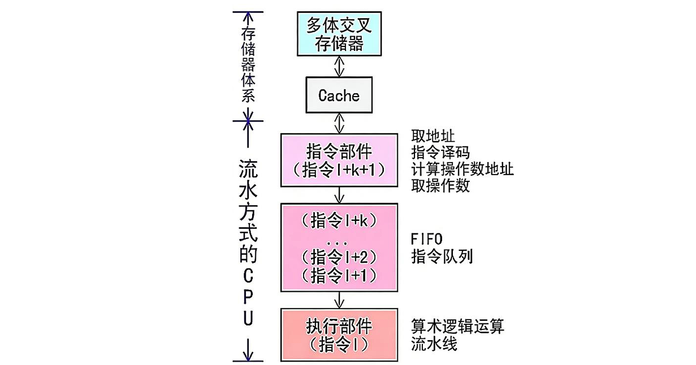

| 组成 | 说明 |
|:---|:---|
| **存储器体系** | 主存采用**多体交叉存储器**（支持流水访问）；配合 **Cache** 缩短取指和访存延迟 |
| **流水方式 CPU** | 含**指令部件**（预取指令 + PC 管理）、**指令队列**（缓冲预取的指令）、**执行部件**（多级流水段并行工作） |


##### 2. 指令流水的定义

指令流水就是改变各条指令按顺序串行执行的规则，使机器在**执行上一条指令的同时，取出下一条指令**。也可以把指令周期划分得更细，使更多的指令在同一时间内并行执行。

**三种执行方式**（设取指、分析、执行 3 个阶段时间相等，均为 $t$）：

| 方式 | 原理 | 执行 $n$ 条指令的时间 | 加速效果 |
|:---|:---|:---|:---:|
| **顺序执行** | 一条指令完全结束后再取下一条 | $T = 3nt$ | 无并行 |
| **一次重叠** | 第 $k$ 条指令的**执行**与第 $k+1$ 条的**取指**同时进行 | $T = (1+2n)t$ | 约提速 1.5× |
| **二次重叠** | 取第 $k+1$ 条与分析第 $k$ 条**同时**，分析第 $k+1$ 条与执行第 $k$ 条**同时** | $T = (2+n)t$ | 约提速 3× |

**经典五段流水线**（IF → ID → EX → MEM → WB）：

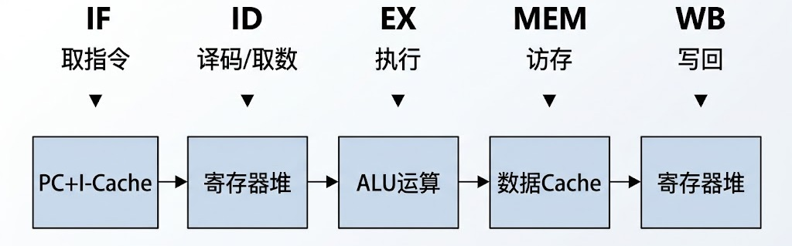

**流水线时空图**（4 条指令在 5 级流水线中重叠执行）：

| | T1 | T2 | T3 | T4 | T5 | T6 | T7 | T8 |
|:--:|:---:|:---:|:---:|:---:|:---:|:---:|:---:|:---:|
| **指令1** | IF | ID | EX | MEM | WB | | | |
| **指令2** | | IF | ID | EX | MEM | WB | | |
| **指令3** | | | IF | ID | EX | MEM | WB | |
| **指令4** | | | | IF | ID | EX | MEM | WB |

> 第 5 个时钟后，每个时钟完成一条指令（理想情况）。无流水线时每条指令需 5 个时钟。

##### 3. 流水线的分类

按级别分为三级：

| 级别 | 名称 | 说明 | 示例 |
|:---|:---|:---|:---|
| **指令流水线** | 指令级并行 | 多条指令的不同阶段在时间上重叠执行 | CPU 五段流水 |
| **算术流水线** | 运算级并行 | 将运算操作分解为多个子步骤流水执行 | 浮点乘法器（对阶→尾数乘→规格化→舍入） |
| <nobr>**处理机流水线（宏流水线）**</nobr> | <nobr>任务级并行</nobr> | 多个 CPU 或核之间按流水线方式处理任务流 | 多核 CPU 流水处理数据包 |

---

#### 三、流水线中的主要问题

流水线中存在三种影响性能的因素，使下一条指令无法在设计的时钟周期内执行：

##### 1. 结构相关（资源冲突 / 资源冒险）

**定义**：多条指令在同一时钟周期内**争用同一功能部件**。

**示例**（Load 指令与后续指令的访存冲突）：

| | T1 | T2 | T3 | T4 | T5 | T6 | T7 | T8 |
|:---|:---:|:---:|:---:|:---:|:---:|:---:|:---:|:---:|
| **I1 (Load)** | IF | ID | EX | MEM | WB | | | |
| **I2** | IF | ID | EX | **冲突** | MEM | WB | | |
| **I3** | | IF | ID | **冲突** | EX | MEM | WB | |
| **I4** | | | IF | **冲突** | ID | EX | MEM | WB |
| **I5** | | | | IF | ID | EX | MEM | |

> I1 在 T4 访存取数据时，I2/I3/I4 都需要在 T4~T6 访问同一存储器端口，产生冲突。

**解决办法**：

| 方法 | 原理 |
|:---|:---|
| **① 插入暂停（气泡）** | 前指令访存时，使后一条相关指令暂停一个时钟周期 |
| **② 资源重复配置** | 单独设置**指令存储器**和**数据存储器**——即哈佛结构（指令 Cache + 数据 Cache），使取指和访存可并行 |

##### 2. 数据相关（数据冲突 / 数据冒险）

**定义**：后一条指令依赖于前一条指令的**计算结果**。

**三类数据相关**：

| 类型 | 全称 | 含义 | 简单流水线中 |
|:---|:---|:---|:---:|
| **RAW** | Read After Write | 后面指令**读**前面指令刚**写**的数据 | **存在**（最常见） |
| **WAW** | Write After Write | 两条指令**写**同一单元 | 不出现（顺序发射，不乱序） |
| **WAR** | Write After Read | 后面指令**覆盖**前面指令刚**读**的单元 | 不出现（顺序发射，不乱序） |

**RAW 示例**（ADD 的结果被后续两条指令使用）：

```
ADD  R1, R2, R3    ; R2 + R3 → R1
SUB  R4, R1, R5    ; R1 − R5 → R4  ← 依赖 R1（RAW）
AND  R6, R1, R7    ; R1 & R7 → R6  ← 依赖 R1（RAW）
```

| | T1 | T2 | T3 | T4 | T5 | T6 | T7 | T8 |
|:---|:---:|:---:|:---:|:---:|:---:|:---:|:---:|:---:|
| **ADD** | IF | ID | EX | MEM | WB | | | |
| **SUB** | | IF | ID | **等** | **等** | EX | MEM | WB |
| **AND** | | | IF | ID | **等** | EX | MEM | WB |

> SUB 和 AND 在 T4~T5 必须等待 ADD 在 T5 写回 R1 后才能进入 EX。

**解决办法**：

| 方法 | 原理 |
|:---|:---|
| **① 流水线暂停（Stall）** | 硬件阻塞：插入 1~2 个时钟周期的气泡（NOP），等数据就绪。也可用软件插入 NOP 指令 |
| <nobr>**② 数据旁路（Forwarding / Bypassing）**</nobr> | 设置专用通路，不等前一条指令写回寄存器，直接把 ALU 的**计算结果**传给下一条指令作为输入 |
| **③ 编译器优化** | 重排指令顺序，将与数据无关的指令插入数据相关指令之间，消除等待 |

##### 3. 控制相关（控制冲突 / 控制冒险）

**定义**：遇到**转移指令**或其他改变 PC 值的指令时，流水线后续已取出的指令可能无效。

**解决办法**：

| 方法 | 原理 |
|:---|:---|
| **① 分支预测** | 静态预测（总猜不跳，继续执行后续指令）/ 动态预测（根据历史执行情况调整，准确率高） |
| **② 预取双方向** | 同时预取转移成功和不成功两个方向的目标指令 |
| **③ 加快条件码形成** | 提前生成条件码（如将比较逻辑提前到 ID 阶段），减少等待时间 |
| **④ 延迟分支** | 分支指令后放一条**必定执行**的指令（由编译器填充） |

##### 4. 数据相关类型判别示例

判断以下三组指令各存在哪种类型的数据相关：

```
(1) I1: ADD R1, R2, R3   ; R2+R3 → R1
    I2: SUB R4, R1, R5   ; R1−R5 → R4
    → RAW：I2 读 R1，而 I1 刚写入 R1

(2) I3: STO M(x), R3     ; R3 → M(x)
    I4: ADD R3, R4, R5   ; R4+R5 → R3
    → WAR：I3 读 R3，而 I4 要覆盖 R3（简单流水线不乱序，不出现）

(3) I5: MUL R3, R1, R2   ; R1×R2 → R3
    I6: ADD R3, R4, R5   ; R4+R5 → R3
    → WAW：两条指令都写入 R3（简单流水线不乱序，不出现）
```

---

#### 四、流水线的性能指标

| 指标 | 公式 | 含义 |
|:---|:---|:---|
| **吞吐率（TP）** | $TP = n / T_k$ | 单位时间内完成的指令条数 |
| **加速比（S）** | $S = T_0 / T_k$ | 流水线执行时间 vs 非流水线执行时间 |
| **效率（E）** | $E = S / k$ | 流水线各部件的利用率 |

对于理想流水线（$k$ 级，$n$ 条指令，时钟周期 $\tau$）：

$$T_k = k\tau + (n-1)\tau = (k+n-1)\tau$$
$$T_0 = n \times k\tau$$
$$S = \frac{n \times k\tau}{(k+n-1)\tau} = \frac{nk}{k+n-1}$$

> 当 $n \to \infty$，$S \to k$——理论加速比接近流水线级数。

---

### （七）多处理器基本概念

#### 一、多处理器概念

**多处理器系统**：一台计算机中包含**两个或以上**的处理器（CPU），共同完成并行计算任务。

| 类型 | 特征 | 示例 |
|:---|:---|:---|
| **SMP（对称多处理器）** | 多个相同 CPU 共享同一主存，由 OS 统一调度 | 现代多核 PC、服务器 |
| **AMP（非对称多处理器）** | 不同 CPU 负责不同任务（主从结构） | 嵌入式系统 |
| **集群（Cluster）** | 多台独立计算机通过网络互联 | 数据中心、超算 |

---

#### 二、和向量处理器的基本概念


**Flynn 分类法**（按指令流和数据流分类）：

| 类型 | 全称 | 指令流 | 数据流 | 说明 | 示例 |
|:---|:---|:---:|:---:|:---|:---|
| **SISD** | 单指令单数据 | 1 | 1 | 传统单核处理器（冯·诺依曼） | 早期 CPU |
| **SIMD** | 单指令多数据 | 1 | 多 | 一条指令同时处理多个数据 | GPU、SSE/AVX |
| **MISD** | 多指令单数据 | 多 | 1 | 理论模型，实际极少 | 脉动阵列（特殊 DSP） |
| **MIMD** | 多指令多数据 | 多 | 多 | 多个处理器独立执行不同指令 | 多核 CPU、集群 |

**SPMD（单程序多数据）**：MIMD 的一种编程模型——多个处理器运行同一程序但处理不同数据。MPI 并行编程常用。

**向量处理器**：SIMD 的典型实现——一条向量指令可对整组数据（向量）进行运算（如 Cray-1、现代 GPU）。

---

#### 三、硬件多线程

一个物理 CPU 核心同时维护多个线程的上下文（寄存器组、PC），快速切换以隐藏访存延迟。

| 类型 | 原理 | 硬件成本 | 线程切换条件 |
|:---|:---|:---|:---|
| **细粒度多线程** | 每个时钟周期切换线程（轮流执行） | 低 | 固定轮转 |
| **粗粒度多线程** | 仅在长时间等待（如 Cache 缺失）时切换 | 较低 | 遇到长延迟事件 |
| **同时多线程（SMT）** | 同一时钟周期内发射多个线程的指令（如 Intel 超线程） | 高 | 超标量发射槽充裕时 |

---

#### 四、多核处理器的基本概念

**多核处理器（Multi-core）**：一个芯片上集成多个独立的 CPU 核心。

| 特征 | 说明 |
|:---|:---|
| **共享什么** | 通常共享最后一级 Cache（L3）、内存控制器、I/O |
| **独立什么** | 每个核心有独立的 L1/L2 Cache、寄存器组、PC、ALU |
| **优点** | 功耗效率高（多个低频核优于一个高频核）、适合并行任务 |
| **编程挑战** | 需多线程编程、处理缓存一致性问题 |

---

#### 五、共享内存多处理器（SMP）的基本概念

SMP 是 MIMD 的具体实现——多个同构处理器通过**总线或交叉开关**共享同一物理主存。

```
    CPU0    CPU1    CPU2    CPU3
     │       │       │       │
     └───────┼───────┼───────┘
             │       │
         ┌───┴───────┴───┐
         │ shared memory │
         └───────────────┘
```

图：SMP 共享内存结构——多个 CPU（CPU0~CPU3）经总线或交叉开关连接到同一物理主存（共享内存）。

| 关键问题 | 解决方案 |
|:---|:---|
| **缓存一致性（Cache Coherence）** | 各核心的 L1 Cache 数据需保持一致（MESI 协议、侦听/目录协议） |
| **内存一致性（Memory Consistency）** | 多核心看到的访存顺序需有规则（顺序一致性 / 弱一致性） |
| **同步** | 原子指令（Test-and-Set、LL/SC）+ 锁 + 屏障 |

**单一物理地址空间多处理器的分类（按访存时间）**：

| 类型 | 全称 | 访存特征 |
|:---|:---|:---|
| **UMA** | 统一存储访问（Uniform Memory Access） | 无论访存哪个处理器、哪个字，访存时间大致相同 |
| **NUMA** | 非统一存储访问（Nonuniform Memory Access） | 某些访存速度快于其他，访存时间与访问的处理器、访问的字相关 |

**进程 / 线程分配方式（SMP 组织）**：

| 方式 | 特点 | 缺点 |
|:---|:---|:---|
| **主/从（master/slave）** | 内核固定在某主处理器运行，其余处理器只执行用户程序或实用程序 | 主处理器失效→整个系统失效；独自完成调度→可能成为性能瓶颈 |
| **对称（symmetric）** | 内核可在任意处理器上执行，各处理器自行调度进程/线程 | 需保证两个处理器不会选择同一进程、进程不会丢失（复杂同步） |

> **考点**：UMA 访存时间近似相同 / NUMA 访存时间与处理器及字相关；主/从（主失效→系统失效）vs 对称（调度需同步）。

---

### （八）异常和中断机制

#### 一、异常和中断简介

| 术语 | 来源 | 含义 | 处理方式 |
|:---|:---|:---|:---|
| **异常（Exception）** | CPU 内部 | 指令执行过程中产生的意外事件（同步） | 转入异常处理程序 |
| **中断（Interrupt）** | CPU 外部（I/O 设备） | 外部设备请求 CPU 服务（异步） | 转入中断服务程序（ISR） |

> 异常和中断都导致 CPU **暂停当前程序**，保存现场后**转入对应的处理程序**，处理完毕后**恢复现场继续执行**。

**基本处理流程**：
1. 关中断（防止嵌套干扰）
2. 保存断点和程序状态（PC、PSW 压栈）
3. 根据中断/异常类型获取处理入口地址（中断向量表 / 异常向量表）
4. 执行处理程序
5. 恢复现场，开中断，返回

---

#### 二、异常和中断的类型

##### 1. 异常的分类

| 类型 | 发生时机 | 示例 | 处理方式 |
|:---|:---|:---|:---|
| **故障（Fault）** | 指令执行前/中 | 缺页、除零、非法指令 | 纠正后**重新执行**当前指令 |
| **陷阱（Trap）** | 指令执行后（有意） | 系统调用（int 0x80 / syscall） | 执行完处理程序后**继续下一条** |
| **终止（Abort）** | 不可恢复的错误 | 硬件故障、校验错误 | 终止进程，无法恢复 |

##### 2. 中断的分类

| 类型 | 特征 | 示例 |
|:---|:---|:---|
| **可屏蔽中断（INTR）** | 可通过关中断屏蔽 | I/O 设备请求（键盘、磁盘） |
| **不可屏蔽中断（NMI）** | 不可屏蔽，必须立即响应 | 电源故障、硬件严重错误 |

---

#### 三、异常和中断的检测与响应

##### 1. 检测时机

- **异常**：在指令执行过程中检测——译码阶段（非法指令）、执行阶段（除零）、访存阶段（缺页）
- **中断**：在**每条指令执行结束后**的"中断检查点"检测

##### 2. 中断响应过程

```
① 关中断（保护中断现场不被干扰）
② 保存断点和 PSW（压入系统栈）
③ 识别中断源，获取中断向量
④ 根据向量查找中断服务程序入口地址（中断向量表 / IDT）
⑤ PC ← 中断服务程序入口地址
⑥ 执行中断服务程序
⑦ 恢复现场（弹出 PSW 和 PC）
⑧ 开中断，返回原程序
```

##### 3. 中断向量表

```
中断向量表（IVT / IDT）：
  中断号 0: ──▶ 除零异常处理程序入口
  中断号 1: ──▶ 单步调试处理程序入口
  中断号 2: ──▶ NMI 处理程序入口
  中断号 3: ──▶ 断点异常处理程序入口
  ...
  中断号 13: ─▶ 一般保护异常
  中断号 14: ─▶ 缺页异常处理程序入口
  ...
```

> x86 使用**中断描述符表（IDT）**，每个入口 8 字节，存储在 IDTR 寄存器指向的位置。

---

### （九）本章总结

**知识结构图**：

```
第五章 中央处理器（CPU）
│
├── （一）CPU 的功能和组成
│   ├── 一、CPU 的功能（指令控制 / 操作控制 / 时间控制 / 数据加工 / 异常中断）
│   ├── 二、CPU 的基本组成（运算器 + 控制器 + 寄存器组 + 内部总线）
│   │   ├── 1. CPU与系统总线（地址/数据/控制三总线）
│   │   └── 2. CPU内部结构（ALU / CU / 寄存器组 / 内部数据通路）
│   ├── 三、CPU 中的主要寄存器（PC/IR/MAR/MDR/ACC/PSW + 功能表 + 可见性汇总）
│   └── 四、时序产生器和控制方式
│       ├── 1. 时序产生器（时钟脉冲→T→机器周期→指令周期 + 四部件 + 时序波形）
│       ├── 2. 时序信号
│       └── 3. 控制方式（同步/异步/联合）
│
├── （二）指令周期
│   ├── 一、基本概念（取指周期 + 间址周期 + 执行周期 + 中断周期 + 流程图）
│   ├── 二、典型指令的指令周期
│   │   ├── MOV（取指+执行，2CPU周期）/ LAD（取指+执行，含访存）
│   │   ├── ADD（取指+执行，含ALU运算+PSW更新）/ STO（取指+执行，含写内存）
│   │   ├── JMP（取指+执行，PC强制改写）/ AND（取指+执行，逻辑运算）
│   │   ├── 公共取指周期表（T0~T2三步）+ 各指令执行周期对比表（6指令6维度）
│   │   └── 程序示例（100~106 死循环程序 + 整体执行逻辑）
│   └── 三、方框图语言表示指令周期
│       ├── ① 取指周期（六步微操作 + HTML并排图）
│       ├── ② 间址周期（四步微操作 + HTML并排图）
│       └── ③ 中断周期（固定地址/进栈两种方式 + 后续步骤 + HTML并排图）
│
├── （三）数据通路
│   ├── 一、功能与组成（CPU = 数据通路 + 控制部件）
│   │   ├── 组合逻辑元件（ALU / 译码器 / MUX / 三态门 + 详解）
│   │   └── 时序逻辑元件（寄存器组 / PC / 状态暂存锁存寄存器 / 存储器）
│   ├── 二、基本结构
│   │   ├── 1. 单总线结构（分时共享 + ASCII图 + 优缺点 + CPI=1 不能用单总线）
│   │   ├── 2. 多总线结构（双/三总线 + 性能对比表）
│   │   └── 3. 专用数据通路（六条专用连线 + ADD性能对比 + 四维度表）
│   └── 三、工作方式
│       ├── 1. 寄存器间传送（Rin/Rout控制信号 + PC→MAR示例）
│       ├── 2. 主存与CPU传送（取指令三步 + 写主存流程）
│       └── 3. ALU算术逻辑运算（Y暂存器 + Z暂存器 + ADD五步流程 + 总结表）
│
├── （四）硬布线控制器
│   ├── 一、控制器的分类（硬布线 vs 微程序 + 11维度对比表）
│   ├── 二、硬布线控制器
│   │   ├── 1. 基本思想（输入/输出/本质 + 多输入多输出组合逻辑）
│   │   ├── 2. 结构方框图（译码器 + 门电路 + 信号流说明）
│   │   └── 3. 设计步骤
│   │       ├── 第一步：列出微操作命令的操作时间表（MOV/ADD示例表）
│   │       ├── 第二步：微操作信号综合（控制信号 = 机器周期∧节拍∧脉冲∧操作码∧状态条件）
│   │       └── 第三步：画出逻辑图（与门阵列 → 控制信号输出 + 【例】关键控制信号逻辑表达式）
│
├── （五）微程序控制器
│   ├── 一、微程序控制原理
│   │   ├── 1. 微命令和微操作（因/果关系 + 相容性/相斥性 + 三种相斥分组）
│   │   ├── 2. 微指令和微程序（组成公式 + 四层关系图）
│   │   ├── 3. 微程序控制器原理框图（CM/μIR/μAR/译码器 + ASCII流程图）
│   │   ├── 4. BCD码加法微程序举例（先补偿+后判断+再恢复 + 流程图 + 微指令表）
│   │   ├── 5. CPU周期与微指令周期的关系（对比表 + 时序分解树）
│   │   └── 6. 机器指令与微指令的关系（七维度对比表）
│   └── 二、微程序设计技术
│       ├── 1. 微指令的格式（水平型/垂直型 + ASCII格式图 + 七维度对比）
│       ├── 2. 微指令的编码方式（直接/编码/混合表示法 + 字段位数公式）
│       ├── 3. 微地址的形成方法（μPC+1/操作码映射/增量下址/多路转移）
│       └── 4. 微程序的顺序控制（条件跳转/增量/多路分支）
│
├── （六）流水 CPU
│   ├── 一、并行处理技术（指令级/数据级/线程级）
│   ├── 二、流水 CPU 结构
│   │   ├── 1. 流水计算机的系统组成（多体交叉存储器+Cache + 指令部件/队列/执行部件）
│   │   ├── 2. 指令流水的定义（顺序T=3nt / 一次重叠T=(1+2n)t / 二次重叠T=(2+n)t）
│   │   ├── 经典五段流水线（IF→ID→EX→MEM→WB + 时空图表）
│   │   └── 3. 流水线的分类（指令/算术/处理机三级）
│   ├── 三、主要问题
│   │   ├── 1. 资源相关（Load冲突时空图 + 暂停/哈佛结构两种方案）
│   │   ├── 2. 数据相关（RAW/WAW/WAR三类定义 + ADD/SUB/AND时空图 + Stall/Forwarding/编译器三种方案）
│   │   ├── 3. 控制相关（分支预测/预取双方向/提前条件码/延迟分支四种方案）
│   │   └── 4. 数据相关类型判别示例（三组指令分别判断RAW/WAR/WAW）
│   └── 四、性能指标（TP=S=n/Tk / S=nk/(k+n-1) / E=S/k + 公式推导）
│
├── （七）多处理器基本概念
│   ├── 一、多处理器概念（SMP/AMP/集群）
│   ├── 二、Flynn 分类法（SISD/SIMD/MISD/MIMD + SPMD + 向量处理器）
│   ├── 三、硬件多线程（细粒度/粗粒度/SMT + 对比表）
│   ├── 四、多核处理器（共享 L3 / 独立 L1L2 / 缓存一致性）
│   └── 五、共享内存多处理器 SMP（MESI协议 / 原子指令 / 同步 + UMA/NUMA + 主从/对称）
│
└── （八）异常和中断机制
    ├── 一、异常 vs 中断简介（内部/同步 vs 外部/异步 + 五步处理流程）
    ├── 二、类型（故障/陷阱/终止 + 可屏蔽/不可屏蔽）
    └── 三、检测与响应（指令执行后检测 + 八步响应 + 中断向量表/IDT）
```

**高频考点速记**：

| 考点 | 一句话记忆 |
|:---|:---|
| CPU 五大功能 | **指令控制 / 操作控制 / 时间控制 / 数据加工 / 异常和中断**处理 |
| 主要寄存器 | **PC**（下条指令地址）、**IR**（当前指令）、**MAR/MDR**（访存地址/数据）、**ACC**（累加）、**PSW**（状态标志） |
| 寄存器可见性 | 用户可见 = **通用寄存器 / PC / PSW**；用户透明 = **MAR / MDR / IR / Cache / 微程序结构** |
| 时序层次 | **时钟脉冲 → 时钟周期（T）→ 机器周期 → 指令周期**，逐级包含；3.0 GHz 主频 → 时钟周期约 0.333 ns |
| 四种机器周期 | **取指 / 间址 / 执行 / 中断**；中断周期是"额外"周期，插在**当前指令执行完、下条取指前** |
| 控制方式 | **同步**（统一时钟、按最慢操作定节拍）、**异步**（握手）、**联合**（多数同步 + 特殊异步） |
| 取指周期六步 | **PC→MAR → 1→R → M(MAR)→MDR → MDR→IR → OP(IR)→CU → PC+1**，所有指令共用（公操作） |
| 指令周期差异 | MOV/JMP **2 个机器周期（取指+执行）**；LAD/ADD/STO **2 个**；间接寻址 LAD **3 个**（取指+间址+执行） |
| 断点保存方式 | 固定地址（如 0 号单元）**硬件简单但不支持嵌套**；**压栈支持多级中断嵌套**（现代主流） |
| 单总线数据流 | 单总线加法需**三步**（两操作数先后送 ALU 输入 + 结果回写）；**三总线一步**完成 |
| 单总线 CPI 限制 | **CPI=1 的半周期处理器不能用单总线**（一周期仅一次操作，操作数/结果分时传送） |
| 数据通路元件 | **组合逻辑**（ALU/译码器/MUX/三态门，输出仅由当前输入决定）vs **时序逻辑**（寄存器/PC，需时钟） |
| Z 暂存器 | **ALU 输出不能直连总线**，否则经总线反馈到输入端**循环振荡**，结果须先暂存于 **Z** |
| 传送控制信号 | **Rout**（寄存器内容→总线）、**Rin**（总线内容→寄存器），一次传送 1 个时钟 |
| 主存读写流程 | 读：**PC→MAR、1→R（MEM→MDR）、MDR→IR**；写：地址/数据送 MDR 后 **1→W** |
| 硬布线 vs 微程序 | 硬布线**快、难改、适合 RISC**；微程序**慢、易改、适合 CISC**；现代 CPU 混合使用 |
| 硬布线设计【例】 | 控制信号 = **机器周期∧节拍∧脉冲∧操作码**；如 **RD(I)=M1**、**LDPC=M1T4+M2T4JMP**、**LDAR=M2T4(LAD+STO)**、**LDR2=M2T4ADD** |
| 微命令与微操作 | **微命令是"因"**（最小编码信号），**微操作是"果"**（如 PC→MAR 需 PCout+MARin 同时有效） |
| 相容/相斥微命令 | **相斥**（同资源）编入**同一字段**（如 ALU 加/减、1→R/1→W），**相容**放不同字段——字段划分依据 |
| 微指令组成 | 微指令 = **操作控制字段 + 顺序控制字段**；1 机器指令 = 1 微程序 = n 条微指令 |
| 水平 vs 垂直微指令 | 水平型**并行强、字长、执行快**；垂直型**编码短、易掌握、并行弱** |
| 微命令编码方式 | **直接**（每位一个微命令，快但长）/ **编码**（分段译码，字段位数 = ⌈log2(n+1)⌉，+1 为不操作）/ **混合**（主流） |
| 微地址形成 | **μPC+1**（顺序）、**操作码映射**（微程序入口）、**下址字段**（跳转）、**多路转移**（P 测试按状态分支） |
| BCD 加法微程序 | **先强制 +6 → 查 Cy：Cy=1 补偿正确结束，Cy=0 减 6 恢复**；P1 译码跳转 + P2 Cy 分支 |
| 周期换算 | 1 **CPU 周期含多条微指令**；1 微指令周期 = **1 个时钟周期** |
| 流水线执行时间 | 顺序 **T=3nt**；一次重叠 **T=(1+2n)t**；二次重叠 **T=(2+n)t**；经典五段 IF→ID→EX→MEM→WB |
| 三种相关 | **结构相关**（争用部件，哈佛结构/暂停解决）、**数据相关 RAW**（最常见，转发/暂停/重排解决）、**控制相关**（分支预测/延迟分支） |
| 流水性能指标 | **T_k=(k+n-1)τ**；加速比 **S=nk/(k+n-1)→k**（n→∞）；吞吐率 TP=n/T_k；效率 E=S/k |
| Flynn 分类 | **SISD**（单核）/ **SIMD**（向量、GPU）/ **MISD**（少见）/ **MIMD**（多核、集群）；SPMD 是 MIMD 编程模型 |
| 硬件多线程 | **细粒度**（每周期轮转）/ **粗粒度**（长延迟才切换）/ **SMT 超线程**（同一周期发射多线程指令） |
| 多核与一致性 | 多核**共享 L3、独立 L1/L2**；缓存一致性用 **MESI 协议**；同步用原子指令 + 锁 + 屏障 |
| SMP 分类 | **UMA**（访存时间近似相同）/ **NUMA**（访存时间与处理器、字相关）；**主/从**（主失效→系统失效）vs **对称**（调度需同步） |
| 异常与中断 | 异常 = **内部同步**（故障重执行/陷阱续下条/终止）；中断 = **外部异步**（可屏蔽 INTR/不可屏蔽 NMI） |
| 中断响应八步 | **关中断 → 保存断点/PSW → 识别源 → 取向量 → PC←入口 → 执行 ISR → 恢复现场 → 开中断**；x86 IDT 每入口 8 字节 |

---