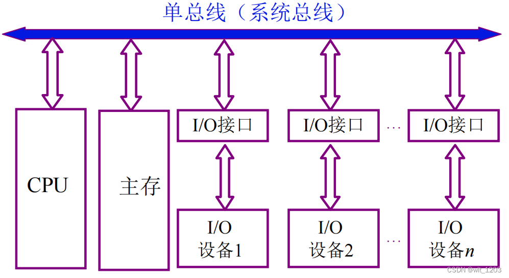
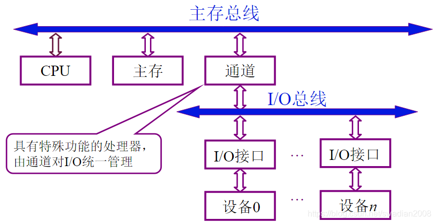
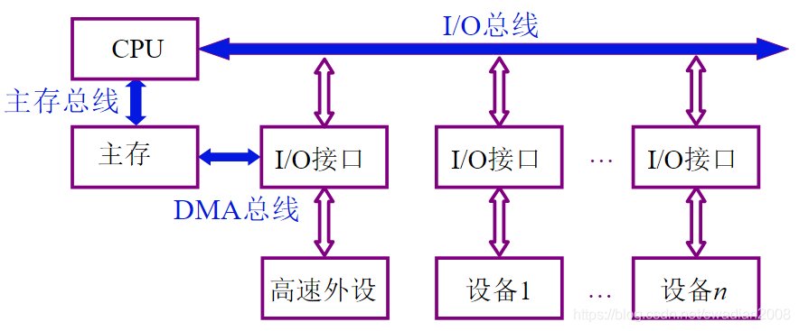
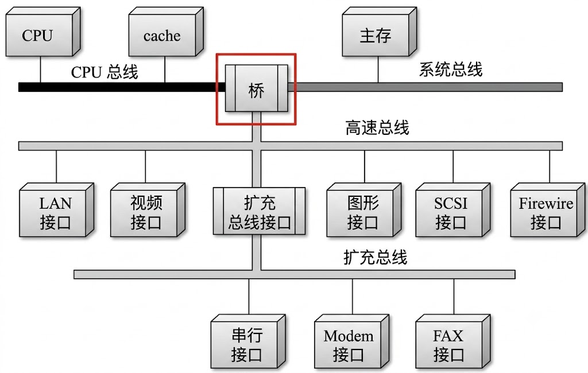
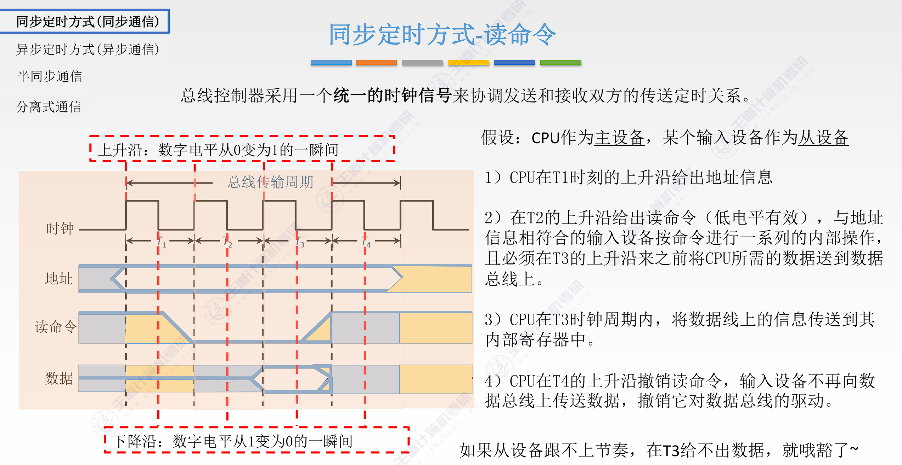
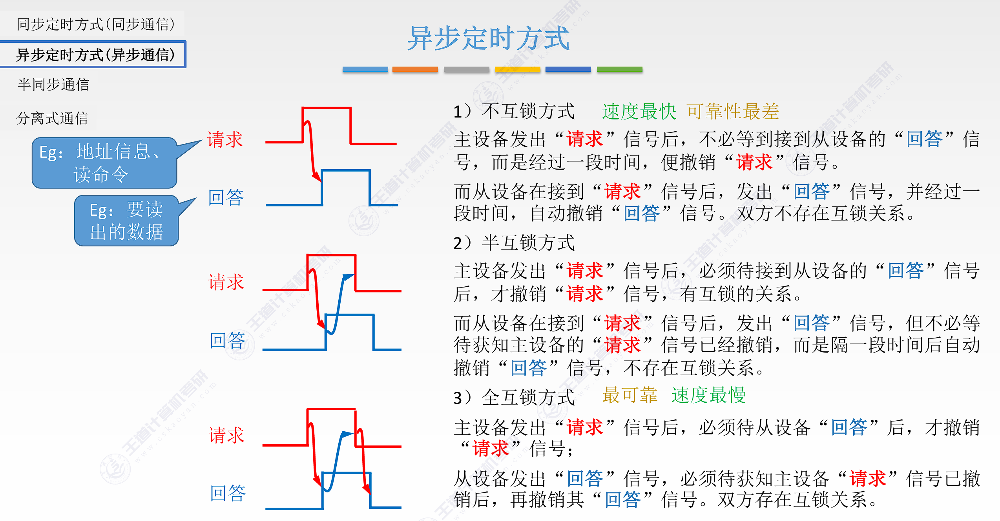

<h2 align="center">第六章 总线系统</h2>

> **408 高频考点提醒**：
>
> **总线基础**
> - 总线的两个核心特点：**分时** + **共享**；三大特性：物理/功能/电气/时间
> - 主设备（有控制权，发起传输）vs 从设备（响应传输）
> - 数据总线（双向）/ 地址总线（单向）/ 控制总线（方向固定）
> - 按功能分类：内部总线 → 系统总线（数据+地址+控制）→ I/O 总线
>
> **总线结构与性能**
> - 单/双/三/四总线结构演进：从共享瓶颈 → 分级专用 → 桥接互联
> - 桥接器（连接/缓冲/转换/控制）、速度分级（近 CPU 快）、遵循标准
> - 总线带宽 = 宽度 × 频率；DDR 带宽 = 宽度 × 频率 × 2
>
> **猝发传输计算（408 高频计算题）**
> - 猝发 = 一次地址 + N 次连续数据；普通 = N × (地址+数据)
> - DDR 双沿：一个时钟传两次数据，传 128 位需的数据周期减半
> - 注意区分：时钟频率/数据宽度/DDR 双沿/猝发 四个因素的组合计算
>
> **总线定时**
> - 同步：统一时钟，按最慢设备设计 → 简单但浪费
> - 异步：握手信号，三种互锁方式 → 灵活但复杂
> - 全互锁流程：REQ→ACK→REQ撤→ACK撤（完整四步闭环）
> - 异步优点（速度快设备不拖慢、可靠）、缺点（控制复杂、握手开销）
>
> **总线标准（12 种，408 常考 PCIe/USB/SATA）**
> - ISA（16bit/8MB/s）→ EISA（32bit/33MB/s）→ VESA（局部总线）→ PCI（32-64bit/133MB/s）
> - AGP（显卡专用/2.1GB/s）→ PCIe（串行差分/3.0 x16=16GB/s，现代主流）
> - USB（热插拔/3.0=5Gbps/4.0=40Gbps）、SATA（硬盘/6Gbps）
> - 串行已全面取代并行（PCIe/USB/SATA）：克服高频串扰和时钟偏移
> - RS-232（低速串口）、I²C（2线）、SPI（4线）为嵌入式常用
>
> **总线标准**
> - 串行总线已成为主流（PCIe/USB/SATA）：克服了并行高频串扰和时钟偏移
> - 常见标准带宽数量级：PCIe 3.0 x16 ≈ 16 GB/s、USB 3.0 ≈ 5 Gbps、SATA ≈ 6 Gbps

---

### （一）总线概述

#### 一、总线基本概念

##### 1. 总线的定义

**总线（Bus）** 是一组能为多个部件**分时共享**的公共信息传送线路。

| 特点 | 含义 |
|:---|:---|
| **共享** | 总线上可以挂接多个部件，各个部件之间互相交换的信息都可以通过这组线路分时共享 |
| **分时** | 同一时刻**只允许有一个部件**向总线发送信息；如果系统中有多个部件，则只能分时地向总线发送信息 |

```
         CPU ──────┐
                   │
  main memory ─────┬──── bus
                   │
         I/O ──────┘

shared = multiple devices on the same bus
time-shared = only one master can send at a time
```
图：CPU、主存与 I/O 设备分时共享同一条总线。

##### 2. 总线设备

总线上所连接的设备，按其对总线**有无控制功能**分类：

| 设备类型 | 定义 | 功能 | 示例 |
|:---|:---|:---|:---|
| **主设备（Master）** | 对总线有**控制权**的设备 | 可以发起总线请求，控制总线进行数据传输 | CPU、DMA 控制器 |
| **从设备（Slave）** | 对总线**没有控制权**的设备 | 只能响应主设备的命令，不能主动发起传输 | 主存、I/O 接口 |

> 一次总线传输中，主设备发出地址和命令，从设备响应。总线仲裁决定哪个主设备获得总线控制权。

##### 3. 总线的特性

总线的特性可分为四个方面：

| 特性 | 说明 | 示例 |
|:---|:---|:---|
| **物理特性** | 总线的物理形态：线数、插槽尺寸、引脚排列 | PCIe x16 插槽、DIMM 插槽 |
| **功能特性** | 每根信号线的功能定义 | 地址线、数据线、控制线各自的功能 |
| **电气特性** | 信号电平标准、驱动能力 | TTL 电平（0~0.8V 为低，2.0~5V 为高）、差分信号（LVDS） |
| **时间特性** | 信号的时序关系、建立时间、保持时间 | 同步时序（统一时钟）/ 异步时序（握手信号） |

##### 4. 总线的基本组成

```
bus = data bus + address bus + control bus

   ┌───────────────┐
   │  data bus     │  ← bidirectional; transfers data (width = data per transfer)
   ├───────────────┤
   │  address bus  │  ← one-way (CPU→device); transfers address (width = address range)
   ├───────────────┤
   │  control bus  │  ← fixed direction; transfers control & status signals
   └───────────────┘
```
图：总线由数据总线（双向）、地址总线（单向）和控制总线（方向固定）三类信号线组成。

| 总线类型 | 方向 | 功能 | 示例 |
|:---|:---|:---|:---|
| **数据总线** | 双向 | 传输数据 | 32/64 根 |
| **地址总线** | 单向 | 传输要访问的地址 | 寻址 $2^n$ 个单元 |
| **控制总线** | 每根方向固定 | 传输控制/状态信号 | 读/写信号、中断请求、时钟 |

##### 5. 总线的猝发传输方式

**猝发传输（Burst Transfer）**：在一个总线周期内传输存储地址**连续**的多个数据字。只需传一次地址，后续数据连续传送。

- 普通传输：每传一个数据需要**地址阶段 + 数据阶段**
- 猝发传输：只传一次地址，连续传 N 个数据，大幅提高效率

**示例**：某同步总线时钟频率为 100 MHz，宽度为 32 位，地址/数据线复用，每传一个地址或数据占用一个时钟周期。若该总线支持猝发传输，一次"主存写"总线事务传输 128 位数据所需的最少时间是多少？

```
解：
  总线频率 100 MHz → 时钟周期 T = 10 ns
  总线宽度 = 32 bit = 4 B，每个时钟周期传送 32 位

  猝发式发送：只需一次地址阶段，后续连续传输数据

  ① 传地址：1 个时钟周期 = 10 ns
  ② 传数据：128 bit ÷ 32 bit = 4 个数据，需要 4 个时钟周期 = 40 ns

  总时间 = 10 ns + 40 ns = 50 ns
```

> 若非猝发传输，每传一个 32 位数据都需要地址+数据阶段，128 位需 $4 \times (10+10) = 80$ ns。猝发节省了 3 次地址传送时间。

---

#### 二、总线的分类

##### 1. 按连接部件分类

| 类型 | 连接范围 | 功能 | 示例 |
|:---|:---|:---|:---|
| **片内总线** | CPU 芯片内部 | 连接 ALU、寄存器、控制器 | CPU 内部数据通路 |
| **系统总线** | CPU、主存、I/O 之间 | 连接计算机五大部件 | PCIe、ISA |
| **通信总线** | 计算机系统之间 | 计算机与外设/网络通信 | USB、SATA、RS-232 |
| **局部总线** | CPU 与高速外设之间 | 高速数据传输（不经系统总线） | AGP、PCIe x16 |

##### 2. 按数据传输方式分类

| 类型 | 传输方式 | 特点 | 适用 |
|:---|:---|:---|:---|
| **串行总线** | 一条数据线逐位传输 | 线路少、成本低、适合远距离 | USB、SATA、PCIe |
| **并行总线** | 多条数据线同时传输 | 速度快、但信号同步难、距离受限 | 老式 IDE、PCI（已被串行替代） |

> 现代高速总线（PCIe、USB 3.0+、SATA）已全面转向**串行传输**——因为高频并行信号间的串扰和时钟偏移问题无法克服。

##### 3. 按功能分类（按在计算机系统中的位置）

| 类型 | 连接范围 | 功能 | 示例 |
|:---|:---|:---|:---|
| **内部总线** | CPU 芯片内部 | 连接 CPU 内部的寄存器、运算器（ALU）及控制器各部件 | CPU 内部数据通路 |
| **系统总线** | CPU 与主存、高速 I/O 之间 | 连接计算机系统中各高速功能部件；按传输信息内容又分为**数据总线、地址总线、控制总线** | PCIe、ISA |
| <nobr>**I/O 总线**</nobr> | 中低速 I/O 设备之间 | 连接中低速 I/O 设备，经 I/O 控制器桥接到系统总线 | USB、SATA、RS-232 |

**系统总线的三个子类**：

| 子类 | 方向 | 功能 | 宽度决定因素 |
|:---|:---|:---|:---|
| **数据总线** | 双向 | 传输数据信息 | 宽度决定每次传输的数据量（通常 = 机器字长或其整数倍） |
| **地址总线** | 单向（CPU→设备） | 传输要访问的地址 | 宽度决定最大寻址范围（$n$ 位 → $2^n$ 个单元） |
| **控制总线** | 每根线方向固定 | 传输控制和状态信号 | 取决于系统需要（读/写、中断请求、时钟、复位等） |

> 内部总线 → 系统总线 → I/O 总线，从内向外逐层扩展。系统总线是其中的核心——数据总线、地址总线、控制总线三者统称系统总线。

##### 4. 按时序控制方式分类

| 类型 | 控制方式 | 特点 |
|:---|:---|:---|
| **同步总线** | 所有设备共用同一时钟 | 控制简单，但按最慢设备设计 |
| **异步总线** | 握手信号协调（请求-应答） | 灵活、速度快，但控制复杂 |

---

#### 三、系统总线的结构

##### 1. 单总线结构

所有设备挂在同一条系统总线上。



| 优点 | 缺点 |
|:---|:---|
| 结构简单、成本低、易于扩展 | 总线成为瓶颈——所有传输争用同一条总线 |

##### 2. 双总线结构

CPU 与主存之间增加一条**专用存储总线**，与 I/O 总线分离。



| 优点 | 缺点 |
|:---|:---|
| 主存与 I/O 可并行传输，缓解瓶颈 | 硬件成本增加 |

##### 3. 三总线结构

引入高速**局部总线**连接 CPU 与高速外设（如显卡），低速 I/O 通过扩展总线连接。



> **教材口径对照**（教材 6.1.3，页169）：教材另有一套"三总线"定义——3 条总线分别为**主存总线**（CPU 与主存之间）、**I/O 总线**（中低速 I/O 之间）、**直接内存访问 DMA 总线**（高速外设与主存间直接传数据），与笔记现行"三总线＝局部总线＋扩展总线"（王道口径）并行存在，两者可作对照理解。

##### 4. 四总线结构

现代计算机多级总线结构的三个关键要点：

| 要点         | 说明                                                         |
| :----------- | :----------------------------------------------------------- |
| **桥接器**   | 用于连接不同的总线，具有数据缓冲、信号转换和控制功能         |
| **速度分级** | **靠近 CPU 的总线速度较快**（局部总线 > 存储总线 > 高速 I/O > 扩展总线） |
| **遵循标准** | 每级总线的设计遵循相应的总线标准（PCIe / USB / SATA 等）     |

##### 5. 四种总线结构对比

| 结构 | 总线数量 | 带宽 | 成本 | 典型应用 |
|:---|:---:|:---|:---|:---|
| **单总线** | 1 | 最低 | 最低 | 早期 PC |
| **双总线** | 2 | 中等 | 中等 | 嵌入式系统 |
| **三总线** | 3 | 高 | 较高 | 早期 Pentium PC |
| **四总线** | 4 | 最高 | 最高 | 现代 PC（PCIe 分级 + 芯片组） |

---

#### 四、总线的性能指标

| 指标 | 含义 | 单位 | 公式 |
|:---|:---|:---|:---|
| **总线宽度** | 数据总线的根数（一次传输的位数） | bit | — |
| **总线工作频率** | 总线上各种操作的频率，**＝总线周期的倒数** | Hz | $f = 1/T$ |
| **总线时钟频率** | 即机器时钟频率，**＝时钟周期的倒数** | Hz | $f = 1/T$ |
| **总线带宽** | 单位时间内总线能传输的最大数据量 | B/s | $B = W \times f$ |
| **总线时钟周期** | 即机器时钟周期 | s | $T = 1/f$ |
| **总线周期** | 一次总线操作（申请/寻址/传输/结束）所需时间，**通常由若干个总线时钟周期构成** | s | — |
| **时钟同步方式** | 同步/异步方式影响实际传输效率 | — | — |

> **工作频率 ≠ 时钟频率**（教材 6.1.4，页170）：总线**工作频率**是**总线周期**（一次总线操作）的倒数；总线**时钟频率**是**（总线）时钟周期**的倒数。二者仅当一个总线周期恰好等于一个时钟周期时才相等；一般情况下一个**总线周期＝一次总线操作（申请/寻址/传输/结束），由若干个总线时钟周期构成**。计算带宽用工作频率：$B = \text{宽度}(\text{字节}) \times f$，其中宽度（字节）＝宽度（bit）÷8。

**总线带宽计算示例**：

$$
\text{总线带宽} = \text{总线宽度} \times \text{总线频率}
$$

> 若总线宽度 64 bit（= 8 B），频率 100 MHz，则带宽 = $8 \times 100 \times 10^6 = 800$ MB/s。

> DDR（Double Data Rate）总线每个时钟周期传输两次数据（上升沿 + 下降沿各一次），带宽 = 宽度 × 频率 × 2。

**DDR 猝发传输示例**：某同步总线采用地址/数据线复用，32 根线，时钟频率 66 MHz，每个时钟周期传送两次数据（DDR 双沿传输）。若该总线支持猝发传输，传输一个地址占用一个时钟周期，一次"主存写"传输 128 位数据至少需要多少时间？

```
解：
  时钟周期 T = 1 / 66 MHz ≈ 15 ns
  总线宽度 32 bit，DDR 双沿 = 每时钟传 64 bit

  ① 发首地址：1 个时钟周期
  ② 传数据：128 bit ÷ 64 bit/周期 = 2 个时钟周期

  总时间 = (1 + 2) × 15 ns = 45 ns
```

> 对比普通传输（非 DDR + 非猝发）：$4 \times (15+15) = 120$ ns。DDR + 猝发的组合使传输时间缩短了近 3 倍。

---

### （二）总线操作和定时

#### 一、4 个阶段


```
  ┌───────────────────┐    ┌───────────────────┐    ┌───────────────────┐    ┌───────────────────┐
  │ (1) bus request   │───▶│ (2) addressing    │───▶│ (3) data transfer │───▶│ (4) release       │
  └───────────────────┘    └───────────────────┘    └───────────────────┘    └───────────────────┘
```
图：一次总线操作分为申请分配、寻址、数据传输、结束释放四个阶段。

| 阶段 | 操作 | 说明 |
|:---|:---|:---|
| **① 申请分配** | 主设备申请总线使用权，仲裁器裁决分配给谁 | 总线仲裁（集中式/分布式） |
| **② 寻址** | 主设备发出从设备地址和命令（读/写） | 地址总线 + 控制总线 |
| **③ 数据传输** | 主设备与从设备之间实际传送数据 | 数据总线（读/写） |
| **④ 结束释放** | 传输完毕，主设备释放总线控制权 | 撤销控制信号 |

---

#### 二、同步定时方式

所有设备共用**统一时钟信号**，数据在固定的时钟节拍传输。



| 优点 | 缺点 |
|:---|:---|
| 控制简单、实现成本低 | 按最慢设备设计时钟周期，快设备被拖慢 |
| 时序规整、易于验证 | 不适合速度差异大的多设备混合系统 |

---

#### 三、异步定时方式

不使用统一时钟，通过**握手信号**（请求 Request + 应答 Acknowledge）协调传输。



**握手方式分类**：

| 方式 | 握手信号 | 特点 |
|:---|:---|:---|
| **不互锁** | REQ 发出后等固定时间即撤消（不等 ACK） | 简单但不可靠 |
| **半互锁** | REQ 发出后等 ACK 到达才撤消；ACK 等固定时间撤消 | 主设备等从设备 |
| **全互锁** | 双方互相等待——REQ 等 ACK，ACK 等 REQ 撤销后才撤销 | 最可靠，速度最慢（双方互相等待、握手开销最大） |

> **全互锁**是最可靠的异步方式：主设备发出 REQ → 从设备响应 ACK → 主设备撤 REQ → 从设备撤 ACK。每一步都依赖对方的响应，形成完整闭环。

| 优点 | 缺点 |
|:---|:---|
| 不同速度的设备可按各自节奏通信，不拖慢快设备 | 控制逻辑复杂（需握手电路和超时检测） |
| 可靠性高（握手确认每次传输） | 每次传输都有握手开销，延迟较大 |
| 适合设备速度差异大的混合系统 | 硬件成本高于同步方式 |

**同步 vs 异步 对比**：

| 维度 | 同步定时 | 异步定时 |
|:---|:---|:---|
| 时钟信号 | 统一时钟 | 无统一时钟（握手） |
| 速度 | 受最慢设备限制 | 不同设备可不同速度 |
| 控制复杂度 | 简单 | 复杂 |
| 可靠性 | 依赖时钟同步 | 握手确认，更可靠 |
| 适用场景 | 设备速度相近 | 设备速度差异大 |

---

### （三）总线标准

总线标准定义了总线的物理规范、电气特性、时序协议，使不同厂商的设备能够**互连互通**。其主要区别是总线宽度、带宽、时钟频率、寻址能力、是否支持猝发传送等。

#### 一、常见总线标准详解

##### 1. ISA 总线

ISA（Industry Standard Architecture，工业标准体系结构）是最早出现的微型计算机系统总线标准，应用在 IBM 的 AT 机上。

- 工作频率 8 MHz，数据线 8/16 位，最大速度 8 MB/s
- 已完全淘汰

##### 2. EISA 总线

EISA（Extended ISA，扩展的 ISA 总线）是为配合 32 位 CPU 而设计的总线扩展标准，**对 ISA 完全兼容**。

- 工作频率 8 MHz，数据线 32 位，最大速度 33 MB/s
- 已淘汰

##### 3. VESA 总线

VESA（Video Electronics Standards Association，视频电子标准协会）是一个 32 位标准的计算机**局部总线**，针对多媒体 PC 高速传送活动图像的大量数据应运而生。

- 工作频率 33 MHz，数据线 32 位，最大速度 133 MB/s
- 已被 PCI 和 AGP 取代

##### 4. PCI 总线

PCI（Peripheral Component Interconnect，外部设备互连）是高性能的 32 位或 64 位总线，专为高度集成的外围部件、扩充插板和处理器/存储器系统而设计。

- 工作频率 33/66 MHz，数据线 32/64 位，最大速度 133~533 MB/s
- 支持猝发传输、即插即用；常用适配器：显卡、声卡、网卡

##### 5. PCI-Express（PCIe）

PCIe 是最新的总线和接口标准，**全面取代 PCI 和 AGP**，最终实现总线标准的统一。

- 采用**串行差分传输**，x1/x4/x8/x16 通道可配置
- 3.0 版本：x1 ≈ 1 GB/s，x16 ≈ 16 GB/s
- 现代 PC 主流扩展总线（显卡、NVMe SSD、网卡）

##### 6. AGP 总线

AGP（Accelerated Graphics Port，加速图形接口）是一种**视频接口标准**，专用于连接主存和图形存储器，属于局部总线。

- 工作频率 66 MHz，32 位数据线，8× 模式最大 2.1 GB/s
- 已被 PCIe x16 取代

##### 7. RS-232C 总线

RS-232C 是由美国电子工业协会（EIA）推荐的**串行通信总线标准**，应用于串行二进制交换的数据终端设备（DTE）和数据通信设备（DCE）之间。

- 低速串行（≤115.2 Kbps），常用于工业控制和调试串口

##### 8. USB 总线

USB（Universal Serial Bus，通用串行总线）是连接外部设备的 I/O 总线标准，属于设备总线。

- 即插即用、**热插拔**，有很强的连接能力（最多 127 个设备）
- USB 3.0: 5 Gbps，USB 4.0: 40 Gbps

##### 9. IDE 总线

IDE（Integrated Drive Electronics，集成设备电路）是硬盘和光驱通过 IDE 接口与主板连接的标准。已逐步被 SATA 取代。

##### 10. SATA 总线

SATA（Serial Advanced Technology Attachment，串行高级技术附件）是基于行业标准的串行硬件驱动器接口，由 Intel、IBM、Dell 等公司共同提出。

- 串行差分传输，SATA 3.0 最大 6 Gbps
- 当前主流硬盘/SSD 接口（高端 SSD 转向 NVMe/PCIe）

##### 11. SCSI 总线

SCSI（Small Computer System Interface，小型计算机系统接口）是一种用于计算机和智能设备之间系统级接口的独立处理器标准。智能通用接口，常用于服务器级磁盘。

##### 12. PCMCIA

PCMCIA（Personal Computer Memory Card International Association）是广泛应用于笔记本电脑中的接口标准，小型扩展插槽，具有即插即用功能。

---

#### 二、总线标准速度对比总表

| 标准 | 全称 | 工作频率 | 数据线 | 最大速度 | 猝发 |
|:---|:---|:---:|:---:|:---|:---:|
| **ISA** | Industry Standard Architecture | 8 MHz | 8/16 bit | 8 MB/s | 否 |
| **EISA** | Extended ISA | 8 MHz | 32 bit | 33 MB/s | 是 |
| **VESA** | Video Electronics Standards Assoc. | 33 MHz | 32 bit | 133 MB/s | 是 |
| **PCI** | Peripheral Component Interconnect | 33/66 MHz | 32/64 bit | 133~533 MB/s | **是** |
| **AGP** | Accelerated Graphics Port | 66 MHz | 32 bit | 2.1 GB/s (8×) | **是** |
| **PCIe** | PCI Express | 串行 | x1/x4/x8/x16 | 16 GB/s (3.0 x16) | **是** |
| **USB** | Universal Serial Bus | 串行 | 1 对差分线 | 40 Gbps (4.0) | 是 |
| **SATA** | Serial ATA | 串行 | 1 对差分线 | 6 Gbps (3.0) | 是 |
| **RS-232** | Recommended Standard | — | 1 位 | 115 Kbps | 否 |
| **IDE** | Integrated Drive Electronics | — | 16 bit | 100 MB/s | — |
| **SCSI** | Small Computer System Interface | — | 8/16 bit | 640 MB/s | 是 |

> 从 ISA（8 MB/s）到 PCIe 3.0 x16（16 GB/s），总线带宽提升了 **2000 倍**。现代总线全面转向**串行高速差分传输**（PCIe、USB、SATA）。

#### 三、总线标准速查表

| 标准 | 全称 | 类型 | 位数/通道 | 带宽 | 应用 |
|:---|:---|:---|:---|:---|:---|
| **ISA** | Industry Standard Architecture | 并行 | 16 bit | 8 MB/s | 早期 PC（已淘汰） |
| **PCI** | Peripheral Component Interconnect | 并行 | 32/64 bit | 133 MB/s (32bit/33MHz) | 早期 PC 扩展卡 |
| **PCIe** | PCI Express | 串行 | x1/x4/x8/x16 通道 | x1: 1 GB/s, x16: 16 GB/s (3.0) | 显卡、SSD、扩展卡 |
| **AGP** | Accelerated Graphics Port | 并行 | 32 bit | 2.1 GB/s (8×模式) | 早期显卡接口（已淘汰） |
| **USB** | Universal Serial Bus | 串行 | 1 对差分线 | 3.0: 5 Gbps, 4.0: 40 Gbps | 外设（键鼠/U盘/移动硬盘） |
| **SATA** | Serial ATA | 串行 | 1 对差分线 | 6 Gbps (3.0) | 硬盘/SSD 接口 |
| <nobr>**RS-232**</nobr> | — | 串行 | 1 位 | ≤115.2 Kbps | 工业控制、调试串口 |
| **I²C** | Inter-Integrated Circuit | 串行 | 2 线（SCL+SDA） | 400 Kbps~3.4 Mbps | 嵌入式传感器通信 |
| **SPI** | Serial Peripheral Interface | 串行 | 4 线（MOSI/MISO/SCK/CS） | 几十 Mbps | 嵌入式 Flash/SD 卡通信 |

---

### （四）本章总结

**知识结构图**：

```
第六章 总线系统
│
├── （一）总线概述
│   ├── 一、总线基本概念
│   │   ├── 1. 总线的定义（分时 + 共享）
│   │   ├── 2. 总线设备（主设备/从设备 + 总线仲裁）
│   │   ├── 3. 总线的特性（物理/功能/电气/时间 四维度）
│   │   ├── 4. 总线的基本组成（数据/地址/控制总线）
│   │   └── 5. 猝发传输（定义 + 2 个计算示例：100MHz 50ns / 66MHz DDR 45ns）
│   ├── 二、总线的分类
│   │   ├── 1. 按连接部件（片内/系统/通信/局部）
│   │   ├── 2. 按数据传输方式（串行/并行 + 现代转向串行原因）
│   │   ├── 3. 按功能/位置（内部总线/系统总线/I/O总线 + 系统总线三子类）
│   │   └── 4. 按时序控制（同步/异步）
│   ├── 三、系统总线的结构
│   │   ├── 1. 单总线 → 2. 双总线 → 3. 三总线（教材：主存 + I/O + DMA；另：局部 + 扩展）→ 4. 四总线（ASCII 图 + 速度表）
│   │   ├── 5. 四种结构对比表（数量/带宽/成本/典型应用）
│   │   └── 6. 四总线结构简介（桥接器/速度分级/遵循标准）
│   └── 四、性能指标（宽度 / 工作频率=1/总线周期≠时钟频率 / 带宽 B=W×f / 总线周期=若干时钟周期 + DDR 计算示例）
│
├── （二）总线操作和定时
│   ├── 一、4 阶段流程（申请→寻址→数据传输→释放 + 仲裁说明）
│   ├── 二、同步定时（统一时钟 + ASCII 时序图 + 优缺点表）
│   └── 三、异步定时（REQ-ACK 握手 + 不互锁/半互锁/全互锁 + 优缺点表 + 同步vs异步五维对比）
│
└── （三）总线标准
    ├── 一、12 种标准详解（ISA/EISA/VESA/PCI/PCIe/AGP/RS-232/USB/IDE/SATA/SCSI/PCMCIA）
    ├── 二、速度对比总表（频率/数据线/最大速度/猝发 五维 + ISA→PCIe 2000倍提升）
    └── 三、速查表（9 种常用标准 + 位数/通道/带宽/应用）
```

**高频考点速记**：

| 考点 | 一句话记忆 |
|:---|:---|
| 总线定义 | 一组**分时共享**的公共线路：共享 = 多部件挂接，**分时 = 同一时刻只允许一个部件发送** |
| 总线设备 | **主设备**（CPU/DMA，有控制权，发起传输）vs **从设备**（主存/I/O 接口，只能响应）；总线仲裁决定控制权归属 |
| 总线特性 | **物理 / 功能 / 电气 / 时间**四特性；时间特性分为同步时序与异步握手时序 |
| 总线组成 | **数据总线双向**、**地址总线单向**（n 位可寻址 2^n 个单元）、**控制总线方向固定** |
| 猝发传输 | **只传一次地址**，连续传 N 个数据；普通传输每传一个数据都要"地址 + 数据"两阶段 |
| 猝发计算示例 | 100 MHz（T=10ns）、32 位总线传 128 位：**1×10ns（地址）+ 4×10ns（数据）= 50ns**；非猝发需 80ns |
| 按连接部件分类 | **片内总线**（CPU 内部）/ **系统总线**（五大部件）/ **通信总线**（系统之间）/ **局部总线**（CPU 与高速外设） |
| 串行 vs 并行 | 串行**线路少、成本低、适合远距离**；并行快但**高频串扰与时钟偏移**难克服——现代全面转向串行 |
| 按功能分类 | 内部总线 → **系统总线**（数据 + 地址 + 控制三子类）→ I/O 总线，从内向外逐层扩展 |
| 系统总线子类 | 数据总线宽度 = 每次传输数据量；地址总线宽度 = **最大寻址范围 2^n**；控制总线每根方向固定 |
| 总线结构演进 | **单总线**（瓶颈）→ **双总线**（存储总线分离，主存与 I/O 并行）→ **三总线**（局部总线接高速外设；教材口径＝主存总线 + I/O 总线 + DMA 总线）→ **四总线**（分级桥接） |
| 四总线三要点 | **桥接器**（连接/缓冲/转换）、**速度分级**（近 CPU 快：局部 > 存储 > 高速 I/O > 扩展）、**遵循标准** |
| 总线带宽 | 带宽 **B = 宽度 W × 频率 f**；64 bit（8 B）× 100 MHz = **800 MB/s** |
| 频率口径 | 总线**工作频率**＝总线周期（一次总线操作）的倒数；**时钟频率**＝时钟周期的倒数；**一个总线周期由若干个时钟周期构成**（≠时钟周期） |
| DDR 带宽 | **DDR 每个时钟周期传两次**（上升沿 + 下降沿），带宽 = 宽度 × 频率 × **2** |
| DDR 猝发示例 | 66 MHz（T≈15ns）、32 线 DDR（每周期 64 bit）传 128 位：**(1+2)×15 = 45ns**；普通传输需 120ns |
| 总线操作 4 阶段 | **① 申请分配（仲裁）→ ② 寻址（地址 + 命令）→ ③ 数据传输 → ④ 结束释放** |
| 同步定时 | **统一时钟**，按**最慢设备**设计节拍——控制简单但快设备被拖慢 |
| 异步定时 | **REQ/ACK 握手**，无统一时钟，快慢设备各按节奏——灵活可靠但控制复杂、有握手开销 |
| 三种互锁 | **不互锁**（REQ 定时撤，简单不可靠）→ **半互锁**（主等 ACK）→ **全互锁**（双方互相等待，**最可靠但速度最慢**） |
| 全互锁闭环 | **REQ → ACK → REQ 撤 → ACK 撤**，每一步都依赖对方的响应 |
| 总线标准演进 | ISA（8 MB/s）→ EISA（33 MB/s）→ VESA（133 MB/s，局部总线）→ **PCI**（133~533 MB/s，猝发/即插即用）→ **PCIe** |
| PCIe | **串行差分**、x1/x4/x8/x16 通道可配置，**3.0 x16 ≈ 16 GB/s**，全面取代 PCI 与 AGP |
| AGP | 显卡专用视频**局部总线**，66 MHz，8× 模式 **2.1 GB/s**，已被 PCIe x16 取代 |
| USB / SATA | USB 即插即用**热插拔**（最多 127 个设备），**3.0 = 5 Gbps、4.0 = 40 Gbps**；SATA 3.0 = **6 Gbps**（硬盘/SSD） |
| 低速/嵌入式标准 | **RS-232**（≤115.2 Kbps 调试串口）、**I²C**（2 线 SCL+SDA）、**SPI**（4 线 MOSI/MISO/SCK/CS） |
| 带宽量级 | ISA→PCIe 3.0 x16 提升约 **2000 倍**；常考数量级：PCIe 3.0 x16≈16 GB/s、USB 3.0≈5 Gbps、SATA≈6 Gbps |
