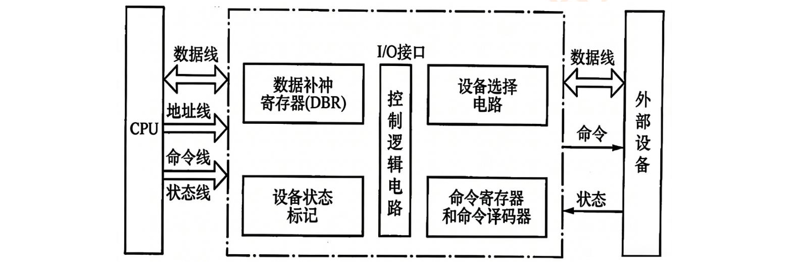
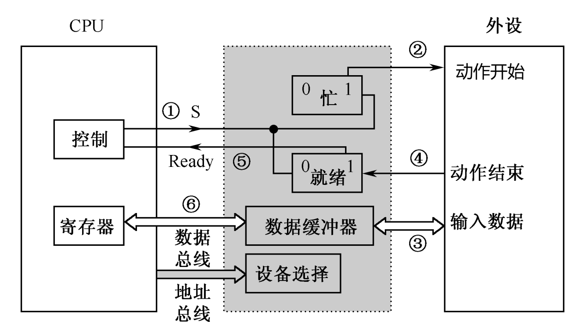
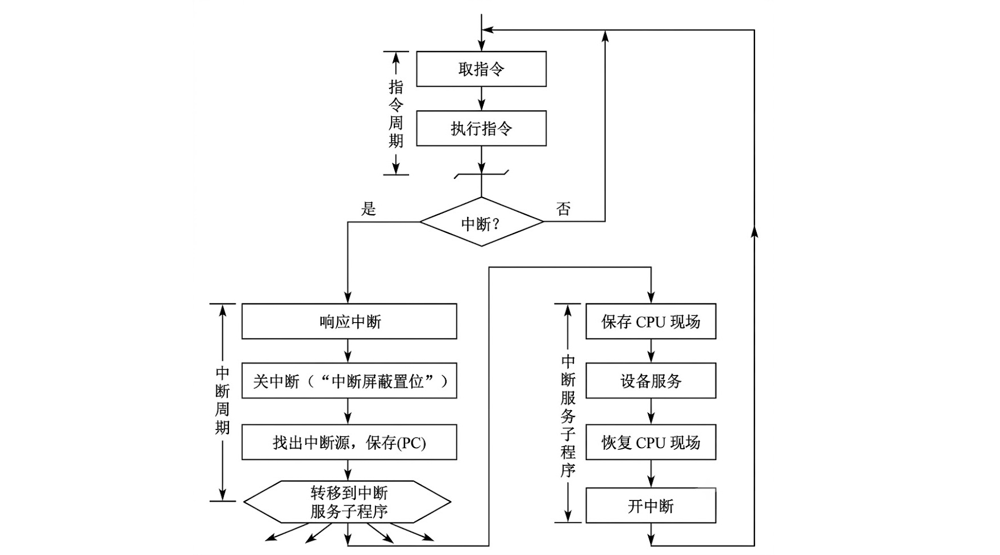
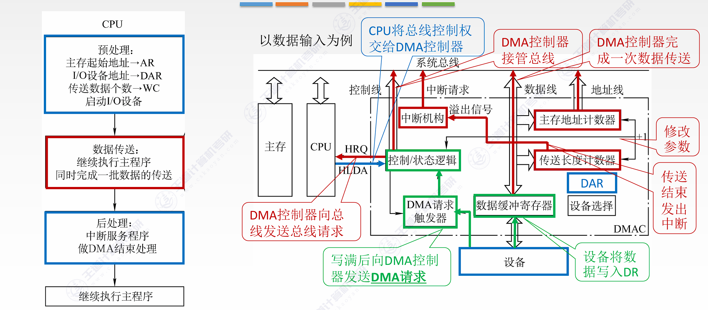
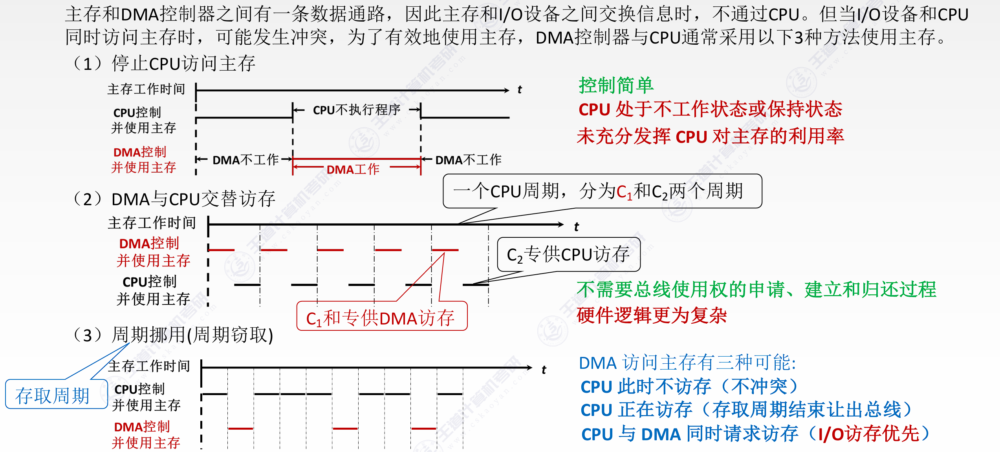

<h2 align="center">第七章 输入输出系统</h2>

> **408 高频考点提醒**：
>
> **I/O 基础与磁盘**
> - I/O 四种控制方式演进：查询→中断→DMA→通道，CPU 介入越来越少
> - 统一编址（MOV 访问，ARM/MIPS）vs 独立编址（IN/OUT，x86）
> - 磁盘平均存取时间 = 寻道时间 + 旋转延迟（半圈） + 传输时间 + 控制器延迟
> - 磁盘数据传输率计算：转速(r/s) × 每道扇区数 × 扇区大小
> - RAID 0（条带/无冗余）→ RAID 1（镜像）→ RAID 5（分布式校验，无专用盘）→ RAID 10（1+0）
>
> **程序查询 vs 中断**
> - 程序查询：CPU 全程循环等待，与外设串行工作，效率最低
> - 程序中断：外设主动发 INTR，CPU 与外设并行，效率高
> - 单重中断（不允许嵌套）vs 多重中断（允许高优先级打断低优先级）
> - 多重中断条件：提前开中断 + 高优先级可打断低优先级
> - 屏蔽字：1=屏蔽 / 0=允许，动态修改实现优先级控制
>
> **DMA 方式（核心考点）**
> - DMA = 硬件控制 + 无需 CPU 干预 + 块传送 + DMAC 接管总线
> - DMAC 组成：MAR（地址自动+1）+ WC（计数自动−1，到0结束）+ 数据缓冲 + 控制/状态 + 中断逻辑
> - DMA 三阶段：预处理（CPU 设置参数）→ 数据传送（DMAC 控制）→ 后处理（中断通知 CPU）
> - DMA 三种方式：停止 CPU（最简单）/ 交替访问（效率最高）/ 周期挪用（折中，最常用）
> - 周期挪用三种冲突：①CPU不访存→不冲突 ②CPU正访存→等周期结束 ③同时请求→CPU让步
> - DMA vs 中断七维度：块 vs 字 / 不占CPU vs 每次响应 / 机器周期末 vs 指令末 / 硬件 vs 程序 / 优先级高
> - DMA 中断仅用于故障和传送结束——不像中断方式每次传送都触发中断

---

### （一）I/O 系统基本概念

#### 一、输入输出系统概述

##### 1. I/O 系统的组成

输入输出系统是计算机与外界进行数据交换的桥梁，由以下部分构成：

| 组成部分 | 说明 | 示例 |
|:---|:---|:---|
| **I/O 设备（外设）** | 输入设备、输出设备、外存储器 | 键盘、显示器、磁盘 |
| **I/O 接口** | CPU 与外设之间的连接电路 | 串口控制器、USB 控制器 |
| **I/O 总线** | 连接 CPU、主存和 I/O 接口的传输线路 | PCIe、USB、SATA |
| **I/O 软件** | 驱动程序、中断服务程序 | 设备驱动、BIOS |

##### 2. I/O 系统的功能

| 功能 | 说明 |
|:---|:---|
| **数据缓冲** | 匹配 CPU 与外设的速度差异（CPU 快、外设慢） |
| **信号转换** | 电平转换、串并转换、模数转换 |
| **数据格式转换** | 并行 ↔ 串行、编码格式转换 |
| **差错检测** | 传输错误检测与纠正（如奇偶校验、CRC） |
| **设备选择** | 通过地址译码选中指定 I/O 设备 |
| **中断管理** | 处理外设的中断请求，响应和优先级仲裁 |

##### 3. I/O 系统的基本结构

```
  CPU                  I/O interface                 I/O device
  ┌──────┐             ┌───────────────┐             ┌────────────┐
  │      │ address bus │               │ data lines  │            │
  │ CPU  │ ◄─────────▶ │ I/O interface │ ◄─────────▶ │ I/O device │
  │      │  data bus   │               │control lines│            │
  └──────┘ control bus └───────────────┘             └────────────┘
```
图：I/O 接口位于 CPU 与外设之间：面向 CPU 的一侧连接地址总线、数据总线和控制总线，面向外设的一侧通过数据线和控制线相连。

---

#### 二、I/O 控制方式

I/O 控制方式的发展经历了四个阶段，速度和 CPU 介入程度各不相同：

| 方式 | CPU 介入程度 | 数据传送单位 | 速度 | 适用场景 |
|:---|:---|:---|:---:|:---|
| **程序查询方式** | CPU **全程参与** | 字/字节 | 慢 | 简单低速设备 |
| **程序中断方式** | CPU 响应中断时介入 | 字/字节 | 中等 | 键盘、鼠标 |
| **DMA 方式** | CPU 仅在开始/结束时介入 | **块（批量）** | 快 | 磁盘、网卡 |
| **通道 / I/O 处理机** | CPU 几乎不介入 | 块/文件 | 最快 | 大型机、服务器 |

**四种方式的演进趋势**：

```
程序查询 → 程序中断 →   DMA   → 通道/I/O处理机
   │        │         │           │
   ▼        ▼         ▼           ▼
 CPU全程   CPU响应    CPU仅       CPU几乎
 参与      中断介入    启动/停止    不参与
 速度最慢 ──────────────────────▶ 速度最快
```

---

### （二）外部设备

#### 一、输入设备

| 设备 | 功能 | 原理 |
|:---|:---|:---|
| **键盘** | 字符/命令输入 | 按键扫描 → 键码（ASCII）→ 中断通知 CPU |
| **鼠标** | 位置/点击输入 | 光电/激光传感器检测位移 → 坐标增量 |
| **扫描仪** | 图像输入 | CCD 感光元件扫描 → 模数转换 → 数字图像 |
| **触摸屏** | 触控输入 | 电容/电阻感应触摸位置 |
| **麦克风** | 音频输入 | 声波 → 模拟电信号 → ADC → 数字音频 |

#### 二、输出设备

| 设备 | 功能 | 原理 |
|:---|:---|:---|
| **显示器** | 图像/文字输出 | 显存 → 扫描输出（CRT：电子束；LCD：液晶；OLED：自发光） |
| **打印机** | 纸质输出 | 激光打印机（静电成像）/ 喷墨打印机（墨滴喷射） |
| **音箱** | 音频输出 | 数字音频 → DAC → 模拟信号 → 功率放大 → 发声 |
| **投影仪** | 大屏显示 | DLP（微镜阵列）/ LCD（液晶光阀）投影 |

##### 1. 显示器的性能参数

显示器的**主要参数**包括：

| 参数 | 含义 |
|:---|:---|
| **屏幕大小** | 以屏幕对角线长度表示，常用 12~29 英寸 |
| **分辨率** | 所能表示的像素个数，用宽×高的像素乘积表示（如 1600×1200） |
| **灰度级** | 黑白显示器中像素的亮暗差别；彩色显示器中表现为颜色的种类，灰度级越多，图像层次越清楚逼真 |
| **刷新频率** | 单位时间内扫描整个屏幕内容的次数，**>30 Hz** 才不感到闪烁，通常 60~120 Hz |

**显示存储器（VRAM，也称刷新存储器）**：用于不断存储一帧图像信息以供刷新。其容量由分辨率与灰度级决定——分辨率越高、灰度级越多，VRAM 容量越大。

```
VRAM 容量 = 分辨率 × 灰度级位数
VRAM 带宽 = 分辨率 × 灰度级位数 × 帧频
```

**例题**：假定计算机的显示存储器用 DRAM 芯片实现，要求显示分辨率为 1600×1200，颜色深度为 24 位，帧频为 85 Hz，显存总带宽的 50% 用来刷新屏幕，则所需显存总带宽至少约为（ ）。

```
刷新所需带宽 = 分辨率 × 色深 × 帧频 = 1600 × 1200 × 24 bit × 85 Hz = 3916.8 Mb/s
所需显存总带宽 = 3916.8 / 0.5 = 7833.6 Mb/s ≈ 7834 Mb/s
```

> 说明：3916.8 Mb/s 是**刷新屏幕**所需的带宽；刷新仅占显存总带宽的 50%，故总带宽需加倍，得约 7834 Mb/s。

#### 三、外存储器

计算机的外存储器又称为**辅助存储器**，目前主要使用磁表面存储器（磁盘、磁带）和闪存（SSD、U 盘）。

##### 1. 磁盘存储器

**（1）磁盘设备的组成**

| 部件 | 说明 |
|:---|:---|
| **磁盘驱动器** | 核心部件是磁头组件和盘片组件 |
| **磁盘控制器** | 硬盘与主机的接口，主流标准有 IDE、SCSI、SATA 等 |
| **盘片** | 涂有磁性材料的圆盘，数据存储介质 |

一块硬盘含有若干个**记录面**，每个记录面划分为若干条**磁道**，每条磁道又划分为若干个**扇区**。**扇区（也称块）是磁盘读写的最小单位**，即磁盘按块存取。

**磁盘的关键参数**：

| 参数 | 含义 |
|:---|:---|
| **磁头数（Heads）** | 即记录面数，硬盘总共有多少个磁头 |
| **柱面数（Cylinders）** | 每面盘片上有多少条磁道；不同记录面相同编号的磁道构成一个**柱面** |
| **扇区数（Sectors）** | 每条磁道上有多少个扇区 |

**（2）磁盘的性能指标**

| 指标 | 说明 |
|:---|:---|
| **磁盘容量** | 有**格式化容量**（用户可用）和**非格式化容量**（磁化单元总数）两个指标 |
| **记录密度** | 道密度（TPI，径向单位长度的磁道数）+ 位密度（BPI，单位长度磁道可记录的位数）+ 面密度 |
| <nobr>**平均存取时间**<nobr> | = **寻道时间**（磁头移动到目标磁道）+ **旋转延迟**（磁头定位到目标扇区，平均 = 半圈时间）+ **传输时间**（实际读写数据） |
| **数据传输率** | 单位时间内读出的数据量 |

**计算示例 1**：磁盘转速 7200 转/分，每个磁道 160 个扇区，每个扇区 512 字节，求数据传输率。

```
转速 7200 r/min = 120 r/s
每秒经过扇区数 = 120 × 160 = 19200 个扇区
数据传输率 = 19200 × 512 B / 1024 = 9600 KB/s
```

**计算示例 2**：磁盘转速 10000 转/分，平均寻道时间 6 ms，传输速率 20 MB/s，控制器延迟 0.2 ms，读取一个 4 KB 扇区的平均时间。

```
平均旋转延迟 = (60 / 10000) / 2 = 3 ms         （等半圈）
平均寻道时间 = 6 ms
传输时间 = 4 KB / (20 MB/s) = 0.2 ms
控制器延迟 = 0.2 ms

总时间 = 3 + 6 + 0.2 + 0.2 = 9.4 ms
```

**计算示例 3**：磁盘转速 7200 转/分，平均寻道时间 8 ms，每磁道 1000 扇区，求访问一个扇区的平均存取时间。

```
平均旋转延迟 = (60 / 7200) / 2 ≈ 4.17 ms     （等半圈）
传输时间 = (60 / 7200) / 1000 = 0.0083 ms     （一个扇区时间）
平均寻道时间 = 8 ms

总时间 ≈ 4.17 + 0.008 + 8 ≈ 12.2 ms
```

**（3）磁盘地址**

磁盘地址由四部分组成：

```
磁盘地址 = 驱动器号 + 柱面（磁道）号 + 盘面号 + 扇区号
```

访问一个扇区需先定位到指定驱动器 → 指定柱面 → 指定盘面 → 指定扇区。

##### 2. 磁盘阵列（RAID）

RAID（廉价冗余磁盘阵列）将多个独立物理磁盘组成一个逻辑盘，数据在多个物理盘上分割交叉存储、并行访问，具有更好的性能、可靠性和安全性。

| 级别 | 名称 | 原理 | 最少硬盘数 |
|:---|:---|:---|:---:|
| **RAID 0** | 无冗余阵列 | 数据条带化，无校验，**容量利用率最高** | 2 |
| **RAID 1** | 镜像阵列 | 数据完全镜像到另一磁盘，可靠性最高 | 2 |
| **RAID 2** | 海明码纠错 | 采用纠错的海明码 | 3 |
| **RAID 3** | 位交叉奇偶校验 | 专用奇偶校验盘 | 3 |
| **RAID 4** | 块交叉奇偶校验 | 块级数据 + 专用校验盘 | 3 |
| **RAID 5** | 分布式奇偶校验 | 奇偶校验**分散在所有盘**上，无专用校验盘 | 3 |
| **RAID 10** | RAID 1 + RAID 0 | 先镜像再条带化，需至少 4 块硬盘 | 4 |

---

### （三）I/O 接口

#### 一、I/O 接口的功能

I/O 接口（控制器）是 CPU 与外设之间的"翻译官"和"协调者"：

| 功能 | 说明 |
|:---|:---|
| **数据缓冲** | 在高速 CPU 和低速外设之间暂存数据（缓冲寄存器） |
| **信号转换** | 电平转换（TTL ↔ 差分信号）、串并转换、格式变换 |
| **地址译码** | 识别 CPU 发出的端口地址，选中对应设备 |
| **命令译码** | 解析 CPU 发出的 I/O 命令（读/写/状态查询） |
| **中断控制** | 在需要时向 CPU 发出中断请求（INTR） |
| **提供状态信息** | 告知 CPU 设备当前状态（忙/就绪/错误） |
| **差错检测** | 校验传输数据，发现错误时通知 CPU |

#### 二、I/O 接口的基本结构



| 内部部件 | 功能 |
|:---|:---|
| **数据缓冲寄存器** | 暂存 CPU 与外设之间交换的数据 |
| **控制寄存器** | 存放 CPU 发出的控制命令（如读/写使能） |
| **状态寄存器** | 记录外设的当前状态（Busy/Ready/Error 等） |
| **地址译码器** | 识别 CPU 发出的 I/O 地址，选中本接口 |

#### 三、I/O 接口的类型

| 分类维度 | 类型 | 说明 |
|:---|:---|:---|
| **按数据传送方式** | 串行接口 | 逐位传输，线少（USB、SATA、RS-232） |
| | 并行接口 | 同时传多位，速度快但线多（老式 IDE、PCI） |
| **按可编程性** | 可编程接口 | 功能可配置（如 8255 并行接口、8259 中断控制器） |
| | 不可编程接口 | 功能固定 |
| **按通用性** | 通用接口 | 支持多种设备（USB） |
| | 专用接口 | 只支持特定设备（显卡接口、磁盘接口） |

#### 四、I/O 端口及其编址

**I/O 端口**：I/O 接口中 CPU 可访问的寄存器（数据端口/控制端口/状态端口），每个端口有一个地址。

**两种编址方式**：

| 方式 | 原理 | 优点 | 缺点 | 代表 |
|:---|:---|:---|:---|:---|
| **统一编址（存储器映射 I/O）** | I/O 端口和主存单元**共用同一地址空间** | 可用访存指令访问 I/O，指令丰富 | I/O 占用主存地址空间 | ARM、MIPS |
| **独立编址（端口映射 I/O）** | I/O 端口有**独立的地址空间**，用专用 I/O 指令 | 不占用主存地址空间；I/O 指令短、译码快 | 需专用 I/O 指令（IN/OUT） | x86 |

```
统一编址（存储器映射）：              独立编址（端口映射）：
  主存地址 0~N−1 → 主存              主存地址 0~N−1 → 主存
  主存地址 N~N+M−1 → I/O 端口         I/O 端口 0~M−1 → I/O 独立空间
  (用 MOV/LOAD/STORE 访问)            (用 IN/OUT 指令访问)
```

---

### （四）I/O 方式

#### 一、程序查询方式

**原理**：CPU 不断查询 I/O 设备的状态寄存器，直到设备就绪才进行数据传送。CPU 和外设完全**串行工作**。



| 优点 | 缺点 |
|:---|:---|
| 硬件简单（无需额外电路） | CPU 大量时间浪费在**循环查询**（"忙等"） |
| 控制逻辑容易实现 | CPU 与外设**串行工作**，效率极低 |

> 适用于对 CPU 负担不敏感的场景（如简单嵌入式系统、BIOS 初始化阶段）。

---

#### 二、程序中断方式

##### 1. 基本原理

外设准备好后**主动向 CPU 发出中断请求**（INTR），CPU 响应后暂停当前程序，转入中断服务程序完成数据传送。

```
  外设准备数据
       │
       ▼
  外设发出中断请求（INTR）
       │
       ▼
  CPU 响应中断 ──▶ 保存现场 ──▶ 执行中断服务程序（传送数据）──▶ 恢复现场 ──▶ 返回原程序
```



##### 2. 中断的分类（内中断与外中断）

中断按**来源**可分为内中断和外中断：

| 类型 | 定义 | 示例 | 特点 |
|:---|:---|:---|:---|
| **内中断（异常）** | 由 CPU **内部**事件引发的中断 | 除零、非法指令、缺页、溢出、陷阱指令（int） | 与当前指令相关；通常不可屏蔽 |
| **外中断** | 由 CPU **外部**设备或事件引发的中断 | I/O 设备请求（INTR）、时钟中断、外部信号 | 可分为可屏蔽中断与不可屏蔽中断 |

内中断（异常）再细分为：
- **故障（Fault）**：指令执行期间检出，处理后需重执当前指令（如缺页）
- **陷阱（Trap）**：执行一条"陷入"指令后主动触发，处理后执行下一条指令（如系统调用、单步/断点）
- **终止（Abort）**：硬件故障，程序无法继续，必须终止（如非法指令）

外中断再细分为：
- **可屏蔽中断**：可用屏蔽字或关中断指令暂时屏蔽，低于屏蔽级别时不予响应（典型为 I/O 设备的 INTR）
- **不可屏蔽中断（NMI）**：不可屏蔽，必须立即响应（如电源故障、内存校验错），用于处理紧急事件

##### 3. 中断服务程序入口地址的寻址

CPU 响应中断后需找到中断服务程序（ISR）的入口地址，常用两种方法：

| 方法 | 原理 | 特点 |
|:---|:---|:---|
| **硬件向量法** | 由**硬件**产生中断向量地址，再由**中断向量表**查到 ISR 入口地址 | 速度快；现代计算机常用 |
| **软件查询法** | 用**软件编程**逐一查询各中断源状态，找到对应 ISR 入口地址 | 速度慢；用于中断源少的简单系统 |

##### 4. 中断方式的 I/O 流程

| 步骤 | CPU 操作 | 外设操作 |
|:---|:---|:---|
| ① | 启动外设，继续执行主程序 | 准备数据 |
| ② | 执行主程序… | 准备完成 → 发出中断请求 |
| ③ | 响应中断，执行 ISR，传送数据 | 等待下一次传输 |
| ④ | 返回主程序继续执行 | 准备下一批数据 |

##### 5. 程序查询 vs 程序中断 对比

| 维度 | 程序查询 | 程序中断 |
|:---|:---|:---|
| CPU 与外设关系 | **串行**工作 | **并行**工作 |
| CPU 效率 | 低（循环等待） | 高（外设准备时 CPU 做其他事） |
| 硬件复杂度 | 简单 | 复杂（需中断控制器、中断向量表） |
| 数据传送启动方 | CPU 主动查询 | **外设主动请求** |
| 适用场景 | 低速简单设备 | 中低速设备（键盘、鼠标） |

##### 6. 多重中断与中断屏蔽技术

**（1）单重中断 vs 多重中断**

| 类型 | 定义 | 特点 |
|:---|:---|:---|
| **单重中断** | CPU 执行中断服务程序过程中，对新的更高优先级中断请求**不予响应** | 简单，但不允许嵌套 |
| **多重中断（中断嵌套）** | CPU **暂停**现行中断服务程序，转去处理新的更高优先级中断请求 | 允许优先级高的中断打断优先级低的中断 |

**多重中断的必备条件**：

1. 在中断服务程序中**提前设置开中断指令**
2. 优先级高的中断源有权中断优先级低的中断源

**（2）中断屏蔽技术**

每个中断源都有一个**屏蔽触发器**：`1` 表示屏蔽该中断源的请求，`0` 表示可以正常申请。所有屏蔽触发器组合在一起，构成**屏蔽字寄存器**，其内容称为**屏蔽字**。

```
mask word register:
  ┌──────┬──────┬──────┬──────┐
  │ IRQ0 │ IRQ1 │ IRQ2 │ IRQ3 │  ← one bit per interrupt source
  │  1   │  0   │  0   │  1   │     1 = masked, 0 = enabled
  └──────┴──────┴──────┴──────┘
```
图：屏蔽字寄存器中每一位对应一个中断源（IRQ0~IRQ3），1 表示屏蔽该中断源，0 表示允许其中断。

**屏蔽字的作用**：

- CPU 响应某个中断后，可通过设置屏蔽字来**暂时屏蔽同级或低级中断**，只允许更高级的中断请求通过
- 通过动态修改屏蔽字，可以灵活实现**中断优先级控制**，支持多重中断嵌套

> 例如：CPU 正在处理 IRQ2（优先级 2），此时屏蔽字可以设置为屏蔽所有优先级 ≤ 2 的中断，只允许优先级 > 2 的中断请求通过——从而实现"高优先级打断低优先级"。

**屏蔽字计算例题**：设某机有 4 个中断源 A、B、C、D，硬件排队优先次序为 **A>B>C>D**，现要求将中断处理次序改为 **D>A>C>B**。写出每个中断源对应的屏蔽字（设每个中断服务程序执行时间均为 20 μs）。

> 求解规则：屏蔽字每一位对应一个中断源（按 A B C D 排列）。**源自身及处理次序比它低的源置 1**（屏蔽，防止低级/同级打断自身），**处理次序比它高的源置 0**（开放，允许更高级别打断）。

| 中断源 | 处理次序 | 屏蔽字（A B C D） |
|:---|:---|:---|
| D | 第 1（最高） | 1 1 1 1 |
| A | 第 2 | 1 1 1 0 |
| C | 第 3 | 0 1 1 0 |
| B | 第 4（最低） | 0 1 0 0 |

- **D**：最高级，无更高源，故全部置 1（屏蔽所有低级源及自身）。
- **A**：仅比 D 低，故 D 位为 0（允许 D 打断），A、C、B 位为 1。
- **C**：比 D、A 低，故 D、A 位为 0，C、B 位为 1。
- **B**：最低级，高于它的 D、A、C 位均为 0，仅自身（B）置 1。

---

#### 三、DMA 方式

##### 1. DMA 方式的特点

- 主存既可被 CPU 访问，又可被外设访问
- 主存地址的确定、传送数据的计数等都由**硬件电路直接实现**
- 主存中要开辟**专用缓冲区**，及时供给和接收外设的数据
- DMA 传送速度快，CPU 和外设**并行工作**，提高了系统效率
- DMA 在传送开始前要通过程序进行**预处理**（CPU 设置参数），结束后要通过中断方式进行**后处理**（通知 CPU）

##### 2. DMA 控制器的组成

DMA 控制器（DMAC）是 DMA 传送的控制核心，主要包含以下部件：

| 部件 | 功能 |
|:---|:---|
| **主存地址寄存器（MAR）** | 存放要传送数据的主存首地址（由 CPU 预置；每传一个数据，自动 +1） |
| **字计数器（WC）** | 存放要传送的数据字数（由 CPU 预置；每传一个数据，自动 −1；减到 0 时传送结束） |
| **数据缓冲寄存器** | 暂存外设与主存之间传送的数据 |
| **控制/状态寄存器** | 存放 CPU 发出的控制命令（读/写方向）和 DMA 控制器当前状态 |
| **DMA 请求触发器** | 外设准备好时置 1，向 DMAC 发出 DMA 请求 |
| **中断控制逻辑** | 传送完毕（WC=0）时向 CPU 发出中断请求 |



##### 3. DMA 的基本原理

**DMA（Direct Memory Access，直接存储器访问）** 方式是为了在主存储器与 I/O 设备间**高速交换批量数据**而设置的。基本思想是：通过**硬件控制**实现主存与 I/O 设备间的直接数据传送，在传送过程中**无需 CPU 的干预**，数据传送在 DMA 控制器控制下进行。

DMA 方式是一种完全由**硬件**进行成组信息传送的控制方式，适用于磁盘机、磁带机等高速设备大批量数据的传送。硬件开销比较大。在 DMA 方式中，中断的作用仅限于**故障和正常传送结束时的处理**。

```
  CPU                 DMA controller                  I/O device
  ┌──┐                ┌──────────────┐                ┌────────────┐
  │  │ (1) init       │              │                │            │
  │  │───────────────▶│DMA controller│                │ I/O device │
  │  │                │              │ block transfer │            │
  │  │ (3) notify     │              │                │            │
  │  │◀───────────────│              │                │            │
  └──┘                └──────────────┘                └────────────┘
     (2) DMA takes over the bus;
         transfers data: device ↔ main memory
```
图：DMA 传送过程：① CPU 初始化 DMA 控制器；② DMA 控制器接管总线，在外设与主存间传送数据块；③ 传送完毕发出中断通知 CPU。

##### 4. DMA 的工作流程

| 阶段 | 操作 | CPU 状态 |
|:---|:---|:---|
| **① 预处理** | CPU 向 DMA 控制器写入：主存起始地址、传送字数、读写方向 | 正常执行 |
| **② 数据传送** | DMA 控制器**申请总线控制权**（HOLD/HLDA 握手）→ 接管总线 → 外设 ↔ 主存数据传送 | **释放总线**（高阻态） |
| **③ 后处理** | 传送完毕，DMA 控制器向 CPU 发中断请求（计数到 0），CPU 做结束处理 | 响应中断 |

##### 5. DMA 与中断的区别

| 维度 | 程序中断方式 | DMA 方式 |
|:---|:---|:---|
| **数据传送单位** | 字/字节 | **块**（批量） |
| **CPU 介入时机** | 每传送一个字/字节都要 CPU 响应中断 | 仅在开始（预处理）和结束（后处理）时介入 |
| **现场保护** | 程序的切换，需要**保护和恢复现场** | 除了预处理和后处理，其他时候**不占用 CPU 的任何资源** |
| **响应时机** | 只能发生在**每条指令执行完毕时**（执行周期之后） | 可以发生在**每个机器周期结束时** |
| **传送方式** | 靠**程序**传送 | 靠**硬件**传送 |
| **优先级** | 低于 DMA | **高于中断请求** |
| **总线控制权** | CPU 始终控制总线 | DMA 控制器**接管**总线（周期挪用） |
| **适用设备** | 键盘、鼠标 | 磁盘、网卡、显卡 |

##### 6. DMA 的三种传送方式



| 方式 | 原理 | CPU 等待 |
|:---|:---|:---|
| **停止 CPU 访问主存（成组传送）** | DMA 传送期间 CPU**完全停止**访问主存 | 有 |
| **周期挪用（Cycle Stealing）** | DMA 利用 CPU 不访存的空闲周期传送，若有冲突则优先 DMA | 基本无 |
| **DMA 与 CPU 交替访问** | 将时钟周期一分为二，CPU 和 DMA 各用一半 | 无（分时共享） |

**周期挪用的三种冲突情况**：当 I/O 设备有 DMA 请求时：

| 情况 | 描述 | 处理方式 |
|:---|:---|:---|
| **第 1 种** | 此时 CPU **不在访存** | 不冲突，DMA 直接使用总线 |
| **第 2 种** | CPU **正在访存** | 必须待存取周期结束后，CPU 再将总线占有权让出给 DMA |
| **第 3 种** | I/O 和 CPU **同时请求**访存 | CPU 暂时放弃总线占有权，由 I/O 设备**挪用**一个或几个存取周期 |

> 现代计算机主要采用**周期挪用**——DMA 控制器趁 CPU 不访问主存时（如 Cache 命中期间）"偷"一个总线周期完成一次传送。三种情况中，第 3 种（同时请求）CPU 让步于 DMA。

---

### （五）本章总结

**知识结构图**：

```
第七章 输入输出系统
│
├── （一）I/O 系统基本概念
│   ├── 一、I/O 系统概述（六组成 / 六功能 / ASCII 结构图）
│   └── 二、I/O 控制方式（查询→中断→DMA→通道 四阶段演进对比表 + ASCII）
│
├── （二）外部设备
│   ├── 一、输入设备（键盘/鼠标/扫描仪/触摸屏/麦克风 功能+原理表）
│   ├── 二、输出设备（显示器/打印机/音箱/投影仪 功能+原理表）
│   │   └── 显示器主要参数（分辨率/灰度级/刷新频率>30Hz；VRAM容量=分辨率×色深，带宽=分辨率×色深×帧频；1600×1200×24×85≈7834Mb/s）
│   └── 三、外存储器
│       ├── 1. 磁盘存储器（驱动器/控制器/盘片 + 磁头/柱面/扇区三参数）
│       │   ├── 性能指标（容量/密度/存取时间/传输率）
│       │   ├── 3 个计算示例（9600KB/s / 9.4ms / 12.2ms）
│       │   └── 磁盘地址 = 驱动器号 + 柱面号 + 盘面号 + 扇区号
│       └── 2. RAID 磁盘阵列（RAID 0~5 + RAID 10 七级对比表）
│
├── （三）I/O 接口
│   ├── 一、功能（七大功能表：缓冲/转换/译码/中断/状态/差错）
│   ├── 二、基本结构（ASCII 框图 + 四部件表）
│   ├── 三、接口类型（串行/并行 + 可编程/不可编程 + 通用/专用）
│   └── 四、I/O 端口及其编址（统一编址 vs 独立编址 + ASCII 对比 + 代表架构）
│
└── （四）I/O 方式
    ├── 一、程序查询方式（CPU 循环查状态 + 优缺点表）
    ├── 二、程序中断方式
    │   ├── 1. 基本原理（INTR 中断请求 + ASCII 流程图）
    │   ├── 2. 中断分类（内中断=异常/故障/陷阱 vs 外中断=可屏蔽/不可屏蔽）
    │   ├── 3. 入口地址寻址（硬件向量法 vs 软件查询法）
    │   ├── 4. 中断 I/O 流程（四步 CPU/外设并行操作表）
    │   ├── 5. 查询 vs 中断对比（五维度表）
    │   └── 6. 多重中断与中断屏蔽
    │       ├── 单重 vs 多重中断 + 两个必备条件
    │       ├── 屏蔽触发器/屏蔽字寄存器/优先级控制
    │       └── 屏蔽字计算例题（4 中断源 A>B>C>D 改 D>A>C>B）
    └── 三、DMA 方式
        ├── 1. DMA 特点（5 条：CPU/外设均可访存/硬件计数/缓冲区/并行/预处理+后处理）
        ├── 2. DMA 控制器组成（6 部件表 + ASCII 结构框图）
        ├── 3. DMA 基本原理（硬件控制 / 无需CPU干预 / DMAC控制 / 中断仅用于故障和结束）
        ├── 4. DMA 工作流程（预处理→数据传送→后处理 三阶段 + CPU 状态表）
        ├── 5. DMA vs 中断（七维度：传送单位/CPU介入/现场保护/响应时机/传送方式/优先级/总线）
        └── 6. DMA 三种传送方式（停止CPU/交替访问/周期挪用 + 三种冲突情况表）
```

**高频考点速记**：

| 考点 | 一句话记忆 |
|:---|:---|
| I/O 系统组成 | 外设 + **接口 + 总线 + 软件**四部分，接口是 CPU 与外设间的"翻译官" |
| I/O 系统功能 | **数据缓冲**匹配速度差 + **信号/格式转换** + 差错检测 + 设备选择 + 中断管理 |
| I/O 控制方式演进 | **查询→中断→DMA→通道**：CPU 介入越来越少、传送速度越来越快 |
| 程序查询方式 | CPU **循环查状态忙等**，与外设**串行**工作，效率最低 |
| 程序中断方式 | 外设**主动发 INTR**，CPU 响应后与外设**并行**工作 |
| 中断分类 | **内中断（异常）=故障/陷阱/终止**；**外中断=可屏蔽 / 不可屏蔽（NMI）** |
| 中断响应时机 | 只能在**每条指令执行完毕时**（执行周期之后）响应 |
| 单重 vs 多重中断 | 单重不响应新请求；**多重允许高优先级打断低优先级**（嵌套） |
| 多重中断条件 | ①ISR 中**提前设置开中断指令** ②高优先级有权打断低优先级 |
| 中断屏蔽字 | **1=屏蔽 / 0=允许**，动态修改屏蔽字即可灵活控制中断优先级 |
| 入口地址寻址 | **硬件向量法**（硬件产生向量地址→查向量表得 ISR 入口）vs **软件查询法**（软件编程查入口） |
| 屏蔽字例题 | 次序 A>B>C>D 改 **D>A>C>B**：源自身及更低级源置 1 屏蔽，更高源置 0 开放 |
| 统一编址 | 端口与主存**共用地址空间**，用访存指令 MOV 访问，ARM/MIPS |
| 独立编址 | 端口有**独立地址空间**，用专用 IN/OUT 指令，不占主存空间，x86 |
| 磁盘结构 | 记录面→磁道→**扇区（读写最小单位）**；磁盘地址=驱动器+柱面+盘面+扇区 |
| 磁盘三参数 | **磁头数=记录面数、柱面=各面同号磁道集合、扇区数=每道扇区数** |
| 平均存取时间 | = **寻道时间 + 平均旋转延迟（半圈）+ 传输时间 + 控制器延迟** |
| 平均旋转延迟 | 转一圈时间的一半：**(60/转速)/2**（10000 r/min → 3 ms） |
| 数据传输率 | = **转速(r/s) × 每道扇区数 × 每扇区字节数**（7200 r/min 示例 = 9600 KB/s） |
| 单扇区传输时间 | = **转一圈时间 / 每道扇区数**（7200 r/min、1000 扇区 → 0.008 ms） |
| RAID 级别 | **0 条带无冗余、1 镜像、5 分布式校验无专用盘、10=1+0 需 4 盘** |
| 显示器主要参数 | **分辨率 / 灰度级 / 刷新频率(>30Hz)** + 显存 VRAM 存一帧图像 |
| VRAM 容量与带宽 | 容量=**分辨率×色深**；带宽=**分辨率×色深×帧频**（1600×1200×24×85≈7834 Mb/s） |
| I/O 接口类型 | **串行/并行、可编程/不可编程、通用/专用**三对分类（USB、8255、8259） |
| 接口基本结构 | **数据缓冲 + 控制 + 状态寄存器 + 地址译码器**四部件 |
| DMA 特点 | **硬件**控制、无需 CPU 干预、**按块传送**，主存与外设直接交换 |
| DMAC 组成 | **MAR（地址自动+1）、WC（计数自动-1，到 0 结束）** + 缓冲 + 控制/状态 + 中断逻辑 |
| DMA 三阶段 | **预处理（CPU 置参数）→ 数据传送（DMAC 接管总线）→ 后处理（中断通知 CPU）** |
| DMA 响应时机 | 可发生在**每个机器周期结束时**，优先级高于中断请求 |
| DMA vs 中断 | **块 vs 字 / 不占 CPU vs 保护现场 / 机器周期末 vs 指令末 / 硬件 vs 程序** |
| DMA 三种传送方式 | **停止 CPU（最慢）、周期挪用（最常用）、交替访问（各半周期无等待）** |
| 周期挪用冲突 | ①CPU 不访存→**不冲突** ②CPU 正访存→**等存取周期结束** ③同时请求→**CPU 让给 DMA** |
| DMA 中中断的作用 | 仅用于**故障和传送结束**处理，不像中断方式每次传送都中断 |
