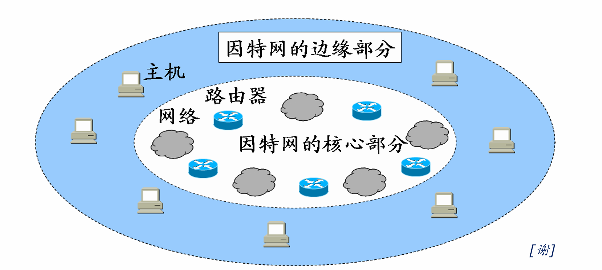
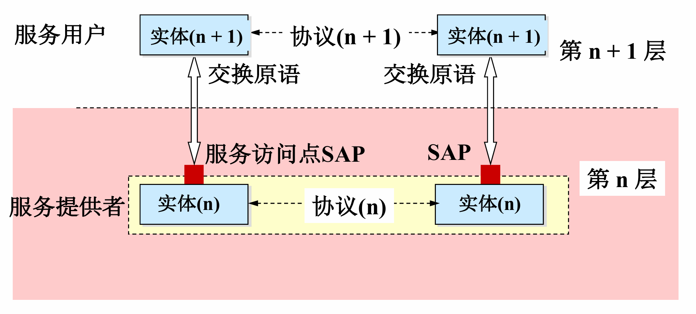
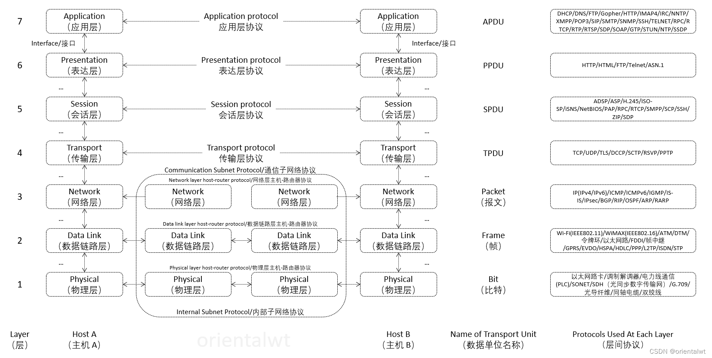
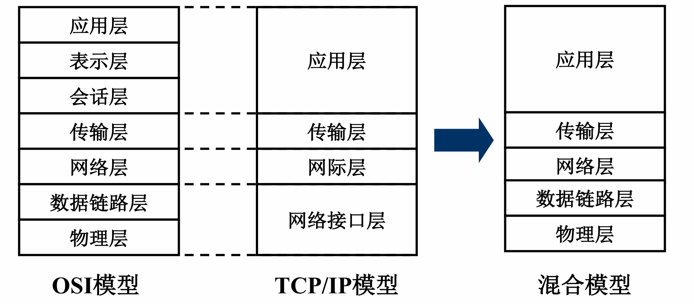

<h2 align="center">第一章 计算机网络体系结构</h2>

> **408 高频考点提醒**：
> - 计算机网络是**互连的、自治的**计算机集合；最基本功能是**数据通信**；三要素：**计算机、通信链路、网络协议**（协议是核心）
> - 组成：**边缘部分**（用户直接使用，C/S 与 P2P）+ **核心部分**（路由器 + 网络，为边缘服务）；**通信子网 = OSI 低三层、资源子网 = 高三层**
> - 分类：按范围 **WAN / MAN / LAN / PAN**；按拓扑总线/星/环/网状；按交换方式**电路交换 / 报文交换 / 分组交换**（存储转发）
> - 协议三要素：**语法**（格式）、**语义**（动作）、**时序（同步）**（顺序）；**协议是水平的，服务是垂直的**
> - OSI 七层：**物链网传会表应**；**传输层端到端、网络层点到点**；OSI 只是理论标准，未成为事实标准
> - TCP/IP 四层：应用/传输/网际/网络接口；网际层核心是 **IP（沙漏模型，IP over everything）**
> - 408 考试默认用**五层模型**：应用层、传输层、网络层、数据链路层、物理层
> - **发送时延 $= \frac{数据长度}{发送速率}$**（由发送端决定，与距离无关）；**传播时延 $= \frac{信道长度}{传播速率}$**（电磁波约 $2\times10^8$ m/s，由链路决定）
> - **时延带宽积 $= 传播时延 \times 带宽$**，单位是 **bit**；RTT = 发送数据到收到确认的时延
> - 速率换算以 **$10^3$** 为底（bit），存储容量换算以 **$2^{10}$** 为底（Byte）——两者勿混

---

### （一）计算机网络概述

#### 一、计算机网络的概念与功能

##### 1. 概念（定义）

**计算机网络**：将分散的、具有独立功能的**计算机系统**，通过**通信设备与线路**连接起来，由功能完善的**软件**实现**资源共享和信息传递**的系统。

其本质特征是：**互连的、自治的计算机集合**——

| 关键词 | 含义 |
|:---|:---|
| **互连** | 通过通信链路、交换设备等连接起来，能互相通信 |
| **自治** | 每台计算机**独立运行**，无主从之分，不依赖其他计算机也能工作 |
| **集合** | 若干计算机组成的整体，而非单台机器 |

> **考点**：定义抓三个关键词——**互连、自治、集合**。"自治"是把计算机网络与"多处理器系统（共享内存、由操作系统统一调度）"区分开的关键。

##### 2. 主要功能

| 功能 | 说明 |
|:---|:---|
| **数据通信** | 传送数据与信息，是**最基本、最重要**的功能 |
| **资源共享** | **硬件**（打印机、磁盘）、**软件**、**数据**共享——互连网络的最终目的 |
| **分布式处理** | 多台计算机承担**同一任务的不同部分**，协同完成（如 Hadoop） |
| **提高可靠性** | 某台计算机故障时，可由**替代机**继续工作 |
| **负载均衡** | 把任务分配给各计算机，合理分担负载、提高利用率 |

> **考点**：计算机网络最基本的功能是**数据通信**；最终目的是**资源共享**。
> **注（功能口径）**：本笔记取主流**五大功能**（数据通信/资源共享/分布式处理/提高可靠性/负载均衡）；本参考教材列"四大功能"且含**信息综合处理**——两套口径并存，考试以"**数据通信（最基本）+ 资源共享（最终目的）**"作答即可。

##### 3. 三要素（组成要素）

| 要素 | 内容 |
|:---|:---|
| **计算机** | 端系统（主机），是网络的主体 |
| **通信链路与设备** | 双绞线、光纤等线路，路由器、交换机等设备 |
| **网络协议** | 通信双方必须遵守的**规则**，是计算机网络运行的**核心** |

> **注意**：三要素缺一不可。没有协议，通信双方无法"听懂"对方——协议是网络的核心。

#### 二、计算机网络的组成

##### 1. 从组成角度：硬件、软件、协议

| 部分 | 内容 |
|:---|:---|
| **硬件** | 主机（端系统）、通信链路（线路）、交换设备（路由器、交换机等） |
| **软件** | 网络操作系统、网络应用软件、网络管理软件等 |
| **协议** | 计算机网络的核心，规定通信双方如何交换信息 |

##### 2. 从工作方式角度：边缘部分与核心部分

```
边缘部分（主机）：用户直接使用，进行通信和资源共享
     │
     ▼
核心部分（路由器 + 网络）：为边缘部分提供转发服务
```

| 部分 | 组成 | 特点 |
|:---|:---|:---|
| **边缘部分** | 连接在因特网上的**主机**（端系统） | 由**用户直接使用**，用于**通信和资源共享** |
| **核心部分** | **路由器 + 网络** | 为**边缘部分服务**（转发分组、路由选择），用户感知不到 |



**边缘部分的两大工作方式（C/S 与 P2P）**：

| 对比项 | C/S 方式（客户/服务器） | P2P 方式（对等） |
|:---|:---|:---|
| 角色 | 客户**主动**请求，服务器**被动**服务，地位**不对等** | 对等实体，**既是客户又是服务器** |
| 服务器压力 | 服务器承担主要负载，易成为**瓶颈** | **无中心服务器**，负载分散到各主机 |
| 典型应用 | Web、FTP、电子邮件 | BT 下载、Skype、PPlive |

> **考点**：边缘部分解决"主机之间通信与资源共享"问题，核心部分解决"数据如何转发"问题。C/S 中服务器是被动等待请求的一方。

##### 3. 从功能角度：通信子网与资源子网

| 子网 | 职责 | 对应 OSI 层 |
|:---|:---|:---|
| **通信子网** | 负责**数据通信**（数据的传输、交换与路由） | 低三层：物理层、数据链路层、网络层 |
| **资源子网** | 负责**资源共享与数据处理** | 高三层：会话层、表示层、应用层 |

> **注意**：通信子网 = 低三层（数据通信），资源子网 = 高三层（资源共享/处理）——传输层属于"承上启下"的边界层。

#### 三、计算机网络的分类

##### 1. 按覆盖范围（分布范围）

| 类型 | 全称 | 覆盖范围与特点 |
|:---|:---|:---|
| **广域网 WAN** | Wide Area Network | 跨国家、跨地区，覆盖范围**最广** |
| **城域网 MAN** | Metropolitan Area Network | 覆盖一个城市范围 |
| **局域网 LAN** | Local Area Network | 覆盖校园、企业等小范围，**速率高、时延小** |
| **个人区域网 PAN** | Personal Area Network | 个人设备互联（蓝牙、无线 USB 等） |

##### 2. 按拓扑结构

| 拓扑 | 特点 |
|:---|:---|
| **总线型** | 所有节点共享一条总线，**成本低**、易扩展；但总线故障全网瘫痪，冲突多 |
| **星型** | 各节点连到**中心节点**（如交换机），集中控制、易管理；中心节点故障则**全网瘫痪** |
| **环型** | 节点首尾相连成环，数据沿环单向传输；任一节点故障影响全网 |
| **网状型** | 节点之间多条路径冗余，**可靠性高、时延小**；常用于**广域网**（代价是造价高） |

##### 3. 按交换方式（重点）

| 交换方式 | 主要特点 | 优点 | 缺点 |
|:---|:---|:---|:---|
| **电路交换** | 建立专用物理通路；通话期间独占资源。建立连接 → 传输数据 → 释放连接 | 1. 传输时延小<br>2. 有序传输<br>3. 没有冲突<br>4. 实时性强 | 1. 建立连接时间长<br>2. 线路利用率低<br>3. 缺乏灵活性<br>4. 不同终端难以互通 |
| **报文交换** | 以**报文**为单位；采用**存储转发**机制 | 1. 无需建立连接<br>2. 线路利用率高<br>3. 可动态分配线路<br>4. 支持多目标服务 | 1. 引起转发时延（存储转发过程）<br>2. 节点需要大容量缓冲区<br>3. 对报文大小有限制 |
| <nobr>**分组交换**</nobr> | 将报文拆分为**分组**；采用**存储转发**机制 | 1. 无需建立连接<br>2. 线路利用率极高<br>3. 简化存储管理（分组定长）<br>4. 减少出错概率和重传数据量 | 1. 引起转发时延<br>2. 需要传输额外的信息（首部开销）<br>3. 可能出现失序、丢失或重复分组 |

> **考点**：分组交换是**因特网采用**的交换方式；电路交换**预先分配资源**、实时性好但利用率低；报文/分组交换**动态分配线路**、利用率高但有转发时延。注意：报文交换以"报文"为单位（大），分组交换把报文切小（定长，便于存储管理）。

##### 4. 按使用者：公用网与专用网

| 类型 | 特点 |
|:---|:---|
| **公用网（公众网）** | 任何单位和个人按需付费即可使用，如因特网 |
| **专用网** | 军队、铁路、银行等为本部门专门建造的网络，**保密性强**，不对外服务 |

##### 5. 按传输技术

| 类型 | 特点 |
|:---|:---|
| **广播式网络** | 所有主机**共享一条信道**，任意主机发送，其余均可收到（按地址判断是否接收） |
| **点对点网络** | 每条链路连接一对节点，数据经**分组存储转发**逐跳传递 |

---

### （二）计算机网络体系结构与参考模型

**体系结构与实现**：网络的**体系结构**是计算机网络的**各层及其协议的集合**，是对网络及其功能实现的**精确定义**；**实现**是在遵循体系结构的前提下，用何种软件、硬件实现的问题。

**Internet 标准与标准化组织（教材）**：Internet 标准由 **RFC**（征求意见文档）演化而来，成熟过程约 4 步（**互联网草案 → 建议标准 → 草案标准 → 互联网标准**）；主要标准化组织：**ISOC**（互联网协会）、**IETF**（互联网工程任务组）、**IRTF**（互联网研究任务组），以及 **IEEE**、ITU 等。

> **考点**：**体系结构是抽象的，实现是具体的**——体系结构只规定"做什么"，不规定"怎么做"，同一体系结构可有多种实现。

#### 一、分层与协议的基本概念

##### 1. 分层的基本原则

- 各层功能**相对独立**，每层实现一种相对独立的功能，每层只关心本层的协议
- 层间**界面自然清晰**，交流尽量少
- 下层为相邻上层提供**服务**，上层通过**接口**使用下层功能（下层对上层透明）
- 分层把复杂问题**分解**为若干较小问题，便于设计、实现与标准化



> **考点**：**协议是"水平"的**（对等实体之间），**服务是"垂直"的**（相邻层之间）——协议控制对等层通信，服务描述相邻层之间下对上提供的功能。

##### 2. 协议及其三要素

**协议（Protocol）**：控制**对等实体**（同一层次的两个通信节点）之间通信的**规则的集合**。

| 要素 | 含义 | 典型例子 |
|:---|:---|:---|
| **语法** | 规定数据与控制信息的**格式、结构** | TCP 报文段的结构（各字段的位置与长度）由语法决定 |
| **语义** | 规定需要发出何种信息、完成何种动作以及做出何种应答 | TCP 连接建立过程中**每次握手执行的操作** |
| **时序（同步）** | 规定各操作的**条件**及事件发生的**先后顺序** | TCP 连接过程中**三次握手**的时序关系 |

> **考点**：协议三要素是高频概念题——"规定格式的是**语法**，规定动作的是**语义**，规定顺序的是**时序**"。同步（时序）是三者中最容易漏答的一个。

##### 3. 服务与接口

**服务**：下层为**紧邻的上层**提供的**功能调用**，是垂直方向的。**服务访问点（SAP, Service Access Point）**：相邻两层之间交换信息的**连接点**（接口），例如 TCP 的**端口号**就是传输层的服务访问点。

**服务的分类**：

<table>
    <thead>
        <tr>
            <th>分类标准</th>
            <th>服务类型</th>
            <th>定义与特点</th>
        </tr>
    </thead>
    <tbody>
        <tr>
            <td rowspan="2"><b><nobr>连接状态</nobr></b></td>
            <td><b>面向连接服务</b></td>
            <td>传输前必须先发出建立连接请求，成功后才能传输，结束后释放连接（如 TCP）</td>
        </tr>
        <tr>
            <td><b>无连接服务</b></td>
            <td>不需要预先建立连接，直接传输，每个分组独立选择路由（如 UDP）</td>
        </tr>
        <tr>
            <td rowspan="2"><b><nobr>可靠性程度</nobr></b></td>
            <td><b>可靠服务</b></td>
            <td>网络具有纠错、检错和确认机制，确保数据正确到达接收方</td>
        </tr>
        <tr>
            <td><b>不可靠服务</b></td>
            <td>尽力而为（Best Effort）地传输，不保证可靠，由高层处理</td>
        </tr>
        <tr>
            <td rowspan="2"><b><nobr>确认机制</nobr></b></td>
            <td><b>有确认服务</b></td>
            <td>接收方收到数据后必须发回确认，发送方收到确认后才认为发送成功</td>
        </tr>
        <tr>
            <td><b>无确认服务</b></td>
            <td>接收方收到后不发确认，用于实时性要求高但对错误不敏感的场景</td>
        </tr>
        <tr>
            <td rowspan="2"><b><nobr>功能层次</nobr></b></td>
            <td><b>通信子网服务</b></td>
            <td>物理层、数据链路层、网络层负责数据通信任务</td>
        </tr>
        <tr>
            <td><b>资源子网服务</b></td>
            <td>会话层、表示层、应用层负责数据处理和资源共享</td>
        </tr>
    </tbody>
</table>

**协议与服务的关系**：

- 协议是**水平**的（对等实体之间）；服务是**垂直**的（相邻层之间）
- 本层协议使用下层提供的服务，并通过接口向相邻上层提供服务
- 只有**被上层看得见的功能**才是服务（实现细节对上层透明，上层只关心接口）

> **易错点**：① "服务"关心**功能**不关心**实现**——同一服务可由不同协议实现，同一协议也可提供不同服务；② 服务仅在同一系统的**相邻层**之间提供（垂直），不是对等实体之间。

##### 4. 三个重要概念：PDU、SDU、PCI

| 概念 | 全称 | 含义 |
|:---|:---|:---|
| **PDU** | Protocol Data Unit，协议数据单元 | 对等层之间传送的数据单元 |
| **SDU** | Service Data Unit，服务数据单元 | 为完成**上一层所要求的功能**而提供的数据（用户数据部分） |
| **PCI** | Protocol Control Information，协议控制信息 | 控制协议操作的信息，包括协议号、序列号、确认号、窗口大小等 |

**关系**：本层 PDU = 本层 SDU + 本层 PCI（加首部/尾部封装）。

> **注意**：第 N 层的 PDU 对第 N−1 层来说就是其 SDU——"上一层的 PDU 是下一层的 SDU"这一递推关系是选择题常客。

#### 二、OSI 七层参考模型



##### 1. 七层结构与各层核心功能

| <nobr>层次</nobr> | 层名 | 核心功能 | 传输单位 |
|:---|:---|:---|:---|
| 7 | **应用层** | 用户与网络的**界面**；提供各种网络服务，典型协议 FTP、SMTP、HTTP | 报文 |
| 6 | **表示层** | **数据格式变换**、加密解密、压缩恢复（语法转换） | 报文 |
| 5 | **会话层** | 建立、管理、**终止会话**；设置**校验点**（同步点）便于断点续传 | 报文 |
| 4 | **传输层** | **主机进程间**的通信（**端到端**）；可靠/不可靠传输；**复用与分用**；差错控制；流量控制 | 报文段 |
| 3 | **网络层** | **路由选择**、**拥塞控制**；实现**异构网络互联** | 分组（数据报） |
| 2 | <nobr>**数据链路层**</nobr> | **成帧**、**差错控制**、**流量控制**；MAC 寻址 | 帧 |
| 1 | **物理层** | 实现**比特流的透明传输**；定义接口的机械、电气、功能和规程特性 | 比特 |

> **考点**：顺口溜记忆七层——**"物链网传会表应"**（物理、数据链路、网络、传输、会话、表示、应用）。
> **易错点**：**传输层 = 端到端**（主机**进程**之间）；**网络层及以下 = 点到点**（相邻节点之间）——"端"指主机，点指路由器等中间节点。

##### 2. 对等层通信的概念

对等层通信指**同一层次的两个节点**之间的逻辑通信：

```
发送方 应用层 ──应用层协议──► 接收方 应用层
发送方 传输层 ──传输层协议──► 接收方 传输层
发送方 网络层 ──网络层协议──► 接收方 网络层
发送方 数据链路层 ──链路层协议──► 接收方 数据链路层
发送方 物理层 ────比特流经信道实际传输────► 接收方 物理层
```

> 图：对等层之间通过"协议"逻辑通信（水平方向），实际数据逐层向下封装，经物理层在信道上传输，接收方再逐层解封装向上交付。

- **逻辑通信**：对等实体间看似"直接"通信，实际上数据要经过下方各层（垂直方向）传递
- 物理层是**唯一实际传输**的层次；其余各层都是"虚通信"
- OSI 七层模型是**法律上的国际标准（ISO 7498）**：层次划分理论完整，但**层次过多、实现复杂**，未成为事实上的标准

#### 三、TCP/IP 模型

##### 1. 四层结构与主要协议

| 层次 | 主要功能 | 主要协议 |
|:---|:---|:---|
| **应用层** | 面向用户的各种应用服务 | HTTP、FTP、SMTP、DNS、TELNET 等 |
| **传输层** | 进程间端到端通信 | **TCP**（可靠、面向连接）、**UDP**（不可靠、无连接） |
| **网际层** | 分组转发与路由选择 | **IP**、ICMP、ARP、RARP 等 |
| **网络接口层** | 与具体网络技术对接 | 以太网、PPP 等 |

> **考点**：TCP/IP 的**应用层相当于 OSI 的应用层 + 表示层 + 会话层**；**网络接口层相当于 OSI 的数据链路层 + 物理层**，但 TCP/IP 未定义该层的具体内容（与具体网络有关）。

##### 2. TCP/IP 四层与 OSI 七层的对比

| OSI 七层 | TCP/IP 四层 | 对应说明 |
|:---|:---|:---|
| 应用层 | **应用层** | TCP/IP 未细分这三层，会话管理、数据表示等功能并入应用层 |
| 表示层 |  |  |
| 会话层 |  |  |
| 传输层 | **传输层** | 一一对应（TCP / UDP） |
| 网络层 | **网际层** | 一一对应，核心是 IP 协议 |
| 数据链路层 | **网络接口层** | 合并，且未定义具体内容（以太网、PPP 等均可） |
| 物理层 |  |  |

**OSI 与 TCP/IP 特性对比（教材表 1-2 要点）**：

| 对比项 | OSI | TCP/IP |
|:---|:---|:---|
| 层次数 | 7 层（概念清晰） | 4 层（务实） |
| 出现方式 | 先有**模型/概念**，后有协议 | 先有**协议**（TCP/IP），后归纳出模型 |
| 网络层 | 可面向连接（虚电路）也可无连接 | **只提供无连接**的数据报服务（IP） |
| 传输层 | 定义 5 类协议（TP0~TP4）；本教材另称"OSI 只提供可靠传输"（与主流"多种质量级别"表述不同，考试一般不展开） | **TCP**（可靠、面向连接）/ **UDP**（不可靠、无连接） |
| 设计目标 | 概念规范、服务/接口标准化 | 实用、可互连异构网络 |

##### 3. 设计思想（沙漏模型）

```
        ── 众多应用层协议 ──（HTTP, FTP, SMTP, DNS...）
                 │
             网际层 IP   ← 唯一的核心，最窄处（瓶颈）
                 │
  ── 众多网络技术 ──（以太网, PPP, ATM, 无线...）
```

> 图：TCP/IP 沙漏模型——网际层只有 IP 协议，上下层技术均可替换，体现了"IP over everything"的设计思想。

> **考点**：TCP/IP 体系结构的核心设计思想是**"IP over everything"**——IP 层屏蔽了底层网络技术的差异（网络接口层可以是以太网、PPP 等任何技术），所以 IP 可以运行于任何网络上，这也是"沙漏模型"名称的由来。

#### 四、五层模型（408 最常用）

**五层模型**综合 OSI 与 TCP/IP 的优点：既保留了 OSI 清晰的层次划分，又借鉴了 TCP/IP 的实用性，是**408 考试默认使用的模型**。

##### 1. 五层结构与各层协议、设备对照

| 层次 | 核心功能 | 典型协议 | 典型设备 | 传输单位 |
|:---|:---|:---|:---|:---|
| **应用层** | 提供应用服务，用户与网络的界面 | HTTP、FTP、SMTP、DNS | —（网关可处理高层协议转换） | 报文 |
| **传输层** | 进程间端到端通信，复用分用 | TCP、UDP | — | 报文段 |
| **网络层** | 路由选择、分组转发、拥塞控制 | IP、ICMP、ARP | **路由器** | 分组（数据报） |
| **数据链路层** | 成帧、差错控制、流量控制、介质访问 | 以太网协议（CSMA/CD）、PPP | **交换机、网桥** | 帧 |
| **物理层** | 比特流透明传输，接口特性 | 曼彻斯特编码、NRZ 等 | **中继器、集线器** | 比特 |

> **考点**：**设备与层次对应**——中继器/集线器（物理层）、网桥/交换机（数据链路层）、路由器（网络层）；**网关**是"网络层以上"的设备（可进行协议转换，最高可到应用层）。
> **易错点**：集线器与交换机都"连接主机"，但集线器在**物理层**（转发比特，冲突域不隔离）、交换机在**数据链路层**（转发帧，隔离冲突域）——功能层次不同，考察"工作在哪个层次"时不可混答。



##### 2. 数据的封装与解封装

```
发送端逐层封装（每层添加本层首部，即 PCI）：
应用层报文（Message）
  ──► 传输层加 TCP/UDP 首部 → 报文段（Segment）
  ──► 网络层加 IP 首部 → 数据报（Datagram）
  ──► 数据链路层加帧首部 + 帧尾部 → 帧（Frame）
  ──► 物理层转为比特流（Bits）发送到信道
接收端逐层解封装（去掉本层首部），还原出应用层数据
```

> 图：数据封装（发送端从上到下加首部）与解封装（接收端从下到上去首部）过程。

| 步骤 | 封装动作 | 形成的数据单元 |
|:---|:---|:---|
| 应用层 → 传输层 | 加 TCP/UDP 首部 | 报文段 |
| 传输层 → 网络层 | 加 IP 首部 | 数据报 |
| 网络层 → 数据链路层 | 加帧首部与帧尾部 | 帧 |
| 数据链路层 → 物理层 | 转换成比特流 | 比特 |

> **考点**：封装 = 逐层**添加首部（PCI）**形成各层 PDU；物理层最终把数据转为**比特流**。上一层的 PDU 作为下一层的 SDU，加上本层 PCI 后成为本层 PDU。

##### 3. 各层小结

- **数据链路层**处理**帧**：以太网帧、PPP 帧；**CSMA/CD** 是以太网的介质访问控制协议
- **物理层**：负责比特流的透明传输，典型编码是**曼彻斯特编码**（自带时钟信号，用于以太网）
- 各层对等实体之间用**协议**通信（水平），相邻层之间用**接口（SAP）**通信（垂直）

> **注意**：408 题目中"TCP/IP 模型"与"五层模型"常常混用（网络接口层 ≈ 数据链路层 + 物理层）；OSI 七层只作为概念考查。答题时若无特殊说明，默认按**五层模型**回答。

---

### （三）计算机网络性能指标

#### 一、速率、带宽与吞吐量

| 指标 | 定义 | 单位与要点 |
|:---|:---|:---|
| **速率（比特率、数据率）** | 数据的传送速率，即单位时间内传送的**比特数** | b/s、kb/s、Mb/s、Gb/s；换算以 **10<sup>3</sup>** 为底 |
| **带宽（Bandwidth）** | 网络中通信线路传送数据的能力，即单位时间内能通过的**最高数据率** | 单位同速率，表示线路的"额定上限" |

> **注意**：**带宽的原意是频率范围（Hz）**，即信号的频带宽度；网络中"带宽"引申为"最高数据率"（位数/秒）——同名概念，考纲语境取后者。
| **吞吐量（Throughput）** | 单位时间内**实际通过**某个网络（或信道、接口）的数据量 | 受带宽或额定速率的限制，是**实测值** |

> **易错点**：**速率（带宽）单位换算以 $10^3$ 为底**（1 Mbit/s = $10^6$ bit/s），而**存储容量换算以 $2^{10}$ 为底**（1 MB = $2^{20}$ B）——bit 用十进制、Byte 用二进制，选择题常在此设坑。

#### 二、时延（重点）

**时延（Delay）**：数据（一个报文或分组）从网络一端传到另一端所需的时间。**总时延 = 发送时延 + 传播时延 + 处理时延 + 排队时延**。

| 时延 | 公式 | 由谁决定 | 说明 |
|:---|:---|:---|:---|
| **发送时延（传输时延）** | $发送时延 = \frac{数据长度}{发送速率}$（信道带宽） | **发送端**（数据块长度、发送速率） | 数据进入信道所需时间；**与传输距离无关** |
| **传播时延** | $传播时延 = \frac{信道长度}{电磁波传播速率}$ | **链路**（信道长度、介质类型） | 电磁波在信道中传播所需时间；**与数据长度无关** |
| **处理时延** | 节点分析首部、查找路由表等耗时 | **节点设备**（路由器等） | 分组在节点被分析、处理的时间 |
| **排队时延** | 分组在输入/输出队列中等待的时间 | **节点设备**（队列长度、流量大小） | 受网络当前流量影响，可**随时变化** |

- 电磁波传播速率：真空中约 **$3\times10^8$ m/s**（光速）；**铜缆、光纤中约 $2\times10^8$ m/s**
- $发送时延 = \frac{数据长度}{发送速率}$；$传播时延 = \frac{信道长度}{传播速率}$

> **考点**：**发送时延只取决于数据长度和发送速率，与距离无关**；**传播时延只取决于信道长度和介质，与数据长度无关**——"发送时延看发送端，传播时延看链路"。
> **注意**：同一数据在中间节点逐跳转发时，每跳都要重新产生发送时延，但传播时延只与信道总长度有关。

> **注意（应试）**：考试中通常**默认忽略排队时延与处理时延**，只计算**发送时延 + 传播时延**两类。

#### 三、时延带宽积、往返时延 RTT 与信道利用率

| 指标 | 定义/公式 | 说明 |
|:---|:---|:---|
| **时延带宽积** | **$传播时延 \times 带宽$**（单位：bit） | 表示**以比特为单位的链路容量**——链路中最多"同时容纳"多少比特 |
| <nobr>**往返时延 RTT**</nobr> | 从发送端**发送数据开始**，到**收到接收端确认**为止的总时间 | 包括往返传播时延 + 中间各节点的处理/排队时延 |
| **信道利用率** | $\frac{有数据通过的时间}{总时间}$ | 分为**信道利用率**与**网络利用率**；利用率过高会引起时延**急剧增大** |

> **注意**：时延带宽积的单位是 **bit**（不是秒）——它回答"链路上最多能有多少比特在飞行"；**利用率过高 → 时延急剧增大**（排队时延爆炸），这是网络接近拥塞的信号。

#### 四、例题（时延与时延带宽积的综合计算）

**题目**：主机 A 向主机 B 发送 **1KB** 数据，链路带宽 **100Mbps**，信道长度 **2000km**，电磁波传播速率 **$2\times10^8$ m/s**。求：发送时延、传播时延与时延带宽积。

| 指标 | 计算过程 | 结果 |
|:---|:---|:---|
| 数据长度 | 1KB = 8 × 1024 = 8192 bit | **8192 bit** |
| 发送时延 | 8192 bit ÷ 100Mbps = $8192 \div 10^{8}$ s | **0.08192 ms** |
| 传播时延 | 2000km ÷ (2×10<sup>8</sup> m/s) = $2\times10^{6} \div 2\times10^{8}$ s | **10 ms** |
| 时延带宽积 | 传播时延 × 带宽 = $0.01 \times 10^{8}$ bit/s | **$1\times10^{6}$ bit = 1 Mbit** |

**结论**：

- 发送时延 **0.08192ms** 远小于传播时延 **10ms**——**短数据经长链路时，传播时延占主导**
- 时延带宽积 **1Mbit = 125KB**：即该链路中最多同时"容纳"125KB 的数据
- 若数据长度增大（如发送 100MB），发送时延将占主导；两类时延谁占主导**取决于数据长度与链路长度的相对大小**

> **注意**：本题未给出排队时延与处理时延，故总时延 = 发送时延 + 传播时延；实际网络中计算总时延必须把四类时延**全部计入**。

---

### （四）本章总结

**知识结构图**：

```
第一章 计算机网络体系结构
├─（一）计算机网络概述
│   ├─ 概念与功能：互连+自治的计算机集合；数据通信(最基本)/资源共享/分布式处理/可靠性/负载均衡
│   ├─ 三要素：计算机、通信链路与设备、网络协议（核心）
│   ├─ 组成：硬件/软件/协议；边缘部分(C/S、P2P) + 核心部分(路由器+网络)
│   │   └─ 功能组成：通信子网(低三层) + 资源子网(高三层)
│   └─ 分类：WAN/MAN/LAN/PAN；总线/星/环/网状；电路/报文/分组交换；公用网/专用网；广播式/点对点
├─（二）体系结构与参考模型
│   ├─ 体系结构是抽象的，实现是具体的
│   ├─ 分层与协议：三要素(语法/语义/时序)；协议水平、服务垂直；服务分类(连接/确认)；SAP；PDU=SDU+PCI
│   ├─ OSI 七层：物链网传会表应；传输层端到端 vs 网络层点到点（理论标准）
│   ├─ TCP/IP 四层：应用/传输/网际/网络接口；核心 IP（沙漏模型）
│   └─ 五层模型（408 默认）：应用/传输/网络/链路/物理；封装=逐层加首部
└─（三）性能指标
    ├─ 速率/带宽/吞吐量：bit 换算 10^3、Byte 换算 2^10
    ├─ 时延：发送(数据长度/速率)+传播(距离/传播速率 2×10^8 m/s)+处理+排队(逐跳重产生发送时延)
    ├─ 时延带宽积=传播时延×带宽(bit)；RTT；信道利用率过高→时延剧增
    └─ 例题：1KB/100Mbps→0.08192ms；2000km→10ms；时延带宽积=1Mbit
```

**高频考点速记**：

| 考点 | 一句话记忆 |
|:---|:---|
| 网络定义 | **互连的、自治的**计算机集合 |
| 三要素 | **计算机、通信链路、网络协议**（协议是核心） |
| 最基本功能 | **数据通信** |
| 五大功能 | 数据通信 / 资源共享 / 分布式处理 / 提高可靠性 / 负载均衡 |
| 边缘 vs 核心 | 边缘 = **用户直接使用**（C/S、P2P）；核心 = **路由器 + 网络**为边缘服务 |
| C/S vs P2P | C/S 地位**不对等**（服务器易成瓶颈）；P2P **对等**、无中心服务器 |
| 通信子网 vs 资源子网 | 通信子网 = **低三层**（数据通信）；资源子网 = **高三层**（数据处理） |
| 按范围分类 | **WAN > MAN > LAN > PAN** |
| 拓扑结构 | 总线/星/环/网状；**网状可靠性最高**（广域网常用） |
| 交换方式 | 电路（独占资源、时延小）/ 报文（存储转发）/ 分组（存储转发 + 定长，因特网采用） |
| 公用网 vs 专用网 | 公用网 = 因特网（付费）；专用网 = 军队/银行等（保密） |
| 广播式 vs 点对点 | 广播式**共享一条信道**；点对点逐跳**存储转发** |
| 体系结构 vs 实现 | **体系结构是抽象的，实现是具体的** |
| 协议三要素 | **语法**（格式）、**语义**（动作）、**时序/同步**（顺序） |
| 协议 vs 服务 | 协议**水平**（对等实体）；服务**垂直**（相邻层）；同一服务可由**不同协议实现** |
| 服务分类 | **面向连接（TCP）** vs **无连接（UDP）**；可靠 vs 不可靠；有确认 vs 无确认 |
| SAP | 服务访问点 = 相邻层交换信息的接口（如 TCP **端口号**） |
| PDU 关系 | **PDU = SDU + PCI**；上一层 PDU = 下一层 SDU |
| OSI 七层 | **物链网传会表应**（理论标准，未成事实标准） |
| 端到端 vs 点到点 | 传输层**端到端**（进程间）；网络层及以下**点到点**（节点间） |
| OSI vs TCP/IP | TCP/IP 合并：会表应 → 应用层；链路 + 物理 → 网络接口层 |
| 沙漏模型 | 网际层只有 **IP**（IP over everything），上下层技术可替换 |
| 五层模型 | 应用/传输/网络/链路/物理——**408 默认模型** |
| 设备与层次 | 路由器 = 网络层；交换机/网桥 = 链路层；中继器/集线器 = 物理层；**网关 = 网络层以上** |
| 封装过程 | 逐层**加首部（PCI）**；报文 → 报文段 → 数据报 → 帧 → 比特流 |
| 速率换算 | **bit 十进制（$10^{3}$）、Byte 二进制（$2^{10}$）** |
| 发送时延 | **$数据长度 \div 发送速率$**（由发送端决定，与距离无关） |
| 传播时延 | **$信道长度 \div 传播速率$**（铜缆/光纤约 $2\times10^{8}$ m/s，由链路决定） |
| 四类时延 | 发送 + 传播 + **处理 + 排队** = 总时延 |
| 时延主导 | 短数据 + 长链路 → **传播时延主导**（0.08192ms vs 10ms） |
| 时延带宽积 | **$传播时延 \times 带宽$**，单位 **bit**（链路容量） |
| 信道利用率 | 过高 → 时延**急剧增大**（接近拥塞） |
