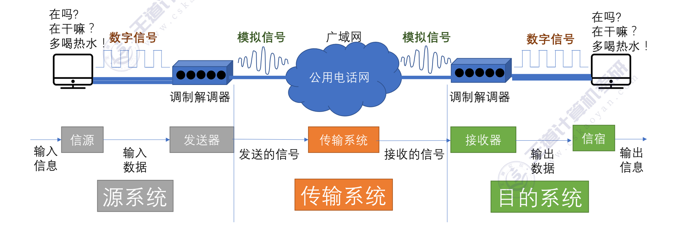
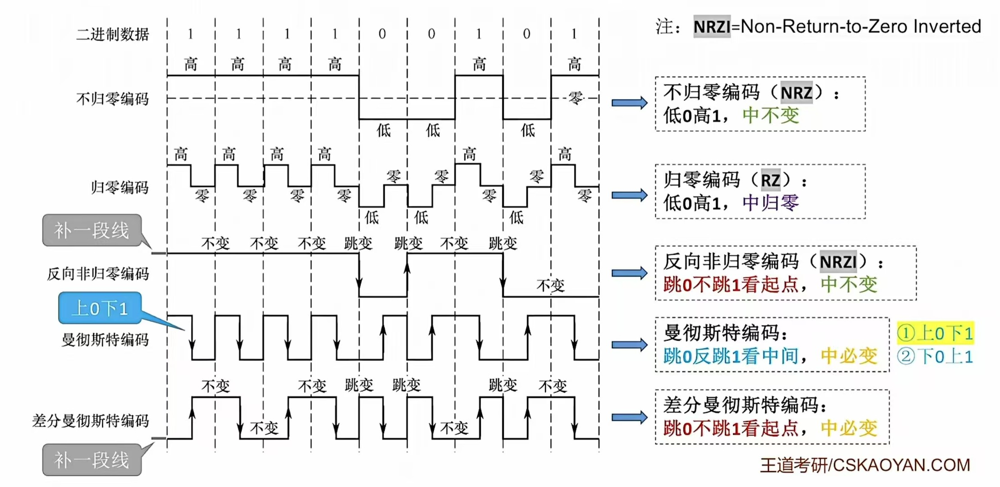
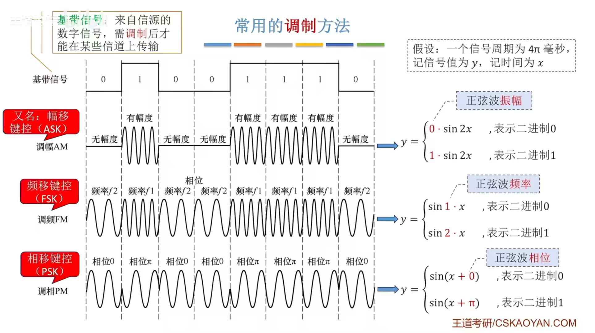
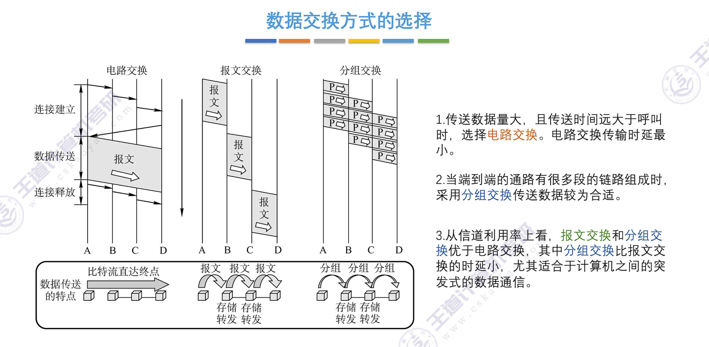

<h2 align="center">第二章 物理层</h2>

> **408 高频考点提醒**：
> - 数据通信术语：**数据（模拟/数字）、信号（模拟/数字）、码元、信道**；1 码元 = $\log_2 M$ 比特
> - 通信系统模型：**信源→发送器→信道→接收器→信宿**，噪声源叠加于信道
> - **波特率 vs 比特率**：$R = B \times \log_2 V$（16 电平 → 每码元 4 比特，与进制无关的只有波特率）
> - **编码与调制**：曼彻斯特（跳变**既定时钟又定数据**，效率 50%）；差分曼彻斯特（跳变**只做时钟**，0/1 看跳变方向）；NRZ 无自同步
> - **调制**：ASK/FSK/PSK/QAM（QAM-16 → 每码元 4 比特）；采样定理：**采样频率 $\geq 2\times$ 信号最高频率**
> - **奈氏准则**：理想低通信道极限码元速率 **$2W$ 波特**，极限数据率 **$2W\times\log_2 V$**
> - **香农定理**：$C = W\times\log_2(1+S/N)$；**30dB → S/N=1000**；奈氏与香农**取较小者**
> - **三种交换**：电路（先建连接、独占、时延小、利用率低）、报文（整报文存储转发、时延大）、分组（数据报/虚电路）
> - **物理层设备**：中继器与集线器**都不能分割冲突域**；5-4-3 规则（最多 **4 个中继器、5 段、3 个含主机**）
> - **接口四特性**：机械、电气、功能、过程（规程）

---

### （一）数据通信基础

#### 一、术语和概念（2.1.1）

##### 1. 数据

**数据（Data）**：信息的载体，是通信中交换的实体。按取值特点分为两类：

| 类型 | 含义 | 举例 |
|:---|:---|:---|
| **模拟数据** | 取值**连续**变化的数据 | 声音、温度、图像亮度 |
| **数字数据** | 取值**离散**的数据 | 文本、整数、二进制编码 |

##### 2. 信号

**信号（Signal）**：数据的**电气/电磁表现**，是数据在传输过程中的存在形式，由信源发出。

| 类型 | 特征 | 举例 |
|:---|:---|:---|
| **模拟信号** | 波形**连续**，取值是时间的连续函数 | 连续的脉冲信号、连续的电压信号、连续的光信号 |
| **数字信号** | 波形**离散**（跳变），取值是离散的 | 脉冲信号、二进制编码信号、调制信号 |

> **注意**：模拟信号与数字信号不是绝对的——通过**调制/编码**可实现相互转换。

##### 3. 码元

**码元（Symbol，Code Element）**：**一个固定时长的信号波形（数字脉冲）**，代表不同离散数值的基本波形。

- 该固定时长本身称为**码元宽度（码元长度）**
- 当码元的离散状态有 M 个（M ≥ 2）时，称为 **M 进制码元**（如 2 进制码元、4 进制码元）
- **1 个码元可以携带多个比特**：**1 码元 = $\log_2 M$ bit**（如 4 进制码元携带 2 bit，16 进制码元携带 4 bit）

> **考点**：码元是"固定时长的信号波形"，与进制无关地定义；进制越高，每个码元携带的比特越多。

##### 4. 信道

**信道（Channel）**：信号的传输媒介，是信号传输的通道，可以是导体、绝缘体、电介质、光介质等。

- 一条物理线路通常包含**两条信道：发送信道、接收信道**（全双工通信的基础）
- 按通信方向分：
  - **单向信道（单工信道）**：信号只能沿一个方向传输
  - **双向交替信道（半双工信道）**：两个方向都可传输，但**同一时刻只能一个方向**
  - **双向同时信道（全双工信道）**：两个方向**同时**传输

##### 5. 基带信号与宽带（频带）信号

| 类型 | 含义 | 特点 |
|:---|:---|:---|
| **基带信号（Baseband Signal）** | 信源发出的**未经调制**的原始电信号（频率从 0 到某个最大值），如计算机输出的 0/1 数字信号 | 频谱低，适合**近距离**传输（局域网多用基带传输） |
| **宽带信号（Broadband Signal，频带信号）** | 把基带信号**调制后**搬移到较高频段的信号 | 频谱宽，适合**远距离**传输，可频分复用充分利用带宽 |

> **考点**：基带信号 = 原始未调制信号；宽带信号 = 调制搬频后的信号。**近距离基带传输、远距离宽带传输**。

#### 二、通信系统的模型

通信系统的一般模型：**信源 → 发送器 → 信道 → 接收器 → 信宿**，噪声源作用于信道：

```
             ┌───────────┐
             │   Noise   │
             └───────────┘
┌───────────┐   ┌───────────┐   ┌───────────┐   ┌───────────┐   ┌───────────┐
│  Source   │──►│  Sender   │──►│  Channel  │──►│ Receiver  │──►│   Sink    │
└───────────┘   └───────────┘   └───────────┘   └───────────┘   └───────────┘
```

> 图：通信系统一般模型（信源→发送器→信道→接收器→信宿，噪声源叠加于信道）。



> 图：通信系统一般模型（教材配图，含噪声源）。

| 部件 | 作用 |
|:---|:---|
| **信源（Source）** | 产生和发送数据的源头（如话筒、计算机） |
| **发送器（Sender）** | 把信源产生的信号变换成**适合信道传输**的信号（编码/调制、放大） |
| **信道（Channel）** | 传输信号的媒介，噪声在此叠加 |
| **接收器（Receiver）** | 把信道传来的信号**恢复**成信宿可接收的形式（解码/解调） |
| **信宿（Sink）** | 接收数据的终点（如扬声器、显示器） |
| **噪声源（Noise）** | 信道上的噪声（如热噪声、冲击噪声），是**限制通信质量与传输速率**的关键因素 |

> **考点**：发送器负责"变换（编码/调制）"，接收器负责"恢复（解码/解调）"——调制解调器（Modem）同时包含发送器与接收器功能。

#### 三、传输方式与通信方式

##### 1. 串行传输与并行传输

| 方式 | 特点 | 适用场景 |
|:---|:---|:---|
| **串行传输** | 数据**逐位**在一条信道上传输，速度慢，但成本低、抗干扰好、便于远距离 | 计算机网络（远程通信） |
| **并行传输** | 数据**多位同时**在多条并行信道上传输，速度快，但成本高、线路多 | 计算机内部总线、打印机并口等近距离 |

##### 2. 单工/半双工/全双工（重点辨析）

| 通信方式 | 别名 | 方向性 | 实例 |
|:---|:---|:---|:---|
| **单工** | 单向通信 | 只能**一个方向**传输 | 广播、电视、遥控器 |
| **半双工** | 双向交替通信 | 双方都能发送，但**同一时刻只能一方发送** | 对讲机、CSMA/CD 以太网 |
| **全双工** | 双向同时通信 | 双方**同时收发** | 电话、光纤以太网 |

> **考点**：一条物理线路上的全双工通信需要**两条信道**（发送信道 + 接收信道）；半双工只需一条信道但需**切换开关**轮流使用。
> **易错点**：并行传输 ≠ 全双工——并行指"同一时刻传多位"，全双工指"同一时刻双向传"。

##### 3. 同步传输与异步传输

| 方式 | 同步手段 | 特点 | 实例 |
|:---|:---|:---|:---|
| **同步传输** | 收发双方**时钟同步**，以**块（帧）** 为单位连续发送，块间不留空隙 | 效率高；但需额外同步信息（同步码/专用时钟） | 计算机网络中的帧传输 |
| **异步传输** | 每个**字符**前后附加**起始位与停止位**，逐字符独立同步 | 实现简单；每字符多 2~3 位开销，**速率低** | 低速串口（UART）、键盘输入 |

> **注意**："异步"不是不需要同步，而是**每个字符单独同步**；同步传输在块开头用同步码建立同步。

#### 四、速率、波特与码元

##### 1. 波特率（码元传输速率）

**波特率 B（Baud，码元速率 / 调制速率）**：单位时间内传输的**码元个数**。若每个码元的持续时间为 T，则：

$$
B = \frac {1}{T}（波特，Baud）
$$

- 波特率描述"每秒传输几个码元"，**与码元进制无关**（无论 2 进制还是 16 进制码元，每传一个码元都算 1 波特）

##### 2. 比特率（信息传输速率）

**比特率 R（bit/s，数据率 / 信息速率）**：单位时间内传输的**比特数**。

##### 3. 波特率与比特率的关系（核心公式）

$$
R = B \times \log_2 V
$$

- V：一个码元可取**离散电平的个数**（码元进制数）
- 每个码元携带 $\log_2 V$ 比特

> **考点**：波特率与进制**无关**，比特率 = 波特率 $\times \log_2 V$。**码元速率相同，进制越高比特率越大**（多进制调制提高数据率）。
> **易错点**：提到"速率"必须先分清是**波特率（码元速率）**还是**比特率（数据率）**，两者的单位分别是 Baud 和 bit/s。

**例题**：某数字通信系统的码元速率为 2400 波特，码元取 16 个离散电平，求该系统的数据传输速率（比特率）。

**数据**：

| 项目 | 数值 |
|:---|:---|
| 码元速率 B | 2400 波特 |
| 离散电平数 V | 16 |
| 每个码元携带比特数 | $\log_2 16 = 4$ bit |

**公式**：$R = B \times \log_2 V$

**计算**：

$R = 2400 \times \log_2 16 = 2400 \times 4 =$ **9600 b/s**

**结论**：比特率 = 9600 b/s——每个码元携带 4 比特信息。

##### 4. 带宽

**带宽（Bandwidth）**：信道所能传输信号的**最高频率与最低频率之差**，单位 **Hz**。

> **易错点**：通信领域的"带宽"是**频率范围（Hz）**；日常说"100Mbps 带宽"指的是**数据传输速率（b/s）**——两个概念的含义与单位不同。带宽决定信道的极限传输速率上限（见奈氏准则与香农定理）。

#### 五、编码与调制（2.1.2）

先辨析两组概念：

| 概念 | 含义 |
|:---|:---|
| **编码（Encoding）** | 数据 → **数字信号**（如计算机输出的 0/1 比特流） |
| **调制（Modulation）** | 数据（数字或模拟） → **模拟信号**（把信号搬移到合适频带） |

##### 1. 数字数据编码为数字信号

把计算机内部的二进制数字数据转换为数字信号（基带信号），常见编码方式：



> 图：常见数字-数字编码波形（NRZ、曼彻斯特、差分曼彻斯特等）。

**① 非归零编码（NRZ，Non-Return-to-Zero）**

- 高电平表示 1，低电平表示 0，一个码元期间电平保持不变
- 特点：**实现容易、无带宽浪费**；但**无自同步能力**（连续多个 1 或 0 时无法判断码元边界），也**无检错功能**
- "不归零"的含义：码元期间电平**不回到零电平**

**② 归零编码（RZ，Return-to-Zero）**

- 信号电平在**一个码元之内都要恢复到零**（后半码元回到零电平）
- 特点：每次归零都提供时钟信息，自同步能力**强**；但占用频带较宽、编码效率低

**③ 反向不归零编码（NRZI，Non-Return-to-Zero Inverted）**

- 通过信号电平**是否发生翻转（跳变）** 来表示 0 和 1
- 特点：差分特性，有一定抗干扰能力；本身同步能力差，可通过**增加冗余信息**（冗余位）改善

**④ 曼彻斯特编码（Manchester）—— 重点**

- 将一个码元分成**两个相等的间隔**，在**每个码元的中间出现电平跳变**
- 规定（以太网）：**前高后低表示 1，前低后高表示 0**（**该约定可交换**——本教材采用 IEEE 802.3 约定"位中间高→低跳变＝0、低→高＝1"，与笔记当前写法相反；两种约定均合法，考试以题目/教材给定为准）
- 特点：位中间的跳变**既作时钟信号（自同步）又作数据信号**；是以太网的默认编码方式
- 缺点：所占频带宽度是原始基带信号的 **2 倍**，数据传输速率只有调制速率的 **1/2**（编码效率 50%）

**⑤ 差分曼彻斯特编码（Differential Manchester）**

- 规则："**同 1 异 0**"——若码元为 1，前半个码元的电平与**上一个码元的后半段电平相同**；若为 0 则相反
- 特点：每个码元中间**都有一次电平跳变，但跳变只作时钟信号**；0/1 由**码元边界处有无电平跳变**决定；抗干扰性**强于**曼彻斯特编码，常用于局域网

> **考点**：曼彻斯特编码的跳变**既定时钟又定数据**；差分曼彻斯特编码的跳变**只做时钟**，数据由跳变方向（边界是否跳变）决定。
> **易错点**：**以太网默认用曼彻斯特编码**（不是差分曼彻斯特）；差分曼彻斯特多用于令牌环等局域网，抗干扰更强。

**⑥ 4B/5B 编码**

- 用 **5 个比特编码 4 个比特**的数据，插入额外比特以打破一连串的 0 或 1
- 编码效率 = 4/5 = **80%**

**编码方式对比表**：

| 编码方式 | 自同步能力 | 浪费带宽情况 | 抗干扰能力 | 备注 |
|:---|:---|:---|:---|:---|
| **非归零 NRZ** | **无** | 无浪费 | 较差 | 实现最简单 |
| **反向不归零 NRZI** | 差（可加冗余位改善） | 浪费有限 | 较差 | 靠电平翻转表示 0/1 |
| **归零 RZ** | **强**（码元内必归零） | **浪费严重**（频带宽） | 弱 | 效率低 |
| **曼彻斯特** | **强**（中间必跳变） | **浪费严重**（效率仅 50%） | 强 | **以太网默认编码** |
| **差分曼彻斯特** | **强**（中间必跳变） | **浪费严重**（效率仅 50%） | **最强** | "同 1 异 0"，常用于局域网 |
| **4B/5B 编码** | 较强（打破连续同电平） | 轻微浪费（效率 80%） | 一般 | 每 4 位数据用 5 位编码 |

> **考点**：编码效率 = 数据位数 ÷ 编码位数——曼彻斯特 **50%**、4B/5B **80%**；自同步能力取决于"跳变是否与码元边界绑定"。

##### 2. 数字数据调制为模拟信号

在发送端把数字信号转换为模拟信号，在接收端再解调还原为数字信号（如电话线上网需 Modem）：



> 图：数字数据调制为模拟信号（ASK/FSK/PSK 三种基本调制方法）。

**基本调制方法**：

| 调制方式 | 英文全称 | 方法 | 特点 |
|:---|:---|:---|:---|
| **幅移键控** | ASK（调幅 AM） | 改变**载波振幅**表示 0/1 | 实现简单；抗干扰差，易受增益变化影响 |
| **频移键控** | FSK（调频 FM） | 改变**载波频率**表示 0/1 | 抗干扰强于 ASK；常用于低速数据通信（电话线） |
| **相移键控** | PSK（调相 PM） | 改变**载波相位**表示 0/1 | 抗干扰强、频带利用率高；分**绝对相移（2PSK）与相对相移（DPSK）** |

**多级调制：QAM（正交振幅调制，Quadrature Amplitude Modulation）**

- QAM 把**调幅（ASK）与调相（PSK）相结合**，使一个码元携带多位数据
- 若设计 m 种幅值、n 种相位，则可调制出 **$m\times n$ 种信号**，**1 码元 = $\log_2(mn)$ bit**
- **QAM-16** 表示采用 QAM 调制且有 **16 种码元**（每码元携带 $\log_2 16 = 4$ bit）

> **考点**：QAM 是**调幅 + 调相**的结合；QAM-16 → 每码元 4 比特。多进制调制（提高 V）是提高数据率的有效手段。

##### 3. 模拟数据编码为数字信号（音频数字化）

计算机处理数字音频时，需要把连续的模拟信号转换为离散的数字序列。最典型的方法是**脉码调制（PCM，Pulse Code Modulation）**，包含三步：

| 步骤 | 内容 | 关键点 |
|:---|:---|:---|
| **抽样（采样）** | 对模拟信号周期性扫描，把**时间上连续**的信号变为**时间上离散**的信号 | **采样频率 ≥ 2 倍信号最高频率**（采样定理/奈奎斯特采样率），否则无法无失真恢复 |
| **量化** | 把抽样得到的电平幅值转化为对应的数字值并取整 | 量化是近似过程，产生**量化误差**（量化噪声） |
| **编码** | 把量化结果转换为与之对应的二进制编码 | 编码位数越多，量化等级越细、质量越高 |

> **考点**：采样定理——**采样频率 $f_s \geq 2f_{\max}$**（$f_{\max}$ 为模拟信号最高频率）；采样频率不足会产生**混叠失真**。

##### 4. 模拟数据调制为模拟信号

- 目的：把低频模拟信号（如语音）搬移到**较高频段的载波**上传输，提高传输有效性、支持远距离传输
- 方式：调幅（AM）、调频（FM）、调相（PM）
- 常结合**频分复用（FDM）** 技术充分利用带宽资源（如广播电台、有线电视系统）

#### 六、传输介质（2.2）

**传输介质（媒体）并不属于物理层**，位于体系结构的最底层（常称为"第 0 层"）——传输介质只传输信号，物理层通过规定电气特性来识别传送的比特流。

传输介质分为**导向性传输介质（有线）**与**非导向性传输介质（无线）**两大类。

##### 1. 导向性传输介质（有线）

电磁波被导向沿固体媒介（铜线、光纤等）传播。

**① 双绞线（Twisted Pair）**

- 结构：由**两根相互绝缘的铜导线按一定规则绞合**而成；绞合的作用是**减少相邻导线的电磁干扰**
- 分类：**非屏蔽双绞线（UTP）** 与带金属编织屏蔽层的**屏蔽双绞线（STP）**
- 特点与应用：价格便宜，是最常用的传输介质；既能传模拟信号（固定电话线）也能传数字信号（计算机网络）（传统以太网**单段最大传输距离约 100m**）

**② 同轴电缆（Coaxial Cable）**

- 结构：由内导体（铜质芯线）、绝缘层、外导体（屏蔽层）、塑料外层构成
- 分类：**50Ω** 同轴电缆（传送基带数字信号，常用于局域网）、**75Ω** 同轴电缆（传送宽带模拟信号，常用于有线电视）
- 特点：抗干扰特性优于双绞线，传输距离更远、速率更高，但价格更贵

**③ 光纤（Optical Fiber）**

- 原理：利用光脉冲通信（**有光脉冲表示 1，无光表示 0**）；光波在**纤芯（高折射率）与包层（低折射率）** 的交界面不断发生**全反射**来传输
- 分类：

| 类型 | 光源 | 特点 |
|:---|:---|:---|
| **单模光纤** | 激光二极管 | 衰耗小、带宽大，适合**远距离**；价格较贵 |
| **多模光纤** | 发光二极管 | 易失真（模间色散），适合**近距离**；价格便宜 |

- 特点：**带宽超高、传输损耗小、抗干扰性能极好、保密性强、重量轻**

##### 2. 非导向性传输介质（无线）

指自由空间（空气、真空、海水等），利用无线电磁波通信：

| 介质 | 特点 | 典型应用 |
|:---|:---|:---|
| **无线电波** | 信号**向全方位传播**，穿透能力强；抗干扰能力差 | 手机通信、WLAN、蓝牙 |
| **微波** | 信号**沿直线定向传播**，频段宽、数据率高；不能穿透建筑物，受天气影响大 | 地面微波接力（长距离需中继器）、卫星通信（以卫星作中继器，覆盖广、支持广播，但**传播时延约 250~270ms**，成本高） |
| **红外线与激光** | 信号转换为红外光/激光沿**固定方向**传播，容量大、距离远 | 遥控器、自由空间光通信 |

> **考点**：卫星通信传播时延约 **250~270ms**（常考计算题）；传输介质属于"**第 0 层**"，不属于物理层。

---

### （二）信道的极限容量

信道的极限容量主要由两大定理决定，区别在于信道**有无噪声**。

#### 一、奈奎斯特定理（奈氏准则）

**适用条件**：**理想低通（无噪声、带宽受限）** 信道。为避免**码间串扰（ISI）**，码元传输速率存在上限。

- **极限码元传输速率**：$B_{\max} =$ **$2W$**（波特），其中 W 为信道带宽（Hz）
- **极限数据传输率（信道容量）**：$C =$ **$2W \times \log_2 V$**（b/s），V 为码元的离散电平数目

> **注意**：奈氏准则**只限制码元速率**——码元速率一定时，可通过**增大 V（多进制调制）** 提高比特率；但 V 不能无限增大（受信噪比和实现成本限制）。

**例题**：某理想低通信道的带宽为 3000Hz，若码元取 4 个离散电平，求该信道的最大数据传输率。

**数据**：

| 项目 | 数值 |
|:---|:---|
| 带宽 W | 3000 Hz |
| 离散电平数 V | 4 |
| 极限码元速率 | 2W = 6000 波特 |
| 每个码元携带比特数 | $\log_2 4 = 2$ bit |

**公式**：$C = 2W \times \log_2 V$

**计算**：

$C = 2 \times 3000 \times \log_2 4 = 6000 \times 2 =$ **12000 b/s**

**结论**：最大数据传输率 = 12000 b/s（码元速率 6000 波特，每码元 2 比特）。

#### 二、香农定理（Shannon）

**适用条件**：**带宽受限且有噪声**的信道。信噪比越大，信道极限传输速率越高。

**公式**：$C = W \times \log_2(1 + S/N)$（b/s）

- W：信道带宽（Hz）
- S：信道所传信号的**平均功率**
- N：信道内**高斯噪声**的平均功率
- **S/N：信噪比**（功率比），常用 dB 表示：**$S/N(\text{dB}) = 10 \times \lg(S/N)$**，即 $S/N = 10^{dB/10}$

> **注意**：30dB 对应 S/N = 10³ = **1000**（最常考换算）；题目若给出 dB 值，**必须先换算成比值再代入公式**。

**例题（经典）**：某信道带宽为 3000Hz，信噪比为 30dB，求该信道的极限数据传输速率。

**数据**：

| 项目 | 数值 |
|:---|:---|
| 带宽 W | 3000 Hz |
| 信噪比 | 30dB → $S/N = 10^{(30/10)} = 1000$ |

**公式**：$C = W \times \log_2(1 + S/N)$

**计算**：

$C = 3000 \times \log_2(1 + 1000) = 3000 \times \log_2 1001 \approx 3000 \times 9.97 \approx$ **30000 b/s = 30 kbps**

**结论**：无论采用多么复杂的调制技术，该有噪声信道的数据率上限约为 30 kbps。

#### 三、奈奎斯特定理 vs 香农定理（对比辨析）

| 对比项 | 奈奎斯特定理（奈氏准则） | 香农定理 |
|:---|:---|:---|
| 适用信道 | **理想（无噪声）** 低通信道 | **有噪声**信道 |
| 限制对象 | **码元速率**（通过 V 间接限制数据率） | **数据传输速率**（数据率上限） |
| 公式 | $B_{\max} = 2W$；$C = 2W \times \log_2 V$ | $C = W \times \log_2(1 + S/N)$ |
| 结论 | 码元速率一定，提高 V 可提高数据率 | 信噪比一定，数据率有上限，**与 V 无关** |
| 实际使用 | 两者**都要满足，取较小者** | 两者**都要满足，取较小者** |

> **考点**：求信道极限数据率时，**先分别用奈氏准则和香农定理计算，再取较小值**。
> **易错点**：香农公式中的 S/N 是**功率比值**；题目给 dB 时用 $S/N(\text{dB}) = 10\lg(S/N)$ 换算，**30dB = 1000 倍**。

---

### （三）数据交换技术（2.1.3）

#### 一、电路交换（Circuit Switching）

- 过程：**建立连接 → 通信 → 释放连接**（如同打电话，先拨通再通话）
- 特点：通信双方**独占**一条物理通路，数据沿通路直达，**无存储转发**
- 优点：时延小（建立连接后无需排队等待）、实时性强、数据有序到达，适合长时间大量持续通信
- 缺点：**建立连接耗时**；线路被**独占**，利用率低；突发性数据通信浪费严重
- 典型应用：**电话网**

#### 二、报文交换（Message Switching）

- 方式：**存储转发**——以**整个报文**为单位，逐站存储后转发（每站先完整接收再转发）
- 优点：**不需要预先建立连接**；线路**不独占**，利用率高；可为报文动态选择路径；**多目标**服务
- 缺点：报文**大**，存储转发**时延大**；要求中间结点**缓冲容量大**；不适合实时通信
- 典型应用：**电报网**

#### 三、分组交换（Packet Switching）

- 方式：**存储转发**——先把报文拆成**若干个较小的分组（Packet）**，再分组逐站转发
- 优点：分组小，**时延小、缓冲要求低**；线路利用率高（统计复用）；多个分组可**并行转发**
- 典型应用：**计算机网络（因特网）主要采用分组交换**
- 缺点（教材）：各节点存储转发需**排队等待**；分组**首部控制开销**使传送的信息量**约增加 5%~10%**

**分组交换的两种方式**：

| 方式 | 连接状态 | 特点 |
|:---|:---|:---|
| **数据报方式（无连接）** | 通信前**不建立连接**，每个分组**独立选择路由** | 分组可能**乱序、丢失、重复**；灵活、健壮、适应网络故障；因特网默认方式 |
| **虚电路方式（面向连接）** | 通信前先建立**虚电路**（逻辑连接），分组沿虚电路**顺序转发** | 分组**有序到达**，服务质量好；但网络故障时虚电路失效，且有建立/释放开销 |

**电路交换 / 报文交换 / 分组交换对比表**：



| 对比项 | 电路交换 | 报文交换 | 分组交换 |
|:---|:---|:---|:---|
| 是否建立连接 | **需要**（建立/释放连接） | 不需要 | 数据报：不需要；虚电路：需要 |
| 传输单位 | 原始比特流（数据流） | **整个报文** | **分组**（报文拆分） |
| 存储转发 | 无（直接贯通） | 有（报文级） | 有（分组级） |
| 时延 | **最小**（建立后直达） | **大**（大报文逐站存储转发） | 较小（分组小，可并行转发） |
| 线路利用率 | **低**（线路独占） | 高（不独占） | **高**（统计复用） |
| 实时性 | **最好** | 差 | 较好 |
| 典型应用 | 电话网 | 电报网 | **计算机网络（因特网）** |

> **考点**：三种交换的根本区别是**是否建连**与**传输单位**——电路交换建连后直达（时延最小、利用率最低）；报文/分组交换都采用存储转发（分组交换因单位小故时延远小于报文交换）。
> **注意（教材）**：**数据报 / 虚电路是网络层向传输层提供的两种服务**（不由物理层/链路层决定），因特网采用无连接的数据报服务。选用原则（教材）：**数据量大 / 持续通信宜电路交换**，**多段链路（相距远）宜分组交换**。

---

### （四）物理层设备（2.3）

物理层的主要互连设备包括**中继器（Repeater）与集线器（Hub）**。

#### 一、中继器（Repeater）

- **产生原因**：信号在线路上传输存在**损耗**，功率逐渐衰减，导致信号失真和接收错误
- **主要功能**：对信号进行**再生和还原**（整形），对衰减信号进行**放大**，以增加信号传输的距离、延长网络的长度
- **放大器 vs 中继器（教材注意）**：**放大器**用于**模拟信号**——放大信号时**同步放大噪声**；**中继器**用于**数字信号**——对信号**再生还原**（整形），**不累积噪声**。口诀："模拟用放大、数字用再生"。
- **工作特点**：
  - 连接**两个局域网网段（Segment）**
  - 仅作用于信号的**电气部分**，不管数据中是否有错误（不检错、不纠错）
  - 两端的网段**必须是同一个协议**（中继器**不存储转发**，不改变协议）
- **5-4-3 规则**：以太网标准对信号延迟有严格规定——最多允许 **5 个网段、4 个中继器**，其中最多 **3 个网段可以连接主机**

```
┌───────────┐  ┌───────────┐  ┌───────────┐  ┌───────────┐  ┌───────────┐
│ Segment 1 │──│ Segment 2 │──│ Segment 3 │──│ Segment 4 │──│ Segment 5 │
│  (hosts)  │  │  (hosts)  │  │  (hosts)  │  │ (no host) │  │ (no host) │
└───────────┘  └───────────┘  └───────────┘  └───────────┘  └───────────┘
```

> 图：5-4-3 规则示意——最多 5 个网段、4 个中继器，其中最多 3 个网段可连接主机。

- **冲突域**：中继器连接的两个网段属于**同一个冲突域**（中继器不能分割冲突域）

> **考点**：中继器连接的两个网段**必须使用相同协议**（不存储转发、不改变协议）；中继器**不能分割冲突域**，也不能隔离广播域。

#### 二、集线器（Hub）

- **基本概念**：集线器本质上是一个**多端口的中继器**，用于把主机连接起来组成局域网（LAN）
- **主要功能**：对衰减的信号进行**再生放大**，并转发到**除输入端口外的其他所有处于工作状态的端口**
- **工作特点**：
  - **拓扑结构**：物理拓扑为**星形**，逻辑拓扑为**总线形**
  - **共享式通信**：是共享式设备，**不具备信号的定向传送能力**，采用**广播信道**方式发送数据
  - **冲突域与带宽**：**不能分割冲突域**（所有端口同属一个冲突域）；连接在集线器上的主机**平分带宽**（各主机实际带宽 = 总带宽 ÷ 主机数）

> **考点**：**中继器与集线器都不能分割冲突域**（同一冲突域、共享带宽）；广播域的分割要到**数据链路层的网桥/交换机**（交换机可分割冲突域，但默认不隔离广播域）。
> **易错点**：集线器连接的主机**平分带宽**（共享式）；集线器是**物理层**设备，不理解 MAC 地址、不存储转发。

---

### （五）物理层的接口特性

物理层的主要任务是**确定与传输媒体接口有关的一些特性**，可总结为四个方面：

| 特性 | 规定内容 |
|:---|:---|
| **机械特性** | 物理连接所采用的**规格、接口形状、引线数目、引脚数量和排列情况** |
| **电气特性** | 接口电缆各条线上的**电压范围**：二进制位对应的电压范围、阻抗匹配、传输速率与距离限制 |
| **功能特性** | 某条线上出现的**某一电平表示何种意义**，以及接口部件各信号线（数据线/控制线/定时线）的用途 |
| **过程特性（规程特性）** | 各条物理线路的**工作规程和时序关系**，即规定各种可能事件的出现顺序 |

> **考点**：接口四特性——**机械、电气、功能、过程（规程）**，分别对应"形状规格、电压电平、电平含义、工作时序"。

---

### （六）本章总结

**知识结构图**：

```
第二章 物理层
├─（一）数据通信基础
│   ├─ 术语：数据(模拟/数字) / 信号(模拟/数字) / 码元(1码元=log2M bit) / 信道(发送+接收两信道)
│   │   └─ 基带信号(未调制·近距离) vs 宽带信号(调制搬频·远距离)
│   ├─ 通信系统模型：信源→发送器→信道→接收器→信宿；噪声源叠加于信道
│   ├─ 传输方式：串行/并行；单工/半双工/全双工(对比)；同步/异步(块/字符+起止位)
│   ├─ 速率与波特：B=1/T(与进制无关)；R=B·log2V(16电平→每码元4bit)
│   ├─ 编码与调制：NRZ(无自同步) / RZ(必归零) / NRZI(跳变) / 曼彻斯特(跳变定时钟+数据)
│   │   └─ 差分曼彻斯特(跳变只定时钟·同1异0)；4B/5B(效率80%)
│   │   ├─ 数字→模拟：ASK(幅) / FSK(频) / PSK(相) / QAM(幅+相, m×n种码元)
│   │   ├─ 模拟→数字：PCM 抽样(≥2fmax)→量化→编码
│   │   └─ 模拟→模拟：AM/FM/PM 搬频，结合FDM
│   └─ 传输介质(第0层·不属于物理层)：双绞线(绞合抗干扰·单段约100m) / 同轴电缆(50Ω基带·75Ω宽带) / 光纤(全反射·单模远多模近)
│       └─ 无线：无线电波(全方位) / 微波(直线·卫星时延250~270ms) / 红外激光(定向)
├─（二）信道的极限容量
│   ├─ 奈氏准则(无噪声)：极限码元速率 2W；C=2W·log2V（例题：3000Hz 4电平→12000b/s）
│   └─ 香农定理(有噪声)：C=W·log2(1+S/N)；30dB→S/N=1000（例题：3000Hz→30kbps）
│       └─ 两者都满足，取较小者
├─（三）数据交换技术
│   ├─ 电路交换：建立→通信→释放；独占、时延最小、利用率低(电话网)
│   ├─ 报文交换：整报文存储转发；时延大(电报网)
│   └─ 分组交换：数据报(无连接·独立选路) vs 虚电路(面向连接·有序)；均由网络层提供；缺点: 排队 + 首部开销增 5~10%
├─（四）物理层设备
│   ├─ 中继器：再生放大、延长距离；同协议网段；5-4-3规则(5段/4中继器/3含主机)；不分割冲突域；vs 放大器(模拟)
│   └─ 集线器：多口中继器；物理星形/逻辑总线；广播共享、平分带宽、同一冲突域
└─（五）物理层接口特性：机械(形状) / 电气(电压) / 功能(含义) / 过程(时序)
```

**高频考点速记**：

| 考点 | 一句话记忆 |
|:---|:---|
| 模拟 vs 数字信号 | 模拟**连续**、数字**离散** |
| 码元 | 一个**固定时长**的信号波形；1 码元 = $\log_2 M$ bit |
| 信道 | 一条物理线路含**发送、接收两条信道**（全双工的基础） |
| 基带 vs 宽带 | 基带 = 原始未调制信号（近距离）；宽带 = 调制搬频信号（远距离） |
| 通信系统模型 | **信源→发送器→信道→接收器→信宿**，噪声源作用于信道（Modem 兼发送+接收） |
| 单工/半双工/全双工 | 广播 / 对讲机 / 电话；全双工需**两条信道**；并行 ≠ 全双工 |
| 同步 vs 异步 | 同步按**块**传（效率高）；异步每字符加**起始位/停止位**（开销大） |
| 波特率 vs 比特率 | B=1/T 与进制**无关**；$R=B\times\log_2 V$ |
| 波特率例题 | 2400 波特 × 16 电平 → $2400\times\log_2 16 =$ **9600 b/s** |
| 带宽单位 | 通信中带宽单位是 **Hz**（≠ 网速 Mbps） |
| NRZ | 高 1 低 0，**无自同步**、实现最简单 |
| RZ | 码元内**必归零**；自同步强、但浪费频带（效率低） |
| NRZI | 靠电平**翻转（跳变）**表示 0/1；差分特性、同步差 |
| 曼彻斯特 | 中间跳变**既定时钟又定数据**；**以太网默认**；效率 50% |
| 差分曼彻斯特 | 跳变**只做时钟**；0/1 看跳变方向（同 1 异 0）；抗干扰最强 |
| 4B/5B | 5 位编 4 位，效率 **80%** |
| 数字→模拟调制 | ASK(幅)/FSK(频)/PSK(相)；QAM = 调幅+调相，QAM-16 → 4 bit/码元 |
| 模拟→数字 PCM | 抽样→量化→编码；**采样频率 ≥ $2f_{\max}$** |
| 传输介质 | 属于**第 0 层**（不属于物理层）；双绞线(绞合抗干扰·**单段约 100m**)/同轴(50Ω基带·75Ω宽带)/光纤(全反射·单模远多模近) |
| 卫星通信 | 微波中继，传播时延约 **250~270ms** |
| 奈氏准则 | 无噪声：极限码元速率 **$2W$**；$C=2W\times\log_2 V$ |
| 奈氏例题 | 3000Hz、4 电平 → $2\times3000\times2 =$ **12000 b/s** |
| 香农定理 | $C=W\times\log_2(1+S/N)$；**30dB → S/N=1000** |
| 香农例题 | 3000Hz、30dB → $3000\times\log_2 1001 \approx$ **30 kbps** |
| 奈氏 vs 香农 | 一个限码元速率、一个限数据率；**取较小者** |
| 电路交换 | 建立连接→独占线路；时延最小、利用率最低（**电话网**） |
| 报文交换 | 整报文存储转发；时延大（**电报网**） |
| 分组交换 | 拆分组存储转发；**数据报（无连接）vs 虚电路（面向连接）＝网络层**提供的服务；缺点：排队 + 首部开销增 5~10% |
| 中继器 | 再生放大、同协议网段；**不分割冲突域**（vs **放大器**：模拟信号、放大增噪） |
| 5-4-3 规则 | 最多 **5 段、4 个中继器、3 段含主机** |
| 集线器 | 多口中继器；**物理星形/逻辑总线**；平分带宽、同一冲突域（分割广播域需交换机） |
| 接口四特性 | **机械、电气、功能、过程（规程）** |
