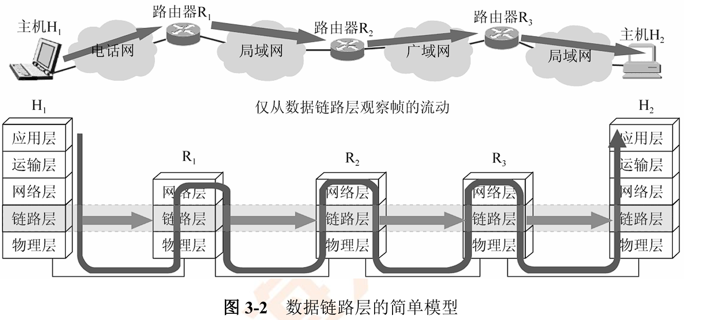
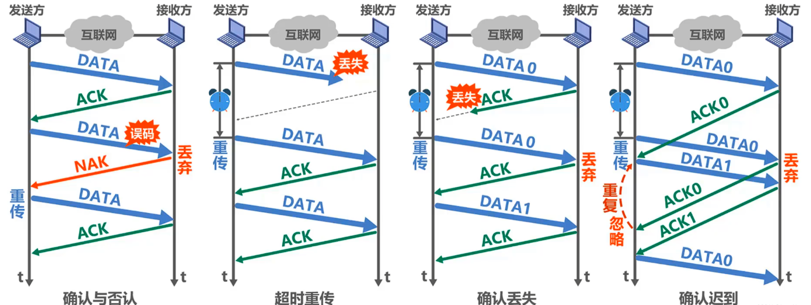
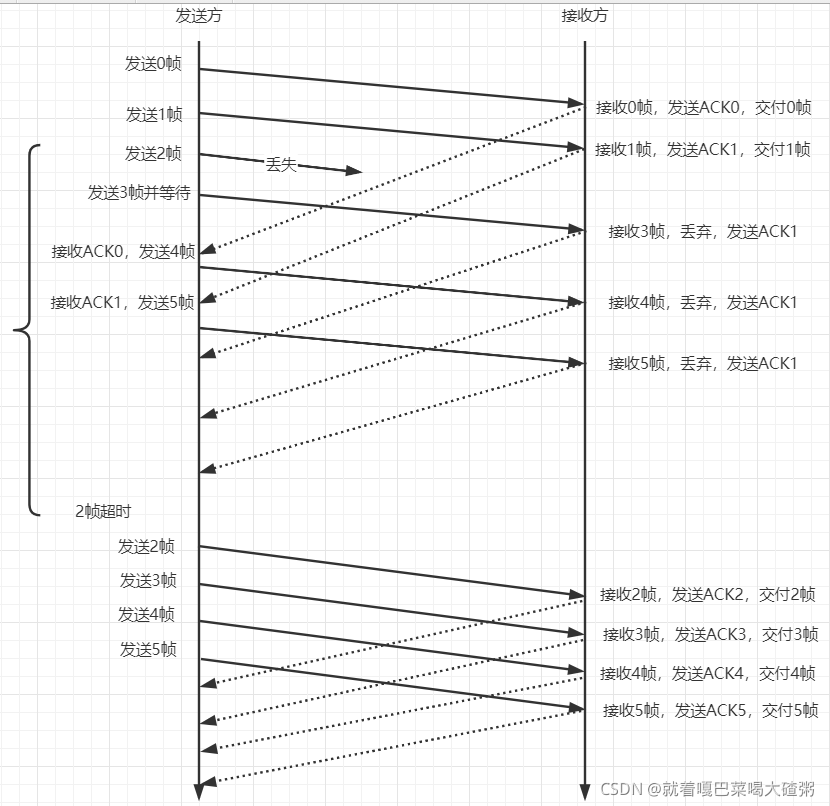
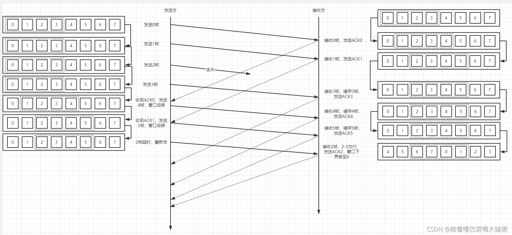
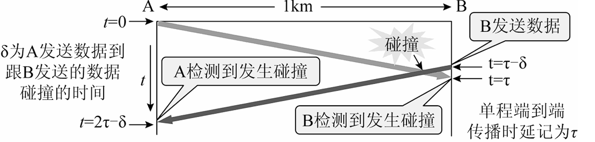
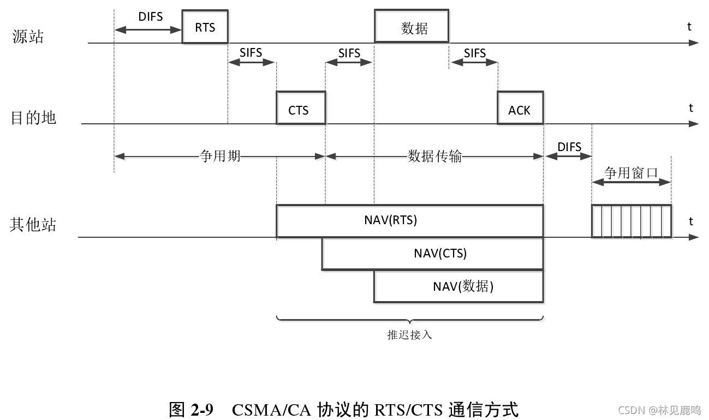
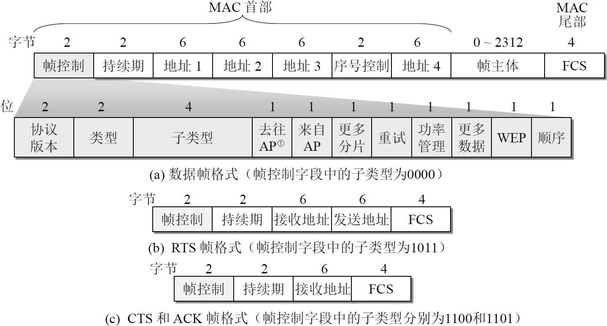
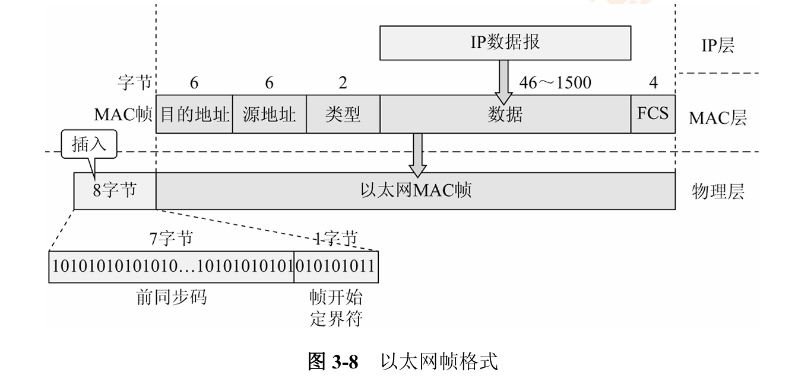
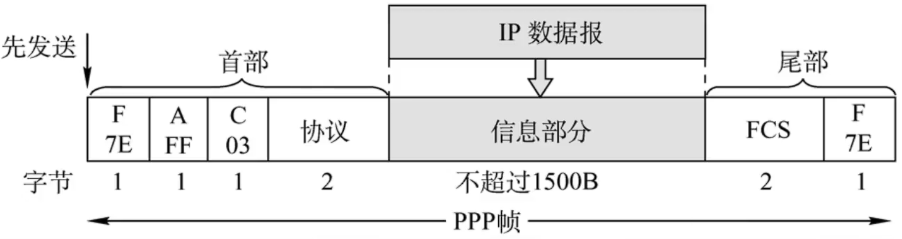
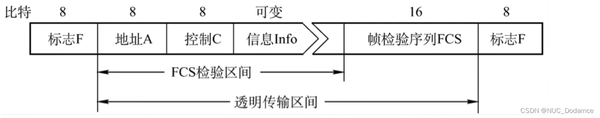

<h2 align="center">第三章 数据链路层</h2>

> **408 高频考点提醒**：
> - 数据链路层三大基本问题：**封装成帧、透明传输、差错检测**
> - **CRC 循环冗余检验**：模 2 除法求 FCS，接收端余数为 **0** 则无差错；**只检错、不纠错**（必考计算题）
> - 可靠传输三要素：**确认、超时重传、序号**；GBN 窗口 **$W_T \le 2^n - 1$**、SR 窗口 **$W_T = W_R \le 2^{n-1}$**
> - 停止-等待信道利用率极低（发送时延 ≪ 传播时延），**滑动窗口连续发送**可大幅提高利用率
> - 介质访问控制三类：**信道划分（FDM/TDM/WDM/CDMA）、随机访问（ALOHA/CSMA/CSMA-CD）、轮询（令牌）**
> - **CSMA/CD**：边发边听、冲突后**二进制指数退避**；最短帧长 = **$2\tau \times$ 数据率**（10Mbps → 64B）
> - 以太网 MAC 帧：目的 6B + 源 6B + 类型 2B + 数据 46~1500B + **FCS 4B**，最短帧 **64B**（保证冲突检测）
> - 交换机：**自学习**（学源地址、查目的地址 → 泛洪/转发/丢弃）；**隔离冲突域、不隔离广播域**
> - **VLAN**：802.1Q 在帧中插 **4 字节标签**，隔离广播域；跨 VLAN 通信需路由器/三层交换机
> - PPP 面向**字节**（字节填充 0x7E→0x7D 0x5E）、HDLC 面向**比特**（零比特填充）；设备：物理层不隔离冲突域、链路层隔离冲突域

---

### （一）数据链路层的功能与三个基本问题

#### 一、数据链路层的功能

数据链路层位于**物理层之上、网络层之下**：物理层只负责比特流的传输，数据链路层把比特**组织成帧**，并解决帧在相邻节点之间的正确、有序交付。

**物理链路 vs 数据链路**：

| 对比项 | 物理链路（链路） | 数据链路 |
|:---|:---|:---|
| 组成 | 相邻节点间的**物理线路**（传输介质，中间无交换节点） | 物理链路 + **通信协议**及其实现的硬件/软件（网卡、驱动程序等） |
| <nobr>传输单位</nobr> | **比特流**（物理层负责） | **帧**（数据链路层负责） |
| 特点 | 仅提供原始传输通道 | 在物理链路上叠加了帧同步、差错控制等协议功能 |

##### 1. 为网络层提供的服务

数据链路层的基本任务：把**源机器**中来自网络层的数据传输到**目标机器的网络层**。为此，数据链路层可为网络层提供以下**三种服务**：

| 服务类型 | 建立链路 | 收帧确认 | 丢失帧的处理 | 可靠性 |
|:---|:---:|:---:|:---|:---:|
| **无确认的无连接服务** | 不需要 | 不确认 | 不重发，交给上层处理 | 最低 |
| **有确认的无连接服务** | 不需要 | 必须发回确认 | 规定时间内未收到确认则**重传** | 较高 |
| **有确认的面向连接服务** | 需要（建链→传输→释放） | **每一帧都确认** | 收到确认后才能发送下一帧 | **最高** |

- **无确认的无连接服务**：发送帧前不需要建立链路连接，目的机器收到帧后不发确认；对丢失的帧，数据链路层不负责重发，**交给上层处理**。
- **有确认的无连接服务**：发送帧前不需要建立链路连接，但目的机器收到帧后**必须发回确认**；源机器在规定时间内没有收到确认信号，就**重传丢失的帧**，以提高传输的可靠性。
- **有确认的面向连接服务**：帧传输分为三个阶段——**建立数据链路、传输帧、释放数据链路**；目的机器对收到的**每一帧**都给出确认，源机器收到确认后才能发送下一帧，可靠性**最高**。

> **注意**：**有连接就一定要有确认**——不存在"无确认的面向连接"的服务。
> **考点**：三种服务可靠性排序：**无确认无连接 < 有确认无连接 < 有确认的面向连接**；以太网属于无确认的无连接服务。

##### 2. **数据链路层的主要功能**：

| 功能             | 说明                                                         |
| :--------------- | :----------------------------------------------------------- |
| **封装成帧**     | 把网络层的 IP 数据报加上**帧首部、帧尾部**封装成帧（帧定界） |
| **透明传输**     | 帧中数据出现与定界符相同的比特组合时，不影响帧定界（字节填充/零比特填充） |
| **差错控制**     | 检测/纠正传输错误（CRC 检错；结合 ARQ 自动重传纠错）         |
| **流量控制**     | 控制发送速率，防止接收方来不及接收（滑动窗口）               |
| **介质访问控制** | 协调多个站点对共享信道的访问（MAC，详见第三章（三））        |
| **链路管理**     | 数据链路的建立、维持、释放（面向连接的链路）                 |



> **考点**：数据链路层三大基本问题 = **封装成帧、透明传输、差错检测**（王道强调的"三个基本问题"）；差错检测（奇偶校验 / CRC / 海明码）详见（八）常用的校验方法。物理链路是"线路"，数据链路是"线路 + 协议"。

#### 二、封装成帧

##### 1. 帧定界（Frame Delimiting）

- **帧（Frame）** = 帧首部 + 数据部分 + 帧尾部。首部/尾部存放**帧定界标志**、地址、长度等控制信息。
- **帧定界**：接收方依据首部/尾部的**标志**识别一帧的开始与结束；帧尾部通常还附有 **FCS（帧检验序列，CRC 计算结果）**。

```
┌─────────┬───────────────┬─────────┐
│ Header  │     Data      │ Trailer │
└─────────┴───────────────┴─────────┘
```

> 图：帧的组成 = 帧首部（Header）+ 数据部分（Data）+ 帧尾部（Trailer）。

**帧定界的四种方法**：

| 方法 | 原理 | 特点 |
|:---|:---|:---|
| **字符计数法** | 帧首部的首字段记录**帧内字符总数**，接收端按计数取帧 | 计数一旦出错便**失去同步**，很少单独使用 |
| **字符填充法**（首尾定界符法） | 用**特殊标志**定界（如 PPP 的 0x7E），数据中出现标志或转义符时插入**转义字节** | 面向字节，PPP：0x7E → 0x7D 0x5E |
| **比特填充法**（首尾定界符法） | 用**特殊标志**定界（如 HDLC 的 01111110），数据中出现**连续 5 个 1** 时插入 0 | 面向比特，HDLC：零比特填充 |
| **违规编码法** | 借用物理层**违规编码**定界（如曼彻斯特编码中不出现的"高-高/低-低"电平） | 无需填充；用于采用曼彻斯特编码的局域网（如 802.5 令牌环） |

> **考点**：帧定界四法 = **字符计数法、字符填充法、比特填充法、违规编码法**；其中**字符/比特填充法**（即首尾定界符法）需配合填充实现透明传输，解决"数据撞标志"问题。

##### 2. 帧同步（Frame Synchronization）

- **帧同步**：接收端能从收到的**比特流中正确地区分出一帧的开始和结束位置**——帧定界是手段，帧同步是目的。
- 帧同步失败：接收端无法识别帧边界，只能**丢弃该帧**，由可靠传输机制（确认 + 超时重传）恢复。

| 同步层次 | 解决什么问题 | 实现者 |
|:---|:---|:---|
| **位同步（比特同步）** | 接收端与发送端的**比特时钟对齐**，正确采样每个比特 | 物理层 |
| **帧同步** | 从比特流中**识别帧的开始与结束**（帧边界） | 数据链路层（靠**帧定界标志**） |

> **考点**：**位同步是物理层的事**（比特时钟对齐），**帧同步是链路层的事**（识别帧首尾）——两者别混。

##### 3. 透明传输（Transparent Transmission）

**透明传输**：无论数据部分是什么比特组合，都能正常传输——数据中出现与**帧定界标志相同**的比特组合时，不能干扰帧定界。

**字节填充（PPP，面向字节）**：

- PPP 帧的定界标志是 **0x7E**（此字符填充用于**异步链路**；同步链路改用硬件比特填充，见（五）一）。数据中出现 0x7E 或 0x7D 时，在其前插入**转义字节 0x7D**：
  - **0x7E → 0x7D 0x5E**（标志转义）
  - **0x7D → 0x7D 0x5D**（转义符自身转义）
  - 控制字符（小于 0x20）→ 0x7D + (该字符 ⊕ 0x20)
- 接收端遇到 0x7D 时，把后一字节恢复为原字符。

```
原始数据:     A  0x7E  B  0x7D  C
字节填充后:   A  0x7D 0x5E  B  0x7D 0x5D  C
接收端还原:   A  0x7E  B  0x7D  C
```

**零比特填充（HDLC，面向比特）**：

- HDLC 帧的定界标志是 **01111110**。发送端在数据中每遇到**连续 5 个 1**，就在其后**插入一个 0**；接收端每遇到连续 5 个 1，就**删除后面的 0**。
- 效果：数据中不会出现 6 个及以上连续 1，不会与标志 01111110 混淆。

```
原始数据:     0 1 1 1 1 1 1 0   （含 6 个连续 1）
零比特填充后:  0 1 1 1 1 1 0 1 0（第 5 个 1 后插入 0）
接收端还原:    0 1 1 1 1 1 1 0
```

> **考点**：透明传输两种手段——PPP 面向**字节**用**字节填充**（0x7E → 0x7D 0x5E）；HDLC 面向**比特**用**零比特填充**（5 个连续 1 后插 0）。口诀："PPP 转义 0x7E，HDLC 五个一插零"。

##### 4. MTU（最大传送单元）

- **MTU（最大传送单元，Maximum Transfer Unit）**：数据链路层**数据部分**允许的最大长度（以太网 **1500B**）。IP 数据报超过 MTU 时需在**网络层分片**。
- 数据部分越短 → 首尾部开销占比越大；越长 → 单帧差错影响范围越大——MTU 取折中。

> **考点**：MTU 是数据部分（不含首尾部）的最大长度；分片是**网络层**的事（IP 分片），数据链路层不管分片。

---

### （二）流量控制与可靠传输

#### 一、流量控制与滑动窗口机制

**流量控制**：控制发送方的发送速率，使接收方**来得及接收**（防止接收缓冲溢出）。数据链路层靠**接收方回送确认**配合窗口实现（不靠窗口大小字段通告，这是与传输层 TCP 的窗口通告的区别）。

##### 1. 停止-等待协议（Stop-and-Wait）

- 发送方发送**一帧**后**停下来等待**，收到确认（ACK）后才发下一帧；超时未收到确认则重传该帧。
- 一帧一确认，大量时间花在等待往返上——**信道利用率低**（详见（二）四）。
- 帧用 **0/1 交替编号**、确认帧分 **ACK0 / ACK1**：确认帧损坏时，接收方丢弃重复帧并**重发确认**（教材 3.3.2）

```
发送方 A                    接收方 B
   │── 数据帧 0 ────────────►│
   │◄───────── 确认 ACK0 ────│
   │── 数据帧 1 ────────────►│
   │◄───────── 确认 ACK1 ────│
```

> 图：停止-等待协议——发一帧、等确认、再发下一帧，一帧一个往返。

##### 2. 滑动窗口机制（Sliding Window）

- **发送窗口 $W_T$**：发送方**无需等待确认就能连续发送**的帧数；只有窗口内的帧可发送。
- **接收窗口 $W_R$**：接收方允许接收的帧范围。
- 每收到确认，发送窗口**向前滑动**——由此得名"滑动窗口"；窗口越大，连续发送的帧越多，利用率越高。

##### 3. 可靠传输三要素



| 要素 | 作用 |
|:---|:---|
| **确认（ACK）** | 接收方告知发送方哪些帧已正确收到 |
| **超时重传** | 发送方启动计时器，超时未收到确认就重传（可靠性的保证） |
| **序号（编号）** | 区分新旧帧，判断重复/乱序 |

> **考点**：可靠传输 = 确认 + 超时重传 + 序号，三者缺一不可；TCP 的可靠传输同样基于这三要素。链路层流量控制与传输层的区别：链路层不用窗口大小字段通告。
> **注意（教材 3.3.3）**：**接收缓存 ≠ 接收窗口**——按序到达但未交付主机的帧放**接收缓存**，乱序无错的帧放**接收窗口**；考试中通常把接收缓存**默认当作**接收窗口。

#### 二、回退 N 帧协议（GBN, Go-Back-N）

**思想**：发送方在窗口内**连续发送**多帧；接收方**按序接收**，只收顺序正确的下一帧。

| 特性 | GBN |
|:---|:---|
| 发送窗口 $W_T$ | $1 ≤ W_T ≤ 2^n − 1$（n 为序号位数） |
| 接收窗口 $W_R$ | **= 1**（只能接收按序到达的下一帧） |
| 确认方式 | **累计确认**：对 n 号帧的确认 = n 号及以前所有帧全部正确收到 |
| 出错处理 | 出错/乱序帧**全部丢弃**；发送方**超时重传该帧及后续所有帧**（回退 N） |
| 帧缓存 | 接收方**不缓存**乱序帧（只需 1 帧缓存） |



**为什么 $W_T \le 2^n - 1$**：若 $W_T = 2^n$，发送方连续发完序号 $0\sim2^n-1$ 后，若所有确认都丢失，超时后重发 0 号帧——此时接收方已进入新一轮，会把重发的 0 号帧误认为"新一组的第一个帧"（新旧序号重叠无法区分）。**留出一个序号位置**（窗口最多 $2^n-1$ 个）才能区分新旧。

**例题（王道）**：GBN 协议，序号 3 位（n = 3），则 $W_T \le 2^3 - 1 = 7$。

- 发送方发出 0~6 共 7 帧，第 **2 号帧丢失**
- 接收方收到 3、4、5、6 号（乱序）→ **全部丢弃**，可能回送对 1 号的重复确认
- 发送方超时后**回退重传 2、3、4、5、6 共 5 帧**（即使其中部分已正确到达）

> **考点**：GBN 窗口上限 **$W_T = 2^n - 1$**；接收窗口恒为 1；**累计确认**（对 n 号确认 = 前 n 号全收）；超时重传"该帧 + 后续所有帧"（浪费带宽但简单）。

#### 三、选择重传协议（SR, Selective Repeat）

**思想**：接收方**缓存乱序帧**，发送方**只重传超时的那一帧**，按序交付后窗口滑动。

| 特性 | SR |
|:---|:---|
| 发送窗口 $W_T$ | **$W_T = W_R ≤ 2^{n−1}$**（且 $W_T + W_R ≤ 2^n$） |
| 接收窗口 $W_R$ | $= W_T$（可缓存多个乱序帧） |
| 确认方式 | **逐个确认**（每个正确收到的帧单独确认） |
| 出错处理 | 只重传出错/超时的**那一帧** |
| 帧缓存 | 接收方**缓存乱序帧**，凑齐后按序交付上层 |

**为什么 $W_T + W_R \le 2^n$**：SR 允许乱序接收、缓存，新旧帧的序号区间不能重叠；取最大值时 $W_T = W_R = 2^{n-1}$。



**GBN vs SR 对比（同一组数据：n = 4 位序号）**：

| 对比项 | GBN | SR |
|:---|:---|:---|
| 最大发送窗口 | $2^{4} − 1 =$ **15** | $2^{3} =$ **8**（$W_T = W_R$） |
| 接收窗口 | 1 | 8 |
| 帧缓存 | 无（丢弃乱序帧） | 有（缓存乱序帧） |
| 重传范围 | 出错帧及**后续所有帧** | 仅**出错帧本身** |
| 确认方式 | 累计确认 | 逐个确认 |
| 开销 | 重传浪费大 | 缓存 + 每帧确认开销大 |

**例题（SR，与 GBN 同数据对照）**：序号 3 位（n = 3），$W_T = W_R = 2^{3-1} = 4$，发送方发出 **0、1、2、3** 号帧，其中 **1 号帧丢失**：

- 接收方收到 2、3 号（乱序）→ **不丢弃，缓存**
- 1 号超时 → 发送方 **只重传 1 号帧**（2、3 号已正确到达，不重传）
- 收齐 0 ~ 3 号后接收方**按序交付**上层，窗口滑动

> 与 GBN 对比：同样"1 号丢失"，GBN 要回退重传 1、2、3 共 **3 帧**，SR 只重传 **1 帧**——代价是接收方要缓存 + 逐个确认。

> **考点**：GBN 是"**回退**重传"（窗口大、简单），SR 是"**选择**重传"（只重传错的，但要缓存、逐个确认）。GBN 接收窗口 = 1，SR 接收窗口 = 发送窗口。

#### 四、信道利用率计算（重点）

**信道利用率**：一个发送周期中**有效发送数据的时间**占比。

**停止-等待的信道利用率**：

$$U = \frac{T_{发送}}{T_{发送} + RTT + T_{确认}}$$

- $T_{\text{发送}}$ = 帧长 / 数据率（发送时延）
- **RTT** = 往返传播时延 = $2\tau$（$\tau$ 为单程传播时延）
- 停止-等待每个周期只发一帧，等待 RTT 的时间占比大 → 利用率低

**例题（王道经典）**：主机 A 向 B 发送 **1KB** 的帧，数据率 **100Mbps**，RTT = **20ms**，确认帧发送时延与数据帧相同，求停止-等待的信道利用率。

| 项目 | 计算 |
|:---|:---|
| 帧长 | 1KB = 1024 B = 8 × 1024 = **8192 bit** |
| T<sub>发送</sub> | $8192 / (100 \times 10^{6}) = 8.192 \times 10^{-5}$ s = **0.08192 ms** |
| RTT | **20 ms** |
| T<sub>确认</sub> | 与数据帧相同 = **0.08192 ms** |
| 利用率 U | $0.08192 / (0.08192 + 20 + 0.08192) = 0.08192 / 20.16384 \approx$ **0.00406 ≈ 0.41%** |

**结论**：发送一帧只需 0.08ms，却要等 20ms 的往返——**利用率仅约 0.4%**，信道几乎全程空闲。

**GBN / SR（滑动窗口）提高利用率**：

$$U = \frac{W_T \times T_{发送}}{T_{发送} + RTT + T_{确认}}$$

- 窗口内**连续发送 $W_T$ 帧**，把 20ms 的等待时间分摊到多帧上；$W_T$ 越大利用率越高（受窗口上限约束）。
- 仍用上例数据（n 足够大，$W_T = 100$）：$U = 100 \times 0.08192 / 20.16384 \approx$ **40.6%**——比停止-等待提高约 **100 倍**。

**停等 / GBN / SR 三协议对比速记表**：

| 协议 | 最大发送窗口 | 最小发送窗口 | 最大接收窗口 | 最小接收窗口 | 累计确认 | 有序接收 | 最大利用率 | 最大带宽（吞吐量） | 口诀 |
|:---:|:---:|:---:|:---:|:---:|:---:|:---:|:---:|:---:|:---|
| **停等** | $1$ | $1$ | $1$ | $1$ | 否 | 是 | $\dfrac{W \cdot T_D}{T_D+RTT+T_A}$ | $\dfrac{W \cdot L}{T_D+RTT+T_A}$ | 有序发送、有序接收 |
| **GBN** | $2^n-1$ | $2$ | $1$ | $1$ | 是 | 是 | $\dfrac{W \cdot T_D}{T_D+RTT+T_A}$ | $\dfrac{W \cdot L}{T_D+RTT+T_A}$ | 累计确认；哪里出错从哪儿传 |
| **SR** | $2^{n-1}$ | $2$ | $2^{n-1}$ | $2$ | 否 | 否 | $\dfrac{W \cdot T_D}{T_D+RTT+T_A}$ | $\dfrac{W \cdot L}{T_D+RTT+T_A}$ | 选择确认；哪里出错传哪里 |

> **注**：$T_D = T_{发送}$（帧发送时延）、$T_A = T_{确认}$（确认帧发送时延）、$L$ 为帧长（bit）、$W$ 为发送窗口帧数、$n$ 为序号位数。**最大利用率** $= \frac{W \cdot T_D}{T_D+RTT+T_A}$，**最大带宽（吞吐量）** $= \frac{W \cdot L}{T_D+RTT+T_A}$。需注意：SR 的接收窗口与发送窗口相等，且 $W_T+W_R \le 2^n$；GBN 与 SR 的窗口上限规则见（二）一-2 滑动窗口机制。

> **考点**：利用率公式的分子是"发送时间"，分母是"发送 + 往返传播 + 确认"。帧长注意单位换算（KB → ×8 → bit）。
> **易错点**：① RTT 本身就是往返时间（RTT = $2\tau$），分母直接用 RTT，**不要再乘 2**；若题给的是**单程**传播时延 $\tau$，则等待时间为 $2\tau$；② 确认帧发送时间有时给"忽略"，有时按帧长算——按题目条件代入。

---

### （三）介质访问控制

**介质访问控制（MAC, Medium Access Control）**：解决多个站点**共享信道**时"谁在什么时间发送"的问题。三大类：

| 类别 | 思想 | 典型协议 |
|:---|:---|:---|
| **信道划分**（静态分配） | 把信道资源按时间/频率/码**预先划分**给各站 | FDM、TDM、WDM、CDMA |
| **随机访问**（动态争用） | 各站**自由竞争**信道，冲突后重发 | ALOHA、CSMA、CSMA/CD、CSMA/CA |
| **轮询访问**（轮流使用） | 按约定**轮流**使用信道，避免冲突 | 令牌传递（令牌环） |

#### 一、信道划分介质访问控制

##### 1. 频分/时分/波分/码分多路复用

| 方式 | 划分维度 | 特点 |
|:---|:---|:---|
| **FDM 频分多路复用** | 按**频率**划分（各信道占用不同频段） | 各用户**同时**使用信道，频率互不重叠，并行传输 |
| **TDM 时分多路复用** | 按**时间**划分（时间片轮转） | 各用户**轮流**使用全部带宽；同步 TDM 固定时隙，**统计 TDM（异步）** 按需分配 |
| **WDM 波分多路复用** | 按**光波波长**划分 | 光纤通信中不同波长的光信号复用同一根光纤 |
| **CDMA 码分多路复用（码分多址）** | 按**码片序列**划分（各站码片两两正交） | 各站**同时、同频**发送，靠正交码分离信号 |

> **考点**：FDM"频率错开、同时使用"；TDM"时间错开、轮流使用"；WDM 是光波版的 FDM；CDMA"码正交、同时同频"。

##### 2. CDMA 码分多址（例题）

**原理**：每个站分配一个 m 位**码片序列**（如 8 位），各站码片**两两正交**；发送 1 发原码片、发送 0 发**反码**；各站信号在信道上**线性叠加**，接收方用某站码片与叠加信号 X 做**内积**即可还原该站数据：

$$S \cdot X \div n = \begin{cases} +1 & \text{该站发送 1} \\ -1 & \text{该站发送 0} \\ 0 & \text{该站未发送} \end{cases}$$

**例题（王道经典）**：站 S 的码片 S = (−1,−1,−1,+1,+1,−1,+1,+1)，站 T 的码片 T = (−1,−1,+1,−1,+1,+1,+1,−1)。

**① 正交性验证**：

| 项目 | 计算 |
|:---|:---|
| $S \cdot S$ | $(+1)(+1)\times 8$ 项 = $1+1+1+1+1+1+1+1 =$ **8**（= n，码片位数） |
| $S \cdot T$ | $(+1)+(+1)+(-1)+(-1)+(+1)+(-1)+(+1)+(-1) =$ **0**（两两正交） |

**② 分离发送 1 的站**：设 S、T 同时发送 1，信道叠加信号 X = S + T = (−2,−2,0,0,+2,0,+2,0)：

| 计算 | 结果 | 结论 |
|:---|:---|:---|
| $S \cdot X = S \cdot (S+T) = S \cdot S + S \cdot T = 8 + 0 = 8$ | $8 \div 8 =$ **+1** | S 发送的是 **1** |
| $T \cdot X = T \cdot (S+T) = 0 + 8 = 8$ | $8 \div 8 =$ **+1** | T 发送的是 **1** |

**③ 分离发送 0 的站**：若 S 发送 0（发反码 −S）、T 发送 1（发 T），X = −S + T：

| 计算 | 结果 | 结论 |
|:---|:---|:---|
| $S \cdot X = S \cdot (-S+T) = -8 + 0 = -8$ | $-8 \div 8 =$ **−1** | S 发送的是 **0** |
| $T \cdot X = T \cdot (-S+T) = 0 + 8 = 8$ | $8 \div 8 =$ **+1** | T 发送的是 **1** |

**结论**：**$S \cdot X/n$ 得 +1 → 发送 1；得 −1 → 发送 0；得 0 → 未发送**。CDMA 靠码片**正交性**（$S \cdot T = 0$）把叠加信号分离，各站可同时同频发送。

> **考点**：CDMA 分离公式 **$S \cdot X / n = \pm 1$ 或 0**；发送 0 是发码片**反码**（不是全 0 序列）；$S \cdot S = n$、$S \cdot T = 0$（正交）。
> **易错点**：内积后要**除以码片位数 n**；码片必须两两正交，否则无法分离。

#### 二、随机访问介质访问控制

各站**自由竞争**信道，冲突后按规则重发。

##### 1. ALOHA

| 协议 | 策略 | 最大信道利用率 |
|:---|:---|:---|
| **纯 ALOHA** | 想发就发，冲突则随机等待后重发 | ≈ **18.4%** |
| **时隙 ALOHA** | 把时间分成时隙，只能在**时隙起点**发送 | ≈ **36.8%**（冲突减半） |

##### 2. CSMA（载波监听多点接入，Carrier Sense Multiple Access）

发送前**先监听信道**（载波侦听），信道忙时按不同策略处理：

| 协议 | 策略 | 特点 |
|:---|:---|:---|
| **1-坚持 CSMA** | 信道忙则**持续监听**，一空闲**立即发送** | 响应快，但大家都抢"刚空闲"的瞬间，**冲突概率大** |
| **非坚持 CSMA** | 信道忙则**随机等待**一段时间再监听 | 冲突减少，但引入随机等待延迟，利用率下降 |
| **p-坚持 CSMA** | 信道空闲时以概率 **p** 发送、以 (1−p) 概率**延迟一个时隙**再试 | 用于**时隙信道**，折中方案 |

> **考点**：CSMA 只"**先听后发**"（监听解决不了传播时延内的冲突）；"1-坚持/非坚持/p-坚持"的区别在于**信道忙/空闲时怎么处理**。

##### 3. CSMA/CD（载波监听多点接入/冲突检测，重点）

**CSMA/CD（Carrier Sense Multiple Access / Collision Detection）**：以太网采用，核心是**边发边听**。

- **先听后发**：信道空闲才发送；**边发边听**：发送过程中持续**检测冲突**（信号电平/电压异常变化）
- **检测到冲突** → 立即**停止发送**，并发送**冲突强化信号**（干扰信号），让所有站点都知道冲突发生
- **二进制指数退避（Binary Exponential Backoff）**：第 k 次重传时，在 **$0 \sim 2^m - 1 (m=Min[k,10])$** 中**随机选一个整数**，作为等待的**争用期（$2 \tau$）个数**，等完后再监听重发
  - **注意：**当 $k＜10$ 时，参数 k 等于重传次数。当重传达 16 次仍不能成功时即丢弃该帧，并向高层报告。

**碰撞检测的实现（边发边听）**：

- **原理**：发送数据的同时也**接收**信道信号，比较**发送电平与接收电平**——两个站同时发送时信号在信道中**叠加**，接收电平**异常升高**或**波形畸变**（超过正常阈值）→ 判定冲突
- 检测到冲突后立即**停止发送**，并发出 **32 位冲突强化信号（JAM）**，使**所有站点**都能感知冲突，防止部分站误判"发送成功"
- 边发边听的意义：**不等确认、当场止损**——冲突帧立即作废并进入退避重传

**为什么关键时间是 $2\tau$（争用期）**：设相距最远的 A、B 两站，单程传播时延 $\tau$：



- A 从发出到**必然能感知冲突**的极限时间 = **$2\tau$**（**争用期 / 冲突窗口**）
- 若 A 的帧在 $2\tau$ 内已发完，冲突信号返回时 A 早已停发，会**误判"发送成功"**——所以要求**发送一帧的时间 ≥ $2\tau$**，即**最短帧长 = $2\tau$ × 数据率**（公式的由来）

> **考点**：碰撞检测三要素——**边发边听（电平比较）、32 位 JAM 冲突强化信号、$2\tau$ 争用期内必能听到冲突**；三者缺一都会"漏报冲突"。

| 重传次数 k | 随机退避范围（时隙数） | 说明 |
|:---|:---|:---|
| 第 1 次 | 0 ~ 1（2¹ − 1） | 随机取 0 或 1 个争用期 |
| 第 2 次 | 0 ~ 3（2² − 1） | |
| 第 k 次（k ≤ 10） | 0 ~ 2<sup>k</sup> − 1 | k > 10 后固定在 0 ~ 1023 |
| 第 16 次 | 仍失败 → **放弃发送**，报告上层 | 不无限重试 |

**最短帧长公式**：

$$最短帧长 = 2\tau \times 数据率$$

- **原理**：发送方必须在自己**该帧还没发完**时就能感知冲突——若帧太短，发完帧后冲突信号才返回，发送方会误判"发送成功"。
- $\tau$ 为单程传播时延，**$2\tau$ 称为争用期（冲突窗口）**：任意两站发生冲突，最迟 $2\tau$ 内都能被发现。

**例题①（标准以太网）**：数据率 **10Mbps**，端到端往返传播时延 **$2\tau$ = 51.2μs**：

| 项目 | 计算 |
|:---|:---|
| 最短帧长 | $2\tau \times$ 数据率 = $51.2 \times 10^{-6} \times 10 \times 10^{6} =$ **512 bit = 64 B** |
| 争用期 | 51.2μs = 512 bit 时间 |

> 即标准以太网最短帧 **64B（512 bit）**——比 64B 短的帧是**冲突碎片（残帧）**，接收方直接丢弃。

**例题②（数据率提高）**：若数据率提高到 **100Mbps**、网络覆盖不变（**$2\tau$ 仍为 51.2μs**，单程传播时延 25.6μs）：

| 项目 | 计算 |
|:---|:---|
| 最短帧长 | $2\tau \times$ 数据率 = $51.2 \times 10^{-6} \times 100 \times 10^{6} =$ **5120 bit = 640 B** |

**结论**：最短帧长 = $2\tau \times$ 数据率。数据率提高 10 倍（10 → 100Mbps）而 $2\tau$ 不变时，最短帧长也提高 10 倍（64B → 640B）。**数据率越高、网络覆盖范围越大，要求的最短帧越长**——这正是百兆以太网必须把冲突域直径缩短（约 200m）的原因。

> **考点**：最短帧长公式必须会算（单位换算：μs × Mbps = bit，bit ÷ 8 = B）；标准以太网 **64B** 对应 **$2\tau$ = 51.2μs**。
> **易错点**：公式里是 **$2\tau$（往返）**，不是单程 $\tau$；数据率提高而网络不变时最短帧长**变长**（不是变短）。

##### 4. CSMA/CD 工作流程

```
站有数据要发送
   │
   ▼
载波监听 ──信道忙──► 继续监听
   │ 信道空闲
   ▼
发送数据帧，同时进行冲突检测
   ├─ 始终未检测到冲突 → 发送成功，结束
   └─ 检测到冲突 → 停止发送 + 发送冲突强化信号
        │
        ▼
   二进制指数退避（随机 0 ~ 2^k − 1 个争用期 2τ）
        │
        ▼
   重传次数 +1，重新监听并发送（超过 16 次放弃）
```

> 图：CSMA/CD 发送流程——先听后发、边发边听、冲突停发（强化信号）、指数退避重发。

#### 三、CSMA/CA（无线局域网，WLAN）

##### 1. **CSMA/CA（Carrier Sense Multiple Access / Collision Avoidance，载波监听多点接入/碰撞避免）**：无线局域网采用。无线环境**无法检测冲突**（信号衰减、收不到远处的站——隐蔽站问题），所以改为**碰撞避免**。

**CSMA/CD 与 CSMA/CA 的区别**：

| 对比项 | CSMA/CD（有线以太网） | CSMA/CA（无线 WLAN） |
|:---|:---|:---|
| 能否检测冲突 | **能**（边发边听，电压变化） | **不能**（无线难边发边收） |
| 机制 | 冲突**检测** + 检测到后退避重发 | 冲突**避免**（发送前预约信道） |
| 检测方式 | 电压/电平变化 | 能量检测 + 虚拟载波侦听（NAV） |
| 适用介质 | 有线（总线/双绞线） | 无线（广播信道） |

##### 2. **CSMA/CA 的碰撞避免手段**：

| 手段 | 说明 |
|:---|:---|
| <nobr>**预约信道（RTS/CTS）**</nobr> | 发送方先发 **RTS**（请求发送），接收方回 **CTS**（允许发送）；其他站听到 CTS 后在 **NAV（网络分配向量）** 期间不再发送（虚拟载波侦听） |
| **确认机制（ACK）** | 接收方正确收到帧后回 **ACK**；发送方未收到 ACK 则超时重传 |
| **帧间间隔（IFS）** | 不同优先级用不同帧间间隔（SIFS < DIFS），高优先级短等待 |

##### 3. 握手通信机制



**① 发送前监听与 DIFS：**

源站有数据要发送时，先监听信道。若信道空闲时间达到 **DIFS（分布式帧间间隔）**，源站发送一个短控制帧 **RTS（Request to Send，请求发送）**。RTS 帧中包含了传输后续数据所需的占用时长。

**② 目的站响应与 SIFS：**

目的站收到 RTS 后，等待一个较短的 **SIFS（短帧间间隔）**，向源站响应 **CTS（Clear to Send，允许发送）** 帧。CTS 中同样写入了后续传输所需的持续时间。

**③ 数据传输与 ACK 确认：**

源站收到 CTS 后，等待一个 SIFS 开始传输真正的**数据帧**；目的站成功接收数据后，再等待一个 SIFS 返回 **ACK 确认帧**，完成单次通信。

##### 4. 隐藏站问题（Hidden Station Problem）

**隐藏站**：两个站的覆盖范围**互不重叠**（A、C 都在 AP B 的范围内，但 A 听不到 C、C 也听不到 A）：

```
      B（AP，能听到 A 和 C）
     ╱                 ╲
   A                   C
   （A 发送 C 听不到，C 发送 A 也听不到——互为隐藏站）
```

- **问题**：A 给 B 发数据时，C **感知不到 A 的发送**、误判信道空闲 → C 也同时给 B 发 → 两帧在 **B（接收端）处冲突**——而发送方 A、C 自己**感知不到冲突**（这正是"无线无法检测冲突"的典型场景）
- **本质**：CSMA"先听后发"的前提是发送方能听到所有竞争者；无线环境下**听不到**，监听机制失效
- **解决（RTS/CTS 预约）**：A 发 **RTS** → B 回 **CTS（广播）** → C **听得到 B 的 CTS**（虽然听不到 A 的 RTS）→ C 设置 **NAV** 推迟发送，冲突得以避免
- 一句话记忆："**发方听不到的事，由接收方广播 CTS 来通知**"
- 对比**暴露站问题**：发送方**听得到**对方的发送而误判忙、不敢发（其实不影响自己）——与隐藏站相反

> **考点**：隐藏站问题 = **发送方互相听不到 → 冲突发生在接收端**；RTS/CTS 的关键是 **CTS 由接收端广播**，隐藏站听到 CTS 后设 **NAV** 推迟发送。

> **考点**：CSMA/CD 是"冲突**检测**（出错后重传）"，CSMA/CA 是"冲突**避免**（RTS/CTS 预约 + ACK 确认）"——根本原因是**无线无法边发边听（无法检测冲突）**。

#### 四、轮询访问：令牌传递

- **令牌（Token）**：一个特殊的短控制帧。各站组成**逻辑环**，令牌**沿环依次传递**，**持有令牌的站才有权发送数据**，发完（或持有时间到）就把令牌传给下一站。
- 特点：**无冲突**（信道被轮流占用）、各站**公平**、延迟可确定（适合实时应用）；缺点是令牌开销、令牌丢失需重建、环路管理复杂。
- 典型应用：**令牌环（IEEE 802.5）**（工作原理详见（四）六）、FDDI（光纤分布式数据接口）。

> **考点**：轮询访问与随机访问相反——**无冲突、确定性延迟**；代价是令牌维护开销。

#### 五、802.11 帧结构（WLAN MAC 帧）

**802.11 MAC 数据帧** 由 9 个字段组成（帧头 24 ~ 30B）：



> 图：802.11 MAC 帧 = 帧控制 2B + 持续 2B + 地址 1~3 各 6B + 序号控制 2B + 地址 4（6B，标 * 仅无线桥接时出现）+ 数据 0~2312B + FCS 4B；最长 2346B。

- **帧控制（Frame Control，2B = 16 bit）**：协议版本(2 bit) + 类型(2 bit) + 子类型(4 bit) + **To DS / From DS** / 更多分片 / 重试 / 功率管理 / 更多数据 / 受保护帧 / Order（各 1 bit）
- **持续/ID（2B）**：写入**信道占用时间**——RTS/CTS 中的 **NAV** 时长就记录在此（衔接 CSMA/CA）
- **序号控制（Seq Ctl，2B）**：帧序号 + 分片号，支持**重传去重**（以太网帧没有此字段）
- **数据**：0 ~ **2312B**（比以太网 MTU 1500B 大）
- **FCS（4B）**：CRC 帧检验序列（同以太网）

**帧类型**（帧控制"类型"字段指定）：**数据帧**、**控制帧**（RTS、CTS、ACK）、**管理帧**（Beacon 信标、关联请求等）。

**四个地址字段的用法**（关键考点，由 To DS / From DS 两位置 1 决定）：

| To DS | From DS | 场景 | 地址1 | 地址2 | 地址3 | 地址4 |
|:---:|:---:|:---|:---|:---|:---|:---|
| 0 | 0 | Ad-hoc（站点直连） | 目的站 | 源站 | BSSID | — |
| 1 | 0 | 站点 → AP（上行） | **BSSID（AP）** | 源站 | 目的站 | — |
| 0 | 1 | AP → 站点（下行） | 目的站 | **BSSID（AP）** | 源站 | — |
| 1 | 1 | 无线桥接 / AP 间转发 | 接收端 AP | 发送端 AP | 目的站 | 源站 |

- **BSSID（基本服务集标识，Basic Service Set Identifier）= 接入点 AP 的 MAC 地址**；三种模式（自组网 / 基础结构 / 桥接）对地址字段的需求个数不同。

> **考点**：802.11 帧与以太网帧的最大区别——**4 个地址字段**（以太网只有 2 个）：地址用哪几个由 **To DS / From DS** 决定；**BSSID 就是 AP 的 MAC**。
> **易错点**：① 类型字段在**帧控制内部**（管理/控制/数据），以太网才有独立的 2B 类型字段；② 地址 4 只在**无线桥接（1/1）**时出现；③ 数据上限 **2312B** ≠ 以太网 1500B。

---

### （四）局域网中的数据链路层

#### 一、局域网的基本概念

- **局域网（LAN, Local Area Network）**：覆盖范围**小**（一栋楼、一个园区）、**高速**、**低误码率**、多站点**共享传输介质**、由组织**自建自管**。
- **IEEE 802 标准**：IEEE 802 委员会制定的局域网标准族（**802.3 以太网**、**802.11 无线局域网**、802.5 令牌环）；其中 **LLC（逻辑链路控制，802.2）** 与 **MAC（介质访问控制）** 构成数据链路层的两个子层。

| 局域网特点 | 说明 |
|:---|:---|
| 覆盖范围小 | 通常不超过数公里，组织自建自管 |
| 共享传输介质 | 多点接入共享信道（需介质访问控制解决争用） |
| 高速、低误码率 | 差错率约 $10^{-11}$ 量级，比广域网低得多 |
| 常用拓扑 | 总线型、星型、环型（逻辑）、树型 |

**局域网的主要优点（教材 3.5.1）**：① **广播功能**（一站可方便地访问全网）；② 便于系统的**扩展和演变**；③ 提高系统的**可靠性与可用性**；④ 各站为**平等关系**（非主从）。

**主要技术要素**：**网络拓扑结构、传输介质、介质访问控制方法**；主要介质访问控制方法有 **CSMA/CD、令牌总线、令牌环**（前两种用于总线型网，令牌环用于环形网）。

#### 二、以太网的工作原理

以太网（Ethernet）是**共享式局域网**的典型代表：多个站点**共享传输介质**，各站何时发送由**介质访问控制**决定——经典以太网采用 **CSMA/CD 协议**（先听后发、边发边听、冲突后二进制指数退避重发）。

- **工作过程**：站点发送前**监听信道**（空闲才发）→ 发送时**边发边听**检测冲突 → 冲突则发 **JAM 强化信号**并**退避重发**（完整机制详见（三）二-3、-4）
- **关键参数**：争用期 **$2\tau$**（最迟 $2\tau$ 内必能听到冲突）→ 最短帧长 = $2\tau \times$ 数据率 = **64B**（10Mbps 标准以太网）
- **发展趋势**：现代以太网多为**全双工交换式**（交换机独占链路），**不再需要 CSMA/CD**——CSMA/CD 只在半双工共享介质时需要
- **服务方式（教材 3.5.2）**：以太网采用**无连接**工作方式，**不编号、不确认**；目的站收到有差错帧直接**丢弃**——提供**不可靠交付（尽最大努力）**，差错纠正由**高层（TCP）**完成

> **考点**：以太网工作原理 = **共享介质 + CSMA/CD + MAC 帧**（帧格式见下一节）；以太网**无连接、不确认、不可靠交付**，差错由高层纠正；CSMA/CD 细节详见（三）二。

#### 三、以太网的 MAC 层

**（1）MAC 帧格式（以太网 V2）**：

**以太网（Ethernet, IEEE 802.3）** 的 MAC 帧由 5 个字段组成：



> 图：以太网 MAC 帧 = 目的地址 6B + 源地址 6B + 类型 2B + 数据 46~1500B + FCS 4B。

| 字段 | 长度 | 作用 |
|:---|:---|:---|
| **目的地址（DA）** | 6B | 目的站的 MAC 地址（可单播/多播/广播） |
| **源地址（SA）** | 6B | 发送站的 MAC 地址 |
| **类型（Type）** | 2B | 标识上层协议（0x0800 = IP，0x0806 = ARP） |
| **数据** | 46 ~ 1500B | IP 数据报（网络层分组）；不足 46B 需**填充（Padding）** |
| **FCS** | 4B | **CRC 帧检验序列**（检验目的地址到数据字段） |

- **帧长范围**：最小 **64B**（6+6+2+46+4），最大 **1518B**（6+6+2+1500+4）。
- **前导码（Preamble，8B，教材 3.5.3）**：**前同步码 7B**（使接收端时钟同步）+ **帧开始定界符 SFD 1B**；**不属于 MAC 帧本体**——FCS 不校验它，帧长 64~1518B 的计算也不含它

> **考点**：**最短帧长 64B 由 CSMA/CD 决定**——10Mbps、$2\tau$ = 51.2μs → 512 bit = 64B；数据不足 46B 时填充。
> **易错点**：FCS 的 CRC 检验范围是"目的地址 → 数据"（不含前导码）；"类型"字段标识**上层协议**（类似 PPP 的"协议"字段），不是数据长度。

**（2）MAC 地址与 IP 地址的区别**：

| 对比项 | MAC 地址（物理地址） | IP 地址（逻辑地址） |
|:---|:---|:---|
| 长度 | **48 位（6 字节）**，十六进制表示（如 00-1A-2B-3C-4D-5E） | **32 位（4 字节）**，点分十进制（如 192.168.1.1） |
| 层次 | **数据链路层**（网卡硬件） | **网络层**（软件） |
| 分配方式 | 出厂**固化在网卡**（IEEE 分配厂商号 + 厂商编号） | 网络管理员配置 / **DHCP** 动态分配 |
| 是否可变 | 一般**不变**（全球唯一） | **可变**（随所在网络而变） |
| 作用范围 | **同一局域网内**直接通信 | **跨网络**通信（路由寻址） |
| 相互转换 | — | **ARP（地址解析协议）** 把 IP 地址映射为 MAC 地址 |

> **考点**：帧传输时 MAC 地址**逐跳改变**（每经过一个链路层设备重新封装），IP 地址**端到端不变**；跨网通信必须知道对方 MAC 地址（用 ARP 解析）。

#### 四、以太网的传输介质

| 标准 | 数据率 | 传输介质 | 特点 |
|:---|:---|:---|:---|
| **10BASE-5** | 10Mbps | **粗缆** | 每段最长 **500m** |
| **10BASE-2** | 10Mbps | **细缆** | 每段最长 200m（实际 185m） |
| **10BASE-T** | 10Mbps | **双绞线**（T = Twisted Pair） | 拓扑为**星型**（以集线器/交换机为中心） |
| **10BASE-F** | 10Mbps | **光纤** | 光缆传输 |

> **注意**：命名规律"**数字 + BASE + 介质**"——数字 = 数据率 Mbps，BASE = 基带信号（**曼彻斯特编码**），5/2 = 每段电缆最大长度 **500m/200m**，T = 双绞线，F = 光纤。

#### 五、高速以太网

| 以太网 | 数据率 | 传输介质/命名 | 特点 |
|:---|:---|:---|:---|
| **100BASE-TX** | 100Mbps | 双绞线（快速以太网 Fast Ethernet） | 为满足最短帧长要求，冲突域直径缩短（约 200m） |
| **千兆以太网** | 1000Mbps | 双绞线/光纤（1000BASE-T / 1000BASE-X） | 兼容 10/100M；全双工/半双工都支持——**半双工需 CSMA/CD**，并用**载波延伸（Carrier Extension）**保证最短帧长（网段最长 100m） |
| **万兆以太网** | 10Gbps | 光纤（10GBASE-X） | **只支持全双工**，点对点无冲突，不再需要 CSMA/CD |

> **注意**：**全双工模式下不存在冲突，不需要 CSMA/CD**——高速以太网普遍采用全双工。

#### 六、令牌环网的工作原理

**令牌**是一种特殊的 MAC 控制帧，帧中有一 位标志令牌忙或闲。令牌总是沿着物理环单向逐站传送，传送顺序与结点在环中排列顺序相同。

- **拓扑**：站点经**环接口**连成**物理环**，帧沿环**单向**逐站转发，**绕满一圈回到源站**
- **发送**：只有**持有令牌**（Token）的站才能发送数据帧，发送时修改令牌中的一个标志位；**单令牌策略**——等自己的帧绕环一圈**返回并被源站剥除**后，才释放新令牌
- **接收**：目的站识别帧首目的地址后**复制**该帧（并置帧尾"已收"标志位），帧继续沿环传播
- **环维护**：令牌丢失时由**监控站（Monitor）**重新生成；环故障可用冗余结构恢复（FDDI 用**光纤双环**）
- **物理层编码**：**差分曼彻斯特编码**
- 特点：**无冲突、延迟确定**；短帧仍要绕环一圈，**效率低**；环故障影响全网

> **考点**：802.5 令牌环——**单令牌**、帧由**源站剥除**（绕环一圈后删）；令牌丢失由**监控站**重建；编码用**差分曼彻斯特**。

#### 七、通信适配器

- **定位**：主机连接局域网的接口设备——工作跨越**物理层**（比特收发、编码）与**数据链路层**（MAC 子层功能）
- **MAC 功能**：帧的**封装与解析**、**CRC 差错检验**、按**目的 MAC 地址**匹配过滤——只收**发往本站的帧**：**单播**（一对一）/ **广播**（一对全体）/ **多播**（一对多）
- **功能四项（教材 3.5.7）**：① 串行/并行转换；② **数据缓存**；③ 操作系统**设备驱动程序**；④ **实现以太网协议**（MAC 子层功能）
- **MAC 地址**：固化在网卡 **ROM** 中，出厂唯一
- **与主机/线路接口**：主机侧走总线（如 PCIe）DMA；线路侧 **RJ-45**（双绞线）/光纤口；支持**全双工/半双工**自适应协商

> **考点**：网卡 = **通信适配器**，跨越物理层与链路层；**MAC 地址固化在 ROM**；按目的 MAC **过滤接收**。

---

### （五）广域网中的数据链路层

**广域网（WAN）**：覆盖范围**很广**（远超城市范围）的长距离网络，由**结点交换机**及连接它们的链路组成，结点交换机完成分组的**存储转发**。

- **结点交换机 vs 路由器**：都在转发分组，但**结点交换机在单个网络内转发**，**路由器在多个网络组成的互联网之间转发**
- **广域网 vs 局域网（教材表 3-2）**：广域网覆盖广、**点对点**通信、强调**资源共享**；局域网覆盖小、**广播**通信、强调**数据传输**

#### 一、PPP 协议

**PPP**：用户与 ISP 之间、**点对点链路**上最常用的数据链路层协议（拨号、宽带接入）。

**组成（三个部分）**：

| 组成部分 | 作用 |
|:---|:---|
| **LCP（链路控制协议）** | 建立、配置、测试、拆除**数据链路**（链路层协商） |
| **NCP（网络控制协议）** | 配置**网络层**协议（如 IPCP 分配/配置 IP 地址） |
| 帧封装方法 | 定义帧格式；PPP **面向字节**，用**字节填充**实现透明传输 |

- **PPP 帧格式**：标志（0x7E）+ 地址（0xFF）+ 控制（0x03）+ 协议 2B + 信息 + FCS + 标志（0x7E）。

**PPP 帧格式详解（教材 3.6.1）**：



| 字段 | 长度 | 说明 |
|:---|:---|:---|
| 标志 F | 1B | **0x7E**（首尾各一个） |
| 地址 A | 1B | **0xFF** |
| 控制 C | 1B | **0x03** |
| 协议 | 2B | **0x0021 = IP 数据报；0xC021 = LCP 链路控制；0x8021 = NCP 网络控制** |
| 信息 | 0 ~ 1500B | **无最短帧**（点对点链路不用 CSMA/CD） |
| FCS | **2B** | 检验区间：地址 ~ 信息字段 |

**PPP 特点补充（教材）**：只支持**全双工**；不需要纠错（只检错）、流量控制、序号、多点线路、半双工/单工；**同步传输链路用硬件比特填充**（与 HDLC 相同），**异步传输链路用字符填充**（0x7E → 0x7D 0x5E）。

**认证协议 PAP / CHAP**：

| 认证协议 | 握手次数 | 安全性 | 说明 |
|:---|:---|:---|:---|
| **PAP（口令认证协议）** | **2 次** | 低（口令**明文**传输） | 被叫方验证主叫方身份，简单易实现 |
| **CHAP（挑战握手认证协议）** | **3 次** | 高（口令不直接传输，用**散列**） | 挑战-应答方式，防重放攻击 |

> **考点**：PPP **面向字节 + 字节填充**（0x7E → 0x7D 0x5E）；支持**差错检测**（CRC）但**不提供可靠传输**（不重传，可靠性靠上层协议如 TCP）。PAP 两次握手明文，CHAP 三次握手散列。

#### 二、HDLC 协议

- **面向比特**的协议，用**零比特填充**实现透明传输（5 个连续 1 后插 0）。
- 帧定界标志：**01111110（0x7E）**。
- **帧格式（教材 3.6.2）**：标志 F（01111110）+ 地址 A（8 位）+ 控制 C（8 位）+ 信息（任意长）+ **FCS（16 位）**；控制字段最前两位决定 I / S / U 帧类型
- **配置方式**：**非平衡配置**（主站/次站）与**平衡配置**（复合站）
- **三种帧类型**：

| 帧类型 | 功能 |
|:---|:---|
| **信息帧 I（Information）** | 传输**数据**，携带发送序号 N(S) 与接收序号 N(R)（**捎带确认**） |
| **监控帧 S（Supervisory）** | **流量控制与差错控制**：RR 就绪接收 / RNR 未就绪接收 / REJ 拒绝（请求重传） |
| **无编号帧 U（Unnumbered）** | **链路管理**：建立/释放连接、设置工作模式，不携带序号 |

> **考点**：HDLC **面向比特 + 零比特填充**、支持**可靠传输**（序号 + 确认 + 重传）；比 PPP 复杂，应用于广域网骨干。

#### 三、PPP vs HDLC 对比（补充）

| 对比项 | PPP | HDLC |
|:---|:---|:---|
| 面向方式 | **面向字节** | **面向比特** |
| 透明传输 | **字节填充**（0x7E → 0x7D 0x5E） | **零比特填充**（5 个连续 1 后插 0） |
| 帧定界标志 | 0x7E | 01111110 |
| 可靠性 | **只检错、不纠错**（靠上层） | 支持**可靠传输**（序号 + 确认 + 重传） |
| 链路管理 | LCP + NCP（协议栈灵活） | U 帧 / S 帧内建管理 |
| 典型应用 | 用户接入 ISP（拨号/宽带） | 广域网骨干链路（早期） |

> **考点**：一句话——"**PPP 字节填充只检错，HDLC 比特填充可重传**"。

---

### （六）数据链路层设备

#### 一、网桥与中继器/集线器

- **网桥（Bridge）**：早期**两端口**的链路层转发设备，按 **MAC 地址**有选择地转发帧，可**隔离冲突域**。
- **中继器（Repeater）/ 集线器（Hub）**：**物理层**设备，只放大并转发信号——集线器是"多端口的中继器"，把信号广播到所有端口，**不隔离冲突域**（对比表见下）。
- **网桥分类（教材 3.7）**：**透明网桥**（自学习、即插即用，用**生成树算法**消除回路，保证任意两站间只有一条路径）与**源路由网桥**（源站在帧首部携带完整路由信息，先广播**发现帧**探测路径再选最佳路径）
- **网桥优缺点（教材）**：优点——**过滤通信量**、扩大物理范围、提高可靠性、可互连不同速率网段；缺点——存储转发增加**时延**、MAC 子层**无流量控制**、站点过多时可能**广播风暴**

> **注意**：集线器是"多端口的中继器"（物理层，广播）；**交换机**是"多端口的网桥"（链路层，按 MAC 转发，详见（七）局域网交换机）——一字之差，层次不同。

#### 二、设备对比表

| 设备 | 工作层次 | 隔离冲突域 | 隔离广播域 | 转发依据 |
|:---|:---|:---|:---|:---|
| **中继器（Repeater）** | 物理层 | **否**（只放大信号、延长网络） | 否 | 无（透明转发比特） |
| **集线器（Hub）** | 物理层 | **否**（共享总线，反而扩大冲突域） | 否 | 无（广播到所有端口） |
| **网桥（Bridge）** | 数据链路层 | **是**（按 MAC 地址转发） | **否** | MAC 地址 |
| **交换机（Switch）** | 数据链路层 | **是**（每端口一个冲突域） | **否** | MAC 地址 |
| 路由器（对比） | 网络层 | 是 | **是** | IP 地址 |

> **考点**：冲突域/广播域的隔离层次——**物理层设备不隔离冲突域**；**链路层设备隔离冲突域、不隔离广播域**；**广播域只能由路由器（网络层）隔离**。

---

### （七）局域网交换机

#### 一、交换机的特点与交换方式

- **交换机（Switch）**：**多端口网桥**，工作在**数据链路层**，依据 **MAC 地址表**转发帧。
- 特点：**即插即用**（自动学习地址表）、多端口**并行转发**、每端口**独享带宽**。
- 交换方式：**存储转发**（收完整帧再转发，可检错、速度较慢）/ **直通**（边收边转，快但不检错）。

#### 二、自学习算法（转发/泛洪/丢弃）

交换机内部维护 **MAC 地址表**（MAC 地址 → 端口），工作过程：

```
收到一帧（源地址 SA、目的地址 DA，从端口 P 进入）
   │
   ├─ ① 学习：把 (SA → P) 写入地址表（已存在则刷新时间戳）
   │
   └─ ② 查表找 DA
        ├─ 表中有 DA → 向对应端口转发
        │      └─ 该端口恰好就是 P（目的站在本端口）→ 丢弃该帧
        └─ 表中没有 DA → 向除 P 外所有其他端口泛洪（广播）
```

> 图：交换机自学习三步——源地址学习、目的地址查表（未知泛洪、已知转发、目的为本端口则丢弃）。

| 情况 | 处理 |
|:---|:---|
| 目的地址**未知**（表中查不到） | **泛洪**：向除入端口外所有端口转发 |
| 目的地址**已知** | **转发**到对应端口 |
| 目的地址已知且**就在入端口** | **丢弃**（目的站在本端口，无需转发） |
| 源地址变化 | 地址表项**更新**（刷新时间戳） |
| 表项老化 | 长期不活跃的表项**删除**（适应网络拓扑变化） |

> **考点**：自学习 = "**学源地址、查目的地址**"——学习看源 MAC，转发看目的 MAC，别混。交换机是**透明网桥**：即插即用、对站点透明。

#### 三、交换式 vs 共享式以太网

| 对比项 | 共享式以太网（集线器） | 交换式以太网（交换机） |
|:---|:---|:---|
| 工作层次 | **物理层**（信号转发，广播到所有端口） | **数据链路层**（按 MAC 地址转发） |
| 冲突域 | **一个**（所有端口共享总线，需 CSMA/CD） | **每端口一个**（隔离冲突域） |
| 广播域 | 一个 | **一个**（不隔离广播域） |
| 带宽 | 所有端口**共享**总带宽 | 每端口**独享**带宽，可并行传输 |
| 工作方式 | 只能**半双工** | 支持**全双工** |

> **考点**：交换机**隔离冲突域、不隔离广播域**——广播域只能由**路由器 / VLAN** 隔离。

---

### （八）常用的校验方法

**差错检测背景（教材 3.2）**：传输过程会产生**比特差错**（1↔0 翻转）；一段时间内错误比特占总传输比特的比例称为**误码率（BER，Bit Error Rate）**，与**信噪比**密切相关。数据链路层用**检错编码**发现差错（奇偶校验、CRC），用**确认 + 超时重传（ARQ）**恢复帧错误。

#### 一、奇偶校验（Parity Check）

增加 1 位校验位，使整个码字中"1"的个数为奇数（奇校验）或偶数（偶校验）。奇偶校验又分为**垂直奇偶校验**（每个字节/字符加 1 位校验）、**水平奇偶校验**（每组/每行加 1 位校验）和**水平垂直奇偶校验**（二维校验）。

| 校验方式 | 规则 | 能检测的错误 |
|:---|:---|:---|
| 奇校验 | 码字中 1 的个数为**奇数** | 只能检测**奇数个**比特错误 |
| 偶校验 | 码字中 1 的个数为**偶数** | 只能检测**奇数个**比特错误 |

> **易错点**：偶数个比特错误会互相抵消，奇偶校验**检测不出来**；且奇偶校验**不能纠错**——所以实际链路（以太网）用 CRC。

#### 二、CRC 循环冗余检验（重点）

**CRC（Cyclic Redundancy Check，循环冗余检验）** 原理：

1. 收发双方**约定生成多项式 G(x)**（r 阶，对应 r+1 位二进制除数）
2. 发送端：数据 M 后补 **r 个 0**（相当于 $M \times 2^r$），用除数做**模 2 除法**，得到 r 位余数 **R（FCS 帧检验序列）**
3. 发送：M + R（该码字可被 G(x) 整除）
4. 接收端：把整个接收到的帧再做一次模 2 除法——**余数为 0 → 无差错**；余数非 0 → 有差错，丢弃

**模 2 除法**：按位**异或**（无进位、无借位）；当前数首位为 1 则对齐除数做异或，首位为 0 则商 0、直接移入下一位。

**例题（王道经典）**：数据 M = **101001**，生成多项式$G(x) = x^3 + x^2 + 1$（对应除数 **1101**），求 FCS 及发送帧。

| 项目 | 计算 |
|:---|:---|
| G(x) 阶数 r | 3（最高次幂 x³） |
| 除数 P | 1101（r + 1 = 4 位） |
| 被除数 | 101001 补 3 个 0 = **101001000** |
| 模 2 除法 | 见下表，余数 R = **001** |
| 发送帧 | 101001 + 001 = **101001001** |

**发送端除法过程（模 2 除）**：

| 步骤 | 当前数 | 操作与结果 |
|:---|:---|:---|
| ① | 1010 | 取被除数前 4 位；首位 1 → 1010 ⊕ 1101 = 0111，移去前导 0 → 111 |
| ② | 1110 | 111 后接第 5 位 0 → 1110；首位 1 → ⊕ 1101 = 0011，移去前导 0 → 11 |
| ③ | 111 | 11 后接第 6 位 1 → 111；不足 4 位（商 0），继续接位 |
| ④ | 1110 | 接第 7 位 0 → 1110；⊕ 1101 = 0011，移去前导 0 → 11 |
| ⑤ | 110 | 接第 8 位 0 → 110；不足 4 位（商 0），继续接位 |
| ⑥ | 1100 | 接第 9 位 0 → 1100；⊕ 1101 = 0001 → 1（所有位处理完毕） |
| **结果** | 余数 = 1 → 补足 r = 3 位 | **FCS = 001**，发送帧 = 101001 **001** |

**接收端验证**：对收到的 101001001 做同样的模 2 除法：

| 步骤 | 当前数 | 操作与结果 |
|:---|:---|:---|
| ① | 1010 | 1010 ⊕ 1101 = 0111 → 111 |
| ② | 1110 | 接第 5 位 0；⊕ 1101 = 0011 → 11 |
| ③ | 1110 | 接第 6、7 位 → 1110；⊕ 1101 = 0011 → 11 |
| ④ | 1101 | 接第 8、9 位 → 1101；⊕ 1101 = 0000 |
| **结果** | 余数 = **0** | **无差错**，接收 ✓ |

**结论**：

- 余数 **0** → 无差错；余数**非 0** → 有差错（丢弃并请求重传）
- **CRC 只能检错、不能纠错**（只能知道"错了"，不知道错在哪一位——纠错需海明码，不属于 CRC 范畴）
- 余数位数 = 生成多项式阶数 r；生成多项式转二进制按 $x^r \dots x^0$ 系数写出：$x^3 + x^2 + 1$ → 1101（**易错**：$x^3 + x + 1$ 是 1011，两者常混）

> **考点**：CRC 计算三步——补 r 个 0 → 模 2 除法（异或）→ 余数即 FCS 拼在数据后。**CRC 只检错不纠错**。
> **易错点**：① 被除数是"数据 + r 个 0"，除数位数为 r+1；② 模 2 除法是**异或**（不进位不借位），不是普通除法；③ 收到的帧要**整个**（含 FCS）再除一次，而不是只除数据部分。

#### 三、海明码（Hamming Code，纠错编码）

**海明码**：在数据中加入多个校验位，把数据分成若干组分别做**偶校验**——出错后由各组校验结果**定位**出错位，可**纠正 1 位错**（最小海明距离为 3，也可检测 2 位错）。

**校验位个数 r**：设信息位 n 位、校验位 r 位，需满足

**$2^r \ge n + r + 1$**（$2^r$ 种状态覆盖 n + r 个出错位 + 1 种无错状态）

| 信息位 n | 1 | 2 ~ 4 | 5 ~ 11 | 12 ~ 26 |
|:---|:---:|:---:|:---:|:---:|
| 校验位 r | 2 | 3 | 4 | 5 |

**排放规则**：校验位放在**第 $2^i$ 位**（第 1、2、4、8…位），其余位置放数据位；位号**从 1 开始**。

```
┌────┬────┬────┬────┬────┬────┬────┬────┬────┬────┬────┬────┐
│ P1 │ P2 │ D0 │ P3 │ D1 │ D2 │ D3 │ P4 │ D4 │ D5 │ D6 │ D7 │
└────┴────┴────┴────┴────┴────┴────┴────┴────┴────┴────┴────┘
   1    2    3    4    5    6    7    8    9   10   11   12
  ↑    ↑        ↑              ↑
```

> 图：海明码排放规则（8 位数据，r = 4，码长 12）——校验位 P1 ~ P4 放在 **2 的幂次位**（位号 1、2、4、8，↑ 标注），数据位 D0 ~ D7 依序填入其余位；若 r = 3（4 位数据）则校验位位于位号 1、2、4——规则完全相同，只是码更短。

**分组规则**：第 i 个校验组 = **位号写成二进制后第 i 位为 1** 的所有位；各组做**偶校验**（异或和为 0）。

**检错与纠错（接收端）**：对收到的**整个海明码**用同样的分组重新做**偶校验**，结果按 **$S_r … S_1$**（高位在前）拼成二进制数：**全 0 → 无差错**；非 0 → 该数即**出错位号**，将该位**取反**即纠正。

**例题（r = 4）**：令数据位 **D7 ~ D0**、校验位 **P4 ~ P1**，形成的海明码为 **H12 ~ H1**（码长 12）。校验：$2^4 = 16 \ge 8 + 4 + 1 = 13$ ✓

**位置分配**（校验位仍在 **2 的幂次位** H1、H2、H4、H8；数据位按 **D7 → D0 从高位**依次填入其余位）：

| 位号 | 1 | 2 | 3 | 4 | 5 | 6 | 7 | 8 | 9 | 10 | 11 | 12 |
|:---|:---:|:---:|:---:|:---:|:---:|:---:|:---:|:---:|:---:|:---:|:---:|:---:|
| 内容 | P1 | P2 | D0 | P3 | D1 | D2 | D3 | P4 | D4 | D5 | D6 | D7 |

**分组**（位号二进制第 i 位为 1 的位）：

| 校验位 | 校验的位号 | 含数据位 |
|:---|:---|:---|
| P1 | 1、3、5、7、9、11 | D0 D1 D3 D4 D6 |
| P2 | 2、3、6、7、10、11 | D0 D2 D3 D5 D6 |
| P3 | 4、5、6、7、12 | D1 D2 D3 D7 |
| P4 | 8、9、10、11、12 | D4 D5 D6 D7 |

**例题（8 位）**：D = **10100110**（D7=1 D6=0 D5=1 D4=0 D3=0 D2=1 D1=1 D0=0），求海明码。

| 校验位 | 偶校验方程 | 结果 |
|:---|:---|:---:|
| P1 | P1 = D0 ⊕ D1 ⊕ D3 ⊕ D4 ⊕ D6 = 0 ⊕ 1 ⊕ 0 ⊕ 0 ⊕ 0 | **1** |
| P2 | P2 = D0 ⊕ D2 ⊕ D3 ⊕ D5 ⊕ D6 = 0 ⊕ 1 ⊕ 0 ⊕ 1 ⊕ 0 | **0** |
| P3 | P3 = D1 ⊕ D2 ⊕ D3 ⊕ D7 = 1 ⊕ 1 ⊕ 0 ⊕ 1 | **1** |
| P4 | P4 = D4 ⊕ D5 ⊕ D6 ⊕ D7 = 0 ⊕ 1 ⊕ 0 ⊕ 1 | **0** |

→ 海明码 = D7 D6 D5 D4 P4 D3 D2 D1 P3 D0 P2 P1 = **101000111001**（四组偶校验全部通过 ✓）

**接收端检错方法**：对收到的**整个海明码**（含校验位）按分组重新做偶校验：

| 校验组 | 偶校验方程（沿用 H 位号） |
|:---|:---|
| S1 | S1 = H1 ⊕ H3 ⊕ H5 ⊕ H7 ⊕ H9 ⊕ H11 |
| S2 | S2 = H2 ⊕ H3 ⊕ H6 ⊕ H7 ⊕ H10 ⊕ H11 |
| S3 | S3 = H4 ⊕ H5 ⊕ H6 ⊕ H7 ⊕ H12 |
| S4 | S4 = H8 ⊕ H9 ⊕ H10 ⊕ H11 ⊕ H12 |

**判定**：**S4 S3 S2 S1 = 0000 → 无差错**；非 0000 → 该二进制数（高位在前）即**出错位号**，将该位**取反**纠正。

**检错示例**（接上例）：

- 正确收到 **101000111001**：S1 = 1⊕0⊕1⊕0⊕0⊕0 = 0；S2 = 0⊕0⊕1⊕0⊕1⊕0 = 0；S3 = 1⊕1⊕1⊕0⊕1 = 0；S4 = 0⊕0⊕1⊕0⊕1 = 0 → **S = 0000，无差错** ✓
- 若第 6 位（H6 = D2）传输中翻错，收到 **101000011001**：S1 = 0；S2 = 1；S3 = 1；S4 = 0 → **S = 0110 = 6 → 第 6 位出错**，取反后恢复 **101000111001** ✓

> **考点**：① 求 r 用 **$2^r \ge n + r + 1$**；② 校验位放 **2 的幂次位**（1、2、4、8…）；③ 检错 = 对收到的**全码**重做偶校验，**S 全 0 → 无差错**、非 0 → 该数即**出错位号**（高位在前），取反即纠正。
> **易错点**：① 位号**从 1 开始**，不是 0；② 海明码用**偶校验**（异或为 0），校验位由数据位异或求出；③ 海明码**纠 1 位、检 2 位**错（最小海明距离 3）。

---

### （九）虚拟局域网

#### 一、VLAN 的概念

**问题**：交换机不隔离广播域——一台主机发广播帧，全网都能收到，广播风暴浪费带宽且不安全。

**VLAN 思想**：把一个物理局域网**逻辑上划分**成多个互不相通的子网（逻辑子网），从而**隔离广播域**。

| 要点 | 说明 |
|:---|:---|
| 划分依据 | 按**端口**、MAC 地址、协议等（最常用**按端口**划分） |
| 帧标记 | **IEEE 802.1Q**：在以太网帧中插入 **4 字节 VLAN 标签**（含 12 位 VLAN ID） |
| 广播域 | 每个 VLAN 是一个**独立广播域**（广播帧只在 VLAN 内传播） |
| 跨 VLAN 通信 | 必须经**路由器 / 三层交换机**（三层转发），二层不能直接通信 |

#### 二、VLAN 的实现机制

**（1）802.1Q 帧标签（帧标记机制）**（在源地址后、类型字段前插入 4 字节标签）：

```
┌──────────┬──────────┬───────────┬─────────┬────────────┬─────────┐
│ Dst addr │ Src addr │ Tag (4B)  │  Type   │    Data    │   FCS   │
└──────────┴──────────┴───────────┴─────────┴────────────┴─────────┘
```

> 图：802.1Q 在以太网帧源地址后插入 4 字节 VLAN 标签（TPID + 优先级 + VLAN ID），帧长上限变为 1522B。

- 4 字节标签 = 2B **TPID**（标签协议标识，0x8100）+ 2B 控制信息（3 位优先级 + 1 位 CFI + **12 位 VLAN ID**，最多 4094 个 VLAN）。
- 帧长上限相应由 1518B 变为 **1522B**。

**（2）VLAN 的划分方式**：

| 类型 | 依据（OSI 层次） | 特点 |
|:---|:---|:---|
| **静态 VLAN（基于端口）** | 交换机端口手工指定（二层） | 最常用、直观简单；终端换端口需重配 |
| 动态 VLAN：基于 MAC 地址 | 端口所连网卡的 MAC（二层） | 终端换端口自动跟随；需登记所有 MAC |
| 动态 VLAN：基于 IP 子网 | 所连主机 IP 地址（三层） | 换网卡不影响；按逻辑子网划分 |
| 动态 VLAN：基于用户 | 当前登录的用户名（四层以上，如 Windows 域用户） | 最灵活 |
| （王道补充）基于协议 | 上层协议类型（IP、IPX 等） | 较少使用 |

#### 三、VLAN 的访问链接

- **访问链接（Access 端口）**：连接**终端**，只属于**一个 VLAN**——收发**普通以太网帧（无标签）**

#### 四、VLAN 的汇聚链接

- **汇聚链接（Trunk 端口）**：连接**交换机之间**，承载**多个 VLAN**——帧上打 **802.1Q 标签**（4B），交换机按标签识别并转发
- 一句话记忆：**帧标记只在 Trunk 链路上出现**；Access 口进出都是无标签帧
- 识别协议（教材 3.10.4）：**IEEE 802.1Q（标准）**与 **ISL（Cisco 私有协议）**

#### 五、VLAN 的域间路由

- 不同 VLAN = 不同广播域 + 不同 IP 子网 → 二层交换机**无法**互通
- 实现：**单臂路由**（路由器一个 Trunk 口接交换机，按子接口/VLAN 标签路由）+ **三层交换机**（实际最常用，内嵌三层转发）

> **考点**：VLAN **隔离广播域**（二层隔离），但**不隔离冲突域**（交换机本来就隔离冲突域）；**不同 VLAN 间通信需路由器（三层）**。

---

### （十）本章总结

**知识结构图**：

```
第三章 数据链路层
├─（一）功能、封装成帧与透明传输
│   ├─ 功能：封装成帧 / 透明传输 / 差错控制 / 流量控制 / 介质访问控制 / 链路管理
│   │   └─ 为网络层提供的服务：无确认无连接(以太网) / 有确认无连接 / 有确认面向连接——有连接必有确认
│   ├─ 封装成帧：帧 = 首部 + 数据 + 尾部；帧定界(计数法/字符填充/比特填充/违规编码) + 帧同步(识别帧边界)
│   └─ 透明传输：字节填充(PPP, 0x7E→0x7D 0x5E) / 零比特填充(HDLC, 5 个 1 后插 0)；MTU(以太网 1500B, 分片是网络层的事)
├─（二）流量控制与可靠传输
│   ├─ 三要素：确认 + 超时重传 + 序号
│   ├─ 停止-等待：发一帧等确认（0/1 交替编号、ACK0/ACK1）；U ≈ 0.41%（1KB / 100Mbps / RTT 20ms）
│   ├─ 滑动窗口：发送窗口 + 接收窗口；连续发送提高利用率（W_T=100 → 40.6%，约 100 倍）
│   │   └─ 三协议对比：停等(发窗/收窗=1, 有序); GBN(W_T≤2^n−1, 收窗=1, 累计确认, 回退重传); SR(W_T=W_R≤2^(n−1), 逐个确认, 缓存乱序)
│   │       └─ 利用率 = W·T_D/(T_D+RTT+T_A)；带宽 = W·L/(T_D+RTT+T_A)
│   ├─ GBN：W_T ≤ 2^n − 1（n=3 → 7）；接收窗口 = 1；累计确认；超时回退重传后续全部帧（例题重传 2~6 共 5 帧）
│   └─ SR：W_T = W_R ≤ 2^(n−1)（n=4 → 8）；只重传超时帧；接收方缓存乱序帧；逐个确认
├─（三）介质访问控制
│   ├─ 信道划分：FDM(分频率) / TDM(分时间) / WDM(分波长) / CDMA(码片正交, S·X/n = ±1 或 0)
│   ├─ 随机访问：ALOHA(纯 18.4% / 时隙 36.8%) / CSMA(1-坚持/非坚持/p-坚持) / CSMA/CD
│   │   └─ CSMA/CD：边发边听(电平比较) → 冲突强化信号(JAM 32bit) → 二进制指数退避(0~2^k−1 时隙, 16 次放弃)；2τ 争用期内必听到冲突（最短帧长公式由来）
│   │       └─ 最短帧长 = 2τ × 数据率（10Mbps → 64B；100Mbps → 640B；争用期 2τ = 51.2μs）
│   ├─ CSMA/CA：无线、碰撞避免（RTS/CTS 预约 + ACK 确认 + IFS 帧间间隔），无法检测冲突；RTS/CTS 解决隐藏站问题（发方互听不到、冲突在接收端，靠 CTS 广播 + NAV）
│   ├─ 轮询：令牌传递（逻辑环，持有令牌才有权发；无冲突、确定性延迟）——令牌环工程实现见（四）六
│   └─ 802.11 帧：帧控制2B+持续2B+地址1~4(6B)+序号2B+数据0~2312B+FCS 4B；四地址由 To/From DS 决定（BSSID=AP MAC）
├─（四）局域网中的数据链路层
│   ├─ 局域网基本概念：覆盖小/共享介质/高速低误码；IEEE 802（LLC + MAC 两个子层）
│   ├─ 以太网工作原理：共享介质 + CSMA/CD（详见（三）二）；无连接、不编号不确认——不可靠交付，差错由高层纠正
│   ├─ MAC 层：前导码8B(7B 同步+1B 定界符, 不计帧长) + MAC 帧 64~1518B；MAC 逐跳变 / IP 端到端不变（ARP 转换）
│   ├─ 传输介质：10BASE-5(粗缆500m)/10BASE-2(细缆185m)/10BASE-T(双绞线)/10BASE-F(光纤)；命名"数字+BASE+介质"
│   ├─ 高速以太网：100BASE-TX(约200m) / 千兆(半双工需 CSMA/CD, 载波延伸) / 万兆(只全双工光纤, 不用 CSMA/CD)
│   ├─ 令牌环网：单令牌、帧由源站剥除、差分曼彻斯特编码；令牌丢失由监控站重建
│   └─ 通信适配器：网卡 NIC，MAC 固化在 ROM；收单播/广播/多播三类帧；串并转换+缓存+驱动
├─（五）广域网中的数据链路层
│   ├─ 广域网概念：结点交换机(单网内转发) vs 路由器(互联网间)；点对点通信强调资源共享
│   ├─ PPP：面向字节、LCP + NCP(0xC021/0x8021, 0x0021=IP)；同步链路比特填充/异步字符填充；只全双工；FCS 2B
│   └─ HDLC：面向比特、零比特填充、I/S/U 三种帧；FCS 16 位；可可靠传输
├─（六）数据链路层设备
│   ├─ 网桥(透明/源路由, 生成树防回路) / 中继器与集线器(物理层, 不隔离冲突域)
│   └─ 隔离能力：物理层设备不隔离冲突域；链路层设备隔离冲突域不隔离广播域；广播域只能由路由器隔离
├─（七）局域网交换机
│   ├─ 特点：多端口网桥、自学习、并行转发、每端口独享带宽；存储转发 / 直通
│   ├─ 自学习：学源地址 / 查目的地址：未知泛洪 / 已知转发 / 本端口丢弃；表项老化
│   └─ 交换式(每端口冲突域、独享带宽、全双工) vs 共享式(1 个冲突域、共享带宽、半双工)
├─（八）常用的校验方法
│   ├─ 奇偶校验：只能检奇数个比特错误（垂直/水平/水平垂直）
│   ├─ CRC：模2除法、只检错不纠错、FCS=r 位余数（例题 101001÷1101→FCS 001→发送 101001001）
│   └─ 海明码：2^r≥n+r+1、校验位在 2 的幂次位、S 非 0 即出错位号取反纠正（纠 1 位检 2 位；8 位考法 D7~D0+P4~P1→H12~H1）
├─（九）虚拟局域网
│   ├─ 概念：逻辑划分物理局域网，隔离广播域
│   ├─ 实现机制：802.1Q 插 4B 标签；划分方式：静态(基于端口) / 动态(基于 MAC、IP 子网、用户)
│   ├─ 访问链接：Access 口收发无标签帧
│   ├─ 汇聚链接：Trunk 口打标签（802.1Q 或 Cisco ISL），承载多 VLAN
│   └─ 域间路由：不同 VLAN 二层不通，靠路由器(单臂)或三层交换机
└─（十）本章总结
```

**高频考点速记**：

| 考点 | 一句话记忆 |
|:---|:---|
| 三个基本问题 | **封装成帧、透明传输、差错检测** |
| 三种服务 | 可靠性递增：**无确认无连接 < 有确认无连接 < 有确认的面向连接**；以太网 = 无确认无连接；**有连接必有确认** |
| 封装成帧 | 帧 = 首部 + 数据 + 尾部；**定界四法**：字符计数 / 字符填充(PPP) / 比特填充(HDLC) / 违规编码（曼彻斯特"高-高"）；MTU 以太网 1500B（分片是网络层的事） |
| 帧同步 | 识别帧的**开始与结束**（帧边界，链路层）；**位同步** = 比特时钟对齐（物理层）——两者别混 |
| 字节填充 | PPP：0x7E → **0x7D 0x5E**（前插转义字节 0x7D） |
| 零比特填充 | HDLC：**5 个连续 1 后插 0** |
| 奇偶校验 | 只能检**奇数个**比特错误；分**垂直/水平/水平垂直**三种 |
| CRC | 数据补 r 个 0 模 2 除法，余数 = FCS（r 位）；接收余 0 无差错；**只检错不纠错**（例题 FCS 001 → 发 101001001） |
| 海明码 | 校验位 r：**$2^r \ge n+r+1$**；校验位放 **2 的幂次位**（1、2、4、8…）；**检错** = 对全码重做偶校验，**S 全 0 无错、非 0 即出错位号**（高位在前），取反纠正（**纠 1 位、检 2 位**）；8 位考法：D7~D0 + P4~P1 → H12~H1 |
| 可靠传输三要素 | **确认 + 超时重传 + 序号** |
| 停止-等待 | 发一帧等确认；$U = \frac{T_{发}}{T_{发} + RTT + T_{确}}$；例题 ≈ **0.4%** |
| GBN | W<sub>T</sub> ≤ **2<sup>n</sup> − 1**（n=3 → 7）；接收窗口 = 1；**累计确认**；超时回退重传后续所有帧 |
| SR | W<sub>T</sub> = W<sub>R</sub> ≤ **2<sup>n−1</sup>**（n=4 → 8）；只重传超时帧；接收方**缓存乱序帧** |
| 累计确认 | 对 n 号帧确认 = **n 号及以前全部正确收到** |
| 信道利用率 | 分子 = 发送时间，分母 = 发送 + 往返传播 + 确认；滑动窗口连续发送可大幅提高（例题 0.4% → **40.6%**） |
| 三协议窗口对比 | 停等发/收窗 = 1；GBN 发窗 $\le 2^n-1$、收窗 = 1；SR 发/收窗 $= 2^{n-1}$；利用率 $= \frac{W\,T_D}{T_D+RTT+T_A}$、带宽 $= \frac{W\,L}{T_D+RTT+T_A}$ |
| FDM / TDM / WDM | 分**频率** / 分**时间** / 分**波长** |
| CDMA | 码片正交（$S \cdot T = 0$，$S \cdot S = n$）；**$S \cdot X/n = \pm 1$** 判发 1/0 |
| CSMA 三兄弟 | 1-坚持（忙持续监听）/ 非坚持（忙随机等）/ p-坚持（空闲以概率 p 发） |
| CSMA/CD | **边发边听**（收发电平比较，叠加异常即冲突）→ **JAM 32 bit 强化信号** → **二进制指数退避**（0~2<sup>k</sup>−1 时隙，16 次放弃）；**$2\tau$ 争用期内必听到冲突** |
| 最短帧长 | **$= 2\tau \times$ 数据率**；10Mbps、$2\tau$=51.2μs → 64B；100Mbps → 640B |
| CSMA/CA | 无线、**碰撞避免**（RTS/CTS 预约 + ACK 确认）；无线无法检测冲突 |
| 令牌传递 | 持有令牌才能发；**无冲突**、确定性延迟；逻辑环（**令牌总线 802.4** 为总线型逻辑环） |
| 令牌环 802.5 | **单令牌**：帧绕环一圈由**源站剥除**；令牌丢失由**监控站**重建；**差分曼彻斯特编码** |
| 802.11 帧 | 帧控制 2B（含**类型**：管理/控制/数据）+ 持续 2B + **4 个地址**各 6B + 序号 2B + 数据 0~2312B + FCS 4B；**To/From DS 决定地址含义**（BSSID = AP MAC，1/1 桥接才用满 4 地址） |
| MAC 帧格式 | 目的 6B + 源 6B + 类型 2B + 数据 46~1500B + FCS 4B；帧长 **64 ~ 1518B** |
| MAC vs IP | **48 位物理地址**（固化网卡）vs **32 位逻辑地址**；ARP 转换；MAC 逐跳变、IP 端到端不变 |
| 以太网服务 | **无连接、不编号、不确认，不可靠交付**（尽最大努力），差错由高层纠正 |
| 高速以太网 | 传输介质 **10BASE-5(500m)/10BASE-2(185m)/T/F**；千兆半双工用**载波延伸**；万兆只全双工、不用 CSMA/CD |
| 交换机自学习 | 学**源地址**、查**目的地址**：未知**泛洪**、已知**转发**、本端口**丢弃** |
| 共享式 vs 交换式 | 集线器：**共享带宽、半双工、一个冲突域**；交换机：**独享带宽、全双工、每端口冲突域** |
| 冲突域 vs 广播域 | 交换机隔离**冲突域**、不隔离**广播域**；广播域只有路由器/VLAN 能隔离 |
| VLAN | 802.1Q 插 **4 字节标签**（12 位 VLAN ID，帧长上限 1522B）；**Access 无标签 / Trunk 打标签**（802.1Q 或 ISL）；划分：**静态(端口)/动态(MAC、IP 子网、用户)**；跨 VLAN 靠路由器(单臂)或三层交换机 |
| PPP | 面向字节；**同步链路比特填充 / 异步字符填充**；LCP + NCP（0xC021/0x8021），**0x0021 = IP**；**FCS 2B**；只支持**全双工**；只检错不重传 |
| HDLC | 面向比特、零比特填充；**I/S/U** 三种帧；**FCS 16 位**；支持可靠传输 |
| PPP vs HDLC | PPP **字节填充只检错**；HDLC **比特填充可重传** |
| 设备分层 | 物理层（中继器/集线器）**不隔离冲突域**；链路层（网桥/交换机）**隔离冲突域** |
| 网卡 NIC | 通信适配器：**MAC 固化在 ROM**；并/串转换、缓存、驱动、实现以太网协议；按目的 MAC 过滤（**单播/广播/多播**） |
