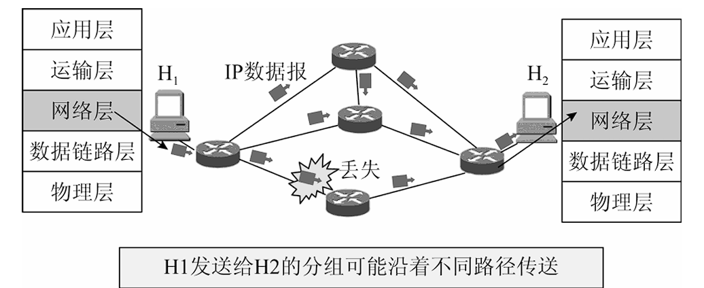
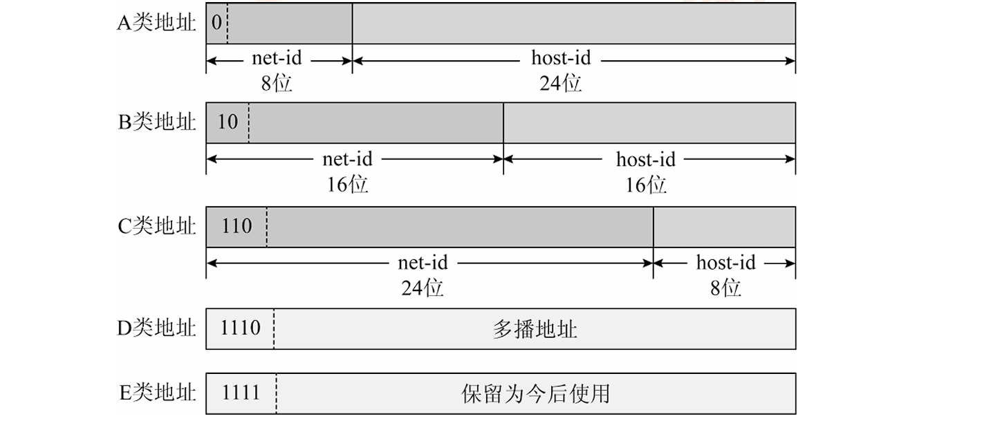
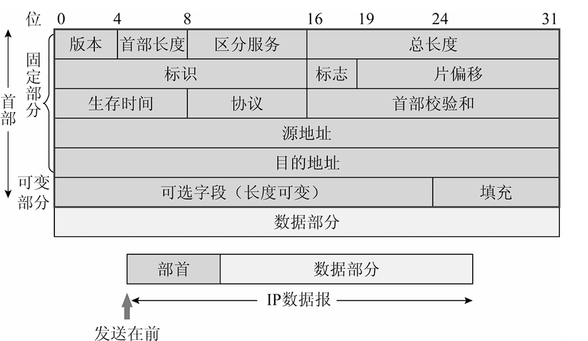
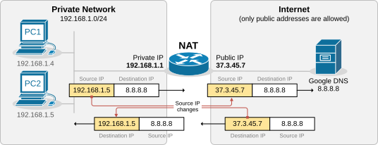
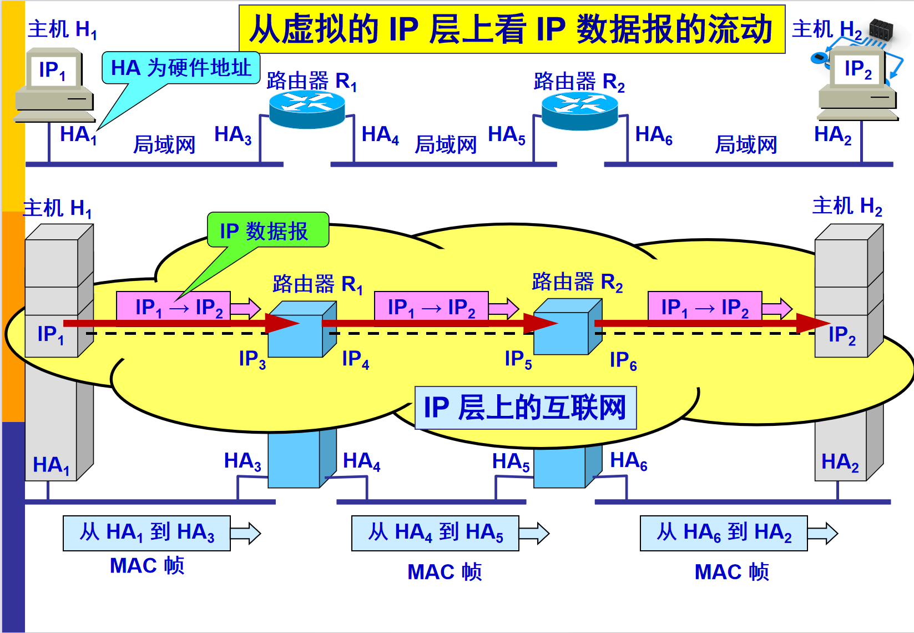
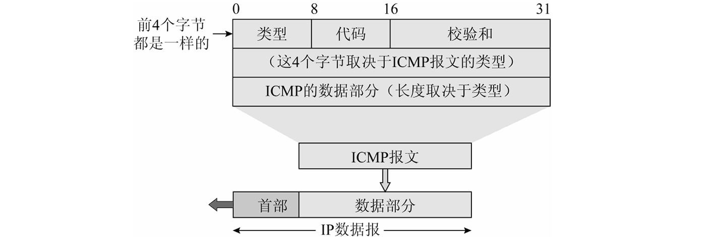
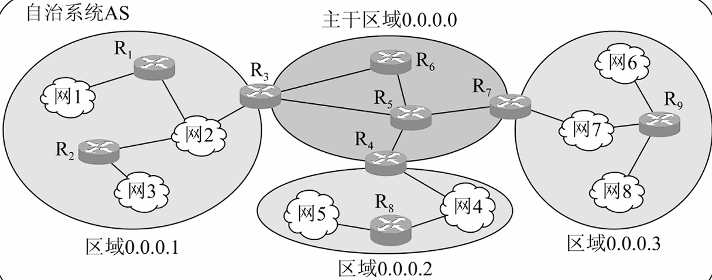
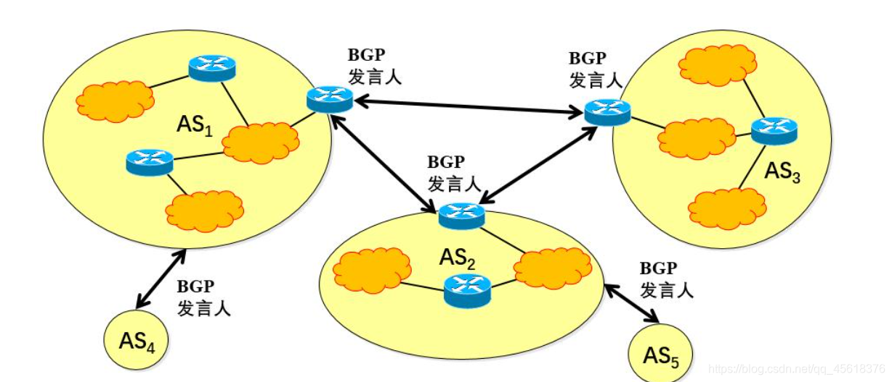
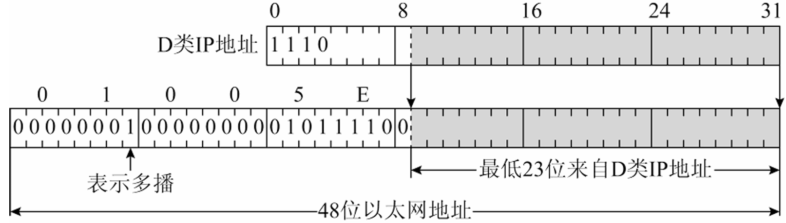
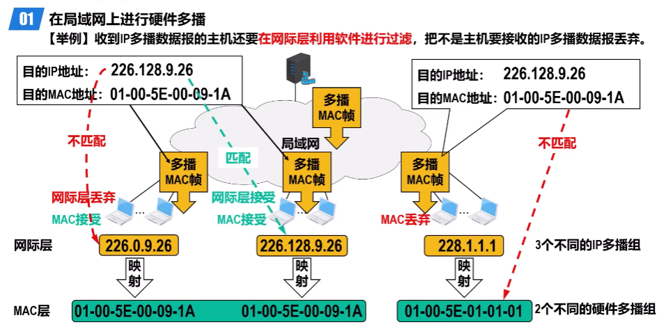

<h2 align="center">第四章 网络层</h2>

> **408 高频考点提醒**：
> - 网络层四大功能：**路由选择、分组转发、异构网络互联、拥塞控制**
> - **数据报 vs 虚电路**：TCP/IP 采用**数据报服务**（无连接、尽力而为、不保证可靠）
> - 分类 IP：**主机号全 0 = 网络地址、全 1 = 广播地址**；A 类 1~126、B 类 128~191、C 类 192~223
> - IP 首部固定 **20B**：版本、首部长度、总长度、标识、标志（**DF/MF**）、片偏移、TTL、协议、校验和、源/目的 IP
> - **分片**：片偏移以 **8B 为单位**；除最后一片外每片数据长度必须是 **8 的倍数**
> - **子网划分**：划 $2^n$ 个子网需 n 位子网号；每个子网可用主机数 = $2^m - 2$
> - **CIDR**：斜线记法、路由聚合（最长公共前缀）、**最长前缀匹配**原则
> - **ARP**：IP→MAC，**广播请求、单播响应**；跨网段由路由器代为解析
> - **ICMP**：差错报告 + 询问（ping）；封装在 IP 数据报的**数据部分**
> - 路由协议三剑客：**RIP**（距离向量 / UDP 520）、**OSPF**（链路状态 / IP 89）、**BGP**（路径向量 / TCP 179）
> - **SDN**：控制平面与数据平面分离；OpenFlow 为南向接口

---

### （一）网络层的功能

网络层（Network Layer）位于数据链路层之上、传输层之下，是互联网体系结构中**最关键的一层**，负责把分组从**源主机**送达到**目的主机**。网络层向上只提供简单灵活的、无连接的、尽最大努力交付的数据报服务，数据报（或IP数据报）就是分组。



#### 一、网络层的主要功能

##### 1. 路由选择与分组转发（Routing & Forwarding）

**路由选择**：根据一定的**路由算法**，在网络中确定分组从源到目的的**转发路径**，并把选好的路径记录在**路由表**中。

| 概念 | 说明 |
|:---|:---|
| **路由选择（Routing）** | 决定"**走哪条路**"——由路由协议（RIP/OSPF/BGP）动态维护路由表 |
| **分组转发（Forwarding）** | 决定"**从哪个口走**"——查路由表，把分组从合适的接口送出 |
| 静态路由 vs 动态路由 | 静态路由由管理员手工配置；动态路由由路由协议自动更新 |

> **考点**：**路由选择是全局的（算法），分组转发是本地的（查表）**。路由表更新后，转发直接查表执行。

##### 2. 异构网络互联

互联网由大量**异构网络**（以太网、WLAN、帧中继、ATM 等）互连而成，它们的数据链路层技术各不相同。网络层通过统一的 **IP 编址**和 **IP 数据报**格式，屏蔽下层网络的差异，使异构网络能相互通信。

> **注意**：网络层要解决的问题就是"**异构网络互联**"——不同的链路层网络通过路由器连接，统一使用 IP 地址通信。

##### 3. 拥塞控制

**拥塞（Congestion）**：网络中某个部分的数据量超过其处理能力，导致分组丢失、时延剧增。网络层需要对拥塞进行**全局性**控制（源点抑制、路由器丢弃等）。

> **易错点**：**拥塞控制是全局性的**（整个网络资源不够用），**流量控制是点到点的**（发送方与接收方之间的速率匹配，由传输层/数据链路层负责）。

#### 二、网络层提供的两种服务：虚电路与数据报

网络层向传输层提供两种服务：**虚电路服务**（面向连接）与**数据报服务**（无连接）。

| 对比项 | 虚电路服务（VC） | 数据报服务（Datagram） |
|:---|:---|:---|
| 基本思想 | **先建立连接**（虚电路），分组沿同一虚电路传输 | **无需建立连接**，每个分组独立选择路由 |
| 通信过程 | 建立连接 → 传输数据 → 释放连接 | 直接传输，无建立/释放阶段 |
| 分组携带地址 | 只携带**虚电路号**（不携带完整目的地址） | 携带**完整的目的地址** |
| 路由选择 | 建立连接时一次性选定，传输中不变 | 每个分组**逐跳独立**选择 |
| 是否按序交付 | **按序到达**（同一虚电路） | **可能乱序**，由传输层重组 |
| 差错与流量控制 | 由**网络层**负责（可靠服务） | 由**传输层**负责（尽力而为） |
| 代表网络 | X.25、ATM、帧中继 | **TCP/IP 互联网（Internet）** |

> **考点**：**互联网（TCP/IP）采用的是数据报服务**——无连接、不保证可靠、不保证按序、不保证不丢失，网络层只提供"**尽力而为（Best Effort）**"的交付，差错控制由传输层（TCP）完成。

---

### （二）IP 地址

#### 一、IP 地址概述

##### 1. IPv4 地址的表示

**IP 地址（IPv4）**：长度为 **32 位（4 字节）**，由**网络号（Net ID）** 和 **主机号（Host ID）** 两部分组成，用于标识一台主机（或一个网络接口）在互联网中的位置。

采用**点分十进制（Dotted Decimal）** 记法：把 32 位分成 4 组，每组 8 位，转换为十进制，中间用点隔开。

> 例：`11000000 10101000 00000001 00000001` → **192.168.1.1**

| 项目 | 内容 |
|:---|:---|
| 地址长度 | **32 位**，4 个字节 |
| 记法 | **点分十进制**（4 组 0~255） |
| 结构 | 网络号 + 主机号（IP 地址 = 网络号 + 主机号） |
| 分配原则 | 网络号标识**所在网络**（全球唯一），主机号标识**网络内主机** |

##### 2. IP 地址与 MAC 地址的区别（重点对比）

| 对比项 | IP 地址 | MAC 地址 |
|:---|:---|:---|
| 所在层次 | **网络层** | **数据链路层** |
| 地址结构 | 32 位（IPv4），由网络号 + 主机号构成 | 48 位（6 字节），如 00-1A-2B-3C-4D-5E |
| 分配方式 | 由 **ICANN/ISP 等**分配，可改动（换网即换） | 由**厂家**在网卡出厂时固化（也可修改） |
| 唯一性 | **全局唯一**（互联网范围内唯一） | **全球唯一**（IEEE 分配厂商号 + 序列号，出厂固化在网卡） |
| 是否反映位置 | **反映主机所在的网络位置**（网络号） | 不反映位置（只是网卡标识） |
| 转发依据 | 路由器**根据 IP 地址**转发分组 | 交换机**根据 MAC 地址**转发帧 |

> **考点**：**IP 地址反映主机的网络位置（分层寻址），MAC 地址只是网卡的物理标识**。分组在互联网上用 IP 地址寻址，到局域网内再通过 ARP 换成 MAC 地址交付。

#### 二、分类 IP 地址

##### 1. A/B/C/D/E 五类地址

传统 IP 地址按**前几位固定标志位**分为 A、B、C、D、E 五类：

| 类别 | 最高位 | 第一字节范围 | 网络号位数 | 主机号位数 | 默认掩码 | 用途 |
|:---|:---|:---|:---|:---|:---|:---|
| **A 类** | 0 | **1 ~ 126** | 8 位 | 24 位 | **255.0.0.0**（/8） | 大型网络 |
| **B 类** | 10 | **128 ~ 191** | 16 位 | 16 位 | **255.255.0.0**（/16） | 中型网络 |
| **C 类** | 110 | **192 ~ 223** | 24 位 | 8 位 | **255.255.255.0**（/24） | 小型网络（局域网） |
| **D 类** | 1110 | 224 ~ 239 | — | — | — | **组播（多播）** |
| **E 类** | 11110 | 240 ~ 255 | — | — | — | **保留**（实验用） |



> **补充（教材）**：可用网络数——**A 类 126 个、B 类 16382 个、C 类约 209 万个**；每网络可用主机数 = $2^{主机号位数} - 2$（A 类约 1670 万、B 类 65534、C 类 254）。

> **易错点**：A 类地址范围是 **1~126**，不是 0~127——**0.x.x.x 保留**（表示本网络），**127.0.0.1 是环回测试地址（Loopback）**，不属于任何网络。

##### 2. 特殊地址（网络地址与广播地址）

**特殊地址**指**不能指派给普通主机**或**使用受限**的 IP 地址：0 开头的地址、网络地址、广播地址、127 环回地址等。考试常考它们**能否作源/目的地址**：

| <nobr>网络号</nobr> | <nobr>主机号</nobr> | <nobr>源地址使用</nobr> | <nobr>目的地址使用</nobr> | <nobr>含义</nobr> | <nobr>例子</nobr> |
|:---|:---|:---|:---|:---|:---|
| <nobr>0</nobr> | 0 | 可以 | **不可** | 在本网络上的**本主机**（如主机启动时暂不知本网络号，作源地址用） | 0.0.0.0 |
| <nobr>0</nobr> | host-id | 可以 | **不可** | 在本网络上的**某台主机 host-id** | — |
| <nobr>全 1</nobr> | 全 1 | **不可** | 可以 | **只在本网络上广播**（**有限广播**，各路由器均不转发） | 255.255.255.255 |
| <nobr>net-id</nobr> | 全 1 | **不可** | 可以 | 对 **net-id 上的所有主机**广播（**直接广播**） | 192.168.1.255 |
| <nobr>net-id</nobr> | 全 0 | —（不能指派给主机，故不作源地址） | —（仅路由表中用于代表本网络） | **网络地址**（网络本身） | 192.168.1.0 |
| <b><nobr>127</nobr></b> | 非全 0 或全 1 的任何数 | 可以 | 可以 | 本地软件**环回测试**（Loopback） | 127.0.0.1 |

> **考点**：可用主机数 = $2^{主机号位数} - 2$（**减去网络地址和广播地址**）。如 C 类每网络可用主机数 = $2^8 - 2 = 254$。
> **易错点**：源/目的使用限制——**网络号全 0（0.x.x.x）只能作源地址**（对方不知道本网络号）；**广播地址（主机号全 1）只能作目的地址**；**127 环回地址源、目的都可用**，且 127 的主机号**不能取全 0 或全 1**。
> **注意**：0.0.0.0 除作本机源地址外，还常作**默认路由**（0.0.0.0/0 兜底转发）。

#### 三、IP 数据报格式（重点）

IP 数据报 = **首部** + **数据**。首部固定部分 **20B**（还可有可变选项，最多 40B），各字段如下：

| 字段 | 长度 | 作用 |
|:---|:---|:---|
| **版本（Version）** | 4 位 | IP 版本号，IPv4 取 4 |
| **首部长度（IHL）** | 4 位 | 首部长度，**以 4B 为单位**，最小 5（20B）、最大 15（60B） |
| **总长度** | 16 位 | 首部 + 数据的总长度，**以字节为单位**，最大 65535B |
| **标识（Identification）** | 16 位 | 分片标记：**同一数据报的各个分片标识相同**，用于重组 |
| **标志（Flags）** | 3 位 | **DF = 1 禁止分片；MF = 1 后面还有分片**（最低位保留） |
| **片偏移（Fragment Offset）** | 13 位 | 分片在原数据报中的相对位置，**以 8B 为单位** |
| **生存时间（TTL）** | 8 位 | 每经过一个路由器**减 1**，减到 0 丢弃（防止环路） |
| **协议（Protocol）** | 8 位 | 上层协议：**1 = ICMP、2 = IGMP、6 = TCP、17 = UDP、89 = OSPF** |
| **首部校验和** | 16 位 | 只校验**首部**（不含数据），每跳都要重新计算 |
| **源 IP 地址** | 32 位 | 发送方 IP |
| **目的 IP 地址** | 32 位 | 接收方 IP |



> 图：IP 数据报固定首部 20B——版本/首部长度/总长度/标识/标志/片偏移/TTL/协议/首部校验和/源 IP/目的 IP。

**MTU（Maximum Transmission Unit，最大传输单元）**：链路层帧**数据部分的最大长度**，即 IP 数据报**能通过该链路的最大长度**，由具体链路决定（**以太网典型 1500B**）。IP 数据报总长度**超过 MTU 时必须分片**（见"标志/片偏移"字段与分片例题）；若 **DF = 1 禁止分片**则直接**丢弃**（并回送 ICMP 差错报文）。

> **考点**：三个"单位"易混淆——**首部长度以 4B 为单位、总长度以 1B 为单位、片偏移以 8B 为单位**。
> **易错点**：首部校验和**只校验首部不校验数据**，且每经过一个路由器 TTL 减 1，校验和必须**每跳重新计算**。

#### 四、子网划分（重点）

##### 1. 基本概念

**子网划分（Subnetting）**：把主机号中借出若干位作为**子网号**，把一个网络划分为多个子网，缓解 IP 地址浪费。

**子网掩码（Subnet Mask）**：长度 32 位，**网络号 + 子网号对应位置 1，主机号对应位置 0**。子网掩码与 IP 地址**按位与**运算即可得到该主机所在的**子网网络地址**。

| 项目 | 计算 |
|:---|:---|
| 划分子网数 | 借 n 位子网号 → 2<sup>n</sup> 个子网 |
| 每子网可用主机数 | 2<sup>m</sup> − 2（m 为剩余主机号位数；减去网络地址与广播地址） |
| 掩码 | 网络号 + 子网号对应位置 1（连续 1） |

##### 2. 子网分组转发的过程

主机发送分组时，先判断目的 IP **是否与自己在同一子网**——这决定**直接交付**还是**交给网关**：

**（1）判断是否同一子网（决定直接交付）**
- 将**本子网掩码**与**目的 IP**按位与，结果**等于本子网网络地址** → 目的与本机**同一子网** → **直接交付**：查 ARP 得目的主机 MAC，直接发送（不再经路由器）
- 不相等 → 不在同一子网 → 进入（2）

**（2）不在同一子网（间接交付）**
- 把分组交给**默认网关（Default Gateway，路由器）**，由路由器按路由表转发：
  1. 用路由表中**每一条**"目的网络 + 子网掩码"与目的 IP 相与，相等则该条**匹配**
  2. **多条匹配**时选**最长前缀**（掩码中 1 最多、最具体的一条）
  3. 全部不匹配 → 走**默认路由**（0.0.0.0/0）

> **例**（沿用上题 /26 划分）：主机 192.168.1.65（子网 2）给 192.168.1.100 发分组——掩码 255.255.255.192 与 100 相与 = 01000000 = **64** = 本子网网络地址 → **同一子网，直接交付**；若目的为 192.168.1.150——相与 = 10000000 = **128** ≠ 64 → **跨子网，交给默认网关**。

> **考点**：**同一子网判断 = 本掩码与目的 IP 相与，等于本子网网络地址**；跨子网一律先送**默认网关**，路由表逐条匹配、**最长前缀优先**、全不匹配才用默认路由（0.0.0.0/0）。

##### 3. 例题（完整）

**题目**：C 类网络 **192.168.1.0** 要划分为 **4 个子网**，求子网掩码、每个子网的网络地址、可用主机范围与广播地址。

**分析**：划分 4 个子网需要 n = $\log_2 4$ = **2 位子网号**（借 2 位主机号）。C 类默认掩码 255.255.255.0（/24），子网化后掩码 = 255.255.255.**11000000** = **255.255.255.192**（/26），剩余主机号 8 − 2 = 6 位。

- 每个子网可用主机数 = $2^6 - 2 = 62$ 台
- 子网号取 00、01、10、11 四种组合，子网步长 = $2^6 = 64$

**计算结果**：

| 子网 | 子网号 | 网络地址 | 可用主机范围 | 广播地址 | 可用主机数 |
|:---|:---|:---|:---|:---|:---|
| 子网 1 | 00 | 192.168.1.**0**/26 | 192.168.1.1 ~ 192.168.1.62 | 192.168.1.63 | 62 |
| 子网 2 | 01 | 192.168.1.**64**/26 | 192.168.1.65 ~ 192.168.1.126 | 192.168.1.127 | 62 |
| 子网 3 | 10 | 192.168.1.**128**/26 | 192.168.1.129 ~ 192.168.1.190 | 192.168.1.191 | 62 |
| 子网 4 | 11 | 192.168.1.**192**/26 | 192.168.1.193 ~ 192.168.1.254 | 192.168.1.255 | 62 |

**验算**：掩码 255.255.255.192 与 192.168.1.65 相与：65 = 01000001，与 11000000 相与得 01000000 = **64**，即属于子网 2（192.168.1.64/26）✓

> **考点**：子网划分后每子网**同样减 2**（网络地址 + 广播地址）——4 个子网共可用 4 × 62 = **248 台**主机，比原来的 254 少 6 台（4 个网络地址 + 4 个广播地址，其中子网 1 网络地址与原网络地址重合）。
> **易错点**：掩码必须是**连续 1**（如 11111111.11111111.11111111.11000000）；子网号全 0/全 1 的子网早期禁用，现在（CIDR 后）允许使用。

#### 五、CIDR（无分类域间路由，Classless Inter-Domain Routing）

##### 1. 斜线记法（Slash Notation）

**CIDR** 取消传统的 A/B/C 类划分，用"**IP 地址 / 网络前缀长度**"表示：

```
192.168.1.0/26   ← 前 26 位是网络前缀，后 6 位是主机号
```

| 记法 | 前缀长度 | 等效掩码 | 地址块大小 | 说明 |
|:---|:---|:---|:---|:---|
| 10.0.0.0/8 | 8 | 255.0.0.0 | 2<sup>24</sup> | A 类大小的地址块 |
| 192.168.1.0/26 | 26 | 255.255.255.192 | 2<sup>6</sup> = 64 | 一个子网地址块 |

##### 2. 路由聚合例题（完整）

**题目**：某 ISP 有两个相邻地址块 **192.168.1.0/25** 与 **192.168.1.128/25**，要把它们**聚合**成一条路由通告给外部，求聚合后的地址块。

**分析**：找两个地址块的**最长公共前缀**：

```
192.168.1.0/25   = 11000000 10101000 00000001 0 0000000
192.168.1.128/25 = 11000000 10101000 00000001 1 0000000
                    共同前缀 24 位（前 24 位完全相同）↑
```

- 两个地址块前 **24 位**完全相同，第 25 位分别是 0 和 1
- 聚合后前缀长度取 **24**，网络地址为 192.168.1.0

**结论**：聚合为 **192.168.1.0/24**（覆盖 192.168.1.0 ~ 192.168.1.255 共 256 个地址，恰好是两块的并集）。

> **考点**：路由聚合的规则是取各地址块**最长公共前缀**作为聚合前缀；聚合后地址块必须**连续**（如 /25 和 /25 合成 /24，/24 与 /25 不能简单合成）。
> **注意**：路由聚合使路由表条目减少，但可能引入**路由黑洞**（聚合块内包含的不存在子网导致丢包）——需要配合其他机制处理。

##### 3. 最长前缀匹配（Longest Prefix Match）

路由器转发分组时，**目的 IP 地址可能与路由表中多条路由匹配**，此时选择**网络前缀最长**（最具体）的那一条。

**例题**：路由器收到目的地址 **192.168.1.132** 的分组，路由表中有两条路由：192.168.1.128/25 与 192.168.1.0/24。

| 路由 | 前缀长度 | 是否匹配 192.168.1.132 | 选择 |
|:---|:---|:---|:---|
| 192.168.1.0/24 | 24 | 匹配（132 在 0~255 内） | 否 |
| 192.168.1.128/25 | 25 | 匹配（132 在 128~255 内） | **是（前缀更长，更具体）** |

**结论**：按**最长前缀匹配**原则，选择 **192.168.1.128/25** 转发。

> **考点**：前缀越长越具体，优先匹配；**默认路由 0.0.0.0/0（前缀长度 0）** 匹配一切地址，只在前缀更长的路由都不匹配时使用。

#### 六、私有 IP 地址与 NAT

##### 1. 私有 IP 地址（Private Address）

RFC 1918 规定以下三个地址块为**私有地址**，**只在局域网内部使用**，互联网路由器不转发：

| 私有地址块 | 范围 | 规模 |
|:---|:---|:---|
| **10.0.0.0/8** | 10.0.0.0 ~ 10.255.255.255 | 大型内网 |
| **172.16.0.0/12** | 172.16.0.0 ~ 172.31.255.255 | 中型内网 |
| **192.168.0.0/16** | 192.168.0.0 ~ 192.168.255.255 | 小型内网（家庭/企业局域网） |

##### 2. NAT（网络地址转换，Network Address Translation）



**NAT**：把内网的**私有 IP 地址**转换为公网 IP 地址，使多个内网主机共用一个（或少量）公网 IP 访问互联网。

- **NAT 路由器**负责转换，并维护 **NAT 转换表**（内网 IP:端口 ↔ 公网 IP:端口）
- 常与**端口多路复用（NAPT）** 结合：用**不同端口号**区分不同内网主机的连接
- 经典应用：家庭路由器共享一条宽带线路

> **考点**：NAT 使内网主机访问外网时，**源 IP 被替换为公网 IP**；外网主动访问内网主机困难（需端口映射/内网穿透）——**NAT 在一定程度上也起到隔离内网、保护内网主机的作用**。

#### 七、IPv6

##### 1. IPv6 地址表示

**IPv6** 地址长度为 **128 位**，采用**冒号十六进制记法**：8 组 4 位十六进制数，用冒号隔开。

```
2001:0DB8:0000:0000:0000:FF00:0042:8329
```

压缩规则（**:: 只能使用一次**）：

| 规则 | 例子 |
|:---|:---|
| 每组**前导 0 省略** | 0DB8 → DB8、0000 → 0 |
| **连续的 0 组用 :: 压缩**（只能用一次） | 2001:0DB8:0:0:0:FF00:42:8329 → 2001:DB8::FF00:42:8329 |

> **注意**：`::` 若使用两次会产生**二义性**（无法判断压缩了多少组），故只能用一次。

##### 2. IPv6 与 IPv4 对比

| 对比项 | IPv4 | IPv6 |
|:---|:---|:---|
| 地址长度 | **32 位**（约 43 亿个） | **128 位**（约 $3.4\times10^{38}$ 个） |
| 记法 | 点分十进制 | **冒号十六进制**（:: 压缩） |
| 首部 | 有选项字段，变长 | 首部**固定 40B**，基本首部更简洁（无校验和字段） |
| 安全性 | 靠外部机制（IPSec 可选） | **IPSec 内置于 IPv6** |
| 自动配置 | 需 DHCP | **无状态自动配置**（Stateless Autoconfiguration，路由器通告前缀） |
| 广播 | 支持广播 | **取消广播**，用**组播/任意播** |
| 地址分类 | 分类编址 / CIDR | 不分类，按**前缀**区分（单播/组播/任意播） |

> **考点**：IPv6 三大改进——**地址空间 128 位、首部精简（去校验和）、安全性好（IPSec 内嵌）**；且**取消广播地址**，避免广播风暴。

---

### （三）IP 数据报分片例题（重点，写完整）

**题目**：主机 A 向主机 B 发送一个 **4000B** 的 IP 数据报（含 20B 首部），传输路径上某链路的 **MTU = 1500B**，求该数据报被分成的各片情况。

**分析**：

- 每片都要携带 20B 的 IP 首部，每片最多携带数据 = 1500 − 20 = **1480B**
- 数据部分长度 = 4000 − 20 = **3980B**
- 分片数 = $\lceil 3980 / 1480 \rceil = \lceil 2.69 \rceil =$ **3 片**
- **片偏移** = 该片数据在原数据报数据部分的起始字节数 ÷ **8**

**计算过程**：

| 分片 | 数据长度 | 总长度（20B 首部 + 数据） | 数据起始字节 | 片偏移 | MF 标志 |
|:---|:---|:---|:---|:---|:---|
| 片 1 | **1480B** | **1500B** | 0 | $0 \div 8 =$ **0** | **1**（后面还有分片） |
| 片 2 | **1480B** | **1500B** | 1480 | $1480 \div 8 =$ **185** | **1**（后面还有分片） |
| 片 3 | **1020B** | **1040B** | 2960 | $2960 \div 8 =$ **370** | **0**（最后一片） |

**校验**：$3980 = 1480 + 1480 + 1020$ ✓；每片数据长度除最后一片外均为 **8 的倍数**（$1480 = 8 \times 185$）✓

**结论**：该数据报分为 3 片——片 1（总长 1500B，偏移 0）、片 2（总长 1500B，偏移 185）、片 3（总长 1040B，偏移 370）；接收端依据**相同的标识字段**判断各片属于同一数据报，按**片偏移**重组。

> **考点**：片偏移单位是 **8B**，因此**除最后一片外每片的数据长度必须是 8 的倍数**——否则偏移无法用整数表示。
> **易错点**：**总长度含 20B 首部**（片总长 = 数据 + 20）；DF = 1 时若数据报超过 MTU 则**直接丢弃**并回送 ICMP 差错报文；分片由**路由器**（进入较小 MTU 链路时）或源主机完成，**重组只发生在目的主机**。

---

### （四）网络层协议

#### 一、ARP（地址解析协议，Address Resolution Protocol）

**ARP** 完成 **IP 地址 → MAC 地址** 的解析，使分组能在局域网内用 MAC 地址交付。

##### 1. ARP 工作过程（同一网段）

```
主机 A (IP:192.168.1.10) 想发给主机 B (IP:192.168.1.20)
    │
    ▼
① 查 ARP 高速缓存：有 B 的 IP→MAC 映射？──是──► 直接封装帧发送
    │否
    ▼
② 在局域网内**广播 ARP 请求**：谁的 IP 是 192.168.1.20？请回答
    │（B 之外的主机丢弃该请求）
    ▼
③ 主机 B **单播 ARP 响应**：192.168.1.20 的 MAC 是 00-1A-2B-3C-4D-5E
    │
    ▼
④ A 把映射写入 **ARP 高速缓存**，并封装帧发送数据
```

> **考点**：**ARP 请求是广播，ARP 响应是单播**；ARP 高速缓存记录 IP→MAC 映射（动态条目有老化时间，约 15~20 分钟）。

##### 2. 跨网段的 ARP



主机 A 要发给**不同网段**的主机 B：

| 步骤 | 说明 |
|:---|:---|
| ① 判断目的不在本网段 | A 用自己的掩码与 B 的 IP 相与，发现网络号不同 |
| ② **交给默认网关** | A 把数据报发给默认网关（路由器接口），**ARP 解析的是路由器的 MAC** |
| ③ 路由器转发 | 路由器查路由表，在下一跳所在网段再解析（下一跳路由器的 MAC 或目的主机 B 的 MAC） |

> **易错点**：跨网段通信时，A 广播请求的**不是 B 的 MAC，而是默认网关（路由器接口）的 MAC**——分组逐网段交付，IP 地址不变、MAC 地址逐段改变。

##### 3. RARP（逆地址解析协议）

**RARP** 完成 **MAC 地址 → IP 地址** 的解析（早期无盘工作站启动时使用），如今**已被 DHCP（动态主机配置协议）取代**，属于淘汰协议。

#### 二、ICMP（网际控制报文协议，Internet Control Message Protocol）

**ICMP** 用于在主机与路由器之间传递**差错报告**与**询问信息**，它**不是封装在 IP 数据报之外**，而是作为 **IP 数据报的数据部分** 传输（协议字段 = 1）。

- **常用命令（教材）**：**ping** 用 ICMP **回送请求/应答**报文；**traceroute / tracert** 用 ICMP **时间超过**报文逐跳定位路径。



##### 1. ICMP 报文类型

| 类别 | 报文 | 作用 |
|:---|:---|:---|
| **差错报告报文** | **终点不可达** | 目的地址无法到达（路由无匹配、端口未监听等） |
| | **时间超过** | TTL 减为 0（每经过一跳 TTL−1） |
| | **参数问题** | 首部字段出错 |
| | **改变路由（重定向）** | 通知主机有更优路径（少用） |
| | 源点抑制 | **已废弃**（早期拥塞控制手段） |
| **询问报文** | **回送请求 / 回送应答** | **ping 命令**的核心，测试连通性 |
| | 时间戳请求 / 应答 | 测量往返时延、时钟同步 |

> **考点**：**ping 用的是 ICMP 回送请求/应答报文**（协议字段 1），不是 TCP 也不是 UDP。

##### 2. 差错报文不再产生差错报文的例外（重点）

ICMP 差错报文本身也要封装成 IP 数据报发送，为避免"差错套差错"，**以下情况不再发送 ICMP 差错报文**：

- **ICMP 差错报文本身**出错，不再发送
- **分片后的第一个分片以外**的后续分片出错，不再发送
- 目的地址是**组播地址**或**广播地址**的分组，不再发送
- 源地址是**特殊地址**（如 0.0.0.0、127.x.x.x 环回）的分组，不再发送

> **注意**：ICMP 只**报告**差错，**不负责改正**差错——纠错由高层协议完成。

### （五）路由选择协议

**路由算法**：即**获得路由表中各表项所用的算法**，是路由选择协议的核心。理想路由算法应具备 6 个特点（教材 4.4）：

| <nobr>特点</nobr> | <nobr>含义</nobr> |
|:---|:---|
| <nobr>正确·完整</nobr> | 沿路由表指引的路由，分组**一定能到达**目的网络和目的主机 |
| <nobr>计算简单</nobr> | 路由计算不应使网络通信量增加**太多额外开销** |
| <nobr>自适应性</nobr> | 能**自适应**通信量与网络拓扑的变化，改变路由以**均衡各链路负载**（这是动态路由的核心） |
| <nobr>稳定性</nobr> | 在通信量/拓扑相对稳定时**收敛**于可接受的解，路由**不持续变化**（不振荡） |
| <nobr>公平性</nobr> | 对所有用户（除少数优先级高的）**平等**——不能只为某一对用户最小时延而损害广大其他用户 |
| <nobr>最佳性</nobr> | 找出**最好路由**：平均时延最小、吞吐量最大；但"最佳"只是**相对特定要求**的合理选择（有的网络更看重可靠性） |

按路由算法能否随**通信量或拓扑自适应地调整变化**来划分，分为两大类（教材 4.4）：

| <nobr>类别</nobr> | <nobr>别名</nobr> | <nobr>特点</nobr> | <nobr>适用</nobr> |
|:---|:---|:---|:---|
| <nobr>静态路由选择</nobr> | **非自适应**路由选择 | **简单、开销较小**，但不能**及时适应网络状态变化** | 简单的小网络（可**人工配置**每一条路由） |
| <nobr>动态路由选择</nobr> | **自适应**路由选择 | 能较好**适应网络状态变化**，但**实现复杂、开销较大** | 较复杂的大网络 |

> **注意**：动态路由 = 自适应路由（如 RIP/OSPF）；"稳定性"即**收敛性**——后面 RIP 坏消息传得慢、OSPF 收敛快都是收敛性的体现。

#### 一、IP 层分组转发流程

路由器收到数据报后的处理流程：

```
收到 IP 数据报，提取目的 IP 地址
    │
    ▼
① 查路由表（最长前缀匹配）
    │
    ├─ 命中 ──► ② 得到下一跳 IP 地址
    │              │
    │              ▼
    │          ③ ARP 解析下一跳的 MAC 地址
    │              │
    │              ▼
    │          ④ 封装成帧，从相应接口转发
    │
    └─ 未命中
          ├─ 有默认路由（0.0.0.0/0）──► 按默认路由转发（同上 ②③④）
          └─ 无默认路由 ──► 丢弃分组，回送 ICMP 终点不可达
```

| 要点 | 说明 |
|:---|:---|
| **最长前缀匹配** | 多条路由匹配时选择前缀最长（最具体）的一条 |
| **默认路由** | 0.0.0.0/0，匹配所有地址，作为兜底路由 |
| **下一跳（Next Hop）** | 路由器只负责把分组交给**下一跳路由器**，不负责整条路径 |
| 逐跳转发 | 每台路由器独立决策，但路由协议保证全网路由表一致（无环路） |

> **考点**：IP 分组转发是**逐跳（Hop-by-Hop）** 的——每台路由器只需知道"到目的网络走哪个下一跳"，无需知道完整路径。
> **补充（教材 4.4.1）**：转发优先级 **直连网络 > 特定主机路由 > 网络路由 > 默认路由**——"**特定主机路由**"是为目的**单个主机**专门指定的路由（最具体）。

#### 二、RIP（路由信息协议，Routing Information Protocol）

**RIP** 是**内部网关协议（IGP）**，基于**距离向量（Distance Vector）算法**，最大的优点就是**实现简单、开销较小**。

##### 1. RIP 概览（速查表）

| <nobr>项目</nobr> | <nobr>内容</nobr> |
|:---|:---|
| <nobr>算法</nobr> | **距离向量**：每个路由器维护"到各目的网络的距离（跳数）表" |
| <nobr>度量</nobr> | **跳数**：直连网络 = 1，非直连 = **经过的路由器数 + 1**；**最多 15**，16 表示**不可达** |
| <nobr>交换对象</nobr> | 仅与**相邻路由器**交换（不相邻的路由信息通过邻居间接获得） |
| <nobr>交换内容</nobr> | 自己的**整个路由表**（到本 AS 所有网络的距离 + 下一跳路由器） |
| <nobr>交换时机</nobr> | 每 **30 秒**交换一次；**拓扑变化时及时**通告 |
| <nobr>传输层协议</nobr> | **UDP，端口 520**（RIP 是**应用层协议**） |
| <nobr>路由条目</nobr> | 每个路由条目 **20B**（教材 4.4.3） |
| <nobr>适用范围</nobr> | **小型网络**（跳数限制 15） |

##### 2. 距离（跳数）的定义

到**直接连接**的网络距离 = **1**；到**非直接连接**的网络距离 = **所经过的路由器数 + 1**（加 1 是因为到达目的网络后还要**直接交付**一次）——因此"距离"也称"跳数"，**好路由 = 跳数少的路由**（教材 4.4.3）。

##### 3. 三个要点（和谁换 / 换什么 / 何时换）

① **和谁交换**——仅与**相邻**路由器；② **交换什么**——自己的**整个路由表**；③ **何时交换**——固定间隔 **30 秒** + 拓扑变化时**及时**通告。

##### 4. 路由表的建立与收敛

路由器**刚启动**时只知道**直接连接的网络**（距离 = 1）→ 反复与相邻路由器交换、更新 → 最终**收敛**（"收敛" = 全网所有路由器都得到正确的路由选择信息的过程），且收敛过程较快。

##### 5. 距离向量算法（重点）

收到相邻路由器 X 的 RIP 报文后依次执行：
**（1）修改报文**：把报文中所有"下一跳"字段都改为 **X**，所有"距离"字段都**加 1**；
**（2）逐项更新**：① 目的网络**不在路由表中** → **加入**；② 下一跳路由器**相同** → **替换**原表项（即使距离增大）；③ 收到的**距离更小** → **更新**；④ 否则 → **什么也不做**；
**（3）超时**：**3 分钟**未收到 X 的更新 → 把 X 记为**不可达**（距离置 16）；
**（4）返回**。

##### 6. RIP 的特点

- 全网路由器最终都**收敛得到全局路由信息**，但各路由器**位置不同，路由表也不同**
- **不能同时使用多条路由**——总选**跳数最少**的路由，即使存在"高速（低时延）但路由器较多"的路由（**不支持负载均衡**）
- 交换的是**完整路由表** → 网络规模扩大则开销增加——RIP 只适合小型网络的原因之一

> **考点**：RIP 三个要点（和谁换 / 换什么 / 何时换）；距离定义（直连 = 1，非直连 = 路由器数 + 1）；距离向量算法四步（下一跳改 X、距离 + 1；不在表 → 加入；同下一跳 → 替换；更小才更新）。
> **易错点**：RIP **只与相邻路由器**交换路由表（不是全网交换）；跳数 **16 = 不可达**；RIP 是**应用层协议**、用 **UDP 520**（OSPF 用 IP 协议号 89）；**不能同时用多条路由**（不支持负载均衡）。
> **注意（坏消息传得慢的机理，教材图 4-15）**：R1 直连网 1（距离 1）、R2 经 R1（距离 2）；网 1 故障后 R1 把距离置 16，但 **R2 在收到 R1 的更新前仍发旧表**（距离 2），R1 误以为可经 R2 到达（距离 3）——于是互相递增，直到两者到网 1 的距离都到 16 才确认不可达：**故障传播慢、收敛慢**（可用**水平分割、毒性逆转**缓解）。

##### 7. 例题（完整）：距离-向量算法更新路由表

<table>
<tr>
<td valign="top" width="50%">
<b>题目</b>：如图所示的网络中，采用距离-向量路由算法。<br>
路由器 C 收到邻居发来的距离向量表（各向量按 <b>A、B、C、D、E、F</b> 顺序排列）：来自 <b>B：(5, 0, 8, 12, 6, 2)</b>、<b>D：(16, 12, 6, 0, 9, 10)</b>、<b>E：(7, 6, 3, 9, 0, 4)</b>，C 到 B、D、E 的距离分别为 <b>6、3、5</b>。<br>
请计算 C 更新后的距离向量表，以及 C 到每个目的站点的最短路径所经过的<b>下一邻居站点</b>（要求给出计算步骤）。<br>
注：<b>线路是不对称的</b>。
</td>
<td valign="top">

</td>
</tr>
</table>
> **提示**：粘贴时 B 的向量只有 5 项，据直连边 A—B、B—C、B—F 补全首项为 **(5, 0, 8, 12, 6, 2)**（B→A=5、B→C=8、B→F=2 均与拓扑吻合）。

**已知数据**：

| <nobr>邻居 N</nobr> | <nobr>C→N 的距离</nobr> | <nobr>N 发来的向量（A,B,C,D,E,F）</nobr> |
|:---|:---|:---|
| <nobr>B</nobr> | 6 | (5, 0, 8, 12, 6, 2) |
| <nobr>D</nobr> | 3 | (16, 12, 6, 0, 9, 10) |
| <nobr>E</nobr> | 5 | (7, 6, 3, 9, 0, 4) |

**计算步骤**：对每个目的站点 X，新距离 = **min( C→N 的距离 + N[X] )**，N ∈ {B, D, E}，取最小者对应的邻居为**下一跳**：

- **A**：min( 6+5=**11**，3+16=19，5+7=12 ) = **11** → 下一跳 **B**
- **B**：min( 6+0=**6**，3+12=15，5+6=11 ) = **6** → 下一跳 **B**（直连）
- **C**：**0**（本路由器，不经邻居）
- **D**：min( 6+12=18，3+0=**3**，5+9=14 ) = **3** → 下一跳 **D**（直连）
- **E**：min( 6+6=12，3+9=12，5+0=**5** ) = **5** → 下一跳 **E**（直连）
- **F**：min( 6+2=**8**，3+10=13，5+4=9 ) = **8** → 下一跳 **B**

**计算结果**：

| <nobr>目的站点</nobr> | <nobr>最短距离</nobr> | <nobr>下一跳</nobr> |
|:---|:---|:---|
| <nobr>A</nobr> | **11** | **B** |
| <nobr>B</nobr> | **6** | **B**（直连） |
| <nobr>C</nobr> | **0** | **—**（本路由器） |
| <nobr>D</nobr> | **3** | **D**（直连） |
| <nobr>E</nobr> | **5** | **E**（直连） |
| <nobr>F</nobr> | **8** | **B** |

> **考点**：距离-向量更新公式——**新距离(X) = min( 自己到邻居 N 的距离 + N 到 X 的距离 )**，并记录最小者对应的邻居为下一跳；本例即 RIP 算法的广义形式（RIP 把"距离"换成**跳数**即可）。
> **易错点**：**线路不对称**——公式中用 **C→邻居** 方向的代价（6、3、5），**不是**邻居→C 的方向（B→C=8、D→C=6、E→C=3，均与 C→B=6、C→D=3、C→E=5 不同）；若新距离与表中**相同**则**不更新**（教材"否则什么也不做"）。
> **注意**：C→F 的最短路径实际为 C→B→F 两条链路，但下一跳只记 **B**——**逐跳转发**无需完整路径（呼应转发流程）。

##### 8. 例题（完整）：教材例 4-1——RIP 路由表更新

**题目**：已知路由器 R1 的路由表如下左表（表 4-4），现收到相邻路由器 R4 发来的路由更新信息如下右表（表 4-5）。试写出更新 R1 路由表的过程与结果。

<table>
<tr>
<td colspan="3" align="center"><b>表 4-4：R1 原路由表</b></td>
<td colspan="3" align="center"><b>表 4-5：R4 发来的路由信息</b></td>
</tr>
<tr>
<td>目的网络</td>
<td>距离</td>
<td>下一跳</td>
<td>目的网络</td>
<td>距离</td>
<td>下一跳</td>
</tr>
<tr>
<td>N2</td>
<td>3</td>
<td>R4</td>
<td>N1</td>
<td>3</td>
<td>R1</td>
</tr>
<tr>
<td>N3</td>
<td>4</td>
<td>R5</td>
<td>N2</td>
<td>4</td>
<td>R2</td>
</tr>
<tr>
<td></td>
<td></td>
<td></td>
<td>N3</td>
<td>1</td>
<td>直接交付</td>
</tr>
</table>

**解**（按距离向量算法四步）：

**（1）先修改 R4 报文**：下一跳全部改为 **R4**、距离全部 **+ 1**：
- N1：3 → **4**（下一跳 R4）
- N2：4 → **5**（下一跳 R4）
- N3：1 → **2**（下一跳 R4）

**（2）逐项与表 4-4 比较**：
- **N1**：表 4-4 中**没有** → **加入**：(4, R4)
- **N2**：表 4-4 中有，且**下一跳也是 R4** → **替换**（距离 3 → 5，**即使距离增大了也替换**）
- **N3**：表 4-4 中有（4, 经 R5），但**下一跳不同** → 比较距离：**2 < 4** → **更新**：(2, R4)

**（3）结果**（表 4-7）：R1 更新后的路由表：

| <nobr>目的网络</nobr> | <nobr>距离</nobr> | <nobr>下一跳</nobr> |
|:---|:---|:---|
| <nobr>N2</nobr> | **5** | **R4** |
| <nobr>N3</nobr> | **2** | **R4** |
| <nobr>N1</nobr> | **4** | **R4** |

> **考点**：本题即距离向量算法第（2）步三条规则的直接应用——**表中没有 → 加入；同下一跳 → 无条件替换（即使距离变大）；不同下一跳 → 比较距离、更小才更新**。
> **易错点**：不要漏掉"**距离 + 1**"这一步（先统一加 1 再比较）；N1 是**新增项**，不能因为"距离 4 较大"而拒绝加入。

#### 三、OSPF（开放最短路径优先，Open Shortest Path First）

**OSPF** 是**内部网关协议（IGP）**，基于**链路状态（Link State）算法**，**1989 年为克服 RIP 的缺点而开发**。名字含义："**开放**" = 协议**公开发表**、不受某一家厂商控制；"**最短路径优先**" = 使用 **Dijkstra 最短路径算法**。

##### 1. OSPF 概览（速查表）

| <nobr>项目</nobr> | <nobr>内容</nobr> |
|:---|:---|
| <nobr>算法</nobr> | **链路状态**：各路由器**洪泛（Flooding）** 发送链路状态通告（LSA）给**全网**（区域内所有路由器） |
| <nobr>核心步骤</nobr> | 洪泛 LSA → 每台路由器建立**链路状态数据库（LSDB）** → **Dijkstra 最短路径算法**计算最短路径树 |
| <nobr>度量</nobr> | **代价（Cost）**（可由带宽等因素决定），**无跳数限制** |
| <nobr>传输层协议</nobr> | 直接封装在 **IP 数据报**中，协议号 **89**（不用 TCP/UDP） |
| <nobr>收敛速度</nobr> | **收敛快**（链路状态全网同步，变更是立即洪泛） |
| <nobr>层次结构</nobr> | 划分**区域（Area）**，**骨干区域 Area 0** 连接其他区域，减少洪泛范围 |
| <nobr>适用范围</nobr> | 大型网络 |

##### 2. 三个要点（与 RIP 对照）

① **和谁交换**——用**洪泛法**向本自治系统中**所有路由器**发送（RIP 仅向相邻路由器）

② **交换什么**——**与本路由器相邻的所有路由器的链路状态**（这只是部分信息："链路状态" = 本路由器**与哪些路由器相邻** + 该链路的**度量 metric**）

③ **何时交换**——**只有当链路状态发生变化时**才洪泛发送（RIP 是固定 30 秒定期交换）。

##### 3. 链路状态数据库（LSDB）

各路由器**频繁交换链路状态** → 全网最终建立**一致的链路状态数据库**（等于全网的**拓扑结构图**，全网一致称为"**同步**"）——两个同步的路由器叫"**完全邻接的（Fully Adjacent）**"路由器。每台路由器用 LSDB 中的数据 + **Dijkstra 算法**构造**自己的路由表**；更新过程收敛快是 OSPF 的重要优点。

##### 4. 区域（Area）层次划分



- 每个区域有 **32 位区域标识符**（点分十进制表示）；划分区域把洪泛交换限制在**本区域内**，减少全网通信量；区域内路由器**只知道本区域拓扑**
- **主干区域（Backbone）**：标识 **0.0.0.0**，位于上层，用来**连通其他下层区域**（骨干区域与下层之间用**区域边界路由器 ABR** 概括信息，每个区域至少一个 ABR）
- **主干路由器**：位于主干区域内（一个主干路由器可以同时是区域边界路由器）
- **自治系统边界路由器（ASBR）**：专门与**本 AS 外的其他自治系统**交换路由信息

##### 5. 五种分组类型（教材）

| <nobr>名称</nobr> | <nobr>作用</nobr> |
|:---|:---|
| **Hello（问候）** | 发现并维持邻站可达性（每 **10 秒**交换一次；**40 秒**收不到即判不可达、修改 LSDB 并重算路由表）——网络中绝大多数 OSPF 分组都是 Hello |
| **数据库描述（DD）** | 向邻站给出自己 LSDB 中所有链路状态项目的**摘要信息** |
| **链路状态请求（LSR）** | 向对方请求某些链路状态项目的**详细信息** |
| **链路状态更新（LSU）** | 用洪泛法对全网更新链路状态——**最复杂、最核心**的分组，路由器用它把链路状态通知给邻站 |
| <nobr>**链路状态确认（LSAck）**</nobr> | 对链路状态更新分组的**确认** |

> 除 Hello 外，其余四种分组都用于 **LSDB 的同步**。

##### 6. OSPF 工作过程（可靠的洪泛法）

```
① 邻居发现：Hello 报文建立邻接关系
    │
    ▼
② 洪泛 LSA：把本路由器与邻居链路的"状态、代价"通告给区域内的所有路由器
    │
    ▼
③ 每台路由器同步 LSDB（全网链路状态一致）
    │
    ▼
④ Dijkstra 算法：以自己为源点计算到各网络的最短路径树
    │
    ▼
⑤ 生成路由表：链路状态数据库每 30 分钟刷新一次（防过期）
```

##### 7. OSPF 的特点（教材）

- 用 **IP 数据报**传送（不用 UDP/TCP，协议号 89）
- 对不同链路可按 **IP 分组的服务类型**设置不同代价 → 对不同类型的业务可计算出**不同的路由**
- 到同一目的网络有**多条相同代价的路径**时，把通信量分配给这几条路径——**多路径间的负载平衡**（对比：RIP 不支持多路由）
- 所有 OSPF 分组都具有**鉴别（认证）**功能
- 支持**可变长子网划分（VLSM）**与**无分类编址（CIDR）**
- LSDB 中的链路状态每 **30 分钟**刷新一次
- 链路状态只涉及**与相邻路由器的连通状态**，与整个互联网的规模**无直接关系**
- **没有"坏消息传播得慢"的问题**，响应网络变化的时间**小于 100 ms**

> **考点**：OSPF 与 RIP 本质区别——**洪泛全网 vs 仅相邻**、**链路状态（部分信息）vs 距离表**、**变化时才发 vs 30s 定期**；**OSPF 支持等代价多路径负载均衡，RIP 不支持**；OSPF 收敛快（<100ms）、无跳数限制、分区域，适合大型网络。
> **细节（教材）**：Hello **10 秒**/40 秒；五类分组中除 Hello 外都用于 **LSDB 同步**；LSDB **30 分钟**刷新；OSPF 使用**可靠的洪泛法**；"完全邻接" = 两个路由器 LSDB 内容一致。

#### 四、BGP（边界网关协议，Border Gateway Protocol）

**BGP** 是**外部网关协议（EGP）**，用于**自治系统（AS）之间**交换路由信息，基于**路径向量（Path Vector）算法**。



| 项目 | 内容 |
|:---|:---|
| 作用范围 | **AS 之间**（互联网骨干层） |
| 算法 | **路径向量**：通告的不是距离，而是**到达目的网络的完整路径（AS 序列）** |
| 交换内容 | 只交换**可达性信息**（"到某网络可通过哪些 AS"），**不找最优路径，找"好"路径**（可达即可） |
| 传输层协议 | **TCP，端口 179**（保证可靠传输，BGP 自身无需差错控制） |
| 交换对象 | **相邻 BGP 路由器（BGP 发言人）** 之间 |
| 策略 | 可依据**政治、经济策略**（如路由等级）决定是否通告路径 |

> **考点**：**RIP/OSPF 是 AS 内部协议（IGP），BGP 是 AS 之间协议（EGP）**；BGP 用 TCP 179 而 OSPF 用 IP 89、RIP 用 UDP 520——因为 BGP 报文大、需可靠交付。
> **易错点**：BGP **不是寻找最短路径**，而是在策略允许下寻找**可达的路径**（路径向量记录 AS 序列，可检测环路）。
> **补充（教材）**：BGP 四种报文——**OPEN**（建立连接）、**UPDATE**（通告/撤销路由）、**KEEPALIVE**（保活）、**NOTIFICATION**（差错通知）。

#### 五、RIP / OSPF / BGP 对比总结

| 对比项 | RIP | OSPF | BGP |
|:---|:---|:---|:---|
| 协议类型 | **内部网关（IGP）** | **内部网关（IGP）** | **外部网关（EGP）** |
| 算法 | **距离向量** | **链路状态** | **路径向量** |
| 度量 | 跳数（**≤15，16 不可达**） | 代价（无跳数限制） | 路径（AS 序列） |
| 交换对象 | 仅**相邻路由器** | 区域内**所有路由器**（洪泛） | 相邻 **BGP 发言人** |
| 交换内容 | 整张**路由表** | 链路状态通告 **LSA** | **可达路径**（AS 序列） |
| 传输层/封装 | **UDP 520** | **IP 89**（直接用 IP） | **TCP 179** |
| 更新方式 | 每 **30s** 广播 | 变化时**立即洪泛** | 变化时通知 |
| 收敛速度 | **慢**（坏消息传得慢） | **快** | 较慢（AS 间） |
| 适用范围 | **小型**网络 | **大型**网络（分区域） | **互联网骨干**（AS 间） |
| 选路目标 | 最短距离 | 最短路径 | 策略允许的**可达路径** |

> **考点**：记口诀——**RIP 小、OSPF 大、BGP 管 AS**；传输层"**520 UDP、179 TCP、89 IP**"。

---

### （六）IP 组播与 IGMP（教材 4.5）

**IP 组播（Multicast，多播）**：一台或多台源主机发送**单个数据报**，同时传送给一组目的主机（组内每台主机都收到一份副本）——比逐台单播高效得多，是**一点对多点**通信、节省网络带宽的有效方法。

#### 一、两层组播地址

- **软件组播（IP 层）**：用 **D 类地址 224.0.0.0 ~ 239.255.255.255** 标识**组**（组地址不指派给单台主机）
- **硬件组播（MAC 层）**：组播 MAC 地址范围 **01-00-5E-00-00-00 ~ 01-00-5E-FF-FF-FF**——高 **24 位固定 01-00-5E**、**第 25 位为 0**、**低 23 位取自 D 类地址的低 23 位**



- **软件组播与硬件组播最终都要转化为硬件组播**在以太网上传送（D 类地址 → 组播 MAC 的映射）
- **映射不是唯一的（易错，重点）**：组播 MAC 地址只取 D 类地址的**低 23 位**，而 D 类地址可用的组播标识有 **28 位**（1110 前缀 + 28 位）——**高 5 位不同（2⁵ = 32 个）的 IP 组播地址会映射到同一个组播 MAC 地址**；因此网卡可能"误收"其他组的帧，需由 **IP 层按完整的 IP 组播地址过滤**（不匹配则丢弃）



#### 二、IGMP（网际组管理协议，Internet Group Management Protocol）

- **作用**：让本地**多播路由器**知道本局域网内有哪些主机（的进程）**参加/退出**某个多播组；IGMP **只用于本地**，不知道组成员的数量与分布（不在因特网范围管理组成员）
- **传递**：使用 **IP 数据报**传递（协议字段 = **2**），但也向 IP 提供服务
- **两阶段工作流程（教材）**：
  - **第一阶段（加入）**：主机加入新的多播组 → 向组的多播地址发送 IGMP 报文**声明自己是成员** → 本地多播路由器收到后，把组成员关系**转发给因特网上的其他多播路由器**
  - **第二阶段（维护）**：组成员关系是**动态的** → 本地多播路由器**周期性探询**本局域网上的主机是否仍为组成员——**只要有一个主机响应**，就认为该组是**活跃**的

> **考点**：组播地址 = **D 类（224~239）**；组播 **MAC = 01-00-5E + D 类地址低 23 位**；**IGMP 协议字段 2**，工作于主机与多播路由器之间；映射**不唯一**（32 个 IP 组播地址 → 同一 MAC，靠 **IP 层过滤**）。
> **易错点**：IGMP 只管理**本地局域网**的组成员关系；组播地址**不指派给单台主机**（只能作目的地址，不能作源地址）。

### （七）网络层设备与 SDN

#### 一、路由器（Router）

**路由器**是**网络层**设备，根据**目的 IP 地址**（查路由表、最长前缀匹配）转发分组，负责**异构网络互联**。

- **构成**：**路由选择部分**（控制平面，核心是**路由选择处理机**）+ **分组转发部分**（数据平面：**交换结构 + 输入/输出端口**）；转发依据**转发表**（由路由表生成）——"**转发 vs 路由选择**"：转发只涉及单台路由器，路由选择涉及全网。

| 功能 | 说明 |
|:---|:---|
| 路由选择与转发 | 依据路由表把分组转发到合适的接口 |
| **隔离广播域** | 路由器不转发广播帧，广播域被路由器隔离 |
| 异构网络互联 | 连接不同链路层技术（以太网、WLAN 等）的网络 |
| 分片与重组 | 转发时若 MTU 不匹配则分片（重组只在目的主机） |

##### 1. 路由器 vs 交换机（重点对比）

| 对比项 | 路由器 | 交换机 |
|:---|:---|:---|
| 工作层次 | **网络层** | **数据链路层** |
| 转发依据 | **IP 地址**（逻辑地址） | **MAC 地址**（物理地址） |
| 隔离**冲突域** | 能隔离 | **能隔离**（每端口一个冲突域） |
| 隔离**广播域** | **能隔离** | **不能隔离**（默认同一广播域） |
| 寻址范围 | 跨网段（互联网范围） | 仅局域网内 |
| 处理速度 | 慢（软件查表 + 协议处理） | 快（硬件交换） |
| 典型应用 | 连接不同网络/上网出口 | 局域网内部组网 |

> **考点**：**交换机隔离冲突域不隔离广播域；路由器既隔离冲突域也隔离广播域**——广播风暴只能靠路由器（或 VLAN）隔离。
> **设备四层总结（教材 4.7）**：物理层＝中继器/集线器；数据链路层＝网桥/交换机；网络层＝路由器；网络层以上＝网关（协议转换，非考研重点）。

#### 二、SDN（软件定义网络，Software Defined Network）

**SDN** 的核心思想：把网络设备的**控制平面**与**数据平面分离**。

| 平面 | 功能 | 位置 |
|:---|:---|:---|
| **数据平面（转发平面）** | 负责**分组转发**（查流表、执行动作） | 分布在**各交换机/路由器**上 |
| **控制平面** | 负责**逻辑决策**（计算路由、下发流表） | **集中到控制器**（逻辑中心化） |

**SDN 三层结构**：

```
          应用层（网络应用）          ← 负载均衡、防火墙、流量工程
             │
             │ 北向接口（API，应用可编程）
             ▼
          控制层（集中式控制器）       ← 掌握全网拓扑，逻辑中心化
             │
             │ 南向接口：OpenFlow 协议（下发流表）
             ▼
          基础设施层（转发设备）       ← 交换机/路由器，只按流表转发
```

> 图：SDN 三层结构——北向接口连接应用，南向接口（OpenFlow）连接转发设备。

| 概念 | 说明 |
|:---|:---|
| **OpenFlow** | **南向接口**协议：控制器与交换机之间的通信标准，用于**下发流表** |
| **流表（Flow Table）** | 交换机的转发表：**匹配规则（头部字段）+ 动作（转发/丢弃/修改）** |
| **北向接口** | 控制器向应用层提供的 **API**，应用可编程控制网络 |
| 控制器 | **逻辑中心化**、掌握**全网全局视图**，可集中计算路由 |

> **考点**：SDN 的核心是**控制平面与数据平面分离**——交换机只负责"查表转发"（数据平面），路由计算集中在控制器（控制平面）；**OpenFlow 是南向接口协议**，控制器与交换机通过它通信。
> **注意**：控制器是**逻辑中心化**（一个逻辑实体，物理上可多机部署），这带来单点故障风险与控制器瓶颈问题。

---

### （八）本章总结

**知识结构图**：

```
第四章 网络层
├─（一）网络层的功能
│   ├─ 四大功能：路由选择(算法/全局) / 分组转发(查表/本地) / 异构网络互联 / 拥塞控制(全局, vs 流量控制点到点)
│   └─ 两种服务：虚电路(有连接·按序·网络层负责差错) vs 数据报(无连接·尽力而为·TCP/IP 采用)
├─（二）IP 地址
│   ├─ IP 概述：IPv4 32 位点分十进制；IP(网络层/全局唯一/反映位置) vs MAC(链路层/全球唯一/网卡标识)
│   ├─ 分类地址：A(0·1~126·/8) B(10·128~191·/16) C(110·192~223·/24) D组播 E保留
│   │   └─ 特殊地址：主机号全0=网络地址、全1=广播；0.0.0.0 本主机；127 环回；网络号 0 只作源、广播只作目的；可用主机 = 2^主机位 − 2
│   ├─ 数据报格式：固定首部 20B（版本/首部长度/总长度/标识/标志 DF·MF/片偏移/TTL/协议/校验和/源·目的 IP）；MTU(以太网 1500B) 超长必分片、DF=1 丢弃
│   │   └─ 三个单位：首部长度 4B / 总长度 1B / 片偏移 8B；校验和只查首部、每跳重算
│   ├─ 子网划分：借 n 位 → 2^n 子网，每子网可用 2^m − 2 台；例题 192.168.1.0 划 4 子网 → 掩码 255.255.255.192(/26)，子网 0/64/128/192 各 62 台；转发：同子网→直接交付，跨子网→默认网关(最长前缀匹配)
│   ├─ CIDR：斜线记法；路由聚合(最长公共前缀, 0/25+128/25 → 192.168.1.0/24)；最长前缀匹配(默认路由 0.0.0.0/0 兜底)
│   ├─ 私有 IP：10/8、172.16/12、192.168/16；NAT 私有↔公网转换(NAPT 端口复用)
│   └─ IPv6：128 位、冒号十六进制、:: 只压缩一次；固定首部 40B、IPSec 内嵌、取消广播
├─（三）分片例题：4000B 数据报 MTU=1500B → 3 片 1480/1480/1020，偏移 0/185/370(8B 为单位)，MF=1/1/0；重组只在目的主机
├─（四）网络层协议
│   ├─ ARP：IP→MAC，广播请求/单播响应/高速缓存(老化约 15~20 分钟)；跨网段解析默认网关 MAC；RARP 已被 DHCP 取代
│   └─ ICMP：差错报告(终点不可达/时间超过/参数问题/重定向；源点抑制废弃) + 询问(ping = 回送请求/应答)
│       └─ 封装在 IP 数据报的数据部分(协议号 1)；4 种情况不再产生差错报文；只报告不改正
├─（五）路由选择协议
│   ├─ 路由算法：理想 6 特点——正确完整 / 计算简单 / 自适应(通信量·拓扑) / 稳定(收敛不振荡) / 公平 / 最佳(相对特定要求)；静态(非自适应·简单小网) vs 动态(自适应·复杂大网)
│   ├─ 转发流程：查路由表→最长前缀匹配→下一跳→ARP 封装；逐跳转发，无需完整路径
│   ├─ RIP：距离向量·距离=直连 1 / 非直连=路由器数+1·仅相邻换整表·UDP 520(应用层)·30s·条目 20B·跳数 16 不可达·单路由(不负载均衡)·坏消息传得慢
│   ├─ OSPF：链路状态·可靠洪泛 LSA 全网+Dijkstra·IP 89·收敛快(<100ms)·分区域(Area 0 骨干·ABR/主干/ASBR)·LSDB 同步(完全邻接)·5 分组(Hello 10s/40s·DD·LSR·LSU·LSAck)·30 分钟刷新·等代价负载均衡·鉴别·VLSM/CIDR
│   ├─ BGP：路径向量·AS 间·TCP 179·只通告可达路径(AS 序列)，找"好"路径不找最短
│   └─ 对比：RIP 小 / OSPF 大 / BGP 管 AS；520 UDP / 89 IP / 179 TCP
├─（六）IP 组播
│   └─ 组播 MAC = 01-00-5E + D 类低 23 位（最终转硬件组播）；IGMP(协议 2) 只管本地、两阶段(加入声明/周期探询)
├─（七）网络层设备与 SDN
│   ├─ 路由器：网络层·按 IP 转发·隔离广播域(也隔离冲突域) vs 交换机(链路层·只隔离冲突域)
│   └─ SDN：控制/数据平面分离；OpenFlow 南向下发流表、北向 API；控制器逻辑中心化(单点故障风险)
└─（八）本章总结
```

**高频考点速记**：

| 考点 | 一句话记忆 |
|:---|:---|
| 网络层四大功能 | **路由选择、分组转发、异构网络互联、拥塞控制** |
| 路由选择 vs 分组转发 | 路由选择**全局**（算法建表）；分组转发**本地**（查表送出口） |
| 数据报 vs 虚电路 | TCP/IP 用**数据报**：无连接、尽力而为、不可靠；虚电路有连接、按序 |
| 拥塞 vs 流量控制 | 拥塞**全局性**（资源不足）；流量**点到点**（收发速率匹配） |
| A/B/C 类地址 | A：0 开头 1~126 掩码 255.0.0.0；B：10 开头 128~191；C：110 开头 192~223 |
| 特殊地址 | 主机号**全 0 = 网络地址**、**全 1 = 广播**；**0.0.0.0** 本主机；**127** 环回；**0 网络号只作源**、**广播只作目的**、**127 源目的皆可** |
| 可用主机数 | 2<sup>主机号位数</sup> − 2（去掉网络地址与广播地址） |
| IP vs MAC | IP：网络层/全局唯一/反映位置；MAC：链路层/**全球唯一**/网卡标识 |
| 首部固定 20B | 版本·首部长度·总长度·标识·标志·片偏移·TTL·协议·校验和·源/目的 IP |
| 三个单位 | 首部长度 **4B**、总长度 **1B**、片偏移 **8B** |
| TTL 与协议号 | TTL 每跳减 1，为 0 丢弃；协议：1=ICMP、6=TCP、17=UDP、89=OSPF |
| 分片 | 数据 3980B、MTU 1500B → 3 片 1480/1480/1020，偏移 0/185/370 |
| 分片注意 | **每片（除最后）数据是 8 的倍数**；重组只在目的主机；DF=1 超 MTU 丢弃 |
| 子网划分 | 划 4 子网借 2 位 → 掩码 255.255.255.192(/26)，每子网 $2^{6}-2 = 62$ 台 |
| 子网例题 | 192.168.1.0/26 的 4 子网：0/64/128/192，主机数各 62 |
| 子网分组转发 | 掩码与目的 IP **相与 = 本子网网络地址** → 同子网**直接交付**；否则交**默认网关**，路由表**最长前缀匹配**，全不匹配走默认路由 |
| CIDR 聚合 | 0/25 + 128/25 共同前缀 24 位 → **192.168.1.0/24** |
| 最长前缀匹配 | 多条匹配选**前缀最长**（最具体）的；默认路由 0.0.0.0/0 兜底 |
| 转发流程 | 查表→最长前缀匹配→**下一跳**→ARP 封装；**逐跳转发**，每台路由器只需知道下一跳 |
| 理想路由算法 | **正确完整 / 计算简单 / 自适应 / 稳定（收敛不振荡） / 公平 / 最佳（相对特定要求）**；静态（非自适应·简单小网·开销小）vs 动态（自适应·复杂大网·开销大） |
| 私有地址 | **10/8、172.16/12、192.168/16**，仅内网使用 |
| NAT | 私有 IP ↔ 公网 IP 转换，NAPT 用**端口**区分内网主机 |
| IPv6 | **128 位**、冒号十六进制、**:: 只能压缩一次**、取消广播、内嵌 IPSec |
| ARP | IP→MAC；**广播请求、单播响应**；跨网段解析**默认网关**的 MAC（RARP 已被 DHCP 取代） |
| ICMP 差错 | 终点不可达 / 时间超过 / 参数问题；**源点抑制已废弃** |
| ICMP 询问 | **ping = 回送请求/应答**；ICMP 是 IP 数据报的**数据部分** |
| ICMP 例外 | 差错报文本身出错 / 非首分片出错 / 目的为**组播·广播** / 源为**特殊地址** → 不再发差错报文 |
| IP 组播 | D 类 224~239 组地址；组播 MAC = **01-00-5E + D 类低 23 位**（最终转硬件组播）；**映射 32:1 不唯一**（靠 IP 层过滤）；**IGMP**（协议 2）**只管本地**、两阶段（加入声明/周期探询）、不指派给单主机 |
| RIP | 距离向量、UDP **520**（应用层）、30s、距离=直连 1（非直连=路由器数+1）、跳数 **16 不可达**、**单路由不负载均衡**、坏消息传得慢 |
| RIP 三要点 | **和谁换**=仅相邻；**换什么**=整个路由表；**何时**=每 30s + 拓扑变化及时 |
| RIP 更新四步 | 下一跳改 X、距离+1；不在表→加入；同下一跳→替换（即使变大）；更小才更新；**3min 无更新→置 16** |
| DV 更新公式 | 新距离(X) = **min(自己→邻居 N 的距离 + N→X 的距离)**，取最小者对应的邻居为下一跳；**与表内相同则不更新** |
| OSPF | 链路状态、洪泛 + **Dijkstra**、IP **89**、收敛快、分区域 |
| BGP | 路径向量、AS 间、TCP **179**、只通告**可达路径**（不找最短） |
| 路由器 vs 交换机 | 路由器：网络层/隔离**广播域**；交换机：链路层/只隔离**冲突域** |
| SDN | **控制/数据平面分离**；OpenFlow = 南向接口（下发流表）；控制器逻辑中心化 |
