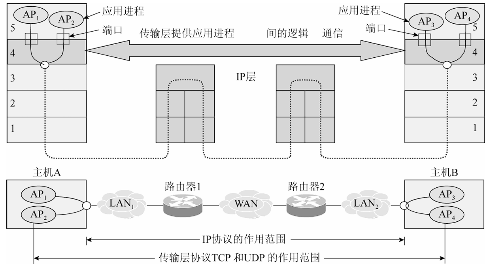
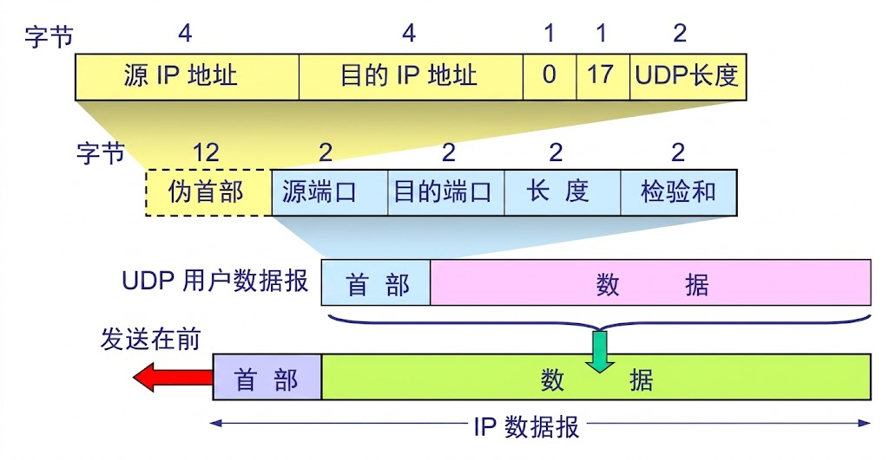
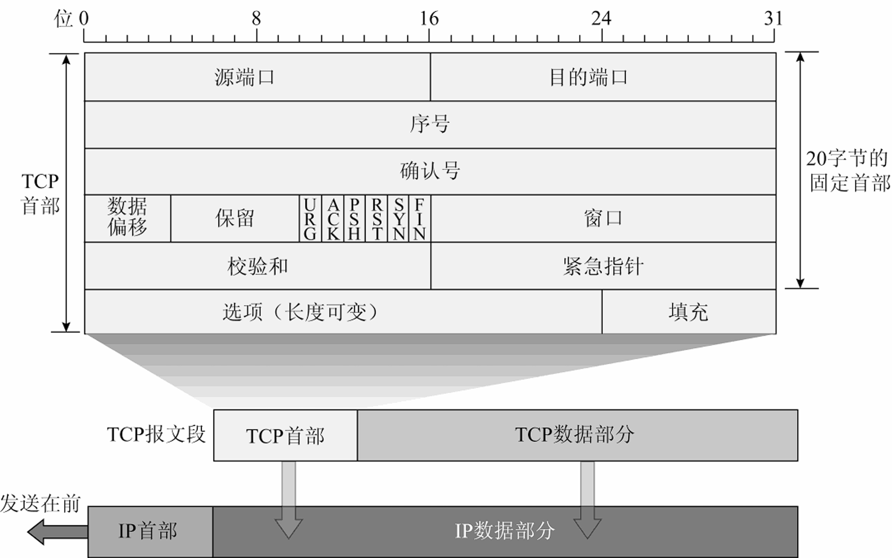
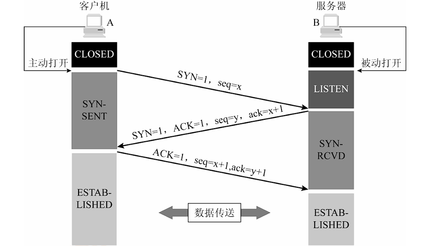
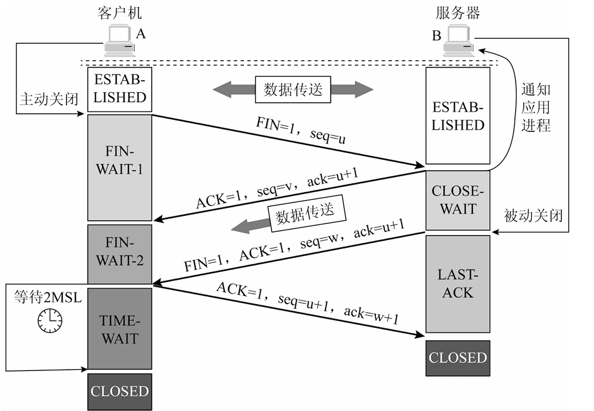
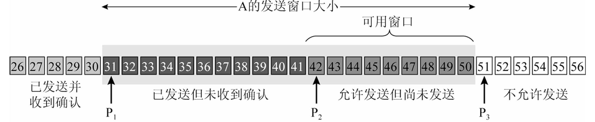
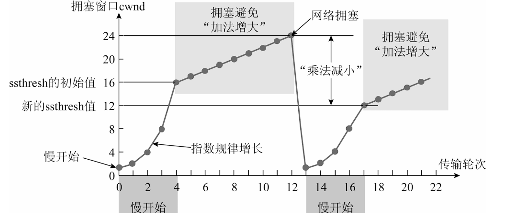
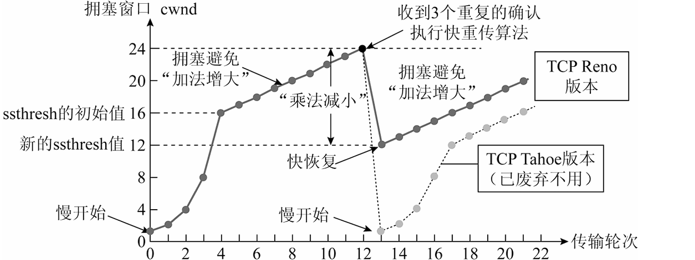

<h2 align="center">第五章 传输层</h2>

> **408 高频考点提醒**：
> - 传输层提供**端到端（进程到进程）**通信；网络层是主机到主机
> - UDP：无连接、**首部 8B**（源/目的端口 + 长度 + 校验和）；TCP 首部固定 **20B**
> - **三次握手**建立连接（SYN/ACK 序号确认），**四次挥手**释放连接（TIME_WAIT 等 2MSL）
> - TCP 面向字节流、**累计确认**、超时重传、滑动窗口（rwnd）
> - 拥塞控制：**慢开始（指数）/ 拥塞避免（线性）/ 快重传（3 个重复 ACK）/ 快恢复**
> - cwnd 与 ssthresh：超时 → ssthresh 减半、cwnd 回到 1；快重传 → ssthresh 减半、cwnd=ssthresh

---

### （一）传输层的功能与两种服务

#### 一、传输层的功能

**传输层**：提供**端到端（进程到进程）**的通信服务，是**唯一负责端到端通信的层次**。



- **TCP 是点对点（Point-to-Point）的**：**每条 TCP 连接只能有两个端点**（一对一）——一个发送端对应一个接收端，**不支持一对多/多对一**（UDP 可以）。

| 功能 | 说明 |
|:---|:---|
| **复用与分用** | 通过**端口号**区分同一主机上的不同进程（传输层报头含端口） |
| **差错控制** | 对报文进行校验和检测 |
| **流量控制** | 控制发送速率（TCP） |
| **拥塞控制** | 网络拥塞时调节发送速率（TCP） |

**传输层 vs 网络层**：

| 对比项 | 网络层 | 传输层 |
|:---|:---|:---|
| 通信范围 | **主机到主机**（主机之间） | **进程到进程**（端到端） |
| 协议 | IP | TCP / UDP |
| 提供服务 | 尽力而为（不可靠） | UDP 不可靠 / TCP 可靠 |

> **考点**：网络层负责"主机到主机"，传输层负责"进程到进程"——传输层在 IP 之上加了**端口**区分进程。

#### 二、端口（Port）（教材 5.3）

- **端口**：传输层的**服务访问点（SAP）**，用 **16 位端口号（0~65535）** 在**同一台主机**内部标识**进程** 
- **套接字（Socket）= IP 地址 + 端口号**，唯一标识网络中一个进程
- **端口只有本地意义**：端口号只在本机有意义，不同主机可以使用相同的端口号（各主机独立编号）
- **端口号分类**：

| 类别 | 范围 | 用途 |
|:---|:---|:---|
| **熟知端口（Well-known）** | 0 ~ 1023 | 固定分配给常用服务（服务器端口） |
| **登记端口（Registered）** | 1024 ~ 49151 | 应用程序向 IANA 登记后使用 |
| **客户端口（动态/私有）** | 49152 ~ 65535 | 客户程序临时选用（客户端口由系统自动分配） |

**常用熟知端口表（教材表 5-1）**：

| 端口 | 传输层 | 服务 |
|:---:|:---|:---|
| 21 / 20 | TCP | FTP（控制连接 / 数据连接） |
| 23 | TCP | TELNET |
| 25 | TCP | SMTP |
| 110 | TCP | POP3 |
| 80 | TCP | HTTP |
| 67 | UDP | DHCP 服务器 |
| 53 | UDP | DNS |
| 69 | UDP | TFTP |
| 161 | UDP | SNMP |
| 520 | UDP | RIP |

> **考点**：端口 = **进程标识（SAP）**；**套接字 = IP + 端口**；熟知端口 0~1023、客户端口 49152~65535。
> **易错点**：**端口只有本地意义**；TCP 与 UDP 各自独立编端口（同名端口号在两协议下互不冲突）。

### （二）UDP（用户数据报协议）

**UDP（User Datagram Protocol）**：**无连接、不可靠**的传输协议，只在 IP 之上加了复用/分用和简单的差错检测。

**UDP 首部（8 字节固定）**：

```
┌────────────────┬────────────────┐
│ Source port    │ Destination    │
│ (16 bits)      │ port (16 bits) │
├────────────────┼────────────────┤
│ Length (16bit) │ Checksum       │
│ (UDP datagram) │ (16 bits)      │
└────────────────┴────────────────┘
```

> 图：UDP 首部 8 字节——源端口、目的端口、长度、校验和。



| 字段 | 说明 |
|:---|:---|
| 源端口 / 目的端口 | 各 16 位，标识收发进程 |
| 长度 | UDP 数据报总长度（首部+数据），最小 8 |
| 校验和 | 检测传输差错（可选，IPv4 下 0 表示不校验） |

**UDP 校验和（Checksum）的计算（简单版）**：

- **校验范围**：**伪首部（12B）+ UDP 首部（8B）+ 数据**。伪首部只在计算校验和时临时拼在 UDP 报文前面的"虚拟首部"——**不随报文传送**，也不计入 UDP 长度：

| <nobr>伪首部字段</nobr> | <nobr>长度</nobr> | <nobr>内容</nobr> |
|:---|:---|:---|
| <nobr>源 IP 地址</nobr> | 4B | 发送方 IP（取自 IP 首部） |
| <nobr>目的 IP 地址</nobr> | 4B | 接收方 IP |
| <nobr>全 0</nobr> | 1B | 填充字节 |
| <nobr>协议号</nobr> | 1B | **17**（UDP 的协议字段值） |
| <nobr>UDP 长度</nobr> | 2B | UDP 数据报总长度（首部 + 数据） |

- **计算步骤（发送方）**：
  1. 先把校验和字段置 **0**；数据部分若不足 4B 的整数倍则**补 0 对齐**、整个部分若为**奇数个字节**再补一个全 0 字节（都只参与计算、**不发送**）
  2. 把"伪首部 + UDP 首部 + 数据"按 **16 位（2B）一组**划分，逐组做**二进制反码求和**（最高位进位循环加到最低位）
  3. 把结果**取反码**，填入校验和字段
- **接收方**：用同样方法求和，结果**全 1（0xFFFF）**即无差错

> **易错点**：伪首部**不传送**；IPv4 下 UDP 校验和**可选**（填 0 表示不校验），IPv6 下**必须**计算。
> **注意**：UDP 校验和**只能查错、不能纠错**（发现差错即丢弃）——这正是 UDP"尽力而为"不可靠性的体现。

**例题**：UDP 计算校验和过程中，计算机得到中间结果为 **1011 1001 1011 0110**，还需加上最后一个 16 位数 **0110 0101 1100 0101**，求最终计算得到的校验和。

**解**（16 位二进制反码求和）：

```
    1011 1001 1011 0110    ← 中间结果（0xB9B6）
+   0110 0101 1100 0101    ← 最后一个 16 位数（0x65C5）
= 1 0001 1111 0111 1011    ← 产生最高位进位（共 17 位）
    0001 1111 0111 1011
+                     1    ← 进位回卷（循环加到最低位）
=    0001 1111 0111 1100   → 0x1F7C
取反码：1110 0000 1000 0011 = 0xE083  ← 填入校验和字段
```

**答案**：最终校验和 = **1110 0000 1000 0011**（**0xE083**）。

> **易错点**：最后一步要把**进位回卷**（反码求和：最高位进位加到最低位）后再**取反**；不能直接写 0x11F7B 的取反（那是 17 位，校验和字段只有 16 位）。

**UDP 的特点**：

- **无连接**：发送前不需要建立连接（减少时延）
- **不可靠**：不保证交付、不保证顺序（尽力而为）
- **面向报文**：应用层给的报文多大就发多大（不分片组装）
- **通信方式**：UDP 支持**一对一、一对多、多对一、多对多**（广播/组播也常基于 UDP）——TCP 则只能一对一
- 首部开销小（8B vs TCP 20B）
- 最大数据长度 = 65535 − 8 − 20 = **65507B**

**适用场景**：DNS、DHCP、视频/语音实时传输（RTP）、广播多播。

**UDP vs TCP 对比表**：

| 对比项 | UDP | TCP |
|:---|:---|:---|
| 连接 | **无连接** | **面向连接**（三次握手） |
| 可靠性 | 不可靠 | **可靠**（确认、重传） |
| 有序性 | 不保证 | 保证字节流有序 |
| 传输单位 | 报文（面向报文） | 字节流（面向字节） |
| 首部大小 | **8B** | **20B（固定）** |
| 流量/拥塞控制 | 无 | 有（滑动窗口、慢开始等） |
| 开销 | 小、快 | 大、慢 |
| 适用 | 实时应用、DNS、DHCP | 文件传输、Web、邮件 |

> **考点**：UDP 的优势是**快**（无连接、首部小），代价是不可靠——适合实时性要求高、可容忍丢包的应用。

---

### （三）TCP 协议

#### 一、TCP 的特点（教材 5.4）

（1）**面向连接**的传输层协议——传送数据前必须先建立连接；
（2）每条 TCP 连接**只能有两个端点（socket）**——每一条 TCP 连接都是**点对点**的（一对一；UDP 才支持一对多/多对多）；
（3）**可靠交付**：保证传送的数据**无差错、不丢失、不重复**且**有序**到达；
（4）**全双工通信**：双方可同时发送和接收；
（5）**面向字节流**：TCP 对数据段中的**每一个字节进行编号**，通过编号保证可靠传输——**按字节编号，而不是按报文段编号**（与"序号/确认号"字段、累计确认机制呼应）。

> **考点**：TCP 五大特点——**面向连接、点对点、可靠交付、全双工、面向字节流**。
> **易错点**：TCP 的"可靠" = 无差错、不丢失、不重复、有序；**点对点** = 每条连接只有两个端点（socket）；字节编号 ≠ 报文段编号。

#### 二、TCP 报文段格式

**TCP 报文段** = 首部 + 数据。首部**固定 20 字节**：



> 图：TCP 报文段首部结构（简化）——端口、序号、确认号、标志位、窗口等。

**主要字段**：

| 字段 | <nobr>位数</nobr> | 说明 |
|:---|:---|:---|
| <nobr>源端口 / 目的端口</nobr>| 各 16 | 标识进程 |
| **序号 seq** | 32 | 本报文段数据第一个字节的序号（字节流编号） |
| **确认号 ack** | 32 | 期望收到对方**下一个字节**的序号；表示对前 ack−1 的**累计确认** |
| 数据偏移 | 4 | 首部长度（以 4B 为单位），可选项使首部达 60B |
| 标志位 | 6 | **URG** 紧急（插队发送，配紧急指针）、**ACK** 确认（连接后恒 1）、**PSH** 推送（接收方立即交付）、**RST** 复位（异常断开/拒绝）、**SYN** 同步（建连请求，占 1 个序号）、**FIN** 终止（释放连接，占 1 个序号） |
| 接收窗口 | 16 | 接收方允许发送方的窗口大小（rwnd） |
| 校验和 | 16 | 首部+数据的差错检测 |
| 紧急指针 | 16 | 配合 URG 使用 |

> **考点**：确认号 ack = 期望收到的**下一个**序号（累计确认）；SYN/FIN 报文段**本身也要占用一个序号**（建立/释放连接时序号 +1）。
> **易错点**：序号是**字节**序号不是报文段序号——面向字节流，每个字节一个序号。

#### 三、TCP 连接建立——三次握手



**过程**：

| 步骤 | 报文 | 含义 |
|:---|:---|:---|
| ① | 客户端发 SYN=1, seq=x | "我要建立连接"，客户端进入 **SYN_SENT** |
| ② | 服务器回 SYN=1, ACK=1, seq=y, ack=x+1 | "同意"，服务器进入 **SYN_RCVD** |
| ③ | 客户端发 ACK=1, seq=x+1, ack=y+1 | 确认，连接建立，双方 **ESTABLISHED** |

> **考点（为什么 3 次而不是 2 次）**：防止**失效的旧连接请求**（网络滞留后到达）被服务器误认为是新连接——两次握手时服务器无法区分"过期请求"与"新请求"，会白白分配资源；第三次握手让服务器确认"客户端确实要建立新连接"。

> **易错点**：
> - SYN 报文段**不携带数据**，但要占用一个序号（所以 ack = x+1）
> - 状态转换：客户端 CLOSED→SYN_SENT→ESTABLISHED；服务器 CLOSED→LISTEN→SYN_RCVD→ESTABLISHED

#### 三、TCP 连接释放——四次挥手



**过程**：

| 步骤 | 说明 |
|:---|:---|
| ① | A 发 FIN，A 进入 FIN_WAIT_1（A 不再发送数据） |
| ② | B 回 ACK——**半关闭**：B 还可以继续发送数据，A 进入 FIN_WAIT_2 |
| ③ | B 数据发完后发 FIN，B 进入 LAST_ACK |
| ④ | A 回 ACK 后进入 **TIME_WAIT**（等待 **2MSL** 后关闭） |

> **考点（TIME_WAIT 为什么等 2MSL）**：
> 1. 保证 A 的最后一个 ACK 能到达 B（若丢失，B 会重发 FIN，A 还能再应答）
> 2. 使本次连接产生的**旧报文段在网络中消失**，避免干扰新连接

> **易错点**：为什么挥手是 4 次——因为收到 FIN 后，B 可能还有数据要发，所以先回 ACK（半关闭）再发 FIN，分两步；而建立连接时 SYN 与 ACK 可以合并（第二次握手）。
> **注意**：FIN 报文段也占用一个序号。

---

### （四）TCP 可靠传输与流量控制

#### 一、序号与确认机制

- **面向字节流**：每个字节分配一个序号，序号在报文段首部（32 位）
- **累计确认**：确认号 ack = 期望收到的下一个字节的序号——**对 ack−1 之前的所有字节都确认**
- 发送方收到确认后，确认号之前的字节都无需重传

> **考点**：累计确认意味着"确认 100 号"等价于"1~99 号全部正确收到"——回退 N 帧（GBN）的确认方式。

#### 二、超时重传机制

- 发送方发送报文段后启动**超时计时器**，超过 **RTO（超时时间）** 未收到确认则**重传**
- RTO 根据 **RTT（往返时间）** 动态估计（加权平均，自适应）
- **冗余ACK**：发送方通常可在超时事件发生之前通过注意冗余 ACK 来检测丢包情况。冗余 ACK就是再次确认某个报文段的ACK，而发送方之前已经收到过该报文段的确认。


> **考点**：TCP 用**自适应**的超时时间（不是固定值）；RTT 变化大时 RTO 相应调整。

#### 三、TCP 流量控制（滑动窗口）

**流量控制**：控制**发送速率**，防止接收方处理不过来（接收方缓存溢出）。

- 接收方在确认报文中**通告接收窗口 rwnd**（首部"窗口"字段），发送方的**发送窗口 ≤ rwnd**
- 接收方 rwnd = 0 时发送方停止发送（**零窗口**），之后接收方用**窗口探测**报文询问是否可发



```
发送窗口 = min(拥塞窗口 cwnd, 接收窗口 rwnd)
```

> **考点**：流量控制是**端到端**的（接收方缓存限制）；拥塞控制是**全局**的（网络负载限制）。
> **易错点**：TCP 发送窗口同时受 cwnd 与 rwnd 限制——取两者较小者。

#### 四、TCP 拥塞控制（重点）

**拥塞控制**：防止过多数据注入网络导致网络拥塞（路由器丢包）。

**四个算法**：

| 算法 | 思想 | cwnd 变化 |
|:---|:---|:---|
| **慢开始** | cwnd 从 1 个 MSS 开始，每轮**翻倍**（指数增长） | 1 → 2 → 4 → 8 → … |
| **拥塞避免** | 达到慢开始门限 **ssthresh** 后，每轮 **+1**（线性增长） | 16 → 17 → 18 → … |
| **快重传** | 收到 **3 个重复 ACK** 立即重传（不等超时） | 不改变 cwnd |
| **快恢复** | 快重传后 ssthresh 减半、cwnd = ssthresh，直接进入拥塞避免 | 从 ssthresh 线性增长 |



<center>慢开始算法和拥塞避免算法的实现举例</center>



<center>快恢复算法的实现过程</center>

**超时 vs 快重传的处理差异**：

| 事件 | ssthresh | cwnd |
|:---|:---|:---|
| **超时**（网络可能严重拥塞） | 减半 | **回到 1**，重新慢开始 |
| **3 个重复 ACK**（轻度拥塞/丢包） | 减半 | = ssthresh，**快恢复**（直接线性增长） |

**例题（王道经典，完整过程）**：初始 ssthresh = 16（MSS），每轮 RTT 后 cwnd 变化：

| 轮次 | 阶段 | cwnd | 说明 |
|:---|:---|:---|:---|
| 1 | 慢开始 | 1 | |
| 2 | 慢开始 | 2 | 翻倍 |
| 3 | 慢开始 | 4 | 翻倍 |
| 4 | 慢开始 | 8 | 翻倍 |
| 5 | 慢开始 | 16 | 达到 ssthresh，下一轮转拥塞避免 |
| 6 | 拥塞避免 | 17 | +1 |
| 7 | 拥塞避免 | 18 | +1 |
| 8 | 拥塞避免 | 19 | +1 |
| 9 | 拥塞避免 | 20 | +1 |
| 10 | 拥塞避免 | 21 | +1 |
| 11 | 拥塞避免 | 22 | +1 |
| 12 | 拥塞避免 | 23 | +1 |
| 13 | 拥塞避免 | 24 | **此时超时（或 3 个重复 ACK）** |

**情形 ①（第 13 轮出现超时）**：

```
ssthresh = 24 / 2 = 12，cwnd 回到 1 重新慢开始：
cwnd: 1 → 2 → 4 → 8 → 12（达新门限 12，转拥塞避免）→ 13 → 14 → 15 → ...
```

**情形 ②（第 13 轮收到 3 个重复 ACK，快重传 + 快恢复）**：

```
ssthresh = 24 / 2 = 12，cwnd = 12（快恢复），直接从拥塞避免开始：
cwnd: 13 → 14 → 15 → ...
```

> **考点**：
> - 慢开始是**指数**增长（每轮翻倍），拥塞避免是**线性**增长（每轮 +1）
> - 超时 → ssthresh 减半 + cwnd 归 1；快重传 → ssthresh 减半 + cwnd = ssthresh
> - cwnd 达到 ssthresh 时由慢开始转为拥塞避免
> - 判断依据：**超时**表示拥塞严重；**3 个重复 ACK** 表示单个报文丢失（其余正常到达）

> **易错点**：快重传检测到"3 个重复 ACK"的前提——接收方对每个失序到达的报文都要立即回**重复 ACK**（确认号指向缺失的序号）。

> **补充（教材，明示考点）**：
> - **一个传输轮次 ≈ 一个 RTT**：慢开始每轮 cwnd **翻倍（宏观加倍）**，实现上"每收到一个报文段的确认 cwnd 就 +1（微观加 1）"，一轮收齐在途 ACK 即翻倍
> - **TCP Reno vs TCP Tahoe**：**Tahoe** 检测到拥塞（超时 **或** 3 个重复 ACK）一律 **cwnd 归 1、重新慢开始**（无快恢复）；**Reno** 引入**快重传 + 快恢复**（3 个重复 ACK 时 ssthresh 减半、cwnd = ssthresh），即上文"情形②"——现代 TCP 默认 **Reno** 风格。

---

### （五）本章总结

**知识结构图**：

```
第五章 传输层
├─（一）传输层功能与两种服务
│   ├─ 功能：进程到进程（端口复用分用）、差错、流量、拥塞控制
│   ├─ 端口：16 位、Socket=IP+端口；0~1023 熟知(FTP21/20·TELNET23·SMTP25·POP3 110·HTTP80·DNS53·DHCP67)/1024~49151 登记/49152~65535 动态
│   ├─ UDP：无连接、8B 首部（源/目的端口+长度+校验和）、面向报文、不可靠、快；最大 65507B；校验和=伪首部(12B,不传送)+报文反码求和
│   └─ TCP：面向连接、点对点(两 socket 端点)、可靠(无差错/不丢失/不重复/有序)、全双工、面向字节流(按字节编号)、20B 首部
├─（二）TCP 协议
│   ├─ 报文段：序号 seq(32 位字节序号)、确认号 ack（累计确认）、标志位 URG 插队发送/ACK 连接后恒1/PSH 立即交付/RST 异常复位/SYN 占序号/FIN 占序号、数据偏移(最长 60B)、窗口 rwnd
│   ├─ 三次握手：SYN(SYN_SENT) → SYN+ACK(SYN_RCVD) → ACK(ESTABLISHED)；防失效连接请求
│   └─ 四次挥手：FIN → ACK(半关闭) → FIN → ACK；TIME_WAIT 等 2MSL
└─（三）可靠传输与流量/拥塞控制
    ├─ 可靠：字节序号 + 累计确认 + 自适应超时重传（RTO 随 RTT 变化）
    ├─ 流量控制：滑动窗口 rwnd（端到端）；零窗口 + 窗口探测
    └─ 拥塞控制：慢开始(指数) / 拥塞避免(线性) / 快重传(3重复ACK) / 快恢复
        └─ 例题：ssthresh=16，超时/快重传后减半为 12；超时 cwnd=1、快恢复 cwnd=ssthresh
```

**高频考点速记**：

| 考点 | 一句话记忆 |
|:---|:---|
| 传输层 vs 网络层 | 进程到进程（端口）vs 主机到主机 |
| 端口 | 16 位（0~65535）；**0~1023 熟知 / 1024~49151 登记 / 49152~65535 动态**；**Socket = IP + 端口**；端口只有本地意义 |
| 常用端口 | FTP 21/20、TELNET 23、SMTP 25、POP3 110、HTTP 80、DNS 53、DHCP 67、TFTP 69、SNMP 161、RIP 520 |
| UDP 首部 | **8B**：源端口/目的端口/长度/校验和 |
| UDP 校验和 | 覆盖**伪首部(12B)+报文**；反码求和取反；伪首部**不传送**（协议 17）；只能查错不能纠错 |
| UDP 最大长度 | 65535 − 8 − 20 = **65507B** |
| TCP 首部 | 固定 **20B**，最长 60B（数据偏移 4 位） |
| TCP 标志位 | **URG 紧急(插队发送+紧急指针)/ACK 确认(连接后恒 1)/PSH 推送(接收方立即交付)/RST 复位(异常断开·拒绝)/SYN 同步(占序号)/FIN 终止(占序号)** |
| UDP 特点 | 无连接、不可靠、面向报文、无拥塞控制；支持**一对一/一对多/多对一/多对多** |
| TCP 特点 | 面向连接、可靠（无差错/不丢失/不重复/有序）、**全双工**、面向字节流（**按字节编号**）、有流量/拥塞控制；**点对点（只能一对一，两 socket 端点）** |
| 序号 | 每个**字节**一个序号（32 位） |
| 确认号 ack | 期望收到的**下一个字节序号**（累计确认） |
| SYN/FIN | 不携带数据也**占用一个序号** |
| 三次握手 | SYN(SYN_SENT)→SYN+ACK(SYN_RCVD)→ACK(ESTABLISHED)；3 次：防失效连接请求 |
| 四次挥手 | FIN→ACK→FIN→ACK；**半关闭**（B 先回 ACK 再发 FIN） |
| TIME_WAIT | 等 **2MSL**：确保最后 ACK 到达 + 旧报文消失 |
| 累计确认 | 确认号前所有字节都正确收到（GBN 方式） |
| RTO | 根据 RTT 自适应估计 |
| 流量控制 | 接收窗口 rwnd 限制发送（端到端） |
| 发送窗口 | $\min(\text{cwnd}, \text{rwnd})$ |
| 零窗口 | rwnd=0 暂停发送，用**窗口探测**报文询问 |
| 慢开始 | cwnd **指数**增长（1→2→4→8…） |
| 拥塞避免 | cwnd **线性**增长（每轮 +1） |
| 快重传 | 收到 **3 个重复 ACK** 立即重传 |
| 快重传前提 | 接收方对**失序到达**的报文**立即回重复 ACK**（确认号指向缺失序号） |
| 快恢复 | ssthresh 减半、cwnd = ssthresh |
| 超时处理 | ssthresh 减半（例题 24→**12**）、**cwnd 回到 1** 重新慢开始 |
| 拥塞判断依据 | **超时**=拥塞严重（cwnd 归 1）；**3 个重复 ACK**=单报文丢失（快恢复） |
| 传输轮次 | 1 轮 ≈ **1 RTT**；慢开始"**宏观加倍、微观加 1**"（每收一个 ACK，cwnd+1） |
| Reno vs Tahoe | **Reno**=快重传+快恢复（3 重复 ACK 时 cwnd=ssthresh）；**Tahoe**=任何拥塞一律 cwnd 归 1、重慢开始 |
| 慢开始门限 | cwnd 达到 ssthresh → 转拥塞避免 |
| UDP 应用 | DNS、DHCP、音视频实时传输 |
| TCP 应用 | HTTP、FTP、SMTP（可靠传输类） |
