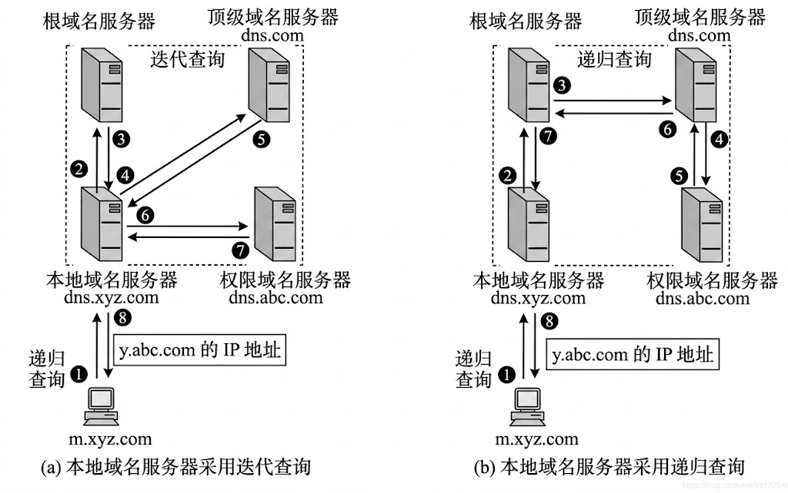

<h2 align="center">第六章 应用层</h2>

> **408 高频考点提醒**：
> - 应用层协议端口（必背）：**DNS 53、FTP 21/20、SMTP 25、POP3 110、IMAP 143、HTTP 80、HTTPS 443、DHCP 67/68、TFTP 69**
> - **C/S vs P2P**：C/S 服务器集中服务、**可扩展性差**；P2P 节点既是客户又是服务器、**可扩展性好**
> - **DNS 解析**：主机→本地域名服务器为**递归查询**，本地→根/顶级/权威为**迭代查询**；UDP 53
> - **FTP 两条连接**：控制连接 **TCP 21**（整个会话保持）、数据连接 **TCP 20**（按需建立）
> - 邮件：**SMTP 只管发**（TCP 25，只能传文本→MIME 编码）、**POP3/IMAP 只管收**（TCP 110/143）
> - **HTTP 无状态**：靠 Cookie 实现会话跟踪；**HTTP/1.1 默认持续连接**，非持续连接每个对象 2 RTT
> - 状态码类别：**2xx 成功、3xx 重定向、4xx 客户端错误、5xx 服务器错误**（200/301/302/404/500）
> - **HTTPS = HTTP + SSL/TLS**（TCP 443），提供加密与身份认证；Cookie 存客户端、Session 存服务器
> - **DHCP 四阶段**：DISCOVER（广播）→ OFFER → REQUEST（广播）→ ACK；租期过半单播续租、87.5% 广播重新发现

---

### （一）端系统的通信模型

网络应用（应用层程序）之间通信的基本模式有两种：**C/S 模式**与 **P2P 模式**。

#### 一、C/S 模式（Client/Server，客户/服务器）

- 角色固定：**客户**（请求服务）与**服务器**（提供服务）分工明确，服务器被动等待请求
- **服务器集中服务**：所有客户的请求都发往同一个（或一组）服务器，服务器集中处理并返回结果
- 服务器需要**持续运行**、监听固定端口；客户按需发起连接

```
┌───────────┐                 ┌───────────┐
│  Client   │  request        │  Server   │
│  (C/S)    │────────────────►│  service  │
│           │  response       │  center   │
│           │◄────────────────│           │
└───────────┘                 └───────────┘
```

> 图：C/S 模式中客户机发起请求，服务器集中提供服务并返回响应。

**特点**：集中管理、实现简单、数据一致性好；但**可扩展性差**——客户数激增时服务器成为瓶颈（需升级硬件或加服务器集群）。

#### 二、P2P 模式（Peer to Peer，对等模式）

- 网络中的节点**地位平等**，没有固定的客户/服务器之分
- 每个节点**既是客户又是服务器**：请求服务的同时也向其他节点提供服务（共享资源）
- 典型应用：BitTorrent、迅雷下载、P2P 直播

**特点**：**可扩展性好**——加入的节点越多，系统能提供的总服务能力越强（每个新节点同时带来资源）；无中心服务器，成本低、可靠性高（单点失效不影响整体）。

#### 三、C/S 与 P2P 对比

| 对比项 | C/S 模式 | P2P 模式 |
|:---|:---|:---|
| 角色 | 客户（请求）与服务器（服务）**分工固定** | 节点**既当客户又当服务器**，地位对等 |
| 服务方式 | **集中服务**（所有请求都访问服务器） | 分布式服务（节点之间直接交换） |
| 可扩展性 | **差**（服务器是瓶颈） | **好**（节点越多能力越强） |
| 成本 | 需专用服务器，硬件成本高 | 无需专用服务器，成本低 |
| 可靠性 | 服务器宕机 → 服务中断 | 单个节点失效不影响整体 |
| 典型应用 | WWW、FTP、SMTP、DNS | BitTorrent、迅雷、P2P 直播 |

> **考点**：C/S 与 P2P 的本质区别——**服务的集中与分散**；P2P 可扩展性优于 C/S（节点越多服务能力越强），C/S 易于集中管理。

---

### （二）DNS 系统

#### 一、DNS 的概念与层次域名空间

##### 1. DNS 基本概念

**DNS（Domain Name System，域名系统）**：把便于人类记忆的**域名**解析为**IP 地址**的分布式数据库系统（也可进行反向解析）。

- 为什么需要 DNS：IP 地址（如 180.101.50.188）难记，而域名（如 www.baidu.com）有含义、易记忆
- 映射关系**分布存储**在全世界多台域名服务器上，任何一台都不能存储全部映射
- 传输层使用 **UDP 端口 53**（查询报文短小，一问一答）

> **考点**：DNS 的作用是"**域名 → IP 地址**"的解析，采用**分布式数据库**存放映射（没有集中式数据库）。

##### 2. 层次域名空间

域名空间按**树形结构**组织，从根向下分为多级：

```
域名空间（层次树形结构）
├─ 根域名（Root）：树根，无标识（根域）
├─ 顶级域名（Top-Level Domain, TLD）
│   ├─ 通用顶级域名（gTLD）：com、edu、gov、int、mil、net、org（7 个）
│   └─ 国家及地区顶级域名（ccTLD）：cn、uk、jp、us
├─ 二级域名（Second-Level Domain）
│   └─ 如：baidu.com、tsinghua.edu.cn、gov.cn
└─ 三级域名（Third-Level Domain）
    └─ 如：www.baidu.com（主机名.二级域名.顶级域名）
```

> 图：层次域名空间呈树形结构，自根向下依次为根域、顶级域、二级域、三级域（含主机名）。

| 顶级域类型 | 举例 | 说明 |
|:---|:---|:---|
| **通用顶级域名（gTLD）** | com、edu、gov、int、mil、net、org（共 7 个） | 按机构类别划分（com 商业、edu 教育、gov 政府、mil 军事等） |
| **国家及地区顶级域名（ccTLD）** | cn、uk、jp、us | 按国家/地区划分，cn 为中国 |

**域名标号规则**：不区分大小写；每一标号不超过 63 个字符；整个域名不超过 255 个字符。

> **注意**：域名**从左到右层次降低**——最右边是顶级域名（com/cn），最左边是主机名（www）；例：www.baidu.com = 三级域名 www + 二级域名 baidu + 顶级域名 com。
> **补充（教材）**：**反向解析**（IP → 域名）使用特殊的 **arpa 域**（如 in-addr.arpa），与正向的层次域名空间并列。

#### 二、域名服务器

域名映射分布存储，需要**多台域名服务器**分工协作。按层次分为四类：

| 服务器 | 职责 | 备注 |
|:---|:---|:---|
| **根域名服务器** | 知道所有**顶级域名服务器**的 IP，是解析的"总入口" | 全球共 **13 台**根服务器（字母 A~M 标识），每台是一个**集群**（众多镜像服务器） |
| **顶级域名服务器** | 管理其顶级域下的二级域名（如 com 域、cn 域） | 解析时返回对应的**权威域名服务器**地址 |
| **权威（权限）域名服务器** | 负责某个"区"的解析，把域名直接映射为 IP 地址 | 每台主机必须将其域名注册在某权威服务器上 |
| **本地域名服务器** | 主机所在网络的域名服务器（通常由 ISP 提供） | **递归查询的入口**，主机首先访问的就是它 |

> **考点**：**本地域名服务器**不属于层次结构，是主机查询的"代理/入口"；**根域名服务器**知道所有顶级域名服务器的地址，是解析的起点。
> **易错点**：13 台根域名服务器是**集群**（每台由大量镜像机组成），而不是全球只有 13 台物理机器。
> **注意（教材）**：域名服务器的管辖范围按"**区（zone）**"划分，**区 ≠ 域**（区可以小于域）；为防单点故障，每个区设**主域名服务器**与**辅助域名服务器**——主服务器定期把数据**复制**到辅助服务器，**更改数据只能在主服务器**上进行。

#### 三、域名解析过程（重点）

##### 1. 递归查询与迭代查询

| <nobr>对比项</nobr> | 递归查询（Recursive） | 迭代查询（Iterative） |
|:---|:---|:---|
| 发起者 | 主机（或下一级域名服务器） | **本地域名服务器** |
| 方式 | 把查询**委托**给上级服务器，逐级向上，只等**最终结果** | 自己**逐个询问**根/顶级/权威服务器，每次都只得到**下一步该问谁的地址** |
| 返回值 | 最终 IP 地址（或"域名不存在"） | 下一次要查询的**服务器地址** |
| 负担 | 被委托的服务器**负担重**（它要替别人查到底） | 发起查询的本地服务器负担重 |



##### 2. 实际解析流程（递归 + 迭代结合）

实际使用中**两者结合**：主机对本地域名服务器用**递归查询**；本地域名服务器对根/顶级/权威服务器用**迭代查询**（默认方式）。

```
主机（DNS 客户端）
   │ ① 递归查询：请求本地域名服务器解析 www.baidu.com
   ▼
本地域名服务器
   │ ② 迭代查询：询问根域名服务器
   ▼
根域名服务器 ──► 返回顶级域名服务器（.com）的 IP
   │
   ▼
本地域名服务器
   │ ③ 迭代查询：询问顶级域名服务器
   ▼
顶级域名服务器（.com）──► 返回权威域名服务器（baidu.com）的 IP
   │
   ▼
本地域名服务器
   │ ④ 迭代查询：询问权威域名服务器
   ▼
权威域名服务器（baidu.com）──► 返回 www 主机对应的 IP 地址
   │
   ▼
本地域名服务器
   │ ⑤ 递归查询：把最终 IP 返回给主机
   ▼
主机得到 www.baidu.com 的 IP 地址
```

> 图：DNS 解析流程——主机→本地为递归查询，本地→根/顶级/权威为迭代查询。

##### 3. DNS 高速缓存与传输层协议

- 每个域名服务器都**缓存**最近解析过的结果，下次查询直接命中，减少查询流量、加快解析
- 缓存条目有**生存时间（TTL，Time To Live）**，到期自动删除，防止域名映射变更后仍用旧值
- 传输层：查询**默认用 UDP（端口 53）**；区域传送（主服务器向从服务器同步数据）用 TCP 53

> **考点**：主机→本地域名服务器是**递归查询**；本地→根/顶级/权威是**迭代查询**（可配置为递归）。
> **注意**：DNS 查询默认 **UDP 53**（报文小、快），只有**区域传送**才用 TCP 53。

---

### （三）文件传输协议 FTP

**FTP（File Transfer Protocol，文件传输协议）**：采用 **C/S 模式**、传输层使用 **TCP**（可靠传输），用于在客户与服务器之间传输文件。

- 特点（教材 6.3）：
  - **交互式**访问
  - 屏蔽异构系统差异
  -  C/S 模式，服务器采用"**主进程 + 若干从属进程**"并行处理多客户请求
  - 减少程序处理的不兼容
  - 基于 **TCP**


FTP 使用**两条 TCP 连接**：控制连接与数据连接。

```
┌────────────────┐   ┌────────────────┐
│   FTP client   │   │   FTP server   │
└────────────────┘   └────────────────┘
  control conn (21) ◄────────────────► port 21
  data conn (20)    ◄────────────────► port 20
```

> 图：FTP 的两条 TCP 连接——控制连接（21）贯穿整个会话，数据连接（20）按需建立。

| 连接 | 端口 | 建立时机 | 用途 | 生命周期 |
|:---|:---|:---|:---|:---|
| **控制连接** | **TCP 21** | 客户登录时建立 | 传输**控制命令**（登录、目录操作、文件操作指令） | **整个会话始终保持** |
| **数据连接** | **TCP 20** | 传输文件时建立 | 传输**文件数据** | **按需建立**，文件传完即关闭 |

> **考点**：FTP 用**两条** TCP 连接——控制连接（21）全程保持、传命令；数据连接（20）按需建立、传数据。
> **易错点**：控制连接是"**带外（out-of-band）**"传送控制信息（与 HTTP 控制信息与数据在同一条连接内传送不同）。

**主动模式与被动模式**（决定数据连接由谁发起）：

| 模式 | 数据连接建立方式 | 特点 |
|:---|:---|:---|
| <nobr>**主动模式（PORT）**</nobr> | 客户告知自己监听的数据端口，**服务器主动**从 **20 端口**连接客户 | 客户在防火墙/NAT 后时连接常被拦 |
| **被动模式（PASV）** | 服务器告知其数据端口，**客户主动**连接服务器 | 服务器开放端口，便于穿越防火墙，互联网上更常用 |

**FTP 与 TFTP 对比**：

| 对比项 | FTP | TFTP |
|:---|:---|:---|
| 全称 | 文件传输协议 | **简单文件传输协议** |
| 传输层 | TCP（可靠） | **UDP（端口 69）** |
| 功能 | 文件传输 + 认证 + 目录操作 | 仅简单文件传输，**无认证、无目录浏览** |
| 适用场景 | 通用文件传输 | 无盘工作站启动、嵌入式设备升级 |

> **考点**：TFTP 用 **UDP 69**，简单无认证；FTP 用 TCP（控制 21 / 数据 20）。

---

### （四）电子邮件

#### 一、邮件系统的组成

##### 1. 邮件系统的三个组成部分

| 组成 | 作用 |
|:---|:---|
| <nobr>**用户代理（UA, User Agent）</nobr>** | 客户端软件，用于**撰写、阅读、管理**邮件（Outlook、Foxmail、Web 邮箱） |
| **邮件服务器** | **发送方邮件服务器**与**接收方邮件服务器**：收发、暂存邮件（发送方服务器负责把邮件转发给接收方服务器） |
| **邮件协议** | **SMTP**（发送）、**POP3 / IMAP**（接收） |

##### 2. 邮件格式（信封 + 首部 + 正文）

| 部分 | 内容 | 说明 |
|:---|:---|:---|
| **信封（Envelope）** | 发件人地址、收件人地址 | 由 UA 填写，**邮件传输时实际使用** |
| **首部（Header）** | From、To、Subject、Date 等 | 供人阅读；From/To 与信封地址可以不同（如抄送） |
| **正文（Body）** | 邮件内容 | 与首部之间用空行隔开 |

> **注意**：邮件投递（SMTP）使用的是**信封上的地址**，而非首部中的 From/To——这也是"伪造发件人"漏洞的根源之一。

#### 二、发送协议 SMTP（Simple Mail Transfer Protocol，简单邮件传输协议）

##### 1. SMTP 的工作原理

- C/S 模式，传输层 **TCP，端口 25**
- 作用：把邮件从**发送方 UA → 发送方邮件服务器 → 接收方邮件服务器**（只能"推"）
- **只能传输 7 位 ASCII 文本**——图片、视频、中文等非 ASCII 内容不能直接传，需要 **MIME** 编码
- **缺点（教材）**：① **不能传送二进制对象**（可执行文件等）；② 仅限 **7 位 ASCII**（中文、图片等需 MIME）；③ 拒绝**过长**的邮件

##### 2. MIME（Multipurpose Internet Mail Extensions，多用途互联网邮件扩展）

- 不是新协议，而是 SMTP 的**扩展/辅助**：对**非 ASCII 内容**（图片、音频、中文）进行**编码**传输，接收端解码还原
- 用**内容类型（Content-Type）** 说明正文类型：text/plain、text/html、image/jpeg、application/octet-stream 等

> **考点**：SMTP 端口 **25**，**只能传文本**；传二进制（图片/视频/中文）靠 **MIME** 编码与解码。
> **易错点**：MIME **不替代** SMTP，而是对 SMTP 的扩展；发送方编码、接收方解码，双方 UA 都要支持。

#### 三、接收协议 POP3 与 IMAP

| 协议 | 端口/传输层 | 工作方式 | 特点 |
|:---|:---|:---|:---|
| **POP3**（Post Office Protocol v3，邮局协议第 3 版） | TCP **110** | 把邮件**下载到本地**，服务器上可**删除**或**保留** | 适合**离线阅读**；多设备难以同步 |
| **IMAP**（Internet Message Access Protocol，网际报文存取协议） | TCP **143** | 邮件**保留在服务器**上，可在服务器端管理（文件夹、已读/未读状态） | **多设备同步**方便，更灵活 |
| **HTTP** | 80 / 443 | **Web 邮箱**（浏览器收发邮件） | 收发都走 HTTP |

> **考点**：POP3 是"**下载后管理**"（离线阅读、可删可留）；IMAP 是"**服务器上管理**"（邮件不删、多设备同步）。
> **易错点**：SMTP 只管**送（推）**，POP3/IMAP 只管**取（拉）**；收件人的邮件存放在**接收方邮件服务器**上。

#### 四、发送过程流程

```
发件人用户代理（UA）
   │ SMTP（TCP 25）发送
   ▼
发送方邮件服务器
   │ SMTP（TCP 25）转发（若对方在线可直投，否则暂存）
   ▼
接收方邮件服务器
   │ POP3（TCP 110）/ IMAP（TCP 143）读取
   ▼
收件人用户代理（UA）
```

> 图：电子邮件的发送与接收流程——SMTP 负责投递（推），POP3/IMAP 负责取回（拉）。

---

### （五）万维网 WWW

#### 一、WWW 与 URL

##### 1. 万维网 WWW

**WWW（World Wide Web，万维网）**：基于**超文本（Hypertext）** 的全球信息系统——资源用 **URL** 定位，通过 **HTTP** 协议传输，以**超链接**互相引用。

##### 2. URL（Uniform Resource Locator，统一资源定位符）

URL 用于定位 Internet 上的任意资源，一般格式：

```
协议 :// 主机名[:端口] / 路径
例：http://www.example.com:80/index.html
```

| 组成 | 例子（http://www.example.com:80/index.html） | 说明 |
|:---|:---|:---|
| **协议** | http | 也可是 https、ftp 等 |
| **主机名** | www.example.com | 可带端口号 `:80`（默认端口可省略） |
| **路径** | /index.html | 可省略，省略时访问服务器的默认文档（首页） |

> **考点**：URL 四要素"**协议 + 主机 + 端口 + 路径**"；**HTTP 默认端口 80、HTTPS 默认端口 443**，等于默认值时端口可省略。
> **易错点**：URL 中"://"与"端口前的冒号"不能丢；路径缺省时服务器返回默认首页（如 index.html）。

#### 二、HTTP 协议（重点）

##### 1. HTTP 的特点（无状态）

- **HTTP（HyperText Transfer Protocol，超文本传输协议）**：应用层协议，C/S 模式，**浏览器（客户）**请求、**Web 服务器**响应
- 传输层 **TCP，默认端口 80**
- **无状态（Stateless）**：服务器**不保存**任何请求/客户信息，每个请求独立处理——实现简单高效；但需要"记住用户"时，靠 **Cookie** 实现会话跟踪

```
┌────────────┐                 ┌────────────┐
│  Client    │  HTTP request   │  Server    │
│  (browser) │────────────────►│  port 80   │
│            │  HTTP response  │            │
│            │◄────────────────│            │
└────────────┘                 └────────────┘
```

> 图：HTTP 请求-响应模型：客户（浏览器）发起请求，服务器返回响应，一次请求-响应即一个事务。

**访问网页的完整过程与所用协议（教材 6.5，高频口诀）**：

```
① 分析 URL
② DNS 解析域名（DNS/UDP 53）
③ 建立 TCP 连接（IP、数据链路层）
④ 发送 HTTP 请求（GET）
⑤ 服务器返回 HTML 响应
⑥ 释放 TCP 连接
⑦ 浏览器解释渲染并显示
```

> **口诀**：**DNS 用 UDP、传输用 TCP、应用用 HTTP**——"先查域名（UDP）、再建连接（TCP）、再传网页（HTTP）"。

##### 2. HTTP 报文

| 报文 | 结构 |
|:---|:---|
| **请求报文** | 请求行（方法 空格 URL 空格 HTTP 版本）+ 首部行 + 空行 + 实体主体 |
| **响应报文** | 状态行（HTTP 版本 空格 状态码 空格 短语）+ 首部行 + 空行 + 实体主体 |

##### 3. 请求方法

| 方法 | 含义 | 说明 |
|:---|:---|:---|
| **GET** | 请求读取资源 | 最常见；参数放在 URL 中 |
| **POST** | 向服务器提交数据 | 如表单；数据放在实体主体中 |
| **HEAD** | 只请求首部（不返回正文） | 用于检查资源是否存在 |
| **PUT** | 上传/替换资源 | 把请求实体存放到指定 URL |
| **DELETE** | 删除指定资源 | — |

##### 4. 状态码

| 类别 | 含义 | 典型例子 |
|:---|:---|:---|
| **1xx** | 信息类（请求已收到，继续处理） | 100 Continue |
| **2xx** | **成功** | **200 OK** |
| **3xx** | **重定向**（需进一步操作才能完成） | **301** 永久重定向、**302** 临时重定向 |
| **4xx** | **客户端错误** | **404 Not Found**（资源不存在） |
| **5xx** | **服务器错误** | **500** 内部服务器错误 |

> **考点**：状态码三位数，**首位代表类别**：2 成功（200）、3 重定向（301/302）、4 客户端错误（404）、5 服务器错误（500）。

##### 5. 非持续连接与持续连接

| 对比项 | 非持续连接（HTTP/1.0） | 持续连接（HTTP/1.1，**默认**） |
|:---|:---|:---|
| 连接方式 | **每个对象一个 TCP 连接**，传完即断开 | 一个 TCP 连接上**连续传送多个对象** |
| 开销 | 反复建立/断开连接，效率低 | 只建立一次连接 |
| RTT | 获取**每个对象需 2 RTT**（1 RTT 建连 + 1 RTT 请求/响应） | 多个对象共享建连开销 |
| 非流水线方式 | — | 发一个请求、等一个响应，再发下一个（串行） |
| 流水线（Pipelining）方式 | — | 一次**连续发出多个请求**，一次收到全部响应（更快） |

> **考点**：非持续连接下获取**每个对象需 2 RTT**；**HTTP/1.1 默认持续连接**，且支持流水线（连续发多个请求）。
> **易错点**：流水线是持续连接的**优化手段**（并行发送），不是新协议版本；HTTP/2 在此基础上进一步**多路复用**。

#### 三、HTTPS（HTTP Secure）

- **HTTPS = HTTP + SSL/TLS**：SSL/TLS 位于 TCP 与应用层之间，为 HTTP 提供安全服务
- 传输层 **TCP，默认端口 443**
- 提供三大安全功能：① **加密**（防窃听，对称加密传输数据）② **身份认证**（数字证书验证服务器身份，防冒充）③ **完整性校验**（防篡改）

| 对比项 | HTTP | HTTPS |
|:---|:---|:---|
| 端口 | 80 | **443** |
| 安全性 | **明文**传输 | SSL/TLS **加密** + 数字证书**认证** |
| 效率 | 高 | 加解密与握手有额外开销，稍慢 |

> **考点**：HTTPS = **HTTP + SSL/TLS**，端口 **443**；先进行 SSL 握手（协商密钥、验证证书），之后传输加密的 HTTP 数据。

#### 四、Cookie 与 Session

| 对比项 | Cookie | Session |
|:---|:---|:---|
| 存放位置 | **客户端（浏览器）** | **服务器端** |
| 存放内容 | 用户偏好、**会话标识（session ID）** 等少量数据 | 用户会话数据（登录状态、购物车等） |
| 传输方式 | 每次请求随 HTTP 报文**首部**带回服务器 | 服务器通过 Cookie 中的 session ID 找到对应会话 |
| 安全性 | 存储在客户端，**可被伪造/窃取**，不宜放敏感信息 | 数据在服务器，相对安全 |

> **考点**：HTTP **无状态**，靠 **Cookie（客户端）** 与 **Session（服务器端）** 配合实现会话跟踪：服务器创建 Session 并下发 session ID，浏览器用 Cookie 保存，之后每次请求带回 session ID 即可识别用户。

---

### （六）DHCP

#### 一、DHCP 概述

##### 1. DHCP 基本概念

**DHCP（Dynamic Host Configuration Protocol，动态主机配置协议）**：自动为主机分配**IP 地址、子网掩码、默认网关、DNS 服务器**等网络配置信息，免去手工配置。

- C/S 模式；传输层 **UDP**：服务器端口 **67**、客户端端口 **68**
- 主机启动时"自动获取"配置（即 DHCP），无盘工作站等设备也能入网

##### 2. 分配方式与租约

| 分配方式 | 说明 |
|:---|:---|
| **动态分配** | 从地址池中分配，**有租期**，到期可回收再利用（最常用） |
| **自动分配** | 首次分配后**永久使用**（不再回收） |
| **固定分配** | 管理员**手工指定**，IP 与 MAC 地址绑定 |

**租约（Lease）**：IP 地址的使用期限；租约到期前必须续租，否则停止使用该 IP（避免地址浪费）。

> **考点**：DHCP 用 **UDP**——服务器端口 **67**、客户端端口 **68**；租约机制保证 IP 地址动态回收。

#### 二、DHCP 工作过程（重点）

##### 1. 四阶段交互（发现 → 提供 → 请求 → 确认）

```
DHCP 客户端（新入网主机）
   │
   ▼
① DHCP DISCOVER：广播"谁能给我分配 IP？"（目的地址 255.255.255.255，源地址 0.0.0.0）
   │
   ▼
② DHCP OFFER：服务器以广播/单播回应，提供候选 IP 地址、租期与配置信息
   │
   ▼
③ DHCP REQUEST：客户端广播，选定某台服务器的配置（同时通知其他服务器放弃）
   │
   ▼
④ DHCP ACK：被选中的服务器确认，租约生效，主机正式使用该 IP
```

> 图：DHCP 工作四阶段：DISCOVER（发现）→ OFFER（提供）→ REQUEST（请求）→ ACK（确认）。

| 阶段 | 报文 | 方向 / 方式 | 内容 |
|:---|:---|:---|:---|
| ① 发现 | **DHCP DISCOVER** | 客户 → **广播**（目的 **255.255.255.255**，源 0.0.0.0） | "谁有 IP 可分配？"（客户此时还没有 IP） |
| ② 提供 | **DHCP OFFER** | 服务器 → **广播/单播** | 提供候选 IP、子网掩码、租期、网关、DNS 等 |
| ③ 请求 | **DHCP REQUEST** | 客户 → **广播** | "我选定某台服务器的配置"（广播通知所有服务器） |
| ④ 确认 | **DHCP ACK** | 服务器 → 单播/广播 | 确认配置，**租约生效** |

##### 2. 租约的续租

- **租期过半（50%）**：客户端**单播** DHCP REQUEST 给原服务器请求续租 → 收到 ACK 即续租成功
- **租期 87.5%** 仍未续约：改为**广播** DHCP DISCOVER，重新寻找可用的 DHCP 服务器
- **租约到期**仍未续租：停止使用该 IP，重新申请

> **考点**：**DISCOVER 与 REQUEST 都是广播**（DISCOVER 时主机无 IP，REQUEST 时通知其他服务器放弃）；OFFER 与 ACK 可以单播。
> **易错点**：四阶段顺序 **DISCOVER → OFFER → REQUEST → ACK** 不能颠倒；续租"50% 单播、87.5% 广播"是常考数字。

---

### （七）本章总结

**知识结构图**：

```
第六章 应用层
├─（一）端系统的通信模型
│   ├─ C/S 模式：服务器集中服务、客户-服务器分工固定、可扩展性差
│   └─ P2P 模式：节点既客户又服务器、可扩展性好（BitTorrent）
├─（二）DNS 域名系统（UDP 53）
│   ├─ 层次域名空间：根 → 顶级域(com/cn) → 二级域 → 三级域(www.baidu.com)；标号 ≤63、域名 ≤255 字符
│   ├─ 域名服务器：根(13 台集群) / 顶级 / 权威 / 本地(递归入口，不属于层次结构)
│   └─ 解析过程：递归(主机→本地) + 迭代(本地→根/顶级/权威)；缓存 TTL；区域传送用 TCP 53
├─（三）FTP 文件传输（TCP）
│   ├─ 控制连接 TCP 21（全程保持、带外传命令）+ 数据连接 TCP 20（按需建立）
│   ├─ 主动模式(服务器连客户) / 被动模式(客户连服务器，穿防火墙)
│   └─ TFTP：UDP 69，简单传输、无认证
├─（四）电子邮件
│   ├─ 组成：用户代理 + 邮件服务器 + 邮件协议；格式：信封(投递用)+首部+正文
│   ├─ SMTP（TCP 25，只管推、只能传文本）→ MIME 编码非 ASCII 内容
│   └─ 接收：POP3（TCP 110，下载管理）/ IMAP（TCP 143，服务器管理）/ HTTP
├─（五）万维网 WWW
│   ├─ URL：协议://主机[:端口]/路径；HTTP 80、HTTPS 443
│   ├─ HTTP：无状态 + Cookie 会话跟踪；报文(请求行/状态行+首部行+空行+主体)
│   ├─ 方法：GET/POST/HEAD/PUT/DELETE；状态码 1xx~5xx
│   ├─ 连接：非持续(每对象 2 RTT) vs 持续(HTTP/1.1 默认、流水线；HTTP/2 多路复用)
│   ├─ HTTPS：HTTP + SSL/TLS（443），加密 + 身份认证
│   └─ Cookie(客户端) vs Session(服务器端)
└─（六）DHCP 动态主机配置（UDP 67/68）
    ├─ 分配方式：动态(有租期) / 自动(永久) / 固定(手工绑定)
    └─ 四阶段：DISCOVER(广播 255.255.255.255) → OFFER → REQUEST(广播) → ACK
        └─ 续租：租期 50% 单播 REQUEST、87.5% 广播重新发现
```

**高频考点速记**：

| 考点 | 一句话记忆 |
|:---|:---|
| C/S vs P2P | C/S **集中服务、扩展性差**；P2P 节点**既客户又服务器、扩展性好** |
| DNS 作用 | 域名 → IP 地址，**分布式数据库**，UDP 端口 **53**（区域传送用 TCP 53） |
| 域名空间结构 | 根 → 顶级域（com/cn）→ 二级域 → 三级域（**www.baidu.com**）；从左到右层次降低 |
| 根域名服务器 | 全球 **13 台**（A~M，每台是集群），知道所有顶级域名服务器地址 |
| 本地域名服务器 | **递归查询入口**、不属于层次结构，主机首先访问它 |
| 递归 vs 迭代 | 递归=委托上级、等**最终结果**；迭代=逐个询问、每次拿**下一步地址** |
| 实际解析流程 | 主机→本地 **递归**；本地→根/顶级/权威 **迭代** |
| DNS 高速缓存 | 缓存解析结果，**TTL** 到期删除 |
| FTP 两条连接 | 控制连接 **21**（全程保持、**带外**传命令）+ 数据连接 **20**（按需建立、传数据） |
| FTP 主动 vs 被动 | 主动=**服务器连客户**（20 端口）；被动=**客户连服务器**（穿防火墙） |
| TFTP | **UDP 69**，简单文件传输，无认证无目录操作 |
| 邮件系统组成 | **用户代理 + 邮件服务器 + 邮件协议**（SMTP/POP3/IMAP） |
| 邮件格式 | **信封（传输用）+ 首部 + 正文** |
| SMTP | **TCP 25** 发送（推），只能传 **ASCII 文本** |
| MIME | 多用途互联网邮件扩展，**编码非 ASCII** 内容（图片/中文） |
| POP3 | **TCP 110**，下载到本地（可删可留），适合离线阅读 |
| IMAP | **TCP 143**，邮件留在服务器，多设备同步 |
| 邮件推 vs 拉 | **SMTP 只管推**（发到接收方服务器）；**POP3/IMAP 只管拉**（取回本地） |
| 信封 vs 首部 | 投递用**信封地址**；首部 From/To 可与之不同（伪造发件人根源） |
| URL 组成 | **协议://主机[:端口]/路径**；**HTTP 80、HTTPS 443**（默认端口可省略） |
| HTTP 无状态 | 服务器不记客户；**Cookie 实现会话跟踪** |
| 请求方法 | **GET/POST/HEAD/PUT/DELETE**（GET 读、POST 提交、HEAD 只要首部） |
| 状态码 | 1xx 信息、**2xx 成功(200)**、**3xx 重定向(301/302)**、4xx 客户错(404)、5xx 服务错(500) |
| 非持续连接 | 每个对象一个 TCP 连接，**需 2 RTT**（1 建连 + 1 请求响应） |
| 持续连接 | **HTTP/1.1 默认**；流水线可一次连发多个请求（HTTP/2 多路复用） |
| HTTPS | **HTTP + SSL/TLS**（TCP 443），加密 + 身份认证 + 完整性 |
| Cookie vs Session | Cookie **客户端**、Session **服务器端**，靠 session ID 关联 |
| DHCP 端口 | **UDP：服务器 67、客户端 68** |
| DHCP 分配方式 | 动态（有租期）/ 自动（永久）/ 固定（绑定 MAC） |
| DHCP 四阶段 | **DISCOVER(广播 255.255.255.255) → OFFER → REQUEST(广播) → ACK** |
| 租约续租 | 租期 **50% 单播** REQUEST；**87.5% 广播**重新发现 |
| RIP / BGP 端口 | **RIP：UDP 520**（路由信息协议）；**BGP：TCP 179**（边界网关协议） |
