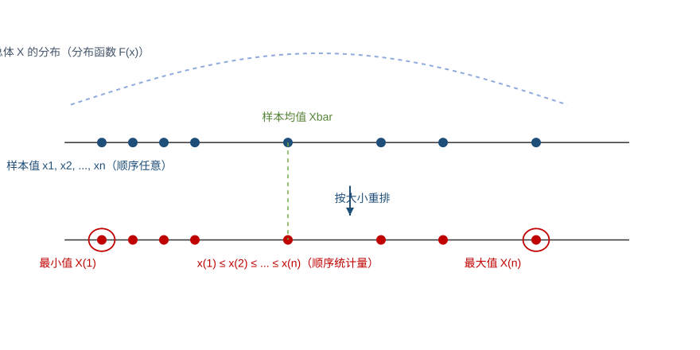

<h2 align="center">第八章　数理统计的基本概念</h2>

> 来源：《概率统计学习项目》讲义 · 知识模块 100（常用统计量）／101（统计量的分布）／102（正态总体的抽样分布）
> 题型：3 类 —— 统计量的数字特征 / 顺序统计量的分布 / 三大分布的典型模式与正态总体抽样分布的构造

> **高频考点提醒**：
> - 简单随机样本（独立同分布）、统计量的定义（**不含未知参数**）
> - 常用统计量：样本均值 $\bar X$、样本方差 $S^2$（**分母 $n-1$**）、样本标准差、样本 $k$ 阶原点矩 $A_k$、$k$ 阶中心矩 $B_k$、顺序统计量
> - 统计量的数字特征：$E(\bar X)=\mu$、$D(\bar X)=\dfrac{\sigma^2}{n}$、$E(S^2)=\sigma^2$
> - 最大 / 最小顺序统计量的**分布函数与概率密度**
> - **三大分布的典型模式**：$\chi^2$＝独立标准正态**平方和**；$t$＝$\dfrac{N(0,1)}{\sqrt{\chi^2(n)/n}}$；$F$＝$\dfrac{\chi^2(m)/m}{\chi^2(n)/n}$
> - **三大分布的性质**：$\chi^2$ 可加、$E=n$、$D=2n$；$t$ 偶函数（$n$ 大近似 $N(0,1)$）；$F$ 取倒数自由度对调
> - **上 $\alpha$ 分位点**：$t_{1-\alpha}(n)=-t_\alpha(n)$，$F_{1-\alpha}(n_1,n_2)=\dfrac{1}{F_\alpha(n_2,n_1)}$
> - **一个正态总体**：$\bar X\sim N(\mu,\sigma^2/n)$；$\dfrac{(n-1)S^2}{\sigma^2}\sim\chi^2(n-1)$；$\dfrac{\bar X-\mu}{S/\sqrt n}\sim t(n-1)$；$\dfrac{1}{\sigma^2}\sum(X_i-\mu)^2\sim\chi^2(n)$
> - **两个正态总体**：均值差的正态化、等方差时的 $t(n_1+n_2-2)$、方差比的 $F(n_1-1,n_2-1)$、一般情形的 $F(n_1,n_2)$

> 本章地位：数理统计的**基础与理论核心**——前一半解决"统计量是什么、有哪些常用统计量"（知识模块 100），后一半解决"统计量服从什么分布"（知识模块 101、102）。统计量的分布主要以**客观题**形式考查，统计量的**数字特征**经常以**解答题**形式考查，是考试的重点与难点；三大分布的**典型模式**是"识别器"，正态总体的**六条定理**是"公式库"，二者必须成对记住。

------

### （一）考情分析

本章含**三个知识模块**，各模块考查题型与历年频率如下（按讲义表格誊录，空栏表示该年未考查，有数字的栏为该题分值）。

**知识模块 100 · 常用统计量**（考查题型：常用统计量）

| <nobr>年份\卷种</nobr> | 15 | 16 | 17 | 18 | 19 | 20 | 21 | 22 | 23 | 24 | 25 |
|:---|:---|:---|:---|:---|:---|:---|:---|:---|:---|:---|:---|
| <nobr>数一</nobr> | | 4 | | | | | | | | | 5 |
| <nobr>数三</nobr> | | | | | | | | | | | |

**知识模块 101 · 统计量的分布**（考查题型：统计量的分布）

| <nobr>年份\卷种</nobr> | 15 | 16 | 17 | 18 | 19 | 20 | 21 | 22 | 23 | 24 | 25 |
|:---|:---|:---|:---|:---|:---|:---|:---|:---|:---|:---|:---|
| <nobr>数一</nobr> | | | | | | | | | | | |
| <nobr>数三</nobr> | | | | | | | | | | | 5 |

**知识模块 102 · 正态总体的抽样分布**（考查题型：正态总体的抽样分布）

| <nobr>年份\卷种</nobr> | 15 | 16 | 17 | 18 | 19 | 20 | 21 | 22 | 23 | 24 | 25 |
|:---|:---|:---|:---|:---|:---|:---|:---|:---|:---|:---|:---|
| <nobr>数一</nobr> | | 4 | | | | | | | 5 | | |
| <nobr>数三</nobr> | | 4 | 4 | | | | | | 5 | | |

**考点提示**：

1. 理解**总体、简单随机样本、统计量、样本均值、样本方差及样本矩**的概念；
2. **常用统计量的数字特征**求解，并与**统计量的分布**结合起来出题；
3. **三大分布的典型模式和性质**的考察；
4. 正态总体的**样本均值、样本方差、样本矩的抽样分布**及其**数字特征**求解。

### （二）总体和样本

#### 1. 总体

在数理统计中所研究对象的某项数量指标 $X$ 取值的**全体**称为**总体**，$X$ 是一个随机变量。

总体 $X$ 中的每一个元素称为**个体**，每个个体是一个实数。$X$ 的分布函数与数字特征分别称为总体的**分布函数**和**数字特征**。

> **理解**：总体就是"随机变量 $X$ 的全体取值"，因此研究总体就是研究一个随机变量 $X$；个体是它的一个具体取值。

#### 2. 简单随机样本

**(1) 样本的定义**

设总体 $X$ 的分布函数为 $F(x)$，如果随机变量 $X_1,X_2,\dots,X_n$ **相互独立**，并且**都服从分布函数 $F(x)$**，则称 $X_1,X_2,\dots,X_n$ 为来自总体 $X$ 的**简单随机样本**，简称为**样本**，$n$ 称为**样本容量**。它们的观测值 $x_1,x_2,\dots,x_n$ 称为**样本观测值**（简称为**样本值**），也称为总体 $X$ 的 $n$ 个**独立观测值**。

**(2) 样本的分布**

如果总体 $X$ 的分布函数为 $F(x)$，$X_1,X_2,\dots,X_n$ 是来自总体 $X$ 的样本，则随机变量 $X_1,X_2,\dots,X_n$ 的**联合分布函数**为

$$
F(x_1,x_2,\dots,x_n)=\prod_{i=1}^{n}F(x_i),\qquad x_i\in R\ (i=1,2,\dots,n).
$$

如果总体 $X$ 的概率密度为 $f(x)$，则 $X_1,X_2,\dots,X_n$ 的**联合概率密度**为

$$
f(x_1,x_2,\dots,x_n)=\prod_{i=1}^{n}f(x_i),\qquad x_i\in R\ (i=1,2,\dots,n).
$$

> **关键字眼**：**"相互独立" + "同分布"** 是简单随机样本的两条腿，缺一不可（即 i.i.d.）。由独立同分布立得
> $$E(X_i)=E(X),\qquad D(X_i)=D(X)\quad(i=1,2,\dots,n).$$
>
> **易错点**：联合分布是**各边缘分布的乘积**这一形式，完全来自"独立"二字；不独立时不能这样写。
>
> **易错点**：$F(x_1,x_2,\dots,x_n)=\prod F(x_i)$ 中的下标 $i$ 是**样本序号**（第 $i$ 个样本），不是 $X$ 的取值，$x_i\in R$ 对所有 $i$ 都成立。


------


### （三）统计量

#### 1. 统计量的定义

设 $X_1,X_2,\dots,X_n$ 是来自总体 $X$ 的样本，$g(t_1,t_2,\dots,t_n)$ 是一个**不含未知参数**的 $n$ 元函数，则称随机变量 $X_1,X_2,\dots,X_n$ 的函数

$$
T=g(X_1,X_2,\dots,X_n)
$$

为一个**统计量**。设 $x_1,x_2,\dots,x_n$ 是相应于样本 $X_1,X_2,\dots,X_n$ 的样本值，则称数值 $g(x_1,x_2,\dots,x_n)$ 为统计量 $g(X_1,X_2,\dots,X_n)$ 的**观测值**。

> **关键字眼**：**"不含未知参数"是判断统计量的唯一标准**。例如当 $\mu$ 未知时，$\displaystyle\sum_{i=1}^{n}(X_i-\mu)^2$ 含未知参数 $\mu$，**不是**统计量；而 $\displaystyle\sum_{i=1}^{n}(X_i-\bar X)^2$ 就是统计量。
>
> **易错点**：统计量是**样本的函数**，随抽样而随机变化，所以统计量本身是**随机变量**，需要考虑它的**分布（抽样分布）**与**数字特征**。统计量的分布称为**抽样分布**。


------


### （四）常用统计量

设 $X_1,X_2,\dots,X_n$ 是来自总体 $X$ 的样本，$x_1,x_2,\dots,x_n$ 是相应的样本值。

#### 1. 样本均值

$$
\bar X=\frac{1}{n}\sum_{i=1}^{n}X_i,\qquad \bar x=\frac{1}{n}\sum_{i=1}^{n}x_i\ (\text{观测值}).
$$

#### 2. 样本方差

$$
S^2=\frac{1}{n-1}\sum_{i=1}^{n}(X_i-\bar X)^2
=\frac{1}{n-1}\left(\sum_{i=1}^{n}X_i^2-n\bar X^2\right).
$$

观测值为

$$
s^2=\frac{1}{n-1}\sum_{i=1}^{n}(x_i-\bar x)^2
=\frac{1}{n-1}\left(\sum_{i=1}^{n}x_i^2-n\bar x^2\right).
$$

#### 3. 样本标准差

$$
S=\sqrt{\frac{1}{n-1}\sum_{i=1}^{n}(X_i-\bar X)^2},
$$

观测值为

$$
s=\sqrt{\frac{1}{n-1}\sum_{i=1}^{n}(x_i-\bar x)^2}.
$$

> **易错点**：样本方差的分母是 $n-1$ **不是** $n$——这样才有 $E(S^2)=\sigma^2$（即 $S^2$ 是 $\sigma^2$ 的无偏估计）。
>
> **计算技巧**：$S^2$ 的第二个等号（"平方和减 $n$ 倍均值平方"）是**手算与化简的主力公式**，由
> $$\sum_{i=1}^{n}(X_i-\bar X)^2=\sum_{i=1}^{n}X_i^2-2\bar X\sum_{i=1}^{n}X_i+n\bar X^2=\sum_{i=1}^{n}X_i^2-n\bar X^2$$
> 得到（用了 $\sum X_i=n\bar X$）。

**样本均值与样本方差的数字特征**：如果总体 $X$ 具有数学期望 $E(X)=\mu$ 和方差 $D(X)=\sigma^2$，则

$$
E(\bar X)=E(X)=\mu,\qquad D(\bar X)=\frac{D(X)}{n}=\frac{\sigma^2}{n},\qquad E(S^2)=D(X)=\sigma^2.
$$

> **关键字眼**：这三条是**统计量数字特征**类解答题的起手式，务必背熟：均值**期望不变、方差除以 $n$**；样本方差**期望等于总体方差**。
>
> **易错点**：三条结论**不要求总体正态**（只需期望方差存在）；而 $D(S^2)=\dfrac{2\sigma^4}{n-1}$ 才需要正态总体（见知识模块 102）。
>
> **易错点**：$D(\bar X)=\dfrac{\sigma^2}{n}$ 中的 $n$ 是**样本容量**，与 $D(X_i)=\sigma^2$ 相比缩小了 $n$ 倍——这正是"多测几次更准"的数学依据。

#### 4. 样本 $k$ 阶原点矩

$$
A_k=\frac{1}{n}\sum_{i=1}^{n}X_i^k,\qquad k=1,2,\dots
$$

原点矩的观测值为

$$
a_k=\frac{1}{n}\sum_{i=1}^{n}x_i^k.
$$

特别地 $A_1=\bar X$。

#### 5. 样本 $k$ 阶中心矩

$$
B_k=\frac{1}{n}\sum_{i=1}^{n}(X_i-\bar X)^k,\qquad k=1,2,\dots
$$

中心矩的观测值为

$$
b_k=\frac{1}{n}\sum_{i=1}^{n}(x_i-\bar x)^k,\qquad k=1,2,\dots
$$

> **易错点**：中心矩 $B_k$ 的分母是 $n$，与样本方差 $S^2$ 的分母 $n-1$ **不同**，二者关系为
> $$B_2=\frac{1}{n}\sum_{i=1}^{n}(X_i-\bar X)^2=\frac{n-1}{n}S^2 .$$

#### 6. 顺序统计量

**最大顺序统计量**：

$$
X_{(n)}=\max(X_1,X_2,\dots,X_n).
$$

**最小顺序统计量**：

$$
X_{(1)}=\min(X_1,X_2,\dots,X_n).
$$

一般地，将样本值按大小排列 $x_{(1)}\le x_{(2)}\le\cdots\le x_{(n)}$，取 $X_{(k)}$ 为第 $k$ 小的样本值，则 $X_{(k)}$ 称为**第 $k$ 阶顺序统计量**。



> 图：样本 $x_1,x_2,\dots,x_n$ 是自总体 $X$（上方虚线为分布函数 $F(x)$ 的轮廓）独立抽取的、顺序任意的样本值；按大小重排后得到 $x_{(1)}\le x_{(2)}\le\cdots\le x_{(n)}$，其中最左端为最小值 $X_{(1)}$、最右端为最大值 $X_{(n)}$，绿色虚线为样本均值 $\bar X$。顺序统计量与 $\bar X$、$S^2$ 一样，都只由样本决定、不含未知参数，因此都是统计量。

> **易错点**：顺序统计量也是**统计量**（$X_{(n)}$、$X_{(1)}$ 只由样本决定、不含未知参数）；它的分布正是下面"顺序统计量的分布"要解决的问题。


------


### （五）顺序统计量的分布

设总体 $X$ 的分布函数为 $F(x)$，$X_1,X_2,\dots,X_n$ 是来自总体 $X$ 的样本。

#### 1. 最大顺序统计量

$X_{(n)}=\max(X_1,X_2,\dots,X_n)$ 的分布函数为

$$
F_{\max}(x)=\bigl[F(x)\bigr]^{n}.
$$

若 $X$ 为连续型随机变量，则其概率密度为

$$
f_{\max}(x)=n\bigl[F(x)\bigr]^{n-1}f(x).
$$

**推导思路**：

$$
\{X_{(n)}\le x\}\iff\{X_1\le x,\ X_2\le x,\ \dots,\ X_n\le x\}
$$

由独立性得 $F_{\max}(x)=P\{X_1\le x\}P\{X_2\le x\}\cdots P\{X_n\le x\}=[F(x)]^n$；再对 $x$ 求导即得密度。

#### 2. 最小顺序统计量

$X_{(1)}=\min(X_1,X_2,\dots,X_n)$ 的分布函数为

$$
F_{\min}(x)=1-\bigl[1-F(x)\bigr]^{n}.
$$

若 $X$ 为连续型随机变量，则其概率密度为

$$
f_{\min}(x)=n\bigl[1-F(x)\bigr]^{n-1}f(x).
$$

**推导思路**：改用对立事件

$$
\{X_{(1)}>x\}=\{X_1>x,\ X_2>x,\ \dots,\ X_n>x\}
$$

由独立性得 $P\{X_{(1)}>x\}=[1-F(x)]^n$，故 $F_{\min}(x)=1-P\{X_{(1)}>x\}=1-[1-F(x)]^n$；求导即得密度。

> **关键字眼**：**最大值用"≤"直接取交（$F^n$）；最小值用"＞"取交、再取对立（$1-(1-F)^n$）**。记住这一"一个直接、一个倒扣"的对照，就不易写错。
>
> **易错点**：$F_{\min}$ 中的**幂次在 $1-F(x)$ 上**，不是 $[F(x)]^n$；写成 $1-[F(x)]^n$ 就错了。
>
> **易错点**：密度公式中的因子是 $n$（幂次求导后的 $n$ 倍），且必须乘上**原来总体的密度 $f(x)$**。
>
> **推广（第 $k$ 阶）**：连续型总体下
> $$f_{X_{(k)}}(x)=\frac{n!}{(k-1)!\,(n-k)!}\bigl[F(x)\bigr]^{k-1}\bigl[1-F(x)\bigr]^{n-k}f(x).$$


------


### （六）$\chi^2$ 分布

> 以下三个大节（（六）～（十））对应讲义**知识模块 101**，解决：统计量服从什么分布的识别问题。

#### 1. $\chi^2$ 分布的典型模式

设随机变量 $X_1,X_2,\dots,X_n$ **相互独立**，都服从**标准正态分布** $N(0,1)$，则随机变量

$$
\chi^2=X_1^2+X_2^2+\cdots+X_n^2
$$

的概率密度为

$$
f(x)=\begin{cases}
\dfrac{1}{2^{\frac{n}{2}}\Gamma\!\left(\dfrac{n}{2}\right)}x^{\frac{n}{2}-1}e^{-\frac{x}{2}}, & x>0,\\[10pt]
0, & x\le 0,
\end{cases}
$$

称随机变量 $\chi^2$ 服从自由度为 $n$ 的 $\chi^2$ 分布，记作 $\chi^2\sim\chi^2(n)$。

#### 2. 深度理解

**(1) 自由度 $n$ 表示 $X_i^2$ 的个数**；

**(2) 特别地**，$X_i\sim N(0,1)$，则 $X_i^2\sim\chi^2(1)$。

**(3) $\chi^2$ 的概率密度 $f(x)$ 的图像**：右偏（不对称）分布，随 $n$ 增大逐渐趋于对称。

#### 3. $\chi^2$ 分布的性质

**(1) 可加性**：设 $\chi_1^2\sim\chi^2(n_1)$、$\chi_2^2\sim\chi^2(n_2)$，并且 $\chi_1^2$ 和 $\chi_2^2$ **相互独立**，则

$$
\chi_1^2+\chi_2^2\sim\chi^2(n_1+n_2).
$$

**(2) 数字特征**：如果 $\chi^2\sim\chi^2(n)$，则有

$$
E(\chi^2)=n,\qquad D(\chi^2)=2n,
$$

其中 $n$ 表示 $\chi^2$ 的自由度。

#### 4. 上 $\alpha$ 分位点 $\chi_\alpha^2(n)$

设 $\chi^2\sim\chi^2(n)$，对于给定的 $\alpha\ (0<\alpha<1)$，称满足条件

$$
P\{\chi^2>\chi_\alpha^2(n)\}=\alpha
$$

的点 $\chi_\alpha^2(n)$ 为 $\chi^2(n)$ 分布的**上 $\alpha$ 分位点**。

> **深度理解**：上 $\alpha$ 分位点的几何意义——图中 $\chi_\alpha^2(n)$ **右侧的阴影部分的面积**（即右侧尾部概率 $\alpha$）。

> **易错点**：$\chi^2$ 分布**没有对称性**，故 $\chi_{1-\alpha}^2(n)$ **不能**写成 $-\chi_\alpha^2(n)$，只能查表。


------


### （七）$t$ 分布

#### 1. $t$ 分布的典型模式

设随机变量 $X$ 和 $Y$ **相互独立**，且

$$
X\sim N(0,1),\qquad Y\sim\chi^2(n),
$$

则随机变量

$$
T=\frac{X}{\sqrt{\dfrac{Y}{n}}}
$$

的概率密度为

$$
f(x)=\frac{\Gamma\!\left(\dfrac{n+1}{2}\right)}{\sqrt{n\pi}\,\Gamma\!\left(\dfrac{n}{2}\right)}\left(1+\frac{x^2}{n}\right)^{-\frac{n+1}{2}},\qquad x\in R,
$$

称随机变量 $T$ 服从自由度为 $n$ 的 $t$ 分布，记作 $T\sim t(n)$。

> **深度理解**：$t$ 的概率密度 $f(x)$ 的图像——关于 $y$ 轴（$t=0$）**对称**的钟形，比 $N(0,1)$ 更"矮胖"。

#### 2. $t$ 分布的性质

$t(n)$ 分布的概率密度 $f(x)$ 是**偶函数**，且有

$$
\lim_{n\to\infty}f(x)=\frac{1}{\sqrt{2\pi}}e^{-\frac{x^2}{2}},
$$

即当 $n$ 充分大时，$t(n)$ 分布**近似于** $N(0,1)$ 分布。

#### 3. 上 $\alpha$ 分位点 $t_\alpha(n)$

设 $T\sim t(n)$，对于给定的 $\alpha\ (0<\alpha<1)$，满足条件

$$
P\{T>t_\alpha(n)\}=\alpha
$$

的点 $t_\alpha(n)$ 为 $t(n)$ 分布的**上 $\alpha$ 分位点**。

由于 $t(n)$ 分布的概率密度是偶函数，因此

$$
t_{1-\alpha}(n)=-t_\alpha(n).
$$

> **深度理解**：上 $\alpha$ 分位点的几何意义——图中 $t_\alpha(n)$ **右侧的阴影部分的面积**。
>
> **易错点**：$t_{1-\alpha}(n)=-t_\alpha(n)$ 这条只对**对称分布**（$t$、$N(0,1)$）成立，$\chi^2$、$F$ 都不成立。


------


### （八）$F$ 分布

#### 1. $F$ 分布的典型模式

设随机变量 $X$ 和 $Y$ **相互独立**，且 $X\sim\chi^2(n_1)$、$Y\sim\chi^2(n_2)$，则随机变量

$$
F=\frac{\dfrac{X}{n_1}}{\dfrac{Y}{n_2}}
$$

的概率密度为

$$
f(x)=\begin{cases}
\dfrac{\Gamma\!\left(\dfrac{n_1+n_2}{2}\right)}{\Gamma\!\left(\dfrac{n_1}{2}\right)\Gamma\!\left(\dfrac{n_2}{2}\right)}n_1^{\frac{n_1}{2}}n_2^{\frac{n_2}{2}}\dfrac{x^{\frac{n_1}{2}-1}}{(n_2+n_1x)^{\frac{n_1+n_2}{2}}}, & x>0,\\[10pt]
0, & x\le 0,
\end{cases}
$$

称随机变量 $F$ 服从自由度为 $(n_1,n_2)$ 的 $F$ 分布，记作 $F\sim F(n_1,n_2)$，其中 $n_1$ 和 $n_2$ 分别称为**第一自由度**和**第二自由度**。

> **说明（讲义排印之辨）**：讲义原文的系数写作 $\dfrac{\Gamma\!\left(\frac{n_1+n_2}{2}\right)}{\Gamma\!\left(\frac{n_1}{2}\right)\Gamma\!\left(\frac{n_2}{2}\right)}\cdot\dfrac{n_1^{\frac{n_1}{2}}n_2^{\frac{n_2}{2}}}{x^{\frac{n_2}{2}-1}}(n_2+n_1x)^{-\frac{n_1+n_2}{2}}$，其中 $x$ 的幂次疑为**排印串位**。上式为标准形式（等价写法）：
> $$f(x)=\frac{\Gamma\!\left(\frac{n_1+n_2}{2}\right)}{\Gamma\!\left(\frac{n_1}{2}\right)\Gamma\!\left(\frac{n_2}{2}\right)}\left(\frac{n_1}{n_2}\right)^{\frac{n_1}{2}}\frac{x^{\frac{n_1}{2}-1}}{\left(1+\frac{n_1}{n_2}x\right)^{\frac{n_1+n_2}{2}}},\qquad x>0 .$$
> 考研**不会考密度函数的解析式**，只需记住典型模式 $F=\dfrac{X/n_1}{Y/n_2}$、图像右偏、倒数性质与分位点关系即可。

> **深度理解**：$F$ 的概率密度 $f(x)$ 的图像——$x>0$ 上**右偏**的单峰曲线。

#### 2. $F$ 分布的性质

如果 $F\sim F(n_1,n_2)$，则

$$
\frac{1}{F}\sim F(n_2,n_1).
$$

**证明**：$F\sim F(n_1,n_2)$，则

$$
F=\frac{\dfrac{X}{n_1}}{\dfrac{Y}{n_2}},
$$

其中 $X$ 和 $Y$ 相互独立，且 $X\sim\chi^2(n_1)$、$Y\sim\chi^2(n_2)$。于是

$$
\frac{1}{F}=\frac{\dfrac{Y}{n_2}}{\dfrac{X}{n_1}},
$$

故由 $F$ 分布的条件知

$$
\frac{1}{F}\sim F(n_2,n_1).
$$

#### 3. 上 $\alpha$ 分位点 $F_\alpha(n_1,n_2)$

对于给定的 $\alpha\ (0<\alpha<1)$，称满足条件

$$
P\{F>F_\alpha(n_1,n_2)\}=\alpha
$$

的点 $F_\alpha(n_1,n_2)$ 为 $F(n_1,n_2)$ 分布的**上 $\alpha$ 分位点**，且有

$$
F_{1-\alpha}(n_1,n_2)=\frac{1}{F_\alpha(n_2,n_1)}.
$$

> **深度理解**：上 $\alpha$ 分位点的几何意义——图中 $F_\alpha(n_1,n_2)$ 右侧的阴影部分的面积。
>
> **易错点**：这条公式**两个自由度同时对调**（$n_1,n_2$ 互换），且是**取倒数**关系——考场上常用来把表中没有的**左尾**分位点换算成右尾。


------


### （九）与三大分布有关的常见典型模式

#### 1. $t$ 分布与 $F$ 分布的关系

$$
X\sim F(1,n),\qquad \frac{1}{X}\sim F(n,1).
$$

**【解析】** 由题意知 $X\sim t(n)$，即

$$
X=\frac{X_1}{\sqrt{\dfrac{X_2}{n}}},
$$

其中

$$
X_1\sim N(0,1),\qquad X_2\sim\chi^2(n),
$$

且 $X_1$、$X_2$ **相互独立**。故

$$
X^2=\frac{X_1^2}{\dfrac{X_2}{n}}=\frac{\dfrac{X_1^2}{1}}{\dfrac{X_2}{n}},
$$

其中 $X_1^2\sim\chi^2(1)$、$X_2\sim\chi^2(n)$，又因为 $X_1$、$X_2$ 相互独立，则其对应的函数 $X_1^2$ 也与 $X_2$ 相互独立，显然符合 $F$ 分布的条件，故

$$
X^2\sim F(1,n).
$$

由 $F$ 分布的性质可知，此时

$$
\frac{1}{X^2}\sim F(n,1).
$$

> **关键字眼**：**"$t$ 平方得 $F(1,n)$"是最高频的一条转化**——凡见到 $t$ 统计量要判断分布、或题中给出 $F$ 型分式而分子只有一项平方，都应立刻想到它。

#### 2. 统计量的数字特征（$\chi^2$ 分布的活用）

设 $\chi^2=\dfrac{(n-1)S^2}{\sigma^2}=\dfrac{1}{\sigma^2}\sum_{i=1}^{n}(X_i-\bar X)^2\sim\chi^2(n-1)$，则由 $\chi^2$ 分布的数字特征知

$$
E(\chi^2)=E\!\left[\frac{(n-1)S^2}{\sigma^2}\right]=\frac{n-1}{\sigma^2}E(S^2)=n-1,
$$

即

$$
E(S^2)=\sigma^2;
$$

$$
D(\chi^2)=D\!\left[\frac{(n-1)S^2}{\sigma^2}\right]=\frac{(n-1)^2}{\sigma^4}D(S^2)=2(n-1),
$$

即

$$
D(S^2)=\frac{2\sigma^4}{n-1}.
$$

**(2)** 设

$$
E\!\left[\frac{1}{\sigma^2}\sum_{i=1}^{n}(X_i-\mu)^2\right]=\frac{1}{\sigma^2}E\!\left[\sum_{i=1}^{n}(X_i-\mu)^2\right]=\frac{n}{\sigma^2}E(X_i-\mu)^2=n,
$$

即

$$
E(X_i-\mu)^2=\sigma^2;
$$

$$
D\!\left[\frac{1}{\sigma^2}\sum_{i=1}^{n}(X_i-\mu)^2\right]=\frac{1}{\sigma^4}D\!\left[\sum_{i=1}^{n}(X_i-\mu)^2\right]=\frac{n}{\sigma^4}D(X_i-\mu)^2=2n,
$$

即

$$
D(X_i-\mu)^2=2\sigma^4 .
$$

> **方法**：这两组推导是"**由 $\chi^2$ 分布的数字特征反推统计量数字特征**"的标准动作——把已知服从 $\chi^2$ 的统计量除上系数，再套 $E=n$、$D=2n$ 解出目标。$E(S^2)=\sigma^2$、$D(S^2)=\dfrac{2\sigma^4}{n-1}$ 就是这样做出来的。
>
> **易错点**：$E(X_i-\mu)^2=D(X_i)=\sigma^2$（因为 $E(X_i-\mu)=0$）；对 $D(X_i-\mu)^2$ 要用 $\chi^2(1)$ 的方差 $2$，注意别把 $\sum$ 内外的系数弄错。


------


### （十）典型例题：判断统计量的分布

**【例 1】** 设 $X_1,X_2,\dots,X_n\ (n\ge 2)$ 是来自正态总体 $N(0,1)$ 的一个样本，$\bar X$ 是样本均值，$S^2$ 是样本方差，则（　）

A. $n\bar X\sim N(0,1)$
B. $nS^2\sim\chi^2(n)$
C. $\dfrac{(n-1)\bar X}{S}\sim t(n-1)$
D. $\dfrac{(n-1)X_1^2}{\sum\limits_{i=2}^{n}X_i^2}\sim F(1,n-1)$

**【解析】** 因为 $X_1,X_2,\dots,X_n\ (n\ge 2)$ 是来自正态总体 $N(0,1)$ 的一个样本，$\bar X$ 是样本均值，$S^2$ 是样本方差，则

**对于选项 A**，$\bar X\sim N(0,1/n)$，即 $\dfrac{\bar X}{\dfrac{1}{\sqrt n}}=\sqrt{n}\,\bar X\sim N(0,1)$；**A 错**。

**对于选项 B**，应该是

$$
(n-1)S^2\sim\chi^2(n-1);
$$

**B 错**。

**对于选项 C**，应该是

$$
\frac{\sqrt{n}\,\bar X}{S}\sim t(n-1);
$$

**C 错**。

**对于选项 D**，$X_1^2\sim\chi^2(1)$，$\sum\limits_{i=2}^{n}X_i^2\sim\chi^2(n-1)$，且 $X_1,X_2,\dots,X_n\ (n\ge 2)$ **相互独立**，故 $X_1^2$ 与 $X_i^2\ (i\ge 2)$ 也相互独立，则由 $F$ 分布的定义知

$$
\frac{\dfrac{X_1^2}{1}}{\dfrac{\sum\limits_{i=2}^{n}X_i^2}{n-1}}\sim F(1,n-1).
$$

即

$$
\frac{(n-1)X_1^2}{\sum\limits_{i=2}^{n}X_i^2}\sim F(1,n-1).
$$

**故选 D。**

> **方法**：**逐项"修复"是客观题最快的解法**——把每个选项改成正确形式，改不动的那个就是答案。本题 A 漏了乘 $\sqrt n$、B 分母该是 $n-1$、C 分子该是 $\sqrt n\,\bar X$。
>
> **关键字眼**：$X_1^2$ 与 $\sum_{i\ge 2}X_i^2$ **相互独立**是 D 成立的关键（来自样本的独立性），而两者之比正好凑成 $F$ 的典型模式。
>
> **易错点**：$B$ 项 $nS^2\sim\chi^2(n)$ 是最常见的干扰——$\chi^2$ 的自由度必须是 **$n-1$**，因为 $S^2$ 里用了 $\bar X$ 这个约束。

**【例 2】** 设总体 $X$ 服从正态分布 $N(0,4)$，$X_1,\dots,X_{17}$ 是来自总体 $X$ 的一个样本，求非零常数 $a$，使得统计量

$$
T=a\cdot\frac{(X_1+X_2+X_3+X_4)^2+(X_5+X_6+X_7+X_8)^2}{(X_9+X_{10}+X_{11})^2+(X_{12}+X_{13}+X_{14})^2+(X_{15}+X_{16}+X_{17})^2}
$$

服从 $F$ 分布，并写出 $F$ 分布的第一自由度和第二自由度。

**【解析】** 因为 $X_i\sim N(0,4)$，$i=1,\dots,17$，则

$$
X_1+X_2+X_3+X_4\sim N(0,16),\qquad \text{则}\ \ \frac{X_1+X_2+X_3+X_4}{4}\sim N(0,1),
$$

$$
X_5+X_6+X_7+X_8\sim N(0,16),\qquad \text{则}\ \ \frac{X_5+X_6+X_7+X_8}{4}\sim N(0,1).
$$

由 $\chi^2$ 分布的定义知，

$$
\frac{(X_1+X_2+X_3+X_4)^2+(X_5+X_6+X_7+X_8)^2}{16}\sim\chi^2(2).
$$

又

$$
X_9+X_{10}+X_{11}\sim N(0,12),\qquad \text{则}\ \ \frac{X_9+X_{10}+X_{11}}{2\sqrt{3}}\sim N(0,1),
$$

$$
X_{12}+X_{13}+X_{14}\sim N(0,12),\qquad \text{则}\ \ \frac{X_{12}+X_{13}+X_{14}}{2\sqrt{3}}\sim N(0,1),
$$

$$
X_{15}+X_{16}+X_{17}\sim N(0,12),\qquad \text{则}\ \ \frac{X_{15}+X_{16}+X_{17}}{2\sqrt{3}}\sim N(0,1).
$$

则

$$
\frac{X_{15}+X_{16}+X_{17}}{2\sqrt{3}}\sim N(0,1).
$$

由 $\chi^2$ 分布的定义知

$$
\frac{(X_9+X_{10}+X_{11})^2+(X_{12}+X_{13}+X_{14})^2+(X_{15}+X_{16}+X_{17})^2}{12}\sim\chi^2(3).
$$

$X_1,\dots,X_{17}$ 相互独立，则

$$
\frac{(X_1+X_2+X_3+X_4)^2+(X_5+X_6+X_7+X_8)^2}{16}
$$

**和**

$$
\frac{(X_9+X_{10}+X_{11})^2+(X_{12}+X_{13}+X_{14})^2+(X_{15}+X_{16}+X_{17})^2}{12}
$$

**相互独立**，再由 $F$ 分布的定义知

$$
\frac{\dfrac{1}{2}\cdot\dfrac{(X_1+X_2+X_3+X_4)^2+(X_5+X_6+X_7+X_8)^2}{16}}{\dfrac{1}{3}\cdot\dfrac{(X_9+X_{10}+X_{11})^2+(X_{12}+X_{13}+X_{14})^2+(X_{15}+X_{16}+X_{17})^2}{12}}\sim F(2,3),
$$

即

$$
a=\frac{9}{8},
$$

$F$ 分布的第一自由度和第二自由度分别为 **2 和 3**。

> **方法**："**分组求和 → 标准化 → 平方和凑 $\chi^2$ → 相除凑 $F$**"四步。关键是先算出每组和的方差（$n$ 个独立 $N(0,\sigma^2)$ 之和的方差为 $n\sigma^2$），再除以标准差平方后配平方和。
>
> **易错点**：$a$ 不是 $1$ —— 分子除 $2$ 得 $\chi^2(2)$、分母除 $3$ 得 $\chi^2(3)$，两边还带着分母 $16$ 与 $12$，通分后 $a=\dfrac{3\times 16}{2\times 12}\cdot\dfrac{12}{16}$ 类式的系数整理，最终 $a=\dfrac{9}{8}$；**必须把"除以自由度"与"标准化时的系数"两套数字分开算**，否则极易丢因子。


------


### （十一）一个正态总体的常见统计量的分布

> 以下三个大节（（十一）～（十三））对应讲义**知识模块 102**，给出正态总体下常用统计量的精确分布。

设总体 $X$ 服从正态分布 $N(\mu,\sigma^2)$，$X_1,X_2,\dots,X_n$ 是来自总体 $X$ 的样本，样本均值为 $\bar X$，样本方差为 $S^2$，则有

#### 1. 样本均值的分布

$$
\bar X\sim N(\mu,\sigma^2/n),\qquad u=\frac{\bar X-\mu}{\sigma/\sqrt n}\sim N(0,1).
$$

**证明**：因为 $\bar X=\dfrac{1}{n}\sum\limits_{i=1}^{n}X_i$，且 $X_1,X_2,\dots,X_n$ 独立且服从正态分布，则 $\bar X$ 服从正态分布。

$$
E(\bar X)=E\!\left(\frac{1}{n}\sum_{i=1}^{n}X_i\right)=\frac{1}{n}E\!\left(\sum_{i=1}^{n}X_i\right)=\frac{1}{n}\sum_{i=1}^{n}E(X_i).
$$

$X_i$ 与总体同分布，故

$$
E(X_i)=\mu,\qquad D(X_i)=\sigma^2 .
$$

则

$$
E(\bar X)=\frac{1}{n}\sum_{i=1}^{n}E(X_i)=\frac{1}{n}\cdot n\mu=\mu .
$$

$$
D(\bar X)=D\!\left(\frac{1}{n}\sum_{i=1}^{n}X_i\right)=\frac{1}{n^2}D\!\left(\sum_{i=1}^{n}X_i\right),
$$

因为 $X_1,X_2,\dots,X_n$ 独立，则由方差的性质可知

$$
D(\bar X)=D\!\left(\frac{1}{n}\sum_{i=1}^{n}X_i\right)=\frac{1}{n^2}D\!\left(\sum_{i=1}^{n}X_i\right)=\frac{1}{n^2}\sum_{i=1}^{n}D(X_i)=\frac{1}{n^2}\cdot n\sigma^2=\frac{1}{n}\sigma^2 .
$$

综上，可得 $\bar X\sim N(\mu,\sigma^2/n)$，将其标准化即得

$$
u=\frac{\bar X-\mu}{\sigma/\sqrt n}\sim N(0,1).
$$

#### 2. $\bar X$ 与 $S^2$ 相互独立，且

$$
\chi^2=\frac{(n-1)S^2}{\sigma^2}=\frac{1}{\sigma^2}\sum_{i=1}^{n}(X_i-\bar X)^2\sim\chi^2(n-1).
$$

#### 3. 用 $S$ 替换 $\sigma$ 的 $t$ 统计量
$$
T=\frac{\bar X-\mu}{S/\sqrt n}\sim t(n-1).
$$

**证明**：由前面的结论可知 $\dfrac{\bar X-\mu}{\sigma/\sqrt n}\sim N(0,1)$，$\dfrac{(n-1)S^2}{\sigma^2}\sim\chi^2(n-1)$，又因为 $\bar X$ 与 $S^2$ 相互独立，则 $\dfrac{\bar X-\mu}{\sigma/\sqrt n}$ 与 $\dfrac{(n-1)S^2}{\sigma^2}$ 亦相互独立，由 $t$ 分布的定义知：

$$
\frac{\dfrac{\bar X-\mu}{\sigma/\sqrt n}}{\sqrt{\dfrac{(n-1)S^2}{\sigma^2}\Big/(n-1)}}=\frac{\bar X-\mu}{S/\sqrt n}=T\sim t(n-1).
$$

#### 4. 已知 $\mu$ 时的偏差平方和服从 $\chi^2(n)$
$$
\chi^2=\frac{1}{\sigma^2}\sum_{i=1}^{n}(X_i-\mu)^2\sim\chi^2(n).
$$

**证明**：因为 $X_i\sim N(\mu,\sigma^2)$，则

$$
\frac{X_i-\mu}{\sigma}\sim N(0,1),
$$

又因为 $X_1,X_2,\dots,X_n$ 相互独立，则 $\dfrac{X_i-\mu}{\sigma}$ 相互独立，由 $\chi^2$ 分布的定义知，

$$
\frac{1}{\sigma^2}\sum_{i=1}^{n}(X_i-\mu)^2\sim\chi^2(n).
$$

#### 5. 深度理解：第 2 条为什么成立

**(1)** 因为 $X_i\sim N(\mu,\sigma^2)$，则 $\dfrac{X_i-\mu}{\sigma}\sim N(0,1)$，故

$$
\frac{1}{\sigma^2}\sum_{i=1}^{n}(X_i-\mu)^2\sim\chi^2(n).
$$

**(2)** 由 $\chi^2$ 分布的定义知，$\sum\limits_{i=1}^{n}\dfrac{(X_i-\mu)^2}{\sigma^2}\sim\chi^2(n)$，而

$$
\sum_{i=1}^{n}(X_i-\mu)^2=\sum_{i=1}^{n}\bigl[(X_i-\bar X)+(\bar X-\mu)\bigr]^2
=\sum_{i=1}^{n}(X_i-\bar X)^2+n(\bar X-\mu)^2,
$$

即**总的偏差平方和 = 组内（离差）平方和 + 组间平方和**。把右边两项分别标准化：

$$
\frac{\sum\limits_{i=1}^{n}(X_i-\bar X)^2}{\sigma^2}\sim\chi^2(n-1),\qquad
\frac{n(\bar X-\mu)^2}{\sigma^2}\sim\chi^2(1),
$$

且二者**相互独立**，由 $\chi^2$ 的可加性 $n=(n-1)+1$ 恰好给出 $\chi^2(n)$；同时这也说明 $\bar X$ 与 $S^2$ **相互独立**。

> **关键字眼**：**"$\bar X$ 与 $S^2$ 相互独立"是正态总体特有的性质**，一般总体不成立。
>
> **易错点**：第 4 条用的是**已知 $\mu$** 的版本（自由度 $n$）；第 2 条用的是**估计 $\mu$ 用 $\bar X$** 的版本（自由度 $n-1$）。二者自由度相差 1，就是"是否用 $\bar X$ 顶掉了 $\mu$"的代价。
>
> **易错点**：第 3 条的 $t$ 统计量自由度是 $n-1$（来自分母 $\chi^2$），分母是 $S/\sqrt n$ 而非 $\sigma/\sqrt n$——用 $S$ 换 $\sigma$ 的代价就是分布由 $N(0,1)$ 变成 $t(n-1)$。


------


### （十二）两个正态总体的常见统计量的分布

设总体 $X\sim N(\mu_1,\sigma_1^2)$，$X_1,X_2,\dots,X_{n_1}$ 是来自总体 $X$ 的样本，样本均值为 $\bar X$，样本方差为 $S_1^2$；总体 $Y\sim N(\mu_2,\sigma_2^2)$，$Y_1,Y_2,\dots,Y_{n_2}$ 是来自总体 $Y$ 的样本，样本均值为 $\bar Y$，样本方差为 $S_2^2$；且来自两个总体的样本**相互独立**，则有

#### 1. 均值差的分布

$$
\bar X-\bar Y\sim N\!\left(\mu_1-\mu_2,\ \frac{\sigma_1^2}{n_1}+\frac{\sigma_2^2}{n_2}\right),
$$

$$
u=\frac{\bar X-\bar Y-(\mu_1-\mu_2)}{\sqrt{\dfrac{\sigma_1^2}{n_1}+\dfrac{\sigma_2^2}{n_2}}}\sim N(0,1).
$$

#### 2. 两方差相等（$\sigma_1^2=\sigma_2^2=\sigma^2$）时的 $t$ 分布

$$
T=\frac{\bar X-\bar Y-(\mu_1-\mu_2)}{S_w\sqrt{\dfrac{1}{n_1}+\dfrac{1}{n_2}}}\sim t(n_1+n_2-2),
$$

其中

$$
S_w^2=\frac{(n_1-1)S_1^2+(n_2-1)S_2^2}{n_1+n_2-2},\qquad S_w=\sqrt{S_w^2}.
$$

> **记忆**：$S_w$ 叫**合并样本标准差**（pooled），它是 $S_1^2,S_2^2$ 以自由度为权的加权平均；自由度相加 $n_1+n_2-2$。

#### 3. 两个样本方差比的 $F$ 分布（一般情形）

$$
F=\frac{n_2\sigma_1^2}{n_1\sigma_2^2}\cdot\frac{\sum\limits_{i=1}^{n_1}(X_i-\mu_1)^2}{\sum\limits_{j=1}^{n_2}(Y_j-\mu_2)^2}\sim F(n_1,n_2).
$$

#### 4. 两方差相等时用样本方差的 $F$ 分布

$$
F=\frac{\sigma_2^2}{\sigma_1^2}\cdot\frac{S_1^2}{S_2^2}\sim F(n_1-1,\ n_2-1).
$$

> **关键字眼**：第 3 条是**一般情形**（$\mu_1,\mu_2$ 已知，自由度 $n_1,n_2$）；第 4 条是**两方差相等**时用 $S_1^2,S_2^2$ 构造的版本（自由度为 $n_1-1,n_2-1$），也是区间估计与假设检验里检验方差齐性最常用的形式。
>
> **易错点**：$F$ 的两个自由度**顺序不能颠倒**——分子对应第一自由度 $n_1$（或 $n_1-1$），分母对应第二自由度。
>
> **易错点**：第 1 条均值差的方差是**两项之和**（两个总体独立）；第 2 条的分母含 $S_w\sqrt{1/n_1+1/n_2}$，别漏了 $S_w$ 或把 $\sqrt{}$ 里的两项写成相加后的开方形式。


------


### （十三）典型例题：正态总体抽样分布的构造

**【例 3】（趁热打铁）** 设 $X_1,\dots,X_9$ 是来自正态总体 $X$ 的一个样本，且

$$
Y_1=\frac{1}{6}(X_1+\cdots+X_6),\qquad Y_2=\frac{1}{3}(X_7+X_8+X_9),
$$

$$
S^2=\frac{1}{2}\sum_{i=7}^{9}(X_i-Y_2)^2,\qquad Z=\frac{\sqrt{2}(Y_1-Y_2)}{S},
$$

求 $Z$ 的分布。

**【解析】** 由于 $Y_1$、$Y_2$、$S^2$ 相互独立，那么 $Y_1-Y_2$ 与 $S^2$ 相互独立，

$$
E(Y_1-Y_2)=\mu-\mu=0,\qquad D(Y_1-Y_2)=D(Y_1)+D(Y_2)=\frac{1}{6}\sigma^2+\frac{1}{3}\sigma^2=\frac{1}{2}\sigma^2,
$$

则

$$
Y_1-Y_2\sim N\!\left(0,\ \frac{1}{2}\sigma^2\right),\qquad \text{即}\ \ \frac{Y_1-Y_2}{\dfrac{1}{\sqrt2}\sigma}\sim N(0,1).
$$

由前面的性质可知

$$
\frac{(n-1)S^2}{\sigma^2}\sim\chi^2(n-1),\qquad \text{即}\ \ \frac{2S^2}{\sigma^2}\sim\chi^2(2),
$$

根据 $t$ 分布的定义知，

$$
\frac{\dfrac{Y_1-Y_2}{\dfrac{1}{\sqrt2}\sigma}}{\sqrt{\dfrac{2S^2}{\sigma^2}\Big/2}}\sim t(2),
$$

即

$$
Z=\frac{\sqrt{2}(Y_1-Y_2)}{S}\sim t(2).
$$

> **方法**：本题是 $t$ 分布典型模式的"标准拼装"——**分子**：两均值差用方差相加得 $N(0,\tfrac12\sigma^2)$ 并标准化；**分母**：由 $Y_2$ 是三个观测的均值知 $S^2$ 的自由度是 $3-1=2$，故 $\dfrac{2S^2}{\sigma^2}\sim\chi^2(2)$；两者独立。
>
> **易错点**：$S^2$ 的自由度是 **2**（由 $X_7,X_8,X_9$ 这三个用 $Y_2$ 算了均值），不是 $8$ 也不是 $3$；分子里 $\sigma$ 的系数 $\tfrac{1}{\sqrt2}$ 在整理时要翻到分子上去，最终得 $\sqrt2$。
>
> **易错点**：$Y_1$ 与 $Y_2$ 由**不同**的样本变量构成，所以独立；若两者共用同一个 $X_i$ 就不再独立，不能这样拼。


------


### （十四）典型例题：统计量的数字特征

**【例】**（趁热打铁）已知总体 $X$ 服从参数为 $\lambda$ 的指数分布，$X_1,X_2,\dots,X_{10}$ 是取自总体 $X$ 的简单随机样本，其均值为 $\bar X$，方差为 $S^2$。设 $\mu=2\bar X-15S^2$，且已知 $E(\mu)=30D(\bar X)$，求 $\lambda$。

**【解析】**

**第一步：根据期望的性质展开**

$$
E(\mu)=E(2\bar X-15S^2)=2E(\bar X)-15E(S^2).
$$

**第二步：由统计量的数字特征可知**

$$
E(\bar X)=E(X),\qquad D(\bar X)=\frac{1}{10}D(X),\qquad E(S^2)=D(X).
$$

**第三步：由于总体 $X$ 服从参数为 $\lambda$ 的指数分布，则易知**

$$
E(X)=\frac{1}{\lambda},\qquad D(X)=\frac{1}{\lambda^{2}} .
$$

即

$$
E(\bar X)=E(X)=\frac{1}{\lambda},\qquad
D(\bar X)=\frac{1}{10}D(X)=\frac{1}{10}\cdot\frac{1}{\lambda^{2}},\qquad
E(S^2)=D(X)=\frac{1}{\lambda^{2}} .
$$

**第四步：代入可得**

$$
E(\mu)=2E(\bar X)-15E(S^2)=2\cdot\frac{1}{\lambda}-15\cdot\frac{1}{\lambda^{2}}=30D(\bar X)=30\cdot\frac{1}{10}\cdot\frac{1}{\lambda^{2}},
$$

即

$$
\frac{2}{\lambda}-\frac{15}{\lambda^{2}}=3\cdot\frac{1}{\lambda^{2}} .
$$

**第五步：解得**

$$
2\lambda-15=3\ \Longrightarrow\ 2\lambda=18\ \Longrightarrow\ \boxed{\lambda=9}.
$$

> **方法**：这类题的固定套路是**"先展开期望 → 再套统计量数字特征 → 最后代总体分布的数字特征"**三步，全程不涉及具体的分布形式，只用到 $E(X)$、$D(X)$。
>
> **易错点**：样本方差用 $E(S^2)=D(X)=\sigma^2$（无偏性），**不要**误用 $E(S^2)=\dfrac{n-1}{n}\sigma^2$——后者是中心矩 $B_2$ 的期望。
>
> **易错点**：参数为 $\lambda$ 的指数分布是 $f(x)=\lambda e^{-\lambda x}\ (x>0)$，故 $E(X)=\dfrac{1}{\lambda}$、$D(X)=\dfrac{1}{\lambda^{2}}$；若把 $E(X)$ 记成 $\lambda$，全题皆错。


------


### （十五）本章总结

**知识结构图**：

```text
《数理统计的基本概念》（知识模块 100 / 101 / 102）
├─ 基础概念：总体与个体、简单随机样本（iid）、统计量（不含未知参数）
├─ 常用统计量：X̄、S²（分母 n-1）、S、A_k、B_k、顺序统计量
├─ 统计量的数字特征：E(X̄)=μ；D(X̄)=σ²/n；E(S²)=σ²
├─ 顺序统计量的分布
│   ├─ 最大：F_max=[F(x)]ⁿ，f_max=n Fⁿ⁻¹ f
│   └─ 最小：F_min=1-[1-F(x)]ⁿ，f_min=n(1-F)ⁿ⁻¹ f
├─ 三大分布（知识模块101）
│   ├─ χ²(n)：独立 N(0,1) 平方和；可加；E=n、D=2n；无对称性
│   ├─ t(n)=N(0,1)/√(χ²(n)/n)；偶函数；n 大 → N(0,1)
│   ├─ F(n₁,n₂)=(χ²(n₁)/n₁)/(χ²(n₂)/n₂)；1/F ~ F(n₂,n₁)
│   ├─ 上 α 分位点：t_{1-α}=-t_α；F_{1-α}(n₁,n₂)=1/F_α(n₂,n₁)
│   └─ t²(n) ~ F(1,n)；1/X² ~ F(n,1)
└─ 正态总体的抽样分布（知识模块102）
    ├─ 一个总体：X̄ ~ N(μ,σ²/n)；(n-1)S²/σ² ~ χ²(n-1)
    │   ├─ (X̄-μ)/(S/√n) ~ t(n-1)；Σ(Xi-μ)²/σ² ~ χ²(n)
    │   └─ 深度：X̄ 与 S² 独立；平方和分解 n=(n-1)+1
    └─ 两个总体：均值差正态化；等方差 t(n₁+n₂-2)（含 S_w）
        └─ 方差比：一般 F(n₁,n₂)；等方差 S₁²/S₂² 型 F(n₁-1,n₂-1)
```

**高频考点速记**：

| 考点 | 一句话记忆 |
|:---|:---|
| 总体 | 总体 = 随机变量 $X$ 的全体取值，个体 = 其中一个实数 |
| 简单随机样本 | 独立 + 同分布（iid），联合分布 = 各边缘之积 |
| 统计量 | 样本的函数且**不含未知参数**；统计量是随机变量 |
| 样本均值 | $\bar X=\frac{1}{n}\sum X_i$；$E(\bar X)=\mu$，$D(\bar X)=\frac{\sigma^2}{n}$ |
| 样本方差 | $S^2=\frac{1}{n-1}\sum(X_i-\bar X)^2=\frac{1}{n-1}\left(\sum X_i^2-n\bar X^2\right)$ |
| 分母之辨 | $S^2$ 用 $n-1$（$E(S^2)=\sigma^2$）；中心矩 $B_k$ 用 $n$，$B_2=\frac{n-1}{n}S^2$ |
| 样本矩 | $A_k=\frac{1}{n}\sum X_i^k$（$A_1=\bar X$）；$B_k=\frac{1}{n}\sum(X_i-\bar X)^k$ |
| 顺序统计量 | $X_{(1)}=\min$，$X_{(n)}=\max$，也都是统计量 |
| 最大分布 | $F_{\max}(x)=[F(x)]^n$，$f_{\max}(x)=n[F(x)]^{n-1}f(x)$ |
| 最小分布 | $F_{\min}(x)=1-[1-F(x)]^n$，$f_{\min}(x)=n[1-F(x)]^{n-1}f(x)$ |
| $\chi^2$ 典型模式 | 独立标准正态的**平方和**，自由度＝平方项个数 |
| $\chi^2$ 数字特征 | $E=n$，$D=2n$；独立时可加 $\chi^2(n_1)+\chi^2(n_2)\sim\chi^2(n_1+n_2)$ |
| $t$ 典型模式 | 分子 $N(0,1)$，分母独立的 $\sqrt{\chi^2(n)/n}$ |
| $t$ 的对称性 | 密度是偶函数，$t_{1-\alpha}(n)=-t_\alpha(n)$；$n\to\infty$ 近似 $N(0,1)$ |
| $F$ 典型模式 | 两个独立 $\chi^2$ **各除自身自由度**再相除 |
| $F$ 的倒数 | $F\sim F(n_1,n_2)\Rightarrow 1/F\sim F(n_2,n_1)$ |
| $F$ 分位点 | $F_{1-\alpha}(n_1,n_2)=\dfrac{1}{F_\alpha(n_2,n_1)}$（自由度对调） |
| $t$ 与 $F$ | $X\sim t(n)\Rightarrow X^2\sim F(1,n)$，$\dfrac{1}{X^2}\sim F(n,1)$ |
| 上 $\alpha$ 分位点 | 定义为 $P\{X>x_\alpha\}=\alpha$，即**右尾面积** |
| 样本均值分布 | $\bar X\sim N(\mu,\sigma^2/n)$，$u=\dfrac{\bar X-\mu}{\sigma/\sqrt n}\sim N(0,1)$ |
| 样本方差分布 | $\dfrac{(n-1)S^2}{\sigma^2}\sim\chi^2(n-1)$ |
| 单总体 $t$ | $\dfrac{\bar X-\mu}{S/\sqrt n}\sim t(n-1)$（用 $S$ 换 $\sigma$） |
| 已知 $\mu$ 的平方和 | $\dfrac{1}{\sigma^2}\sum(X_i-\mu)^2\sim\chi^2(n)$ |
| 独立性的来源 | 正态总体下 $\bar X$ 与 $S^2$ **相互独立**（仅正态成立） |
| 平方和分解 | $\sum(X_i-\mu)^2=\sum(X_i-\bar X)^2+n(\bar X-\mu)^2$ |
| 两总体均值差 | 方差**相加**：$\dfrac{\sigma_1^2}{n_1}+\dfrac{\sigma_2^2}{n_2}$ |
| 合并方差 | $S_w^2=\dfrac{(n_1-1)S_1^2+(n_2-1)S_2^2}{n_1+n_2-2}$，$T\sim t(n_1+n_2-2)$ |
| 方差比 $F$ | 等方差用 $\dfrac{S_1^2}{S_2^2}\sim F(n_1-1,n_2-1)$；一般用 $F(n_1,n_2)$ |
| 自由度速记 | 用 $\bar X$ 顶替 $\mu$ → 自由度 $-1$ |
| 判断分布四步 | 分组求和 → 标准化 → 平方和凑 $\chi^2$ → 相除凑 $F$ |
