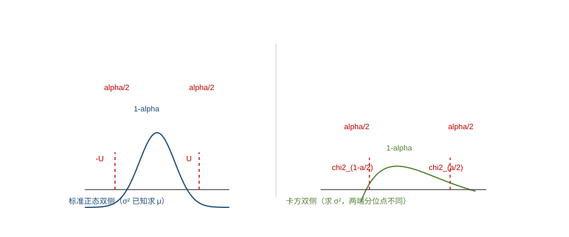

<h2 align="center">第九章　参数估计</h2>

> 来源：《概率统计学习项目》讲义 · 第七章 参数估计 · 知识模块 103（矩估计法）／104（最大似然估计法）／105（估计量的评选标准）／106（区间估计与假设检验）
> 题型：3 类 —— 点估计（矩估计 / 最大似然估计） / 估计量的评选标准 / 区间估计与假设检验

> **高频考点提醒**：
> - 本章地位：**数学一大纲要求点估计、估计量的评选标准和区间估计，数学三只要求点估计**；并且**主要考查点估计**，多以**解答题**形式出现。
> - **矩估计法**：用样本 $k$ 阶原点矩 $A_k$ 代替总体 $k$ 阶原点矩 $\mu_k=E(X^k)$（K.Pearson，1894）
> - **最大似然估计法**：写出似然函数 → 取对数 → 求导令其为 $0$ → 解出参数；**离散型用分布律、连续型用概率密度**
> - **评选标准**：无偏性 $E(\hat\theta)=\theta$ ｜ 有效性（方差小者更有效） ｜ 一致性（相合性）
> - **区间估计**：单个 / 两个正态总体的均值与方差的 $1-\alpha$ **置信区间**（会查 $u$、$t$、$\chi^2$、$F$ 分布表）
> - **假设检验**：**小概率原理**、**两类错误**、显著性水平、拒绝域，以及单个正态总体的 **Z 检验 / t 检验 / $\chi^2$ 检验**

---

### （一）考情分析

本章含**四个知识模块**（103～106），各模块考查题型与历年频率如下（按讲义表格誊录，空栏表示该年未考查，有数字的栏为该题分值）。

**知识模块 103 · 矩估计法**（考查题型：参数的矩估计法）

| <nobr>年份\卷种</nobr> | 15 | 16 | 17 | 18 | 19 | 20 | 21 | 22 | 23 | 24 | 25 | 26 |
|:---|:---|:---|:---|:---|:---|:---|:---|:---|:---|:---|:---|:---|
| <nobr>数一</nobr> | 4 | 2 | | | | | | | | | | |
| <nobr>数三</nobr> | 4 | 2 | | | | | | | | | | |

**知识模块 104 · 最大似然估计法**（考查题型：参数的最大似然估计法）

| <nobr>年份\卷种</nobr> | 15 | 16 | 17 | 18 | 19 | 20 | 21 | 22 | 23 | 24 | 25 | 26 |
|:---|:---|:---|:---|:---|:---|:---|:---|:---|:---|:---|:---|:---|
| <nobr>数一</nobr> | 7 | | 4 | 4 | 11 | 7 | | 8 | | | | 4 |
| <nobr>数三</nobr> | 7 | | 4 | 4 | 11 | 7 | 5 | 8 | | | | 4 |

**知识模块 105 · 估计量的评选标准**（考查题型：估计量的评选标准；**数三不考**）

| <nobr>年份\卷种</nobr> | 15 | 16 | 17 | 18 | 19 | 20 | 21 | 22 | 23 | 24 | 25 | 26 |
|:---|:---|:---|:---|:---|:---|:---|:---|:---|:---|:---|:---|:---|
| <nobr>数一</nobr> | | 5 | | | | | 5 | | 5 | 6 | | 4 |

**知识模块 106 · 区间估计与假设检验**（考查题型：区间估计与假设检验；**数三不考**）

| <nobr>年份\卷种</nobr> | 15 | 16 | 17 | 18 | 19 | 20 | 21 | 22 | 23 | 24 | 25 | 26 |
|:---|:---|:---|:---|:---|:---|:---|:---|:---|:---|:---|:---|:---|
| <nobr>数一</nobr> | | 4 | | 4 | | | 5 | | | | 5 | |

**考点提示**：

1. 理解**参数的点估计**的概念；
2. 掌握**矩估计法**；
3. 掌握**最大似然估计法**；
4. **估计量的评选标准**；
5. 会求**单个正态总体的均值和方差的置信区间**、**两个正态总体的均值差和方差比的置信区间**；
6. 理解**显著性检验的基本思想**，掌握**假设检验的基本步骤**，了解假设检验可能产生的**两类错误**；掌握**单个及两个正态总体的均值和方差的假设检验**。

---

### （二）点估计的概念

#### 1. 点估计的定义

设总体 $X$ 的分布形式已知，但含有未知参数 $\theta$；或者总体的某数字特征存在但未知。

$X_1,X_2,\dots,X_n$ 是来自总体 $X$ 的样本，$x_1,x_2,\dots,x_n$ 是相应的样本值。所谓**点估计**就是构造一个适当的统计量 $\hat\theta(X_1,X_2,\dots,X_n)$，用它估计未知参数 $\theta$，用它的观测值 $\hat\theta(x_1,x_2,\dots,x_n)$ 作为未知参数 $\theta$ 的**近似值**：称统计量 $\hat\theta(X_1,X_2,\dots,X_n)$ 为未知参数 $\theta$ 的**估计量**，$\hat\theta(x_1,x_2,\dots,x_n)$ 为 $\theta$ 的一个**估计值**。

> **关键字眼**：**估计量是随机变量（样本的函数），估计值是具体数值**——求"估计量"就保留 $X_i$，求"估计值"就把 $X_i$ 换成 $x_i$。这是本章最常见的一处口径差别。

#### 2. 深度理解

设 $X$ 为总体，若 $X$ 是**连续型**的，假定 $X$ 具有概率密度

$$
f(x;\theta_1,\theta_2,\dots,\theta_k),
$$

这里的 $\theta_1,\theta_2,\dots,\theta_k$ 为未知参数。

例如，对正态总体 $X\sim N(\mu,\sigma^2)$，$\mu,\sigma^2$ 为未知参数，它的概率密度为

$$
f(x;\mu,\sigma^2)=\frac{1}{\sqrt{2\pi}\sigma}e^{-\frac{(x-\mu)^2}{2\sigma^2}},\qquad -\infty<x<+\infty .
$$

> **考点**：点估计的两条主线就是**矩估计法**（知识模块 103）与**最大似然估计法**（知识模块 104），前者只管"矩相等"、不管总体分布类型，后者必须**已知总体分布类型**。

---

### （三）知识模块 103：矩估计法

#### 1. 矩估计法的思想

矩估计法是一种古老的统计方法，由英国统计学家 **K.Pearson 于 1894 年**提出，这一方法简单而且直观，它的基本思想是**用样本的 $k$ 阶原点矩**

$$
A_k=\frac{1}{n}\sum_{i=1}^{n}X_i^k
$$

**作为总体的 $k$ 阶原点矩**

$$
\mu_k=E(X^k)
$$

**的估计**。

#### 2. 矩估计法的解题思路

**(1)** 对于**连续型**总体 $X$，其 $m$ 阶原点矩为

$$
\nu_m(\theta_1,\theta_2,\dots,\theta_k)=E(X^m)=\int_{-\infty}^{+\infty}x^mf(x;\theta_1,\theta_2,\dots,\theta_k)\,\mathrm dx ;
$$

对于**离散型**总体 $X$，其 $m$ 阶原点矩为

$$
\nu_m(\theta_1,\theta_2,\dots,\theta_k)=E(X^m)=\sum_{i}x_i^mP\{X=x_i;\theta_1,\theta_2,\dots,\theta_k\} ;
$$

对于样本 $X_1,X_2,\dots,X_n$，其 $m$ 阶**样本原点矩**为

$$
A_m=\frac{1}{n}\sum_{i=1}^{n}X_i^m .
$$

现在用**样本矩作为总体矩的估计**，即令

$$
\nu_m(\theta_1,\theta_2,\dots,\theta_k)=A_m,\qquad m=1,2,\dots,k,
$$

则得到 $k$ 个方程

$$
E(X^m)=\frac{1}{n}\sum_{i=1}^{n}X_i^m,\qquad m=1,2,\dots,k .
$$

解这一含有 $k$ 个未知数 $\theta_1,\theta_2,\dots,\theta_k$ 的方程组，记其解为

$$
\hat\theta_i=\hat\theta_i(X_1,X_2,\dots,X_n),\qquad i=1,2,\dots,k,
$$

称它们为 $\theta_1,\theta_2,\dots,\theta_k$ 的**矩估计**。

#### 3. 特别地（具体操作）

**① 只有一个未知参数时**，我们就用样本的**一阶原点矩**即**样本均值**来估计随机变量的一阶原点矩即期望，令 $\bar X=E(X)$ 解出未知参数，就是其矩估计量。

**② 如果有两个未知参数**，那么除了要用一阶矩来估计外，还要用**二阶矩**来估计，因为两个未知数需要两个方程才能解出：

$$
\begin{cases}
\bar X=E(X),\\[4pt]
\dfrac{1}{n}\sum\limits_{i=1}^{n}X_i^2=E(X^2)
\end{cases}
\qquad\text{或者}\qquad
\begin{cases}
\bar X=E(X),\\[4pt]
\dfrac{1}{n}\sum\limits_{i=1}^{n}(X_i-\bar X)^2=D(X)
\end{cases}
$$

解出未知参数，就是其矩估计量。

> **关键选择**：两个未知参数时，第二个方程**用原点矩还是中心矩都可以**——哪个好求解就用哪个。这两个式子是同一逻辑的两种写法，注意 $\dfrac{1}{n}\sum(X_i-\bar X)^2$ 是**中心矩 $B_2$**（分母 $n$），不是样本方差 $S^2$（分母 $n-1$）。

#### 4. 深度理解

当总体分布中有两个未知参数时，可根据具体问题**选用原点矩或中心矩**作为方程式之一，原则是尽量使得求解更容易。**矩估计方程选取不同，所得到的矩估计也可能不同，因此矩估计是不唯一的**，当然我们要尽量选用**低阶矩**来求矩估计。

**(2)** 若 $\hat\theta$ 是 $\theta$ 的矩估计，$g(x)$ 为连续函数，则 $g(\hat\theta)$ 为 $g(\theta)$ 的矩估计。

> **可命题角度**：利用矩估计法求参数的**估计值**或者**估计量**。
>
> **易错点**：矩估计**不唯一**；同一题若用不同方程解，答案可能不同，但都应被判对——考试中按最易解的一组方程作答即可。

#### 5. 典型例题

**【例 1】** 设 $X_1,X_2,\dots,X_n$ 是抽取自服从二项分布的总体 $X\sim B(m,p)$ 的样本，其中 $m$ 已知，试求未知参数 $p$ 的矩估计。

**【解析】** $X\sim B(m,p)$，易知 $E(X)=mp$，根据矩估计法，有 $\bar X=E(X)$，则

$$
\bar X=mp,
$$

得参数 $p$ 的矩估计为

$$
\hat p=\frac{\bar X}{m}.
$$

**【例 2】** 设总体 $X\sim U(a,b)$，即 $X$ 具有概率密度

$$
f(x;a,b)=\begin{cases}
\dfrac{1}{b-a}, & a<x<b,\\[8pt]
0, & \text{其他}.
\end{cases}
$$

这里 $a,b$ 为自由参数，$X_1,X_2,\dots,X_n$ 为抽自 $X$ 的简单随机样本，求 $a,b$ 的矩估计。

**【解析】** 由题意知 $X\sim U(a,b)$，则由均匀分布的数字特征可知：

$$
E(X)=\frac{a+b}{2},\qquad D(X)=\frac{(b-a)^2}{12}.
$$

令

$$
\bar X=E(X)=\frac{a+b}{2},\qquad \frac{1}{n}\sum_{i=1}^{n}(X_i-\bar X)^2=D(X)=\frac{(b-a)^2}{12},
$$

由此可得 $a,b$ 的矩估计为

$$
\hat a=\bar X-\frac{\sqrt3}{\sqrt n}\sqrt{\sum_{i=1}^{n}(X_i-\bar X)^2},\qquad
\hat b=\bar X+\frac{\sqrt3}{\sqrt n}\sqrt{\sum_{i=1}^{n}(X_i-\bar X)^2}.
$$

> **方法**：本题走的是"**一阶矩 + 二阶中心矩**"这一组方程（比用二阶原点矩好解得多）。
>
> **推导核对**：由 $\dfrac{1}{n}\sum(X_i-\bar X)^2=\dfrac{(b-a)^2}{12}$ 得 $b-a=2\sqrt3\sqrt{\dfrac{1}{n}\sum(X_i-\bar X)^2}$，再配 $a=\dfrac{a+b}{2}-\dfrac{b-a}{2}$、$b=\dfrac{a+b}{2}+\dfrac{b-a}{2}$ 即得；注意 $\dfrac{\sqrt3}{\sqrt n}\sqrt{\sum(\cdot)}=\sqrt3\sqrt{\dfrac{1}{n}\sum(\cdot)}$，两种写法等价。

---

### （四）知识模块 104：最大似然估计法

#### 1. 离散型随机变量

设总体 $X$ 是**离散型随机变量**，其概率分布为

$$
P\{X=t_i\}=p(t_i;\theta),\qquad i=1,2,\dots,
$$

其中 $\theta$ 是待估参数。设 $X_1,X_2,\dots,X_n$ 是来自总体 $X$ 的简单随机样本，$x_1,x_2,\dots,x_n$ 是样本值，则称函数

$$
L(\theta)=P\{X_1=x_1,X_2=x_2,\dots,X_n=x_n\}=\prod_{i=1}^{n}P\{X_i=x_i\}=\prod_{i=1}^{n}p(x_i;\theta)
$$

为样本 $x_1,x_2,\dots,x_n$ 参数 $\theta$ 的**似然函数**。

令

$$
\frac{\mathrm dL(\theta)}{\mathrm d\theta}=0\qquad\text{或}\qquad\frac{\mathrm d\ln L(\theta)}{\mathrm d\theta}=0,
$$

求得似然函数 $L(\theta)$ 的最大值点

$$
\hat\theta=\hat\theta(x_1,x_2,\dots,x_n),\qquad L(\hat\theta)=\max_{\theta\in\Theta}L(\theta),
$$

即 $\hat\theta=\hat\theta(x_1,x_2,\dots,x_n)$ 为参数 $\theta$ 的**最大似然估计值**，相应的统计量 $\hat\theta=\hat\theta(X_1,X_2,\dots,X_n)$ 即为参数 $\theta$ 的**最大似然估计量**。

#### 2. 连续型随机变量

设总体 $X$ 是**连续型**随机变量，概率密度为 $f(x;\theta)$，$\theta$ 是待估参数，设 $x_1,x_2,\dots,x_n$ 是来自样本 $X_1,X_2,\dots,X_n$ 的样本观测值，称函数

$$
L(\theta)=\prod_{i=1}^{n}f(x_i;\theta)
$$

为样本 $x_1,x_2,\dots,x_n$ 参数 $\theta$ 的**似然函数**。

令

$$
\frac{\mathrm dL(\theta)}{\mathrm d\theta}=0\qquad\text{或}\qquad\frac{\mathrm d\ln L(\theta)}{\mathrm d\theta}=0,
$$

求似然函数 $L(\theta)$ 的最大值点

$$
\hat\theta=\hat\theta(x_1,x_2,\dots,x_n),\qquad L(\hat\theta)=\max_{\theta\in\Theta}L(\theta),
$$

即 $\hat\theta=\hat\theta(x_1,x_2,\dots,x_n)$ 为参数 $\theta$ 的**最大似然估计值**，相应的统计量 $\hat\theta=\hat\theta(X_1,X_2,\dots,X_n)$ 即为参数 $\theta$ 的**最大似然估计量**。

#### 3. 方法点拨：最大似然估计法的步骤

> **可命题角度**：利用**最大似然估计法**求参数的估计值或者估计量。

**第一步：写出似然函数**

$$
L=L(\theta_1,\theta_2,\dots,\theta_k)=\prod_{i=1}^{n}P(x_i;\theta_1,\theta_2,\dots,\theta_k)\qquad(\text{离散型});
$$

$$
L=L(\theta_1,\theta_2,\dots,\theta_k)=\prod_{i=1}^{n}f(x_i;\theta_1,\theta_2,\dots,\theta_k)\qquad(\text{连续型}).
$$

**第二步：对似然函数取对数** $\ln L$；

**第三步：分别对** $\theta_1,\theta_2,\dots,\theta_k$ **求偏导数**

$$
\frac{\partial\ln L}{\partial\theta_j}=0,\qquad j=1,2,\dots,k ;
$$

**第四步：判断方程组** $\dfrac{\partial L}{\partial\theta_j}=0$ **是否有解**。有解，则其解即为所求最大似然估计；若无解，则最大似然估计常在 $\theta$ 的边界点上达到。

> **深度理解**：最大似然估计法的关键是**正确写出似然函数**。

#### 4. 深度理解（补充性质）

**(1)** 如果总体 $X$ 的分布中含有 $k$ 个未知参数 $\theta_1,\theta_2,\dots,\theta_k$，则似然函数为

$$
L=L(\theta_1,\theta_2,\dots,\theta_k)=\prod_{i=1}^{n}f(x_i;\theta_1,\theta_2,\dots,\theta_k)
\quad\text{或}\quad
L=L(\theta_1,\theta_2,\dots,\theta_k)=\prod_{i=1}^{n}P(X_i;\theta_1,\theta_2,\dots,\theta_k),
$$

分别令

$$
\frac{\partial L}{\partial\theta_j}=0\qquad\text{或}\qquad\frac{\partial\ln L}{\partial\theta_j}=0,\qquad j=1,2,\dots,k .
$$

解上面的方程组，可得各个待估参数 $\theta_j$ 的最大似然估计值 $\hat\theta_j(x_1,x_2,\dots,x_n)$，从而得到最大似然估计量 $\hat\theta_j(X_1,X_2,\dots,X_n)\ (j=1,2,\dots,k)$。

**(2)** 设总体 $X$ 的未知参数 $\theta$ 的最大似然估计为 $\hat\theta$，则 $\theta$ 的函数 $\varphi=\varphi(\theta)$ 的最大似然估计为 $\hat\varphi=\varphi(\hat\theta)$，其中 $\varphi=\varphi(\theta)$ 严格单调。

> **关键字眼**：这条"**函数不变性**"与矩估计的对应结论（$g(\hat\theta)$ 是 $g(\theta)$ 的矩估计）成对记忆——**求 $\theta^2$、$e^\theta$、$1/\theta$ 等的估计时不必重新做一遍极大似然**。

#### 5. 矩估计法与最大似然估计法的比较

**矩估计法可以不涉及总体分布类型**，因为我们有结论：

当总体 $X$ 的均值 $\mu$ 及方差 $\sigma^2$ 都存在且未知时，可设 $X_1,X_2,\dots,X_n$ 是一个样本，则 $\mu$ 和 $\sigma^2$ 的矩估计量分别为

$$
\hat\mu=\bar X,\qquad \hat\sigma^2=\frac{1}{n}\sum_{i=1}^{n}(X_i-\bar X)^2 .
$$

这表明总体均值与方差的矩估计量的表达式**不因不同的总体分布而异**，即总体分布可不知道。

但是已知总体所服从的分布类型，这是很有用的信息，而矩估计法中却没有使用这种信息。而**最大似然估计法，就是在已知总体分布类型的条件下，通过样本对未知参数作估计的方法**。

> **对照记忆**：矩估计**"不挑分布、只用矩"**，代价是浪费了分布信息、且可能不唯一；最大似然**"必须知道分布、用足信息"**，通常精度更高、但需求解方程（常要取对数）。注意此处 $\hat\sigma^2$ 的分母是 $n$，**它不是无偏估计**（见知识模块 105）。

#### 6. 典型例题

**【例 3】** 设总体 $X$ 的概率密度为

$$
f(x;\alpha,\beta)=\begin{cases}
\alpha, & -1<x<0,\\
\beta, & 0\le x<1,\\
0, & \text{其他},
\end{cases}
$$

其中 $\alpha,\beta$ 是未知参数，利用总体 $X$ 的如下样本值：$-0.5,\ 0.3,\ -0.2,\ -0.6,\ -0.1,\ 0.4,\ 0.5,\ -0.8$，求 $\alpha$ 的最大似然估计值。

**【解析】** 由概率密度的性质可得

$$
\int_{-\infty}^{+\infty}f(x;\alpha,\beta)\,\mathrm dx=1,
$$

$$
\int_{-1}^{0}\alpha\,\mathrm dx+\int_{0}^{1}\beta\,\mathrm dx=\alpha+\beta=1 .
$$

所以似然函数

$$
L(\alpha)=\prod_{i=1}^{n}f(x_i;\alpha,\beta)=\alpha^5(1-\alpha)^3 .
$$

取对数，求导整理得到

$$
\frac{\mathrm d\ln L(\alpha)}{\mathrm d\alpha}=\frac{5}{\alpha}-\frac{3}{1-\alpha}=0 .
$$

驻点为 $\alpha=\dfrac{5}{8}$，则 $\alpha$ 的最大似然估计值为 $\hat\alpha=\dfrac{5}{8}$。

> **方法**：先用 $\int f\,\mathrm dx=1$ 把**两个参数减少为一个**（$\beta=1-\alpha$），再数样本中落在 $(-1,0)$ 与 $(0,1)$ 的个数：8 个样本中 5 个为负（落在 $(-1,0)$）、3 个非负，故 $L(\alpha)=\alpha^5(1-\alpha)^3$。
>
> **易错点**：样本里 $0.3,0.4,0.5$ 落在 $[0,1)$ 用 $\beta$；$-0.5,-0.2,-0.6,-0.1,-0.8$ 共 5 个落在 $(-1,0)$ 用 $\alpha$——**数错个数就会得到错的幂次**。

**【例 4】** 设总体 $X$ 在 $\left(\theta-\dfrac12,\ \theta+\dfrac12\right)$ 上服从均匀分布，$\theta$ 为未知参数，$X_1,X_2,\dots,X_n$ 是来自总体 $X$ 的简单随机样本，试求 $\theta$ 的矩估计量 $\hat\theta_1$ 和最大似然估计量 $\hat\theta_2$。

**【解析】** 由题意得

$$
f(x;\theta)=\begin{cases}
1, & \theta-\dfrac12<x<\theta+\dfrac12,\\[6pt]
0, & \text{其他}.
\end{cases}
$$

故 $E(X)=\theta$，令 $E(X)=\bar X$，解得 $\theta$ 的矩估计量 $\hat\theta_1=\bar X$。

因为样本 $X_1,X_2,\dots,X_n$ 的似然函数

$$
L(x_1,x_2,\dots,x_n;\theta)=\prod_{i=1}^{n}f(x_i;\theta)=
\begin{cases}
1, & \theta-\dfrac12<x_i<\theta+\dfrac12\quad(i=1,2,\dots,n),\\[6pt]
0, & \text{其他},
\end{cases}
$$

故 $L(\theta)$ 是常值函数，仅取 $0,1$ 两个函数值，所以只要满足

$$
\theta-\frac12<x_i<\theta+\frac12\qquad(i=1,2,\dots,n)
$$

的任何 $\theta$ 都使 $L(\theta)$ 取到最大值 $1$，由此得到

$$
\theta-\frac12<\min_{1\le i\le n}x_i,\qquad \theta+\frac12>\max_{1\le i\le n}x_i,
$$

即

$$
\max_{1\le i\le n}x_i-\frac12<\theta<\min_{1\le i\le n}x_i+\frac12 .
$$

因此只要满足

$$
\max_{1\le i\le n}x_i-\frac12<g(x_1,x_2,\dots,x_n)<\min_{1\le i\le n}x_i+\frac12
$$

的任何统计量 $g(X_1,X_2,\dots,X_n)$ 都是 $\theta$ 的最大似然估计量。

> **方法**：这是"**似然函数无解、极大值在边界上达到**"的标准题型（对应方法点拨第四步"若无解，则最大似然估计常在 $\theta$ 的边界点上达到"）。
>
> **易错点**：**最大似然估计未必唯一**——本题中满足上述不等式的**任何统计量**都是最大似然估计量（如 $\dfrac{1}{2}\left(\max x_i+\min x_i\right)$、$\dfrac{\max x_i+\min x_i}{2}$ 等）。区间 $\left(\max x_i-\dfrac12,\ \min x_i+\dfrac12\right)$ 非空是样本确实来自该均匀分布的必要条件。
>
> **对照**：$\theta$ 的矩估计量是 $\hat\theta_1=\bar X$，**它是唯一的**；而最大似然估计量**不唯一**——一题之内同时考两种方法的差异，正是这类题的命题意图。

---

### （五）知识模块 105：估计量的评选标准

#### 1. 无偏性

设 $\hat\theta=\hat\theta(X_1,X_2,\dots,X_n)$ 为未知参数 $\theta$ 的估计量，若

$$
E(\hat\theta)=\theta,
$$

则称 $\hat\theta$ 是 $\theta$ 的**无偏估计量**。估计量的**无偏性实际上就是计算估计量（随机变量函数）的数学期望**。

> **深度理解**：设
> $$EX=\mu,\qquad DX=\sigma^2,$$
> 则 $E\bar X=\mu$、$E(S^2)=\sigma^2$，即**不论总体 $X$ 服从什么分布，样本均值 $\bar X$ 都是总体均值 $\mu$ 的无偏估计；样本方差 $S^2=\dfrac{1}{n-1}\sum\limits_{i=1}^{n}(X_i-\bar X)^2$ 都是总体方差 $\sigma^2$ 的无偏估计**。无偏估计的实际意义是**无系统误差**，而估计量 $\dfrac{1}{n}\sum\limits_{i=1}^{n}(X_i-\bar X)^2$ **却不是** $\sigma^2$ 的无偏估计。

#### 2. 有效性

设

$$
\hat\theta_1=\hat\theta_1(X_1,X_2,\dots,X_n)\qquad\text{和}\qquad \hat\theta_2=\hat\theta_2(X_1,X_2,\dots,X_n)
$$

是未知参数 $\theta$ 的**两个无偏估计量**，若

$$
D(\hat\theta_1)\le D(\hat\theta_2),
$$

则称 $\hat\theta_1$ 比 $\hat\theta_2$ **有效**。

比较无偏估计量的有效性，就是**计算估计量（随机变量函数）的方差**，然后进行比较，方差值较小的更有效。

#### 3. 一致性（相合性）

设 $\hat\theta=\hat\theta(X_1,X_2,\dots,X_n)$ 是参数 $\theta$ 的估计量，如果对于任意 $\varepsilon>0$，都有

$$
\lim_{n\to\infty}P\{|\hat\theta-\theta|<\varepsilon\}=1,
$$

则称 $\hat\theta$ 为 $\theta$ 的**一致估计量**或**相合估计量**。

> **深度理解**：
> **(1)** 若 $\hat\theta$ 是 $\theta$ 的无偏估计量，则 $\hat\theta$ 为 $\theta$ 的一致估计量的**充要条件是** $\lim\limits_{n\to\infty}D(\hat\theta)=0$。
> **(2)** 样本均值 $\bar X$ 是总体均值 $\mu$ 的无偏估计量和一致估计量；样本方差 $S^2$ 是总体方差 $\sigma^2$ 的无偏估计量和一致估计量。

#### 4. 典型例题

**【例 5】** 设总体 $X$ 的概率分布为

| $X$ | 1 | 2 | 3 |
|:---|:---|:---|:---|
| $P$ | $1-\theta$ | $\theta-\theta^2$ | $\theta^2$ |

其中 $\theta\in(0,1)$ 未知，以 $N_i$ 表示来自总体 $X$ 的简单随机样本（样本容量为 $n$）中等于 $i$ 的个数（$i=1,2,3$）。试求常数 $a_1,a_2,a_3$，使

$$
T=\sum_{i=1}^{3}a_iN_i
$$

为 $\theta$ 的无偏估计量，并求 $T$ 的方差。

**【解析】**

$$
N_1\sim B(n,1-\theta),\qquad N_2\sim B(n,\theta-\theta^2),\qquad N_3\sim B(n,\theta^2),
$$

$$
E(T)=E\!\left(\sum_{i=1}^{3}a_iN_i\right)=a_1E(N_1)+a_2E(N_2)+a_3E(N_3)
$$

$$
=a_1n(1-\theta)+a_2n(\theta-\theta^2)+a_3n(\theta^2)
$$

$$
=na_1+n(a_2-a_1)\theta+n(a_3-a_2)\theta^2 .
$$

因为 $T$ 是 $\theta$ 的无偏估计量，所以 $E(T)=\theta$ 即得

$$
\begin{cases}
na_1=0,\\
n(a_2-a_1)=1,\\
n(a_3-a_2)=0,
\end{cases}
\quad\Longrightarrow\quad
\begin{cases}
a_1=0,\\[4pt]
a_2=\dfrac{1}{n},\\[6pt]
a_3=\dfrac{1}{n}.
\end{cases}
$$

所以统计量

$$
T=0\cdot N_1+\frac{1}{n}N_2+\frac{1}{n}N_3=\frac{1}{n}(N_2+N_3)=\frac{1}{n}(n-N_1),
$$

$$
D(T)=D\!\left(\frac{1}{n}(n-N_1)\right)=\frac{1}{n^2}D(n-N_1)=\frac{1}{n^2}D(N_1)=\frac{1}{n^2}\cdot n(1-\theta)\cdot\theta=\frac{1}{n}(1-\theta)\theta .
$$

**结果**：$a_1=0,\ a_2=a_3=\dfrac{1}{n}$，$D(T)=\dfrac{\theta(1-\theta)}{n}$。

> **方法**：**比较 $\theta$ 的同次幂系数**是解这类"待定系数使估计无偏"题的通法——把 $E(T)$ 整理成 $A+B\theta+C\theta^2$ 的形式，令 $A=0$、$B=1$、$C=0$。
>
> **易错点**：$N_i$ 服从**二项分布** $B(n,p_i)$，$E(N_i)=np_i$、$D(N_i)=np_i(1-p_i)$，把 $N_1$ 的方差写成 $\theta(1-\theta)$ 时注意 $p_1=1-\theta$，故 $D(N_1)=n\theta(1-\theta)$ ✓。
>
> **结果的意义**：$T=\dfrac{1}{n}(n-N_1)=\dfrac{N_2+N_3}{n}$ 就是"**样本中不等于 1 的频率**"，它正是 $\theta=P\{X=2\}+P\{X=3\}$ 的频率估计，与矩估计的思想一致。

**【例 6】** 设 $X_1,X_2,\dots,X_n$ 是来自正态总体 $N(\mu,\sigma^2)$ 的简单随机样本，$\bar X$ 为样本均值。

**(1)** 若 $\mu$ 已知，$\hat\sigma_1=k_1\sum\limits_{i=1}^{n}|X_i-\mu|$ 是 $\sigma$ 的无偏估计量，则 $k_1=$ ______。

**(2)** 若 $\mu$ 未知，$\hat\sigma_2=k_2\sum\limits_{i=1}^{n}|X_i-\bar X|$ 是 $\sigma$ 的无偏估计量，则 $k_2=$ ______。

**【分析】** 要求未知数 $k_1,k_2$，需要根据 $E(\hat\sigma_1)=\sigma$、$E(\hat\sigma_2)=\sigma$ 解方程求得。

**【解析】**

**(1)** 因 $X_i\sim N(\mu,\sigma^2)$，则

$$
Y_i=\frac{X_i-\mu}{\sigma}\sim N(0,1),
$$

故 $X_i-\mu=\sigma Y_i$。

$$
E|Y_i|=\int_{-\infty}^{+\infty}|y|\frac{1}{\sqrt{2\pi}}e^{-\frac{y^2}{2}}\mathrm dy=\frac{2}{\sqrt{2\pi}}\int_{0}^{+\infty}ye^{-\frac{y^2}{2}}\mathrm dy=\sqrt{\frac{2}{\pi}} .
$$

所以

$$
E(\hat\sigma_1)=E\!\left(k_1\sum_{i=1}^{n}|X_i-\mu|\right)=k_1\sum_{i=1}^{n}E|Y_i|\cdot\sigma=k_1n\sigma\sqrt{\frac{2}{\pi}}=\sigma,
$$

从而解得

$$
k_1=\frac{1}{n}\sqrt{\frac{\pi}{2}} .
$$

**(2)** 同样的方法可求出 $k_2$。事实上，随机变量 $X_i\sim N(\mu,\sigma^2)$ 且相互独立，则

$$
E(X_i-\bar X)=E(X_i)-E(\bar X)=0,
$$

$$
D(X_i-\bar X)=D\!\left(\left(1-\frac{1}{n}\right)X_i-\frac{1}{n}\sum_{j\ne i}X_j\right)
=\left(1-\frac{1}{n}\right)^2D(X_i)+\frac{1}{n^2}\sum_{j\ne i}D(X_j)
$$

$$
=\frac{(n-1)^2}{n^2}\sigma^2+\frac{n-1}{n^2}\sigma^2=\frac{n-1}{n}\sigma^2 .
$$

故

$$
X_i-\bar X\sim N\!\left(0,\ \frac{n-1}{n}\sigma^2\right),\qquad
Z_i=\frac{X_i-\bar X}{\sigma\sqrt{\dfrac{n-1}{n}}}\sim N(0,1).
$$

由 (1) 中的计算可得，

$$
E|X_i-\bar X|=E\!\left(|Z_i|\sigma\sqrt{\frac{n-1}{n}}\right)=\sigma\sqrt{\frac{n-1}{n}}E|Z_i|
=\sigma\sqrt{\frac{n-1}{n}}\sqrt{\frac{2}{\pi}},
$$

$$
E(\hat\sigma_2)=E\!\left(k_2\sum_{i=1}^{n}|X_i-\bar X|\right)=k_2\sum_{i=1}^{n}E|X_i-\bar X|
=k_2n\sigma\sqrt{\frac{2(n-1)}{n\pi}}=\sigma,
$$

从而得到

$$
k_2=\sqrt{\frac{\pi}{2n(n-1)}} .
$$

**结果**：$k_1=\dfrac{1}{n}\sqrt{\dfrac{\pi}{2}}$；$k_2=\sqrt{\dfrac{\pi}{2n(n-1)}}$。

> **方法**：求形如 $k\sum|X_i-\cdot|$ 的无偏估计，**核心是先算出 $E|X_i-\cdot|$**：标准化后用 $E|Y|=\sqrt{2/\pi}$（$Y\sim N(0,1)$）这一"必备小结论"。
>
> **易错点**：第 (2) 问的关键是 $D(X_i-\bar X)=\dfrac{n-1}{n}\sigma^2$——**不是** $\sigma^2$，也不是 $\dfrac{n-1}{n}\cdot$ 别的量；算错这一步，$k_2$ 必错。
>
> **对照**：$\bar X$ 与 $X_i$ 不独立（$X_i$ 参与了 $\bar X$），所以 $D(X_i-\bar X)\ne D(X_i)+D(\bar X)$，必须按协方差展开（用 $\left(1-\frac1n\right)X_i-\frac1n\sum_{j\ne i}X_j$ 的独立分解）。

---

### （六）知识模块 106：区间估计与假设检验

#### 1. 区间估计的概念

设总体 $X$ 的分布函数为 $F(x;\theta)$，其中 $\theta$ 为未知参数，设 $X_1,X_2,\dots,X_n$ 是来自总体 $X$ 的样本，$\theta$ 是 $X$ 分布中的未知参数。对于给定的 $\alpha\in(0,1)$，取两个统计量

$$
\hat\theta_1=\hat\theta_1(X_1,X_2,\dots,X_n)\qquad\text{和}\qquad \hat\theta_2=\hat\theta_2(X_1,X_2,\dots,X_n),
$$

使

$$
P\{\hat\theta_1<\theta<\hat\theta_2\}=1-\alpha,
$$

则称随机区间 $(\hat\theta_1,\hat\theta_2)$ 为未知参数 $\theta$ 的**置信水平为 $1-\alpha$ 的置信区间**，$\alpha$ 称为**显著性水平或风险度**。注意：**置信区间不唯一，有无穷多种**。$\hat\theta_1$ 和 $\hat\theta_2$ 分别称为**置信下限**和**置信上限**。

#### 2. 单个正态总体的置信区间

设 $X\sim N(\mu,\sigma^2)$，$X_1,X_2,\dots,X_n$ 是来自总体 $X$ 的简单随机样本，样本均值为 $\bar X$，样本方差为 $S^2$。

| 未知参数 | 已知条件 | $1-\alpha$ 置信区间 |
|:---|:---|:---|
| $\mu$ | $\sigma^2$ 已知 | $\left(\bar X-U_{\alpha/2}\dfrac{\sigma}{\sqrt n},\ \bar X+U_{\alpha/2}\dfrac{\sigma}{\sqrt n}\right)$ |
| $\mu$ | $\sigma^2$ 未知 | $\left(\bar X-t_{\alpha/2}(n-1)\dfrac{S}{\sqrt n},\ \bar X+t_{\alpha/2}(n-1)\dfrac{S}{\sqrt n}\right)$ |
| $\sigma^2$ | $\mu$ 已知 | $\left(\dfrac{\sum\limits_{i=1}^{n}(X_i-\mu)^2}{\chi^2_{\alpha/2}(n)},\ \dfrac{\sum\limits_{i=1}^{n}(X_i-\mu)^2}{\chi^2_{1-\alpha/2}(n)}\right)$ |
| $\sigma^2$ | $\mu$ 未知 | $\left(\dfrac{(n-1)S^2}{\chi^2_{\alpha/2}(n-1)},\ \dfrac{(n-1)S^2}{\chi^2_{1-\alpha/2}(n-1)}\right)$ |

#### 3. 两个正态总体参数的置信区间

设 $X\sim N(\mu_1,\sigma_1^2)$、$Y\sim N(\mu_2,\sigma_2^2)$，$X$ 与 $Y$ 是相互独立。$X_1,X_2,\dots,X_{n_1}$ 为来自总体 $X$ 的简单随机样本，样本均值为 $\bar X$，样本方差为 $S_1^2$；$Y_1,Y_2,\dots,Y_{n_2}$ 为来自总体 $Y$ 的简单随机样本，样本均值为 $\bar Y$，样本方差为 $S_2^2$。

| 未知参数 | 已知条件 | $1-\alpha$ 置信区间 |
|:---|:---|:---|
| $\mu_1-\mu_2$ | $\sigma_1^2,\sigma_2^2$ 已知 | $\left(\bar X-\bar Y-u_{\alpha/2}\sqrt{\dfrac{\sigma_1^2}{n_1}+\dfrac{\sigma_2^2}{n_2}},\ \bar X-\bar Y+u_{\alpha/2}\sqrt{\dfrac{\sigma_1^2}{n_1}+\dfrac{\sigma_2^2}{n_2}}\right)$ |
| $\mu_1-\mu_2$ | $\sigma_1^2,\sigma_2^2$ 未知，但 $\sigma_1^2=\sigma_2^2$ | $\left(\bar X-\bar Y-t_{\alpha/2}(n_1+n_2-2)S_w\sqrt{\dfrac{1}{n_1}+\dfrac{1}{n_2}},\ \bar X-\bar Y+t_{\alpha/2}(n_1+n_2-2)S_w\sqrt{\dfrac{1}{n_1}+\dfrac{1}{n_2}}\right)$ |
| $\dfrac{\sigma_1^2}{\sigma_2^2}$ | $\mu_1,\mu_2$ 已知 | $\left(\dfrac{n_2\sum\limits_{i=1}^{n_1}(X_i-\mu_1)^2}{n_1\sum\limits_{j=1}^{n_2}(Y_j-\mu_2)^2}\cdot\dfrac{1}{F_{\alpha/2}(n_1,n_2)},\ \dfrac{n_2\sum\limits_{i=1}^{n_1}(X_i-\mu_1)^2}{n_1\sum\limits_{j=1}^{n_2}(Y_j-\mu_2)^2}\cdot\dfrac{1}{F_{1-\alpha/2}(n_1,n_2)}\right)$ |
| $\dfrac{\sigma_1^2}{\sigma_2^2}$ | $\mu_1,\mu_2$ 未知 | $\left(\dfrac{S_1^2}{S_2^2}\cdot\dfrac{1}{F_{\alpha/2}(n_1-1,n_2-1)},\ \dfrac{S_1^2}{S_2^2}\cdot\dfrac{1}{F_{1-\alpha/2}(n_1-1,n_2-1)}\right)$ |

其中

$$
S_w=\sqrt{\frac{(n_1-1)S_1^2+(n_2-1)S_2^2}{n_1+n_2-2}},\qquad S_w=\sqrt{S_w^2}.
$$

#### 4. 图形记忆法

> **方法点拨**：把"置信区间"记成"**估计量 $\pm$ 分位点 $\times$ 估计量的标准差**"，分位点一律取**双侧**（左右各 $\alpha/2$）。



> 图：置信区间的"图形记忆法"——左图为**标准正态**（用于 $\sigma^2$ 已知求 $\mu$），密度关于 $0$ 对称，两侧尾部各留 $\alpha/2$、中间为 $1-\alpha$，两个分位点**互为相反数**（$-U_{\alpha/2}$ 与 $U_{\alpha/2}$，等价地用 $t_{\alpha/2}(n-1)$ 替换）；右图为 **$\chi^2$ 分布**（用于求 $\sigma^2$），密度**右偏、不对称**，两侧尾部同样各留 $\alpha/2$，但两个分位点 $\chi^2_{1-\alpha/2}(n-1)$ 与 $\chi^2_{\alpha/2}(n-1)$ **不是相反数关系**——这正是 $\sigma^2$ 的置信区间两端必须用不同分位点的原因。

**(1) $\sigma^2$ 已知，求均值 $\mu$ 的置信区间**——用标准正态的双侧分位点 $U_{\alpha/2}$：

$$
\left(\bar X-U_{\alpha/2}\frac{\sigma}{\sqrt n},\ \bar X+U_{\alpha/2}\frac{\sigma}{\sqrt n}\right).
$$

**(2) $\sigma^2$ 未知，求均值 $\mu$ 的置信区间**——用 $t$ 分布的双侧分位点 $t_{\alpha/2}(n-1)$：

$$
\left(\bar X-t_{\alpha/2}(n-1)\frac{S}{\sqrt n},\ \bar X+t_{\alpha/2}(n-1)\frac{S}{\sqrt n}\right).
$$

**(3) $\mu$ 已知，求方差 $\sigma^2$ 的置信区间**——用 $\chi^2$ 分布的**两个**分位点（左 $\chi^2_{1-\alpha/2}$、右 $\chi^2_{\alpha/2}$）：

$$
\left(\frac{\sum\limits_{i=1}^{n}(X_i-\mu)^2}{\chi^2_{\alpha/2}(n)},\ \frac{\sum\limits_{i=1}^{n}(X_i-\mu)^2}{\chi^2_{1-\alpha/2}(n)}\right).
$$

**(4) $\mu$ 未知，求方差 $\sigma^2$ 的置信区间**：

$$
\left(\frac{(n-1)S^2}{\chi^2_{\alpha/2}(n-1)},\ \frac{(n-1)S^2}{\chi^2_{1-\alpha/2}(n-1)}\right).
$$

> **易错点（最容易丢分处）**：$t$ 分布、$\chi^2$ 分布的分位数**没有对称性可用**（$t$ 分布有对称性但这里是双侧同用 $\alpha/2$；$\chi^2$ 分布根本不对称），所以 $\sigma^2$ 的置信区间**左右两端用的是不同的分位点** $\chi^2_{\alpha/2}$ 与 $\chi^2_{1-\alpha/2}$，且**分位点越大对应分母越大、区间端点越小**——"上端用小分位点 $\chi^2_{\alpha/2}$ 作分母"这一条务必记牢（可用 $n\to\infty$ 时 $\chi^2$ 趋于对称来辅助校验）。

#### 5. 深度理解

**(1)** 点估计与区间估计都是**用样本的统计量对未知参数的值进行估计**。点估计能给人们一个明确的未知参数 $\theta$ 的**近似值**，但它与真值之间总**有偏差**；而置信区间是以**一定的概率包含未知参数真值**的范围，有助于了解点估计值的**精确度**。置信水平 $1-\alpha$ 告诉我们置信区间 $(\hat\theta_1,\hat\theta_2)$ 包含参数 $\theta$ 的真值的**精确程度和可靠程度**。**置信水平 $1-\alpha$ 越大，估计越可靠；置信区间的长度 $\hat\theta_2-\hat\theta_1$ 越小，估计越精确**。

> **注意**：因为样本是随机抽取的，样本观测值不同，置信区间也不同，所以**置信区间是随机区间**，它以很大的概率 $1-\alpha$ 包含了未知参数 $\theta$。

**(2)** 设 $X\sim N(\mu,\sigma^2)$，$\sigma^2$ 已知，$\mu$ 的置信水平为 $1-\alpha$ 的置信区间为

$$
\left(\bar X-\frac{\sigma}{\sqrt n}\lambda,\ \bar X+\frac{\sigma}{\sqrt n}\lambda\right),
$$

其中

$$
\Phi(\lambda)=1-\frac{\alpha}{2},\qquad \text{样本均值}\ \bar X=\frac{1}{n}\sum_{i=1}^{n}X_i .
$$

**记住 $n$ 个特殊值如下**：

$$
\Phi(1.64)=0.95,\quad \Phi(1.96)=0.975,\quad \Phi(2)=0.977,\quad \Phi(2.3)=0.990,\quad \Phi(3)=0.999 .
$$

**(3)** 设总体 $X\sim N(\mu,\sigma^2)$，$\sigma^2$ 与 $\mu$ 均未知，则 $\mu$ 的置信水平为 $1-\alpha$ 的置信区间为

$$
\left(\bar X-\frac{S}{\sqrt n}\lambda,\ \bar X+\frac{S}{\sqrt n}\lambda\right),
$$

其中

$$
\lambda=t_{\alpha/2}(n-1),\qquad P\{t>t_{\alpha/2}(n-1)\}=\frac{\alpha}{2}.
$$

**性质**：

$$
t_{1-\alpha/2}(n-1)=-t_{\alpha/2}(n-1),\qquad S=\sqrt{\frac{1}{n-1}\sum_{i=1}^{n}(X_i-\bar X)^2}.
$$

> **关键数字**：**置信水平 0.95 对应 $U_{0.025}=1.96$、置信水平 0.90 对应 $U_{0.05}=1.64$**——这两组数字必须能随手写出，考场上常不给表。

---

> 以下为**知识模块 106 的后半部分——假设检验**（即讲义该模块考点详解的（二））。

#### 6. 假设

关于总体分布的未知参数的假设，所提出的假设称为**零假设或原假设**，记为 $H_0$，对立于零假设的假设称为**独立假设或备择假设**，记为 $H_1$。

**假设检验**：根据样本，按照一定规则判断所做假设 $H_0$ 的真伪，并作出接受还是拒绝接受 $H_0$ 的决定。

#### 7. 拒绝域

拒绝假设 $H_0$ 的区域 $W$ 称为**拒绝域**，拒绝域 $W$ 的含义是：当样本 $(x_1,x_2,\dots,x_n)\in W$ 时拒绝 $H_0$，当样本 $(x_1,x_2,\dots,x_n)\notin W$ 时，就接受 $H_0$；拒绝域的边界点称为**临界点**。

> **深度理解**：先对总体的分布中某些未知参数作某种假设，然后由所抽取的样本，构造合适的统计量，对所提出的假设作出判断：是接受还是拒绝，就称为**假设检验**。大纲仅要求对总体分布函数中的未知参数提出假设并作检验，称为**参数的假设检验**。假设检验的**基本原理——小概率事件的实际不可能性原理（简称小概率原理）**；假设检验的**推断原理是小概率事件的实际不可能原理即小概率原理**，**推断方法是概率性质的反证法**。

#### 8. 小概率原理与反证法

所谓小概率事件原理是指人们根据长期的经验坚持这样一个信念：**概率很小的事件在一次实际试验中是不可能发生的**。如果在一次试验中小概率事件居然发生了，人们仍旧坚持上述信念，而宁愿认为此事件的前提条件起了变化，即认为**假设和实际有矛盾，从而否定假设**。

因此，假设检验实际上是一种**反证法**，即概率性质的反证法。具体地讲，它是指首先提出假设，然后根据一次抽样所得的样本值进行计算，最后按照一定的概率标准对假设作出鉴别：**若小概率事件发生，则否定假设；若小概率事件未发生，则认为假设是可以接受的**。

#### 9. 两类错误

**拒绝实际真的假设 $H_0$（弃真）称为第一类错误**；

**接受实际不真的假设 $H_0$（纳伪）称为第二类错误**。

> **深度理解**：根据样本作出判断是否接受假设，由于样本的随机性，难免作出错误的决定。当原假设 $H_0$ 为真，而作出拒绝 $H_0$ 的判断，称为犯**第一类错误**，又叫**弃真错误**。

#### 10. 显著性检验

在确定检验法则时，应尽可能地使犯两类错误的概率都小些。但是一般来说，**当样本容量取定后，如果要减少犯某一类错误的概率，则犯另一类错误的概率往往要增大**。要使犯两类错误的概率都减少，只好**加大样本容量**。在给定样本容量的情况下，我们总是**控制犯第一类错误的概率**，使它不大于给定的 $\alpha\ (0<\alpha<1)$，这种检验问题称为**显著性检验问题**，给定的 $\alpha$ 称为**显著性水平**，通常取 $\alpha=0.001,0.01,0.05,0.10$。

在对假设 $H_0$ 进行检验时，常使用某个统计量 $T$，称为**检验统计量**。当检验统计量在某个区域 $W$ 取值时，我们就拒绝假设 $H_0$，称区域 $W$ 为**拒绝域**。

**显著性水平 $\alpha$ 就是允许犯第一类错误的概率的最大值**，记为

$$
P(\text{拒绝}\ H_0\mid H_0\ \text{为真})=\alpha .
$$

而原假设 $H_0$ 不真、作出接受 $H_0$ 的判断，称为犯**第二类错误**，又叫**取伪错误**。

一般地，取 $\alpha=0.01,0.05,0.10$ 等，把概率小于 $\alpha$ 的事件（拒绝 $H_0\mid H_0$ 为真）看作是**小概率事件**。

#### 11. 显著性检验的一般步骤

1. 根据问题要求提出**原假设 $H_0$ 和对立假设 $H_1$**；
2. 给出**显著性水平 $\alpha\ (0<\alpha<1)$ 及样本容量 $n$**；
3. 确定**检验统计量及拒绝域形式**；
4. 按犯第一类错误的概率等于 $\alpha$，**求出拒绝域 $W$**；
5. 根据样本值计算检验统计量 $T$ 的观测值 $t$，当 $t\in W$ 时，**拒绝原假设 $H_0$**，否则接受原假设 $H_0$。

#### 12. 单个正态总体均值和方差的假设检验

设显著性水平为 $\alpha$，则单个正态总体 $N(\mu,\sigma^2)$ 的均值 $\mu$ 和方差 $\sigma^2$ 的假设检验主要有 **Z 检验、t 检验和 $\chi^2$ 检验**。

> **补充**（讲义仅列出检验名称，此处按主流教材口径补齐双侧检验的拒绝域）：

| 检验对象 | 条件 | 检验统计量及其分布 | $H_0$ 的拒绝域（双侧） |
|:---|:---|:---|:---|
| $\mu=\mu_0$ | $\sigma^2$ 已知（Z 检验） | $U=\dfrac{\bar X-\mu_0}{\sigma/\sqrt n}\sim N(0,1)$ | $\lvert U\rvert\ge u_{\alpha/2}$ |
| $\mu=\mu_0$ | $\sigma^2$ 未知（t 检验） | $T=\dfrac{\bar X-\mu_0}{S/\sqrt n}\sim t(n-1)$ | $\lvert T\rvert\ge t_{\alpha/2}(n-1)$ |
| $\sigma^2=\sigma_0^2$ | $\mu$ 未知（$\chi^2$ 检验） | $\chi^2=\dfrac{(n-1)S^2}{\sigma_0^2}\sim\chi^2(n-1)$ | $\chi^2\le\chi^2_{1-\alpha/2}(n-1)$ 或 $\chi^2\ge\chi^2_{\alpha/2}(n-1)$ |

> **补充**（两个正态总体的检验，数一要求掌握）：

| 检验对象 | 条件 | 检验统计量及其分布 | $H_0$ 的拒绝域（双侧） |
|:---|:---|:---|:---|
| $\mu_1=\mu_2$ | $\sigma_1^2,\sigma_2^2$ 已知 | $U=\dfrac{\bar X-\bar Y}{\sqrt{\frac{\sigma_1^2}{n_1}+\frac{\sigma_2^2}{n_2}}}\sim N(0,1)$ | $\lvert U\rvert\ge u_{\alpha/2}$ |
| $\mu_1=\mu_2$ | $\sigma_1^2=\sigma_2^2$ 未知 | $T=\dfrac{\bar X-\bar Y}{S_w\sqrt{\frac{1}{n_1}+\frac{1}{n_2}}}\sim t(n_1+n_2-2)$ | $\lvert T\rvert\ge t_{\alpha/2}(n_1+n_2-2)$ |
| $\sigma_1^2=\sigma_2^2$ | $\mu_1,\mu_2$ 未知 | $F=\dfrac{S_1^2}{S_2^2}\sim F(n_1-1,n_2-1)$ | $F\le F_{1-\alpha/2}(n_1-1,n_2-1)$ 或 $F\ge F_{\alpha/2}(n_1-1,n_2-1)$ |

> **易错点**：**单侧检验的拒绝域**把 $\alpha/2$ 换成 $\alpha$，且方向由 $H_1$ 决定：$H_1:\mu>\mu_0$ 时拒绝域取右尾 $U\ge u_\alpha$，$H_1:\mu<\mu_0$ 时取左尾 $U\le-u_\alpha$。与"求置信区间"一样，先写 $H_0/H_1$ 再定尾巴方向，切勿凭感觉。

#### 13. 典型例题

**【例 7】** 设总体 $X$ 服从正态分布 $N(\mu,\sigma^2)$，其中 $\mu$ 和 $\sigma^2$ 均为未知参数。从总体 $X$ 中抽取容量为 $16$ 的样本，算得样本均值为 $\bar x=503.75$，样本标准差 $S=6.2022$。则未知参数 $\mu$ 的置信水平为 $0.95$ 的置信区间是 ______。

**【解析】** 所求置信区间是

$$
\left(\bar X-\frac{S}{\sqrt n}\lambda,\ \bar X+\frac{S}{\sqrt n}\lambda\right),
$$

其中

$$
\lambda=t_{\alpha/2}(n-1),\qquad P\{t>t_{\alpha/2}(n-1)\}=\frac{\alpha}{2},
$$

查 $t$ 分布表得

$$
P\{t>t_{0.025}(16-1)\}=\frac{0.05}{2},
$$

得

$$
\lambda=t_{\alpha/2}(n-1)=t_{0.025}(16-1)=2.1315 .
$$

代入得

$$
(500.4,\ 507.1).
$$

> **要点**：$\sigma^2$ 未知 ⟹ 用 **$t$ 分布**（不能用 $U$ 检验）；$n=16$、自由度 $15$、$\alpha=0.05$ ⟹ $t_{0.025}(15)=2.1315$；$\dfrac{S}{\sqrt n}=\dfrac{6.2022}{4}=1.5506$，$1.96$ 倍左右即得端点。
>
> **核对**：$503.75\pm 2.1315\times1.5506=503.75\pm3.3059$，得 $(500.44,\ 507.06)\approx(500.4,\ 507.1)$ ✓

**【例 8】** 设 $X_1,X_2,\dots,X_{16}$ 是来自正态总体 $N(\mu,2^2)$ 的样本，$\bar X$ 为样本均值，则在显著性水平 $\alpha=0.05$ 下检验假设 $H_0:\mu=5$；$H_1:\mu\ne5$ 的拒绝域 $W=$ ______。

**【解析】** 由于已知方差 $\sigma^2=2^2$，则应用 **$u$ 检验法**检验假设 $H_0:\mu=5$，检验统计量为

$$
u=\frac{\bar X-\mu_0}{\sigma/\sqrt n}=\frac{\bar X-5}{2/\sqrt{16}}=2\bar X-10\sim N(0,1).
$$

故拒绝域 $W$ 为：

$$
|u|=\left|\frac{\bar X-\mu_0}{\sigma/\sqrt n}\right|=\left|\frac{\bar X-5}{2/\sqrt{16}}\right|=|2\bar X-10|\ge\lambda,
$$

其中

$$
\Phi(\lambda)=1-\frac{\alpha}{2}=0.975,\qquad \lambda=1.96 .
$$

**结果**：$W=\left\{\,|2\bar X-10|\ge1.96\,\right\}$。

> **方法**：检验假设的**第一步永远是"看 $\sigma^2$ 是否已知"**——已知用 $u$（Z）检验、未知用 $t$ 检验；本题 $\sigma^2=4$ 已知，故用 $U=\dfrac{\bar X-\mu_0}{\sigma/\sqrt n}$。
>
> **易错点**：**双侧检验的临界值用 $\alpha/2$**（故 $\Phi(\lambda)=0.975$、$\lambda=1.96$）；若写成 $\Phi(\lambda)=0.95$、$\lambda=1.64$ 就是按单侧处理了，与 $H_1:\mu\ne5$ 不符。

---

### （七）本章总结

**知识结构图**：

```text
《参数估计》（讲义第七章 · 知识模块 103～106）
├─ 点估计的概念：估计量 θ̂(X₁,…,Xₙ)（随机变量）与估计值 θ̂(x₁,…,xₙ)
├─ 知识模块103 矩估计法（K.Pearson, 1894）
│   ├─ 思想：样本 k 阶原点矩 A_k 代替总体 k 阶原点矩 μ_k=E(X^k)
│   ├─ 思路：E(X^m) = (1/n)ΣX_i^m（m=1..k）解出 θ̂₁..θ̂_k
│   ├─ 一参用一阶矩；两参用一阶矩＋二阶矩（原点矩或中心矩皆可）
│   └─ 特点：不涉及总体分布类型；估计可能不唯一，尽量用低阶矩
├─ 知识模块104 最大似然估计法
│   ├─ 离散型 L(θ)=∏p(x_i;θ)；连续型 L(θ)=∏f(x_i;θ)
│   ├─ 四步：写 L → 取对数 → 求偏导为 0 → 判定方程组是否有解
│   ├─ 无解时最大似然估计在 θ 的边界点上达到（可能不唯一）
│   └─ 不变性：φ(θ) 的最大似然估计为 φ(θ̂)（φ 严格单调）
├─ 知识模块105 估计量的评选标准（数三不考）
│   ├─ 无偏性：E(θ̂)=θ（X̄ 与 S² 分别为 μ、σ² 的无偏估计）
│   ├─ 有效性：同为无偏估计时方差小者更有效
│   └─ 一致性（相合性）：lim P(|θ̂-θ|<ε)=1；无偏＋D(θ̂)→0 即相合
└─ 知识模块106 区间估计与假设检验（数三不考）
    ├─ 区间估计：P(θ̂₁<θ<θ̂₂)=1-α；置信区间是随机区间且不唯一
    ├─ 单正态总体：μ（σ² 已知用 U、未知用 t）；σ²（μ 已知用 Σ(Xi-μ)²、未知用 (n-1)S²）
    ├─ 双正态总体：μ₁-μ₂（方差已知 / 等方差 t）；σ₁²/σ₂²（F，自由度 n₁-1,n₂-1）
    ├─ 假设检验：小概率原理 + 概率性质的反证法
    ├─ 两类错误：第一类（弃真，概率 ≤ α）与第二类（取伪）
    └─ 五步流程 → Z 检验 / t 检验 / χ² 检验（双总体用 U、t、F）
```

**高频考点速记**：

| 考点 | 一句话记忆 |
|:---|:---|
| 估计量与估计值 | 估计量含 $X_i$（随机变量），估计值换成 $x_i$（数） |
| 数一 vs 数三 | 数一考点估计＋评选标准＋区间估计；数三**只考点估计** |
| 矩估计思想 | 样本 $k$ 阶原点矩 $A_k$ 当总体 $k$ 阶原点矩 $\mu_k=E(X^k)$ |
| 矩估计方程 | $E(X^m)=\frac{1}{n}\sum X_i^m$，$m=1,\dots,k$，解出 $k$ 个参数 |
| 一参 / 两参 | 一参只需 $E(X)=\bar X$；两参再加二阶矩（$E(X^2)$ 或 $D(X)$） |
| 矩估计优劣 | **不涉及总体分布类型**（$\hat\mu=\bar X$、$\hat\sigma^2=B_2$），但可能**不唯一**、浪费分布信息 ⟹ 尽量选低阶矩 |
| 矩估计不变性 | $\hat\theta$ 是 $\theta$ 的矩估计 ⇒ $g(\hat\theta)$ 是 $g(\theta)$ 的矩估计 |
| MLE 似然函数 | 离散型 $\prod p(x_i;\theta)$；连续型 $\prod f(x_i;\theta)$ |
| MLE 四步 | 写 $L$（**关键**）→ 取 $\ln L$（乘积变求和）→ 偏导为 $0$ → 判解（无解取边界） |
| MLE 无解情形 | 均匀分布型：极大值在边界，估计量**不唯一** |
| MLE 不变性 | $\varphi(\theta)$ 的最大似然估计为 $\varphi(\hat\theta)$（严格单调） |
| 两法比较 | 矩估计不挑分布；MLE 必须已知分布、用足信息 |
| 无偏性 | $E(\hat\theta)=\theta$；$E(\bar X)=\mu$、$E(S^2)=\sigma^2$ |
| 无偏陷阱 | $B_2=\frac{1}{n}\sum(X_i-\bar X)^2$ **不是** $\sigma^2$ 的无偏估计 |
| 有效性 | 都无偏时，**方差小者更有效** |
| 一致性 | $\lim\limits_{n\to\infty}P\{\lvert\hat\theta-\theta\rvert<\varepsilon\}=1$ |
| 相合判据 | 无偏时，$\lim D(\hat\theta)=0$ 是相合的充要条件 |
| 置信水平与区间性质 | $P\{\hat\theta_1<\theta<\hat\theta_2\}=1-\alpha$（$\alpha$ 为显著性水平）；区间是**随机区间**且**不唯一**，$1-\alpha$ 越大越可靠、区间越短越精确 |
| 单总体 μ（σ² 已知） | $\bar X\pm U_{\alpha/2}\frac{\sigma}{\sqrt n}$ |
| 单总体 μ（σ² 未知） | $\bar X\pm t_{\alpha/2}(n-1)\frac{S}{\sqrt n}$ |
| 单总体 σ²（μ 未知） | $\left(\frac{(n-1)S^2}{\chi^2_{\alpha/2}(n-1)},\frac{(n-1)S^2}{\chi^2_{1-\alpha/2}(n-1)}\right)$ |
| 双总体均值差 | 方差已知用 $u_{\alpha/2}\sqrt{\frac{\sigma_1^2}{n_1}+\frac{\sigma_2^2}{n_2}}$；等方差用 $S_w$ 与 $t(n_1+n_2-2)$ |
| 方差比 | $\frac{S_1^2}{S_2^2}\cdot\frac{1}{F_{\alpha/2}(n_1-1,n_2-1)}$ 等（自由度 $-1$） |
| 常用分位数值 | $U_{0.025}=1.96$、$U_{0.05}=1.64$；$\Phi(1.96)=0.975$、$\Phi(1.64)=0.95$ |
| 假设检验原理 | **小概率原理** + 概率性质的**反证法** |
| 两类错误 | 第一类**弃真**（概率 $\le\alpha$）、第二类**取伪** |
| 显著性水平 | $\alpha=P(\text{拒绝}H_0\mid H_0\text{为真})$，常取 $0.01,0.05,0.10$ |
| 检验五步 | 提 $H_0/H_1$ → 给 $\alpha,n$ → 定统计量与拒绝域形式 → 求 $W$ → 算观测值判断 |
| 检验法选择 | $\sigma^2$ 已知用 $U$（Z）、未知用 $t$；方差检验用 $\chi^2$（双总体用 $F$） |
| 双侧临界值 | 双侧检验一律用 $\alpha/2$（$H_1$ 为"$\ne$"时） |
