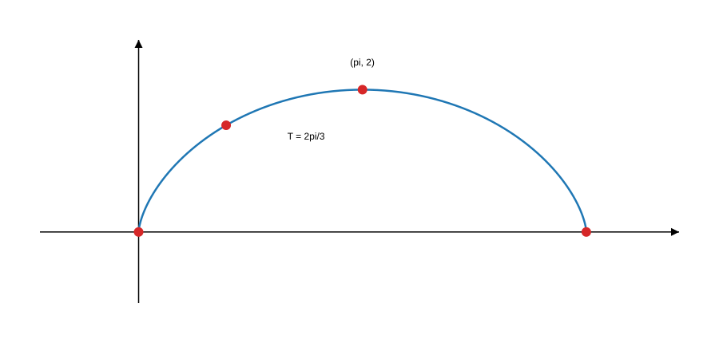
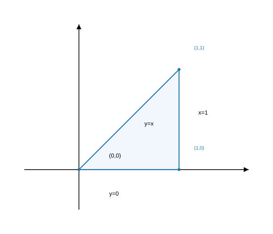
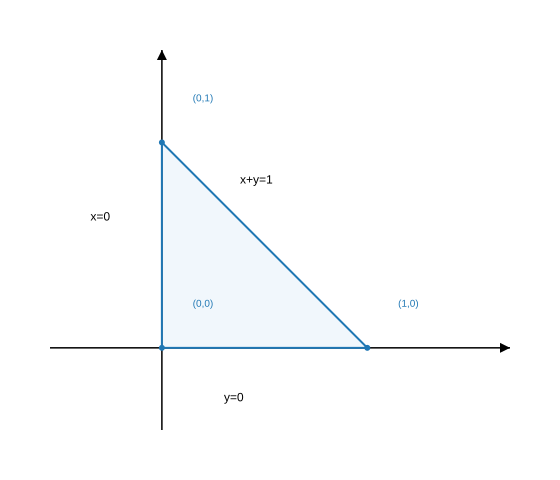
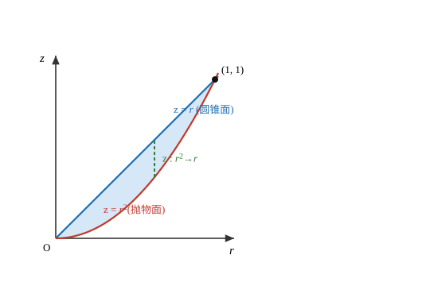
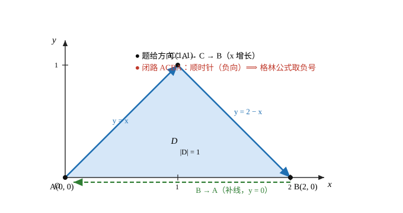

<h2 align="center">高数题目精练（按章节分类）</h2>

> **考点覆盖**（按章列示；**（七）在文件末尾、题号接续（六）**）：
> - **极限与连续**（题 1～7）：有理化与等价无穷小 ｜ 含 $x^{2n}$ 的极限与分段函数 ｜ 无穷小 × 有界量 ｜ 幂指函数含参极限 ｜ 间断点分类 ｜ 连续性与可导性判别 ｜ 柯西方程与连续性证明 ｜ $1^\infty$ 型幂指极限（$n$ 项均值的幂，两法：行变换公式 / 换底洛必达）
> - **一元函数微分学**（题 8～17）：无穷小定参数（换元 $t=-x$ + 有理化） ｜ 隐函数二阶导 ｜ 极限—连续—可导关系链 ｜ 泰勒系数比较求高阶导 ｜ 等价无穷小反求导数 ｜ 罗尔定理 + 重根数零点 ｜ 中值定理反解中值 ｜ 两次罗尔证 $F''(\xi)=0$（零因子凑等值点） ｜ 驻点与极值点计数 ｜ 高阶导数判极值与拐点
> - **一元函数积分学**（题 18～27）：抽象函数还原（$f'(\sin x)$ 型，不定积分） ｜ 变限积分函数求导（先换元） ｜ $n$ 项和极限与定积分定义 ｜ 对称区间积分与奇偶性 ｜ 瑕积分与分部积分 ｜ 积分中值定理中值的渐近性 ｜ 函数方程转微分方程 ｜ 反常积分敛散性（分段判别） ｜ 弧长计算与数值验证 ｜ 参数曲线弧长（摆线）
> - **多元函数微分学**（题 28～30）：复合函数高阶偏导（方程组法） ｜ 径向函数二阶偏导之和（拉普拉斯算子） ｜ 隐函数存在定理判隐函数个数（看 $F_v$ 是否为零）
> - **二重积分**（题 31～32）：交换积分次序（内层化四分之一圆） ｜ 比值型被积函数换元（$u=x+y,\ v=y$，雅可比为 1） ｜ 知识要点：极坐标与直角坐标的选择（面积元 $r\,\mathrm dr\,\mathrm d\theta$、定限三情形）
> - **三重积分**（题 33～34）：三重积分对称性化简（奇偶性两条件、半球形心 $3R/8$） ｜ 两曲面围成体积（定交线 → 柱坐标，抛物面 $z=r^{2}$ 与圆锥面 $z=r$ 围成，"先一后二"） ｜ 知识要点：三种坐标系与体积元的选择（直角 $\mathrm dx\,\mathrm dy\,\mathrm dz$／柱 $r\,\mathrm dr\,\mathrm d\theta\,\mathrm dz$／球 $\rho^{2}\sin\varphi\,\mathrm d\rho\,\mathrm d\varphi\,\mathrm d\theta$）
> - **曲线积分**（题 35～36）：格林公式「挖洞法」（被积函数在区域内部有奇点时的处理）与绕数型积分 $\oint\frac{x\mathrm dy-y\mathrm dx}{x^{2}+y^{2}}=2\pi n$ ｜ 全微分判定与反求参数（$P_y=Q_x$ + 通分比较系数 + 构造势函数 $u=\frac{c_1x+c_2y}{x^{2}+y^{2}}$） ｜ 分段折线（含绝对值）上的第二类积分：补线成闭路 + 格林公式（含补线方向的符号约定） ｜ 变力做功与保守力场（判据 $P_y=Q_x$ → 势函数 → 端点差；全微分与路径无关） ｜ 2007 数一真题：第二类（$\mathrm dx,\mathrm dy$）与第一类（$\mathrm ds$）混合的符号判断（代 $f\equiv1$ → 端点差 / 全长 / 全微分） ｜ 对弧长的曲线积分（第一类）：轮换对称性 $\oint_L x^{2}\mathrm ds=\oint_L y^{2}\mathrm ds$ + 代入曲线方程 $x^{2}+y^{2}=1$ 的"凑等式"套路 ｜ 空间曲线（球面 ∩ 过心平面 = 大圆）上的二次型积分：一次项归零、平方项 $J=\frac{R^{2}}{3}\left|\Gamma\right|$、交叉项 $-\frac{J}{2}$，算式变形 $x^{2}+y^{2}-z^{2}=R^{2}-2z^{2}$ ｜ 知识要点：定义与物理意义（线密度→质量）、三条性质（与方向无关／可加性／轮换对称）、参数化定限（定限一律由小到大）

---

### （一）极限与连续（题 1～7）

> 说明：题 5 兼判可导性（导数定义，属微分学内容），因与题 3 同函数成对保留在本章；题 7 为 $1^\infty$ 型幂指极限（$n$ 项均值型）。

---

#### 题 1　有理化 + 等价无穷小求极限

**【题目】** 求 $\lim\limits_{x \to 0}\left(\sqrt{1 + \tan x} - \sqrt{1 + \sin x}\right)$。

**【解】** 根式差先**有理化**：

$$
\sqrt{1+\tan x}-\sqrt{1+\sin x}=\frac{\tan x-\sin x}{\sqrt{1+\tan x}+\sqrt{1+\sin x}}
$$

其中

$$
\tan x-\sin x=\tan x\,(1-\cos x)\sim x\cdot \frac{x^{2}}{2}=\frac{x^{3}}{2}\quad(x\to 0)
$$

分母 $\sqrt{1+\tan x}+\sqrt{1+\sin x}\to 2$，故

$$
\lim_{x \to 0}\left(\sqrt{1 + \tan x} - \sqrt{1 + \sin x}\right)=\lim_{x \to 0}\frac{\dfrac{x^{3}}{2}}{2}=0
$$

**【结论】** 极限为 $0$；进一步，该差是 $x\to 0$ 时的 **3 阶无穷小**，且 $\sqrt{1+\tan x}-\sqrt{1+\sin x}\sim \dfrac{x^{3}}{4}$。

> **备注**：本式的常见变体是 $\lim\limits_{x \to 0}\dfrac{\sqrt{1+\tan x}-\sqrt{1+\sin x}}{x^{3}}=\dfrac{1}{4}$（1997 年真题类套路），同一套有理化直接解决。

---

#### 题 2　含 $x^{2n}$ 的极限 → 分段函数与间断点

**【题目】** 设 $f(x)=\lim\limits_{n \to \infty} \dfrac{1-x^{2n}}{1+x^{2n}}$，求 $f(x)$ 的间断点并判断其类型。

**【解】** 极限过程中 $n\to\infty$，须按 $|x|$ 与 $1$ 的大小**分类讨论**：

- $|x|<1$：$x^{2n}\to 0$，$f(x)=\dfrac{1-0}{1+0}=1$；
- $|x|=1$：$x^{2n}=1$，$f(x)=\dfrac{1-1}{1+1}=0$；
- $|x|>1$：$x^{2n}\to+\infty$，分子分母同除 $x^{2n}$，$f(x)=\dfrac{\tfrac{1}{x^{2n}}-1}{\tfrac{1}{x^{2n}}+1}\to -1$。

$$
f(x)=\begin{cases}1, & |x|<1\\[2pt] 0, & |x|=1\\[2pt] -1, & |x|>1\end{cases}
$$

在 $x=1$ 处：$\lim\limits_{x\to 1^{-}}f(x)=1\neq \lim\limits_{x\to 1^{+}}f(x)=-1$，左右极限均存在但不相等；
在 $x=-1$ 处：$\lim\limits_{x\to -1^{-}}f(x)=-1\neq \lim\limits_{x\to -1^{+}}f(x)=1$，同理。

**【结论】** $x=\pm 1$ 均为**跳跃间断点（第一类间断点）**。

> **方法**：凡 $\lim\limits_{n\to\infty}$ 中含 $x^{2n}$（或 $x^n$、$a^{nx}$），必先按 $|x|$ 与 $1$ 的大小写成分段函数，再对分段点逐个验左右极限。

---

#### 题 3　无穷小 × 有界量判连续（选择题）

**【题目】** 设 $f(x) = \begin{cases} (x - 1)\arctan\dfrac{1}{x^2 - 1}, & x \neq \pm 1, \\ 0, & x = \pm 1, \end{cases}$ 则（　　）

(A) $f(x)$ 在点 $x = 1$ 处连续，在点 $x = -1$ 处间断。

(B) $f(x)$ 在点 $x = 1$ 处间断，在点 $x = -1$ 处连续。

(C) $f(x)$ 在点 $x = 1, x = -1$ 处都连续。

(D) $f(x)$ 在点 $x = 1, x = -1$ 处都间断。

**【解】** 两个点分开看 $\arctan\dfrac{1}{x^{2}-1}$ 的行为（核心：$|\arctan(\cdot)|\le\dfrac{\pi}{2}$ 恒有界）。

**在 $x=1$ 处**：$x-1\to 0$，而 $\arctan\dfrac{1}{x^{2}-1}$ 有界（无论 $x^{2}-1\to 0^{+}$ 还是 $0^{-}$），由"**无穷小 × 有界量 = 无穷小**"：
$$
\lim_{x\to 1}f(x)=0=f(1)
$$

故 $f$ 在 $x=1$ 处**连续**。

**在 $x=-1$ 处**：$x-1\to -2\neq 0$，必须考察左右极限。$x\to -1^{+}$ 时 $x^{2}<1$，$\dfrac{1}{x^{2}-1}\to -\infty$，$\arctan\to -\dfrac{\pi}{2}$；$x\to -1^{-}$ 时 $x^{2}>1$，$\dfrac{1}{x^{2}-1}\to +\infty$，$\arctan\to +\dfrac{\pi}{2}$。于是

$$
\lim_{x\to -1^{+}}f(x)=(-2)\times\left(-\frac{\pi}{2}\right)=\pi,\qquad \lim_{x\to -1^{-}}f(x)=(-2)\times\frac{\pi}{2}=-\pi
$$

左右极限存在但不相等（跳跃间断），且都不等于 $f(-1)=0$。

**【结论】** 选 **(B)**：在 $x=1$ 处连续，在 $x=-1$ 处间断（跳跃间断点，第一类）。

> **易错点**：$x\to -1$ 两侧 $x^{2}-1$ **变号**（右旁 $x^{2}<1$，左旁 $x^{2}>1$），所以 $\arctan$ 趋向 $-\dfrac{\pi}{2}$ 与 $+\dfrac{\pi}{2}$ 两侧不同——这也是 $x=-1$ 处极限不存在的根源。

---

#### 题 4　幂指函数含参极限 → 先求 $f(x)$ 再判间断点

**【题目】** 设 $F(x, y) = \left(\dfrac{x}{y}\right)^{\frac{1}{x-y}}\ (x \neq y \text{ 且 } xy > 0)$，$f(x) = \lim\limits_{y \to x} F(x, y)$，问 $x = 0$ 是 $f(x)$ 的什么间断点？

**【解】** 幂指函数先**取对数**：

$$
\ln F(x,y)=\frac{\ln\dfrac{x}{y}}{x-y}
$$

当 $y\to x$ 时为 $\dfrac{0}{0}$ 型，固定 $x$、对 $y$ 用洛必达：

$$
\lim_{y\to x}\frac{\ln\dfrac{x}{y}}{x-y}=\lim_{y\to x}\frac{-\dfrac{1}{y}}{-1}=\frac{1}{x}
$$

故

$$
f(x)=e^{1/x}\qquad(x\neq 0)
$$

再考察 $x=0$：

$$
\lim_{x\to 0^{+}}e^{1/x}=+\infty,\qquad \lim_{x\to 0^{-}}e^{1/x}=0
$$

右极限为 $+\infty$（左极限为 $0$）。

**【结论】** $x=0$ 是 $f(x)$ 的**无穷间断点（第二类间断点）**。

> **方法**：$f(x)=\lim\limits_{y\to x}g(x,y)$ 型先"解出" $f(x)$ 的初等表达式（取对数 + 洛必达/泰勒），再按普通函数判间断点。$xy>0$ 保证 $y\to x$ 过程中底数恒正，取对数合法。

---

#### 题 5　同函数的连续性 + 可导性双判别

**【题目】** 分别讨论 $f(x)$ 在两处关键点 $x = 1$ 和 $x = -1$ 处的**连续性**与**可导性**，其中

$$
f(x) = \begin{cases} (x-1)\arctan\left(\dfrac{1}{x^2-1}\right), & x \neq \pm 1 \\ 0, & x = \pm 1 \end{cases}
$$

**【解】**

**连续性**：与题 3 相同——在 $x=1$ 处，$\lim\limits_{x\to 1}f(x)=0=f(1)$，**连续**；在 $x=-1$ 处，左右极限为 $\pi$ 与 $-\pi$（存在但不相等），**间断**。

**可导性**（用定义逐点验证）：

**在 $x=1$ 处**：

$$
f'(1)=\lim_{x\to 1}\frac{f(x)-f(1)}{x-1}=\lim_{x\to 1}\frac{(x-1)\arctan\dfrac{1}{x^{2}-1}-0}{x-1}=\lim_{x\to 1}\arctan\frac{1}{x^{2}-1}
$$

右极限为 $\dfrac{\pi}{2}$、左极限为 $-\dfrac{\pi}{2}$，导数定义的极限不存在，故在 $x=1$ 处**不可导**。

**在 $x=-1$ 处**：不连续 ⟹ 必不可导（可导必连续的逆否命题）。

**【结论】** $f$ 在 $x=1$ 处**连续但不可导**；在 $x=-1$ 处**既不连续也不可导**。

> **易错点**："无穷小 × 有界量 = 无穷小"只保证 $f(x)\to f(1)$；但导数定义中要再除以 $(x-1)$，有界性立刻失效，左右导数分别为 $\pm\dfrac{\pi}{2}$。**连续 ≠ 可导**，可导性必须回到定义。

---

#### 题 6　函数方程 + 极限存在 ⟹ 处处连续（证明题）

**【题目】**（原条目为笔记线索，题干按标准题型补全）设函数 $f(x)$ 在 $\mathbb{R}$ 上有定义，对任意 $x_1, x_2 \in \mathbb{R}$ 满足

$$
f(x_1+x_2)=f(x_1)+f(x_2)
$$

且 $\lim\limits_{x\to x_0} f(x)$ 的存在性仅已知 $\lim\limits_{x\to 0} f(x)$ 存在。证明：$f(x)$ 在 $\mathbb{R}$ 上处处连续。

**【证明】**

**第一步：$f(0)=0$。** 在方程中取 $x_2=0$：$f(x_1)=f(x_1)+f(0)$，故 $f(0)=0$。

**第二步：$f$ 是奇函数。** 取 $x_2=-x_1$：$f(0)=f(x_1)+f(-x_1)$，故 $f(-x)=-f(x)$。

**第三步：$\lim\limits_{x\to 0}f(x)=0=f(0)$，$f$ 在 $x=0$ 处连续。** 设 $\lim\limits_{x\to 0^{+}}f(x)=A$，则由奇性

$$
\lim_{x\to 0^{-}}f(x)=\lim_{u\to 0^{+}}f(-u)=-A
$$

因 $\lim\limits_{x\to 0}f(x)$ 存在，左右极限相等，$A=-A$，故 $A=0$。又 $f(0)=0$，所以 $f$ 在 $x=0$ 处连续。

**第四步：任取 $x_0\in\mathbb{R}$，$f$ 在 $x_0$ 处连续。** 令 $x=x_0+t$，当 $x\to x_0$ 时 $t\to 0$，由方程（取 $x_1=x_0,\ x_2=t$）：

$$
\lim_{x\to x_0}f(x)=\lim_{t\to 0}f(x_0+t)=\lim_{t\to 0}\left[f(x_0)+f(t)\right]=f(x_0)+0=f(x_0)
$$

故 $f$ 在 $\mathbb{R}$ 上处处连续。$\blacksquare$

> **另一条捷径（第三步）**：由 $f(2x)=2f(x)$，两边取 $x\to 0$ 得 $L=\lim\limits_{x\to 0}f(2x)=2\lim\limits_{x\to 0}f(x)=2L$，故 $L=0$，更直接。

**补充：连续解必为正比例函数 $f(x)=f(1)\,x$。** 对正整数 $n$ 归纳得 $f(nx)=nf(x)$；以 $\dfrac{x}{n}$ 代入得 $f\left(\dfrac{x}{n}\right)=\dfrac{1}{n}f(x)$；故对有理数 $\dfrac{m}{n}$ 有 $f\left(\dfrac{m}{n}\right)=\dfrac{m}{n}f(1)$。任取实数 $x$，取有理数列 $r_k\to x$，由连续性 $f(x)=\lim\limits_{k\to\infty}f(r_k)=f(1)\lim\limits_{k\to\infty}r_k=f(1)\,x$。

> **考点**：柯西方程 $f(x_1+x_2)=f(x_1)+f(x_2)$ 的处理套路——**先逼出 $f(0)=0$ 与奇性**，再把一般点 $x_0$ 的极限"平移到原点"：$f(x_0+t)=f(x_0)+f(t)$，把未知点的连续性归结为已知点 $0$ 的极限行为。

---

#### 题 7　$1^\infty$ 型：$n$ 项均值的幂指极限（两法对照）

**【题目】**（原题为填空题）计算 $\displaystyle\lim_{x\to\infty}\left(\frac{a^{\frac1x}+a^{\frac2x}+\cdots+a^{\frac nx}}{n}\right)^{x}\quad(a>0)$。

**【定型】** $x\to\infty$ 时 $\dfrac{k}{x}\to0$，各项 $a^{k/x}\to1$，底数 $\to\dfrac{n\cdot1}{n}=1$，指数 $\to\infty$——典型的 **$1^\infty$ 型未定式**（绝不可直接写"$1^\infty=1$"）。

**【解】** 记所求极限为 $L$。底数恒为正、极限为正，两边取对数合法（对数与求极限可交换）：

$$
\ln L=\lim_{x\to\infty}x\ln\left(\frac{1}{n}\sum_{k=1}^{n}a^{k/x}\right)
$$

**第一步：换元 $t=\dfrac1x$（$x\to\infty\iff t\to0^+$）**，化为 $\dfrac00$ 型：

$$
\ln L=\lim_{t\to0}\frac{\ln\left(\dfrac1n\sum_{k=1}^{n}a^{kt}\right)}{t}
=\lim_{t\to0}\frac{\ln\left(\sum_{k=1}^{n}a^{kt}\right)-\ln n}{t}
$$

**第二步：求这个 $\dfrac00$ 型极限（两条路）。**

**解法一：$1^\infty$ 型行变换公式 + 等价无穷小（推荐）**

对 $f\to1$、$g\to\infty$ 的幂指未定式有

$$
\lim f(x)^{g(x)}=\mathrm e^{\lim g(x)\left[f(x)-1\right]}
$$

直接代入（用 $\ln L=\lim x\left[\frac1n\sum a^{k/x}-1\right]$ 的等价写法）：

$$
\ln L=\lim_{x\to\infty}x\left[\frac{1}{n}\sum_{k=1}^{n}a^{k/x}-1\right]
\xlongequal{\,t=1/x\,}\lim_{t\to0}\frac{\frac1n\sum_{k=1}^{n}a^{kt}-1}{t}
=\frac1n\sum_{k=1}^{n}\lim_{t\to0}\frac{a^{kt}-1}{t}
$$

（拆开合法：有限项求和可与极限交换。）由 $a^{u}-1\sim u\ln a\ (u\to0)$，取 $u=kt$：

$$
\lim_{t\to0}\frac{a^{kt}-1}{t}=k\ln a
\;\Longrightarrow\;
\ln L=\frac{1}{n}\sum_{k=1}^{n}k\ln a=\frac{\ln a}{n}\cdot\frac{n(n+1)}{2}=\frac{n+1}{2}\ln a
$$

**解法二：换底 + 洛必达**（与解法一等价，用于验算）

对第一步末的 $\dfrac00$ 型用洛必达（分子求导：$\left[\ln\sum a^{kt}\right]'=\dfrac{\sum k\,a^{kt}\ln a}{\sum a^{kt}}$；$\ln n$ 是常数；分母求导为 $1$）：

$$
\ln L=\lim_{t\to0}\frac{\sum_{k=1}^{n}k\,a^{kt}\ln a}{\sum_{k=1}^{n}a^{kt}}
=\frac{\ln a\cdot\sum_{k=1}^{n}k}{\sum_{k=1}^{n}1}
=\frac{\ln a\cdot\dfrac{n(n+1)}{2}}{n}
=\frac{n+1}{2}\ln a
$$

**【结论】** $\ln L=\dfrac{n+1}{2}\ln a$，脱去对数：

$$
L=a^{\frac{n+1}{2}}\ \left(=\sqrt{a^{\,n+1}}\right)
$$

**特例自检**：$n=1$ 时原式为 $\lim\limits_{x\to\infty}\left(a^{1/x}\right)^{x}=a^{1}=a$，公式给 $a^{\frac{1+1}{2}}=a$ ✓；$a=1$ 时恒等于 $1$ ✓。

> **方法（$1^\infty$ 型三步流水线）**：①取对数（或直接用行变换公式 $\lim f^{g}=\mathrm e^{\lim g(f-1)}$，把幂指未定式降为 $\frac00$ 型）；②换元 $t=\frac1x$ 把 $\infty$ 拉到 $0$；③等价无穷小拆项（$a^u-1\sim u\ln a$）或洛必达收尾。
> **易错点**：①把 $1^\infty$ 当 $1$（经典陷阱，指数 $\infty$ 与底数偏离 $1$ 的量是"赛跑"关系，结果一般 $>1$）；②求和与极限交换时忘了 $\frac1n$ 的配套（本题 $\sum k$ 前面始终带 $\frac1n$）；③算完 $\ln L$ 忘记**脱对数**；④洛必达路线里分母 $\sum a^{kt}$ 求导时漏掉链式因子 $k\ln a$。

---

### （二）一元函数微分学（题 8～17）

> 说明：题 8 以极限形式给出（求使表达式为无穷小量的参数 $a,b$），放在章首以承接（一）中极限与等价无穷小的手段；题 10 的“可导⟹连续⟹极限存在”关系链是本章概念总纲，兼跨极限与连续。

---

#### 题 8　由"无穷小"定参数：$\sqrt{x^{2}-x+1}+ax+b$（换元 $t=-x$）

**【题目】**（题册第 62 题）已知当 $x\to-\infty$ 时，$\sqrt{x^{2}-x+1}+ax+b$ 为无穷小量，求 $a,b$ 的值。

**【解】** 关键一步：$x\to-\infty$ 使根号内 $x^{2}$ 的开方**带负号**（$\sqrt{x^{2}}=\lvert x\rvert=-x$），最省事的做法是先换元把变量拉成 $+\infty$ 方向。令 $t=-x$（$x\to-\infty\iff t\to+\infty$），则

$$
\sqrt{x^{2}-x+1}+ax+b=\sqrt{t^{2}+t+1}-at+b
$$

**第一步：由"极限存在且为 $0$"定 $a$。** 记上式 $=g(t)$，设 $g(t)\to0$。由 $\sqrt{t^{2}+t+1}=t\sqrt{1+\dfrac1t+\dfrac{1}{t^{2}}}=t+O(1)\ (t\to+\infty)$：

- 若 $a>1$：$g(t)=(1-a)\,t+O(1)\to-\infty$，不为 $0$；
- 若 $a<1$：$g(t)=(1-a)\,t+O(1)\to+\infty$，不为 $0$；
- 唯有 $a=1$ 时首项 $t$ 被抵消，才有 $g(t)\to0$。

（即：$t$ 的一次项必须被抵消，故 $a=1$。）把 $a=1$ 代入：

$$
g(t)=\sqrt{t^{2}+t+1}-t+b
$$

**第二步：代 $a=1$ 后定 $b$。** 先算括号内的极限——**有理化**（$\sqrt{t^{2}+t+1}-t=\dfrac{t+1}{\sqrt{t^{2}+t+1}+t}$）：

$$
\sqrt{t^{2}+t+1}-t=\frac{t+1}{\sqrt{t^{2}+t+1}+t}
=\frac{1+\dfrac1t}{\sqrt{1+\dfrac1t+\dfrac{1}{t^{2}}}+1}\longrightarrow\frac{1}{2}\qquad(t\to+\infty)
$$

再由 $g(t)\to0$：

$$
b=-\lim_{t\to+\infty}\left(\sqrt{t^{2}+t+1}-t\right)=-\frac{1}{2}
$$

**【结论】** $a=1,\ b=-\dfrac{1}{2}$。

**与渐近展开互证**：$t\to+\infty$ 时 $\sqrt{t^{2}+t+1}=t+\dfrac12+O\!\left(\dfrac1t\right)$（由 $\sqrt{1+u}=1+\dfrac u2+O(u^{2})$），故 $g(t)=\dfrac12+b+O\!\left(\dfrac1t\right)\to0\iff b=-\dfrac12$，与有理化同源。

**数值检验**（取 $a=1,\ b=-\dfrac12$，$x=-10^{k}$）：

| $10^{k}$ | $10^{2}$ | $10^{4}$ | $10^{6}$ | $10^{8}$ |
|:---|:---|:---|:---|:---|
| $\sqrt{x^{2}-x+1}+ax+b$ | $3.7\times10^{-3}$ | $3.7\times10^{-5}$ | $3.7\times10^{-7}$ | $3.7\times10^{-9}$ |

（约 $\dfrac{3}{8}\lvert x\rvert^{-1}$，随 $\lvert x\rvert$ 增大单调趋于 $0$ ✓；对照组 $a=-1,\ b=\dfrac12$ 给出 $\approx2\lvert x\rvert\to+\infty$，可反证该组合错误。）

> **方法**：$x\to-\infty$ 时根号里 $\sqrt{x^{2}}=\lvert x\rvert=-x$——**符号一变，整道题的方向就变**。三条等效路径：① 换元 $t=-x$ 化为 $t\to+\infty$（最不易错，本题采用）；② 二项式展开 $\sqrt{1+u}=1+\dfrac u2+O(u^{2})$ 对比一次项；③ **有理化**（乘共轭 $\sqrt{x^{2}-x+1}-ax-b$，分子化为 $\left(1-a^{2}\right)x^{2}-\left(1+2ab\right)x+\left(1-b^{2}\right)$，令 $x^{2}$、$x$ 两项系数为零，并注意 $x<0$ 时开方取 $-x$ 的符号，同样得 $a=1,\ b=-\tfrac12$）。
> **易错点**：① **换元符号**——$x=-t$ 代回根号应得 $t^{2}+t+1$，若写成 $t^{2}-t+1$（或把 $x\to-\infty$ 当 $+\infty$）会算出 $a=-1$ 等错误答案；② 只看到"$x^{2}$ 的系数要与 $a^{2}x^{2}$ 抵消"就条件反射取 $\lvert a\rvert=1$，忽略根号在 $x\to-\infty$ 时整体取 $-x$，从而在 $a=\pm1$ 之间选反；③ 定出 $a$ 后忘了 $b$ 要**再算一次极限**（$b=-\lim\limits_{t\to+\infty}\left(\sqrt{t^{2}+t+1}-t\right)$），直接令 $b=0$ 就漏掉那 $\dfrac12$；④ 用洛必达硬算前必须先把 $a$ 定下来，否则分子根本不是未定式。

---

#### 题 9　隐函数二阶导数

**【题目】** 求解由隐函数 $e^y + 6xy + x^2 - 1 = 0$ 确定的函数 $y = y(x)$ 的二阶导数 $y''$。

**【解】** 方程两边对 $x$ 求导（$y$ 是 $x$ 的函数，每一处都带链式法则的 $y'$）：

$$
e^y\,y' + 6y + 6x\,y' + 2x = 0
$$

解出

$$
y' = -\frac{6y + 2x}{e^y + 6x},\qquad \text{即}\quad y'\,(e^y + 6x) = -(6y + 2x)
$$

对右边的**乘积恒等式**再整体求导一次（比拿 $y'$ 的分式套商法则省力得多）：左边 $= y''(e^y + 6x) + y'(e^y\,y' + 6)$，右边 $= -(6y' + 2)$，整理得

$$
y''\,(e^y + 6x) = -\left[e^y\,(y')^{2} + 12y' + 2\right]
$$

$$
\boxed{\,y'' = -\frac{e^y\,(y')^{2} + 12y' + 2}{e^y + 6x}\,}\qquad\left(y' = -\frac{6y+2x}{e^y+6x}\right)
$$

把 $y'$ 代入通分，即得纯 $x, y$ 表达式：

$$
y'' = -\frac{e^y\,(6y+2x)^{2} - 12\,(6y+2x)(e^y+6x) + 2\,(e^y+6x)^{2}}{(e^y+6x)^{3}}
$$

**特例（曲线过原点处）**：$x = 0$ 时方程给 $e^y = 1$，即 $y(0) = 0$；此时 $y'(0) = 0$，代入得

$$
y''(0) = -\frac{e^{0}\cdot 0^{2} + 12\cdot 0 + 2}{e^{0} + 0} = -2
$$

**【结论】** $y'' = -\dfrac{e^y\,(y')^{2} + 12y' + 2}{e^y + 6x}$（$y' = -\dfrac{6y+2x}{e^y+6x}$）；在曲线过原点处 $y''(0) = -2$。

> **方法**：隐函数求 $y''$ 两步走——第一次求导解出 $y'$ 后，**保留乘积形式** $y'(e^y+6x) = -(6y+2x)$ 再整体求导，避免分式商法则展开；乘积求导时 $e^y$ 的导数是 $e^y\,y'$（链式法则的 $y'$ 不能丢）。

---

#### 题 10　极限、连续、可导的关系链（概念梳理）

**【题目】** 梳理极限、连续、可导三者的关系，并说明"反之均不成立"的具体反例。

**【解】** 在一点 $x_0$ 处的关系链（连续的定义本身就是"极限存在，且极限值等于函数值"）：

$$
\text{可导} \implies \text{连续} \implies \lim_{x\to x_0}f(x)\ \text{存在}
$$

每一级逆命题都不成立，逐条给出反例：

| 命题 | 判定 | 反例 / 依据 |
|:---|:---:|:---|
| 可导 $\implies$ 连续 | ✓ | 定理：$f'(x_0)$ 存在 $\implies \lim\limits_{x\to x_0}f(x)=f(x_0)$ |
| 连续 $\implies$ 可导 | ✗ | $f(x)=\lvert x\rvert$ 在 $x=0$：连续，但左右导数 $-1 \neq 1$，不可导 |
| 极限存在 $\implies$ 连续 | ✗ | $f(x)=0\ (x\neq 0)$、$f(0)=1$：$\lim\limits_{x\to 0}f(x)=0$ 存在但 $\neq f(0)=1$（可去间断点） |
| 极限存在 $\implies$ 可导 | ✗ | 连续都推不出，遑论可导（$\lvert x\rvert$ 在 $0$ 处极限存在但不可导） |
| 可导 $\implies$ 极限存在 | ✓ | 由链条传递 |

链条断在哪，对应的就是哪类间断点（判型本质 = 检查本链断点位置）：

| 链条断点 | 间断点类型 |
|:---|:---|
| 左右极限都存在但不相等 | 跳跃间断点（第一类） |
| 极限存在，但 $\neq f(x_0)$（或 $f(x_0)$ 无定义） | 可去间断点（第一类） |
| 至少一侧极限不存在 | 第二类（无穷 / 振荡） |

**【结论】** 可导 ⟹ 连续 ⟹ 极限存在，反之均不成立；可去间断点正是"极限存在但不连续"的实例，$\lvert x\rvert$ 是"连续但不可导"的标准反例。

> **考点**：本链是题 3、题 5 的理论底座——题 3 在 $x=-1$ 处左右极限存在但不相等即跳跃间断；题 5 在 $x=1$ 处"连续但不可导"正说明连续 $\not\Rightarrow$ 可导。

---

#### 题 11　由比值极限反求高阶导数（泰勒系数比较）

**【题目】** 设 $\lim\limits_{x \to 0} \dfrac{f(x)}{\tan x - \sin x}=1$，求 $f'''(0)$。（设 $f$ 在 $x=0$ 处三阶可导）

**【解】** 由题 1 的结果：$\tan x - \sin x = \tan x\,(1-\cos x) \sim \dfrac{x^{3}}{2}$，精确到皮亚诺余项即 $\tan x - \sin x = \dfrac{x^{3}}{2} + O(x^{5})$。于是由条件，

$$
f(x) = (\tan x - \sin x)\cdot\frac{f(x)}{\tan x - \sin x} = \left(\frac{x^{3}}{2} + O(x^{5})\right)\left(1 + o(1)\right) = \frac{x^{3}}{2} + o(x^{3})
$$

另一方面，$f$ 在 $x=0$ 处带皮亚诺余项的泰勒展开为

$$
f(x) = f(0) + f'(0)\,x + \frac{f''(0)}{2}x^{2} + \frac{f'''(0)}{6}x^{3} + o(x^{3})
$$

固定点、固定阶数的泰勒展开**具有唯一性**，与 $\dfrac{x^{3}}{2} + o(x^{3})$ 逐项比较系数：

$$
f(0)=0,\qquad f'(0)=0,\qquad f''(0)=0,\qquad \frac{f'''(0)}{6}=\frac{1}{2}
$$

**【结论】** $f'''(0) = 3$（顺带得 $f(0)=f'(0)=f''(0)=0$）。

> **易错点**：想对 $\dfrac{f(x)}{\tan x - \sin x}$ 连用三次洛必达——条件只给出比值极限存在，$f'$、$f''$ 在去心邻域内是否存在未知，洛必达不合法；**高阶导数值 ⟹ 泰勒系数比较**才是正路。另外分母的主部是 $\dfrac{x^{3}}{2}$ 而非 $x^{3}$，系数别丢。

---

#### 题 12　由隐含条件反求 $f'(0)$（等价无穷小 + 可导）

**【题目】** 设 $f(x)$ 在点 $x=0$ 处可导，且 $\lim\limits_{x \to 0}\dfrac{\cos x - 1}{2^{f(x)} - 1} = 1$，则 $f'(0)$ 等于（　　）

**【解】**

**第一步：逼出 $f(0)=0$。** 分子 $\cos x - 1 \to 0$，比值极限为非零常数 $1$，分母必须也是无穷小：$2^{f(x)} - 1 \to 0 \implies f(x)\to 0$。又 $f$ 在 $x=0$ 处可导 $\implies$ 连续，故 $f(0)=0$。

**第二步：两层等价无穷小。** 比值为 $1$ 意味着分母与分子等价：

$$
2^{f(x)} - 1 \sim \cos x - 1 \sim -\frac{x^{2}}{2}
$$

而 $2^{f(x)} - 1 = e^{f(x)\ln 2} - 1 \sim f(x)\ln 2$（$f(x)\to 0$），于是

$$
f(x)\ln 2 \sim -\frac{x^{2}}{2},\qquad \text{即}\quad f(x) \sim -\frac{x^{2}}{2\ln 2}
$$

**第三步：导数定义收口。**

$$
f'(0)=\lim_{x\to 0}\frac{f(x)-f(0)}{x-0}=\lim_{x\to 0}\frac{-\dfrac{x^{2}}{2\ln 2}+o(x^{2})}{x}=0
$$

**【结论】** $f'(0)=0$。

> **考点**：比值极限为**非零常数** ⟹ 分子分母是同阶无穷小（分母必须跟着趋于 $0$）；$2^u-1\sim u\ln 2$；"可导 ⟹ 连续"用来确定 $f(0)$。

---

#### 题 13　导函数零点个数（罗尔定理 + 重根）

**【题目】** 设 $f(x)=x(x-1)^{2}(x-2)$，求 $f'(x)$ 的零点个数。（注意 $x=1$ 处也是零点）

**【解】** $f$ 的零点为 $x=0$、$x=1$（**二重**）、$x=2$；$f'$ 是三次多项式，实零点**至多 3 个**。

**罗尔定理给两个**：$f(0)=f(1)=0$，存在 $\xi_1\in(0,1)$ 使 $f'(\xi_1)=0$；$f(1)=f(2)=0$，存在 $\xi_2\in(1,2)$ 使 $f'(\xi_2)=0$。

**重根再给一个**：$x=1$ 是 $f$ 的二重零点。写成 $f(x)=(x-1)^{2}\cdot\big[x(x-2)\big]$，由乘积求导（含 $(x-1)^2$ 因子的项在 $x=1$ 处全为 $0$）：

$$
f'(1)=\left[2(x-1)\,x(x-2)\right]_{x=1}=0
$$

三个零点 $\xi_1 < 1 < \xi_2$ 互异，而三次多项式不可能有第 4 个实零点。

**【结论】** $f'(x)$ 恰有 **3 个**零点：$\xi_1\in(0,1)$、$x=1$、$\xi_2\in(1,2)$。

> **易错点**：只用罗尔数出 $\xi_1,\xi_2$ 两个就收工——漏了**$n$ 重零点必是导函数的 $(n-1)$ 重零点**（$x=1$ 这一份），这也是本题特意标注的坑。

---

#### 题 14　拉格朗日中值定理的"中值"极限

**【题目】** 设 $\xi$ 为函数 $f(x) = \arcsin x$ 在区间 $[0, b]$（$b>0$）上使用拉格朗日中值定理所得的中值，则 $\lim\limits_{b \to 0^{+}} \dfrac{\xi}{b}$ 等于（　　）

**【解】** 中值定理：

$$
f(b)-f(0)=f'(\xi)\,(b-0),\qquad f'(x)=\frac{1}{\sqrt{1-x^{2}}}
$$

即

$$
\arcsin b = \frac{b}{\sqrt{1-\xi^{2}}}\quad\Longrightarrow\quad \xi^{2} = 1 - \frac{b^{2}}{\arcsin^{2} b}
$$

两边除以 $b^{2}$ 并通分：

$$
\frac{\xi^{2}}{b^{2}} = \frac{1}{b^{2}} - \frac{1}{\arcsin^{2} b} = \frac{\arcsin^{2} b - b^{2}}{b^{2}\,\arcsin^{2} b}
$$

分母 $\sim b^{4}$；分子用展开 $\arcsin b = b + \dfrac{b^{3}}{6} + o(b^{3})$ 作差：

$$
\arcsin^{2} b - b^{2} = (\arcsin b - b)(\arcsin b + b) \sim \frac{b^{3}}{6}\cdot 2b = \frac{b^{4}}{3}
$$

故 $\lim\limits_{b\to 0^{+}}\dfrac{\xi^{2}}{b^{2}} = \dfrac{1}{3}$。又 $b>0$ 时 $0<\xi<b$ 与 $b$ 同号，取正根：

$$
\lim_{b\to 0^{+}}\frac{\xi}{b} = \frac{1}{\sqrt{3}} = \frac{\sqrt{3}}{3}
$$

**【结论】** $\dfrac{\sqrt{3}}{3}$。

> **方法**："反解中值"类题的通用套路——由中值定理等式把 $\xi$（或 $\xi^{2}$）用区间端点**显式解出**，再对端点取极限；需备好展开 $\arcsin b = b+\dfrac{b^{3}}{6}+o(b^{3})$。

---

#### 题 15　两次罗尔定理证 $F''(\xi)=0$（构造 $(x-1)^{2}f(x)$）

**【题目】** 设 $f(x)$ 在 $[1,2]$ 上有任意阶导数，且 $f(2)=0$。设 $F(x)=(x-1)^{2}f(x)$，证明：在 $(1,2)$ 内存在一个 $\xi$，使得

$$
F''(\xi)=0.
$$

**【解】** 先找 $F$ 的等值点。由 $f(2)=0$ 得

$$
F(1)=(1-1)^{2}f(1)=0,\qquad F(2)=(2-1)^{2}f(2)=0.
$$

$F(x)$ 在 $[1,2]$ 上连续、在 $(1,2)$ 内可导，由**罗尔定理**，存在 $\eta\in(1,2)$ 使得

$$
F'(\eta)=0.
$$

再对 $F'(x)$ 用一次罗尔。由乘积求导公式

$$
F'(x)=2(x-1)f(x)+(x-1)^{2}f'(x),
$$

故 $F'(1)=0$——这一步是构造 $(x-1)^{2}f(x)$ 的用意，**零因子** $x-1$ 在端点白送一个驻点。于是 $F'(1)=F'(\eta)=0$。又 $f$ 任意阶可导，故 $F'(x)$ 在 $[1,\eta]$ 上连续、在 $(1,\eta)$ 内可导，由**罗尔定理**，存在

$$
\xi\in(1,\eta)\subset(1,2),\qquad F''(\xi)=0.
$$

**【结论】** 存在 $\xi\in(1,2)$，使 $F''(\xi)=0$。

> **方法**：证 $f^{(n)}(\xi)=0$ 的通用路线是**数等值点**——要 $n$ 阶零点，就凑 $n+1$ 个函数值相等的点。本题 $F(1)=F(2)=0$ 给两个点，罗尔得 $F'(\eta)=0$；再检查 $F'$ 有没有"白送"的零点，发现 $F'(1)=0$，于是 $F'$ 有两个零点，第二次罗尔即得 $F''(\xi)=0$。
> **易错点**：① 结论是 $F''(\xi)=0$（二阶），别看成 $F'''(\xi)=0$——证三阶需要 $F''$ 再有一个零点，题设条件不够；② 第二次罗尔的区间取 $[1,\eta]$ 而不是 $[1,2]$，故最后必须写 $\xi\in(1,\eta)\subset(1,2)$；③ $F'(1)=0$ 依赖 $(x-1)$ 因子，别把 $F(x)$ 写成 $(x-1)f(x)$ 或 $(x-1)^{3}f(x)$。

---

#### 题 16　驻点与极值点计数（导数符号分析）

**【题目】**（原题为选择题，未附选项）函数 $y=x^{3}\cos 3x$ 在 $\left(-\dfrac{\pi}{6}, \dfrac{\pi}{6}\right)$ 内的驻点与极值点个数。

**【解】** 求导并因式分解：

$$
y' = 3x^{2}\cos 3x - 3x^{3}\sin 3x = 3x^{2}\,\big(\cos 3x - x\sin 3x\big)
$$

记 $g(x)=\cos 3x - x\sin 3x$，它是**偶函数**：$g(-x)=g(x)$。

**第一步：数驻点。** $y'=0 \iff x=0$ 或 $g(x)=0$。

- $g(0)=1>0$，$g\left(\dfrac{\pi}{6}\right)=\cos\dfrac{\pi}{2}-\dfrac{\pi}{6}\sin\dfrac{\pi}{2}=-\dfrac{\pi}{6}<0$；
- 在 $\left(0,\dfrac{\pi}{6}\right)$ 内 $g'(x)=-4\sin 3x-3x\cos 3x<0$（两项都 $<0$），$g$ **严格单调递减**。

故 $g$ 在 $\left(0,\dfrac{\pi}{6}\right)$ 内恰有一个零点 $\xi$；由偶性 $-\xi$ 也是零点。所以驻点共 **3 个**：$-\xi,\ 0,\ \xi$（$0<\xi<\dfrac{\pi}{6}$，均在开区间内）。

**第二步：验极值点（看 $y'$ 变号）。** $3x^{2}\ge 0$，符号由 $g$ 决定；$g$ 偶函数、区间内先正后负：

| 区间 | $(-\frac{\pi}{6},-\xi)$ | $(-\xi,0)$ | $(0,\xi)$ | $(\xi,\frac{\pi}{6})$ |
|:---|:---:|:---:|:---:|:---:|
| $y'$ 符号 | $-$ | $+$ | $+$ | $-$ |

$x=-\xi$ 处 $y'$ 由负变正 ⟹ **极小值点**；$x=\xi$ 处由正变负 ⟹ **极大值点**；$x=0$ 处 $y'$ 两侧同为正 ⟹ 驻点但**不是极值点**（$y$ 在 $0$ 附近形如 $x^{3}$）。

**【结论】** 驻点 **3 个**（$-\xi,\ 0,\ \xi$），极值点 **2 个**（$x=-\xi$ 极小、$x=\xi$ 极大）。

> **易错点**：把驻点 $x=0$ 误当极值点——$y'$ 中因子 $3x^{2}$ 在 $x=0$ 不变号，$g$ 又是偶函数，两侧符号相同；**驻点 ≠ 极值点**，必须验一阶导变号。

---

#### 题 17　高阶导数判极值与拐点（泰勒展开）

**【题目】** 设 $f(x)$ 在 $x=x_0$ 的某一邻域内具有四阶导数，$f'(x_0)=f''(x_0)=f'''(x_0)=0$，$f^{(4)}(x_0)>0$，则下列选项中正确的是（　　）

(A) $x_0$ 是 $f(x)$ 的极大值点。

(B) $x_0$ 是 $f(x)$ 的极小值点。

(C) $(x_0, f(x_0))$ 是曲线 $y=f(x)$ 的拐点。

(D) $x_0$ 不是 $f(x)$ 的极值点，$(x_0, f(x_0))$ 也不是曲线 $y=f(x)$ 的拐点。

**【解】** 前三阶导数全为零，信息全在四阶——**带皮亚诺余项泰勒展开到四阶**：

$$
f(x) = f(x_0) + \frac{f^{(4)}(x_0)}{4!}(x-x_0)^{4} + o\big((x-x_0)^{4}\big)
$$

**判极值**：因 $f^{(4)}(x_0)>0$，存在充分小邻域，当 $0<|x-x_0|<\delta$ 时

$$
f(x)-f(x_0) = \underbrace{\frac{f^{(4)}(x_0)}{24}(x-x_0)^{4}}_{>\,0\ \text{主导}} + o\big((x-x_0)^{4}\big) > 0
$$

$(x-x_0)^4\ge 0$ 不变号，两侧都有 $f(x)>f(x_0)$ ⟹ $x_0$ 是**极小值点**。

**验拐点**（排除 C）：对 $f''$ 作二阶泰勒展开（$f''(x_0)=f'''(x_0)=0$）：

$$
f''(x) = \frac{f^{(4)}(x_0)}{2}(x-x_0)^{2} + o\big((x-x_0)^{2}\big) \sim \frac{f^{(4)}(x_0)}{2}(x-x_0)^{2} > 0
$$

$f''$ 在 $x_0$ **两侧同号**（都为正，两侧都是凹弧），不变号 ⟹ $(x_0, f(x_0))$ **不是拐点**，排除 (C)；(A)(D) 与极小值点矛盾，排除。

**【结论】** 选 **(B)**。

**一般准则**（$f'(x_0)=\cdots=f^{(n-1)}(x_0)=0$ 且 $f^{(n)}(x_0)\neq 0$ 时，看首个非零导数的阶数 $n$ 的奇偶）：

| 首个非零导数阶数 $n$ | $n$ 为偶数 | $n$ 为奇数 |
|:---|:---:|:---:|
| $x_0$ 是否极值点 | 是（$f^{(n)}(x_0)>0$ 极小、$<0$ 极大） | 否 |
| $(x_0,f(x_0))$ 是否拐点 | 否（$f''$ 两侧同号） | 是（$f''$ 两侧变号） |

本题 $n=4$（偶）且 $f^{(4)}(x_0)>0$ ⟹ 极小值点；$n=2$ 时即第二充分条件，为该表的特例。

> **考点**：低阶导数全为零时，把 $f(x)-f(x_0)$ 与 $f''(x)$ 分别泰勒展开，看**首项符号**与**首项次数的奇偶**——次数为偶则不变号（定极值），次数为奇则变号（定拐点）。

---

### （三）一元函数积分学（题 18～27）

> 说明：题 18 为不定积分型抽象函数还原；题 19 以变限积分求导为工具判凹凸与拐点（与微分学应用交叉）；题 24 化为可分离变量微分方程。

---

#### 题 18　$f'(g(x))$ 型抽象函数还原

**【题目】**（原题为选择题，未附选项）已知 $f'(\sin x)=x$，则 $f(\sin x)$ 等于（　　）

**【解】** 已知的是 $f'$ 在 $\sin x$ 处的取值，直接**对 $x$ 求导再积分**（不急着把 $f'$ 解出来）：

$$
\frac{d}{dx}f(\sin x) = f'(\sin x)\cdot\cos x = x\cos x
$$

两边对 $x$ 积分（分部积分）：

$$
f(\sin x) = \int x\cos x\,dx = x\sin x + \cos x + C
$$

**验证**：$\dfrac{d}{dx}\left[x\sin x + \cos x + C\right] = \sin x + x\cos x - \sin x = x\cos x = f'(\sin x)\cos x$ ✓

**【结论】** $f(\sin x) = x\sin x + \cos x + C$。

> **备注**：选择题若各选项均为不含 $C$ 的固定表达式，逐项对 $x$ 求导、看谁的导数等于 $x\cos x$ 即可（正确项即 $x\sin x+\cos x$ 型）。
> **另一条路（对照）**：令 $t=\sin x$ 得 $f'(t)=\arcsin t$，积分 $f(t)=t\arcsin t+\sqrt{1-t^{2}}+C$，代回需限定 $|x|\le\dfrac{\pi}{2}$ 使 $\arcsin(\sin x)=x$ 且开方处理 $|\cos x|$——**直接求导再积分**这条路线最干净。

---

#### 题 19　变限积分函数求导（先换元去耦合）

**【题目】** 设 $F(x)=\displaystyle\int_0^x (x-2t)f(x-t)\,\mathrm{d}t$，$f(x)$ 可导且 $f'(x)<0$，则（　　）

(A) $F(0)$ 是 $F(x)$ 的极小值。

(B) $F(0)$ 是 $F(x)$ 的极大值。

(C) 曲线 $y=F(x)$ 在点 $(0,0)$ 的左侧是凸的，右侧是凹的。

(D) 曲线 $y=F(x)$ 在点 $(0,0)$ 的左侧是凹的，右侧是凸的。

**【解】**

**第一步：换元，把被积函数中的 $x$ 解耦。** 被积函数里既有积分上限 $x$、又藏在 $f(x-t)$ 内部——**必须先换元**再求导。令 $u=x-t$（对 $t$ 积分时 $x$ 视为常数，$t:0\to x\iff u:x\to 0$，$\mathrm{d}t=-\mathrm{d}u$）：

$$
F(x)=\int_{x}^{0}\big(x-2(x-u)\big)f(u)(-\mathrm{d}u)=\int_0^x(2u-x)f(u)\,\mathrm{d}u=2\int_0^x uf(u)\,\mathrm{d}u-x\int_0^x f(u)\,\mathrm{d}u
$$

**第二步：逐次求导**（变限积分求导公式现在可正常使用）：

$$
F'(x)=2xf(x)-\int_0^x f(u)\,\mathrm{d}u-xf(x)=xf(x)-\int_0^x f(u)\,\mathrm{d}u
$$

$$
F''(x)=f(x)+xf'(x)-f(x)=xf'(x)
$$

**第三步：符号分析定凹凸。** $f'(x)<0$ 恒成立：

- $x<0$：$F''(x)=xf'(x)$ 为"负 × 负"$>0$ ⟹ 左侧**凹**；
- $x>0$：$F''(x)<0$ ⟹ 右侧**凸**。

且 $F''$ 左正右负变号 ⟹ $(0, F(0))=(0,0)$ 本身还是**拐点**。

**顺带排除 A、B（极值）**：$F'(0)=0$；由 $F''$ 的符号，$F'$ 在 $(-\delta,0]$ 严格递增、在 $[0,\delta)$ 严格递减，故对 $x\neq 0$ 都有 $F'(x)<F'(0)=0$——$F$ 在 $x=0$ 两侧**都严格递减**，$F(0)$ 不是极值（$x=0$ 只是驻点）。

**【结论】** 选 **(D)**：左侧凹、右侧凸；$F(0)$ 非极值。

> **易错点**：对含参被积函数 $\int_0^x g(x,t)\,\mathrm{d}t$ 直接套"上限代入"公式——被积函数中含 $x$ 时必须先换元剥离 $x$，否则漏掉被积函数对 $x$ 的依赖，这是本题的第一重坑。
> **注意**：考研口径 $y''>0$ 为**凹**（U 形）、$y''<0$ 为**凸**；本题左侧 $F''>0$ 恰是"凹"。

---

#### 题 20　$n$ 项和极限 → 定积分定义（黎曼和）

**【题目】**（原题为填空题）$\displaystyle\lim_{n \to \infty} \sum_{i=1}^{2n} \frac{i}{n^2} \sin^2 \frac{\pi i}{n} = \left(\quad\right)$

**【解】**

**第一步：凑黎曼和。** 提出公共因子 $\dfrac{1}{n}$：

$$
\sum_{i=1}^{2n} \frac{i}{n^2} \sin^2 \frac{\pi i}{n} = \frac{1}{n}\sum_{i=1}^{2n} \underbrace{\frac{i}{n}}_{x_i}\,\sin^2\frac{\pi i}{n}
$$

取 $x_i=\dfrac{i}{n}$，即把区间 $[0,2]$ **$2n$ 等分**（每份长 $\dfrac{1}{n}$，右端点 $x_i=\dfrac{i}{n}$ 跑遍 $(0,2]$），被积函数 $f(x)=x\sin^2\pi x$ 连续，故

$$
\lim_{n\to\infty}\frac{1}{n}\sum_{i=1}^{2n}\frac{i}{n}\sin^2\frac{\pi i}{n}=\int_0^2 x\sin^2\pi x\,\mathrm{d}x
$$

**第二步：计算积分。** 降幂 $\sin^2\pi x=\dfrac{1-\cos 2\pi x}{2}$：

$$
\int_0^2 x\sin^2\pi x\,\mathrm{d}x = \frac{1}{2}\int_0^2 x\,\mathrm{d}x - \frac{1}{2}\int_0^2 x\cos 2\pi x\,\mathrm{d}x
$$

前者 $=\dfrac{1}{2}\cdot\dfrac{x^2}{2}\Big|_0^2=1$；后者分部积分（$u=x,\ \mathrm{d}v=\cos 2\pi x\,\mathrm{d}x$）：

$$
\int_0^2 x\cos 2\pi x\,\mathrm{d}x = \frac{x\sin 2\pi x}{2\pi}\Big|_0^2-\frac{1}{2\pi}\int_0^2 \sin 2\pi x\,\mathrm{d}x = 0+\frac{1}{4\pi^2}\cos 2\pi x\Big|_0^2 = 0
$$

**【结论】** 极限 $= 1+0 = \boxed{1}$。

> **另一招（对称性，更快）**：$\sin^2\pi x$ 关于 $x=1$ 对称（$\sin^2\pi(2-x)=\sin^2\pi x$），故 $\displaystyle\int_0^2 x\sin^2\pi x\,\mathrm{d}x = \int_0^2(2-x)\sin^2\pi x\,\mathrm{d}x$，两式相加得原积分 $=\displaystyle\int_0^2\sin^2\pi x\,\mathrm{d}x = \frac{1}{2}\left(2-\underbrace{\int_0^2\cos 2\pi x\,\mathrm{d}x}_{=0}\right)=1$。
> **方法**：$n$ 项和极限识别定积分的三件套——**提出 $\frac{1}{n}$（区间长）、认出 $\frac{i}{n}$（分点）、余下写成 $f\!\left(\frac{i}{n}\right)$（被积函数）**；求和范围 $i=1$ 到 $kn$ 对应区间 $[0,k]$，别惯性当成 $[0,1]$。

---

#### 题 21　对称区间含绝对值的积分函数（奇偶性判别）

**【题目】** 设 $f(x)$ 是 $[-a, a]$ 上连续的偶函数，$a>0$，$g(x)=\displaystyle\int_{-a}^a \left|x-t\right|f(t)\,\mathrm{d}t$，则在 $[-a, a]$ 上 $g(x)$（　　）

(A) 单调增加。　(B) 单调减少。　(C) 是偶函数。　(D) 是奇函数。

**【解】**

**主路：直接验奇偶性（换元 $t\to -u$）。**

$$
g(-x)=\int_{-a}^{a}\left|-x-t\right|f(t)\,\mathrm{d}t=\int_{-a}^{a}\left|x+t\right|f(t)\,\mathrm{d}t
\;\xlongequal{\,t=-u\,}\;\int_{-a}^{a}\left|x-u\right|f(-u)\,\mathrm{d}u=\int_{-a}^{a}\left|x-u\right|f(u)\,\mathrm{d}u=g(x)
$$

（$f$ 是偶函数、对称区间不变）所以 $g(x)$ 是**偶函数**，选 **(C)**。

**再求导看单调性（排除 A、B，并自洽检验）。** 拆掉绝对值后逐项求导：

$$
g(x)=\int_{-a}^{x}(x-t)f(t)\,\mathrm{d}t+\int_{x}^{a}(t-x)f(t)\,\mathrm{d}t
\;\Longrightarrow\;
g'(x)=\int_{-a}^{x}f(t)\,\mathrm{d}t-\int_{x}^{a}f(t)\,\mathrm{d}t
$$

由 $f$ 偶：$\displaystyle\int_x^a f(t)\,\mathrm{d}t=\int_{-a}^{-x}f(t)\,\mathrm{d}t$，故

$$
g'(x)=\int_{-x}^{x}f(t)\,\mathrm{d}t=2\int_0^x f(t)\,\mathrm{d}t
$$

$g'$ 是**奇函数**（偶函数的导数是奇函数，自洽 ✓），但 $f$ 无正负、单调性条件，$\displaystyle\int_0^x f$ 符号不定 ⟹ $g$ 在 $[-a,a]$ 上**单调性无法确定**，A、B 不选。

**【结论】** 选 **(C)**：$g(x)$ 是偶函数。

> **方法**：判 $g(-x)$ 与 $g(x)$ 的关系是奇偶性问题的第一反应——**换元 + 偶函数保号**两步即可，不必先算显式表达式；求导公式 $\dfrac{\mathrm{d}}{\mathrm{d}x}\displaystyle\int_{v(x)}^{w(x)}h(x,t)\,\mathrm{d}t$ 遇含参被积函数先拆限剥离 $x$（呼应题 19）。
> **链条**：$f$ 偶 ⟹ $\displaystyle\int_0^x f$ 奇 ⟹ $g'=2\int_0^x f$ 奇 ⟹ $g$ 偶，与主路一致。

---

#### 题 22　瑕积分的分部积分（$\ln x$ 在 $x=0$ 处无界）

**【题目】**（原题为填空题）$\displaystyle\int_0^1 x \ln^2 x \,\mathrm{d}x = \left(\quad\right)$

**【解】** $x\to 0^+$ 时 $\ln x\to-\infty$，$x=0$ 是**瑕点**，本积分为瑕积分——分部积分后边界项一律按**极限**处理。

**第一次分部**（$u=\ln^2x,\ \mathrm{d}v=x\,\mathrm{d}x$）：

$$
\int_0^1 x\ln^2 x\,\mathrm{d}x = \frac{x^2}{2}\ln^2 x\,\Big|_0^1 - \int_0^1 \frac{x^2}{2}\cdot 2\ln x\cdot\frac{1}{x}\,\mathrm{d}x = \frac{x^2\ln^2 x}{2}\Big|_0^1 - \int_0^1 x\ln x\,\mathrm{d}x
$$

边界项：$x=1$ 处 $\ln 1=0$；$x\to 0^+$ 处 $\dfrac{x^2\ln^2x}{2}\to 0$（**幂胜对数**：$x^2\ln^2x$ 用两次洛必达或等价结论 $x^{\alpha}\ln^k x\to 0,\ \alpha>0$）。故边界项 $=0$。

**第二次分部**（$u=\ln x,\ \mathrm{d}v=x\,\mathrm{d}x$）：

$$
\int_0^1 x\ln x\,\mathrm{d}x = \frac{x^2}{2}\ln x\,\Big|_0^1 - \int_0^1 \frac{x}{2}\,\mathrm{d}x = 0 - \frac{1}{4} = -\frac{1}{4}
$$

**【结论】** $\displaystyle\int_0^1 x\ln^2 x\,\mathrm{d}x = 0-\left(-\frac{1}{4}\right) = \frac{1}{4}$。

**一般公式**（可作结论记）：

$$
\int_0^1 x^{m}\ln^{n}x\,\mathrm{d}x = \frac{(-1)^{n}\,n!}{(m+1)^{n+1}}\qquad(m>-1,\ n\in\mathbb{N})
$$

本题 $m=1,\ n=2$：$\dfrac{(-1)^2\cdot 2!}{2^3}=\dfrac{1}{4}$ ✓

> **易错点**：边界项 $\dfrac{x^2\ln^2x}{2}\Big|_0^1$ 直接代 $x=0$ 得"$\infty$"就慌——瑕积分的牛顿–莱布尼茨代入是**取极限**，$\lim\limits_{x\to0^+}x^2\ln^2x=0$（幂胜对数），分部才能继续；漏掉这一步或当发散处理都会错。

---

#### 题 23　积分中值定理"中值"的渐近行为（$\theta\to\dfrac12$）

**【题目】**（原题为选择题，未附选项）设 $f(x)$ 可导且 $f'(0)\neq 0$，又存在有界函数 $\theta(x)\neq 0\ (x\neq 0)$ 满足 $\displaystyle\int_0^x f(t)\,\mathrm{d}t = x\,f\big(\theta(x)\,x\big)$，则 $\displaystyle\lim_{x\to 0}\theta(x)$ 等于（　　）

**【解】** 这是积分中值定理的"中值点"反向渐近问题——两边取一阶极限只能得到 $f(0)=f(0)$ 的废话，必须**展开到 $x^2$ 阶比系数**。

**左边（积分）泰勒到二阶**：$f(t)=f(0)+f'(0)\,t+o(t)$（$t\to 0$，$f'(0)$ 存在），逐项积分：

$$
\int_0^x f(t)\,\mathrm{d}t = f(0)\,x + \frac{f'(0)}{2}x^{2} + o(x^{2})
$$

**右边（中值）泰勒到一阶**：$\theta$ 有界 $\implies \theta x\to 0$，

$$
x\,f(\theta x) = x\big[f(0) + f'(0)\,\theta x + o(\theta x)\big] = f(0)\,x + f'(0)\,\theta\,x^{2} + x\cdot o(\theta x)
$$

其中 $\theta$ 有界保证 $x\cdot o(\theta x)=o(x^{2})$（$\dfrac{x\cdot o(\theta x)}{x^{2}}=\dfrac{o(\theta x)}{\theta x}\cdot\theta\to 0\cdot\text{有界}=0$）。

**比较 $x^{2}$ 系数**：由恒等式两边相等，

$$
\frac{f'(0)}{2}x^{2} + o(x^{2}) = f'(0)\,\theta\,x^{2} + o(x^{2})
\;\Longrightarrow\;
\frac{f'(0)}{2} + o(1) = f'(0)\,\theta + o(1)
$$

除以 $f'(0)\neq 0$ 取极限：

$$
\lim_{x\to 0}\theta(x) = \frac{1}{2}
$$

**【结论】** $\displaystyle\lim_{x\to 0}\theta(x)=\dfrac{1}{2}$。

> **易错点**：两边直接取极限——左边 $\dfrac{1}{x}\displaystyle\int_0^x f=f(0)$、右边 $f(\theta x)\to f(0)$，得到 $f(0)=f(0)$ 零信息；**中值点位置的确定必须比到下一阶（$x^2$ 系数）**。
> **一般结论**：$\displaystyle\int_a^x f(t)\,\mathrm{d}t=(x-a)f\big(a+\theta(x)(x-a)\big)$ 且 $f'$ 在 $a$ 处存在、$f'(a)\neq 0$ 时，$\theta(x)\to\dfrac{1}{2}$——**中值点渐近趋于区间的中点**，$f'(a)=0$ 时该结论可能失效（需更高阶讨论）。

---

#### 题 24　函数方程转微分方程（依题册解析复原题干）

**【题目】** 设连续函数 $f(x)$ 满足关系式 $f(x)=\displaystyle\int_1^x \frac{f(t)}{2\sqrt t}\,\mathrm{d}t + \mathrm{e}$（即 $\displaystyle\int_1^x f(t)\,\mathrm{d}(\sqrt t)+\mathrm e$），则 $f(x)$ 等于（　　）

**【题干复原】** 此条目最初录入为 $\displaystyle\int_0^x f(t^2)\,\mathrm dt+\mathrm e$、选项 (C) $=\mathrm e^{\mathrm e^x}$，均与题册解析矛盾——解析明确：**取 $x=1$ 得 $f(1)=\mathrm e$**（下限是 $1$），且求导得 $f'(x)=\dfrac{f(x)}{2\sqrt x}$（被积函数是 $\dfrac{f(t)}{2\sqrt t}=f(t)\,(\sqrt t)'$）。字面的 $f(t^2)$、下限 $0$、选项 $\mathrm e^{\mathrm e^x}$ 三处都对不上，按解析复原题干。附带反证：若字面按 $\displaystyle\int_0^x f(t^2)\,\mathrm dt+\mathrm e$ 解，得幂级数 $\mathrm e\left(1+x+\frac{x^3}{3}+\frac{x^7}{21}+\cdots\right)$（非初等），与任何选择项都不符。

**【解】**

**第一步：定初值。** 取 $x=1$：$f(1)=\displaystyle\int_1^1(\cdot)\,\mathrm dt+\mathrm e=\mathrm e$。

**第二步：两边同时求导。** 右端是连续函数 $\dfrac{f(t)}{2\sqrt t}$ 的变限积分，可导性由方程"送"出：

$$
f'(x)=\frac{f(x)}{2\sqrt x},\qquad\text{即}\quad \frac{f'(x)}{f(x)}=\frac{1}{2\sqrt x}
$$

**第三步：分离变量，两端积分。**

$$
\ln|f(x)|=\sqrt x+\ln|C|\quad\Longrightarrow\quad f(x)=C\,\mathrm e^{\sqrt x}
$$

代入 $f(1)=\mathrm e$：$C\,\mathrm e=\mathrm e\implies C=1$。

**【结论】** $f(x)=\mathrm e^{\sqrt x}$，对应题册选项 **(C)**。

**代回验证**：$\displaystyle\int_1^x \frac{\mathrm e^{\sqrt t}}{2\sqrt t}\,\mathrm{d}t$，令 $u=\sqrt t$（$\mathrm du=\dfrac{\mathrm dt}{2\sqrt t}$）：$=\displaystyle\int_1^{\sqrt x}\mathrm e^u\,\mathrm du=\mathrm e^{\sqrt x}-\mathrm e$，加 $\mathrm e$ 恰好还原 $f(x)$ ✓

> **方法**：已知函数方程求函数的三步流水线——**取特殊点定初值、两边求导化微分方程、分离变量**；$f(t)\,\mathrm d(\sqrt t)$ 型被积式按 $\dfrac{f(t)}{2\sqrt t}\,\mathrm dt$ 处理。
> **注意**：此类题誊录最易错在三处——**积分下限、被积函数的自变量结构、选项函数式**；动笔前先用初值（本题 $f(1)=\mathrm e$）做入口检验，能立刻发现誊录矛盾。

---

#### 题 25　混合型反常积分敛散性（为什么必须拆分积分）

**【题目】**（原题为选择题）设积分 $I=\displaystyle\int_0^{+\infty} \frac{1}{x^a + x^b}\,\mathrm{d}x$（$a > b > 0$）收敛，则（　　）

(A) $b > 1$。　(B) $a > 1$ 且 $b < 1$。　(C) $a < 1$。　(D) 无法确定。

**【解】**

**第一步：识别类型——这是"双重麻烦"的反常积分。** 积分区间 $(0,+\infty)$ 是无穷区间，同时 $x\to 0^+$ 时 $\dfrac{1}{x^a+x^b}\to+\infty$（$x=0$ 是瑕点）——**无穷区间 + 无界函数**的混合型，两端各有一个"可疑点"：$x=0$ 与 $+\infty$。

**第二步：为什么必须拆分积分。**

① **定义要求**：反常积分收敛的准确定义是两个极限**分别且同时**存在——

$$
\int_0^{+\infty}\frac{\mathrm dx}{x^a+x^b} \;=\; \underbrace{\int_0^{1}}_{\text{瑕积分}}+\underbrace{\int_1^{+\infty}}_{\text{无穷积分}}\,,\qquad \text{收敛}\iff\text{两段各自收敛}
$$

任何一个极限不存在，整体即发散。不拆开就没有办法对"两个独立的极限"下判语。

② **两端的"主控项"不同**：$x^a$ 与 $x^b$ 在 $x=1$ 处换手——

| 区间 | 大小关系 | $x^a+x^b$ 的主控项 | 等价于 |
|:---:|:---:|:---:|:---:|
| $0<x<1$ | $x^a<x^b$ | $x^b$（**小指数**主导） | $\dfrac{1}{x^{b}}$ |
| $x>1$ | $x^a>x^b$ | $x^a$（**大指数**主导） | $\dfrac{1}{x^{a}}$ |

所以同一个被积函数，在左端要和 $\dfrac{1}{x^b}$ 比阶、在右端要和 $\dfrac{1}{x^a}$ 比阶——**不存在一个统一的 $p$ 让 $\dfrac{1}{x^p}$ 同时刻画两端**，不拆分就无法与 $p$-积分基准衔接。若图省事只验一端（比如只用 $\dfrac{1}{x^a}$ 判 $\infty$ 端），另一端的状态完全未知，结论就是错的。

③ **拆分点取 $x=1$ 只是习惯**：它是 $x^a=x^b$ 的换手位置，主部最分明；其实取任意 $c>0$ 拆开，两段敛散性结论相同（$[c,1]$ 或 $[1,c]$ 上被积函数连续，是常义积分，不影响敛散）。

**第三步：逐段与 $p$-积分基准比阶。**（基准：$\displaystyle\int_0^1\frac{\mathrm dx}{x^p}$ 收敛 $\iff p<1$；$\displaystyle\int_1^{+\infty}\frac{\mathrm dx}{x^p}$ 收敛 $\iff p>1$）

**左段 $(0,1)$**：

$$
\lim_{x\to 0^+}\frac{\dfrac{1}{x^a+x^b}}{\dfrac{1}{x^b}}=\lim_{x\to 0^+}\frac{x^b}{x^a+x^b}=\frac{1}{1+0}=1
$$

与 $\dfrac{1}{x^b}$ 同阶，故左段收敛 $\iff b<1$。

**右段 $(1,+\infty)$**：

$$
\lim_{x\to+\infty}\frac{\dfrac{1}{x^a+x^b}}{\dfrac{1}{x^a}}=\lim_{x\to+\infty}\frac{x^a}{x^a+x^b}=\frac{1}{1+0}=1
$$

与 $\dfrac{1}{x^a}$ 同阶，故右段收敛 $\iff a>1$。

**【结论】** $I$ 收敛 $\iff$ 两段都收敛 $\iff a>1$ 且 $b<1$，选 **(B)**（即 $b<1<a$）。

> **方法**：反常积分判敛先"扫描可疑点"（瑕点 + 无穷端），有几个就拆几段，逐段与 $p$-积分基准比阶；被积函数由多项幂相加时，**"$x\to0^+$ 小指数主导、$x\to+\infty$ 大指数主导"**是定主部的口诀。
> **易错点**：只验一端就下结论（$\infty$ 端 $a>1$ 或 $0$ 端 $b<1$ 只是"一半条件"），漏掉的那一段可能发散；同时警惕 $p$-积分在 $0$ 端与 $\infty$ 端的收敛标准**方向相反**（$p<1$ vs $p>1$），$p=1$ 是两端皆发散的临界值。

---

#### 题 26　正弦线一个周期的弧长 vs 椭圆周长（含数值计算）

**【题目】**（原题为选择题）曲线 $y=\sin x$ 的一个周期的弧长等于椭圆 $2x^2+y^2=2$ 的周长的（　　）

(A) 1 倍。　(B) 2 倍。　(C) 3 倍。　(D) 4 倍。

**【解】**

**第一步：正弦线一个周期的弧长。** $y'=\cos x$，由弧长公式：

$$
s=\int_0^{2\pi}\sqrt{1+\cos^2 x}\,\mathrm{d}x
$$

**第二步：椭圆的周长。** $2x^2+y^2=2$ 标准化为 $x^2+\dfrac{y^2}{2}=1$：半短轴 $b=1$（沿 $x$ 轴）、半长轴 $a=\sqrt 2$（沿 $y$ 轴）。参数化 $x=\cos\theta,\ y=\sqrt 2\sin\theta$：

$$
\mathrm{d}s=\sqrt{(-\sin\theta)^2+(\sqrt 2\cos\theta)^2}\,\mathrm{d}\theta=\sqrt{\sin^2\theta+2\cos^2\theta}\,\mathrm{d}\theta=\sqrt{1+\cos^2\theta}\,\mathrm{d}\theta
$$

**关键一步**：$\sin^2\theta+2\cos^2\theta=1+\cos^2\theta$——椭圆周长

$$
L=\int_0^{2\pi}\sqrt{1+\cos^2\theta}\,\mathrm{d}\theta
$$

与 $s$ 的积分**逐字相同**，故 $s=L$。

**第三步：算出具体数值。** $\sqrt{1+\cos^2x}$ 无初等原函数（第二类椭圆积分），数值积分（Simpson 法，复验 $4\sqrt2\,E\!\left(\tfrac{1}{\sqrt2}\right)$，$E$ 为第二类完全椭圆积分，$E\!\left(\tfrac{1}{\sqrt2}\right)\approx 1.35064388$）：

$$
s=L=4\sqrt2\;E\!\left(\frac{1}{\sqrt2}\right)\approx 7.640395578
$$

**【结论】** $s\approx L\approx 7.6404$，比值恰为 **1 倍**，选 **(A)**。

> **考点**：弧长公式 $\mathrm ds=\sqrt{1+y'^2}\,\mathrm dx$（直角坐标）与参数式 $\mathrm ds=\sqrt{x'^2+y'^2}\,\mathrm d\theta$；本题真正的考点是**把椭圆方程化为参数式后发现两个弧长积分完全一致**——$\sin^2\theta+2\cos^2\theta=1+\cos^2\theta$ 不是巧合，而是 $2x^2+y^2=2$ 的系数与 $\sin x$ 周期的"量身定制"。
> **数值备忘**：$\int_0^{2\pi}\sqrt{1+\cos^2\theta}\,\mathrm d\theta=4\sqrt2\,E\!\left(\frac{1}{\sqrt2}\right)\approx 7.640395578$，其中 $E\!\left(\frac{1}{\sqrt2}\right)\approx1.35064388$ 是第二类完全椭圆积分的著名特殊值（复模数 $\frac{1}{\sqrt2}$）；考试遇到只需比出"同形积分"，具体数值用 Simpson 法或该常数备查即可。

---

#### 题 27　摆线一拱按 $1:3$ 分弧长的分点（附摆线小结）

**【题目】**（原题为选择题）设摆线 $x=a(t-\sin t),\ y=a(1-\cos t),\ a>0$，在其第一拱上分摆线的长度为 $1:3$ 的点的坐标为（　　）

(A) $\left(\left(\dfrac{2}{3}\pi-\dfrac{\sqrt{3}}{2}\right)a,\ \dfrac{3}{2}a\right)$　(B) $\left(\left(\dfrac{2}{3}\pi+\dfrac{\sqrt{3}}{2}\right)a,\ \dfrac{3}{2}a\right)$　(C) $\left(\dfrac{2}{3}\pi a,\ \dfrac{3}{2}a\right)$　(D) $\left(\dfrac{\sqrt{3}}{2}a,\ \dfrac{3}{2}a\right)$

**【预备：摆线是什么】**

**生成方式**：半径 $a$ 的圆在直线上**纯滚动**（无滑动），圆周上一定点划出的轨迹就是摆线（cycloid，旋轮线）。参数 $t$ 是圆滚过的角度。

**参数方程的来历**：纯滚动时圆心前移距离等于弧长 $a\,t$，故圆心为 $(at,\ a)$；定点 $P$ 起始时在切点（原点），转角 $t$ 后相对圆心位于 $(-a\sin t,\ -a\cos t)$。两者相加：

$$
x=at-a\sin t=a(t-\sin t),\qquad y=a-a\cos t=a(1-\cos t)
$$

**一拱的形状**（$t\in[0,2\pi]$）：从尖点 $(0,0)$ 出发，经拱顶 $\left(\pi a,\ 2a\right)$（$t=\pi$ 处最高），落回尖点 $(2\pi a,\ 0)$：

> 图：摆线一拱（图中取 $a=1$，即 $x=t-\sin t,\ y=1-\cos t$ 于 $t\in[0,2\pi]$）。两端为尖点、切线竖直，拱顶 $(\pi,2)$ 对应 $t=\pi$；红点为按弧长 $1:3$ 分拱的分点，对应参数 $T=\dfrac{2\pi}{3}$、坐标 $\left(\dfrac{2\pi}{3}-\dfrac{\sqrt3}{2},\ \dfrac32\right)$；一拱全长 $8a$（图中为 $8$）。

**弧长微元**（本题核心，必背）：$x'=a(1-\cos t),\ y'=a\sin t$，用半角公式 $1-\cos t=2\sin^2\dfrac t2$：

$$
x'^2+y'^2=a^2\left[(1-\cos t)^2+\sin^2t\right]=2a^2(1-\cos t)=4a^2\sin^2\frac t2
\;\Longrightarrow\;
\mathrm ds=2a\sin\frac t2\,\mathrm{d}t\quad(t\in[0,2\pi]\ \text{上}\ \sin\tfrac t2\ge 0)
$$

**两个经典结论**：一拱全长 $8a$；一拱与基线围成的面积 $3\pi a^2$。摆线还是**最速降线**与**等时曲线**（伽利略起名，惠更斯用于摆钟），是数学史名曲线。

**【解】**

**第一步：一拱全长。**

$$
s_{\text{全}}=\int_0^{2\pi}2a\sin\frac t2\,\mathrm{d}t=2a\left[-2\cos\frac t2\right]_0^{2\pi}=2a(2+2)=8a
$$

**第二步：定分点的参数 $T$。** 分长度 $1:3$ ⟹ 从起点量 $\dfrac{1}{4}s_{\text{全}}=2a$ 处：

$$
\int_0^{T}2a\sin\frac t2\,\mathrm{d}t=4a\left(1-\cos\frac T2\right)=2a
\;\Longrightarrow\;
\cos\frac T2=\frac12
\;\Longrightarrow\;
T=\frac{2\pi}{3}
$$

**第三步：代回参数方程。**

$$
x=a\left(\frac{2\pi}{3}-\sin\frac{2\pi}{3}\right)=\left(\frac{2\pi}{3}-\frac{\sqrt3}{2}\right)a,\qquad
y=a\left(1-\cos\frac{2\pi}{3}\right)=a\left(1+\frac12\right)=\frac{3a}{2}
$$

**【结论】** 分点为 $\left(\left(\dfrac{2}{3}\pi-\dfrac{\sqrt3}{2}\right)a,\ \dfrac{3}{2}a\right)$，选 **(A)**。

> **易错点**：$1:3$ 的分点其实有**两个**——另一侧从终点量 $\dfrac{1}{4}$ 全长（即弧长 $6a$ 处）对应 $T=\dfrac{4\pi}{3}$、坐标 $\left(\left(\dfrac{4\pi}{3}+\dfrac{\sqrt3}{2}\right)a,\ \dfrac{3}{2}a\right)$，不在选项中；本题按惯例取**从起点量 1 份**的分点。另外 $t\in[0,2\pi]$ 内 $\sin\frac t2\ge0$，跨拱计算时 $\mathrm ds=2a\left|\sin\frac t2\right|\mathrm dt$ 的绝对值不能丢。

---

### （四）多元函数微分学（题 28～30）

---

#### 题 28　复合函数二阶偏导数的方程组解法（$g(x)=f(x,3x)$ 型）

**【题目】**（原题为选择题）设函数 $f(u,v)$ 具有二阶连续偏导数，且满足 $f''_{uu}(u,v) = f''_{vv}(u,v)$，$f(x,3x) = x$，$f'_u(x,3x) = 4x^2$，则 $f''_{uv}(x,3x)$ 等于（　　）

(A) $-\dfrac{3}{10}x$。　(B) $\dfrac{3}{10}x$。　(C) $-\dfrac{10}{3}x$。　(D) $\dfrac{10}{3}x$。

**【解】** 记

$$
A=f''_{uu}(x,3x),\qquad B=f''_{uv}(x,3x)=f''_{vu}(x,3x),\qquad C=f''_{vv}(x,3x)
$$

（二阶连续偏导数 ⟹ 混合偏导相等 $f''_{uv}=f''_{vu}$，Schwarz 定理。）

**第一步：对 $g(x)=f(x,3x)=x$ 求导，解出 $f'_v$。** 链式法则（$u=x,\ v=3x$，权重 $1$ 和 $3$）：

$$
g'(x)=f'_u(x,3x)+3f'_v(x,3x)=1
\;\Longrightarrow\;
f'_v(x,3x)=\frac{1-4x^2}{3}
$$

**第二步：对两个一阶偏导关系分别求导，建立二阶方程组。**

对 $f'_u(x,3x)=4x^2$ 求导：

$$
A+3B=8x \qquad (1)
$$

对 $f'_v(x,3x)=\dfrac{1-4x^2}{3}$ 求导：

$$
B+3C=-\frac{8x}{3} \qquad (2)
$$

**第三步：用条件 $A=C$ 联立消元。** 将 $C=A$ 代入 (2)：$B+3A=-\dfrac{8x}{3}$；由 (1) $A=8x-3B$，代入：

$$
B+3(8x-3B)=-\frac{8x}{3}
\;\Longrightarrow\;
-8B=-\frac{80x}{3}
\;\Longrightarrow\;
B=\frac{10x}{3}
$$

**【结论】** $f''_{uv}(x,3x)=\dfrac{10}{3}x$，选 **(D)**。

> **另解（题册官方路径）**：对 $f(x,3x)=x$ 连续求两次导：$g'=f'_u+3f'_v=1$，$g''=f''_{uu}+3f''_{uv}+3f''_{vu}+9f''_{vv}=0$（右端 $x$ 的二阶导为零）；用条件 $f''_{vv}=f''_{uu}$ 与 Schwarz 定理化简为 $10f''_{uu}+6f''_{uv}=0$，再与 $f'_u(x,3x)=4x^2$ 的一阶导 $f''_{uu}+3f''_{uv}=8x$ 联立，同样解得 $f''_{uu}=-2x$、$f''_{uv}=\dfrac{10}{3}x$。两条路径本质相同——都是"复合求导建方程组 + 二阶偏导条件消元"。

> **方法**：$g(x)=f(x,kx)$ 型抽象复合函数——**一阶关系给 $f'_v$，两边再求导得二阶方程组**（对 $x$ 求导时 $u$、$v$ 的权重分别是 $1$ 和 $k$，不能漏项），最后用二阶偏导之间的条件联立消元；$f''_{uv}=f''_{vu}$（Schwarz）是隐含的免费方程。
> **易错点**：①对 $f'_u(x,3x)$ 求导时漏掉 $v=3x$ 这条链的 $3f''_{uv}$ 项；②忘记 $f''_{uv}=f''_{vu}$，方程组少一个等量关系；③条件、所问偏导的角标看串（本题字面版本即为此误）——**先解代数方程组再对选项**，数值对不上时回头检查题干。

---

#### 题 29　径向函数 $u=f(r)$ 的二阶偏导之和（拉普拉斯算子）

**【题目】**（题册第 140 题）设函数 $f(r)$ 具有二阶连续导数，$u = f\left(\sqrt{x^2+y^2+z^2}\right)$，其中 $r = \sqrt{x^2+y^2+z^2}$，则 $\dfrac{\partial^2 u}{\partial x^2} + \dfrac{\partial^2 u}{\partial y^2} + \dfrac{\partial^2 u}{\partial z^2} = (\quad)$

(A) $f''(r) + \dfrac{1}{r} f'(r)$　　(B) $f''(r) + \dfrac{2}{r} f'(r)$　　(C) $\dfrac{1}{r^2} f''(r) + \dfrac{1}{r} f'(r)$　　(D) $\dfrac{1}{r^2} f''(r) + \dfrac{2}{r} f'(r)$

**【解】** $u$ 通过**唯一中间变量** $r$ 依赖 $x,y,z$（径向函数），链式法则每一层都要乘 $\dfrac{\partial r}{\partial x} = \dfrac{x}{r}$（注意 $\neq 1$）。

**一阶偏导**：

$$
\frac{\partial u}{\partial x} = f'(r)\cdot\frac{x}{r}
$$

**二阶偏导**（乘积法则：$f'(r)$ 与 $\dfrac{x}{r}$ 两个因子**都要**求导）：

$$
\frac{\partial^{2} u}{\partial x^{2}} = f''(r)\cdot\frac{x}{r}\cdot\frac{x}{r} + f'(r)\cdot\frac{\partial}{\partial x}\left(\frac{x}{r}\right) = \frac{x^{2}}{r^{2}}\,f''(r) + \frac{r^{2}-x^{2}}{r^{3}}\,f'(r)
$$

其中 $\dfrac{\partial}{\partial x}\left(\dfrac{x}{r}\right) = \dfrac{1\cdot r - x\cdot\dfrac{x}{r}}{r^{2}} = \dfrac{r^{2}-x^{2}}{r^{3}}$（$r$ 也依赖 $x$，商法则分子里出现的正是链式因子 $\dfrac{x}{r}$）。

**三向求和**：$\dfrac{\partial^{2} u}{\partial y^{2}}$、$\dfrac{\partial^{2} u}{\partial z^{2}}$ 结构完全相同（把 $x$ 轮换成 $y$、$z$），直接相加：

$$
\frac{\partial^{2} u}{\partial x^{2}}+\frac{\partial^{2} u}{\partial y^{2}}+\frac{\partial^{2} u}{\partial z^{2}} = \frac{x^{2}+y^{2}+z^{2}}{r^{2}}\,f''(r) + \frac{3r^{2}-(x^{2}+y^{2}+z^{2})}{r^{3}}\,f'(r) = f''(r) + \frac{2}{r}\,f'(r)
$$

**【结论】** 选 **(B)**。

**特例速验**：取 $f(r)=r^{2}$，则 $u = x^{2}+y^{2}+z^{2}$，三个二阶偏导各为 $2$，和为 $6$；代入 (B)：$f''=2$，$\dfrac{2}{r}f'(r) = \dfrac{2}{r}\cdot 2r = 4$，$2+4=6$ ✓（(A) 给 $2+2=4$，✗）。

> **易错点**：① 链式因子 $\dfrac{\partial r}{\partial x}=\dfrac{x}{r}$ 漏乘或当成 $1$，会得到 $\dfrac{\partial u}{\partial x}=f'(r)$，全盘皆错；② 二阶求导时对乘积 $f'(r)\cdot\dfrac{x}{r}$ 只对 $f'$ 求导、丢掉对 $\dfrac{x}{r}$ 求导的一份——三向求和后丢掉的恰是 $\dfrac{2}{r}f'(r)$，就错成 (A)。
> **推广**：$n$ 维径向函数 $u=f(r)$ 满足 $\Delta u = f''(r)+\dfrac{n-1}{r}f'(r)$：$n=3$ 即本题 (B)；$n=2$ 为 $f''+\dfrac{1}{r}f'$（解 $f''+\dfrac{1}{r}f'=0$ 得二维径向调和函数 $f=C_1\ln r+C_2$；三维 $f''+\dfrac{2}{r}f'=0$ 得 $f=\dfrac{C_1}{r}+C_2$）。$r=0$ 处公式含 $\dfrac{1}{r}$ 失效，本题按 $r>0$ 的表达式作答。

---

#### 题 30　隐函数存在定理：能确定哪几个隐函数（看 $F_v$ 是否为零）

**【题目】**（题册第 145 题）设三元方程 $xy - z\ln y + \mathrm{e}^{xz} = 1$，根据隐函数存在定理，存在点 $(0,1,1)$ 的一个邻域，在此邻域内该方程（　　）

(A) 只能确定一个具有连续偏导数的隐函数 $z=z(x,y)$。

(B) 可确定两个具有连续偏导数的隐函数 $y=y(x,z)$ 和 $z=z(x,y)$。

(C) 可确定两个具有连续偏导数的隐函数 $x=x(y,z)$ 和 $z=z(x,y)$。

(D) 可确定两个具有连续偏导数的隐函数 $x=x(y,z)$ 和 $y=y(x,z)$。

**【解】** 记 $F(x,y,z)=xy-z\ln y+\mathrm{e}^{xz}-1$，则 $F$ 在点 $(0,1,1)$ 的某邻域内有连续偏导数（$\ln y$、$\dfrac{1}{y}$ 在 $y=1$ 附近无碍），且

$$
F(0,1,1)=0\cdot 1-1\cdot\ln 1+\mathrm{e}^{0}-1=0
$$

点在曲面方程上——定理前提满足。**判据：$F$ 对哪个变量的偏导在该点不为零，就能把该变量解成其余两个变量的隐函数。** 三个偏导：

$$
F_x=y+z\,\mathrm{e}^{xz},\qquad F_y=x-\frac{z}{y},\qquad F_z=-\ln y+x\,\mathrm{e}^{xz}
$$

代入点 $(0,1,1)$ 逐一判定：

| 偏导 | 该点取值 | 判定 |
|:---|:---:|:---|
| $F_x=y+z\mathrm{e}^{xz}$ | $1+1=2\neq 0$ | 确定 $x=x(y,z)$ |
| $F_y=x-\dfrac{z}{y}$ | $0-1=-1\neq 0$ | 确定 $y=y(x,z)$ |
| $F_z=-\ln y+x\mathrm{e}^{xz}$ | $-0+0=0$ | 定理失效，不能保证 $z=z(x,y)$ |

**【结论】** 可确定 $x=x(y,z)$ 与 $y=y(x,z)$ 两个隐函数，选 **(D)**。

**深挖：本题 $z=z(x,y)$ 是真不存在，不只是"定理没保证"。** 在 $(x,y)=(0,1)$ 处，方程左端 $=0-z\ln 1+\mathrm{e}^{0}-1\equiv 0$，**对任何 $z$ 恒成立**——整条竖直线 $\{(0,1,z):z\in\mathbb{R}\}$ 都是解，$z$ 完全自由，函数值根本锁不住；且沿直线 $x=0,\ y\to1\ (y\neq1)$ 趋近时，方程给 $-z\ln y=0\implies z=0\not\to1$，连续性也保不住。几何上 $F_z(0,1,1)=0$ 表示曲面在该点沿 $z$ 方向"竖立"（切平面平行于 $z$ 轴），本就无法表示成 $z=z(x,y)$ 的图象。

> **方法**：隐函数存在定理判据口诀——**"对谁求导不为零，谁就能当函数"**：$F_v(P_0)\neq 0\implies$ 该邻域内可确定 $v=v(\text{其余变量})$。逐变量算 $F_v$ 在 $P_0$ 的值再对选项，不必真解方程。
> **易错点**：①忘记先验 $F(P_0)=0$（点不在曲面上，一切免谈）；②以为"$F_z=0$ 只是定理没保证、$z$ 函数或许仍存在"就选含 $z=z(x,y)$ 的项——本题可具体验证 $z$ 函数确实不存在（见上深挖）；③$\mathrm{e}^{xz}$ 对 $x$、$z$ 求导都要带链式因子：$F_x$ 别丢 $z\,\mathrm{e}^{xz}$、$F_z$ 别丢 $x\,\mathrm{e}^{xz}$。

---

### （五）二重积分（题 31～32）

#### 知识要点　二重积分中极坐标与直角坐标的选择

**一、本质：坐标变换与面积元**

极坐标与直角坐标之间是一个可逆变量替换

$$
x=r\cos\theta,\qquad y=r\sin\theta,\qquad
\frac{\partial(x,y)}{\partial(r,\theta)}=\begin{vmatrix}\cos\theta & -r\sin\theta\\[2pt] \sin\theta & r\cos\theta\end{vmatrix}=r\cos^{2}\theta+r\sin^{2}\theta=r
$$

所以**面积元要乘上雅可比因子 $r$**：

$$
\mathrm dx\,\mathrm dy=r\,\mathrm dr\,\mathrm d\theta
$$

直观理解：极坐标网格把小区域切成"曲边小四边形"，两条边长分别是 $\mathrm dr$ 与 $r\,\mathrm d\theta$（固定的 $\mathrm d\theta$ 所张的弧长随 $r$ 增大而变长），小块面积 $\approx r\,\mathrm dr\,\mathrm d\theta$——离原点越远格子越大，这就是 $r$ 因子的来历，也是**本考点的头号错误：漏乘 $r$**。

**二、选择判据：区域边界与被积函数一起看**

| 观察对象 | 该选**极坐标** | 该选**直角坐标** |
|:---|:---|:---|
| 区域 $D$ 的边界 | 圆、圆环、扇形、过原点的射线围成 | 直线段：矩形、三角形、梯形 |
| 被积函数 $f$ | 含 $x^{2}+y^{2}$、$\sqrt{x^{2}+y^{2}}$、$\dfrac{y}{x}$、$\arctan\dfrac{y}{x}$、$\mathrm e^{x^{2}+y^{2}}$ | 含 $x^{m}y^{n}$、$\mathrm e^{x}$、$\sin y$ 等只对个别变量易积的因子 |
| 典型场景 | $\displaystyle\iint_D\sqrt{x^{2}+y^{2}}\,\mathrm d\sigma$、$\displaystyle\iint_D\mathrm e^{x^{2}+y^{2}}\,\mathrm d\sigma$ | $\displaystyle\iint_D x^{2}y\,\mathrm d\sigma$、$\displaystyle\iint_D x\,\mathrm e^{y}\,\mathrm d\sigma$ |

判据的优先级：**对称性化简 > 区域形状 > 被积函数形式**。先用奇偶性、轮换对称性砍掉零项（例如 $D$ 关于 $y$ 轴对称且 $f$ 关于 $x$ 为奇时 $\displaystyle\iint_Df\,\mathrm d\sigma=0$），再定坐标系；两个信号冲突时以**定限简单、内层好积**为最终准则。

**三、极坐标定限：射线扫描法**

固定 $\theta$，让从原点出发的射线"穿入再穿出" $D$：穿入处给 $r$ 的下限、穿出处给 $r$ 的上限。

| 极点 $O$ 与区域 $D$ 的位置关系 | $\theta$ 范围 | $r$ 范围 |
|:---|:---|:---|
| $O$ 在 $D$ **内部** | $0\to 2\pi$ | $0\to r_{\max}(\theta)$ |
| $O$ 在 $D$ 的**边界**上 | 原点处两条边界切线之间的角 | $0\to r_{\max}(\theta)$ |
| $O$ 在 $D$ **外部** | 射线扫过 $D$ 的起止角 $\theta_1\to\theta_2$ | 内边界 $r_1(\theta)\to$ 外边界 $r_2(\theta)$ |

两处要点：$r$ 的上下限**一般是 $\theta$ 的函数**（只有圆、圆环这类 $r=$ 常数的边界才退化为常数）；边界**过原点**时（如 $x^{2}+y^{2}=2x$ 即 $r=2\cos\theta$），$\theta$ 只能取使 $r\ge0$ 的那一段 $\left[-\dfrac{\pi}{2},\dfrac{\pi}{2}\right]$，写成 $0\to2\pi$ 就会多算一倍。

> **速记**：**边界圆化 + 被积含 $x^{2}+y^{2}$ ⟹ 极坐标；边界是直线 + 被积是多项式 ⟹ 直角坐标**。定坐标四步走——**画区域、查对称、选坐标、射线法定限**；用极坐标**别忘了面积元里的 $r$**。

---

#### 题 31　二重积分交换积分次序（内层积分化四分之一圆）

**【题目】**（题册第 168 题）$\displaystyle\int_0^1 \mathrm{d}y \int_y^1 \sqrt{x^2-y^2}\,\mathrm{d}x$ 的值为（　　）

(A) $\dfrac{\pi}{3}$　　(B) $\dfrac{\pi}{6}$　　(C) $\dfrac{\pi}{9}$　　(D) $\dfrac{\pi}{12}$

**【解】**

**第一步：看清积分区域。** $D=\{(x,y)\mid 0\le y\le 1,\ y\le x\le 1\}$，由三条边界 $y=x$、$x=1$、$y=0$ 围成的三角形（顶点 $(0,0)$、$(1,0)$、$(1,1)$）：

> 图：积分区域 $D=\{(x,y)\mid 0\le y\le 1,\ y\le x\le 1\}$——由斜边 $y=x$、竖边 $x=1$、底边 $y=0$ 围成的三角形，顶点 $(0,0)$、$(1,0)$、$(1,1)$。

**第二步：为什么必须换序。** 若照原序先积 $x$：$\displaystyle\int\sqrt{x^2-y^2}\,\mathrm dx$ 的原函数为 $\dfrac{x}{2}\sqrt{x^2-y^2}-\dfrac{y^2}{2}\ln\left(x+\sqrt{x^2-y^2}\right)$——含对数项，再对 $y$ 从 $0$ 到 $1$ 积分几乎无法进行。改按 **$x$ 型区域**：$0\le x\le 1,\ 0\le y\le x$：

$$
I=\int_0^1 \mathrm{d}x\int_0^x\sqrt{x^2-y^2}\,\mathrm{d}y
$$

**第三步：内层积分（几何秒杀）。** 固定 $x$，$\displaystyle\int_0^x\sqrt{x^2-y^2}\,\mathrm dy$ 正是**半径 $x$ 的四分之一圆面积**：

$$
\int_0^x\sqrt{x^2-y^2}\,\mathrm{d}y=\frac{\pi x^{2}}{4}
$$

（标准换元核对：$y=x\sin\theta$，$\theta:0\to\dfrac{\pi}{2}$，得 $x^{2}\displaystyle\int_0^{\pi/2}\cos^{2}\theta\,\mathrm d\theta=\dfrac{\pi x^{2}}{4}$。）

**第四步：外层积分。**

$$
I=\int_0^1\frac{\pi}{4}x^{2}\,\mathrm{d}x=\frac{\pi}{4}\cdot\frac{1}{3}=\frac{\pi}{12}
$$

**【结论】** $I=\dfrac{\pi}{12}$，选 **(D)**。

> **方法**：二重积分拿到手先画区域、再定次序——**内层原函数含 $\ln$／$\arcsin$ 时立刻考虑换序**；本题换序后内层化成四分之一圆，"积一次出一个二次式"，外层立刻可算。
> **记忆点**：$\displaystyle\int_0^a\sqrt{a^2-t^2}\,\mathrm{d}t=\dfrac{\pi a^{2}}{4}$（四分之一圆面积），比三角换元快得多；被积函数与区域边界**同源**（$\sqrt{x^2-y^2}$ 配边界 $y=x$）时，优先往圆上想。

---

#### 题 32　比值型被积函数的换元（$u=x+y,\ v=y$）

**【题目】**（题册第 169 题）设 $D=\{(x,y)\mid x+y\le 1,\ x\ge 0,\ y\ge 0\}$，则二重积分 $\displaystyle\iint_D \mathrm e^{\frac{y}{x+y}}\,\mathrm dx\,\mathrm dy$ 等于（　　）

(A) $\dfrac{\mathrm e-1}{2}$　　(B) $\dfrac{\mathrm e+1}{2}$　　(C) $\dfrac{2}{\mathrm e-1}$　　(D) $\dfrac{2}{\mathrm e+1}$

**【解】**

**第一步：直角坐标为什么走不通。** $D$ 是顶点为 $(0,0)$、$(1,0)$、$(0,1)$ 的三角形：

> 图：积分区域 $D=\{(x,y)\mid x+y\le 1,\ x\ge 0,\ y\ge 0\}$——由 $x+y=1$、$x=0$、$y=0$ 围成的三角形，顶点 $(0,0)$、$(1,0)$、$(0,1)$。

若按 $0\le x\le1,\ 0\le y\le1-x$ 直接算，内层 $\displaystyle\int \mathrm e^{\frac{y}{x+y}}\,\mathrm dy$ 作 $t=\dfrac{y}{x+y}$ 换元后落到 $\displaystyle\int\frac{\mathrm e^{t}}{(1-t)^{2}}\,\mathrm dt$ 上——属指数积分型，积不出初等函数；先积 $x$ 同样如此。**必须**

**换元**。

**第二步：看被积函数的结构。** $\mathrm e^{\frac{y}{x+y}}$ **只依赖比值** $\dfrac{y}{x+y}$（即对 $x,y$ 是 0 次齐次：沿射线 $x+y=t$ 缩放时函数值不变），而区域沿每条射线 $x+y=u$ 的截线正是线段 $0\le y\le u$——于是把 **$x+y$ 与 $y$ 取作新变量**最自然。

令

$$
u=x+y,\qquad v=y\quad\Longleftrightarrow\quad x=u-v,\qquad y=v
$$

**第三步：算雅可比，换面积元。**

$$
\frac{\partial(x,y)}{\partial(u,v)}=\begin{vmatrix}\dfrac{\partial x}{\partial u} & \dfrac{\partial x}{\partial v}\\[6pt] \dfrac{\partial y}{\partial u} & \dfrac{\partial y}{\partial v}\end{vmatrix}=\begin{vmatrix}1 & -1\\ 0 & 1\end{vmatrix}=1
$$

雅可比恰为 $1$，**面积元不变**：$\mathrm dx\,\mathrm dy=\mathrm du\,\mathrm dv$（这是本题选这一组换元的便利之处）。

**第四步：翻译区域与被积函数。**

$$
y\ge0\implies v\ge0;\qquad x\ge0\implies u-v\ge0\implies v\le u;\qquad x+y\le1\implies u\le1
$$

$$
D'=\{(u,v)\mid 0\le u\le1,\ 0\le v\le u\},\qquad \mathrm e^{\frac{y}{x+y}}=\mathrm e^{v/u}
$$

**第五步：逐层积分（$u$ 当常数）。**

$$
\int_0^u \mathrm e^{v/u}\,\mathrm dv=u\,\mathrm e^{v/u}\Big|_0^u=u(\mathrm e-1)
$$

$$
I=\int_0^1 u(\mathrm e-1)\,\mathrm du=(\mathrm e-1)\cdot\frac{1}{2}=\frac{\mathrm e-1}{2}
$$

**【结论】** 选 **(A)** $\dfrac{\mathrm e-1}{2}$。

**另一解（直接把比值取作变量）**：令 $u=\dfrac{y}{x+y}$、$v=x+y$，则 $y=uv$、$x=v(1-u)$，雅可比

$$
\frac{\partial(x,y)}{\partial(u,v)}=\begin{vmatrix}-v & 1-u\\ v & u\end{vmatrix}=(-v)\cdot u-(1-u)\cdot v=-v,\qquad |J|=v
$$

此时区域被"拉直"成正方形 $0\le u\le1,\ 0\le v\le1$，被积函数化为一元函数 $\mathrm e^u$，变量彻底分离：

$$
I=\int_0^1\!\!\int_0^1 \mathrm e^{u}\,v\,\mathrm du\,\mathrm dv=\left(\int_0^1\mathrm e^u\mathrm du\right)\left(\int_0^1 v\,\mathrm dv\right)=(\mathrm e-1)\cdot\frac{1}{2}=\frac{\mathrm e-1}{2}
$$

两种换元本质相同（都是"沿射线"的参数化），后者更一般：**凡被积函数只依赖比值（0 次齐次），都可这样把被积函数化成一元、把区域拉直。**

> **方法**：被积函数形如 $\mathrm e^{y/(x+y)}$、$\sin\dfrac{y}{x}$、$f\!\left(\dfrac{y}{x}\right)$ 这类**只含比值**的函数，作"和—分量"换元 $(u,v)=(x+y,\,y)$（雅可比常为常数）或"比值—和"换元 $(u,v)=\left(\dfrac{y}{x+y},\,x+y\right)$（雅可比为 $v$），把内层积分化成一元可积形式。对照本章知识要点：本题区域是直线围成的三角形（本倾向直角坐标），但**被积函数的比值结构**迫使换元——判据的最终依据仍是"内层要好积"。
> **易错点**：① 雅可比算错或漏写——$(u,v)=(x+y,y)$ 时雅可比为 $1$，$(u,v)=\left(\frac{y}{x+y},x+y\right)$ 时为 $v$，两者别张冠李戴；② 区域翻译时把 $x\ge0$ 写成 $v\ge u$（正确是 $v\le u$，即三角形 $0\le v\le u$）；③ 内层 $\displaystyle\int_0^u\mathrm e^{v/u}\mathrm dv$ 的原函数是 $u\,\mathrm e^{v/u}$，**系数 $u$ 不能丢**（丢了就得不到 $\frac{\mathrm e-1}{2}$）；④ 选项中的 $\frac{\mathrm e+1}{2}$、$\frac{2}{\mathrm e\pm1}$ 多是上下限或代入符号写反的产物——内层上下限是 $0\to u$，别把方向搞反。

---

### （六）三重积分（题 33～34）

#### 知识要点　三重积分的坐标系与体积元

**一、三种坐标系**

| 坐标系 | 适用特征 | 体积元 |
|:---|:---|:---|
| 直角坐标 $(x,y,z)$ | 长方体、由平面围成的立体 | $\mathrm dx\,\mathrm dy\,\mathrm dz$ |
| 柱坐标 $(r,\theta,z)$ | 旋转体、投影为圆或圆环，被积函数含 $x^{2}+y^{2}$ | $r\,\mathrm dr\,\mathrm d\theta\,\mathrm dz$ |
| 球坐标 $(\rho,\varphi,\theta)$ | 球体、锥面，被积函数含 $x^{2}+y^{2}+z^{2}$ | $\rho^{2}\sin\varphi\,\mathrm d\rho\,\mathrm d\varphi\,\mathrm d\theta$ |

选择判据与二重积分共用一套思路——**先看边界形状，再看被积函数**（对照（五）的知识要点二）：边界出现球面或圆锥面、被积函数含 $x^{2}+y^{2}+z^{2}$ 时用球坐标；是旋转体、投影为圆或圆环、被积函数含 $x^{2}+y^{2}$（不含 $z$）时用柱坐标；长方体或由平面围成的立体用直角坐标。

**二、三重积分比二重积分多一个"对称性出口"**

二重积分只有 $x=0$、$y=0$ 两条对称轴可查，三重积分有 $x=0$、$y=0$、$z=0$ 三个坐标平面可查——**可消项更多、收益更大，动笔前务必先扫一遍**。判据仍是那两条同时成立：**区域关于某坐标平面对称**、且**被积函数关于该变量为奇**，则该项直接归零（题 33 正是这个套路：$x$、$y$ 两项全消，只剩 $z$ 项须实算）。

> **速记**：**球面／$x^{2}+y^{2}+z^{2}$ ⟹ 球坐标；旋转体／$x^{2}+y^{2}$ ⟹ 柱坐标；长方体／平面围成 ⟹ 直角坐标**。定完坐标系**先扫对称性再动笔**——三个坐标面逐一查，能消的项绝不去算。

---

#### 题 33　三重积分的对称性化简（奇偶性两条件 + 半球形心）

**【题目】**（题册第 177 题）设 $\Omega = \{(x, y, z) \mid x^2 + y^2 + z^2 \le 1,\ z \ge 0\}$，则 $\displaystyle\iiint_{\Omega} (x + y + z)\,\mathrm dv = (\quad)$

(A) $\dfrac{\pi}{4}$　　(B) $\dfrac{\pi}{2}$　　(C) $\pi$　　(D) $2\pi$

**【解】**

**第一步：认清区域。** $\Omega$ 是球面 $x^{2}+y^{2}+z^{2}=1$ 与半空间 $z\ge0$ 的交——**上半单位球**（含底面圆盘），体积

$$
V=\frac{1}{2}\cdot\frac{4}{3}\pi\cdot 1^{3}=\frac{2\pi}{3}
$$

**第二步：用对称性砍掉 $x$、$y$ 两项。** 把 $x$ 换成 $-x$，约束 $x^{2}+y^{2}+z^{2}\le1$ 与 $z\ge0$ 均不变，故 $\Omega$ **关于平面 $x=0$ 对称**；而被积函数中的 $x$ 关于 $x$ 是奇函数。两个条件同时成立，故

$$
\iiint_{\Omega} x\,\mathrm dv = 0
$$

同理 $\Omega$ 关于 $y=0$ 平面对称、$y$ 关于 $y$ 为奇函数，$\displaystyle\iiint_{\Omega}y\,\mathrm dv=0$。于是

$$
\iiint_{\Omega}(x+y+z)\,\mathrm dv=\iiint_{\Omega}z\,\mathrm dv
$$

**第三步：$z$ 项不能判零，必须实算。** 关键区别在于：$\Omega$ 被 $z\ge0$ 截去了下半部分，**关于 $z=0$ 平面并不对称**，所以 $z$ 项缺少"区域对称"这一条，奇函数判零失效——这一项正是本题的得分点。

**法一（用半球形心，最快）**：半径 $R$ 的上半球（底面在 $z=0$）其形心高度为 $\bar z=\dfrac{3R}{8}$，$R=1$ 时 $\bar z=\dfrac38$。由形心定义 $\displaystyle\iiint_{\Omega}z\,\mathrm dv=\bar z\,V$：

$$
\iiint_{\Omega}z\,\mathrm dv=\frac{3}{8}\cdot\frac{2\pi}{3}=\frac{\pi}{4}
$$

**法二（球坐标，可复核）**：$\Omega:\ 0\le\rho\le1,\ 0\le\varphi\le\dfrac{\pi}{2},\ 0\le\theta\le2\pi$（极角 $\varphi$ 自 $z$ 轴量起），$\mathrm dv=\rho^{2}\sin\varphi\,\mathrm d\rho\,\mathrm d\varphi\,\mathrm d\theta$，$z=\rho\cos\varphi$：

$$
\iiint_{\Omega}z\,\mathrm dv=\int_0^{2\pi}\!\!\mathrm d\theta\int_0^{\pi/2}\!\!\sin\varphi\cos\varphi\,\mathrm d\varphi\int_0^{1}\!\rho^{3}\,\mathrm d\rho=2\pi\cdot\frac{1}{2}\cdot\frac{1}{4}=\frac{\pi}{4}
$$

**法三（柱坐标，再复核一次）**：$\Omega:\ 0\le\theta\le2\pi,\ 0\le r\le1,\ 0\le z\le\sqrt{1-r^{2}}$，面积元 $r\,\mathrm dr\,\mathrm d\theta\,\mathrm dz$：

$$
\iiint_{\Omega}z\,\mathrm dv=\int_0^{2\pi}\!\!\mathrm d\theta\int_0^{1}\! r\,\mathrm dr\int_0^{\sqrt{1-r^{2}}}\! z\,\mathrm dz=2\pi\int_0^{1}\frac{r(1-r^{2})}{2}\,\mathrm dr=2\pi\cdot\frac{1}{8}=\frac{\pi}{4}
$$

**【结论】** $\displaystyle\iiint_{\Omega}(x+y+z)\,\mathrm dv=\dfrac{\pi}{4}$，选 **(A)**。

**考场排除法（更省时）**：原式 $=\displaystyle\iiint_\Omega z\,\mathrm dv>0$，又 $z\le1$ 给出上界 $\displaystyle\iiint_\Omega z\,\mathrm dv<\iiint_\Omega 1\,\mathrm dv=V=\frac{2\pi}{3}\approx2.09$，于是 (C) $\pi\approx3.14$ 与 (D) $2\pi\approx6.28$ **直接排除**；再用 $\bar z=\dfrac38$ 算出 $\dfrac{\pi}{4}$ 定 (A)。

> **方法**：积分先扫对称性——**区域关于某坐标平面对称**与**被积函数关于该变量为奇**，两条同时成立该项才归零；不满足的项老老实实算。本题 $x$、$y$ 消掉、只剩 $z$，是三重积分对称性化简的标准套路。
> **考点**：半球（底面在 $z=0$）形心 $\bar z=\dfrac{3R}{8}$ 可作结论直接记住，再配合 $\displaystyle\iiint_\Omega z\,\mathrm dv=\bar z\,V$ 省掉全部积分；对称性、形心（质心）公式是数一三重积分的高频考点。
> **易错点**：① **把 $z$ 项也当奇函数判零**——那会算出 $0$，而四个选项全不为 $0$，恰好反证判据用错（$\Omega$ 关于 $z=0$ 不对称）；② 形心记错：半球是 $\dfrac{3R}{8}$，不是 $\dfrac R2$（$\dfrac R2$ 给 $\dfrac\pi3$、不在选项中），也不是 $\dfrac{3R}{4}$（给 $\dfrac\pi2$，正是干扰项 (B)）；③ 先做对称性化简再动手，别一上来就硬算三项三重积分。

---

#### 题 34　旋转抛物面与圆锥面围成的体积（柱坐标）

**【题目】**（题册第 178 题）设空间区域 $\Omega$ 由旋转抛物面 $z=x^{2}+y^{2}$ 与圆锥面 $z=\sqrt{x^{2}+y^{2}}$ 围成，则 $\Omega$ 的体积等于（　　）

(A) $\dfrac{\pi}{12}$　　(B) $\dfrac{\pi}{6}$　　(C) $\dfrac{\pi}{3}$　　(D) $\dfrac{\pi}{2}$

**【解】**

**第一步：定交线，从而定投影区域。** 两曲面交线由两方程联立：令 $r=\sqrt{x^{2}+y^{2}}$，则交线上 $r^{2}=r$，故

$$
r=1\quad(\text{即 }x^{2}+y^{2}=1),\qquad z=1
$$

两曲面正好交于**平面 $z=1$ 上的单位圆**。于是 $\Omega$ 在 $xOy$ 平面的投影就是**单位圆盘** $D:\ x^{2}+y^{2}\le1$——积分区域到此确定，**不需要**再去比 $z=\sqrt{1-x^{2}-y^{2}}$ 之类的上下限。

**第二步：选坐标系（该用柱坐标）。** 两曲面都是把曲线绕 $z$ 轴旋转得到的旋转曲面，投影为圆盘，被积函数为 $1$（体积）——三重积分用**柱坐标** $\mathrm dv=r\,\mathrm dr\,\mathrm d\theta\,\mathrm dz$；也可直接看成"以单位圆盘（面积 $\pi$）为底、曲顶为 $z=1$ 的曲顶柱体"改用二重积分，两者写法不同、算式相同。

**第三步：定 $z$ 的上下限（同一条竖线穿过区域的那一段）。** 在 $D$ 内取定 $(x,y)$，竖直向上穿过 $\Omega$：先遇抛物面、再遇圆锥面。由 $0\le r\le1$ 时

$$
r^{2}\le r\quad\Longleftrightarrow\quad z=x^{2}+y^{2}\le z=\sqrt{x^{2}+y^{2}}
$$

（即抛物面在圆锥面**下方**；$r=1$ 处两者相等）。故内层对 $z$ 积分为

$$
z:\ x^{2}+y^{2}\ \longrightarrow\ \sqrt{x^{2}+y^{2}}\qquad(\text{柱坐标下即 } r^{2}\to r)
$$

**第四步：逐层积分。**

$$
V=\iiint_{\Omega}\mathrm dv=\int_0^{2\pi}\!\!\mathrm d\theta\int_0^{1}\!r\,\mathrm dr\int_{r^{2}}^{r}\!\mathrm dz
=\int_0^{2\pi}\!\!\mathrm d\theta\int_0^{1} r\,(r-r^{2})\,\mathrm dr
$$

内层对 $z$ 积分给出高度 $r-r^{2}$，乘上面积元的 $r$ 后为 $r^{2}-r^{3}$：

$$
V=2\pi\int_0^{1}\left(r^{2}-r^{3}\right)\mathrm dr=2\pi\left[\frac{r^{3}}{3}-\frac{r^{4}}{4}\right]_0^{1}
=2\pi\left(\frac13-\frac14\right)=2\pi\cdot\frac{1}{12}=\frac{\pi}{6}
$$

**【结论】** $V=\dfrac{\pi}{6}$，选 **(B)**。

**截面示意**（$rz$ 半平面上的截面，绕 $z$ 轴旋转即得 $\Omega$）：

> 图：$\Omega$ 在 $rz$ 半平面上的截面——上方直线为圆锥面 $z=r$，下方抛物线为旋转抛物面 $z=r^{2}$，两者交于 $(r,z)=(1,1)$；阴影区域绕 $z$ 轴旋转一周即为 $\Omega$，虚线表示同一 $(x,y)$ 处 $z$ 由 $r^{2}$ 到 $r$ 的积分区间。

**另解（"切片法"/先二后一，可作验算）**：用垂直于 $z$ 轴的平面截 $\Omega$，截面是圆环——由 $r^{2}\le z\le r$ 解得 $z\le r\le\sqrt z$（$0\le z\le1$），截面面积

$$
A(z)=\pi\left(\sqrt{z}\right)^{2}-\pi z^{2}=\pi\left(z-z^{2}\right)
$$

（面积由 $z$ 的两个"逆函数"半径之差给出：**外半径 $z$ 来自圆锥面**、**内半径 $\sqrt z$ 来自抛物面**——由 $z=r^2\Rightarrow r=\sqrt z$ 与 $z=r\Rightarrow r=z$，且 $0\le z\le1$ 时 $\sqrt z\ge z$。）于是

$$
V=\int_0^{1}A(z)\,\mathrm dz=\pi\int_0^{1}\left(z-z^{2}\right)\mathrm dz=\pi\left(\frac12-\frac13\right)=\frac{\pi}{6}
$$

与柱坐标算法同结果。**"先一后二"（柱坐标）与"先二后一"（切片）在此题可互证**：题目问的是体积，被积函数为 $1$，切片法把三重积分降成一元定积分，往往更快。

**数值核对**（Simpson 法）：$\displaystyle V=2\pi\int_0^1\left(r^{2}-r^{3}\right)\mathrm dr\approx0.5235988$，而 $\dfrac{\pi}{6}\approx0.5235988$ ✓。另可作数量级快检：$\Omega$ 是底面单位圆（面积 $\pi$）上、以圆锥面为曲顶的立体，$0<V<\pi\cdot1=\pi$；更有力的上界来自"圆锥面是 45° 斜面"——$\Omega$ 含于锥体 $\{r\le z\le1\}$，其体积为 $\frac13\pi R^{2}h=\frac13\pi\cdot1^{2}\cdot1=\frac{\pi}{3}$，即 $0<V<\frac{\pi}{3}$——(C) $\frac\pi3$、(D) $\frac\pi2$ 偏大，(A) $\frac{\pi}{12}$ 偏小，作为选择题的应急排除手段。

> **方法**：两曲面围成的体积三件套——① **定交线**（令两方程相等解出 $r=1$，交线在 $z=1$ 的单位圆上），得**投影区域**；② **选柱坐标**（旋转曲面 + 投影为圆盘 + 被积函数 $1$）；③ **竖线法定 $z$ 上下限**（对每个 $(x,y)$ 竖直穿过区域，先遇抛物面 $r^{2}$、后遇圆锥面 $r$，故 $r^{2}\to r$，且 $0\le r\le1$ 时 $r^{2}\le r$ 自然成立）。体积题被积函数为 $1$，别忘了**先把 $z$ 积掉**，剩下的是一元可积算式。
> **考点**：① 交线决定投影边界——**这是两曲面围成体积类题的通用第一步**；② 柱坐标体积元 $r\,\mathrm dr\,\mathrm d\theta\,\mathrm dz$ 中的 $r$ **不能漏**（见（六）知识要点）；③ "先一后二"与"先二后一（切片）"两条路都该会，本题两者同得 $\frac\pi6$；④ 常见旋转体体积结论可作速查：圆柱 $\pi R^{2}h$、圆锥 $\frac13\pi R^{2}h$、球 $\frac43\pi R^{3}$、半球 $\frac23\pi R^{3}$；两曲面围成的立体须实算。
> **易错点**：① **投影区域取错**——不先求交线，误把投影半径当成由 $z=1$（抛物面在该处的高度）或某个含 $z$ 的式子确定；正确做法是联立两曲面方程消去 $z$ 得 $r^{2}=r\Rightarrow r=1$；② **上下限颠倒**——把抛物面当上方、圆锥面当下方（须知 $0\le r\le1$ 时 $r^{2}\le r$，抛物面在下），结果会算成负值或 $-\frac\pi6$；③ **漏乘雅可比 $r$**——$\displaystyle\iint\!\!\int \mathrm dz\,r\,\mathrm dr\,\mathrm d\theta$ 写成 $\mathrm dr\,\mathrm d\theta\,\mathrm dz$，会得到 $2\pi\left(\frac12-\frac13\right)=\frac\pi3$，正好落入干扰项 **(C)**；④ 用切片法时把内半径记成 $z^{2}$（应为 $r=z$，由 $r^{2}=z\Rightarrow r=\sqrt z$ 与 $r=z$ 两个逆函数，故 $A(z)=\pi z-\pi z^{2}$），一旦写成 $\pi\left(\sqrt z-z^{2}\right)$ 或 $\pi\left(z-\sqrt z\right)$ 就偏离答案。

---

### （七）曲线积分（题 35～41）

> 说明：本文件按**内容分章**，曲线积分独立成章（曲面积分日后另立一章）。本章置于文件**末尾**、（六）三重积分之后，但题号**接续（六）**（曲线积分在考纲中排在重积分之后，为免重排既有编号而置于末尾）；补入新的曲线积分题时，题号按 §18 规则顺延。

#### 知识要点　曲线积分：两类积分与常用结论

**一、两类曲线积分（先分清"对弧长"与"对坐标"）**

曲线积分分**两类**——对弧长（第一类）与对坐标（第二类）。本章题 35、36 均为**第一类**；第二类（含格林公式、路径无关条件）是本考点的另一半，日后再补题。两类的判别与用法完全不同，先看对照表：

| 对比项 | <b><nobr>第一类：对弧长</nobr></b> | <b><nobr>第二类：对坐标</nobr></b> |
|:---|:---|:---|
| 记号 | $\displaystyle\int_L f(x,y)\,\mathrm ds$ | $\displaystyle\int_L P\,\mathrm dx+Q\,\mathrm dy$ |
| 微元 | 弧长 $\mathrm ds>0$ | 有向坐标增量 $\mathrm dx,\mathrm dy$ |
| 与方向的关系 | **无关**（$L$ 与 $-L$ 同值） | **有关**，换向**变号** |
| 定限 | 一律**由小到大** | **起点→终点**（可为大→小） |
| 几何/物理意义 | 弧长（$f\equiv1$）、曲线质量、转动惯量 | 变力沿曲线做功、环流量 |
| 主要工具 | 参数化代入 + **轮换／奇偶对称** | 参数化 + **格林公式**、路径无关条件 |

两者也有联系：$\displaystyle\int_L P\,\mathrm dx+Q\,\mathrm dy=\int_L\left(P\cos\alpha+Q\cos\beta\right)\mathrm ds$（$\cos\alpha,\cos\beta$ 为曲线**切向**的方向余弦）——第二类可化为第一类，**但方向信息全部藏进 $\cos\alpha,\cos\beta$ 的符号里**。

**二、第一类（对弧长）曲线积分：定义与物理意义**

$$
\int_L f(x,y)\,\mathrm ds=\lim_{\lambda\to0}\sum_{i=1}^{n}f(\xi_i,\eta_i)\,\Delta s_i
$$

其中 $\Delta s_i$ 是**弧长**微元（$\lambda$ 为小弧段长度的最大值）。若 $f$ 表示线密度，则积分即**曲线的质量**；特别地 $f\equiv1$ 时积分给的就是**弧长**。

**三、"对弧长"的三条性质（与重积分同源，是本题的杀手锏）**

| 性质 | 内容 | 用途 |
|:---|:---|:---|
| <b><nobr>与方向无关</nobr></b> | $\displaystyle\int_{L}f\,\mathrm ds=\int_{-L}f\,\mathrm ds$（$L$ 与 $-L$ 是同一条曲线） | 定限**一律由小到大**，不必管起点终点 |
| <b><nobr>可加性</nobr></b> | $\displaystyle\int_L=\int_{L_1}+\int_{L_2}$ | 分段（如上下半圆）分别计算 |
| <b><nobr>轮换对称性</nobr></b> | $L$ 关于 $y=x$ 对称时 $\displaystyle\int_L f(x,y)\,\mathrm ds=\int_L f(y,x)\,\mathrm ds$ | **把 $x^{2}$ 与 $y^{2}$ 互换**，由此"凑等式" |

**四、计算法：参数化 → 代入 → 化为定积分（定限由小到大）**

设 $L:\ x=\varphi(t),\ y=\psi(t)\ (\alpha\le t\le\beta)$，则

$$
\int_L f(x,y)\,\mathrm ds=\int_{\alpha}^{\beta}f\big(\varphi(t),\psi(t)\big)\sqrt{\varphi'^{2}(t)+\psi'^{2}(t)}\,\mathrm dt
$$

| 曲线的给出方式 | 参数化 | 弧长微元 $\mathrm ds$ |
|:---|:---|:---|
| 显式 $y=y(x)$，$a\le x\le b$ | 以 $x$ 为参数 | $\sqrt{1+y'^{2}}\,\mathrm dx$ |
| 参数式 $x=\varphi(t),\ y=\psi(t)$ | — | $\sqrt{\varphi'^{2}+\psi'^{2}}\,\mathrm dt$ |
| 极坐标 $r=r(\theta)$ | 以 $\theta$ 为参数 | $\sqrt{r^{2}+r'^{2}}\,\mathrm d\theta$ |
| 圆周 $x^{2}+y^{2}=R^{2}$ | $x=R\cos t,\ y=R\sin t$ | $\mathrm ds=R\,\mathrm dt$ |

> **速记**：**第一类曲线积分看弧长 $\mathrm ds$、不看方向，定限永远由小到大**。三步走——**参数化 → 把 $x,y,\mathrm ds$ 一并代入 → 化成关于参数的定积分**；凡遇 $x^{2}+y^{2}=R^{2}$ 这类闭曲线，先想**轮换对称性 + 代入曲线方程**，常常不用真积。

---

#### 题 35　对弧长的曲线积分：$\oint_L y^{2}\,\mathrm ds$（轮换对称性）

**【题目】**（题册第 179 题）设曲线 $L$ 是圆周 $x^{2}+y^{2}=1$，则 $\displaystyle\oint_L y^{2}\,\mathrm ds=(\quad)$

(A) $0$　　(B) $\dfrac{\pi}{2}$　　(C) $\pi$　　(D) $2\pi$

**【解】**

**第一步：这是"对弧长"的曲线积分，看 $\mathrm ds$ 不看方向。** 记号为 $\displaystyle\oint_L f\,\mathrm ds$（第一类曲线积分），与 $\displaystyle\oint_L P\,\mathrm dx+Q\,\mathrm dy$（对坐标，第二类）是**两种不同的积分**——**本题与格林公式无关，$L$ 的绕行方向也毫无影响**。

**解法一（轮换对称，最快）**：圆周 $x^{2}+y^{2}=1$ 关于直线 $y=x$ 对称（把 $x,y$ 互换方程不变，且弧长微元 $\mathrm ds$ 也不变）。于是被积函数中的 $x^{2}$ 与 $y^{2}$ 在该积分中地位完全相同，即

$$
\oint_L x^{2}\,\mathrm ds=\oint_L y^{2}\,\mathrm ds\ \triangleq\ I
$$

而两条合起来可以**代入曲线方程**：在 $L$ 上有 $x^{2}+y^{2}=1$，故

$$
2I=\oint_L x^{2}\,\mathrm ds+\oint_L y^{2}\,\mathrm ds=\oint_L\left(x^{2}+y^{2}\right)\mathrm ds=\oint_L 1\,\mathrm ds=|L|=2\pi
$$

（$\displaystyle\oint_L 1\,\mathrm ds$ 就是**圆周长**。）所以

$$
\oint_L y^{2}\,\mathrm ds=\frac{2\pi}{2}=\pi
$$

**解法二（参数化计算，可复核）**：$x=\cos t,\ y=\sin t\ (0\le t\le2\pi)$，$\mathrm ds=\sqrt{(-\sin t)^{2}+(\cos t)^{2}}\,\mathrm dt=\mathrm dt$：

$$
\oint_L y^{2}\,\mathrm ds=\int_0^{2\pi}\sin^{2}t\,\mathrm dt
=\int_0^{2\pi}\frac{1-\cos 2t}{2}\,\mathrm dt
=\frac{1}{2}\Big[t-\frac{\sin 2t}{2}\Big]_0^{2\pi}=\frac{2\pi}{2}=\pi
$$

**解法三（直角坐标分段，再复核）**：由对称性只算上半圆再乘 $2$；在上半圆 $y=\sqrt{1-x^{2}}$，$\mathrm ds=\dfrac{\mathrm dx}{\sqrt{1-x^{2}}}$：

$$
\oint_L y^{2}\,\mathrm ds=2\int_{-1}^{1}\left(1-x^{2}\right)\cdot\frac{\mathrm dx}{\sqrt{1-x^{2}}}
=2\int_{-1}^{1}\sqrt{1-x^{2}}\,\mathrm dx=2\cdot\frac{\pi}{2}=\pi
$$

（末步用的是"半圆的面积"$\displaystyle\int_{-1}^{1}\sqrt{1-x^{2}}\,\mathrm dx=\frac{\pi}{2}$。）

**【结论】** $\displaystyle\oint_L y^{2}\,\mathrm ds=\pi$，选 **(C)**。

**数值核对**（Simpson 法，$0\le t\le2\pi$）：$\displaystyle\int_0^{2\pi}\sin^{2}t\,\mathrm dt=3.14159265=\pi$ ✓，平均被积函数值 $\dfrac{\pi}{2\pi}=\dfrac12$，与"$x^{2}$、$y^{2}$ 在圆上平均各占一半"的直觉一致。

**变体（不要张冠李戴）**：若把被积函数换成 $x^{2}-y^{2}$，则 $\displaystyle\oint_L\left(x^{2}-y^{2}\right)\mathrm ds=I-I=0$（轮换后**反号**）；而若是 $2x^{2}+3y^{2}$，则 $=2I+3I=5I=5\pi$——**关键都在同一句"$\oint x^{2}\,\mathrm ds=\oint y^{2}\,\mathrm ds$"**，凑出等式后代入 $x^{2}+y^{2}=1$ 收口。反过来，若被积函数里 $x^{2}+y^{2}$ 本来就在一起（如 $\oint_L\left(x^{2}+y^{2}\right)^{2}\mathrm ds$），**直接代 $1$** 即可，用不上对称性，此时 $=\oint_L 1\,\mathrm ds=2\pi$。

> **方法**：闭曲线（尤其圆、椭圆）上的第一类曲线积分，先看两条——① **被积函数是否只含 $x^{2}$ 与 $y^{2}$**（则可轮换：$\oint x^{2}\mathrm ds=\oint y^{2}\mathrm ds$，与"圆的面积/周长"型结论直接挂钩）；② **能否代入曲线方程**降次（$x^{2}+y^{2}=1$ 直接把二次式变成常数）。两条合用，$I=\frac{1}{2}\cdot 2\pi=\pi$ 一行出结果；这类"对称 + 代方程"是数一曲线积分（第一类）最省时的套路，比参数化少一整轮三角积分。
> **考点**：① **对弧长 $\mathrm ds$ 与对坐标 $\mathrm dx$ 的区别**——$\displaystyle\oint_L y^{2}\,\mathrm ds$ 与 $\displaystyle\oint_L y^{2}\,\mathrm dx$ 是两回事，前者永远非负、与方向无关，后者可正可负且换向变号；② **第一类（弧长）积分用不上格林公式**——格林公式处理的是第二类（对坐标）的平面闭曲线积分，本题是弧长积分，直接参数化／用对称性；③ $\displaystyle\oint_L 1\,\mathrm ds$ = 曲线全长（圆给 $2\pi R$、椭圆给周长），$\displaystyle\int_L f\,\mathrm ds$ 的物理意义是线密度为 $f$ 的曲线质量；④ 参数化时 $\mathrm ds=\sqrt{x'^{2}+y'^{2}}\,\mathrm dt$ 的**根号不能丢**（本题恰为 $1$，是圆的"巧合"，其他曲线不是）。
> **易错点**：① **漏掉弧长微元或与 $\mathrm dx$ 混淆**——本题圆上恰好 $\mathrm ds=\mathrm dt$（$|(x',y')|\equiv1$），**这一处漏写数值相同、纯属巧合**，但换成椭圆 $x=a\cos t,\ y=b\sin t$ 时 $\mathrm ds=\sqrt{a^{2}\sin^{2}t+b^{2}\cos^{2}t}\,\mathrm dt\neq\mathrm dt$，漏掉这个非 $1$ 的因子立刻全错；② **误用格林公式**——格林公式处理的是 $\displaystyle\oint_L P\,\mathrm dx+Q\,\mathrm dy$（对坐标），对 $\displaystyle\oint_L f\,\mathrm ds$ 无定义可循；③ **忽视 $\mathrm ds>0$** 而选了 (A) $0$——第一类曲线积分对非负被积函数必非负，$y^{2}\ge0$ 且不恒为零，故 $I>0$，(A) 直接排除；④ 只算第一象限或半圆**忘了乘倍数**——圆的四条弧对称，$\displaystyle\oint_L=4\int_{L_1}$，少乘倍数就会得到 $\frac{\pi}{4}$ 之类的值（不在选项中）；⑤ 把"轮换对称"错用成"奇偶对称"——$\displaystyle\oint_L y^{2}\mathrm ds$ 中 $y^{2}$ 关于 $y$ 是**偶**函数，不能判零（判零要用**奇**函数 + 对称），这里该用的是**轮换**。

---

#### 题 36　空间曲线（球面 ∩ 平面）上的第一类曲线积分（对称性 + 算式变形）

**【题目】**（题册第 180 题）设空间曲线 $\Gamma$ 是球面 $x^{2}+y^{2}+z^{2}=R^{2}$ 与平面 $x+y+z=0$ 的交线，则 $\displaystyle\int_{\Gamma}\left(x^{2}+y^{2}-z^{2}+2y\right)\mathrm ds=(\quad)$

(A) $\dfrac{2}{3}\pi R^{3}$　　(B) $\dfrac{4}{3}\pi R^{3}$　　(C) $\dfrac{2}{3}\pi R^{4}$　　(D) $\dfrac{4}{3}\pi R^{4}$

**【解】**

**第一步：认清 $\Gamma$ 是什么。** 平面 $x+y+z=0$ **过球心**（球心 $(0,0,0)$ 到该平面的距离 $\dfrac{|0+0+0|}{\sqrt{3}}=0$），故截得的是**大圆**：半径 $R$、周长

$$
|\Gamma|=2\pi R
$$

（若平面不过球心，交线是小圆，周长随之变小，见"考点①"。）

**第二步：在 $\Gamma$ 上列两条"可用条件"。** 点同时在球面与平面上，故

$$
x^{2}+y^{2}+z^{2}=R^{2},\qquad x+y+z=0
$$

**第三步：用轮换对称 + 平面方程，砍掉一次项。** 变换 $(x,y,z)\to(y,z,x)$ **循环置换**三个变量：它把 $x^{2}+y^{2}+z^{2}$ 与 $x+y+z$ 都变成自身，故把 $\Gamma$ 变到自身（$\mathrm ds$ 也不变）。于是

$$
\int_\Gamma x\,\mathrm ds=\int_\Gamma y\,\mathrm ds=\int_\Gamma z\,\mathrm ds\ \triangleq\ L
$$

再把平面方程 $x+y+z=0$ 两边在 $\Gamma$ 上积分：

$$
\int_\Gamma x\,\mathrm ds+\int_\Gamma y\,\mathrm ds+\int_\Gamma z\,\mathrm ds=\int_\Gamma 0\,\mathrm ds=0
\;\Longrightarrow\;3L=0\;\Longrightarrow\;L=0
$$

**所以三个一次项的积分全为 $0$，特别地 $\displaystyle\int_\Gamma 2y\,\mathrm ds=0$**——题目里的一次项是"送分项"，不必硬算。

**第四步：核心算式变形——把被积函数压成"常数 + 单个平方项"。** 关键一步是**配上 $z^{2}$ 再减掉**：

$$
x^{2}+y^{2}-z^{2}+2y=\underbrace{\left(x^{2}+y^{2}+z^{2}\right)}_{\text{代球面方程}=R^{2}}-2z^{2}+2y
$$

于是

$$
\int_\Gamma\left(x^{2}+y^{2}-z^{2}+2y\right)\mathrm ds
=R^{2}\int_\Gamma 1\,\mathrm ds-2\int_\Gamma z^{2}\,\mathrm ds+2\int_\Gamma y\,\mathrm ds
=R^{2}\,|\Gamma|-2\int_\Gamma z^{2}\,\mathrm ds+0
$$

（"三个平方项"被压成"一个常数 + 一个平方项"，这是本题的灵魂。）

**第五步：求 $\displaystyle\int_\Gamma z^{2}\,\mathrm ds$（真正的考点：三个平方项在 $\Gamma$ 上的"平均值"）。** 记

$$
J=\int_\Gamma x^{2}\,\mathrm ds=\int_\Gamma y^{2}\,\mathrm ds=\int_\Gamma z^{2}\,\mathrm ds
$$

（三式相等仍由轮换 $(x,y,z)\to(y,z,x)$ 保证——它把三个平方项循环置换。）再由**球面方程**两边积分：

$$
\int_\Gamma\left(x^{2}+y^{2}+z^{2}\right)\mathrm ds=R^{2}\int_\Gamma 1\,\mathrm ds=R^{2}\,|\Gamma|
\;\Longrightarrow\;3J=R^{2}\,|\Gamma|=2\pi R^{3}
\;\Longrightarrow\;
J=\frac{2}{3}\pi R^{3}
$$

即 $\displaystyle\int_\Gamma z^{2}\,\mathrm ds=J=\frac{R^{2}}{3}\,|\Gamma|=\frac{2}{3}\pi R^{3}$。**"球面上的曲线给平方项定值 $R^{2}$"是本类的万能钥匙。**

**第六步：回代。** 由 $x^{2}+y^{2}$ 那一份为 $\displaystyle\int_\Gamma x^{2}\,\mathrm ds+\int_\Gamma y^{2}\,\mathrm ds=2J$，故

$$
\int_\Gamma\left(x^{2}+y^{2}-z^{2}\right)\mathrm ds=2J-J=J=\frac{2}{3}\pi R^{3}
$$

加上一次项的零贡献：

$$
\int_\Gamma\left(x^{2}+y^{2}-z^{2}+2y\right)\mathrm ds=J+0=\frac{2}{3}\pi R^{3}
$$

**【结论】** $\displaystyle\int_{\Gamma}\left(x^{2}+y^{2}-z^{2}+2y\right)\mathrm ds=\dfrac{2}{3}\pi R^{3}$，选 **(A)**。

**一步到位的写法（考场推荐）**：

$$
\int_\Gamma\left(x^{2}+y^{2}-z^{2}+2y\right)\mathrm ds
=\int_\Gamma\left(R^{2}-2z^{2}+2y\right)\mathrm ds
=R^{2}\cdot2\pi R-2\cdot\frac{2\pi R^{3}}{3}+0
=\frac{2}{3}\pi R^{3}
$$

**另解（显式参数化，可复核）**：取平面 $x+y+z=0$ 的一组**单位正交基** $\mathbf u=\dfrac{(1,-1,0)}{\sqrt2}$、$\mathbf v=\dfrac{(1,1,-2)}{\sqrt6}$（$|\mathbf u|=|\mathbf v|=1,\ \mathbf u\perp\mathbf v$），则

$$
\Gamma:\ (x,y,z)=R\cos t\,\mathbf u+R\sin t\,\mathbf v\quad(0\le t\le2\pi),\qquad \mathrm ds=R\,\mathrm dt
$$

（$\mathbf u,\mathbf v$ 为单位正交向量保证 $\left|\dfrac{\mathrm d\mathbf r}{\mathrm dt}\right|=R$，从而 $\mathrm ds=R\,\mathrm dt$。）把该参数式代入被积函数，化为 $t$ 的三角多项式后逐项积分，结果同为 $\dfrac{2}{3}\pi R^{3}$。

**数值核对**（$R=1$，Simpson 法）：$\displaystyle\int_\Gamma\left(x^{2}+y^{2}-z^{2}+2y\right)\mathrm ds=2.09439510$，而 $\dfrac{2}{3}\pi=2.09439510$ ✓；$\dfrac{4}{3}\pi=4.18879$、以及任何 $R^{4}$ 型结果（$R=1$ 时数值相同）都不符。

**量纲快检**：$\mathrm ds$ 是长度（量纲 $1$）、被积函数是长度的平方，故整体必是**长度的三次方**——含 $R^{4}$ 的 (C)(D) 直接排除；再由第五步定系数 $\dfrac23$，选 (A)。

**顺带纠正一个常见错判：交叉项 $xy$ 并不为零。** 由轮换对称，$\displaystyle\int_\Gamma xy\,\mathrm ds=\int_\Gamma yz\,\mathrm ds=\int_\Gamma zx\,\mathrm ds\triangleq K$；再把 $\left(x+y+z\right)^{2}=0$ 两边积分（左边展开后逐项积）：

$$
\int_\Gamma\left(x^{2}+y^{2}+z^{2}\right)\mathrm ds+2\int_\Gamma\left(xy+yz+zx\right)\mathrm ds=0
\;\Longrightarrow\;3J+6K=0
\;\Longrightarrow\;K=-\frac{J}{2}=-\frac{\pi R^{3}}{3}
$$

（数值核对 $R=1$：$\displaystyle\int_\Gamma xy\,\mathrm ds=-1.04719755=-\frac{\pi}{3}$ ✓。）**结论：$\displaystyle\int_\Gamma xy\,\mathrm ds=-\frac{\pi R^{3}}{3}$，三个交叉项之和为 $-\pi R^{3}$**——它们**两两相等、和为 $-J$，但并不归零**；真正归零的只有**一次项**。这两类项极易记混，务必分开记：

| $\Gamma$ 上的被积函数类型 | 积分值（$|\Gamma|=2\pi R$） |
|:---|:---|
| <b><nobr>一次项 $x$、$y$、$z$</nobr></b> | $0$（轮换相等 + 和为 $0$） |
| <b><nobr>平方项 $x^{2}$、$y^{2}$、$z^{2}$</nobr></b> | $J=\dfrac{R^{2}}{3}\,|\Gamma|=\dfrac{2}{3}\pi R^{3}$ |
| <b><nobr>交叉项 $xy$、$yz$、$zx$</nobr></b> | $-\dfrac{J}{2}=-\dfrac{\pi R^{3}}{3}$（**不为 $0$**） |

**变体（同一套手法的迁移）**：① $\displaystyle\int_\Gamma\left(x^{2}+2y^{2}+3z^{2}\right)\mathrm ds=(1+2+3)J=6\cdot\dfrac{2}{3}\pi R^{3}=4\pi R^{3}$（系数相加）；② $\displaystyle\int_\Gamma\left(x^{2}-z^{2}\right)\mathrm ds=J-J=0$（轮换后反号，与题 35 圆上 $x^{2}-y^{2}$ 同理）；③ $\displaystyle\int_\Gamma\left(x^{2}+y^{2}\right)\mathrm ds=2J=\dfrac{4}{3}\pi R^{3}$——**正好是干扰项 (B)**，漏掉 $-z^{2}$ 就会落进 (B)；④ 把一次项 $2y$ 换成 $2x$ 或 $2z$，答案不变（一次项一律为零）。

> **方法**：空间曲线（球面 ∩ 过心平面 = **大圆**）上的第一类曲线积分，四步定式——① **认曲线**（半径 $R$、周长 $2\pi R$）；② **列条件**（球面方程 + 平面方程，两条都能代）；③ **扫对称性**（轮换 ⟹ 三个平方项积分相等、三个一次项积分相等；再由平面方程两边积分为 $0$ ⟹ **一次项全归零**；交叉项**不归零**且 $K=-\frac J2$）；④ **算式变形，把被积函数写成"常数 + 单个平方项"**。本题的灵魂就是这一步
> $$x^{2}+y^{2}-z^{2}=\left(x^{2}+y^{2}+z^{2}\right)-2z^{2}\ \xrightarrow{\ \text{代球面方程}\ }\ R^{2}-2z^{2}$$
> 再用 $\displaystyle\int_\Gamma z^{2}\mathrm ds=J=\frac{R^{2}}{3}|\Gamma|$ 收口。凡被积函数是**二次齐次多项式**、曲线由球面（或球面与过心平面的交线）给出，都能照搬上表三条。
> **考点**：① 本题与题 35 同属**第一类（对弧长）曲线积分**（空间曲线），解题靠"对称性 + 代方程"，不涉及格林公式（那属于第二类，见本章知识要点一的对照表）；② **大圆的判别**——平面过球心才截出大圆；若换成 $x+y+z=1$，交线是小圆（球心距 $\frac{\sqrt3}{3}$、半径 $\sqrt{R^{2}-\frac13}$、周长 $2\pi\sqrt{R^{2}-\frac13}$），方法相同而结果不同；② $\displaystyle\int_\Gamma 1\,\mathrm ds=|\Gamma|=2\pi R$（弧长 = 周长），**不是** $\pi R^{2}$（那是圆盘面积）；④ 奇函数判零需"**对称 + 奇**"两条同时成立，偶函数**不能**判零；⑤ 本题 $x,y,z$ 的一次项为零是"**轮换 + 平面方程**"两步共同作用的结果，缺一不可。
> **易错点**：① **漏掉 $-z^{2}$ 或算错系数**——只把 $x^{2}+y^{2}$ 换成 $2J$ 而忘了减 $J$，得 $\frac{4}{3}\pi R^{3}$，**正好是 (B)**；② **误以为交叉项 $xy$ 归零**（见表：它 $=-\frac{\pi R^{3}}{3}$；本题因 $-z^{2}$ 已通过代球面方程化为 $-2z^{2}$ 而**用不到**交叉项，但换成 $\int_\Gamma xy\,\mathrm ds$ 就会栽在这条上）；③ **漏判一次项 $2y$** 而硬算，白费功夫且易错符号；④ **量纲没查**——结果是 $R^{3}$，选项中 $R^{4}$ 是把"被积函数长度²"与"$\mathrm ds$ 再乘一次长度"混算的产物；⑤ 参数化时若两个方向向量**未单位化**，$\left|\mathbf r'(t)\right|\neq R$，仍写 $\mathrm ds=R\,\mathrm dt$ 就会漏掉缩放因子。

---

#### 题 37　第二类积分与第一类积分混合的符号判断（2007 数一①）

**【题目】**（题册第 183 题；(2007①)）设曲线 $L:\ f(x,y)=1$（$f(x,y)$ 具有一阶连续偏导数），过第 Ⅱ 象限内的点 $M$ 和第 Ⅳ 象限内的点 $N$，$\Gamma$ 为 $L$ 上从点 $M$ 到点 $N$ 的一段弧，则下列积分小于零的是（　　）

(A) $\displaystyle\int_{\Gamma}f(x,y)\,\mathrm dx$　　(B) $\displaystyle\int_{\Gamma}f(x,y)\,\mathrm dy$　　(C) $\displaystyle\int_{\Gamma}f(x,y)\,\mathrm ds$　　(D) $\displaystyle\int_{\Gamma}f'_x(x,y)\,\mathrm dx+f'_y(x,y)\,\mathrm dy$

**【解】**

**第一步：先找出"必然成立"的那条信息（本题的钥匙）。** $\Gamma$ 整条弧都在曲线 $L:\ f(x,y)=1$ 上，故

$$
\text{在 }\Gamma\text{ 上恒有 }f(x,y)\equiv1
$$

这一句对四个选项的效果完全不同，逐项看。

**第二步：(C) 排除——它必为正。** 弧长微元 $\mathrm ds>0$，且在 $\Gamma$ 上 $f\equiv1>0$：

$$
\int_{\Gamma}f(x,y)\,\mathrm ds=\int_{\Gamma}1\,\mathrm ds=|\Gamma|=s>0
$$

（第一类曲线积分的几何意义就是**弧长**，$s$ 是 $\Gamma$ 的长度，必定 $>0$。）

**第三步：(D) 排除——它恒为零。** 被积式 $f'_x\,\mathrm dx+f'_y\,\mathrm dy$ 恰是 $f$ 的**全微分** $\mathrm df$，于是积分只与端点有关：

$$
\int_{\Gamma}f'_x\,\mathrm dx+f'_y\,\mathrm dy=\int_{\Gamma}\mathrm df=f(N)-f(M)=1-1=0
$$

（两端点都在 $L$ 上，$f$ 值都是 $1$。这一项考的是"**认得出全微分**"。）

**第四步：(A)、(B) 比较——差别只在被积的是 $\mathrm dx$ 还是 $\mathrm dy$。** 两式被积函数相同（都 $=1$），只有积分变量不同，于是符号由**曲线两端的坐标增减**决定：

| 选项 | 化为端点差 | 由 $M$（第 Ⅱ 象限）到 $N$（第 Ⅳ 象限）的走向 | 符号 |
|:---|:---|:---|:---|
| <b><nobr>(A) $\int_\Gamma f\,\mathrm dx$</nobr></b> | $x_{N}-x_{M}$ | $x$ 由负变正（**增大**） | $>0$（不为负） |
| <b><nobr>(B) $\int_\Gamma f\,\mathrm dy$</b></nobr> | $y_{N}-y_{M}$ | $y$ 由正变负（**减小**） | $<0$ ✓ |

即 $\displaystyle\int_{\Gamma}f\,\mathrm dx=\int_{\Gamma}1\,\mathrm dx=x_N-x_M>0$（第 Ⅱ 象限 $x_M<0$、第 Ⅳ 象限 $x_N>0$），而 $\displaystyle\int_{\Gamma}f\,\mathrm dy=\int_{\Gamma}1\,\mathrm dy=y_N-y_M<0$（第 Ⅱ 象限 $y_M>0$、第 Ⅳ 象限 $y_N<0$）。**故只有 (B) 必小于零。**

**【结论】** 选 **(B)**。

**逐项验证（用解析中给出的反例，把每个选项"钉死"）**：

取 $f(x,y)=x^{2}+y^{2}$，满足 $L:\ f=1$ 即单位圆 $x^{2}+y^{2}=1$；取第 Ⅱ 象限的 $M=\left(-\dfrac{\sqrt2}{2},\dfrac{\sqrt2}{2}\right)$、第 Ⅳ 象限的 $N=\left(\dfrac{\sqrt2}{2},-\dfrac{\sqrt2}{2}\right)$，$\Gamma$ 为从 $M$ 到 $N$ 的弧。参数化 $x=\cos t,\ y=\sin t$，$t$ 由 $\dfrac{3\pi}{4}$ 减到 $-\dfrac{\pi}{4}$（**沿逆时针的反方向走**，$\mathrm ds=\mathrm dt$）：

| 选项 | 计算 | 结果 |
|:---|:---|:---|
| <b><nobr>(A)</nobr></b> | $\displaystyle\int f\,\mathrm dx=\int_{3\pi/4}^{-\pi/4}1\cdot(-\sin t)\,\mathrm dt=\left[\cos t\right]_{3\pi/4}^{-\pi/4}=\dfrac{\sqrt2}{2}+\dfrac{\sqrt2}{2}$ | $\sqrt2>0$（**排除 A**） |
| <b><nobr>(B)</nobr></b> | $\displaystyle\int f\,\mathrm dy=\int_{3\pi/4}^{-\pi/4}1\cdot\cos t\,\mathrm dt=\left[\sin t\right]_{3\pi/4}^{-\pi/4}=-\dfrac{\sqrt2}{2}-\dfrac{\sqrt2}{2}$ | $-\sqrt2<0$ ✓ |
| <b><nobr>(C)</nobr></b> | $\displaystyle\int f\,\mathrm ds=\int_{3\pi/4}^{-\pi/4}1\cdot\mathrm dt=\left[-t\right]_{-\pi/4}^{3\pi/4}$（$t$ 递减，故取绝对值） | 弧长 $\dfrac{3\pi}{4}+\dfrac{\pi}{4}=\pi>0$（**排除 C**） |
| <b><nobr>(D)</nobr></b> | $\displaystyle\int\mathrm df=f(N)-f(M)=1-1$ | $0$（**排除 D**） |

**换一条非圆的曲线再验一遍（说明结论与 $L$ 的形状无关）**：取 $f(x,y)=x+y+2$，则 $L$ 是直线 $x+y=-1$，取 $M(-2,1)$（第 Ⅱ 象限）、$N(1,-2)$（第 Ⅳ 象限），$f$ 在 $\Gamma$ 上同样是 $1$。此时 (A) $=\displaystyle\int_{-2}^{1}1\,\mathrm dx=3>0$，(B) $=\displaystyle\int_{1}^{-2}1\,\mathrm dy=-3<0$，(C) $=3\sqrt2>0$，(D) $=0$——四项符号与圆的情形完全一致：**只有 (B) 为负，且 (A) 必为正。**

> **方法**：这道 2007 年真题把**第一类（对弧长）与第二类（对坐标）积分**放在一起考，一题踩三个考点，破题顺序是——
> ① **先用"$\Gamma$ 上 $f\equiv1$"把被积函数整个换掉**（四个选项的被积函数都是 $f$ 或其导数，代进去立刻降为常数）；
> ② **对 $\mathrm dx,\mathrm dy$ 的积分，用端点差收口**：$\displaystyle\int_\Gamma \mathrm dx=x_N-x_M$、$\displaystyle\int_\Gamma \mathrm dy=y_N-y_M$（本质上就是 $\int_\Gamma\mathrm df=f(N)-f(M)$ 的两个分量）；
> ③ **(D) 认全微分**（$\int_\Gamma \mathrm df=f(N)-f(M)$，与路径无关），**(C) 认弧长**（$\int_\Gamma \mathrm ds=|\Gamma|>0$）。
> 一句话记：**"代 $f=1$ → 看 $\mathrm dx/\mathrm dy/\mathrm ds/\mathrm df$ 各是什么 → 端点差或全长"**。
> **考点**：① **象限信息的作用**——第 Ⅱ 象限给 $x<0,y>0$、第 Ⅳ 象限给 $x>0,y<0$，于是 $x_N-x_M>0$、$y_N-y_M<0$，这正是 (A)(B) 符号相反的根源；② **(D) 是全微分而非任意第二类积分**——若把被积式换成 $P\,\mathrm dx+Q\,\mathrm dy$（非全微分），结论就不再是 $0$；③ (C) 是**第一类**积分（$\mathrm ds>0$，与方向无关），(A)(B)(D) 是**第二类**（$\mathrm dx,\mathrm dy$ 有向，换向变号）。
> **易错点**：① **把 (C) 也算成 0 或负**——$\displaystyle\int_\Gamma f\,\mathrm ds$ 在 $f\equiv1$ 时就是弧长，恒正；② **对 (D) 认不出全微分**——$f'_x\mathrm dx+f'_y\mathrm dy=\mathrm df$，一认出来就是 $f(N)-f(M)=0$，认不出则无从下手；③ **忽略 $M$、$N$ 的象限信息**——正是"第 Ⅱ 象限 $\to$ 第 Ⅳ 象限"才保证 $y$ 由正到负，从而 (B) $<0$；若端点改在第 Ⅰ、Ⅲ 象限，则 $x,y$ 同增同减，(A)(B) 同号，(B) 的这个结论就失效；④ **方向搞反**——(A)(B) 是第二类积分，若把 $\Gamma$ 反向（$N\to M$），(A)(B) 全部变号，而 (C) 不变（第一类与方向无关）；⑤ **误以为只有 $\mathrm ds$ 才是"曲线积分"**——本题四个选项里三种积分同时出现，须逐个辨认类型再定性质。

---

#### 题 38　变力沿椭圆弧做功（第二类曲线积分 / 保守力场）

**【题目】**（题册第 184 题）在力 $\mathbf F=x\,\mathbf i+y\,\mathbf j$ 的作用下，一质点从点 $A(a,0)$ 沿椭圆 $\dfrac{x^{2}}{a^{2}}+\dfrac{y^{2}}{b^{2}}=1$ 按**逆时针方向**移动到点 $B(0,b)$，力 $\mathbf F$ 所做的功为（　　）

(A) $\dfrac{1}{2}\left(b^{2}-a^{2}\right)$　　(B) $\dfrac{2}{3}\left(a^{2}-b^{2}\right)$　　(C) $\dfrac{3}{4}\left(b^{2}-a^{2}\right)$　　(D) $\dfrac{4}{5}\left(a^{2}-b^{2}\right)$

**【解】**

**第一步：把"功"写成第二类曲线积分。** 变力沿曲线做功的定义是力与位移微元的点积沿曲线积分：

$$
W=\int_{\Gamma}\mathbf F\cdot\mathrm d\mathbf r=\int_{\Gamma}\left(x\,\mathrm dx+y\,\mathrm dy\right)
$$

**第二步：一眼看出 $\mathbf F$ 是保守力（本题关键，能省掉整轮三角积分）。** 记 $P=x,\ Q=y$，则

$$
\frac{\partial P}{\partial y}=0=\frac{\partial Q}{\partial x}
$$

在**单连通区域**（全平面）上处处成立，故 $\mathbf F$ 为**保守力场（有势场）**，且存在势函数

$$
U(x,y)=\frac{1}{2}\left(x^{2}+y^{2}\right),\qquad \mathbf F=\operatorname{grad}U
$$

（验证：$U_x=x=P,\ U_y=y=Q$ ✓。）于是 $P\,\mathrm dx+Q\,\mathrm dy=\mathrm dU$ 是**全微分**，做功只与**起点、终点**有关，与路径形状、绕行方向是否逆时针都无关：

$$
W=\int_{\Gamma}\mathrm dU=U(B)-U(A)
$$

**第三步：代端点坐标收口。**

$$
U(B)=U(0,b)=\frac{1}{2}\left(0^{2}+b^{2}\right)=\frac{b^{2}}{2},\qquad
U(A)=U(a,0)=\frac{1}{2}\left(a^{2}+0^{2}\right)=\frac{a^{2}}{2}
$$

$$
W=\frac{b^{2}}{2}-\frac{a^{2}}{2}=\frac{1}{2}\left(b^{2}-a^{2}\right)
$$

**【结论】** $W=\dfrac{1}{2}\left(b^{2}-a^{2}\right)$，选 **(A)**。

**验算一（参数化硬算，结论一致）**：椭圆的参数式 $x=a\cos t,\ y=b\sin t$（由此 $\mathrm dx=-a\sin t\,\mathrm dt$、$\mathrm dy=b\cos t\,\mathrm dt$）。弧 $\Gamma$ 从 $A(a,0)$ 到 $B(0,b)$ 按**逆时针**，对应 $t$ 从 $0$ 增到 $\dfrac{\pi}{2}$（逆时针即 $t$ 递增）：

$$
W=\int_{0}^{\pi/2}\Big[a\cos t\left(-a\sin t\right)+b\sin t\left(b\cos t\right)\Big]\mathrm dt
=\int_{0}^{\pi/2}\left(-a^{2}+b^{2}\right)\sin t\cos t\,\mathrm dt
$$

由 $\displaystyle\int_{0}^{\pi/2}\sin t\cos t\,\mathrm dt=\left[\frac{\sin^{2}t}{2}\right]_{0}^{\pi/2}=\frac{1}{2}$：

$$
W=\left(b^{2}-a^{2}\right)\cdot\frac{1}{2}=\frac{1}{2}\left(b^{2}-a^{2}\right)
$$

**验算二（换一条路径，值不变——正是"保守"的含义）**：沿**直线段** $AB$ 参数化 $x=a(1-t),\ y=bt\ (0\le t\le1)$——它同样是由 $A$ 走向 $B$（$x$ 递减、$y$ 递增，与椭圆弧同向），则 $\mathrm dx=-a\,\mathrm dt,\ \mathrm dy=b\,\mathrm dt$：

$$
W=\int_{0}^{1}\Big[a(1-t)(-a)+bt\cdot b\Big]\mathrm dt
=\int_{0}^{1}\left[-a^{2}(1-t)+b^{2}t\right]\mathrm dt
=-a^{2}\cdot\frac12+b^{2}\cdot\frac12
=\frac{1}{2}\left(b^{2}-a^{2}\right)
$$

与沿椭圆弧、沿折线 $A\to(a,b)\to B$ 的结果都相同。

**数值复核**（取 $a=2,\ b=1$，Simpson 法）：沿椭圆弧积分得 $W=-1.5$，而 $\dfrac{b^{2}-a^{2}}{2}=\dfrac{1-4}{2}=-1.5$ ✓；同时 $U(B)-U(A)=0.5-2=-1.5$ ✓（势函数法与曲线积分互证）。快检：取 $a=b=R$（圆），(A) 给 $0$——质点沿圆弧移动时 $\mathbf F$ 始终沿半径、与位移垂直，做功确为 $0$，与 (A) 自洽。

**选项排除**：若把方向当成**顺时针**（即由 $B$ 沿椭圆顺时针回到 $A$，此时 $t$ 由 $\dfrac{\pi}{2}$ 减到 $0$），则 $W=U(A)-U(B)=\dfrac{1}{2}\left(a^{2}-b^{2}\right)$——**变号**。题目明说"逆时针"，故取 $b^{2}-a^{2}$ 型，且系数由 $\displaystyle\int_0^{\pi/2}\sin t\cos t\,\mathrm dt=\frac12$ 锁定为 $\dfrac12$；而 (B)(C)(D) 虽同为 $a^{2}-b^{2}$ 型，**系数** $\dfrac23,\dfrac34,\dfrac45$ 都不是 $\dfrac12$，故它们既非"正确值"、也非"仅方向反了"的产物。

> **方法**：变力做功题按"**先认保守、再算端点**"两步走——
> ① 写出 $W=\displaystyle\int_\Gamma P\,\mathrm dx+Q\,\mathrm dy$（$P,Q$ 为力的分量）；
> ② 检验 $\dfrac{\partial P}{\partial y}=\dfrac{\partial Q}{\partial x}$：**成立** ⟹ 保守力，取势函数 $U$（由 $U_x=P,\ U_y=Q$ 凑出，常取 $U=\int P\,\mathrm dx+\varphi(y)$），则 $W=U(\text{终})-U(\text{始})$，**与路径、方向无关**；**不成立** ⟹ 只能参数化硬算（必要时用格林公式）。
> 本题 $\mathbf F=x\mathbf i+y\mathbf j$ 是"**径向弹簧力**"$\mathbf F=\mathbf r$，其势为 $\dfrac{1}{2}\left(x^{2}+y^{2}\right)$，是保守场里最简单的一族。
> **考点**：① **功的定义式**是第二类曲线积分（有向），不是 $\int f\,\mathrm ds$（第一类、只给"弧长型"量）；② **保守场的判据** $\dfrac{\partial P}{\partial y}=\dfrac{\partial Q}{\partial x}$ + **单连通区域**，两条同时成立才可用"端点差"；③ **全微分** $P\,\mathrm dx+Q\,\mathrm dy=\mathrm dU$ 与路径无关（呼应题 37 选项 (D) 的 $\mathrm df$）；④ 若改用格林公式 $\displaystyle\oint_{\text{闭}}=\iint_D\left(Q_x-P_y\right)\mathrm dx\,\mathrm dy$，本题 $Q_x-P_y=0$，**沿任何闭曲线的功都为 $0$**——这正是"保守"的另一等价说法（本题的 $\Gamma$ 加一段回路的闭曲线功为零，可直接推出沿椭圆弧的功等于沿直线段的功）。
> **易错点**：① **参数化时漏掉 $y$ 的微分**——只算 $\displaystyle\int x\,\mathrm dx$ 而漏 $\displaystyle\int y\,\mathrm dy$，或误把 $\mathrm dy$ 当成 $y'\,\mathrm dx$ 后忘记换成 $\mathrm dt$；② **方向搞反**——顺时针从 $A$ 到 $B$（等价于逆时针从 $B$ 到 $A$）会使 $W$ 变号，得 $\dfrac{1}{2}\left(a^{2}-b^{2}\right)$，与 (A) 反号；③ **误以为"被积函数对称，积分就是 $0$"**——$-a^{2}\sin t\cos t$ 与 $b^{2}\sin t\cos t$ 都**不为零**（$\int_0^{\pi/2}\sin t\cos t\,\mathrm dt=\frac12\neq0$），不同于题 35、36 里"奇/轮换对称判零"的情形，**对称性不能乱套**；④ **搞错参数范围**——从 $0$ 积到 $\dfrac{\pi}{2}$ 得正确结果，若积到 $2\pi$（绕整圈）则 $W=0$（回到起点，保守场），与本题"走到 $B$ 为止"是两回事；⑤ **椭圆参数式记错**——是 $x=a\cos t,\ y=b\sin t$（$a$ 配 $\cos$、$b$ 配 $\sin$，$A(a,0)$ 对应 $t=0$、$B(0,b)$ 对应 $t=\dfrac{\pi}{2}$），若把 $a,b$ 与 $\cos,\sin$ 配错，结果会变成 $\dfrac{a^{2}-b^{2}}{2}$ 型。

---

#### 题 39　分段折线（带绝对值）上的第二类曲线积分（格林公式）

**【题目】**（题册第 185 题）设 $L$ 为曲线 $y=1-\lvert 1-x\rvert\ (0\le x\le2)$，则沿 **$x$ 增长方向**，曲线积分 $\displaystyle\int_L\left(x^{2}+y^{2}\right)\mathrm dx+\left(x^{2}-y^{2}\right)\mathrm dy=(\quad)$

(A) $\dfrac{1}{3}$　　(B) $\dfrac{5}{3}$　　(C) $\dfrac{3}{2}$　　(D) $\dfrac{4}{3}$

**【解】**

**第一步：把 $L$ 拆成两段直线（去绝对值），看清它是折线 $ACB$。** 由 $0\le x\le2$ 分段去掉绝对值：

$$
y=1-\lvert 1-x\rvert=
\begin{cases}
x, & 0\le x\le1\\[2pt]
2-x, & 1\le x\le2
\end{cases}
$$

故 $L$ 是折线 $ACB$：$A(0,0)\to C(1,1)\to B(2,0)$，"沿 $x$ 增长方向"就是 $A\to C\to B$。记 $P=x^{2}+y^{2},\ Q=x^{2}-y^{2}$，则

$$
\frac{\partial P}{\partial y}=2y,\qquad \frac{\partial Q}{\partial x}=2x
$$

处处连续（多项式），**满足格林公式的使用条件**；只差把 $L$ 补成闭曲线。

**第二步：补线成闭路。** $L$ 只有"曲顶"没有底边，于是补上 $x$ 轴上从 $B(2,0)$ 到 $A(0,0)$ 的直线段 $BA$，得闭曲线 $ACBA$。注意按 $A\to C\to B\to A$ 绕行时，区域 $D$（由 $L$ 与 $x$ 轴围成的三角形，顶点 $(0,0),(2,0),(1,1)$，面积 $1$）**始终在行进方向的右侧**，故 $ACBA$ 是**顺时针**（负向）闭曲线。

> 图：积分路径与补线。蓝实线为 $L$：$A(0,0)\to C(1,1)\to B(2,0)$（沿 $x$ 增长，两段分别是 $y=x$ 与 $y=2-x$）；绿虚线为补上的线段 $B\to A$（$y=0$，$x$ 由 $2$ 递减到 $0$，故 $\displaystyle\int_{BA}x^{2}\mathrm dx=-\frac83$）；阴影为区域 $D$（面积 $|D|=1$）。闭路 $A\to C\to B\to A$ **顺时针**绕行（区域恒在右侧），因此格林公式前要加负号。

**第三步：算补线段 $BA$ 上的积分。** 在 $BA$ 上 $y\equiv0$，故 $\mathrm dy=0$，且 $y^{2}=0$；参数化 $x:2\to0$：

$$
\int_{BA}\left(x^{2}+y^{2}\right)\mathrm dx+\left(x^{2}-y^{2}\right)\mathrm dy
=\int_{2}^{0}x^{2}\,\mathrm dx=-\frac{8}{3}
$$

**第四步：对闭路 $ACBA$ 用格林公式（注意负向取反号）。** $D$ 为 $0\le x\le2$、$0\le y\le f(x)$（$f(x)=1-\lvert1-x\rvert$）：

$$
\oint_{ACBA}P\,\mathrm dx+Q\,\mathrm dy
=-\iint_{D}\left(\frac{\partial Q}{\partial x}-\frac{\partial P}{\partial y}\right)\mathrm dx\,\mathrm dy
=-\iint_{D}2(x-y)\,\mathrm dx\,\mathrm dy
$$

**第五步：算这个二重积分（对称性 + 分段，两步收口）。**

- **$\iint_D x$ 用对称性**：$D$ 关于 $x=1$ 对称（把 $x$ 换成 $2-x$，$D$ 不变），故 $\iint_D(2-x)\,\mathrm d\sigma=\iint_D x\,\mathrm d\sigma$，相加得 $2\iint_D x\,\mathrm d\sigma=2\iint_D 1\,\mathrm d\sigma=2|D|$，于是

$$
\iint_{D}x\,\mathrm dx\,\mathrm dy=|D|=1
$$

- **$\iint_D y$ 用分段积分**：$\displaystyle\iint_D y\,\mathrm dx\,\mathrm dy=\int_0^2\!\!\int_0^{f(x)}y\,\mathrm dy\,\mathrm dx=\frac{1}{2}\int_0^2 f^{2}(x)\,\mathrm dx$，而 $f^{2}=x^{2}$（$0\le x\le1$）、$f^{2}=(2-x)^{2}$（$1\le x\le2$）：

$$
\frac{1}{2}\int_0^2 f^{2}(x)\,\mathrm dx=\frac{1}{2}\left[\frac{x^{3}}{3}\right]_0^1+\frac{1}{2}\left[-\frac{(2-x)^{3}}{3}\right]_1^2=\frac{1}{2}\cdot\frac13+\frac{1}{2}\cdot\frac13=\frac{1}{3}
$$

于是

$$
-\iint_{D}2(x-y)\,\mathrm dx\,\mathrm dy=-2\left(\iint_D x-\iint_D y\right)=-2\left(1-\frac{1}{3}\right)=-\frac{4}{3}
$$

**第六步：扣掉补线段，得原积分。**

$$
\oint_{ACBA}=\int_{L}+\int_{BA}
\;\Longrightarrow\;
\int_{L}=\oint_{ACBA}-\int_{BA}=-\frac{4}{3}-\left(-\frac{8}{3}\right)=\frac{4}{3}
$$

**【结论】** $\displaystyle\int_{L}\left(x^{2}+y^{2}\right)\mathrm dx+\left(x^{2}-y^{2}\right)\mathrm dy=\dfrac{4}{3}$，选 **(D)**。

**验算（直接分段参数化，与格林公式互证）**：沿 $x$ 增长方向，两段上分别 $\mathrm dy=\mathrm dx$（$0\le x\le1$，$y=x$）与 $\mathrm dy=-\mathrm dx$（$1\le x\le2$，$y=2-x$），代入即得被积式：

- 段 $AC$：$\left(x^{2}+x^{2}\right)+\left(x^{2}-x^{2}\right)\cdot1=2x^{2}\ \Longrightarrow\ \displaystyle\int_0^1 2x^{2}\,\mathrm dx=\frac{2}{3}$
- 段 $CB$：$\left(x^{2}+(2-x)^{2}\right)+\left(x^{2}-(2-x)^{2}\right)\cdot(-1)=2(2-x)^{2}\ \Longrightarrow\ \displaystyle\int_1^2 2(2-x)^{2}\,\mathrm dx=\frac{2}{3}$

故 $\displaystyle\int_L=\frac{2}{3}+\frac{2}{3}=\frac{4}{3}$ ✓，与格林公式路线一致。

**数值核对**：沿 $L$ 的 Simpson 积分得 $1.3333333$，闭路 $ACBA$ 得 $-1.3333333$（$=-\frac43$），而网格法算 $\iint_D2(x-y)\,\mathrm dx\,\mathrm dy\approx1.334$（$=\frac43$）——三条独立路线全部闭合。

**另一条补线方案（等价，供对照）**：也可把补线段放在**前面**——先从 $A$ 沿 $x$ 轴走到 $B(2,0)$（记 $\displaystyle\int_{AB}x^{2}\mathrm dx=+\frac83$），再沿 $L$ 由 $B\to C\to A$ 返回，闭路 $ABCA$ 是**逆时针（正向）**，格林公式**不加负号**：$\displaystyle\oint_{ABCA}=\iint_D2(x-y)\,\mathrm dx\,\mathrm dy=\frac43$，而 $\displaystyle\oint_{ABCA}=\int_{AB}+\int_{B\to A,\ \text{沿}L}$，故沿 $L$ 反向（$B\to A$）的积分为 $\frac43-\frac83=-\frac43$，取反即得原方向（$A\to C\to B$）的积分 $+\frac43$——与第一种补法同值。**两种补法只是"补线段放在前还是后"的记账差别，务必先判清闭路方向再决定是否加负号。**

> **方法**：**"曲顶 + 直线底"型的第二类曲线积分，补线成闭路再用格林公式**是标准套路，四步走——
> ① **拆曲线**（本题含绝对值，先写成 $y=x$ 与 $y=2-x$ 两段，画出折线端点）；
> ② **补线**（沿 $x$ 轴补回起点，使边界闭合）；
> ③ **判方向**（逆时针为正、顺时针取负号——这一步最易出错）；
> ④ **算二重积分**（先用"区域对称"化简线性项 $\iint_Dx$、再用"先 $y$ 后 $x$"算 $\iint_Dy$），最后**扣掉补线段上的积分**。
> 若被积式含 $x^{2}$、$y^{2}$ 这类难积的项，格林公式把"沿折线的积分"换成"区域上的二重积分"，通常省力一半以上。
> **考点**：① **补线方向与格林公式的符号**（顺时针必须加负号，否则整个符号反掉）；② $\displaystyle\oint_L\mathrm dx=0,\ \oint_L\mathrm dy=0$（对闭曲线成立，可用于快速核对常微分项）；③ **区域对称性**化简 $\iint_D x\,\mathrm d\sigma$（本题 $D$ 关于 $x=1$ 对称）；④ 沿 $x$ 轴（$y=0$）的直线积分只剩 $\int x^{2}\mathrm dx$ 一项，别多写 $y$ 相关项。
> **易错点**：① **忘记把 $L$ 补成闭曲线**就直接套格林公式（$L$ 不闭，公式不成立）；② **方向判错**——本题的自然补法 $A\to C\to B\to A$ 是**顺时针**，格林公式前要加负号，漏了负号会得 $-\frac{4}{3}$（选项里没有，但下一步扣补线时就会算成 $\frac{4}{3}$ 以外的怪值）；③ **分段时把第一段的被积式写错**——段 $AC$ 上 $y=x$、$\mathrm dy=\mathrm dx$ 代入后是 $2x^{2}$（**不是** $3x^{2}$：一定要把 $\left(x^{2}-y^{2}\right)\mathrm dy$ 那一项的 $y^{2}$ 一起写成 $x^{2}$ 再与 $\mathrm dx$ 相乘），写成 $3x^{2}$ 会得 $\frac{13}{3}$ 之类的非选项值；④ **补线段的积分符号**——$BA$ 上 $x$ 由 $2$ 到 $0$（**递减**），$\int_{BA}x^{2}\mathrm dx=-\frac{8}{3}$，方向写反会得 $+\frac83$；⑤ **把 $\mathrm dy=\mathrm dx$ 的方向弄反**——第二段 $y=2-x$ 上 $\mathrm dy=-\mathrm dx$，漏掉负号则第二段变成 $\int_1^2 2x^{2}\mathrm dx$ 型，结果全错。

---

#### 题 40　判定全微分并反求参数（$P_y=Q_x$ + 求势函数）

**【题目】**（题册第 187 题）如果 $\dfrac{\left(y^{2}+2xy+ax^{2}\right)\mathrm dx-\left(x^{2}+2xy+by^{2}\right)\mathrm dy}{\left(x^{2}+y^{2}\right)^{2}}$ 是某一二元函数 $u(x,y)$ 的全微分，则 $a,b$ 应满足（　　）

(A) $a=1,\ b=-1$　　(B) $a=-1,\ b=1$　　(C) $a=-1,\ b=-1$　　(D) $a=1,\ b=1$

**【解】**

**第一步：把微分式读成 $P\,\mathrm dx+Q\,\mathrm dy$（注意 $Q$ 前有负号）。** 记

$$
P=\frac{y^{2}+2xy+ax^{2}}{\left(x^{2}+y^{2}\right)^{2}},\qquad
Q=-\frac{x^{2}+2xy+by^{2}}{\left(x^{2}+y^{2}\right)^{2}}=\frac{-x^{2}-2xy-by^{2}}{\left(x^{2}+y^{2}\right)^{2}}
$$

**第二步：用"全微分条件"列方程。** $P\,\mathrm dx+Q\,\mathrm dy=\mathrm du$ 的必要条件是

$$
\frac{\partial P}{\partial y}=\frac{\partial Q}{\partial x}
$$

（即 $\mathrm d(P\,\mathrm dx+Q\,\mathrm dy)=0$ 型的"混合偏导相等"；本题 $P,Q$ 在除原点外的区域有连续偏导，条件可用。）逐项求偏导，记 $r^{2}=x^{2}+y^{2}$：

$$
\frac{\partial P}{\partial y}
=\frac{2\left(-y^{2}-xy+ax^{2}\right)}{\left(x^{2}+y^{2}\right)^{3}},\qquad
\frac{\partial Q}{\partial x}
=\frac{2\left(-x^{2}-xy+by^{2}\right)}{\left(x^{2}+y^{2}\right)^{3}}
$$

（$\dfrac{\partial P}{\partial y}$ 的分子：$\left(y^{2}+2xy+ax^{2}\right)$ 对 $y$ 求导给 $2y+2x$，除以 $\left(x^{2}+y^{2}\right)^{2}$ 后再减去 $4y\left(y^{2}+2xy+ax^{2}\right)/\left(x^{2}+y^{2}\right)^{3}$，合并即得；$\dfrac{\partial Q}{\partial x}$ 同法，注意 $Q$ 的负号与分母的 $4x$ 因子。）

**第三步：令两个偏导恒等，比较系数。** 分母相同，故分子必须恒等：

$$
-y^{2}-xy+ax^{2}\equiv -x^{2}-xy+by^{2}
$$

移项整理成 $x^{2}$、$xy$、$y^{2}$ 的标准形：

$$
(a+1)\,x^{2}+\underbrace{(-1+1)}_{=\,0}\,xy+(-1-b)\,y^{2}\equiv 0
$$

要让它对一切 $(x,y)$ 成立，各项系数必须全为 $0$：

$$
\begin{cases}
a+1=0\\[2pt]
-1-b=0
\end{cases}
\Longrightarrow
a=-1,\qquad b=-1
$$

（两式已足够定死 $a,b$；若把三个系数都列出，$xy$ 项自动为 $0$，只起校验作用。）

**第四步：求势函数验证（把答案代回去，直接找出 $u$）。** 取 $a=b=-1$，则

$$
P=\frac{y^{2}+2xy-x^{2}}{\left(x^{2}+y^{2}\right)^{2}},\qquad
Q=\frac{-x^{2}-2xy+y^{2}}{\left(x^{2}+y^{2}\right)^{2}}
$$

猜形如 $u=\dfrac{\alpha x+\beta y}{x^{2}+y^{2}}$ 的势函数（分母是 $r^{2}$，求导后正好产生 $r^{4}$ 与 $x,y$ 的二次项）。对 $u=\dfrac{x-y}{x^{2}+y^{2}}$（即 $\alpha=1,\ \beta=-1$）逐项求偏导：

$$
\frac{\partial u}{\partial x}
=\frac{1\cdot\left(x^{2}+y^{2}\right)-(x-y)\cdot 2x}{\left(x^{2}+y^{2}\right)^{2}}
=\frac{-x^{2}+2xy+y^{2}}{\left(x^{2}+y^{2}\right)^{2}}=P
$$

$$
\frac{\partial u}{\partial y}
=\frac{-1\cdot\left(x^{2}+y^{2}\right)-(x-y)\cdot 2y}{\left(x^{2}+y^{2}\right)^{2}}
=\frac{-x^{2}-2xy+y^{2}}{\left(x^{2}+y^{2}\right)^{2}}=Q
$$

两式同时成立，故

$$
\mathrm du=P\,\mathrm dx+Q\,\mathrm dy
$$

**确实**是全微分（该形式在 $x^{2}+y^{2}\neq0$ 上处处成立）。

**【结论】** $a=-1,\ b=-1$，选 **(C)**。

**势函数一般式（可作结论记）**：设 $u=\dfrac{c_1x+c_2y}{x^{2}+y^{2}}$，则

$$
\frac{\partial u}{\partial x}=\frac{-c_1x^{2}-2c_2xy+c_1y^{2}}{\left(x^{2}+y^{2}\right)^{2}},\qquad
\frac{\partial u}{\partial y}=\frac{c_2x^{2}-2c_1xy-c_2y^{2}}{\left(x^{2}+y^{2}\right)^{2}}
$$

与 $P=\dfrac{ax^{2}+2xy+y^{2}}{\left(x^{2}+y^{2}\right)^{2}}$、$Q=\dfrac{-x^{2}-2xy-by^{2}}{\left(x^{2}+y^{2}\right)^{2}}$ 逐项比对：

- $x^{2}$ 项：$-c_1=a$；  $xy$ 项：$-2c_2=+2\Rightarrow c_2=-1$；  $y^{2}$ 项：$c_1=1$；
- $Q$：$x^{2}$ 项 $c_2=-1$；  $xy$ 项 $-2c_1=-2\Rightarrow c_1=1$；  $y^{2}$ 项 $-c_2=-b\Rightarrow b=-1$。

于是 $a=-c_1=-1$、$b=-c_2=-1$，且三组系数**互相自洽**（$c_1=1,\ c_2=-1$）。这说明"取 $u=\dfrac{c_1x+c_2y}{x^{2}+y^{2}}$ 型势函数"与"比较系数定 $a,b$"是同一件事的两种说法。

**数值核验**（五点差分，取多点）：

| 候选 | $\max\left\lvert P_y-Q_x\right\rvert$ | 结论 |
|:---|:---|:---|
| (A) $a=1,\ b=-1$ | $9.1\times10^{-1}$ | 不为全微分 |
| (B) $a=-1,\ b=1$ | $1.5\times10^{0}$ | 不为全微分 |
| **(C) $a=-1,\ b=-1$** | $\mathbf{1.6\times10^{-12}}$ | **是全微分** ✓ |
| (D) $a=1,\ b=1$ | $1.4\times10^{0}$ | 不为全微分 |

另用"由 $u_x$ 反拟合 $a,b$"独立验证：取 $u=\dfrac{x-y}{x^{2}+y^{2}}$，在点 $(1.3,0.7)$ 处由 $u_x,u_y$ 反解出的 $a=-1.000000,\ b=-1.000000$，与解析结论一致。

> **方法**：**判定 $\dfrac{P\,\mathrm dx+Q\,\mathrm dy}{\text{分母}}$ 是否为全微分**（含参数者）的标准两步——
> ① **写条件** $\dfrac{\partial P}{\partial y}=\dfrac{\partial Q}{\partial x}$（必要时先通分，把两边写成同分母，再令**分子恒等**）；
> ② **比较系数**：把恒等式整理成 $x^{2}$、$xy$、$y^{2}$ 的标准形，各系数分别为零 ⟹ 得到 $a,b$ 的方程组。
> 得到答案后**务必回代验证**（如本题直接求出 $u=\dfrac{x-y}{x^{2}+y^{2}}$，一验到底），因为"偏导相等"只是**必要条件**（局部），回代能同时排除符号/系数错误。
> **考点**：① **全微分的判别** $P_y=Q_x$（等价于 $\dfrac{\partial(x,y)}{\partial\ \ }$ 的行列式条件 / 混合偏导相等）；② **通分比较系数**是这类含参数题的唯一解法，不要试图对 $\dfrac{P}{r^{2}}$ 直接积分；③ 分母 $\left(x^{2}+y^{2}\right)^{2}$ 提示势函数的分母应是 $x^{2}+y^{2}$（求导一次恰好升幂到 $4$ 次），**猜 $u=\dfrac{\alpha x+\beta y}{x^{2}+y^{2}}$ 是通用套路**（原点处的奇性只影响"整体定义域"，不影响局部是全微分这一事实）；④ 若题目改成"$\cdots$ 是某函数在全平面的全微分"，还需额外要求**绕原点的环流为零**（本题区域为去心平面，非单连通，故"偏导相等"不自动给出全局全微分；但本题已构造出势函数，说明在 $x^{2}+y^{2}\neq0$ 上确实成立）。
> **易错点**：① **漏掉 $Q$ 前的负号**——原式是 $\cdots\mathrm dx-\left(\cdots\right)\mathrm dy$，把 $Q$ 直接写成 $\dfrac{x^{2}+2xy+by^{2}}{\left(x^{2}+y^{2}\right)^{2}}$ 会把符号全搞反，得 $a=1,b=1$（选项 (D)）；② **比较系数时把 $x^{2}$ 与 $y^{2}$ 的对应关系搞混**——$P$ 的 $x^{2}$ 系数是 $a$（对应 $Q$ 的 $x^{2}$ 系数 $-1$，给 $a=-1$），$P$ 的 $y^{2}$ 系数是 $1$（对应 $Q$ 的 $y^{2}$ 系数 $-b$，给 $b=-1$），并排看容易串位；③ **只写"偏导相等"就收工**——不化简到"分子恒等"直接对分式比较系数，容易漏掉分母的 $r^{2}$ 求导因子（本题两边分母相同，先通分再比较才稳妥）；④ **误用 $a+b$ 型的粗略条件**——由第一、三系数可得 $a+b=-2$，(A)(B) 给 $a+b=0$、(D) 给 $2$，只有 (C) 满足；但**仅凭 $a+b=-2$ 还不足**（$xy$ 项必须同时为 $0$，否则比如 $a=0,b=-2$ 也不满足），可见三个系数都要查。

---

#### 题 41　椭圆上的 $\dfrac{x\,\mathrm dy-y\,\mathrm dx}{x^{2}+y^{2}}$（格林公式挖洞法 + 绕数）

**【题目】**（题册第 189 题）设 $L:\ \dfrac{x^{2}}{a^{2}}+\dfrac{y^{2}}{b^{2}}=1$，则 $\displaystyle\oint_{L}\dfrac{x\,\mathrm dy-y\,\mathrm dx}{x^{2}+y^{2}}$（　　）

(A) 与 $L$ 的取向无关，与 $a,b$ 的大小有关。

(B) 与 $L$ 的取向无关，与 $a,b$ 的大小无关。

(C) 与 $L$ 的取向有关，与 $a,b$ 的大小有关。

(D) 与 $L$ 的取向有关，与 $a,b$ 的大小无关。

**【解】**

**第一步：看清"原点始终在 $L$ 内部"这一关键几何事实。** 椭圆 $\dfrac{x^{2}}{a^{2}}+\dfrac{y^{2}}{b^{2}}=1$ 的中心在原点，且 $\dfrac{0}{a^{2}}+\dfrac{0}{b^{2}}=0<1$，故**无论 $a,b$ 取何正数，原点 $(0,0)$ 恒在 $L$ 所围区域内**。而被积式的分母 $x^{2}+y^{2}$ 恰在原点为 $0$——**原点是奇点**，这正是本题与普通格林公式题的区别。

**第二步：识别被积式——它就是极角微分 $\mathrm d\theta$。** 由 $x=r\cos\theta,\ y=r\sin\theta$ 直接求微分：

$$
\mathrm dx=\cos\theta\,\mathrm dr-r\sin\theta\,\mathrm d\theta,\qquad
\mathrm dy=\sin\theta\,\mathrm dr+r\cos\theta\,\mathrm d\theta
$$

代入 $x\,\mathrm dy-y\,\mathrm dx$：

$$
x\,\mathrm dy-y\,\mathrm dx=r\cos\theta\left(\sin\theta\,\mathrm dr+r\cos\theta\,\mathrm d\theta\right)-r\sin\theta\left(\cos\theta\,\mathrm dr-r\sin\theta\,\mathrm d\theta\right)=r^{2}\,\mathrm d\theta
$$

于是

$$
\frac{x\,\mathrm dy-y\,\mathrm dx}{x^{2}+y^{2}}=\frac{r^{2}\,\mathrm d\theta}{r^{2}}=\mathrm d\theta
$$

**所以本题的积分就是"绕原点一周，极角 $\theta$ 的净变化量"**：$\displaystyle\oint_L\mathrm d\theta=2\pi n$，其中 $n$ 为 $L$ 绕原点的**绕数**（winding number）。这是最快的定性判断法。

**第三步：用"绕数"直接定符号与大小。** $L$ 是闭曲线；按**逆时针**（正向）绕行时，$\theta$ 从 $0$ 单调增到 $2\pi$，故

$$
\oint_L\frac{x\,\mathrm dy-y\,\mathrm dx}{x^{2}+y^{2}}=\int_0^{2\pi}\mathrm d\theta=2\pi\qquad(\text{逆时针})
$$

按**顺时针**绕行时 $\theta$ 从 $0$ 减到 $-2\pi$，积分 $=-2\pi$。**所以积分值与取向有关（差一个负号），但与 $a,b$ 完全无关**（下一步给出定量证明）。

**第四步：定量验证（直接参数化，看 $a,b$ 如何被约掉）。** 取 $x=a\cos t,\ y=b\sin t\ (0\le t\le2\pi$，逆时针$)$，则

$$
\mathrm dx=-a\sin t\,\mathrm dt,\qquad \mathrm dy=b\cos t\,\mathrm dt
$$

$$
x\,\mathrm dy-y\,\mathrm dx=a\cos t\cdot b\cos t\,\mathrm dt-b\sin t\cdot\left(-a\sin t\right)\mathrm dt=ab\left(\cos^{2}t+\sin^{2}t\right)\mathrm dt=ab\,\mathrm dt
$$

$$
x^{2}+y^{2}=a^{2}\cos^{2}t+b^{2}\sin^{2}t
$$

$$
\oint_L\frac{x\,\mathrm dy-y\,\mathrm dx}{x^{2}+y^{2}}=\int_{0}^{2\pi}\frac{ab}{a^{2}\cos^{2}t+b^{2}\sin^{2}t}\,\mathrm dt
$$

这个积分**与 $a,b$ 的大小无关**，恒等于 $2\pi$：用标准公式（或用**仿射变换法**，见下）可证

$$
\int_{0}^{2\pi}\frac{\mathrm dt}{A+B\cos 2t}=\frac{2\pi}{\sqrt{A^{2}-B^{2}}},\qquad
A=\frac{a^{2}+b^{2}}{2},\ B=\frac{a^{2}-b^{2}}{2}
\;\Longrightarrow\;
\sqrt{A^{2}-B^{2}}=ab
$$

$$
\oint_L=\int_{0}^{2\pi}\frac{ab\,\mathrm dt}{A+B\cos 2t}=ab\cdot\frac{2\pi}{ab}=2\pi
$$

**数值核对**：$a=2,b=1$ 给 $6.2831853$；$a=3,b=5$ 给 $6.2831853$；$a=\dfrac12,b=4$ 给 $6.2831853$；$a=b=1$（圆）给 $6.2831853$——全部 $=2\pi$ ✓，与 $a,b$ 无关得到数值印证。

**【结论】** 积分值与**取向有关**（逆时针 $2\pi$、顺时针 $-2\pi$），与 **$a,b$ 的大小无关**，选 **(D)**。

**为什么与 $a,b$ 无关（三条独立理由，任取其一）**：

- **理由一（几何）**：被积式 $=\mathrm d\theta$，沿闭曲线积分 $=2\pi\times$绕数；绕数只问"原点在不在 $L$ 内"与"往哪边绕"，而原点恒在椭圆内、$a,b$ 只改变椭圆的胖瘦，**不影响绕数**；
- **理由二（积分算完即知）**：第四步已算出 $\displaystyle\oint_L=ab\int_0^{2\pi}\frac{\mathrm dt}{a^{2}\cos^{2}t+b^{2}\sin^{2}t}=ab\cdot\frac{2\pi}{ab}=2\pi$，其中 $a,b$ 在最后一步**整块抵消**；
- **理由三（量纲）**：被积式是"$\mathrm dx\cdot x$ 除以 $x^{2}$"，量纲为 $0$（无量纲），故积分值只能是纯数，**不可能随 $a,b$ 的数值改变**。

> **方法（本题的两个考点合在一起）**：
> ① **"分母在内部为零"时的格林公式要用"挖洞法"**——$P=\dfrac{-y}{x^{2}+y^{2}}$、$Q=\dfrac{x}{x^{2}+y^{2}}$ 在原点无定义，不能直接对 $D$ 用格林公式；应在 $D$ 内挖去以原点为中心的小圆 $D_\varepsilon$，在圆环 $D\setminus D_\varepsilon$ 上用格林公式：由
> $$\frac{\partial Q}{\partial x}=\frac{y^{2}-x^{2}}{\left(x^{2}+y^{2}\right)^{2}}=\frac{\partial P}{\partial y}$$
> 得 $\displaystyle\oint_{L_{正向}}+\oint_{\varepsilon\text{圆,顺时针}}=\iint_{D\setminus D_\varepsilon}\left(Q_x-P_y\right)\mathrm d\sigma=0$，故 $\displaystyle\oint_L=\oint_{\varepsilon\text{圆,正向}}$，再令 $\varepsilon\to0^{+}$ 算出 $\oint=\displaystyle\int_0^{2\pi}\mathrm d\theta=2\pi$。**这正是"挖洞法"的标准流程**（本题第三步的绕数结论与之一致）。
> ② **看到 $\dfrac{x\,\mathrm dy-y\,\mathrm dx}{x^{2}+y^{2}}$ 就要认出它是 $\mathrm d\theta$**：这是极角微分，其闭曲线积分 $=2\pi\times$（绕数）；绕数只由"原点在曲线内外"与"绕行方向"决定，与曲线形状、大小无关——所以本题答案必是"与 $a,b$ 无关"，再看取向是否影响符号即得 (D)。
> **考点**：① **格林公式的适用前提**（$P,Q$ 在区域内处处有连续偏导）——原点处分母为零，直接套格林公式是**非法**的，必须挖洞或改用其他方法；② $\displaystyle\oint\frac{x\,\mathrm dy-y\,\mathrm dx}{x^{2}+y^{2}}$ 是常考的"绕数"型积分：$\oint=2\pi n$（$n$ 为绕数），曲线是否包围原点决定 $n$ 是否为 $0$；③ 若 $L$ 是**不包围原点**的闭曲线（如圆心在 $(2,0)$、半径 $1$ 的圆），则 $\oint=0$——因为夹角回到原值而非转满一圈；④ 椭圆恒包含原点（$\frac{0}{a^2}+\frac{0}{b^2}<1$），故本题绕数必为 $\pm1$，不可能出现 $0$。
> **易错点**：① **误以为"$P_y=Q_x$ 所以积分为 $0$"**——这是把"挖洞法"里的**环域**二重积分为 $0$ 错当成**闭曲线积分**为 $0$；真正的结论是"沿 $L$ 的积分 $=$ 沿小圆的积分 $=2\pi\neq0$"（错答 (B) 的根源）；② **直接对含原点的区域用格林公式**——不挖洞就用公式，前提不成立；③ **记错绕数结论的符号**——逆时针 $+2\pi$、顺时针 $-2\pi$，与 $L$ 的取向**有关**（故 (A)、(B) 被排除）；④ **误以为积分与 $a,b$ 有关**——第四步已证定积分恒为 $2\pi$（答 (C) 的根源）；⑤ 参数化时把 $x\,\mathrm dy-y\,\mathrm dx$ 算成 $ab\,\mathrm dt$ 之后**忘记分母也是 $t$ 的函数**（$a^{2}\cos^{2}t+b^{2}\sin^{2}t$），直接把它当成 $a^{2}+b^{2}$ 会算出 $\dfrac{2\pi ab}{a^{2}+b^{2}}$（与 $a,b$ 有关，正是干扰项的思路）。
