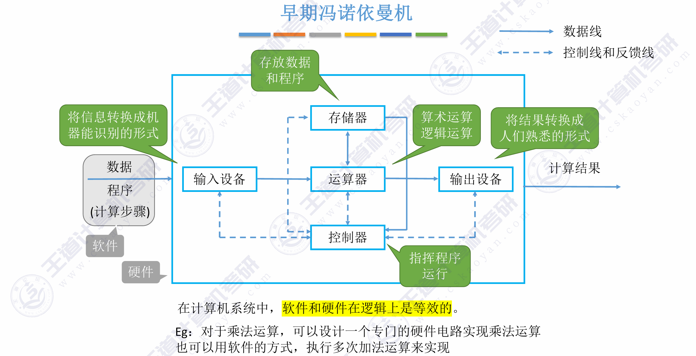

<h2 align="center">第一章 计算机系统概述</h2>

### 一、 计算机硬件的基本组成：软件+硬件

**冯·诺依曼架构**：

- 由五大部件组成：输入设备、输出设备、存储器、运算器、控制器 。
- 核心理念是**“存储程序”**：指令和数据以同等地位、用二进制形式事先输入主存储器，按地址寻访并顺序执行 。
- 传统冯·诺依曼机以**运算器**为中心，输入/输出设备与存储器之间的数据传送需通过运算器完成 。

- **现代计算机架构**：

  - 优化为以**存储器**为中心 。
  - 我们将运算器和控制器集成在了一起，统称为 **CPU** 。
  - **主机**由 CPU 和主存储器构成，其余如输入/输出设备和辅存统称为 I/O 设备（外设） 。

  

------

### 二、 核心硬件部件的工作原理

- **主存储器**：
  - 主要由存储体、**MAR**（存储地址寄存器）和 **MDR**（存储数据寄存器）组成 。
  - MAR 的位数反映了存储单元的个数，MDR 的位数等于存储字长（即每个存储单元的大小） 。
- **运算器**：
  - 用于实现算术运算和逻辑运算 。
  - 核心是 **ALU**（算术逻辑单元），配合使用的寄存器包括 **ACC**（累加器，存放操作数或运算结果）、**MQ**（乘商寄存器）以及 **X**（通用操作数寄存器） 。
- **控制器**：
  - 负责指挥程序的运行。核心是 **CU**（控制单元），负责分析指令并给出控制信号 。
  - **PC**（程序计数器）存放下一条要执行的指令地址，具有自动加 1 的功能 。
  - **IR**（指令寄存器）存放当前正在执行的指令 。
- **指令执行过程（核心重点）**：
  - **取指阶段**：$PC \rightarrow MAR$，随后内存中的指令被取出并送入 $MDR \rightarrow IR$ 。
  - **分析阶段**：指令的操作码部分 $OP(IR) \rightarrow CU$，由 CU 识别指令类型 。
  - **执行阶段**：根据不同指令的具体步骤，提取地址码 $Ad(IR) \rightarrow MAR$ 获取操作数并送入 ALU 进行运算 。

------

### 三、 计算机软件与系统层次结构

- **软件分类**：分为应用软件（解决某领域特定问题）和系统软件（如操作系统、DBMS，负责管理硬件资源并**向上提供服务**） 。
- **软硬件逻辑等价性**：同一个功能既可以用硬件实现（成本高、性能好），也可以用软件实现（成本低、性能稍差） 。软硬件之间的分界面是 **ISA（指令集体系结构）** 。
- **语言与翻译**：
  - 分为高级语言、汇编语言（使用助记符）和机器语言（二进制代码） 。
  - **编译程序**将高级语言一次性全部翻译为机器语言；**解释程序**则是翻译一句执行一句 。
- **程序运行全过程**：高级语言源程序需要经过**预处理 $\rightarrow$ 编译 $\rightarrow$ 汇编 $\rightarrow$ 链接**，最终生成机器可以执行的二进制可执行文件 。
- **五级层次结构**：从底层到高层依次为$$微程序机器 (M0)\rightarrow传统机器语言机器 (M1)\rightarrow操作系统机器 (M2)\rightarrow汇编语言机器 (M3)\rightarrow高级语言机器 (M4) $$
- **体系结构 vs 组成原理**：体系结构是指机器语言程序员所见到的计算机属性（如是否支持乘法指令）；而组成原理则是具体实现这些属性的底层硬件逻辑（如何用硬件实现乘法），这对程序员是“透明”的（即看不见的） 。

------

### 四、 计算机性能指标计算 (必考重点)

- **存储器容量**：$总容量 = 存储单元个数 \times 存储字长$ 。

- **CPU 指标**：

  - **时钟周期**：CPU 内最小的时间单位 。**主频**（时钟频率）就是时钟周期的倒数（单位通常为 Hz） 。
  - **CPI**：执行一条指令所需的时钟周期数 。
  - **CPU执行时间** $=$ $\frac{指令条数 \times CPI}{主频}$ 。
  - **IPS**：每秒执行指令数（$IPS = \frac{主频}{平均CPI}$） 。
  - **FLOPS**：每秒浮点运算次数 。

- **系统整体指标**：

  - **吞吐量**：单位时间内处理请求的数量，主要取决于主存的存取周期 。
  - **响应时间**：从发送请求到系统做出响应并获得结果的等待时间 。

- **单位陷阱**：描述存储容量时，$K = 2^{10}$，$M = 2^{20}$；而描述频率或速率时，$K = 10^3$，$M = 10^6$ 。

  