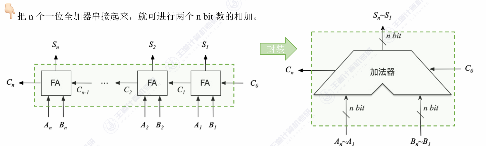

<h2 align="center">第二章 数据的表示和计算</h2>

### 一、数值与编码

#### （一）进位计数制及其相互转换

1. **基本概念**
   - **基数 ($r$)**：r进制数的基数为r，每个数码位可能出现r种字符。
   - **进位原则**：逢 $r$ 进 1。
   - **位权**：每个数码位对应的权重（如十进制的 $10^n$，二进制的 $2^n$）。
   - **r进制数值**：各数码位与其位权的乘积之和。
   - 公式：$K_nK_{n-1}...K_0.K_{-1}...K_{-m} = K_n \times r^n + ... + K_0 \times r^0 + K_{-1} \times r^{-1} + ... + K_{-m} \times r^{-m}$ 。
2. **为什么计算机使用二进制？**
   - 可以使用两个稳定状态的物理器件方便地表示。
   - 0和1正好对应逻辑值“假”和“真”，方便实现逻辑运算。
   - 可以很方便地使用逻辑门电路实现算术运算 。
3. **不同进制间的相互转换**
   - **任意进制 $\rightarrow$ 十进制**：按权展开相加 。
   - **二进制 $\leftrightarrow$ 八进制/十六进制**：
     - 二进制转八进制：每3个二进制位对应1个八进制位（3位一组） 。
     - 二进制转十六进制：每4个二进制位对应1个十六进制位（4位一组） 。
     - *注意：转换时要注意以小数点为中心向两边补位。*
   - **十进制 $\rightarrow$ 任意进制 ($r$进制)**：
     - **整数部分**：除基取余法。先取得的“余”是低位 。
     - **小数部分**：乘基取整法。先取得的“整”是高位 。
     - 注意：有的十进制小数（如0.3）无法用二进制精确表示，会产生无限循环 。

#### （二）定点数的表示（原码、反码、补码、移码）

##### 1. 机器数

- **真值**：实际的带正负号的数值，符合人类习惯的表示（如 +15, -8） 。
- **机器数**：数字实际存到机器里的形式，正负号被数字化（通常 0 表示正，1 表示负） 。

##### 2. 原码、反码、补码、移码

1. **原码**

- **定义**：用尾数表示真值的绝对值，符号位“0/1”对应“正/负” 。
- **特点**：真值0有两种表现形式（+0 和 -0的编码不同） 。
- **表示范围**（以字长n+1位为例）：
  - 整数：$-(2^n-1) \sim 2^n-1$ （关于原点对称） 。
  - 小数：$-(1-2^{-n}) \sim 1-2^{-n}$ 。

2. **反码**

- **定义**：正数反码与原码相同；负数反码，符号位不变，数值位全部取反 。
- **特点**：真值0同样有 +0 和 -0 两种表示 。它主要作为原码转补码的中间状态，实际中用处不大 。

3. **补码**

- **定义**：正数补码 = 原码；负数补码 = 反码末位 + 1（数值位取反加1） 。
- **特点**：
  - **真值0只有一种表示形式**（$[-0]*{补}$和$[+0]*{补}$均为全0） 。
  - **比原码和反码多表示一个负数**。例如8位字长补码可表示 -128 。
  - **$[[x]_补]_补 = [x]_原$**
- **表示范围**（以字长n+1位为例）：
  - 整数：$-2^n \sim 2^n-1$ 。
  - 小数：$-1 \sim 1-2^{-n}$ 。
- **由 $[x]_补$ 求 $[-x]_补$ 技巧**：符号位、数值位全部取反，末位+1 。

| **补码形式**   | **二进制表示** | **对应的十进制真值**   | **记忆口诀/意义**            |
| -------------- | -------------- | ---------------------- | ---------------------------- |
| **全 0**       | `0000 0000`    | **0**                  | 真值0唯一                    |
| **全 1**       | `1111 1111`    | **-1**                 | 全1即负1                     |
| **1 领头全 0** | `1000 0000`    | **-128**（即 $-2^7$）  | **规定最小的负数**，无原反码 |
| **0 领头全 1** | `0111 1111`    | **+127**（即 $2^7-1$） | **最大的正数**               |

4. **移码**

- **定义**：只能用于表示整数。在补码的基础上，将符号位取反 。
- **特点**：
  - 真值0只有一种表示（例如8位字长，0的移码为 10000000） 。
  - 表示范围与补码整数相同：$-2^n \sim 2^n-1$ 。
  - **方便对比大小**：移码全0真值最小，全1真值最大，数值随着移码的增大而增大 。

#### （三）整数的表示

在计算机内部，整数的表示是数据表示模块中最核心的基础内容。计算机受到物理器件的限制，只能用有限的二进制位（字长）来表示数值。

整数的表示主要分为两大类：**无符号整数（Unsigned Integer）** 和 **带符号整数（Signed Integer）**。

1. ##### 无符号整数的表示

无符号整数是指整个机器字长的所有二进制位都用来表示数值的大小，没有符号位，因此它只能表示非负数。

- **表示规则**：直接使用纯二进制数表示。
- **表示范围**：对于 $n$ 位二进制数，其表示范围是 **$0 \sim 2^n - 1$**。
  - 例如：8位无符号整数的范围是 $0 \sim 255$。
  - 例如：32位无符号整数的范围是 $0 \sim 4,294,967,295$。
- **主要应用场景**：通常用于表示地址、计数器、或者是那些物理意义上不可能为负的数据（如文件大小、数组长度等）。在C语言中对应 `unsigned int`、`size_t` 等类型。
- **越界特性**：当无符号整数超出最大范围时，会发生“回绕（Wrap-around）”，相当于对 $2^n$ 取模。例如 8 位下 $255 + 1 = 0$。

2. ##### 带符号整数的表示

带符号整数需要区分正数和负数。计算机通常将最高有效位（MSB，Most Significant Bit）作为**符号位**：`0` 表示正数，`1` 表示负数。其余各位为**数值位**。

在现代计算机系统中，带符号整数**一律采用补码（Two's Complement）**来表示。

1. 为什么采用补码？

虽然人类习惯看原码（符号位+绝对值），但计算机采用补码有两大决定性优势：

- **简化 ALU（算术逻辑单元）设计**：补码将减法运算完美地转化为了加法运算（利用模运算的性质）。CPU 内部只需要设计加法器，不需要单独的减法器硬件。
- **零的表示唯一**：在原码和反码中，`0` 都有两种表示（`+0` 和 `-0`）。补码中 `0` 的编码唯一（全0），这不仅消除了逻辑判断的麻烦，还让补码能多表示一个最小的负数（即 $100...00$）。

2. 表示范围

对于 $n$ 位带符号整数（1位符号位，n-1位数值位），其表示范围是 **$-2^{n-1} \sim 2^{n-1} - 1$**。

- 例如：8位带符号整数（如 C 语言的 `char` 或 `int8_t`），范围是 **$-128 \sim 127$**。
- 例如：32位带符号整数（如 C 语言的 `int`），范围是 **$-2,147,483,648 \sim 2,147,483,647$**。

3. 溢出（Overflow）

当带符号整数的运算结果超出了其能表示的范围时，就会发生溢出。

- **正溢出**：两个正数相加，结果变成了负数（符号位由0变1）。
- **负溢出**：两个负数相加，结果变成了正数（符号位由1变0）。
- *注意：一正一负相加，绝对不可能发生溢出。*

3. ##### 整数数据宽度的扩展

在底层操作中，经常需要将位数较少的整数放入位数较宽的寄存器中（例如 8 位整数放入 32 位寄存器），这就需要进行扩展操作，且必须保持其数值不变：

- **零扩展（Zero Extension）**：用于**无符号整数**。直接在多出来的高位全部填 `0`。
- **符号扩展（Sign Extension）**：用于**带符号整数（补码）**。在多出来的高位全部填补原本数据的**最高位（符号位）**。即正数高位全补 `0`，负数高位全补 `1`。

#### （四）c语言的整数类型及其转换

在C语言中，整数类型及其相互转换是理解底层数据表示和避免程序Bug的核心基础。C语言的整数转换不仅涉及数值的改变，更涉及底层二进制位（比特位）的重新解释、截断或扩展。

##### 一、 C语言的整数类型

C语言提供了多种不同长度的整数类型，并通过 `signed`（有符号，默认）和 `unsigned`（无符号）关键字来区分是否包含负数。

###### 1. 基本整数类型

标准C语言定义了以下基本整数类型（具体字节数取决于编译器和操作系统，通常遵循ILP32或LP64数据模型）：

- **`char`**：通常为 1 字节（8位）。用于存储字符或小整数。
- **`short` (或 `short int`)**：通常为 2 字节（16位）。
- **`int`**：最常用的整数类型，通常为 4 字节（32位），对应处理器的高效字长。
- **`long` (或 `long int`)**：在32位系统中通常为 4 字节，在64位系统（如Linux/macOS）中通常为 8 字节。
- **`long long` (或 `long long int`)**：C99标准引入，至少为 8 字节（64位）。

###### 2. 定宽整数类型 (`<stdint.h>`)

为了解决不同平台数据宽度不一致的问题，C99引入了 `<stdint.h>` 头文件，提供了明确位宽的类型，强烈建议在底层开发和跨平台开发中使用：

- **有符号**：`int8_t`, `int16_t`, `int32_t`, `int64_t`
- **无符号**：`uint8_t`, `uint16_t`, `uint32_t`, `uint64_t`

##### 二、 整数的底层表示

在现代计算机中，**有符号数一律采用补码（Two's Complement）表示**，而**无符号数采用纯原码（二进制形式）表示**。理解这一点是掌握类型转换的关键。

##### 三、 整数类型转换的核心规则

C语言中的类型转换分为**隐式转换**（编译器自动完成）和**显式转换**（强制类型转换，如 `(int)x`）。无论哪种方式，其底层的位级处理规则是一致的：

###### 1. 等长类型的转换（有符号与无符号之间）

**规则：底层二进制机器码保持不变，仅仅改变对这些位的“解释方式”。**

- **有符号 转 无符号**：负数会变成一个极大的正数。
  - 例如：`int8_t x = -1;`（补码为 `1111 1111`）转换为 `uint8_t` 后，机器码依然是 `1111 1111`，但会被解释为无符号数 `255`。
- **无符号 转 有符号**：如果最高位是1，原先的正数会变成负数。

###### 2. 长字长 转 短字长（截断 / 降级）

**规则：高位直接丢弃（截断），只保留低位。**

- 无论是无符号数还是有符号数，从宽类型强转为窄类型时（例如 `int` 转 `short`），直接砍掉多余的高位。
- **注意**：截断可能会改变数值的大小，也可能会改变符号（如果保留下来的最高位恰好是1）。

###### 3. 短字长 转 长字长（扩展 / 升级）

当小范围类型扩展为大范围类型时，为了保证转换前后的“数值相等”，需要对高位进行填充：

- **无符号数扩展（零扩展）**：高位全部填 `0`。
  - 例如：`uint8_t` 的 `1111 1111` (255) 扩展为 `uint16_t`，变成 `0000 0000 1111 1111` (依然是255)。
- **有符号数扩展（符号扩展）**：高位全部填充原数据的**符号位**（即最高位）。
  - 例如：`int8_t` 的 `-1`（`1111 1111`），最高位是1，扩展为 `int16_t` 时高位补1，变成 `1111 1111 1111 1111`（在16位下依然代表 -1）。
  - 如果是正数（符号位为0），则高位补0。

##### 四、 表达式中的隐式转换陷阱

在进行算术运算或比较时，C语言有一套复杂的“常规算术转换（Usual Arithmetic Conversions）”规则：

1. **整型提升（Integer Promotion）**：

   在任何表达式中，所有长度小于 `int` 的类型（如 `char`、`short`），在参与运算前都会**自动被提升为 `int`**。如果 `int` 无法表示其范围，则提升为 `unsigned int`。

2. **向宽类型看齐**：

   如果两个操作数类型不同，较窄的类型会自动转换为较宽的类型（例如 `int` 遇到 `double` 会转为 `double`）。

3. **⚠️ 致命陷阱：有符号与无符号的混合运算**：

   当 `int`（有符号）与 `unsigned int`（无符号）进行运算（加减乘除、比较大小）时，**有符号数会被隐式强制转换为无符号数**！

   - **经典易错代码**：

     ```c
     int a = -1;
     unsigned int b = 1;
     if (a > b) {
         printf("-1 居然大于 1！\n");
     }
     ```

     **解释**：由于 `b` 是 `unsigned int`，`a` 会被隐式提升为 `unsigned int`。`-1` 的底层补码全为1（`0xFFFFFFFF`），被解释为无符号数时等于 4294967295。因此 `a > b` 的结果为真。

##### 五、 总结建议

1. **明确位宽**：在涉及位运算、网络协议、文件读写等对长度敏感的场景，坚决使用 `<stdint.h>` 中的 `int32_t`、`uint8_t` 等定宽类型。
2. **避免混用**：尽量不要在同一个表达式（特别是循环条件和比较操作中）混合使用 `signed` 和 `unsigned` 整数，以防止隐式转换带来的越界或逻辑错误。如果必须混用，请使用显式强制转换 `( )` 明确你的意图。

### 二、运算方法和运算电路

#### （一）基础运算部件

1. **一位全加器**：

- 一位全加器它有 3 个输入端，2 个输出端：
- **3 个输入：** 
  - $A_i$：本位加数
  - $B_i$：本位被加数
  - $C_{i-1}$：来自低位的进位输入（Carry-in）
- **2 个输出：**
  - $S_i$：本位和（Sum）
  - $C_i$：向高位的进位输出（Carry-out）


- 本位和 $S_i$ 的表达式：$S_i$ 的特点是：当三个输入中有奇数个 1 时，$S_i$ 为 1。这完美契合**异或（XOR，$\oplus$）**的逻辑。
  - **公式**：**$S_i = A_i \oplus B_i \oplus C_{i-1}$**

- 进位输出 $C_i$ 的表达式：产生向高位进位（$C_i = 1$）的情况有两种：要么 $A_i$ 和 $B_i$ 都是 1（自己就产生进位），要么 $A_i$ 和 $B_i$ 中有一个是 1，且低位又传了一个进位过来。

  - **基本公式**：$C_i = A_iB_i + A_iC_{i-1} + B_iC_{i-1}$

  - **提取公因式后的常用公式**：**$C_i = A_iB_i + (A_i \oplus B_i)C_{i-1}$**

2. **串行进位加法器：**如果要实现一个 $n$ 位的串行进位加法器，只需要将 $n$ 个一位全加器串联起来即可。 

   - **连接方式**：第 $i$ 位的进位输出 $C_i$，直接连接到第 $i+1$ 位的进位输入 $C_i$ 端。
   - **数据流向**：最低位（第 0 位）的进位输入通常记为 $C_{-1}$（在做纯加法时为 0，在做减法变补码时为 1）。进位信号就像水波的涟漪（Ripple）一样，从最低位一层一层向最高位传递。
   - **优点**：
     - **结构简单**：就是单纯的“复制 + 粘贴”全加器单元。
     - **硬件成本极低**：使用的逻辑门数量最少，占用芯片面积小。
   - **缺点**：
     - **运算速度极慢**：高位运算必须等待低位进位，整体延迟与字长 $n$ 成正比。字长越长，加法器越慢。

3. **并行进位加法器（CLA）**：我们需要对一位加法器中 $C_i$ 的公式进行极其重要的抽象，提取出两个关键的中间变量：

   - **进位产生函数（Generate）：$G_i = A_i B_i$**
     - 含义：只要 $A_i$ 和 $B_i$ 都是 1，无论低位有没有进位，本位**必定**会产生一个向高位的进位。
   - **进位传递函数（Propagate）：$P_i = A_i \oplus B_i$** （也有教材用 $P_i = A_i + B_i$，两者在实际进位逻辑中等效）
     - 含义：如果 $A_i$ 和 $B_i$ 中有一个是 1，那么只要低位有进位传过来（$C_{i-1}=1$），这个进位就会顺着本位**传递**到高位去。
     
     在串行加法器中，我们是老老实实地一层一层代入计算的。但在并行加法器中，我们直接**在数学上把这个公式暴力展开**（以 4 位 CLA 为例，初始进位为 $C_{-1}$）：
     
   - $C_0 = G_0 + P_0 C_{-1}$

   - $C_1 = G_1 + P_1 C_0$

     $\rightarrow$ 代入 $C_0$：**$C_1 = G_1 + P_1 G_0 + P_1 P_0 C_{-1}$**

   - $C_2 = G_2 + P_2 C_1$

     $\rightarrow$ 代入 $C_1$：**$C_2 = G_2 + P_2 G_1 + P_2 P_1 G_0 + P_2 P_1 P_0 C_{-1}$**

   - $C_3 = G_3 + P_3 C_2$

     $\rightarrow$ 代入 $C_2$：**$C_3 = G_3 + P_3 G_2 + P_3 P_2 G_1 + P_3 P_2 P_1 G_0 + P_3 P_2 P_1 P_0 C_{-1}$**
     
     在这四个公式的最右侧，**没有任何一个高位进位依赖前一个低位进位**
     
     所有的 $C_0, C_1, C_2, C_3$，它们的计算只依赖于：
     
     1. 本位的 $A$ 和 $B$（隐藏在 $G$ 和 $P$ 中）
     2. 最低位的初始进位 $C_{-1}$

4. **带符号加法器**

在真实的 CPU 中，程序需要做判断（比如 `if (a > b)`），这就要求硬件在算完加减法之后，不仅要给出一个数值结果，还要给出这次运算的**“状态报告”**。

这就是**带标志加法器（Adder with Flags）\**的由来。它是在 $n$ 位加法器的基础之上，外挂了一套\**标志位生成逻辑**。它是组成原理“数据运算”向“指令系统（尤其是条件转移指令）”过渡的最核心部件。

- 带标志加法器的核心输入与输出

  - **输入端**：
    - **$A$**（$n$ 位被加数/被减数）
    - **$B$**（$n$ 位加数/减数）
    - **$Sub$（加减控制信号）**：这是灵魂所在。$Sub=0$ 时做加法，$Sub=1$ 时做减法。

  - **输出端**：
    - **$F$**（$n$ 位运算结果，即 $S$）
      - **四个状态标志（Flags）**：**OF、CF、SF、ZF**。

- 四大核心标志位的生成逻辑

1. **SF（Sign Flag，符号标志）**

- **逻辑**：**$SF = F_{n-1}$** （直接取结果的最高位）
- **含义**：表示运算结果的符号。$SF=1$ 表示结果为负，$SF=0$ 表示结果为正。
- *注意：SF 只有在进行带符号数（补码）运算时才有意义。对于无符号数，最高位只是一个普通的数值位，看 SF 毫无意义。*

2. **ZF（Zero Flag，零标志）**日

- **逻辑**：**$ZF = \overline{F_{n-1} + F_{n-2} + ... + F_0}$** （将结果的所有位进行**或非**运算）
- **含义**：只有当结果的每一位全都是 0 时，或门输出才为 0，取反后 $ZF=1$。只要有任何一位是 1，$ZF=0$。用于判断结果是否为 0，或者比较两个数是否相等（$A - B == 0$）。

3. **OF（Overflow Flag，溢出标志）**

- **逻辑**：**$OF = C_{n} \oplus C_{n-1}$** （最高位的进位输出 $C_n$ 异或 次高位的进位 $C_{n-1}$）
- **含义**：专用于**带符号数（补码）**的溢出判断。
  - 如果发生“正溢出”（正+正=负），符号位没有进位（$C_n=0$），但数值最高位向符号位进位了（$C_{n-1}=1$），异或结果为 1。
  - 如果发生“负溢出”（负+负=正），符号位有进位（$C_n=1$），但数值最高位没有向符号位进位（$C_{n-1}=0$），异或结果为 1。

4. **CF（Carry Flag，进位/借位标志）**

- **逻辑**：**$CF = C_{out} \oplus Sub$** （加法器最高位产生的实际进位 $C_{out}$ 异或 减法控制信号 $Sub$）
- **含义**：专用于**无符号数**。
  - **做加法时（$Sub=0$）**：$CF = C_{out} \oplus 0 = C_{out}$。最高位有进位，说明无符号数加法越界了。
  - **做减法时（$Sub=1$）**：$CF = C_{out} \oplus 1 = \overline{C_{out}}$。这里极其容易绕晕！在补码减法中，如果没有产生进位（$C_{out}=0$），反而说明**不够减，发生了借位**，此时 $CF=1$。如果产生了进位，说明够减，没有借位，$CF=0$。

5. ALU(算术逻辑单元)

- 输入与输出

  - **数据输入**：
    - **输入端 A 和 B**：通常是两个 $n$ 位的操作数（来自通用寄存器、暂存器等）。

  - **控制输入**：
    - **ALUop（操作控制信号）**：这通常是一组由**控制器（CU，Control Unit）**发出的几位二进制信号（例如 3 位或 4 位）。它决定了 ALU 当前这一步到底要做什么（是加、是减、是与、还是或）。我们在上一节提到的 `Sub` 信号，其实就是 ALUop 的其中一位。

  - **数据输出**：
    - **输出端 F（或 Y）**：$n$ 位的运算结果。

  - **状态输出**：
    - **标志位（Flags）**：就是我们刚刚讲过的 **OF, CF, SF, ZF**。它们会被送入标志寄存器（PSW / CC），供后续的条件转移指令使用。

#### （二）定点数的移位运算

定点数的移位运算主要分为三大类：**算术移位**、**逻辑移位**和**循环移位**。它们分别针对不同的数据类型和应用场景。

1. 算术移位（Arithmetic Shift）

- 算术左移：高位丢弃，低位补0
- 算术右移：低位抛弃，**高位补符号位**

2. 逻辑移位（Logical Shift）

**逻辑移位的对象是“无符号整数”（Unsigned）或纯粹的二进制位串（比如 IP 地址、RGB 颜色值）。**

它的核心原则是：**不区分什么符号位和数值位，把整个字长看作一个整体一起移动。**

规则极其简单粗暴，没有任何弯弯绕绕：

- **逻辑左移（SHL）**：整体左移，高位丢弃，**低位补 0**。
- **逻辑右移（SHR）**：整体右移，低位丢弃，**高位补 0**。

#### （三）定点数的加减计算

在《计算机组成原理》中，**定点数的加减运算**是整个运算器章节的绝对核心。现代计算机的设计哲学是“大道至简”——为了不增加额外的减法器硬件，**所有的定点数加减法最终全部转化为“补码的加法”来完成。**

以下是定点数加减法运算的核心逻辑以及在 11408 考研中的高频考点拆解：

##### 一、 核心运算公式（补码的天下）

不论是定点整数还是定点小数，补码加减法的运算规则完全一致。

1. 加法规则

- **公式**：**$[A + B]_补 = [A]_补 + [B]_补$**
- **操作**：按位直接相加，符号位与数值位同等对待，一起参与运算。如果符号位产生了向更高位的进位，**直接丢弃**（因为这相当于对 $2^{n+1}$ 取模）。

2. 减法规则

- **公式**：**$[A - B]_补 = [A]_补 + [-B]_补$**

- **操作**：减去一个数，等于加上这个数的相反数的补码。

- **关键步骤：已知 $[B]_补$，如何求 $[-B]_补$？**

  这就是我们在数据表示章节强调过的“连招”：**将 $[B]_补$ 的连同符号位在内的所有位按位取反，然后在最低位加 1。**

  *（回顾一下硬件实现：这正对应着 ALU 中 `Sub=1` 时，送入一排非门取反，并且向加法器最低位输入进位 $C_{in}=1$ 的操作。）RT*RT

##### 二、 核心难点：溢出判断

在使用有限的字长进行加减运算时，如果结果超出了该字长能表示的范围，就会发生**溢出（Overflow）**。

**注意前置条件**：只有在**“两个同号数相加”**或**“两个异号数相减”**时，才有可能发生溢出。一正一负相加绝对不可能溢出。

判断溢出有三种极其经典的方法，必须熟练掌握：

1. **单符号位逻辑判断法**

根据操作数和结果的符号位直接观察：

- **正溢出（上溢）**：正数 + 正数 = 负数（符号位 $0 + 0 \rightarrow 1$）。结果超出了最大正数范围。

- **负溢出（下溢）**：负数 + 负数 = 正数（符号位 $1 + 1 \rightarrow 0$）。结果超出了最小负数范围。

- *逻辑表达式*：设 $A$ 的符号为 $A_S$，$B$ 的符号为 $B_S$，结果的符号为 $S_S$。

  **$V = A_S B_S \overline{S_S} + \overline{A_S} \overline{B_S} S_S$** （V=1 表示溢出）。

2. **最高有效位进位判断法（底层硬件 ALU 最常用）**

这就是我们之前讲“带标志加法器”时提到的 **OF 标志位** 的生成逻辑。

- **规则**：观察**符号位产生的进位（$C_S$）\**和\**最高数值位产生的进位（$C_1$）**。
- **判断公式**：**$V = C_S \oplus C_1$**
  - 如果 $C_S$ 和 $C_1$ 只有一个是 1，说明发生了溢出（$V=1$）。
  - 如果 $C_S$ 和 $C_1$ 同为 0 或同为 1，说明没有溢出（$V=0$）。
- *原理解释*：以正溢出为例，两个正数相加，符号位本没有进位（$C_S=0$），但数值位太大了，向符号位进了一个 1（$C_1=1$），导致符号位变成了 1（变成负数），此时 $0 \oplus 1 = 1$，成功检测出溢出。

3. **双符号位法（变形补码 / 模4补码）**

这是专门为了方便硬件检测溢出而发明的一种编码，将单个符号位扩展为两个符号位：`00` 表示正，`11` 表示负。

- **运算规则**：两个符号位一起参与运算。
- **溢出判断**：运算完成后，观察结果的两个符号位 $S_{S1} S_{S2}$：
  - **`00`**：结果为正，无溢出。
  - **`11`**：结果为负，无溢出。
  - **`01`**：**正溢出**。最高位 0 代表最终本来应该是正数，但次高位 1 说明数值位进位破坏了符号位。
  - **`10`**：**负溢出**。
- *注意*：在双符号位中，真实的符号永远以**第一位（最高位）**为准。硬件上实现这种判断同样只需要一个异或门：$V = S_{S1} \oplus S_{S2}$。Z

##### 三、 考场避坑指南与综合联系

1. ##### **无符号数的“假溢出”**：

   以上讲的“溢出（Overflow）”概念，**仅针对带符号数（补码）**！

   如果题目明确说是**无符号数**进行加减，就算最高位产生了进位，那不叫溢出，那叫**进位/借位（Carry / Borrow）**，对应的是 ALU 里的 **CF 标志位**，而不是 OF 标志位。

   *经典陷阱题*：将 8 位无符号数 `1111 1111` (255) 和 `0000 0001` (1) 送入加法器，问 OF 和 CF 分别是多少？

   *答案*：CF=1（产生了最高位进位），OF=0（如果把它们当成补码 -1 和 +1 相加，结果是 0，一正一负相加绝对不溢出，所以 OF 为 0）。

2. **浮点数运算中的联动**：

   在浮点数加减法中，**尾数的运算**就是典型的定点小数补码加减法。尤其是浮点数的双符号位尾数运算（双符号位法在此处大量应用），如果尾数算出来是 `01.xxx` 或 `10.xxx`，不要慌，这只是尾数的**“假溢出”**，只需要进行一次**“右规”**（尾数右移 1 位，阶码加 1）就能抢救回来。浮点数真正的溢出只取决于**阶码**是否上溢。

掌握了定点数的补码加减法和溢出判断，你就拿下了整个运算器硬件运转的最核心骨架！

